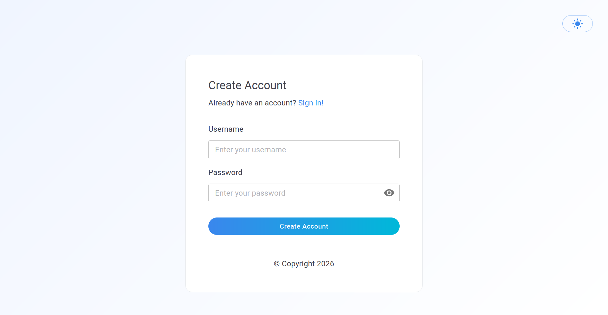

###

[](https://opensource.org/licenses/Apache-2.0)
[](https://github.com/thunder-id/thunderid/commits/main)
[](https://github.com/thunder-id/thunderid/issues)
[](https://codecov.io/github/thunder-id/thunderid?branch=main)
[](https://github.com/thunder-id/thunderid/releases/latest)


ThunderID is a lightweight, open-source Identity and Access Management (IAM) engine built to secure access for humans, AI agents, and machines.

Designed for the agentic era, ThunderID provides a developer-first IAM platform and supporting tools for securing applications, APIs, services, and agent-driven workflows across traditional and decentralized identity ecosystems, with post-quantum-ready security built in from the start.

Core design goals of ThunderID include:
- **Agent-native identity:** Manage AI agents as first-class identities with delegated authority, consent-aware access, traceability, and support for issuing verifiable credentials to agents. ThunderID also aims to expose IAM capabilities through interfaces that agents can use safely and programmatically.
- **Decentralized identity:** Bridge the adoption gap for relying parties by making it practical for service providers to consume, verify, and trust decentralized identity in real-world applications, including DIDs, verifiable credentials, digital wallets, trust registries, and issuer-verifier-holder interaction models.
- **Cloud-native IAM:** Provide a lightweight, containerized identity product that can run across on-premises and cloud environments, with declarative identity flows, policies, and configuration suitable for automation, versioning, and GitOps practices.
- **Post-quantum-safe security:** Build on a crypto-agile foundation where algorithms, key types, signing methods, and token protection mechanisms can evolve over time, including support for post-quantum-safe algorithms and hybrid transition approaches across key management, credential issuance, assertions, and secure service-to-service communication.

---

## 🚀 Features

- **Standards-Based**
  - OAuth 2/ OpenID Connect (OIDC): Client Credentials, Authorization Code, Refresh Token
- **Login Options:**
  - Basic Authentication (Username/Password)
  - Social Logins: Google, Github
  - SMS OTP
- **Registration Options:**
  - Username/Password
  - Social Registration: Google, Github
  - SMS OTP
- **RESTful APIs:**
  - App Native Login/Registration
  - User Management
  - Application Management
  - Identity Provider Management
  - Message Notification Sender Management

---

## ⚡ Quickstart

This Quickstart guide will help you get started with ThunderID quickly. It walks you through downloading and running the product, trying out the sample app, and exploring registering a user, logging in, and using the Client Credentials flow.

### Download and Run ThunderID

You can run ThunderID either by downloading the release artifact or using the official Docker image.

#### Option 1: Run from Release Artifact

Follow these steps to download the latest release of ThunderID and run it locally.

1. **Download the distribution from the latest release**

    Download `thunderid-<version>-<os>-<arch>.zip` from the [latest release](https://github.com/thunder-id/thunderid/releases/latest) for your operating system and architecture.

    For example, if you are using a MacOS machine with a Apple Silicon (ARM64) processor, you would download `thunderid-<version>-macos-arm64.zip`.

2. **Unzip the product**

    Unzip the downloaded file using the following command:

    ```bash
    unzip thunderid-<version>-<os>-<arch>.zip
    ```

    Navigate to the unzipped directory:

    ```bash
    cd thunderid-<version>-<os>-<arch>/
    ```

3. **Setup the product**

    You need to setup the server with the initial configurations and data before starting the server for the first time.

    If you are using a Linux or macOS machine:

    ```bash
    ./setup.sh
    ```

    If you are using a Windows machine:

    ```powershell
    .\setup.ps1
    ```

    **Note the id of the sample app indicated with the log line `[INFO] Sample App ID: <id>`.** You'll need it for the sample app configuration.

4. **Start the product**

    If you are using a Linux or macOS machine:

    ```bash
    ./start.sh
    ```

    If you are using a Windows machine:

    ```powershell
    .\start.ps1
    ```

    The product will start on `https://localhost:8090`.

#### Option 2: Run with Docker Compose

Follow these steps to run ThunderID using Docker Compose.

1. **Download the Docker Compose file**

    Download the `docker-compose.yml` file using the following command:

    ```bash
    curl -o docker-compose.yml https://raw.githubusercontent.com/thunder-id/thunderid/v0.39.0/install/quick-start/docker-compose.yml
    ```

2. **Start ThunderID**

    Run the following command in the directory where you downloaded the `docker-compose.yml` file:

    ```bash
    docker compose up
    ```

    This will automatically:
    - Initialize the database
    - Run the setup process
    - Start the ThunderID server

    **Note the id of the sample app indicated with the log line `[INFO] Sample App ID: <id>` in the setup logs.** You'll need it for the sample app configuration.

    The product will start on `https://localhost:8090`.

### Try Out the Product

#### Try out the ThunderID Console

Follow these steps to access the ThunderID Console:

1. Open your browser and navigate to [https://localhost:8090/console](https://localhost:8090/console).

2. Log in using the admin credentials created during the initial data setup (`admin` / `admin`).

#### Try Out with the Sample App

ThunderID provides two sample applications to help you get started quickly:

- **React Vanilla Sample** — Sample React application demonstrating direct API integration without external SDKs. Supports Native Flow API or Standard OAuth/OIDC.
- **React SDK Sample** — Sample React application demonstrating SDK-based integration using `@asgardeo/react` for OAuth 2.0/OIDC authentication.

##### React Vanilla Sample

1. **Download the sample**

    Download `sample-app-react-vanilla-<version>-<os>-<arch>.zip` from the [latest release](https://github.com/thunder-id/thunderid/releases/latest).

2. **Unzip and navigate to the sample app directory**

    ```bash
    unzip sample-app-react-vanilla-<version>-<os>-<arch>.zip
    cd sample-app-react-vanilla-<version>-<os>-<arch>/
    ```

3. **Configure the sample**

    Open `app/runtime.json` and set the `applicationID` to the sample app ID generated during "Setup the product":

    ```json
    {
        "applicationID": "{your-application-id}"
    }
    ```

4. **Start the sample**

    ```bash
    ./start.sh
    ```

    Open your browser and navigate to [https://localhost:3000](https://localhost:3000) to access the sample app.

    > 📖 Refer to the `README.md` inside the extracted sample app for detailed configuration options including OAuth redirect-based login.

##### React SDK Sample

1. **Download the sample**

    Download `sample-app-react-sdk-<version>-<os>-<arch>.zip` from the [latest release](https://github.com/thunder-id/thunderid/releases/latest).

2. **Unzip and navigate to the sample app directory**

    ```bash
    unzip sample-app-react-sdk-<version>-<os>-<arch>.zip
    cd sample-app-react-sdk-<version>-<os>-<arch>/
    ```

3. **Start the sample**

    ```bash
    ./start.sh
    ```

    Open your browser and navigate to [https://localhost:3000](https://localhost:3000) to access the sample app.

    > 📖 Refer to the `README.md` inside the extracted sample app for detailed configuration and troubleshooting.

##### Self Register and Login (React Vanilla Sample)

The React Vanilla sample supports user self-registration and login:

1. Open [https://localhost:3000](https://localhost:3000) and click **"Sign up"** to register a new user.

    <p align="left">
        
    </p>

2. After registration, use the same credentials to **"Sign In"**.

    <p align="left">
        
    </p>

3. Upon successful login, you'll see the home page with your access token.


#### Obtain System API Token

To access the system APIs of ThunderID, you need a token with system permissions. Follow the steps below to obtain a system API token.

1. Run the following command, replacing `<application_id>` with the sample app ID generated during "Setup the product."

```bash
curl -k -X POST 'https://localhost:8090/flow/execute' \
  -d '{"applicationId":"<application_id>","flowType":"AUTHENTICATION"}'
```
2. Extract the `executionId` value from the response.
```json
{"executionId":"<execution_id>","flowStatus":"INCOMPLETE", ...}
```

3. Run the following command, replacing `<execution_id>` with the `executionId` value you extracted above.
```bash
curl -k -X POST 'https://localhost:8090/flow/execute' \
  -d '{"executionId":"<execution_id>", "inputs":{"username":"admin","password":"admin", "requested_permissions":"system"},"action": "action_001"}'
```

4. Obtain the system API token by extracting the `assertion` value from the response.
```json
{"executionId":"<execution_id>","flowStatus":"COMPLETE","data":{},"assertion":"<assertion>"}
```

#### Try Out Client Credentials Flow

The Client Credentials flow is used to obtain an access token for machine-to-machine communication. This flow does not require user interaction and is typically used for server-to-server communication.

To try out the Client Credentials flow, follow these steps:

1. Create a Client Application

   Application creation is secured functionality, so you first need to obtain a system API token as mentioned in the "Obtain System API Token" section above.

   Run the following command, replacing `<assertion>` with the assertion value obtained from the previous step.

    ```bash
    curl -kL -X POST -H 'Content-Type: application/json' -H 'Accept: application/json' https://localhost:8090/applications \
    -H 'Authorization: Bearer <assertion>' \
    -d '{
        "name": "Test Sample App",
        "description": "Initial testing App",
        "inbound_auth_config": [
            {
                "type": "oauth2",
                "config": {
                    "client_id": "<client_id>",
                    "client_secret": "<client_secret>",
                    "redirect_uris": [
                        "https://localhost:3000"
                    ],
                    "grant_types": [
                        "client_credentials"
                    ],
                    "token_endpoint_auth_method": "client_secret_basic",
                    "pkce_required": false,
                    "public_client": false,
                    "scopes": ["api:read", "api:write"]
                }
            }
        ]
    }'
    ```

2. Obtain an Access Token

   Use the following cURL command to obtain an access token using the Client Credentials flow. Make sure to replace the `<client_id>` and `<client_secret>` with the values you used when creating the client application.

    ```bash
    curl -k -X POST https://localhost:8090/oauth2/token \
      -d 'grant_type=client_credentials' \
      -u '<client_id>:<client_secret>'
    ```

---

## Star History

[](https://www.star-history.com/#thunder-id/thunderid&type=date&legend=top-left)

---

## Contributing

Please refer to the [Contributing Guide](https://thunderid.dev/docs/next/community/contributing/overview) for the different ways to contribute to this project and the relevant guidelines.

For code contributions, refer to the [Contributing Code](https://thunderid.dev/docs/next/community/contributing/contributing-code/prerequisites) section for details on the prerequisites and instructions for running ThunderID in development mode.

## Documentation

Please refer to the [Documentation](https://asgardeo.github.io/thunder/docs/next/guides/getting-started/what-is-thunderid) for additional guidance on getting started with ThunderID and exploring its features, concepts, and usage.

<details>
<summary><h2>Advanced Setup & Configuration</h2></summary>

<details>
<summary><h3>Running with PostgreSQL Database</h3></summary>

#### Step 1: Start and Initialize PostgreSQL

1. Navigate to local-development directory

```bash
cd install/local-development
```

2. Start PostgreSQL Database in background

```bash
docker compose up -d 
```

3. View PostgreSQL Database logs

```bash
docker compose logs -f
```

4. Stop PostgreSQL Database

```bash
docker compose down
```

- Stop PostgreSQL Database and delete all data 

```bash
docker compose down -v
```

#### Step 2: Configure ThunderID to Use PostgreSQL

1. Open the `backend/cmd/server/repository/conf/deployment.yaml` file.
2. Update the `database` section to point to the PostgreSQL database:

    ```yaml
    database:
        config:
            type: "postgres"
            hostname: "localhost"
            port: 5432
            name: "configdb"
            username: "dbuser"
            password: "dbpassword"
            sslmode: "disable"
        runtime:
            type: "postgres"
            hostname: "localhost"
            port: 5432
            name: "runtimedb"
            username: "dbuser"
            password: "dbpassword"
            sslmode: "disable"
        user:
            type: "postgres"
            hostname: "localhost"
            port: 5432
            name: "userdb"
            username: "dbuser"
            password: "dbpassword"
            sslmode: "disable"
    ```

#### Step 3: Run the Product

   ```bash
   make run
   ```

The product will now use the PostgreSQL database for its operations.

</details>

</details>

## License

Licenses this source under the Apache License, Version 2.0 ([LICENSE](LICENSE)), You may not use this file except in compliance with the License.

---------------------------------------------------------------------------
(c) Copyright 2026 WSO2 LLC.
