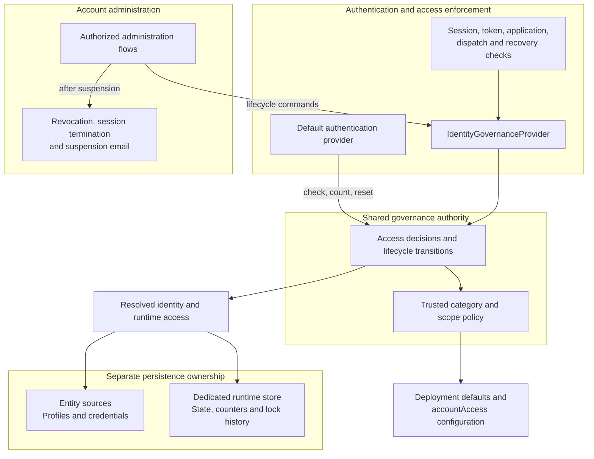

# Account Locks and Suspensions Specification

- **Status:** Draft
- **Version:** 0.1
- **Related documents:** [Design discussion #5368](https://github.com/thunder-id/thunderid/discussions/5368), [Feature issue #5073](https://github.com/thunder-id/thunderid/issues/5073)

## Summary

ThunderID needs to restrict account access without deleting identities or removing their credentials and assignments.

Two different situations require different controls:

- Repeated authentication failures require **automatic protection** against brute-force attempts.
- Suspected compromise requires **administrative containment** that stops account use while leaving the identity available for investigation and remediation.

This specification introduces automatic **locks**, administrative **suspension**, and the operations used to release them. It applies to users, agents, and applications, with automatic locking available for eligible user and agent sign-in methods.

The public account statuses are: `ACTIVE`, `LOCKED`, `SUSPENDED`.

Locks and suspensions are independent controls. A lock restricts authentication according to the configured policy and permits recovery. A suspension restricts account use until an authorized operator releases it. Operators manage these restrictions through `suspend`, `unsuspend`, and `unlock` administration flows.

## Architecture

The identity governance service owns access decisions and lifecycle transitions. Authentication, session, token, and flow components enforce its decisions through shared interfaces.



### Component responsibilities

| Component | Responsibility |
|---|---|
| Identity governance service | Evaluate restrictions, count eligible failures, form and clear locks, apply suspension, and derive effective status. |
| Policy resolver | Resolve category defaults and scope overrides using trusted identity metadata. |
| Default authentication provider | Verify credentials, report attributable failures once, check access after verification, and reset history after admission. |
| `IdentityGovernanceProvider` | Expose access checks and lifecycle operations to the embeddable engine. |
| Access enforcement components | Supply the target identity, operation, and applicable scope to governance; enforce the returned decision. |
| Entity sources | Own identity profiles and credentials. |
| Runtime store | Own lifecycle state, failure counters, lock history, and registered runtime attributes independently of profile write access. |
| Administration flows | Authorize lifecycle commands and coordinate revocation, session termination, and notifications. |
| Management APIs and Console | Expose effective status, execute configured administration flows, and manage deployment-wide policy. |

The default authentication provider and atomic authentication endpoints call governance directly. Downstream engine components use `IdentityGovernanceProvider`. Credential changes clear the relevant locks through the governance callback.

### Embedded engine and custom providers

The full server supplies the governance authority. Embedded hosts can supply their own provider or omit governance:

- **Provider omitted:** access checks are skipped and lifecycle commands are unavailable.
- **Provider configured:** access checks must succeed before access is admitted. An unavailable authority causes refusal.
- **No governed subject:** requests without a governed identity are distinct from failed identity reads. Application checks still apply where relevant.

Custom authentication providers govern their own identities during authentication. Shared downstream checks apply to the subjects and applications they produce when governance is configured.

## Detailed design

### Account states

| Status | Meaning | Persistence |
|---|---|---|
| `ACTIVE` | No applicable suspension or live lock. | Stored lifecycle state. |
| `LOCKED` | A live lock restricts one sign-in method or the whole account. | Derived from stored lock data and the current time. |
| `SUSPENDED` | An administrator has restricted account use. | Stored lifecycle state with suspension time and optional reason. |

Effective status follows this precedence: **`SUSPENDED` > `LOCKED` > `ACTIVE`**. `LOCKED` is never written as a lifecycle state value.

A suspension applies when either the state is `SUSPENDED` or suspension circumstances are present. Partial updates must not release access. Unknown states and unreadable required runtime data cause refusal.

#### Access behavior

| Operation | `ACTIVE` | Sign-in-method lock | Account-wide lock | `SUSPENDED` |
|---|---|---|---|---|
| New authentication | Normal checks | Refuse the held method | Refuse every method | Refuse every method |
| SSO reuse | Normal checks | Allow | Allow unless `block_sso_reuse` is enabled | Refuse |
| Token issuance and refresh | Normal checks | Allow | Allow unless `block_token_issuance` is enabled | Refuse |
| Self-service recovery | Allow | Allow | Allow | Refuse |
| Sign-in challenge dispatch | Allow | Refuse for the held method | Refuse | Refuse |
| Authorized profile and credential updates | Allow | Allow | Allow | Allow |
| Automatic expiry | Not applicable | At `unlockAt`, if finite | At `unlockAt`, if finite | Never |

Normal authentication and authorization requirements apply to every allowed operation. Locks do not terminate sessions or revoke tokens. Suspension flows perform those actions separately.

### Automatic locking

#### Sign-in methods and scopes

A **scope** identifies the service that verifies a secret. It is independent of a flow node or delivery channel. Operator-facing text uses **sign-in method**; configuration and API values use the scope identifiers below.

| Scope | Automatic behavior |
|---|---|
| `credential` | Lockable. Password, PIN, and secret-answer comparisons share this scope. |
| `otp` | Lockable. Email and SMS one-time codes share this scope. |
| `system_credential` | Count-only when policy is enabled. A client-secret failure cannot itself form a lock. |
| `passkey`, `magiclink`, `federated`, `openid4vp` | Not automatically lockable because their failures do not provide attributable bad-secret evidence. |
| `entity` | Reserved account-wide counter and lock key; not a credential type. |

Configuration cannot make an ineligible scope lockable. An account-wide lock nevertheless refuses every sign-in method, including methods whose failures cannot create a lock.

#### Failure attribution

Only a definite failed secret comparison against a resolved identity contributes to a counter. The authentication method returns evidence to the default authentication provider, which records the failure once.

The following do not increment a counter:

- Unknown or ambiguous identities.
- Missing credentials, expired codes, or malformed requests.
- Internal verification failures.
- Challenge generation or delivery.
- A correct secret refused because the account is locked.

Eligible failures during suspension can count. While an account-wide lock is live, further failure writes are suppressed. Failures against a locked method cannot extend that lock or advance its escalation history.

With account-wide granularity, countable failures share one counter. Client-secret failures can contribute to that counter, but lock formation still requires a lockable verification failure.

#### Threshold and escalation

A counted failure increments the effective scope's counter. The counter resets after the configured interval without a counted failure, measured from `lastFailedAt`. Reaching the threshold forms a lock only when that scope has no live lock.

Lock duration follows an ordered list:

1. The first lock uses the first duration.
2. Each subsequent lock uses the next duration.
3. The final duration repeats after the list is exhausted.
4. A positive decay interval after a finite lock ends returns the next lock to the first duration.

A duration of `0` creates a non-expiring lock. A decay interval of `0` disables time-based decay.

Governance calculates the lock episode. Persistence applies it through a guarded write that matches both the observed failure count and lockout count. Conflicts are re-read and retried within a bounded limit, preventing duplicate episodes from concurrent failures.

#### Expiry and reset

A finite lock applies while the current time is earlier than `unlockAt`. Expiry changes the access decision without a cleanup write or timer job. Non-expiring locks use `9999-12-31T23:59:59Z` internally; public responses omit their expiry.

| Event | Entries cleared |
|---|---|
| Admitted authentication | Presented scope and reserved account-wide entry, including failure and escalation history. |
| Credential replacement | Corresponding scope and account-wide entry as part of the credential-change operation. |
| Operator unlock | All scopes and their history. |

Clearing entries preserves suspension and unrelated runtime attributes. For example, password replacement clears a credential lock but leaves an independent OTP lock intact.

### Suspension and restoration

| Action | Users | Agents | Applications |
|---|---|---|---|
| `suspend` | Apply suspension | Apply suspension | Apply suspension |
| `unsuspend` | Replace suspension with a non-expiring account-wide lock | Remove suspension without adding a lock | Remove suspension without adding a lock |
| `unlock` | Clear all lock scopes and history | Clear all lock scopes and history | Not offered |

#### Suspension

Suspension records the time and an optional operator reason. The reason is explanatory text and does not affect access decisions. Authorized operators can update the identity and its credentials during investigation. Credential changes do not remove suspension.

#### User restoration

Unsuspending a user atomically replaces suspension with a non-expiring account-wide lock. The user must complete credential recovery, or an operator must unlock the account, before sign-in resumes.

This transition applies even when automatic locking is disabled. It must not expose an interval in which neither restriction applies.

#### Agent and application restoration

Unsuspending an agent or application does not create a recovery lock. Any independent agent lock remains in force.

Unlock does not remove suspension. Neither unsuspend nor unlock recreates revoked sessions, grants, or tokens. There is no administrative action to create an arbitrary lock.

### Access enforcement

| Enforcement point | Required check |
|---|---|
| Authentication admission | Check after credential verification and before admitting the identity. Count only eligible failure evidence. |
| Session persistence | Check before saving a fresh SSO checkpoint. |
| Authentication completion | Check before issuing a flow authentication assertion, including after SSO reuse, or returning a successful atomic authentication response. |
| Token construction | Check access-token, refresh-token, ID-token, and ID-JAG construction for governed subjects. |
| Application admission | Check OAuth client resolution and new or continued application-bound flows. |
| Challenge dispatch | Check before sending an OTP, magic link, or account-bound passkey challenge. |
| Recovery | Refuse suspended accounts; permit locked accounts and their required recovery challenges. |

A suspended application's refusal does not increment the user's failure counter. A withheld challenge uses the executor's existing no-delivery response and does not increment a counter.

#### Refusal disclosure

`disclose_hold_reason` determines whether an authentication refusal can identify a hold:

- **`never`:** use the sign-in method's existing authentication-failure response.
- **`always`:** permit the flow-level held outcome.

Neither setting exposes the operator's free-text suspension reason. Policy is selected from the trusted target category, never from a request parameter, flow input, or application setting. An unavailable configured authority refuses access through the applicable failure path.

### Administration flows

Lifecycle actions use the `ADMINISTRATION` flow type and `IdentityGovernanceExecutor`.

| Executor input | Contract |
|---|---|
| Mode | Explicitly select `suspend`, `unsuspend`, or `unlock`; no default. |
| `subject` | Resolved target identity. |
| `reason` | Optional suspension reason. |

The administration entry gate requires an authenticated caller with the root system permission. Default flows also validate permissions. Account ownership alone does not authorize lifecycle actions. The actor and automatic trigger are derived from trusted execution context.

#### Suspension sequence

The default suspend flow performs these steps:

1. Authorize the operator.
2. Apply suspension.
3. Revoke the subject's grants and tokens.
4. Terminate the subject's sessions.
5. Send the suspension notification.

Governance owns the state transition. The lifecycle executor publishes a trusted revocation plan for the subsequent executors. Unsuspend and unlock flows do not run revocation steps.

#### Failure behavior and containment scope

A failure in revocation, session termination, or notification does not undo suspension. Access checks continue to refuse the account, and the flow reports its outcome for operator follow-up. Repeated operations do not guarantee exactly-once notification delivery.

Revocation is subject-based. Suspending an application does not revoke every user token issued through it. Downstream APIs that validate only token signatures and expiry can continue accepting issued tokens; immediate rejection requires validation against current revocation information.

### Notifications and operational records

#### Suspension notifications

Default suspend flows use `EmailExecutor` with the `ACCOUNT_SUSPENDED` template. Deployments customize notifications through the administration flow.

#### Automatic-lock notifications

Automatic user locks support opt-in email notifications. Governance schedules the notice after committing a new lock and reuses the existing template service and email client.

Delivery follows these rules:

- Only the successful lock-formation writer schedules a notice.
- Delivery is asynchronous, bounded, and best effort.
- The recipient comes from the trusted current user record, using the configured attribute and user-type override.
- Missing or invalid recipients, unavailable templates, full queues, and delivery failures are recorded without affecting the lock or authentication response.

The design does not provide a durable outbox or exactly-once delivery. Agent-lock, unlock, expiry, and post-suspension-lock notifications are outside this notification contract.

#### Operational records

Lifecycle actions and lock formation record the target, action or scope, and available execution context. Secrets and tokens must not be logged.

### Scope exclusions

This specification does not define:

- Additional lifecycle states or soft deletion.
- Administrator-initiated credential recovery.
- Organization-owned policies or delegated helpdesk permissions.

### Data model

#### Runtime record

ThunderID stores lifecycle state and registered runtime attributes in a dedicated `ENTITY_RUNTIME_DATA` table. Database-backed, declarative, and secondary-store identities use the same runtime persistence model.

Existing entity tables and external identity sources retain ownership of profiles and credentials. Runtime-only operations must work when the profile source is read-only.

| Logical field | Contract |
|---|---|
| Deployment and entity identifiers | Identify the record through trusted deployment context and the source's stable identity identifier. |
| State | Store `ACTIVE` or `SUSPENDED`; derive `LOCKED` from lock data. |
| Runtime attributes | Store registered server-owned values, including `accessState` and credential-change evidence. Do not copy the profile's entire system-attribute document. |
| Creation and update timestamps | Describe the runtime record. Runtime mutations must not change profile timestamps. |

Only resolved identities can acquire runtime records. Unknown usernames must not allocate rows. The model must support identities without a row in `ENTITY`.

#### Access-state document

The `accessState` document stores failure history, lock episodes, and suspension circumstances:

```json
{
  "accessState": {
    "lock": {
      "authenticationMethods": {
        "credential": {
          "failureCount": 0,
          "lastFailedAt": "2026-09-16T10:00:00Z",
          "lockCount": 1,
          "unlockAt": "2026-09-16T10:05:00Z"
        }
      }
    },
    "suspend": {
      "suspendedAt": "2026-09-16T10:01:00Z",
      "reason": "Account under investigation"
    }
  }
}
```

Account-wide locking uses `lock.entity` with the same counter and expiry fields. Unsuspending a user replaces the lock member with an entity entry containing the non-expiring timestamp and internal reason `POST_SUSPENDED`.

A live entity entry takes precedence over method entries. Writers must not create simultaneously active aggregate and method representations. Suspension state and circumstances participate together in enforcement.

#### Write consistency

Runtime writes must preserve these invariants:

- Generic profile updates cannot overwrite runtime data or restore stale counters.
- Declarative resources cannot supply live failure counters, lock episodes, or caller-owned suspension evidence.
- Increments, lock formation, resets, and lifecycle transitions use atomic or guarded updates with bounded conflict handling.
- Concurrent runtime-row creation preserves the same guarantees as updates.
- User unsuspension replaces suspension with its recovery lock atomically.
- Credential replacement coordinates its runtime evidence and lock clear through a transaction or recoverable ordering.

Missing, corrupt, unavailable, and incompletely migrated runtime data require distinct handling. None may erase an established restriction.

#### Migration

Migration must preserve suspensions, finite and permanent locks, counters, escalation history, credential-change evidence, and runtime timestamps.

Before switching runtime authority, the migration must fence previous writers. After cutover, one runtime store is authoritative. Rollback must preserve mutations made after cutover.

#### Reads and caching

Access checks require current restrictions. Management lists require status projections across multiple identities. Profile-only operations do not require runtime data unless they consume a runtime field.

Read and cache strategies must be selected per consumer, with no unconditional joins on profile operations or separate runtime lookup for every list row. Cache publication follows committed mutations and must account for concurrent readers and multiple nodes.

Validation must compare equivalent requests against a recorded baseline under warm and cold caches. Measurements cover query counts, latency, rows and bytes, and cache operations, including PostgreSQL concurrency, SQLite behavior, management lists, and sign-in with profile writes rejected.

### API

#### Management status

User, agent, and application reads expose a read-only `status` object. Status details follow the same precedence as the status value:

| Status | Details |
|---|---|
| `ACTIVE` | No additional details. |
| `LOCKED` | Reason `FAILED_ATTEMPTS` or `SUSPENSION_RELEASED`, with `lockedScopes`. |
| `SUSPENDED` | Reason `ADMINISTRATIVE_SUSPENSION`, suspension time, and optional operator note. |

```json
{
  "status": {
    "value": "SUSPENDED",
    "details": {
      "reason": "ADMINISTRATIVE_SUSPENSION",
      "since": "2026-09-16T10:01:00Z",
      "note": "Account under investigation"
    }
  }
}
```

Each `lockedScopes` entry contains a `scope` and, for a finite lock, `expiresAt`. Account-wide locks use `scope: entity`. An omitted expiry means no automatic expiry.

Notes and lock circumstances are available only through authorized management reads. Status describes recorded live restrictions; policy determines the access operations those locks restrict.

#### Lifecycle operations

Lifecycle actions use existing flow resolution and execution APIs. There are no direct suspend, unsuspend, or unlock endpoints. Generic profile updates cannot set lifecycle state or runtime attributes.

#### Runtime configuration

| Endpoint | Behavior |
|---|---|
| `GET /server-config/accountAccess` | Return `readOnly`, `writable`, and `merged` configuration layers. |
| `PUT /server-config/accountAccess` | Replace the writable layer and return the recomputed layers. |

Existing management API authorization applies. `PUT` replaces the layer; omitted previous overrides are removed. The following request overrides only the user's default threshold, with all other values inherited:

```json
{
  "user": {
    "default": {
      "threshold": 6
    }
  }
}
```

The section validates supplied fields and the merged policy before persistence. Invalid input returns the configuration-validation error without changing stored configuration.

After a successful write, the resolver refreshes its in-memory snapshot. A refresh failure retains the last valid snapshot. Startup uses deployment configuration until a section snapshot is available.

### UI

#### Account status and actions

The Console displays effective status on user, agent, and application management views. Actions are available only when their configured administration flows resolve.

| Action | Confirmation behavior |
|---|---|
| Suspend | Collect an optional reason and explain the access restriction. |
| Unsuspend user | Explain that credential recovery or a separate unlock is required before sign-in resumes. |
| Unsuspend agent or application | Release suspension without implying that independent locks are cleared. |
| Unlock user or agent | Explain that all locks are cleared while suspension remains. |

Applications offer suspend and unsuspend. Users and agents also offer unlock. There is no manual lock action or direct API fallback for unavailable flows.

#### Account lock settings

**Settings > Account lock** contains separate user and agent cards with these controls:

- Automatic locking enabled or disabled.
- **Only the sign-in method that failed** or **The whole account**.
- Failure threshold and inactivity window.
- Lock durations and escalation decay.

Per-method overrides remain available through configuration and the API. The screen does not expose application-lock or notification controls.

Saving preserves unrelated writable overrides and stores differences against lower layers. It must not copy the entire effective policy into the writable layer. Load and save failures remain visible and cannot be presented as successful changes.

### Configuration

#### Scope and inheritance

Lockout configuration is deployment-wide and selected from the target's trusted category. Notification overrides by user type do not change lockout policy selection.

Configuration uses two naming conventions:

- `account_access` in `deployment.yaml`: snake_case keys.
- `accountAccess` in the server-config API: camelCase keys.

Layers apply in this order, with later layers overriding earlier values:

1. Product defaults.
2. Deployment configuration.
3. Declarative server-config section.
4. Writable server-config section.

Within a category, the selected `scopes` entry overlays `default` field by field. Entity granularity selects `scopes.entity`; authentication method granularity selects the presented method's scope.

#### Lockout settings

| Deployment key | Runtime-section key | Meaning and validation |
|---|---|---|
| `lock_granularity` | `lockGranularity` | `authentication_method` or `entity`; default `authentication_method`. |
| `enabled` | `enabled` | Enables the automatic policy; explicit false is distinct from absence. |
| `threshold` | `threshold` | Positive for an enabled effective policy. |
| `failure_window_seconds` | `failureWindowSeconds` | Positive inactivity interval for an enabled effective policy. |
| `lock_durations_seconds` | `lockDurationsSeconds` | Nonempty list for an enabled policy; each duration is nonnegative; zero means non-expiring. |
| `lock_decay_seconds` | `lockDecaySeconds` | Nonnegative interval after a finite lock ends; zero means no decay. |
| `block_sso_reuse` | `blockSsoReuse` | Refuse session persistence and authentication completion for a locked account, including SSO reuse. Does not terminate sessions. Default false; entity granularity only. |
| `block_token_issuance` | `blockTokenIssuance` | Refuse token construction for a locked subject, including authorization-code exchange, refresh-token grants, and new refresh tokens. Does not revoke issued tokens. Default false; entity granularity only. |
| `disclose_hold_reason` | `discloseHoldReason` | `never` or `always`; default `never`. |

Validation rejects unknown fields or scopes, negative values, invalid enumerations, and enabled merged policies without a valid threshold, window, or duration list. Omitted values inherit. Explicit zero retains its documented meaning.

The scope registry determines locking capability. Session and issuance flags are inactive under authentication method granularity; setting them in that mode is not a validation error.

#### SSO reuse and token issuance

Both settings default to false and apply only under `lock_granularity: entity`.

**`block_sso_reuse`** prevents completing sign-in through an existing SSO session while an account-wide lock applies. Its session access check also runs:

- Before saving a fresh SSO checkpoint.
- Before producing a flow authentication assertion, including after loading an SSO checkpoint.
- Before returning a successful atomic authentication response, including requests that skip assertion creation.

The setting does not terminate stored sessions, invalidate their cookies, or log users out of applications. New credential authentication is independently refused by the account-wide lock; these checks also cover a lock introduced while a flow is running.

**`block_token_issuance`** refuses new access, refresh, ID, and ID-JAG tokens for a held governed subject. It covers authorization-code exchange and refresh-token grants, including refresh requests with rotation disabled.

The setting does not revoke the submitted refresh token or previously issued tokens. Blocking SSO reuse alone does not block refresh-token grants. After a lock ends, otherwise valid and unrevoked sessions and refresh tokens can be used again.

Subject checks require `SubjectEntityID`; an empty value skips the subject check, including on refresh tokens without that claim. Application admission remains a separate check. Suspension refuses governed subjects regardless of either flag and separately triggers revocation and session termination through its administration flow.

#### Default policies

| Category | Enabled | Threshold | Failure window (seconds) | Lock durations (seconds) | Decay (seconds) |
|---|---|---|---|---|---|
| User | Yes | 5 | 3600 | 300, 900, 1800, 3600 | 86400 |
| Agent | No | 10 | 900 | 300, 900 | 3600 |

Product defaults ship one policy per category and no per-sign-in-method override. The `scopes` overlay remains a supported capability rather than a shipped default: a deployment that wants a different one-time-password policy sets `account_access.<category>.scopes.otp` in `deployment.yaml`, and that entry overlays `default` field by field. A shipped override would commit every deployment to a second set of numbers it did not choose, and would make a management view that presents one policy per category misreport the effective policy.

Applications have no automatic-lock capability. Disabling a per-method policy bypasses its method holds without rewriting stored history. It cannot remove suspension or bypass a live entity-wide hold. Changing granularity must continue recognizing a live entity-wide entry.

#### Automatic-lock email

Email configuration is deployment-file-only under `account_access.user.notifications.on_lock.email`.

| Setting | Behavior |
|---|---|
| `enabled` | Master switch; defaults to false. |
| `recipient_attribute` | Recipient attribute on the trusted user record; defaults to `email`. |
| `user_types.<type>` | Exact stored user-type match; overrides the recipient attribute or disables delivery for that type. |

The master switch is required even when an override enables delivery. Notification changes require reinitialization. The runtime configuration section does not accept `notifications`, because the notifier is constructed once at startup and a section field would accept a change it could not apply. Transport and sender settings use the existing email configuration.

A `sender` field per channel names a configured notification sender, with the same inheritance and override rules as `recipient_attribute`: absent inherits, an explicit empty value is invalid, and a per-type value replaces the choice rather than expressing a preference. Absent at every level means the deployment mail client. An `sms` sibling block carries its own master switch, recipient attribute, and a sender that is required when that switch is on, because there is no deployment-wide SMS fallback to inherit.

These settings inherit the deployment-file-only constraint rather than an exemption from it. A runtime-editable notification section requires a notifier that can be rebound without a restart.

#### Lifecycle flow selection

Lifecycle flow handles are configured in the `flow` server-config section:

| Key under `flow` | Default handle |
|---|---|
| `userSuspendFlow.defaultHandle` | `default-user-suspend-flow` |
| `userUnsuspendFlow.defaultHandle` | `default-user-unsuspend-flow` |
| `userUnlockFlow.defaultHandle` | `default-user-unlock-flow` |
| `agentSuspendFlow.defaultHandle` | `default-agent-suspend-flow` |
| `agentUnsuspendFlow.defaultHandle` | `default-agent-unsuspend-flow` |
| `agentUnlockFlow.defaultHandle` | `default-agent-unlock-flow` |
| `applicationSuspendFlow.defaultHandle` | `default-application-suspend-flow` |
| `applicationUnsuspendFlow.defaultHandle` | `default-application-unsuspend-flow` |

A handle must resolve to an administration flow before the action is offered. Flow availability does not grant permission to execute it.

## Requirements

### R1. Independent locks and suspensions

**Requirement:** Account status and access decisions distinguish automatic protection from administrative containment.

**Acceptance criteria:**

- **AC1.1:** Given a suspended account with a live lock, when its status is read, then it reports `SUSPENDED` and suspension details.
- **AC1.2:** Given a timed lock with no suspension, when its expiry passes, then that lock no longer restricts access or contributes `LOCKED` status, without a cleanup write.
- **AC1.3:** Given a suspension, when a credential changes, a lock expires, or an operator unlocks, then the suspension remains.

### R2. Attributable automatic protection

**Requirement:** Only eligible, attributable failures form automatic locks, with one count per failed verification.

**Acceptance criteria:**

- **AC2.1:** Given an enabled lockable scope and a threshold of N, when N eligible failures occur without the inactivity reset, then a lock forms for the effective scope.
- **AC2.2:** Given an unknown identity, expired OTP, malformed request, challenge-only operation, or verification fault, when authentication fails, then it creates no attributable failed-secret count.
- **AC2.3:** Given a live lock, when the correct secret is supplied, then access remains refused without extending the lock.
- **AC2.4:** Given a client-secret failure, when it is counted, then that failure cannot itself form a lock.

### R3. Configurable scope and escalation

**Requirement:** Lockout policy supports method and account-wide protection with bounded escalation behavior.

**Acceptance criteria:**

- **AC3.1:** Given authentication method granularity, when the credential scope locks, then OTP and other methods are not locked by that episode, and sessions and issuance remain usable.
- **AC3.2:** Given entity granularity, when a lock forms, then every sign-in method is refused; sessions and issuance are refused only if their respective flags are enabled.
- **AC3.3:** Given repeated lockouts without reset or decay, when new episodes form, then durations follow the configured order and repeat the final rung.
- **AC3.4:** Given a zero-duration rung, when it is selected, then time alone does not release the lock.
- **AC3.5:** Given an expired finite lock and an elapsed positive decay interval, when another lock forms, then it uses the first rung.

### R4. Suspension and deliberate restoration

**Requirement:** Authorized operators can contain an identity and release restrictions through the defined lifecycle actions.

**Acceptance criteria:**

- **AC4.1:** Given an authorized suspend flow and an optional reason, when it succeeds, then the identity is suspended, remains editable, and exposes the recorded reason only on authorized management reads.
- **AC4.2:** Given a suspended user, when unsuspend succeeds, then a non-expiring account-wide lock replaces the suspension without an unrestricted interval.
- **AC4.3:** Given a suspended agent or application, when unsuspend succeeds, then no new recovery lock is added and any independent agent lock remains.
- **AC4.4:** Given an authorized user or agent unlock, when it succeeds, then all lock scopes and their history are cleared without changing suspension.
- **AC4.5:** Given an account owner without administration authority, when they attempt a lifecycle operation, then ownership does not authorize it.

### R5. Consistent access enforcement

**Requirement:** Restrictions apply at authentication, session, token, application, challenge, and recovery boundaries.

**Acceptance criteria:**

- **AC5.1:** Given a suspended subject, when it attempts authentication, session reuse, issuance, refresh, or self-service recovery, then access is refused.
- **AC5.2:** Given a suspended application, when a new or continued application-bound flow or OAuth client admission is attempted, then it is refused without incrementing a user's counter.
- **AC5.3:** Given a restriction covering a sign-in challenge, when dispatch is attempted, then no challenge is sent and the existing no-delivery outcome is used.
- **AC5.4:** Given a configured authority that cannot read required state, when access is checked, then the request is refused rather than admitted.
- **AC5.5:** Given an embedded engine without governance, when normal authentication runs, then governance is skipped and lifecycle commands remain unavailable.

### R6. Recovery and reset

**Requirement:** Proof of control clears relevant automatic protection without releasing administrative containment.

**Acceptance criteria:**

- **AC6.1:** Given recorded failures below threshold, when an authentication is admitted, then the presented scope's counter and escalation history reset.
- **AC6.2:** Given a password lock or post-suspension entity lock, when password replacement completes, then the credential and entity entries clear while any independent OTP lock or suspension remains.
- **AC6.3:** Given a locked, unsuspended user, when self-service recovery is requested, then the lock does not prevent the recovery path or its required challenge.

### R7. Composed containment and notifications

**Requirement:** Lifecycle side effects follow committed restrictions without becoming the authority for access.

**Acceptance criteria:**

- **AC7.1:** Given the default suspend flow, when it completes, then the subject's sessions are terminated and its grants/tokens are revoked through the existing services.
- **AC7.2:** Given a committed suspension and a later side-effect failure, when access is attempted, then the suspension still refuses access.
- **AC7.3:** Given an automatic lock, when it forms, then it neither terminates sessions nor revokes tokens.
- **AC7.4:** Given enabled user lock email and a valid recipient, when a new automatic episode commits, then only the successful formation schedules its best-effort notice; repeated failures schedule no new episode notice.
- **AC7.5:** Given a failed or skipped notice, when the authentication response is produced, then the lock remains and the response does not reveal the delivery outcome.
- **AC7.6:** Given a configured sender for a channel, when a notice is delivered, then it is delivered through that sender; and given a sender that is absent, of the wrong type, or unable to serve the channel, then the notice is skipped with a recorded outcome and no other sender is tried.
- **AC7.7:** Given any authentication request, application setting, flow input, or profile attribute, when a notice is scheduled, then none of them can select or influence the sender.
- **AC7.8:** Given a sender that is misconfigured, unreachable, or removed, when a lock forms, then the lock is formed, enforced, and released exactly as it would be with notification disabled.

### R8. Dedicated runtime ownership

**Requirement:** Runtime restrictions remain writable independently of profile-source write access.

**Acceptance criteria:**

- **AC8.1:** Given a resolved database-backed or declarative identity and a read-only profile source, when runtime failures, locks, or resets are persisted, then only the dedicated runtime authority changes.
- **AC8.2:** Given concurrent eligible failures, when a threshold is reached, then no increments are lost and competing formation writes do not create duplicate episodes from one observation.
- **AC8.3:** Given a profile update concurrent with a runtime mutation, when both complete, then the profile update cannot overwrite runtime data or reset its counters.
- **AC8.4:** Given an unknown identifier, when authentication fails, then no runtime row is allocated for that identifier.

### R9. Runtime policy and management visibility

**Requirement:** Operators can inspect restrictions and change lockout policy without replacing deployment defaults unintentionally.

**Acceptance criteria:**

- **AC9.1:** Given deployment settings and no section overrides, when `accountAccess` is read, then `merged` contains the effective deployment policy.
- **AC9.2:** Given a valid writable replacement, when it is saved, then the recomputed policy is published to the resolver without a configuration read on each access check.
- **AC9.3:** Given an invalid effective policy, when it is submitted, then validation rejects it without changing persisted configuration.
- **AC9.4:** Given a locked account, when an authorized management read occurs, then it reports the applicable stored scope entries and finite expiries, omitting expiry for non-expiring entries.
- **AC9.5:** Given default disclosure settings, when a held account attempts sign-in, then its refusal uses the existing method failure response without revealing the operator note or lock details.

### R10. Console lifecycle controls

**Requirement:** The Console exposes the supported operations through configured flows and preserves configuration inheritance.

**Acceptance criteria:**

- **AC10.1:** Given an unavailable lifecycle flow, when an identity edit page loads, then that action is not offered and no direct lifecycle API fallback is used.
- **AC10.2:** Given a user unsuspend confirmation, when it is shown, then it explains that recovery or a separate unlock is required before sign-in resumes.
- **AC10.3:** Given the Account lock settings page, when it loads, then it presents user and agent controls without an application-lock card or per-method override cards.
- **AC10.4:** Given an edit to one policy field, when the Console saves, then unrelated writable overrides are preserved and inherited values are not copied wholesale into the writable layer.

## Change log

| Version | Date | Change |
|---|---|---|
| 0.1 | 2026-09-17 | Initial specification for account locks, suspension, administration flows, management controls, and runtime persistence. |
