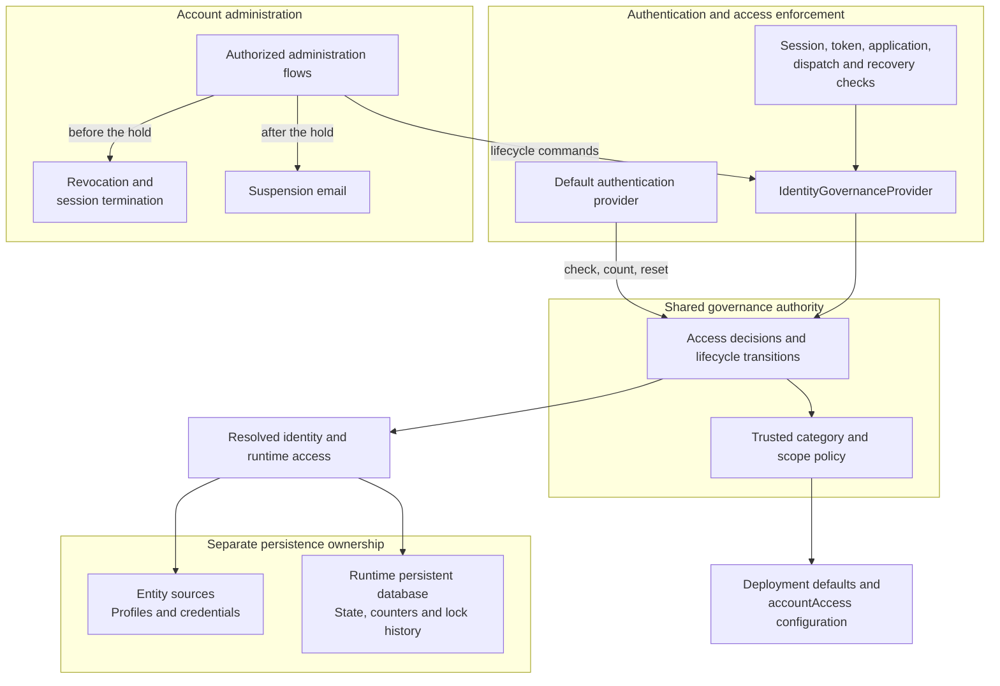

# Account Locks and Suspensions Specification

- **Status:** Draft
- **Version:** 0.1
- **Related documents:** [Design discussion #5368](https://github.com/thunder-id/thunderid/discussions/5368), [Feature issue #5073](https://github.com/thunder-id/thunderid/issues/5073)

## Summary

ThunderID needs to restrict account access without deleting identities or removing their credentials and assignments.

Two different situations require different controls:

- Repeated authentication failures require **automatic protection** against brute-force attempts.
- Suspected compromise requires **administrative containment** that stops account use while leaving the identity available for investigation and remediation.

This specification introduces automatic **locks**, administrative **suspension**, and the operations used to release them. It applies to users, agents, and applications, with automatic locking available for eligible user and agent sign-in methods.

The public account statuses are: `ACTIVE`, `LOCKED`, `SUSPENDED`.

Locks and suspensions are independent controls. A lock restricts new authentication and challenge dispatch according to the configured policy, leaves existing sessions and tokens alone, and permits recovery. A suspension restricts account use at every plane until an authorized operator releases it. Its flow checks that the operator may suspend the target, revokes the covered tokens and terminates the sessions the identity already holds, and then commits the hold. Operators manage these restrictions through `suspend`, `unsuspend`, and `unlock` administration flows.

## Architecture

The identity governance service owns access decisions and lifecycle transitions. Authentication, session, token, and flow components enforce its decisions through shared interfaces.


```mermaid
flowchart TD
    subgraph ENGINE["Authentication and access enforcement"]
        AUTH["Default authentication provider"]
        GATES["Session, token, application,<br/>dispatch and recovery checks"]
        SDK["IdentityGovernanceProvider"]
        GATES --> SDK
    end

    subgraph ADMIN["Account administration"]
        FLOWS["Authorized administration flows"]
        EFFECTS["Revocation and<br/>session termination"]
        NOTICE["Suspension email"]
        FLOWS -->|"before the hold"| EFFECTS
        FLOWS -->|"after the hold"| NOTICE
    end

    AUTH -->|"check, count, reset"| GOV
    SDK --> GOV
    FLOWS -->|"lifecycle commands"| SDK

    subgraph GOVERNANCE["Shared governance authority"]
        GOV["Access decisions and lifecycle transitions"]
        POLICY["Trusted category and scope policy"]
        GOV --> POLICY
    end

    POLICY --> CONFIG["Deployment defaults and<br/>accountAccess configuration"]
    GOV --> DATA["Resolved identity and runtime access"]

    subgraph STORAGE["Separate persistence ownership"]
        PROFILE["Entity sources<br/>Profiles and credentials"]
        RUNTIME["Runtime persistent database<br/>State, counters and lock history"]
    end

    DATA --> PROFILE
    DATA --> RUNTIME
```

### Component responsibilities

| Component | Responsibility |
|---|---|
| Identity governance service | Evaluate restrictions, count eligible failures, form and clear locks, apply suspension, and derive effective status. |
| Policy resolver | Resolve category defaults and scope overrides using trusted identity metadata. |
| Default authentication provider | Verify credentials, construct identity results from profile-only reads, report attributable failures once, and ask governance to admit the verified subject and clear its method history. |
| `IdentityGovernanceProvider` | Expose access checks and lifecycle operations to the embeddable engine. |
| Access enforcement components | Supply the target identity, operation, and applicable scope to governance; enforce the returned decision. |
| Entity sources | Own identity profiles and credentials. |
| Runtime store | Own lifecycle state, failure counters, lock history, and registered runtime attributes independently of profile write access and of the profile source. It lives in the runtime persistent database, beside revocation records and SSO sessions. |
| Administration flows | Authorize lifecycle commands and coordinate revocation, session termination, and notifications. |
| Management APIs and Console | Expose effective status, execute configured administration flows, and manage deployment-wide policy. |

The default authentication provider and atomic authentication endpoints call governance directly. Downstream engine components use `IdentityGovernanceProvider`. A completed recovery flow releases the subject's locks through that same port.

### Governance interfaces

The authority is reached through two interfaces. `IdentityGovernanceProvider` is the engine-facing port an embedded host implements, and it is what a flow executor calls. The internal governance service is what the full server composes, and it also owns authentication admission/reset and failure counting.

#### `IdentityGovernanceProvider`

| Method | Contract |
|---|---|
| `EvaluateAccess(entityID, plane, scope)` | Report whether the identity may be used at that plane, for that sign-in-method scope. The scope is ignored on planes that present no sign-in method. A hold is reported **in the decision**, never as an error, so a definitive refusal is not mistaken for an operational failure. An empty `entityID` is admitted: a subject that is simply not governed is not the same as an authority that could not be read. An error means the authority could not answer, and the caller must refuse. |
| `AdmitSignIn(entityID)` | A session-plane check for a sign-in that is completing. When it admits, it attempts to clear a lapsed account-wide entry using the observed runtime revision. A live entry is never cleared. A conflict or failed clear does not reverse admission. |
| `RecordLogin(entityID)` | Record granted access when enabled for the identity category. A recording failure must not fail the grant. |
| `Unlock(entityID)` | Clear every automatic lock and return the account to the bottom of the escalation ladder. Does not release a suspension. |
| `ValidateSuspend(entityID)` | Check, without writing anything, that the caller may suspend the identity: the authority reads the identity and applies the same organization-unit boundary and self-target checks as `Suspend`. An identity that is already suspended passes. A refusal or an undecidable check is returned as an error. The suspend flow calls it before any containment step, so nothing is revoked for a target it refuses. |
| `Suspend(entityID, operatorNote)` | Place the administrative hold on an active or locked identity. It authorizes again on the write. An authorized repeat on an already-suspended identity succeeds without rewriting its state, placement time or operator note, so a flow that re-runs containment on a suspended identity completes. The write is guarded on the identity not being suspended, so of two concurrent suspends the first placement and note are kept. `operatorNote` is optional operator text; an empty string records none. Revocation and session termination are composed by the flow, not performed here. |
| `Unsuspend(entityID)` | Release the hold, from `SUSPENDED` only. Lands a user on the non-expiring account-wide lock, and an agent or application on `ACTIVE`. Revokes nothing. |

Counting is **not** on this port. A runtime caller able to increment another identity's counter could lock that identity without ever presenting a secret.

`Unlock` is on it, and a recovery flow reaches it through the same `IdentityGovernanceExecutor` an administration flow uses. The release is therefore a **node an author places**, not behavior welded into the credential write: a deployment decides where in its recovery flow the ladder is released, and a flow that omits the node keeps the lock. The flow-authoring documentation tells authors to place it after `CredentialSetter`; flow validation does not check this.

`Unlock` is also the only mode a non-administration flow may run. `suspend` and `unsuspend` fault outside an administration flow, because a suspension reachable from an unauthenticated flow is a denial-of-service primitive.

#### Access planes

A caller names the moment it is checking at; the authority decides which holds apply there, so the rule lives in one place rather than being copied into each enforcement point.

| Plane | When it is checked | Holds that apply |
|---|---|---|
| `authentication` | Immediately after an authentication method verifies what it was given | Administrative hold, and the sign-in-method hold. The only plane with a scope to apply a lock to. |
| `dispatch` | Before a challenge is sent | Administrative hold, and the lock on the **challenge's own** scope. Never moves a counter. |
| `recovery` | Self-service recovery, and any challenge outside an authentication flow | Administrative hold only. An automatic lock never applies here, in any configuration, because recovery is how a locked account gets out. |
| `session` | A subject materializing from a session snapshot or a flow | Administrative hold only. An automatic lock never applies here. |
| `issuance` | A refresh grant minting new tokens from an existing grant | Administrative hold only. An automatic lock never applies here. The other grants that mint for a user subject rely on a suspension's revocation instead: authorization-code and CIBA redemption match the deny list at the instant the subject authenticated, and token exchange validates the subject token it was handed. |
| `application` | An application resolving at a runtime funnel | Administrative hold. |

A challenge in a registration flow takes the recovery plane: it is addressed to someone who is not yet the account, so a lock on an existing identity has nothing to say about it.

#### Decision and hold levels

The decision carries whether access is admitted, the level that refused, the scope it refused for, and a coarse reason that is set only when the target's policy permits disclosure. **Admission is the only field a caller is required to read.** The level and scope describe the refusal for the authority's own use and for a deployment that opted into disclosure; a caller must not build its own refusal text from them, because a held identity has to be indistinguishable from a wrong secret by default, and that has to be a property of the authority rather than of each caller's error handling.

| Hold level | Withholds |
|---|---|
| none | Nothing. |
| authentication | Fresh authentication through the held sign-in method, and the dispatch of a challenge for it. Nothing else, in any configuration. |
| identity | Authentication, existing sessions, new tokens from an existing grant, refresh, and self-service recovery. |

Enforcement reads the level rather than a stored state value, so a state added later costs no change at any check site.

#### Internal service and persistence

The governance service implements the port operations and two internal authentication methods:

| Method | Sole caller, and why it is internal |
|---|---|
| `AdmitAuthenticationStep(entityID, scope)` | The default provider after a successful proof. Read one fresh runtime snapshot for authentication-plane admission and the optional method clear. Clear only the recorded method entry if its revision still matches. `AdmitSignIn` handles the entity entry at completion. A skipped or failed clear does not reverse admission; admission and clearing remain separate operations. |
| `RecordFailure(entityID, scope)` | The default authentication provider. Counting must follow attributable failure evidence that only the verifying layer holds. |

Governance reaches persistence through a narrow state interface — read the governed entity, read its category, increment a failure, form a lock, clear lock entries, record a login, set a suspension, clear a suspension. Each is a targeted statement rather than a whole-document write, which is what stops a concurrent profile update from rolling a counter back.

The entity service does not reach governance at all. A credential write is a write: it records the new secret and its evidence, and it decides nothing about locks.

### Embedded engine and custom providers

The full server supplies the governance authority. Embedded hosts can supply their own provider or omit governance:

- **Provider omitted:** access checks are skipped and lifecycle commands are unavailable.
- **Provider configured:** access checks must succeed before access is admitted. An unavailable authority causes refusal.
- **No governed subject:** requests without a governed identity are distinct from failed identity reads. Application checks still apply where relevant.

Custom authentication providers govern their own identities during authentication. Shared downstream checks apply to the subjects and applications they produce when governance is configured.

## Detailed design

### Account states

| Status | Meaning | Persistence |
|---|---|---|
| `ACTIVE` | No applicable suspension or live lock. | Stored lifecycle state. |
| `LOCKED` | A live lock restricts one sign-in method or the whole account. | Derived from stored lock data and the current time. |
| `SUSPENDED` | An administrator has restricted account use. | Stored lifecycle state with suspension time and optional operator note. |

Effective status follows this precedence: **`SUSPENDED` > `LOCKED` > `ACTIVE`**. `LOCKED` is never written as a lifecycle state value.

A suspension applies when either the state is `SUSPENDED` or suspension circumstances are present. Partial updates must not release access. Any other stored state, including an empty or undefined one, is not a hold: other parties may use the column for their own purposes. Unreadable required runtime data causes refusal, answering with the server error that path already gives when the entity itself cannot be read, never as a hold or a wrong credential. OAuth client authentication is the one place this is a 401: upstream answers an unreadable client with `invalid_client`, and an unreadable runtime row gets the same answer.

#### Access behavior

| Operation | `ACTIVE` | Sign-in-method lock | Account-wide lock | `SUSPENDED` |
|---|---|---|---|---|
| New authentication | Normal checks | Refuse the held method | Refuse every method | Refuse every method |
| SSO reuse | Normal checks | Allow | Allow | Refuse |
| Token issuance and refresh | Normal checks | Allow | Allow | Refuse |
| Self-service recovery | Allow | Allow | Allow | Refuse |
| Sign-in challenge dispatch | Allow | Refuse for the held method | Refuse | Refuse |
| Authorized profile and credential updates | Allow | Allow | Allow | Allow |
| Automatic expiry | Not applicable | At `unlockAt`, if finite | At `unlockAt`, if finite | Never |

Normal authentication and authorization requirements apply to every allowed operation. Locks neither terminate sessions and tokens nor refuse their continued use, in any configuration: a lock is produced by failed sign-ins, which an unauthenticated party can drive, so extending one to those planes would make it a denial-of-service primitive. Suspension refuses at every plane, and the suspend flow revokes the tokens and ends the sessions the identity already holds before it writes the hold.

### Automatic locking

#### Sign-in methods and scopes

A **scope** identifies the service that verifies a secret. It is independent of a flow node or delivery channel. Operator-facing text uses **sign-in method**; configuration and API values use the scope identifiers below.

| Scope | Automatic behavior |
|---|---|
| `credential` | Lockable. Password, PIN, and secret-answer comparisons share this scope. |
| `otp` | Lockable. Email and SMS one-time codes share this scope. |
| `system_credential` | Not counted. A client-secret failure is attributable, but nothing is recorded and it can never form a lock. |
| `passkey`, `magiclink`, `federated`, `openid4vp` | Not automatically lockable because their failures do not provide attributable bad-secret evidence. |
| `entity` | Reserved account-wide counter and lock key; not a credential type. |

Configuration cannot make an ineligible scope lockable. An account-wide lock nevertheless refuses every sign-in method, including methods whose failures cannot create a lock. This includes a federated sign-in to a linked local account, however the account was matched: by the identity provider's subject, by its account-linking attributes, or by the user's choice among several matching accounts.

#### Failure attribution

Only a definite failed secret comparison against a resolved identity contributes to a counter. The authentication method returns evidence to the default authentication provider, which records the failure once.

The following do not increment a counter:

- Unknown or ambiguous identities.
- Missing credentials, expired codes, or malformed requests.
- Internal verification failures.
- Challenge generation or delivery.
- A correct secret refused because the account is locked.

Eligible failures during suspension can count. A failure is not counted while a lock is live on its effective scope, or while an account-wide lock is live, so a live lock is never extended and its escalation history does not advance. A locked password leaves the one-time-password counter running, because that is a different secret being guessed.

With account-wide granularity, lockable failures share one counter.

#### Threshold and escalation

A counted failure increments the effective scope's counter. The counter resets after the configured interval without a counted failure, measured from `lastFailedAt`. An interval of zero never resets it on time; a successful sign-in or a lock still does. Reaching the threshold forms a lock only when that scope has no live lock.

Lock duration follows an ordered list:

1. The first lock uses the first duration.
2. Each subsequent lock uses the next duration.
3. The final duration repeats after the list is exhausted.
4. A positive decay interval after a finite lock ends returns the next lock to the first duration.

A duration of `0` creates a non-expiring lock. A decay interval of `0` disables time-based decay.

The atomic failure increment returns the counters and runtime revision used to calculate a lock episode. Formation matches that revision and the observed failure and lockout counts. If the guard loses, governance rereads state and reevaluates eligibility, with at most three formation attempts in total. Recorded failures remain if formation does not succeed.

#### Expiry and reset

A finite lock applies while the current time is earlier than `unlockAt`. Expiry changes the access decision without a cleanup write or timer job. Non-expiring locks use `9999-12-31T23:59:59Z` internally; public responses omit their expiry.

| Event | Entries cleared |
|---|---|
| Admitted authentication step | The presented sign-in method's recorded entry, including failure and escalation history, if the observed revision still matches. |
| Completed sign-in (assertion node, atomic endpoints) | A lapsed account-wide entry if the observed revision still matches; never a live one. |
| Recovery flow release node | All scopes and their history. |
| Operator unlock | All scopes and their history. |

An admitted authentication clears the scope it was admitted through, because presenting one correct secret proves control of one sign-in method. A recovery flow clears everything, because it proves control of the account: the flow decides what proof it demands, and the sign-in method the user happens to re-credential at the end of it says nothing about which locks they should still be serving.

Automatic method and completion clears match the runtime revision observed during admission. Any intervening runtime mutation, including unrelated activity recording, can skip the clear without retry or grant failure, preserving newer state; a later admitted operation can clear a remaining lapsed entry. Explicit recovery and operator unlock clear unconditionally. Admission and concurrent suspension remain separate operations.

A credential replacement outside a recovery flow clears nothing. An operator rotating a secret, a passkey enrolment and a profile update that carries a password are all writes, and a write is not proof of control by the account holder.

**The recovery release is a node, and it consumes recorded proof rather than its position in the graph.** An executor that verifies control records the identity it proved on shared runtime data, which only an executor may write. `CredentialSetter` does this on a successful credential write today, and any later executor that establishes proof may record the same value. The release node reads its subject from there and refuses when nothing has recorded one, which is what stops a release node placed before the proving step from admitting anyone who can name an account.

The default recovery flows carry the node. A deployment that authors its own and omits it keeps the ladder, and that is the cost of making placement an authoring decision.

Clearing entries preserves suspension and unrelated runtime attributes.

### Suspension and restoration

| Action | Users | Agents | Applications |
|---|---|---|---|
| `suspend` | Apply suspension | Apply suspension | Apply suspension |
| `unsuspend` | Replace suspension with a non-expiring account-wide lock | Remove suspension without adding a lock | Remove suspension without adding a lock |
| `unlock` | Clear all lock scopes and history | Clear all lock scopes and history | Not offered |

#### Suspension

Suspension records the time and an optional operator note. The note is explanatory text and does not affect access decisions. Releasing the suspension deletes both. Authorized operators can update the identity and its credentials during investigation. Neither a credential change nor a completed recovery removes suspension.

#### User restoration

Unsuspending a user atomically replaces suspension with a non-expiring account-wide lock. The user must complete credential recovery, or an operator must unlock the account, before sign-in resumes. The Console also offers both steps as one action, Unsuspend and unlock, which runs the unsuspend flow and then the unlock flow; they remain two operations with their own audit events, and if the unlock fails the account is left locked.

This transition applies even when automatic locking is disabled. It must not expose an interval in which neither restriction applies.

#### Agent and application restoration

Unsuspending an agent or application does not create a recovery lock. Any independent agent lock remains in force.

Unlock does not remove suspension. Neither unsuspend nor unlock recreates revoked sessions, grants, or tokens. There is no administrative action to create an arbitrary lock.

### Access enforcement

| Enforcement point | Required check |
|---|---|
| Authentication admission | Check after credential verification and before admitting the identity. Count only eligible failure evidence. |
| Session persistence | Check before saving a fresh SSO checkpoint. Administrative hold only. |
| Authentication completion | Check before issuing a flow authentication assertion, including after SSO reuse, or returning a successful atomic authentication response. Administrative hold only. |
| Token validation and redemption | Token builders perform no governance check. Refresh performs a fresh issuance-plane check after subject resolution. Token validation and code/CIBA redemption enforce suspension revocation when enabled and when the artifact can be bound to the subject; redemption uses the authentication time. Coverage limits are listed below. |
| Application admission | Check OAuth client resolution and new or continued application-bound flows. |
| Challenge dispatch | Check before a flow sends an OTP, magic link, or account-bound passkey challenge. The direct SMS OTP send endpoint is not checked; a code it sends to a held account is refused at verification. |
| Recovery | Refuse suspended accounts; permit locked accounts, their required recovery challenges, and a correct one-time password or magic-link code presented in a recovery flow. |

A suspended application's refusal does not increment the user's failure counter. A withheld challenge uses the executor's existing no-delivery response, which for a one-time password is the response an unknown username gets in that flow, and does not increment a counter.

#### Enforcement components

The authentication plane is enforced by the **default authentication provider**, and, for the account picked after an ambiguous federated match, by `FederatedAuthResolverExecutor`. The provider is the only component that holds attributable failure evidence, and it submits attributable failures and verified subjects to governance through a narrow authentication service interface. Governance owns admission and best-effort reset; the provider owns proof evidence and authentication error mapping. A single method selection supplies both credential dispatch and governance scope. Inside a recovery flow the provider admits a verified proof at the recovery plane instead of the authentication plane, so a lock does not refuse a correct one-time password or magic-link code there, while a suspension does. A wrong code is still counted. The flow engine marks a flow as recovery from its type; a flow definition cannot claim it.

Flow executors enforce the remaining planes through one shared guard, so a held identity produces the same refusal at every site rather than eight independently chosen ones.

| Executor | Plane | Behavior when held |
|---|---|---|
| `IdentityGovernanceExecutor` | — | **Introduced by this feature.** Applies a lifecycle command; see Administration flows. |
| `PreSuspendExecutor` | — | **Introduced by this feature.** Checks a suspend target and publishes the containment plan before anything is revoked; see Administration flows. |
| `IdentifyingExecutor` | `recovery` | Refuses without changing the response shape; only a suspension reaches this gate. Embedded by the credential, magic-link, and provisioning executors, which inherit its check rather than adding their own. |
| `CredentialSetter` | `recovery` | Refuses before a credential is written. On success it records the proven subject for a release node that follows; it releases nothing itself. |
| `OTPExecutor`, `MagicLinkExecutor`, `PasskeyExecutor` | `dispatch` in an authentication flow, `recovery` otherwise | Takes the executor's own no-delivery branch; for `OTPExecutor` that is the branch an unknown username takes. Nothing is sent and nothing is counted. |
| `FederatedAuthResolverExecutor` | `authentication`, scope `federated` | Refuses the picked account before authenticating it, with its own failed-pick response. |
| `AuthAssertExecutor` | `session`, through `AdmitSignIn` | Refuses before an authentication assertion is issued. A server error while resolving the subject fails the step, and the assertion is signed for the same subject that was checked, so it is never signed for one governance was not asked about. When admitted, it attempts a revision-guarded clear of a lapsed account-wide entry and records `lastLoginAt` if the category enables it. |
| `SessionExecutor` | `session` | Refuses before a session checkpoint is saved. A subject that cannot be resolved is not refused here: the save is best effort, and every grant made from a saved session is checked again at the assertion step. |

A withheld dispatch is scoped to the **challenge's** sign-in method, not the one the caller is authenticating with, so a locked password does not withhold a one-time password. An unreadable authority refuses at every one of these sites with the answer the site gives when its own entity read fails, never as a withheld or held identity.

The behavior column describes the default. Where disclosure is enabled the refusal states the hold instead of taking the silent branch, at every one of these sites: a holder who is told nothing arrived is not left waiting for a code that never comes. The one difference between the two holds is where the holder is left, and it is described under Refusal disclosure.

#### Refusal disclosure

`discloseAccountHold` determines whether a refused sign-in may state that the account is held:

- **`never`, the default:** the refusal is the sign-in method's existing authentication-failure response, unchanged in status and body. A held account is indistinguishable from a wrong secret, and never takes the answer an unknown identifier gets.
- **`always`:** the refusal states which hold applies, either that the account is temporarily locked or that it is suspended. A stated hold leaves the holder on the sign-in step with the message, so it is shown where the holder is signing in rather than returned to the client as an error. For a lock, self-service recovery stays reachable; recovery is not available to a suspended account and states the suspension if it is tried.

A stated refusal never identifies the sign-in method that is locked, the attempts remaining, the position in the lock progression, or when the lock lifts. It applies only to an identifier that resolves to an account: an unknown identifier gets the existing unknown-account answer at either setting, which this feature does not change. The setting applies at every refusal the account holder can reach, so the answer does not depend on which sign-in method or endpoint was used.

Self-service recovery follows the same setting. Under `never`, a suspended account in a recovery flow gets the answer an unknown identifier gets there, so recovery reveals no hold; any other answer would single out held accounts. Under `always`, recovery states the suspension.

Enabling disclosure is a deliberate trade. Sign-in and recovery already tell an unknown identifier apart from a known account, so the setting reveals no account that was hidden before; what it reveals is the hold state. A party able to drive an account to its threshold, or one that reaches a refusal for a suspended account, learns that the account is locked or suspended.

Neither setting exposes the operator note. Policy is selected from the trusted target category, never from a request parameter, flow input, or application setting. An unavailable configured authority refuses access with the server error the path uses for an unreadable entity.

### Administration flows

Lifecycle actions use the `ADMINISTRATION` flow type and `IdentityGovernanceExecutor`, which applies the lifecycle command. It is a single executor selected by node mode rather than three executors, because the three commands differ only in which port method they call. A suspend flow also uses `PreSuspendExecutor`, which prepares the suspension before any containment step runs. These are the two executors this feature introduces.

| `IdentityGovernanceExecutor` input | Contract |
|---|---|
| Mode | Explicitly `suspend`, `unsuspend`, or `unlock`. **No default mode is declared**, so flow validation rejects a node that omits it; none of the three is a safe thing to run by accident. |
| `subject` | Resolved target identity for `unsuspend` and `unlock`, **in an administration flow only**. Outside one the input is ignored and the subject comes from recorded proof; see below. In `suspend` mode the input is consumed and ignored: the target is the subject of the trusted plan `PreSuspendExecutor` published, and the node faults if no such plan, or no subject in it, is present. |
| `operatorNote` | Optional operator text. Consumed on every mode and recorded only by `suspend`, so a flow that collects it is not re-prompted; nothing branches on it, which is what makes it safe to accept from a flow input. |

| `PreSuspendExecutor` input | Contract |
|---|---|
| `subject` | Required resolved target identity. The executor has no modes and runs in administration flows only. |

`PreSuspendExecutor` calls `ValidateSuspend` for the target. A refusal fails the flow with the governance failure and publishes nothing, so no token or session is touched for a target the operator may not govern. When the check passes, it publishes the revocation plan on executor-only shared runtime data; the containment nodes and the suspend node consume that plan. `IdentityGovernanceExecutor` publishes no plan in any mode. `unsuspend` and `unlock` have no plan at all, because releasing a hold is not a containment event, and that distinction is why suspend and unsuspend are separate flows rather than one flow with a mode.

The administration entry gate requires an authenticated caller with the root system permission. Default flows also validate permissions. Account ownership alone does not authorize lifecycle actions. The actor and automatic trigger are derived from trusted execution context.

#### Where the subject comes from, and what authorizes the operation

The same executor serves an operator and an account holder, and the two differ in both respects. Conflating them is the failure this split exists to prevent: an unauthenticated caller who could name a target would be able to release any account, and an operator whose context were elevated would escape the boundary check.

| | Administration flow | Recovery flow |
|---|---|---|
| Modes reachable | `suspend`, `unsuspend`, `unlock` | `unlock` only |
| Subject | The `subject` input; for `suspend`, the subject of the plan `PreSuspendExecutor` built from that input | The identity recorded as proven during this execution |
| Caller | Authenticated, holding the scope the flow's `PermissionValidator` declares | Unauthenticated by definition |
| Authorization | The flow's gate, plus the authority's organization-unit boundary check | The recorded proof, established before the release node runs |
| Context to the authority | The operator's own | Runtime privilege |

Runtime privilege on the recovery path is not an exemption from the boundary check but the only correct answer to it: there is no operator to check, and a boundary evaluated against an absent caller refuses every release.

#### Organization-unit boundary

`suspend`, `unsuspend`, and `unlock` check the caller against the subject's organization unit before they write. A suspension is checked twice: `ValidateSuspend` checks it before any token or session is revoked, and `Suspend` checks it again on the write. The subject's unit and category come from the authority's own read of the entity, never from the request, so the answer to the question cannot be supplied by whoever is asking. A check that cannot be decided refuses.

**The boundary applies to users and agents.** Governance checks user updates with the user resource/action and agent updates with the agent resource/action already used by their services. It refuses operator self-targeting before the authorization service can apply its owner shortcut. Applications have no system authorization resource or update action, so their lifecycle operations remain under the administration-flow gate.

The check is presently inert rather than wrong. The administration entry gate admits only a caller holding the root system permission, and such a caller is outside every boundary by construction. It becomes load-bearing the moment that gate loosens, which is the order the work has to happen in.

#### Suspension sequence

The default user, agent and application suspend flows compose existing executors around the two new nodes, in the same shape as user deletion (a preparatory node, then token and session revocation, then the write):

| Step | Node | Executor | Purpose |
|---|---|---|---|
| 1 | `permission_validator` | `PermissionValidator` | Authorize the operator. |
| 2 | `pre_suspend` | `PreSuspendExecutor` | Check that the operator may suspend the target, then publish the revocation plan. |
| 3 | `revoke_tokens` | `CriteriaRevocationExecutor` | Revoke what the subject's tokens carry, established before the cutoff. |
| 4 | `revoke_sessions` | `SessionRevocationExecutor` | Terminate the subject's sessions. |
| 5 | `access_governance` | `IdentityGovernanceExecutor` (`suspend`) | Apply the hold to the plan's subject. |
| 6 | `notify_holder` | `EmailExecutor` | Send the suspension notification, best effort. |

The unsuspend and unlock flows run `IdentityGovernanceExecutor` under the same node id, `access_governance`.

Suspend places a new hold on an active or locked identity. An authorized repeat on a suspended identity passes the pre-check, re-runs containment with a new cutoff, and then succeeds without rewriting the hold. Unsuspend requires a suspension; otherwise it is refused before a write. A subject that names no identity is refused as a client error, like a missing subject, not reported as a server fault. Every refusal reaches the flow as one generic failure; a server error fails the flow as a server error. The plan is a boundary revocation (`revoke_before_action`, reason `identity_suspended`), the same shape as a client secret regeneration, with its cutoff at the time `PreSuspendExecutor` runs plus the JWT leeway (`jwt.leeway`, 30 seconds by default). The leeway covers the time from that node to the hold write, which is normally the few milliseconds of the two revocation writes; a grant checked just before the hold and signed just after it; and node clocks that run ahead. A token issued between the pre-check and the hold write carries an `iat` before the cutoff while the hold is written within the leeway, so it is revoked with the rest; a session created in that interval is refused at the session plane once the hold exists. A flow that reaches the hold write later than the leeway leaves tokens signed in between uncovered, and with a leeway of zero that interval is the flow's own duration; see Known limitations. Its criterion is the subject's entity ID, which every locally issued token carries as `sub`. Suspending an application also revokes its OAuth client identifier, as deleting the application does, so the tokens users obtained through it are covered; the record then lives as long as that application's longest-lived artifact. Otherwise the record lives for the revocation service's default lifetime, the refresh-token validity period, as for user deletion. A record's lifetime counts from the later of its write and its cutoff, plus the JWT leeway, so it outlasts the last token it covers.

Unsuspend writes no revocation: grants issued after release are newer than the cutoff, except within the leeway, where a sign-in is refused until it passes, and grants issued before it stay refused while the revocation record lasts. Unlock does not change revocation.

Token containment depends on two deployment settings. `oauth.token_revocation.enabled` must be `true`: it enables the authorization server's revocation enforcement as a whole (validation, introspection, refresh and exchange), not only the revocation endpoint. When it is `false`, the flow's revocation step can still store its criteria, but OAuth does not enforce them; only the refresh live check and application admission still refuse. ThunderID's own APIs use the separate `server.security.token_revocation.enabled` setting, which has its own synchronization delay. A successful revocation step is therefore not evidence that every consumer rejects the tokens.

#### Failure behavior and containment scope

The steps of the suspend flow are separate operations, not one transaction, and containment runs before the hold. A target refused at the pre-check is refused before anything is revoked. `Suspend` authorizes again on the hold write; if the caller's authority changes between the two checks, the write is refused after containment has run, and the account is left active with its covered tokens revoked and sessions ended, as for a failed hold write. If token revocation or session termination fails, the flow stops and reports the failure, and the account is not suspended. Some tokens or sessions may already have been withdrawn, which costs the holder no more than signing in again. The operator retries Suspend, which the Console offers on an active account. If the hold write itself fails after containment, the covered tokens are revoked and the sessions ended, the account is still active, and the operator retries in the same way. Once the hold is written, a failed notification does not undo it: the notification is best effort and last.

The hold therefore depends on containment succeeding: while the revocation store or the session store is unavailable, an operator cannot suspend an account at all. The runtime state that carries the hold lives in the same runtime persistent database as revocation records and SSO sessions, so these failures are largely correlated: when that database is unavailable the hold could not be written either.

Running suspend again on an already-suspended identity re-runs containment without rewriting its state, placement time or operator note; the revocation and session steps run again with a new cutoff and the suspend node writes nothing. This is needed only when containment is to be repeated on an account that is already suspended. It is available through the administration flow API; the Console offers no Suspend action on a suspended identity. A repeat can also fail, and it then leaves the hold and the containment already completed for it in place. Release does not verify containment completion. Unsuspending and suspending again is not a safe way to repeat containment, because it releases the hold in between. Repeated operations do not guarantee exactly-once notification delivery. Concurrent issuance remains a separate containment limitation.

Suspending an application revokes tokens whose subject is that entity and tokens bound to its client ID, including user tokens issued through that client. Suspending an agent revokes tokens whose subject is that agent. Tokens issued to another client, including downstream exchange results, are not revoked recursively. Downstream APIs that validate only token signatures and expiry can continue accepting issued tokens until they expire; immediate rejection requires validation against current revocation information. The remaining token gaps are listed under Known limitations.

### Notifications and operational records

#### Suspension notifications

Default suspend flows use `EmailExecutor` with the `ACCOUNT_SUSPENDED` template, as the last node and best effort, so a failed notice never undoes a committed hold. The node declares a required `email` input, as every default email node does. The executor never prompts for it: the input names the attribute, and the recipient is that attribute on the suspended identity's record, which the suspend node publishes after writing the hold. Deployments customize notifications through the administration flow. The shipped suspension notice states that an administrator suspended the account, sign-in is unavailable and existing sessions have ended; it directs the holder to an administrator, who alone can lift the suspension.

#### Automatic-lock notifications

Automatic user lock email is configurable and enabled in product defaults; delivery still requires a valid recipient and a default email sender in the `notification` server-config section. Governance schedules the notice after committing a new lock, renders a notification template, and sends it through that sender. A lock that expires renders `account-locked` and one that does not renders `account-locked-permanent`. All of the notice's wording lives in the template, so an operator can edit it; governance supplies only the facts: the sign-in method that stopped working (`lockedSignIn`), and for an expiring lock the committed episode duration (`lockDuration`) and its UTC expiry to minute precision (`unlockTime`). The credential method covers passwords, PINs and other stored secrets. The shipped templates describe an expiring lock as temporary, say a permanent lock does not expire automatically, offer account recovery or administrator help to regain access, and advise a holder who did not attempt sign-in to review account security and update credentials after regaining access.

Delivery follows these rules:

- Only the successful lock-formation writer schedules a notice.
- Delivery is asynchronous and uses the deployment's mail client.
- The recipient comes from the trusted current user record, using the one configured category-level attribute.
- Missing or invalid recipients, unavailable templates and delivery failures are recorded without affecting the lock or authentication response.

None of the following is part of this contract: an unlock notification, an expiry notification, an agent or post-suspension lock notification, an external HTTP callback, or a selectable email provider.

#### Operational records

Lock formation records the target, scope and available execution context. Suspend, unsuspend and unlock are logged with the operator, target, category and outcome, refusals included, and published as administration events: `IDENTITY_SUSPENDED`, `IDENTITY_UNSUSPENDED` and `IDENTITY_UNLOCKED` on success, and `IDENTITY_SUSPENSION_FAILED`, `IDENTITY_UNSUSPENSION_FAILED` and `IDENTITY_UNLOCK_FAILED` on failure, each failure carrying a failure class (`not_authorized`, `not_applicable`, `no_subject` or `operation_failed`). A suspension refused at the pre-check is a failed suspension. A self-service release is recorded without an operator. The operator note is never logged or published, only whether one was given. Every server-config write, including the `accountAccess` section, is published as `SERVER_CONFIG_UPDATED` with the writable value before and after it, or `SERVER_CONFIG_UPDATE_FAILED` with the error code. A revocation record that cannot be stored is published as `TOKEN_REVOCATION_FAILED` with its reason and target, so a suspension blocked by a store outage can be alerted on. Events use the `observability.administration` category (the revocation failure uses `observability.authentication`) and are published when observability is enabled; retention and retrieval are the deployment's. Secrets and tokens must not be logged. These records do not introduce an audit-history API.

### Scope exclusions

This specification does not define:

- Additional lifecycle states or soft deletion.
- Contact verification.
- Administrator-initiated credential recovery.
- Organization-owned policies or delegated helpdesk permissions.
- Administrator-defined background lock-event flows or an audit-history API.
- A selectable email provider for notices. Every email uses the deployment's configured mail client.
- Normalization of unknown-account responses. Sign-in, recovery, and registration keep their existing answer for an identifier that names no account.

### Data model

#### Runtime record

ThunderID stores lifecycle state and server-owned runtime attributes in a dedicated `ENTITY_RUNTIME_DATA` table, one row per identity. The table lives in the runtime persistent database, the SQL store that also holds revocation records, revocation criteria, SSO sessions and consents, and not in the entity database. It is operational state that ThunderID owns, independent of where profiles come from. Database-backed and declarative identities use the same table, and nothing joins it to `ENTITY`, so an identity defined only in a declarative file still has a writable runtime row. The runtime persistent database's cleanup of expired revocation and session rows never touches this table.

Entity tables and declarative files keep ownership of profiles and credentials. Runtime writes work when the profile source is read-only.

| Column | Contract |
|---|---|
| `DEPLOYMENT_ID`, `ENTITY_ID` | Primary key, bound from trusted deployment context and the identity's stable identifier. |
| `STATE` | Runtime state, normally `ACTIVE` or `SUSPENDED`. Unknown state values are preserved; only `SUSPENDED` withholds access. `LOCKED` is derived from lock data. |
| `RUNTIME_ATTRIBUTES` | A JSON object holding `accessState`, whose members are the lock state, the suspension and `lastLoginAt`. It never carries the profile's own attributes. The credential-change marker stays in the entity's system attributes. |
| `REVISION` | Incremented by runtime mutations that change a row; lock formation and automatic method/completion clears match the observed value. |
| `CREATED_AT`, `UPDATED_AT` | Describe the runtime row. Runtime writes never change profile timestamps. |

Only resolved identities acquire runtime rows; an unknown username allocates nothing.

#### Access-state document

The `accessState` document stores failure history, lock episodes, and suspension circumstances:

```json
{
  "accessState": {
    "lock": {
      "authenticationMethods": {
        "credential": {
          "failureCount": 0,
          "lastFailedAt": "2026-09-16T10:00:00Z",
          "lockCount": 1,
          "unlockAt": "2026-09-16T10:05:00Z"
        }
      }
    },
    "suspend": {
      "suspendedAt": "2026-09-16T10:01:00Z",
      "operatorNote": "Account under investigation"
    }
  }
}
```

Account-wide locking uses `lock.entity` with the same counter and expiry fields. Unsuspending a user replaces the lock member with an entity entry containing the non-expiring timestamp and internal reason `POST_SUSPENDED`.

A live entity entry takes precedence over method entries. Both can be present after a granularity change: a live entity entry is enforced under either granularity, and method entries are ignored under entity granularity. Suspension state and circumstances participate together in enforcement.

#### Write consistency

Runtime writes must preserve these invariants:

- Generic profile updates cannot overwrite runtime data or restore stale counters.
- Declarative resources cannot supply live failure counters, lock episodes, or caller-owned suspension evidence.
- Increments, lock formation, resets, and lifecycle transitions use atomic or guarded updates with bounded conflict handling.
- Concurrent runtime-row creation preserves the same guarantees as updates.
- User unsuspension replaces suspension with its recovery lock atomically.
- Credential replacement records its runtime evidence transactionally. The lock clear a recovery earns is a separate operation, and a failed clear fails the recovery step rather than being reported as complete.

Missing, corrupt, and unavailable runtime data require distinct handling. Initialization never overwrites an existing row; corrupt or unavailable data fails the read. A missing row cannot reconstruct a database identity’s prior hold.

#### Row initialization

The profile table `ENTITY` has no `STATE` column. New database identities start `ACTIVE`. A missing runtime row is created on the first read that needs runtime state, seeded as `ACTIVE` for a database identity or from a declarative file's optional top-level `state` (`ACTIVE` when missing or empty), with an empty attribute document, and then read back; a concurrent seed does not overwrite a row another request created. Nothing else is read from the profile to seed the row. An `accessState` key in a profile's system attributes is ordinary profile data that nothing reads: governance reads lock and suspension state only from the runtime row.

Creating an identity creates its row, and deleting the identity deletes it. Because the entity and the runtime row live in two databases, these are two ordered writes rather than one transaction:

- **Create:** the entity is inserted in the entity-database transaction, and its runtime row is reset to an empty `ACTIVE` row from inside that transaction's scope. A runtime failure fails the create and rolls the entity back. If the entity commit fails after the runtime write, an empty `ACTIVE` row remains for an identifier no identity holds, which is harmless. A duplicate identifier fails at the entity insert first, and an identifier a declarative identity holds is refused before the insert. These checks prevent an ordinary duplicate create from resetting an existing identity’s holds.
- **Delete:** the entity delete commits first, and the runtime row is deleted after it. A failure to delete the runtime row is logged and not returned, because the identity is already gone; the orphan row is reset by any later create at the same identifier. The runtime row is never deleted first, because a runtime delete followed by a failed entity delete would re-seed a held identity as `ACTIVE`.

#### Schema upgrade

Existing entity databases must drop their previous `STATE` column before running the current profile store. Profile inserts no longer supply that required column. Existing runtime rows are retained; initialization defaults do not migrate or overwrite them.

A complete cutover procedure with writer fencing and rollback is not defined yet.

#### Backup and restore

The entity database and the runtime persistent database must be backed up and restored to consistent points. Restoring the runtime persistent database to an earlier point than the entity database can drop a suspension or lock, because a missing database runtime row is re-seeded as `ACTIVE`, while a declarative row uses its initial file state, or can bring back one that was since released. Deployments already need to restore the runtime persistent database consistently for revocation records, and the production backup set includes it.

#### Reads and caching

Enforcement and management-status reads load runtime rows from the runtime persistent database, in batches of 100 for lists, outside the profile and credential caches. Profile-only identity and attribute reads omit runtime state and cannot supply an access decision. A cached profile therefore never supplies stale runtime state, and runtime writes do not invalidate profile caches. A runtime document that cannot be parsed fails the read closed: governance refuses, and a management read reports the identity as suspended.

Runtime data and access decisions are not cached across requests or flow steps. A fresh read means a query to the configured runtime store; database isolation and topology still govern visibility. A clean successful provider authentication and its completion use one runtime read each. The authority reuses its admission snapshot only for that operation's optional clear. Profile-only reads do not initialize missing runtime rows. Declarative file state is initialization data only; an existing runtime row, including an explicit release, takes precedence over later file loads. Immutable increment and formation SQL templates are cached by validated scope; entity identifiers, timestamps, deployment identifiers and runtime values remain execution parameters.

### API

#### Management status

Application reads expose only read-only `status.value`, either `ACTIVE` or `SUSPENDED`, with no details. User and agent reads also expose status details, following the same precedence as the status value. Their `reason` is a system classification; arbitrary operator text is returned separately as `operatorNote`:

| Status | Details |
|---|---|
| `ACTIVE` | No additional details. |
| `LOCKED` | Reason `FAILED_ATTEMPTS` or `SUSPENSION_RELEASE_LOCK`, with `lockedScopes`. |
| `SUSPENDED` | Reason `ADMINISTRATIVE_SUSPENSION`, suspension time, and optional `operatorNote`. Suspension refuses new sign-in, and release deletes the note. |

```json
{
  "status": {
    "value": "SUSPENDED",
    "details": {
      "reason": "ADMINISTRATIVE_SUSPENSION",
      "since": "2026-09-16T10:01:00Z",
      "operatorNote": "Account under investigation"
    }
  }
}
```

Each `lockedScopes` entry contains a `scope` and, for a finite lock, `expiresAt`. Account-wide locks use `scope: entity`. An omitted expiry means no automatic expiry.

Lock circumstances are returned on authorized reads of the record, including the holder's own profile read (`GET /users/me`). `operatorNote` is returned only on authorized management reads, never on the holder's own reads (`GET` and `PUT /users/me`) or on a refusal. Status reports live restrictions under the effective policy. Disabled method holds and method entries ignored by entity granularity do not contribute `LOCKED`; a live entity-wide hold remains enforced. User and agent reads also carry a read-only `lastLoginAt`, the instant access was last granted, session reuse included. Application reads do not carry one.

#### Lifecycle operations

Lifecycle actions use existing flow resolution and execution APIs. There are no direct suspend, unsuspend, or unlock endpoints. Generic profile updates cannot set lifecycle state or runtime attributes, because those live only in the runtime row; an `accessState` key written into a profile's system attributes is stored as ordinary profile data and has no governance meaning.

#### Runtime configuration

| Endpoint | Behavior |
|---|---|
| `GET /server-config/accountAccess` | Return `readOnly`, `writable`, and `merged` configuration layers. |
| `PUT /server-config/accountAccess` | Replace the writable layer and return the recomputed layers. |

Existing management API authorization applies. `PUT` replaces the layer; omitted previous overrides are removed. The following request overrides only the user's default threshold, with all other values inherited:

```json
{
  "user": {
    "default": {
      "threshold": 6
    }
  }
}
```

The section validates supplied fields and the merged policy before persistence. Invalid input returns the configuration-validation error without changing stored configuration.

The resolver reads the effective section through the server-config service on every resolution, so a write applies on every node as soon as that node's configuration cache no longer serves the old value. Ordinary resolutions consult the section again; activity recording shares one resolved value within its operation. A failed read applies the deployment defaults for that resolution; there is no cached fallback. A configuration read fault does not itself refuse authentication.

### UI

#### Account status and actions

The Console displays effective status on user, agent, and application management views. Actions are available only when their configured administration flows resolve.

| Action | Confirmation behavior |
|---|---|
| Suspend | Explain the access restriction. Collect an optional operator note for users and agents only. |
| Unsuspend user | Explain that credential recovery or a separate unlock is required before sign-in resumes. |
| Unsuspend agent or application | Release suspension without implying that independent locks are cleared. |
| Unlock user or agent | Explain that all locks are cleared while suspension remains. |

Active applications offer suspend; suspended applications offer unsuspend. Users and agents also offer unlock when locked. A suspended record offers unsuspend only; the underlying unlock operation remains supported but is not offered by the Console in that state. There is no manual lock action or direct API fallback for unavailable flows.

#### Account security settings

**Settings > Account security** contains separate user and agent cards. Each opens with the effective policy stated as a sentence, and has these controls:

- Automatic locking enabled or disabled.
- **Only the sign-in method that failed** or **Every sign-in method**.
- Failure threshold and inactivity window, including no time limit.
- Lock durations, including a rung held until an administrator unlocks, and escalation decay.
- For users: whether to email the account holder when a lock forms. The notice uses the shipped `account-locked` and `account-locked-permanent` notification templates.

The user card shows the effective default lock-email recipient attribute and lets operators add user-type rows, select a recipient attribute, and enable or disable delivery for that type. Attribute choices are top-level non-credential strings from authorized user-type schemas. Existing configured attributes remain visible if schemas are unavailable; schema failures are shown inline and block new selections. Duplicate or incomplete rows cannot be saved. Unsaved rows can be removed; saved rows retain their type identity because they may inherit configuration. Their attribute and enabled flag remain editable. Saves preserve untouched overrides and do not pin inherited defaults.

Per-method lockout overrides remain available through configuration and the API. The screen does not expose an application card. When a declarative `accountAccess` resource exists, the server refuses every write, so the screen shows the settings disabled, hides Save, and says they are managed declaratively. Count and duration-unit controls have matching heights.

Saving preserves unrelated writable overrides and stores differences against lower layers. It must not copy the entire effective policy into the writable layer. Load and save failures remain visible and cannot be presented as successful changes.

### Configuration

#### Scope and inheritance

Lockout configuration is deployment-wide and selected from the target's trusted category. Only `user` and `agent` can be configured: applications cannot lock, so an `application` block is rejected by the section. Notification overrides by user type do not change lockout policy selection.

Configuration uses the camelCase `accountAccess` server-config section. Product defaults ship as the `account_access` block in `default.json`, which `deployment.yaml` can override; together they are the base. When a declarative `accountAccess` resource exists, it overlays the base field by field and locks the section: writes through the API are rejected. Otherwise the writable value overlays the base field by field. Removing the declarative or writable value returns to the base.

Within a category, the selected `scopes` entry overlays `default` field by field. Entity granularity selects `scopes.entity`; authentication method granularity selects the presented method's scope.

#### Lockout settings

| Section key | Meaning and validation |
|---|---|
| `lockGranularity` | `authentication_method` or `entity`; default `authentication_method`. |
| `enabled` | Enables the automatic policy; explicit false is distinct from absence. |
| `threshold` | Positive for an enabled effective policy. |
| `failureWindowSeconds` | Required inactivity interval for an enabled effective policy; zero means the counter never resets on time. |
| `lockDurationsSeconds` | Nonempty list for an enabled policy; each duration is nonnegative and within the bound below; zero means non-expiring. |
| `lockDecaySeconds` | Nonnegative interval after a finite lock ends; zero means no decay. |
| `discloseAccountHold` | `never` or `always`; default `never`. Whether a refused sign-in may state that the account is locked or suspended. |

Every key above is resolved per identity category, and the policy fields (all except `lockGranularity`) per sign-in method as well, so a category may state its holds, or lock on a different threshold, without changing its sibling.

#### Activity settings

Recorded activity is configured beside the lockout policy rather than inside it: nothing branches on the value, and switching locking off must not silently stop recording. Both keys are per category. Agent activity keys are omitted from product defaults: with no configured `recordLastLogin`, recording stays false. An explicit higher-layer opt-in still enables it; omitting a key from an override inherits any lower-layer value. The resolution falls back to 3600 seconds.

| Section key | Meaning and validation |
|---|---|
| `recordLastLogin` | Whether granting access records `lastLoginAt`. Off in product defaults for users and agents. Omission in an override inherits the lower layer; when absent from every layer, it resolves to false. |
| `lastLoginResolutionSeconds` | Resolution window for changing the stored timestamp; default `3600`. Zero permits a change on every eligible call, except one storing the identical timestamp. |

The value is written by the flow's assertion node when access is granted, once per flow, by a subject verified in that run and by one restored from a session snapshot alike — so it means *access last granted* rather than *credentials last verified*. Each eligible call sends a conditional SQL update. The resolution predicate limits changed rows, not database round trips; a future timestamp is repaired on the next eligible call. A write failure never fails the grant. Atomic authentication endpoints do not record it.

`RecordLogin` resolves one activity-policy snapshot. If every category is off, it skips entity reads and activity SQL; configuration cache misses can still query the database. Otherwise it reads the trusted category from the profile cache/store and selects from that same snapshot. It never hydrates runtime state solely to record activity.

Validation rejects unknown fields or scopes, negative values, invalid enumerations, and enabled merged policies without a valid threshold, window, or duration list. Omitted values inherit. Explicit zero retains its documented meaning.

Every seconds value is also bounded above, at the largest whole second a duration can carry. Past that bound the conversion wraps negative, and a negative duration does not behave as a long one: it switches the window off, makes a rung non-expiring, and skips decay. A write past the bound is refused through the API and the declarative section, so the operator is told. Deployment and embedded configuration have no write to refuse, so the value is held at the bound when it is read.

The scope registry determines locking capability.

#### SSO reuse and token issuance

An automatic lock never refuses SSO reuse or token issuance, under either granularity. It is formed by failed authentication attempts, which anyone who knows an identifier can produce, so a lock that reached those planes would let an unauthenticated party end an account's live sessions and stop its clients refreshing. A lock refuses new authentication and challenge dispatch; it withholds nothing that was already granted.


Suspension is the control that reaches these planes, through revocation rather than a per-token state check. For artifacts covered by revocation enforcement, the token's `iat` is compared with the suspension cutoff. Redemption and exchange apply their respective revocation checks; coverage is limited by retention and consumer enforcement. The cutoff is the time the suspend flow's pre-check ran plus the JWT leeway, so a grant issued before the hold, or after it within what remains of that allowance, is revoked with it. No claim is added and no per-token record is kept.

Every locally issued token carries the entity ID as `sub`; mapping the subject to another attribute is not allowed. Integration tests check this on the authorization code, refresh, token exchange, client credentials, introspection, UserInfo and native API paths, together with the rejection of each path's tokens after a suspension. A subject token from an external issuer is never matched against local revocation.

No state check is added at signing. Each issuance path either checks the identity live shortly before signing (sign-in completion, refresh, client admission) or redeems a grant established before the hold (a code or CIBA request by its authentication time, a subject token by its `iat`). A token signed between a passed check and a committed hold carries an `iat` at or before the cutoff when the hold is written within the leeway of the pre-check, so it is revoked with the rest.

Refresh resolves the subject, then makes one fresh governance read on the issuance plane, which admits automatic locks. Subject resolution can already have hydrated runtime state; the governance check does not reuse that snapshot. The built-in resource-server check matches the same `sub` and client identifier, with its snapshot synchronization delay. Offline JWT validation cannot see revocation.

#### Default policies

| Category | Enabled | Threshold | Failure window (seconds) | Lock durations (seconds) | Decay (seconds) |
|---|---|---|---|---|---|
| User | Yes | 5 | 3600 | 300, 900, 1800, 3600 | 86400 |
| Agent | Yes | 10 | 900 | 300, 900, 0 | 3600 |

Agents lock after 10 eligible failed proofs in a 15-minute inactivity window, with consecutive locks lasting 5 minutes, 15 minutes, then indefinitely (`[300, 900, 0]`). Zero is a non-expiring rung, not immediate release. Finite lock history decays after one hour beyond expiry; an active permanent lock never decays. Operator unlock clears it and its history. An admitted step attempts to clear its own method history using the observed revision. An uncontended successful clear resets that method's escalation history. Client-secret failures remain uncounted and never lock an agent or application.

Product defaults ship one policy per category and no per-sign-in-method override. The `scopes` overlay remains a supported capability rather than a shipped default: a deployment that wants a different one-time-password policy sets `accountAccess.<category>.scopes.otp` in its declarative or writable section, and that entry overlays `default` field by field. A shipped override would commit every deployment to a second set of numbers it did not choose, and would make a management view that presents one policy per category misreport the effective policy.

Applications have no automatic-lock capability. Disabling a per-method policy bypasses its method holds without rewriting stored history. It cannot remove suspension or bypass a live entity-wide hold. Changing granularity must continue recognizing a live entity-wide entry.

#### Automatic-lock email

The notice is configured per category under `notifications.onLock.email` in the `accountAccess` section. Only the `user` category sends notices, through the `account-locked` or `account-locked-permanent` notification template and the default email sender of the `notification` section. Changes take effect without a restart: the notifier is built whenever its template, sender and profile dependencies exist, and reads the setting and the sender for each notice.

| Setting (section key) | Behavior |
|---|---|
| `enabled` | Master switch; enabled for users in product defaults. Explicit false disables delivery. |
| `recipientAttribute` | Recipient attribute on the trusted user record; missing, empty or whitespace-only settings default to `email`. A named attribute missing from the record never falls back. |

The Console edits these fields through the same configuration section. The selector offers eligible attributes across user types; a user whose record lacks the chosen attribute is not notified. A schema choice does not verify that a stored address belongs to the account holder.

A missing default sender or failed delivery never prevents lock enforcement. With user notifications enabled by default, a usable recipient and a default email sender are still required to deliver a notice. Agents do not receive lock email.

The master switch controls delivery. The transport is the email sender named by `defaultEmailSenderId` in the `notification` server-config section, an `email-smtp` connection. A write must name an existing email sender, and a declarative `notification` resource that names one locks the section. The sender is read for each notice, so setting or changing it needs no restart; with none set, the notice is recorded as not delivered. Each committed episode has one delivery attempt: dropped or failed notices are not replayed, and another attempt against an already-live lock creates no notice.

#### Lifecycle flow selection

Lifecycle flow handles are configured in the `flow` server-config section:

| Key under `flow` | Default handle |
|---|---|
| `userSuspendFlow.defaultHandle` | `default-user-suspend-flow` |
| `userUnsuspendFlow.defaultHandle` | `default-user-unsuspend-flow` |
| `userUnlockFlow.defaultHandle` | `default-user-unlock-flow` |
| `agentSuspendFlow.defaultHandle` | `default-agent-suspend-flow` |
| `agentUnsuspendFlow.defaultHandle` | `default-agent-unsuspend-flow` |
| `agentUnlockFlow.defaultHandle` | `default-agent-unlock-flow` |
| `applicationSuspendFlow.defaultHandle` | `default-application-suspend-flow` |
| `applicationUnsuspendFlow.defaultHandle` | `default-application-unsuspend-flow` |

A handle must resolve to an administration flow before the action is offered. Flow availability does not grant permission to execute it.

## Requirements

### R1. Independent locks and suspensions

**Requirement:** Account status and access decisions distinguish automatic protection from administrative containment.

**Acceptance criteria:**

- **AC1.1:** Given a suspended identity, when its status is read, then it reports `SUSPENDED`; authorized user and agent reads include suspension details, while application reads expose only the status value.
- **AC1.2:** Given a timed lock with no suspension, when its expiry passes, then that lock no longer restricts access or contributes `LOCKED` status, without a cleanup write.
- **AC1.3:** Given a suspension, when a credential changes, a recovery flow completes, a lock expires, or an operator unlocks, then the suspension remains.

### R2. Attributable automatic protection

**Requirement:** Only eligible, attributable failures form automatic locks, with one count per failed verification.

**Acceptance criteria:**

- **AC2.1:** Given an enabled lockable scope and a threshold of N, when N eligible failures occur without the inactivity reset, then a lock forms for the effective scope.
- **AC2.2:** Given an unknown identity, expired OTP, malformed request, challenge-only operation, or verification fault, when authentication fails, then it creates no attributable failed-secret count.
- **AC2.3:** Given a live lock, when the correct secret is supplied, then access remains refused without extending the lock.
- **AC2.4:** Given a client-secret failure, when it is recorded, then nothing is counted and no lock can form from it.

### R3. Configurable scope and escalation

**Requirement:** Lockout policy supports method and account-wide protection with bounded escalation behavior.

**Acceptance criteria:**

- **AC3.1:** Given authentication method granularity, when the credential scope locks, then OTP and other methods are not locked by that episode, and sessions and issuance remain usable.
- **AC3.2:** Given entity granularity, when a lock forms, then every sign-in method is refused, and sessions and issuance remain usable. No configuration extends a lock to those planes.
- **AC3.3:** Given repeated lockouts without reset or decay, when new episodes form, then durations follow the configured order and repeat the final rung.
- **AC3.4:** Given a zero-duration rung, when it is selected, then time alone does not release the lock.
- **AC3.5:** Given an expired finite lock and an elapsed positive decay interval, when another lock forms, then it uses the first rung.
- **AC3.6:** Given a failure window of zero, when failures occur at any interval without a successful sign-in, then they keep counting and the threshold forms a lock.

### R4. Suspension and deliberate restoration

**Requirement:** Authorized operators can contain an identity and release restrictions through the defined lifecycle actions.

**Acceptance criteria:**

- **AC4.1:** Given an authorized suspend flow and an optional operator note, when it succeeds, then the identity is suspended, remains editable, and exposes any recorded note only on authorized user or agent management reads. Application status reads expose only the value.
- **AC4.2:** Given a suspended user, when unsuspend succeeds, then a non-expiring account-wide lock replaces the suspension without an unrestricted interval.
- **AC4.3:** Given a suspended agent or application, when unsuspend succeeds, then no new recovery lock is added and any independent agent lock remains.
- **AC4.4:** Given an authorized user or agent unlock, when it succeeds, then all lock scopes and their history are cleared without changing suspension.
- **AC4.5:** Given an account owner without administration authority, when they attempt a lifecycle operation, then ownership does not authorize it.
- **AC4.6:** Given a user or agent subject outside the caller's organization-unit boundary, when suspend, unsuspend, or unlock is attempted, then it is refused and nothing is written; a suspend refused at its pre-check (`ValidateSuspend`) revokes no token and ends no session.
- **AC4.7:** Given an authorization decision that cannot be reached, when a lifecycle operation is attempted, then it is refused rather than permitted.
- **AC4.8:** Given a `suspend` or `unsuspend` node in a flow that is not an administration flow, when it runs, then the operation faults and no state changes.

- **AC4.9:** Given an already-suspended identity and an authorized caller, when suspend is repeated, then the original hold remains unchanged and the flow repeats containment with a new cutoff.
- **AC4.10:** Given a suspend, unsuspend or unlock, when it completes or is refused (a suspend also at its pre-check), then it is logged and, with observability enabled, published as the matching administration event with the operator, the target, its category and the outcome; neither carries the operator note.

### R5. Consistent access enforcement

**Requirement:** Restrictions apply at authentication, session, token, application, challenge, and recovery boundaries.

**Acceptance criteria:**

- **AC5.1:** Given a suspended subject, when it attempts authentication, session reuse, issuance, refresh, or self-service recovery, then access is refused.
- **AC5.2:** Given a suspended application, when a new or continued application-bound flow or OAuth client admission is attempted, then it is refused without incrementing a user's counter.
- **AC5.3:** Given a restriction covering a sign-in challenge, when a flow dispatches it, then no challenge is sent. Default disclosure uses the executor's existing no-delivery outcome, which for a one-time password in an authentication flow is the response an unknown username gets in that flow; enabled disclosure states the hold. The direct SMS OTP send endpoint is not covered; see Known limitations.
- **AC5.4:** Given a configured authority that cannot read required state, when access is checked, then the request is refused rather than admitted, with the response the same path gives when the entity itself cannot be read: a server error on sign-in, flow, authorization, refresh and passkey enrolment paths, a failed lookup in recovery and the federated picker, and `invalid_client` at OAuth client authentication. It is never answered as a held account or a wrong credential.
- **AC5.5:** Given an embedded engine without governance, when normal authentication runs, then governance is skipped and lifecycle commands remain unavailable.

### R6. Recovery and reset

**Requirement:** Proof of control clears relevant automatic protection without releasing administrative containment.

**Acceptance criteria:**

- **AC6.1:** Given a recorded method entry, when authentication is admitted and the observed runtime revision still matches at the clear, then that method's counter and escalation history reset. A clean account sends no clear statement.
- **AC6.2:** Given any live lock, including a post-suspension entity lock, when a recovery flow's release node runs after its credential write, then every lock entry and its escalation history clear while any suspension remains.
- **AC6.3:** Given a locked, unsuspended user, when self-service recovery is requested, then the lock does not prevent the recovery path or its required challenge.
- **AC6.4:** Given a live lock, when a credential is replaced outside a recovery flow — by an operator, by a passkey enrolment or by a profile update carrying a password — then no lock entry clears.
- **AC6.5:** Given a recovery flow whose graph carries no release node, when it completes, then every lock entry remains.
- **AC6.6:** Given a release node reached before anything recorded proof of control, when it runs, then no lock entry clears and the step fails.
- **AC6.7:** Given a release node in a recovery flow, when the request names a different subject, then the named subject is ignored and only the proven identity is released.

- **AC6.8:** Given an automatic clear based on an older runtime revision, when a newer failure, lock, suspension or activity update commits first, then the clear changes nothing and does not retry or reverse admission.
- **AC6.9:** Given a completed sign-in, when the observed entity-wide entry is lapsed and its revision still matches, then the entry clears. Individual authentication steps never clear the shared entry; completion never clears a live entry.

### R7. Composed containment and notifications

**Requirement:** Lifecycle side effects follow committed restrictions without becoming the authority for access.

**Acceptance criteria:**

- **AC7.1:** Given the default suspend flow, when it completes, then the subject's sessions are terminated and covered grants/tokens are revoked through the existing services when revocation enforcement is enabled; retention limits still apply.
- **AC7.2:** Given a committed suspension and a later notification failure, when access is attempted, then the suspension still refuses access.
- **AC7.3:** Given an automatic lock, when it forms, then it neither terminates sessions nor revokes tokens, and it does not refuse their continued use.
- **AC7.4:** Given enabled user lock email and a valid recipient, when a new automatic episode commits, then only the successful formation schedules its best-effort notice; repeated failures schedule no new episode notice.
- **AC7.5:** Given a failed or skipped notice, when the authentication response is produced, then the lock remains and the response does not reveal the delivery outcome.
- **AC7.6:** Given an already-suspended identity, when an authorized suspend runs, then it succeeds, the placement time and operator note are unchanged, and tokens and sessions issued before it are revoked; given an identity that is not suspended, when unsuspend runs, then it is refused.
- **AC7.7:** Given a suspended application or agent and enabled revocation enforcement, when a token whose subject is the application or agent and that was issued before the suspension is validated, then it is refused.
- **AC7.8:** Given a suspension released later, when a grant established after the release is used, then it is accepted, and a grant established before the suspension stays refused while its revocation record is retained.
- **AC7.9:** Given a mail server that is misconfigured or unreachable, when a lock forms, then the lock is formed, enforced, and released exactly as it would be with notification disabled.
- **AC7.10:** Given a suspended application and enabled revocation enforcement, when a user access or refresh token issued through it before the suspension is validated, then it is refused, also after the application is unsuspended while the revocation record is retained; a token issued through it after the release and past the cutoff is accepted.
- **AC7.11:** Given an active identity, when token revocation or session termination fails in the suspend flow, then the account is not suspended and Suspend remains available for it.
- **AC7.12:** Given a suspend node with no plan published by `PreSuspendExecutor`, when it runs, then it faults and writes nothing; given a plan, the hold lands on the plan's subject and never on a `subject` input.
- **AC7.13:** Given the default suspend flow, when the hold is written, then the revocation cutoff is the time the pre-check ran plus the JWT leeway.

### R8. Dedicated runtime ownership

**Requirement:** Runtime restrictions remain writable independently of profile-source write access.

**Acceptance criteria:**

- **AC8.1:** Given a resolved database-backed or declarative identity and a read-only profile source, when runtime failures, locks, or resets are persisted, then only the dedicated runtime authority changes.
- **AC8.2:** Given concurrent eligible failures, when a threshold is reached, then no increments are lost and competing formation writes do not create duplicate episodes from one observation.
- **AC8.3:** Given a profile update concurrent with a runtime mutation, when both complete, then the profile update cannot overwrite runtime data or reset its counters.
- **AC8.4:** Given an unknown identifier, when authentication fails, then no runtime row is allocated for that identifier.
- **AC8.5:** Given an identity with no runtime row whose profile system attributes carry an `accessState` key, when its runtime row is first created, then the database row starts `ACTIVE`, or the declarative row takes only its initial file state with `ACTIVE` fallback, and the profile key is neither a lock nor a suspension.

### R9. Runtime policy and management visibility

**Requirement:** Operators can inspect restrictions and change lockout policy without replacing deployment defaults unintentionally.

**Acceptance criteria:**

- **AC9.1:** Given deployment settings and no section overrides, when `accountAccess` is read, then `merged` contains the effective deployment policy.
- **AC9.2:** Given a valid writable replacement, when it is saved, then the next policy resolution on every node uses it once that node's configuration cache no longer serves the previous value.
- **AC9.3:** Given an invalid effective policy, when it is submitted, then validation rejects it without changing persisted configuration.
- **AC9.4:** Given a locked account, when an authorized management read occurs, then it reports the live scope entries enforced by the effective policy and their finite expiries, omitting expiry for non-expiring entries.
- **AC9.5:** Given default disclosure settings, when a held account attempts sign-in, then its refusal uses the existing method failure response without revealing the operator note or lock details.
- **AC9.6:** Given an `accountAccess` value with an `application` block, when it is submitted, then it is rejected; given one in a declarative account-access resource, then the server does not start.
- **AC9.7:** Given an accepted `accountAccess` write, when observability is enabled, then `SERVER_CONFIG_UPDATED` records the operator and the writable value before and after; a rejected write records the error code and not the value.

### R10. Console lifecycle controls

**Requirement:** The Console exposes the supported operations through configured flows and preserves configuration inheritance.

**Acceptance criteria:**

- **AC10.1:** Given an unavailable lifecycle flow, when an identity edit page loads, then that action is not offered and no direct lifecycle API fallback is used.
- **AC10.2:** Given a user unsuspend confirmation, when it is shown, then it explains that recovery or a separate unlock is required before sign-in resumes.
- **AC10.3:** Given the Account security settings page, when it loads, then it presents user and agent controls without an application-lock card or per-method override cards.
- **AC10.4:** Given an edit to one policy field, when the Console saves, then unrelated writable overrides are preserved and inherited values are not copied wholesale into the writable layer.

## Known limitations

These are properties of the current design, recorded so that nobody relies on a guarantee it does not give.

| Limitation | Effect |
|---|---|
| Offline token validation | A resource server that validates JWT signatures and expiry itself never sees revocation. A suspended identity's access token works there until it expires. |
| ThunderID's own API check | Revocation reaches it after the snapshot synchronization interval, not immediately. |
| Revocation record retention | Records follow user deletion's lifetime. No maximum token lifetime is enforced yet, so a per-application token validity longer than the deployment refresh-token validity can outlive a user or agent suspension's record; after release and record expiry such a token is accepted again. Keep application overrides within the deployment value where this matters. When a maximum lifetime is introduced, records will use it. Application suspension and deletion size the record from the application's own lifetime. |
| Application and agent suspension | Suspending an application disables that client and the artifacts bound to it. Tokens that belong to another client, including ones obtained by exchange, are not revoked recursively. An agent suspension revokes by entity ID only. |
| Partial containment | Containment runs before the hold, as separate operations. A revocation or session failure stops the flow with the account still active and some tokens or sessions possibly withdrawn; the operator suspends again. The hold therefore cannot be written while the revocation or session store is unavailable; the runtime state shares the runtime persistent database with both, so such outages are largely correlated. A repeat on an already-suspended identity re-runs containment through the administration flow API only, and release does not verify that a repeat completed. A failed revocation write is published as `TOKEN_REVOCATION_FAILED` and a failed session step as the flow's node failure, so a deployment can alert on a suspension that could not be placed. |
| Two-database create and delete | An identity and its runtime row are written in two databases, in a fixed order. Partial failure can leave an empty `ACTIVE` row or an orphan. If an identifier is recreated and acquires a hold before an earlier delete removes its runtime row, that delayed delete can erase the new hold. A missing database row then initializes as `ACTIVE`; a declarative row uses initial file state. |
| Backup and restore | Restoring the runtime persistent database to an earlier point than the entity database can drop a suspension or lock, or bring back one that was released. Back up and restore the two databases to consistent points. |
| Recovery release | The credential write and the lock release are two steps. If the release fails, the step fails and the holder runs recovery again; the new credential stays in place. |
| Concurrent token issuance | Parent admission, suspension and signing are not atomic. The cutoff includes the JWT leeway, so this is limited to a grant whose check and signing are separated by more than the leeway. |
| Cutoff leeway | The cutoff is taken when the pre-check runs, before containment, and the leeway must also cover the time to the hold write, normally milliseconds. A suspend flow that reaches the hold write later than the leeway leaves tokens signed in between uncovered; a leeway of zero puts the cutoff at the pre-check, so that interval is the flow's own duration. Until the cutoff passes, including after an unsuspend, a fresh sign-in is refused at code redemption and tokens issued then are rejected; the holder retries once it has passed. |
| Direct SMS OTP send | `POST /auth/otp/sms/send` is not checked against governance, so a held account's phone can receive a code from it. The code cannot be used: the verify endpoint refuses a held account, as every direct authentication endpoint does. The endpoint sends to any well-formed number whether or not an account exists, so limiting delivery volume and cost is a rate-limiting concern for the deployment. |
| Embedded engine | The engine wires no revocation or session service. A suspend flow there that carries the revocation and session steps fails at them and writes no hold unless the host supplies both; a flow without those steps writes the hold but revokes nothing and ends no session. |

## Open decisions

| Area | Decision required |
|---|---|
| Migration and rollback | Cutover and writer fencing for existing deployments, and what a rollback to a build that predates the runtime row guarantees. The profile schema must omit `STATE`, and existing runtime rows must be retained. Missing rows initialize as `ACTIVE` for database identities or from optional declarative initial state; these defaults cannot recover a lost hold. |
| Administration delegation | Whether administration stays root-only. Delegation would first need owner shortcuts settled on deletion and an application resource and update action, so a boundary applies to application lifecycle operations. |
