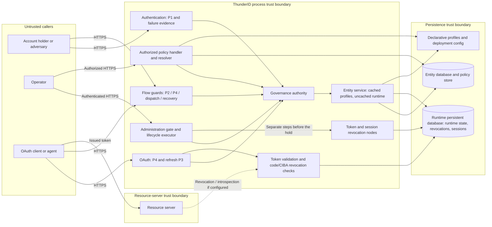
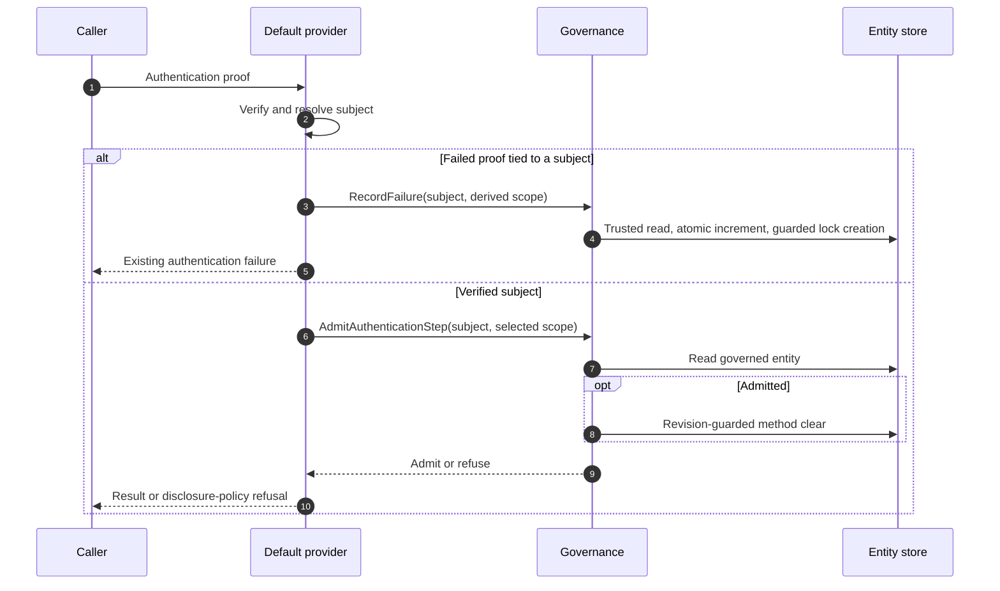
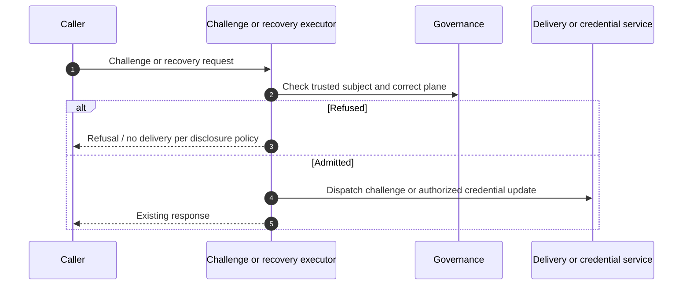
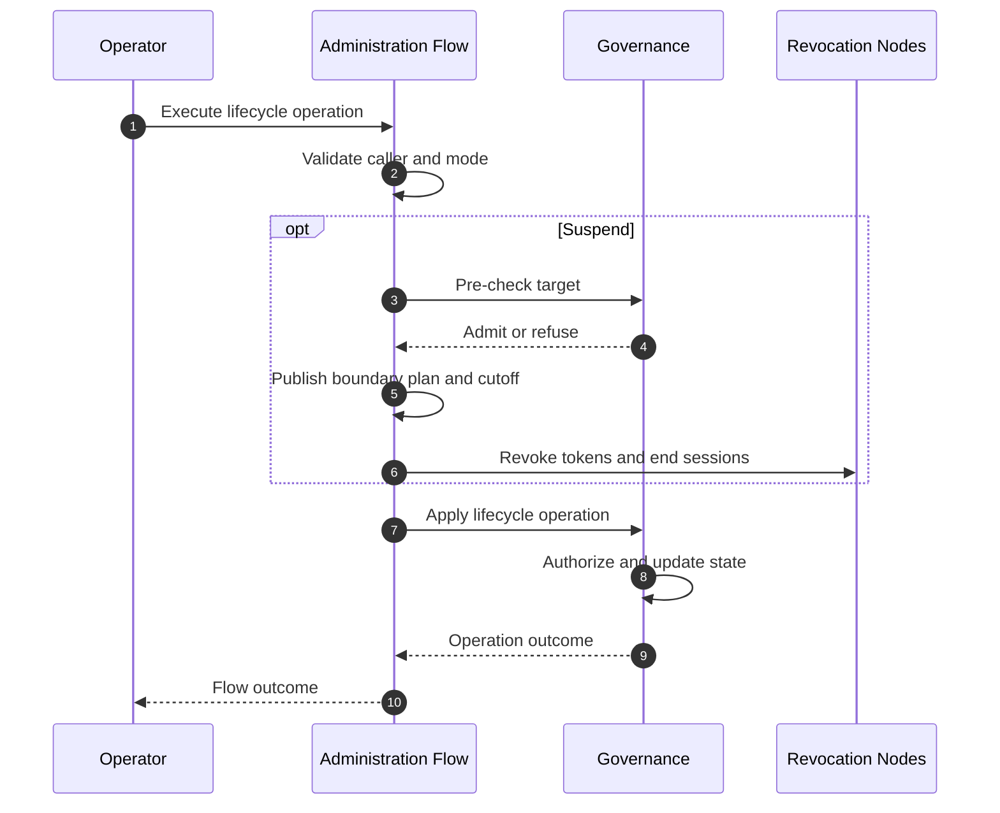
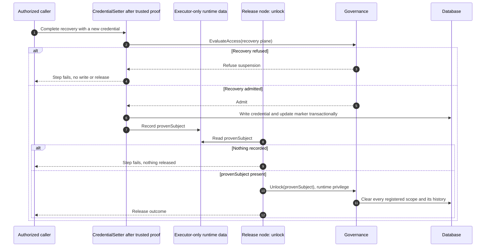
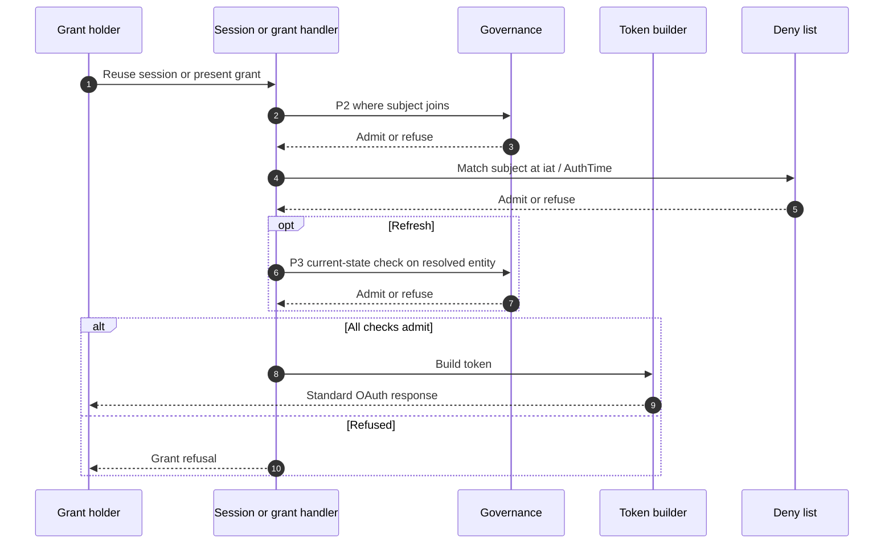
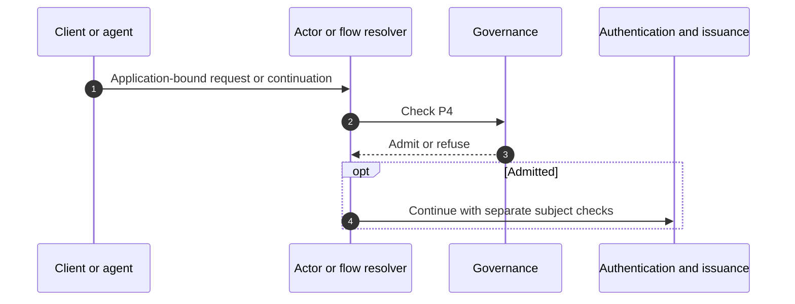
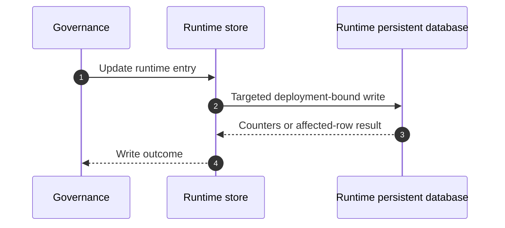
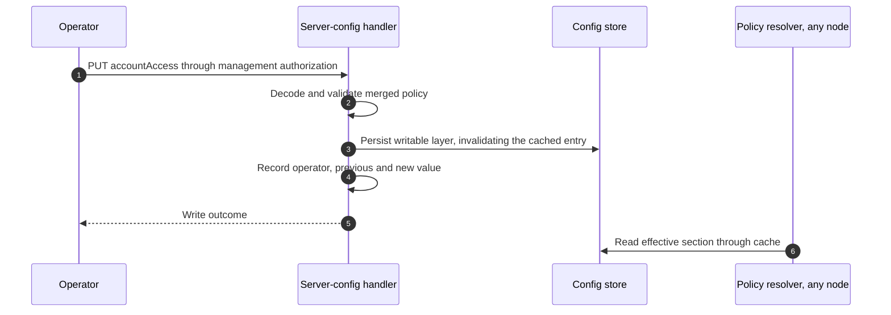
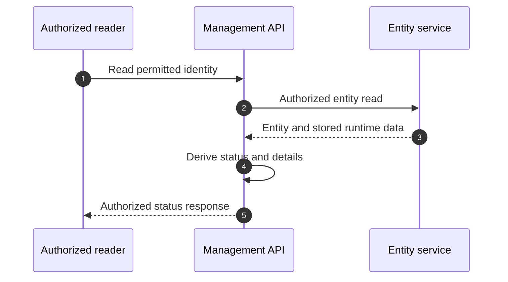

# Account Lock and Suspension Threat Model

This model covers ThunderID account lockout, administrative suspension, governance enforcement, runtime policy, and associated status reads.

## Overview

ThunderID protects identities from repeated failed authentication and allows authorized administrators to suspend users, agents, and applications. Governance checks are enforced across authentication, session, token, application, and management flows, with suspension also containing existing access through token and session revocation.

Key entry points include authentication and challenge APIs, `/flow/execute`, OAuth endpoints, identity management APIs, and `/server-config/accountAccess`.

Cross-cutting concerns such as credential verification, OAuth security, recovery proof, flow authorization, infrastructure security, and notification delivery are treated as trust inputs and are not re-analysed here.

## Scope

This model covers:

- Linking failed proofs to identities and counting; threshold, escalation, reset, expiry and scope selection.
- Authentication admission (P1), session/subject admission (P2), token containment and refresh admission (P3), and application admission (P4).
- Challenge suppression, recovery release, credential changes and administrative suspend/unsuspend/unlock flows.
- Runtime state integrity, deployment isolation and concurrent writes.
- Effective-status reads, reserved attributes, runtime policy changes and optional SDK governance.
- Optional last-login recording and its effect on access decisions.

Out of scope (owners are listed under [External Dependencies](#external-dependencies-not-owned)):

- General OAuth protocol, signing-key management and resource-server validation. Governance admission, the token subject and containment limits remain in scope.
- Recovery-proof sufficiency, infrastructure compromise and privacy/legal compliance determinations.
- Notification transport, provider security and contact assurance. Delivery is not an enforcement control.
- Future lifecycle states, OU policy inheritance, contact verification and background lock-event flows.

## Architecture



The process boundary marks trusted server code, not unrestricted executor privileges. Internal checks use runtime context; lifecycle commands retain operator context, and self-service release elevates only its recorded-subject unlock call. Governance owns state; separate nodes revoke tokens and sessions. Stores, caches and deployment files need their own access controls.

### Design baseline

L1 is an authentication lock; L2 is suspension. A method lock affects one authentication scope; the reserved `entity` entry affects every method of a user or agent. Scopes identify mechanisms, not individual fields: password, PIN and secret-answer comparisons share `credential`. Applications support suspension only.

| Area | Design position |
| --- | --- |
| State | `ACTIVE` and `SUSPENDED` are stored; `LOCKED` is derived. Public effective precedence: `SUSPENDED > LOCKED > ACTIVE`; expiry needs no state flip |
| Runtime authority | `ENTITY_RUNTIME_DATA.STATE` and `RUNTIME_ATTRIBUTES.accessState` are separate from profiles and credentials, in the runtime persistent database beside revocation records and SSO sessions. Enforcement/status reads bypass profile caches; profile-only reads omit runtime state. Database-backed, declarative and read-only profiles use the same writable runtime store. Initialization and write ordering are covered in Interaction 07. |
| Suspension | State and suspension details change atomically. Either `SUSPENDED` or recorded suspension details refuses access; other stored states, including empty or undefined values, impose no hold. Half-applied transitions do not satisfy this contract. |
| Release | Admitted steps clear their method entry; completed sign-in clears only a non-live entity entry (expired lock or count-only entry). Recovery/operator unlock clears all locks, never suspension; credential writes alone release nothing. User unsuspend atomically replaces lock history with a permanent entity-wide hold. Agent/application unsuspend adds no hold; existing agent locks can remain. Proof binding and revision guards are covered in Interactions 04 and 07. |
| Automatic scope | Only `credential` and `otp` are lockable. `system_credential` failures are not counted. Policy cannot make passkey, federation, magic link or OpenID4VP lockable. No counting while the effective scope or whole entity is live-locked |
| Token containment | Suspend checks the target, revokes tokens, ends sessions, then writes the hold. Release does not undo revocation. OAuth enforcement requires `oauth.token_revocation.enabled: true`; native APIs require `server.security.token_revocation.enabled: true`. OAuth-off can store criteria without enforcing them. Cutoff, retention and consumer limits are covered in Interaction 05. |
| Embedded engine | Governance can be omitted; checks admit, activity is not recorded, and lifecycle operations are unavailable. Supplied-authority admission errors refuse. Custom authentication providers own P1 and do not inherit default-provider counting. |

### Access-plane contract

“Admit” means governance permits access; proof, grant, client and endpoint authorization still apply. A runtime read failure gets the same error as an entity read failure on that path, never a hold or wrong-credential response. OAuth client authentication uses `invalid_client` (401), matching upstream behavior. The contract applies after a caller resolves a local entity ID; external subjects and identities not yet provisioned are not automatically local accounts.

| Plane | Active | Live method lock | Live entity-wide lock | Suspended |
| --- | --- | --- | --- | --- |
| Authentication admission (P1) | Admit | Refuse matching enabled lockable method | Refuse every method | Refuse |
| Authentication challenge dispatch | Admit | Suppress matching method | Suppress every method | Suppress |
| Session/subject admission (P2) | Admit | Admit | Admit | Refuse |
| Tokens (P3): refresh, exchange, code/CIBA redemption, validation | Admit | Admit | Admit | Reject artifacts at or before the applicable containment cutoff; refresh also refuses while suspension is currently active |
| Self-service recovery | Admit | Admit | Admit | Refuse |
| Application admission (P4) | Admit | Admit | Admit | Refuse suspended application/actor |

P3 is artifact revocation plus a live refresh check, not a live check on every token path. Enforcement switches, retention and consumer limits still apply (Interaction 05).

Locks affect only P1 and flow challenge dispatch in either granularity; entity scope adds methods, not planes. Existing sessions/grants and recovery remain usable: inside a recovery flow, a verified one-time password or magic-link code is admitted at the recovery plane, so a lock does not refuse it, a suspension does, and a wrong code still counts. Direct SMS OTP sending is excluded (02.5).

### Components

| Component | Task |
| --- | --- |
| Default authentication provider | Verifies proof, selects dispatch/scope once, counts failures tied to an identity once, calls P1; governance resets after admission |
| Governance and policy resolver | Reads trusted entity/category and effective policy; owns hold levels, plane decisions, ladder and transitions |
| Entity service, stores and caches | Reads current runtime state separately from cached profiles; performs targeted writes bound to deployment and entity |
| Flow guards and direct authentication | Enforce P2, recovery and dispatch; `AdmitSignIn` completes sign-in. Federated picker checks its selected local account at P1 under `federated` |
| Token/grant handlers | Enforce boundary revocation; refresh adds a live P3 check |
| Actor provider and flow execution | Enforce P4 at OAuth resolution and application-bound flow start/continuation |
| Administration gate and lifecycle executors | Require root system permission; preserve caller context. Bind containment and suspension to the same authorized target |
| Revocation nodes | Revoke tokens and end sessions in separate steps before the hold is written |
| Server-config handler | Authorize, validate and persist policy overlays |
| Status projection and Console | Derive status for authorized readers; UI availability is not authorization |

### Actors

#### Actors

| Actor | Description | Roles or permissions |
| --- | --- | --- |
| Anonymous adversary | Submits guesses, requests challenges, observes refusals, or distributes requests across nodes | Public authentication/flow entry points only |
| Account holder | Authenticates, uses a session/grant, or completes a recovery flow | Proof and endpoint-specific permissions; ownership alone does not authorize lifecycle commands |
| Root operator | Runs administration flows and configures security behavior | Authenticated subject with root system permission; flow permission nodes add checks |
| User/agent viewer or manager | Reads or manages users/agents within the permitted OU | View-only or management permission for the resource type; management includes viewing but does not authorize lifecycle flows. Application management requires root permission. |
| Application or agent | Client actor, subject, or both depending on the flow | Client authentication and grant authority; subject and application holds are distinct |
| Deployment/embedding administrator | Controls files, flow definitions, providers, database and transport configuration | Trusted configuration authority; can disable optional governance intentionally |
| Runtime service | Performs internal checks and limited state changes | Runtime privilege for internal operations; lifecycle administration retains the caller context |

#### Entitlement matrix

`[Yes]` means authorized subject to the stated checks, not unconditional access while held. Viewer and manager below describe granted permissions, not built-in roles. User/agent view permissions are `system:user:view` and `system:agent:view`; management permissions are `system:user` and `system:agent` and include viewing. These names gain the configured system resource-server handle prefix when one is set. Non-root access to other users/agents is limited to the caller’s OU. Application APIs require root permission. A caller can hold several permissions.

| Actor | Attempt authentication / challenge | Read another identity's status | Edit another profile | Run lifecycle flow | Change account policy |
| --- | --- | --- | --- | --- | --- |
| Anonymous caller | [Yes] | [No] | [No] | [No] | [No] |
| Account holder without admin permissions | [Yes] | [No] | [No] | [No] | [No] |
| User/agent viewer (view-only permission) | [Yes] | [Yes] for permitted user/agent type in own OU | [No] | [No] | [No] |
| User/agent manager (management permission) | [Yes] | [Yes] for permitted user/agent type in own OU | [Yes] for permitted user/agent type in own OU | [No] | [No] |
| Root operator | [Yes] | [Yes] | [Yes] | [Yes] | [Yes] |
| Application/agent without management grant | [Yes] through its supported mechanism | [No] | [No] | [No] | [No] |

### External Dependencies (not owned)

| Dependency | Responsibility |
| --- | --- |
| Authentication validators | Verify proofs, prevent replay and identify the subject of failed verification. |
| OAuth, sessions and resource servers | Validate grants, sign tokens and enforce revocation. Offline validation cannot ensure immediate revocation. |
| Flow engine and management authorization | Protect flow execution, establish recovery proof and enforce API permissions. |
| Database, host, caches and clock | Operators secure storage and hosts, restore databases consistently and synchronize clocks. Local caches do not invalidate across nodes. |
| Notification services | Secure delivery and verify contact ownership; notifications do not enforce holds. |
| Operations and release tooling | Collect and protect logs, set retention, configure alerts, run security scans and manage migrations. |

## Threats and mitigations

### Out-of-scope interactions and risks

The exclusions listed under Scope are owned by the dependencies above: proof verification and recovery-proof strength, general OAuth and signing security, infrastructure protection, notification delivery, and privacy/legal compliance. This model covers how governance uses those services, not their internal security controls.

### Interactions

#### [01]: Authentication, failure attribution and automatic locking

**Description**

The default authentication provider picks the lockout scope once per request. A failure counts only when internal evidence names the subject that was compared; bad requests, unknown or ambiguous identities, expired OTPs and method faults count nothing, so a request identifier alone cannot target a victim. A successful proof reaches `AdmitAuthenticationStep` at P1 before the reset. Governance owns admission and reset; the provider owns evidence and public errors. A credential lock does not hide failures on a separate OTP method.

**Assets involved**

| Initiator | Intermediate | Target |
| --- | --- | --- |
| Caller and presented proof | Authentication method, internal failure evidence, scope derivation | Account availability, counters, locks and authentication result |

**Data flow**



**Security considerations**

| Area | Response | Comments |
| --- | --- | --- |
| Data confidentiality | [C-High] | Credentials and identity-linked failure evidence |
| Communication medium | [M-NT], [M-IN], [M-DB] | Request, internal call, persisted counters |
| Transport security | [TLS] required at public boundary | Deployment responsibility |
| Authentication | Proof verified before P1 admission | Failed attempts are intentionally unauthenticated |
| Accessibility | [Public] | Runtime write APIs are internal |
| Authorization and Access Control | Trusted authentication method evidence and runtime context | Target/category/scope are server-derived |

**Threat assessment**

| ID | Category | Threat | Materializable | Mitigation / comment |
| --- | --- | --- | --- | --- |
| 01.1 | [Denial of Service] | Wrong-secret attempts lock a victim and interrupt sign-in. | [Yes] | Method scope, finite user rungs, explicit release for permanent agent locks and recovery reduce impact. Locks preserve sessions/grants (05.3). Residual: targeted denial of service against a known identifier. |
| 01.2 | [Information Disclosure] | Sign-in or recovery flow responses reveal that an account is locked or suspended. | [Yes] | Default `discloseAccountHold: never`: a held account gets the method's normal authentication-failure response, same as a wrong secret, and recovery treats a suspended account as unknown. `always` states the lock or suspension, but never the method, attempts remaining or lift time. Out of scope: sign-in and recovery already answer an unknown identifier differently from a known account; this feature does not change that. |
| 01.3 | [Elevation of Privilege] | A federated sign-in to a linked local account bypasses an account-wide lock or a suspension. | [No] | Every federated sign-in that resolves to a local account is checked at P1 under the `federated` scope, whether the account was matched directly or picked by the user from several matches. An account-wide lock or a suspension refuses it. A lock on a single other method, such as password, does not, because federated sign-in does not use that method. |

#### [02]: Challenge dispatch and self-service recovery

**Description**

Dispatch checks the trusted subject and challenge scope before a flow delivers a challenge; it never counts failures. A withheld OTP dispatch takes the branch an unknown username takes in that flow. The direct SMS OTP send endpoint is not a dispatch check (02.5). Trusted flow type selects authentication dispatch for authentication flows; non-authentication dispatch, including recovery and registration, uses the recovery plane. Recovery identification and credential-write guards enforce the [Access-plane contract](#access-plane-contract); governance does not replace or re-verify recovery proof.

**Assets involved**

| Initiator | Intermediate | Target |
| --- | --- | --- |
| Caller requesting challenge/recovery | Flow context, challenge service, access guard | Mailbox/phone, recovery proof, credential and lock state |

**Data flow**



**Security considerations**

| Area | Response | Comments |
| --- | --- | --- |
| Data confidentiality | [C-High] | Recovery proof and contact data |
| Communication medium | [M-NT], [M-IN], [M-DB] | Public API and delivery side effects |
| Transport security | [TLS] required | Delivery-channel protection separately configured |
| Authentication | Challenge request may be anonymous; credential replacement needs proof | Recovery proof remains a trust input |
| Accessibility | [Public] | Internal guards and write callbacks |
| Authorization and Access Control | Plane selected from trusted flow type | Trusted flow type; proof still required |

**Threat assessment**

| ID | Category | Threat | Materializable | Mitigation / comment |
| --- | --- | --- | --- | --- |
| 02.1 | [Denial of Service] | Challenge requests increment a victim’s lock counter. | [No] | Dispatch checks only; counting requires failed verification. |
| 02.2 | [Elevation of Privilege] | Suspended subject regains access through recovery. | [No] | Recovery identification/credential-write guards enforce L2, and so does the recovery-plane admission of a verified recovery code; L1 permits proven recovery. The recovery mark comes from the flow type, not from the flow definition. |
| 02.3 | [Information Disclosure] | Suppressed delivery adds a hold-specific response. | [No] | Flow executors reuse existing no-delivery branches; OTP uses the unknown-username branch. Direct SMS sending adds no hold-specific response (02.5). Disclosure and timing limits remain as in 01.2. |
| 02.4 | [Elevation of Privilege] | Pre-hold or usernameless challenge bypasses later admission. | [No] | Resolved default-provider subjects reach P1; session/assertion joins add P2, and the assertion fails closed on a subject it cannot resolve and signs only the subject it checked; recovery rechecks before credential write. Covers observed committed holds, not transactional ordering or custom-provider P1. |
| 02.5 | [Denial of Service] | A held account's phone receives one-time codes from the direct SMS OTP send endpoint. | [Yes] | Direct SMS sending accepts any well-formed number without an account check. P1 refuses verification for held accounts; flow dispatch remains guarded. Deployments must control delivery volume and cost through rate limiting. |

#### [03]: Administrative suspension, release and containment

**Description**

Administration start/continuation requires an authenticated root caller; shipped flows add permission checks. Trusted entity reads supply target category and organization unit (OU). Server authorization checks user/agent update permission in that OU, rejects self-targeting and refuses uncertain authorization. Applications rely on the root gate; delegation is unsupported.

Suspend follows: permission check → pre-suspend authorization and trusted plan → token revocation → session termination → atomic hold write → best-effort notification. Pre-check refusal publishes no plan and revokes nothing. The hold write authorizes again; a refusal there, possible only if the caller's authority changes during the flow, comes after containment and leaves an active account with its covered tokens revoked and sessions ended. The hold write takes its subject from the executor-only plan, ignores target input and fails without a plan. Failures and retries are covered in 03.3 and 03.6. Suspending an already suspended account, from Console or the API, uses a new revocation cutoff but keeps the existing hold and operator note. Suspended profiles remain editable. Unsuspend works only on a suspended account. A user comes out of suspension still locked on every sign-in method until unlocked; agents and applications come out with no new lock (see Release in the Design baseline). The only lifecycle action that can run outside an administration flow is `unlock`, which a self-service recovery flow performs (Interaction 04).

Lifecycle events are `IDENTITY_SUSPENDED`, `IDENTITY_UNSUSPENDED` and `IDENTITY_UNLOCKED`, with `IDENTITY_SUSPENSION_FAILED`, `IDENTITY_UNSUSPENSION_FAILED` and `IDENTITY_UNLOCK_FAILED` carrying the failure class. Logs/events include actor, target, category and outcome, including pre-check refusals; self-service release has no operator. They record only whether an operator note was provided, never its text. Events require observability to be enabled; output retention and retrieval are deployment controls.

**Assets involved**

| Initiator | Intermediate | Target |
| --- | --- | --- |
| Root operator | Authenticated flow, target input, pre-suspend node, lifecycle executor, trusted revocation plan | Suspension, sessions, grants, optional operator note and post-suspension lock |

**Data flow**



**Security considerations**

| Area | Response | Comments |
| --- | --- | --- |
| Data confidentiality | [C-High] | Operator note can contain sensitive incident information |
| Communication medium | [M-NT], [M-IN], [M-DB] | Authenticated management operation |
| Transport security | [TLS] required | Protect operator credentials and flow continuation |
| Authentication | Authenticated subject; runtime/anonymous context rejected | Root system permission checked at execution boundary |
| Accessibility | [Restricted] | Public route does not make administration public |
| Authorization and Access Control | Root gate, flow permissions, trusted OU | Lifecycle calls preserve caller context |

**Threat assessment**

| ID | Category | Threat | Materializable | Mitigation / comment |
| --- | --- | --- | --- | --- |
| 03.1 | [Elevation of Privilege] | Anonymous caller or ordinary owner performs administrative unlock/unsuspend. | [No] | Independent root administration gate prevents owner shortcuts from authorizing these flows. Proof-bound recovery unlock is a separate path (04.2, 04.3), not owner permission. |
| 03.2 | [Tampering] | Caller forges automatic lock creation or changes containment target/scope, or holds a different identity from the one contained. | [No] | Lock creation is internal; the pre-suspend node publishes an executor-only trusted runtime plan, and the suspend node takes its target from that plan's subject, ignores any target input and faults without a plan. The operator note cannot select authority or behavior. |
| 03.3 | [Operational Risk] | A failed suspension may partially revoke access while leaving the account active. | [Yes] | Accepted: containment and the hold write are separate steps. If any step fails before the hold is written, the flow reports failure and the account stays active, though some tokens or sessions may already be revoked; the operator retries Suspend. |
| 03.4 | [Elevation of Privilege] | Caller performs an unauthorized user, agent or application lifecycle operation. | [No] | Root permission gates flow start/continuation. User/agent operations also check trusted OU, reject self-targeting and refuse uncertain authorization; Suspend checks again at the hold write. Applications have no delegated lifecycle permission and require root. Embedded hosts must supply authorization. |
| 03.5 | [Tampering] | Non-administration flow exposes suspend/unsuspend. | [No] | Trusted engine flow type restricts non-administration execution to `unlock`; other modes fault. The pre-suspend node is offered to administration flows only. |
| 03.6 | [Denial of Service] | A revocation or session store outage stops an operator from suspending a compromised account. | [Yes] | Accepted: token/session store failure prevents suspension. These stores share the runtime persistent database with hold state, so outages often affect all three. Revocation writes log/publish `TOKEN_REVOCATION_FAILED` with reason and target; session failures publish a flow-node failure. Alert on both; retry after recovery. |

#### [04]: Successful authentication and recovery release

**Description**

After admission, method reset clears the presented method and history even when current policy ignores that entry. `AdmitSignIn`, at assertion or atomic endpoint completion, clears only a non-live entity entry, so a first factor cannot reset counters fed by a second factor. Admission and reset are separate operations. Both clears use the revision guards in Interaction 07; neither conflicts nor logged clear errors reverse admission.

Recovery requires an explicit `IdentityGovernanceExecutor` node in `unlock` mode after `CredentialSetter`. Shipped flows and authoring examples include it; custom placement is documented, not validated (04.5). Operator unlock has the same all-scope release under administrative authorization.

After a successful credential write, `CredentialSetter` records `provenSubject` in executor-only runtime data. This identifies the subject; trusted earlier flow steps must prove ownership. The release node ignores target input, fails without `provenSubject`, and elevates only its `Unlock` call for that subject. Credential write and release are separate operations (04.6); unlock preserves suspension and unrelated runtime fields.

**Assets involved**

| Initiator | Intermediate | Target |
| --- | --- | --- |
| Authenticated holder, recovery-flow completer, or operator | Flow engine, credential writer, shared runtime data, release node, governance authority | New credential, recorded proof, appropriate lock entries |

**Data flow**



**Security considerations**

| Area | Response | Comments |
| --- | --- | --- |
| Data confidentiality | [C-High] | Credentials and reset proof |
| Communication medium | [M-NT], [M-IN], [M-DB] | Flow transport and the credential path |
| Transport security | [TLS] required | Database transport is deployment-specific |
| Authentication | Valid sign-in, a recorded proof of control, or management authorization | Credential write alone cannot release |
| Accessibility | [Restricted] | Recovery has a public start but protected completion |
| Authorization and Access Control | `provenSubject` or caller permissions/OU | Release scope follows Design baseline |

**Threat assessment**

| ID | Category | Threat | Materializable | Mitigation / comment |
| --- | --- | --- | --- | --- |
| 04.1 | [Elevation of Privilege] | Credential change, registration or profile edit lifts a live lock. | [No] | Credential writes never clear locks, including post-unsuspend holds. Explicit recovery release and separately authorized operator unlock do. |
| 04.2 | [Elevation of Privilege] | Caller releases another identity's locks or releases locks before proof. | [No] | Target input is ignored. Only `CredentialSetter` records executor-only `provenSubject` after a successful credential write; without it, release fails. Trusted earlier flow steps must establish ownership, and custom-graph proof strength/order is not validated here. |
| 04.3 | [Elevation of Privilege] | Release-node runtime privilege reaches unauthorized operations. | [No] | Privilege applies to one `Unlock` call on the recorded subject. Suspend/unsuspend fault outside administration before elevation. |
| 04.4 | [Elevation of Privilege] | Recovery clears suspension along with locks. | [No] | `Unlock` changes locks only; recovery guards refuse suspended subjects before credential write. |
| 04.5 | [Denial of Service] | Custom recovery omits release and strands locked subjects. | [Yes] | Accepted. Shipped flows include explicit release, and flow-authoring documentation and its sample recovery flow show where the release node goes. Placement in custom flows is the author's responsibility; it is documented. An operator unlock remains available. |
| 04.6 | [Denial of Service] | Release fails after the credential write, leaving a new credential and a live lock. | [Yes] | Accepted. The release step fails, so the holder is told recovery did not complete; running recovery again rewrites the credential and clears the locks. A lock does not block recovery. A non-expiring lock needs an operator unlock if the holder does not retry. |

#### [05]: Existing sessions, grants and token issuance

**Description**

Locks leave existing sessions and grants usable. P2 checks the subject when a session or flow admits it and refuses a suspension. P3 checks token and grant revocation; refresh also checks the subject's current suspension state. Token builders do not make a separate governance check.

Suspension records an `identity_suspended` revocation criterion for the entity ID and, for an application, its client ID. The cutoff is the pre-suspend check time plus `jwt.leeway`. Matching tokens and grants established at or before that cutoff are rejected. The leeway covers ordinary flow duration, concurrent signing and clock differences; work that finishes beyond it is outside the cutoff's guarantee. Once the hold exists, P2 refuses a new session even if it began after session termination.

Unsuspend does not erase revocation criteria or restore ended sessions and grants. If the cutoff is still in the future, a newly created grant or token in that interval can also be rejected; the holder retries after the cutoff passes.

For a token ThunderID issued, revocation compares the token's own `iat` with the cutoff, rather than its original authentication time. A subject criterion matches its `sub` or, for a refresh token, `access_token_sub`; local subjects always use the entity ID. An application criterion matches access-token `client_id` or refresh-token `sub`. External tokens follow their issuer's validation and do not select a local entity for this check.

Authorization-code and CIBA redemption compare the recorded authentication time and subject ID with revocation criteria. A code without stored `AuthTime` uses its creation time; such a code can remain valid briefly across an upgrade. Issuance relies on admission or grant checks before signing, and refresh makes a fresh suspension check. If the OAuth revocation store cannot be read, the request is refused. Native APIs use a separate revocation cache whose synchronization interval is set by the deployment.

Retention follows 05.2; offline enforcement follows 05.1. Application suspension covers that client and its bound artifacts (06.4). Both enforcement switches are in the Design baseline.

**Assets involved**

| Initiator | Intermediate | Target |
| --- | --- | --- |
| Holder of session or grant | Session join, grant handler, explicit subject ID, token builder | Continued access and newly issued tokens |

**Data flow**



**Security considerations**

| Area | Response | Comments |
| --- | --- | --- |
| Data confidentiality | [C-High] | Sessions, grants and tokens |
| Communication medium | [M-NT], [M-IN], [M-DB] | Protocol requests and internal authority reads |
| Transport security | [TLS] required | Token confidentiality depends on deployment |
| Authentication | Existing session/grant and applicable client authentication | Governance is an additional check |
| Accessibility | [Public] endpoints with authenticated proof | Internal builder not directly exposed |
| Authorization and Access Control | Subject identity plus plane decision | Token `sub` is the local entity identifier |

**Threat assessment**

| ID | Category | Threat | Materializable | Mitigation / comment |
| --- | --- | --- | --- | --- |
| 05.1 | [Lateral Movement] | Issued token remains usable at an offline resource server. | [Yes] | Server checks cannot force offline consumers to recheck. Token lifetime bounds and revocation/introspection integration remain deployment obligations. |
| 05.2 | [Elevation of Privilege] | Revocation expires before an old grant, allowing reuse after release. | [Yes] | Accepted: suspension for users and agents uses the same configured revocation lifetime as user deletion, currently the deployment refresh-token validity. Application suspension uses the longer of that lifetime and the application's maximum token lifetime. Expiry counts from the later of the write and cutoff, plus JWT leeway. No global token-lifetime cap exists yet, so a longer application override can outlive a user or agent suspension record. When a maximum token lifetime is introduced, revocation retention will use it. |
| 05.3 | [Denial of Service] | Failed sign-ins terminate sessions or block valid refresh/exchange. | [No] | Locks affect only P1/dispatch in both granularities (Access-plane contract); token validity, grant authorization and suspension remain independent. |

#### [06]: Applications and agents as actors or subjects

**Description**

P4 checks applications at actor resolution and direct-flow start/continuation. Subject checks remain separate (P1/P2/P3). Agents receive default credential/OTP locking; client-secret failures never count or form locks. Private-key client authentication does not use default-provider P1.

**Assets involved**

| Initiator | Intermediate | Target |
| --- | --- | --- |
| Client application, agent, acting user | Actor resolution, subject resolution, P4/P1/P2/P3 | Application availability, agent authority, user grants |

**Data flow**



**Security considerations**

| Area | Response | Comments |
| --- | --- | --- |
| Data confidentiality | [C-High] | Client secrets and delegated authority |
| Communication medium | [M-NT], [M-IN] | OAuth and direct flow paths |
| Transport security | [TLS] required | Client authentication remains separate |
| Authentication | Client credential or subject proof as applicable | Distinguish agent-as-subject from client-as-actor |
| Accessibility | [Public] | No unauthenticated management rights |
| Authorization and Access Control | Separate application and subject checks | An application hold is not charged to the user counter |

**Threat assessment**

| ID | Category | Threat | Materializable | Mitigation / comment |
| --- | --- | --- | --- | --- |
| 06.1 | [Elevation of Privilege] | Suspended application bypasses OAuth via direct-flow continuation. | [No] | P4 reads current authority at direct-flow start/continuation as well as OAuth resolution. |
| 06.2 | [Denial of Service] | Client-secret guesses lock an application and its users. | [No] | `system_credential` failures never count or form locks; policy cannot promote this class. |
| 06.3 | [Information Disclosure] | A caller can distinguish a suspended application from an unknown client ID at browser `/authorize`. | [Yes] | A suspended application gets “This application is currently unavailable”; an unknown client ID gets “Invalid client_id”. This disclosure helps a person following a sign-in link understand why it failed. Both errors render on ThunderID's page and never redirect to a client-supplied URI. Machine client authentication returns `invalid_client` for either case. |
| 06.4 | [Operational Risk] | A token exchanged into another client's ID before application suspension remains outside that application's revocation. | [Yes] | Suspension uses the same client-ID boundary as application deletion: it revokes tokens whose subject is the application or whose client ID is its own. ThunderID token exchange can issue a new token under the requesting client's ID; if that differs, the new token is not matched by the suspended application's criterion. A revoked source token cannot be exchanged again. Offline consumers have the limit in 05.1. |
| 06.5 | [Denial of Service] | Agent guesses or broken rollout require operator intervention. | [Yes] | Default third rung is permanent. Method scope preserves other methods/grants; client secrets cannot form locks. Operator unlock and monitoring remain necessary; agent locks send no email by design. |

#### [07]: Runtime storage, concurrent writes and cached reads

**Description**

Every runtime write targets an entity ID within the server-selected deployment. Scope names are validated before they become SQL JSON paths. A failed attempt increments its counter atomically. A new lock is written only if the failure count, lockout count and revision still match the values governance read, and no live lock covers the scope. If that check conflicts with another write, governance re-reads and tries lock creation up to three times. Counter updates also check for live method or entity-wide locks, so a lock placed after the first read still prevents another failure from being counted.

Reads that need governance state fetch the runtime row directly; profile-only reads do not fetch it (Design baseline). If a database-backed entity has no runtime row, the service creates one with `ACTIVE` state and empty attributes. A declarative entity takes its initial state from its file, or `ACTIVE` if the file omits it. Once a runtime row exists, it wins over the file, including after a release. During concurrent initialization, the service re-reads the row so a competing initialization or hold wins; an uncommitted seed is never treated as current state. A failed initialization or read returns the same error that path uses for a failed entity read.

Creation inserts the entity, then resets its runtime row before the entity transaction commits. If the runtime reset fails, the entity insert rolls back. If the entity commit fails afterward, an empty `ACTIVE` runtime row may remain. A duplicate entity ID is rejected before runtime reset. Deletion commits entity removal before deleting its runtime row. If runtime deletion fails, the error is logged and an orphan row remains; creating an entity with that ID later resets it. This order preserves a hold if entity deletion fails. Restore requirements are in 07.7.

Automatic clears after an admitted authentication step or completed sign-in use the runtime revision read during admission. If another write changes that revision first, the clear is skipped: the newer state remains, and admission is not reversed. Recovery and operator unlock clear locks without a revision guard. Admission and a concurrent suspension remain separate operations.

**Assets involved**

| Initiator | Intermediate | Target |
| --- | --- | --- |
| Authentication, profile or lifecycle operation | Entity service, local cache, deployment-bound SQL | Counter integrity, suspension, lock history and profile attributes |

**Data flow**



**Security considerations**

| Area | Response | Comments |
| --- | --- | --- |
| Data confidentiality | [C-High] | Identity state and operator note |
| Communication medium | [M-IN], [M-DB], [M-FS] | Database and declarative sources |
| Transport security | [Not Encrypted] in process; DB deployment-specific | At-rest encryption not established |
| Authentication | Server database identity / trusted process | Not caller-chosen database credentials |
| Accessibility | [Internal] | Store APIs not public |
| Authorization and Access Control | Deployment binding and server-owned runtime paths | Profile read-only status does not prohibit runtime writes |

**Threat assessment**

| ID | Category | Threat | Materializable | Mitigation / comment |
| --- | --- | --- | --- | --- |
| 07.1 | [Tampering] | Crafted scope alters JSON paths or targets another deployment. | [No] | Registry validation precedes query construction; SQL binds server-selected deployment. Direct DB compromise is excluded. |
| 07.2 | [Tampering] | Stale profile update overwrites counters or suspension. | [No] | Separate runtime authority and targeted statements prevent profile snapshots replacing runtime data or unrelated fields. |
| 07.3 | [Elevation of Privilege] | Warm profile cache admits using obsolete runtime state. | [No] | Fresh runtime reads replace cached status; read failure refuses, as a server error rather than a hold. |
| 07.4 | [Operational Risk] | Read-only profile disables failure accounting. | [No] | Independent writable runtime storage serves database-backed and declarative profiles, including read-only profiles. Runtime-store write permission remains required. |
| 07.5 | [Elevation of Privilege] | Invalid runtime JSON admits as ACTIVE. | [No] | Decoding errors fail authority reads and status reports held. A stored state other than `SUSPENDED` without suspension details is deliberately not a hold; governance writes only `ACTIVE` and `SUSPENDED`. Semantic validation of every malformed timestamp or document is not established. |
| 07.6 | [Tampering] | Automatic clear overwrites newer runtime changes. | [No] | An automatic clear runs only if the runtime revision still matches the one read during admission. A conflict skips the clear but does not undo successful admission; a clear error also leaves admission intact. Recovery and operator unlock do not use this revision guard and preserve suspension and activity data. |
| 07.7 | [Operational Risk] | Restoring runtime data to an older point than the entity database can silently remove a hold or bring back a released one. | [Yes] | Entity and runtime databases need a consistent restore point. A missing runtime row starts `ACTIVE` for a database-backed identity, and the server does not detect rollback. |

#### [08]: Runtime policy, flow definitions and optional provider wiring

**Description**

Account-access policy has product defaults, deployment overrides and either a declarative or writable server-config layer. A declarative resource blocks API writes to that section. If a section read fails, resolution uses the base policy for that request. Policy changes never remove a stored suspension.

Only user and agent lockout policies are accepted. Validation rejects unknown fields or scopes, invalid values and incomplete enabled policies before they take effect (08.1). Authorized policy writes log the operator and publish the old and new writable values; failed writes publish an error code. Flow definitions and provider wiring remain trusted deployment controls, with no approval workflow for their changes (08.2).

Turning off automatic counting does not bypass a live entity-wide lock, including a user's post-suspension hold. A disabled method policy or entity granularity stops a method lock from applying but does not erase it; a later policy change can make it apply again.

An embedded host can omit governance; its checks are then skipped and lifecycle operations are unavailable (Design baseline).

**Assets involved**

| Initiator | Intermediate | Target |
| --- | --- | --- |
| Authorized operator or deployment administrator | API authorization, section validator, writable store | Thresholds, scope, disclosure, flow behavior and provider wiring |

**Data flow**



**Security considerations**

| Area | Response | Comments |
| --- | --- | --- |
| Data confidentiality | [C-Medium] | Security policy and flow structure |
| Communication medium | [M-NT], [M-IN], [M-DB], [M-FS] | API edits and declarative server-config resources |
| Transport security | [TLS] required for API | Protect file write permissions separately |
| Authentication | Management API authentication or trusted deployment access | API middleware supplies authorization |
| Accessibility | [Restricted] | Inherited API middleware authorization must remain intact |
| Authorization and Access Control | Privileged policy/flow administration | Capabilities do not grant permissions |

**Threat assessment**

| ID | Category | Threat | Materializable | Mitigation / comment |
| --- | --- | --- | --- | --- |
| 08.1 | [Tampering] | An invalid account-access policy weakens lockout enforcement. | [No] | Validation rejects unknown fields and scopes, application policies and incomplete enabled policies. API and declarative durations have a bound; deployment values above it are clamped before use. |
| 08.2 | [Process Risk] | A trusted administrator disables lockout or removes containment by changing policy or flows. | [Yes] | Root permission limits who can make these changes but does not prevent trusted misuse. Policy writes record the operator and values before and after. Flow-definition changes are outside this feature's audit; deployments must restrict and review them. No approval workflow is built in. |

#### [09]: Status reads, profile edits and operator note

**Description**

Authorized record reads derive status from current runtime state and effective policy. Suspension takes precedence over locks. User and agent reads expose hold details, including an optional suspension note; application reads expose only `ACTIVE` or `SUSPENDED`.

Profile edits cannot change runtime holds (09.1). The operator note is explanatory text, not an access rule. Authorized record readers can see it, and an existing holder token may briefly reach the self endpoint before native revocation propagates (09.2). Consumers must render it as text (09.3).

**Assets involved**

| Initiator | Intermediate | Target |
| --- | --- | --- |
| Authorized reader/editor | Management API and Console projection | Effective status, user/agent suspension note, profile and reserved attributes. Application status exposes only its value. |

**Data flow**



**Security considerations**

| Area | Response | Comments |
| --- | --- | --- |
| Data confidentiality | [C-High] | Status and free-text investigation details |
| Communication medium | [M-NT], [M-IN], [M-DB] | Management read/update |
| Transport security | [TLS] required | Render operator text as text |
| Authentication | Management API principal | Read permissions may include authorized owner reads |
| Accessibility | [Restricted] | Details excluded from public refusals |
| Authorization and Access Control | Resource read/update permissions | Record-read rights include non-security readers |

**Threat assessment**

| ID | Category | Threat | Materializable | Mitigation / comment |
| --- | --- | --- | --- | --- |
| 09.1 | [Tampering] | A profile edit creates a lock or removes a suspension. | [No] | Holds live in the separate runtime record. A profile `accessState` value has no governance effect, including when a runtime row is first created; only lifecycle paths change holds. |
| 09.2 | [Privacy Risk] | An operator note exposes incident details to the holder or other record readers. | [No] | Record-view permission exposes the note by design. The holder's own reads (`GET` and `PUT /users/me`) never carry it, so an old token that still reaches them does not expose it. Release deletes the note; operators must keep it minimal and free of unrelated personal data and secrets. |
| 09.3 | [Tampering] | Malicious text in an operator note executes in Console. | [No] | Console renders the note as text, not HTML. Other clients and exports must also escape it before display. |

## Security Review Checklist

A review aid that complements this model and the self-assessment, following the [OWASP Top 10 Proactive Controls](https://top10proactive.owasp.org/). `[No]` means this review has not established the complete requirement; it is not evidence that the repository or a deployment lacks the practice. This review does not replace release scanning or deployment assessment.

### Security considerations

| # | Consideration | State | Comments |
| --- | --- | --- | --- |
| 1 | Are all inputs and outputs validated (syntactic and semantic)? | [Yes] | Account-access settings reject unknown or invalid values and incomplete enabled policies. Operator notes remain text in storage and output. |
| 2 | Are rate limits in place where necessary? | [No] | This feature adds no request rate limiter. Deployments must limit delivery volume and cost on the direct SMS OTP send endpoint (02.5). |
| 3 | Are permissions, roles, and entitlements defined on the principle of least privilege and business need? | [No] | Root-only lifecycle is a clear boundary, not least privilege. Delegation and separation of duties are out of scope (08.2). |
| 4 | Are protected Console routes authenticated and API resource permissions enforced before access? | [Yes] | Console routes use `ProtectedRoute`; lifecycle controls show actions supported by the current status and configured flows. API authorization remains independent: resource APIs check permissions, and administration flows require root system permission. UI action visibility is not an authorization boundary. |
| 5 | Are proper isolations in place between components to ensure least-privilege access and reduce the blast radius against lateral movement? | [Yes] | Narrow interfaces and a separate runtime store keep profile writes away from hold state. Governance, flows and revocation still run in one process, and lifecycle operations require broad root permission. |
| 6 | Have any default credentials been changed, and are default superuser or root accounts not in use (when using third-party components)? | [N/A] | No third-party component or credential introduced. |
| 7 | Has the implementation followed best-practice guidelines (OWASP, Kubernetes, vendor, or technology provider)? | [Yes] | OWASP guidance informed server-side access checks, generic refusal responses and the lockout/denial-of-service trade-off. |
| 8 | Are secrets, credentials, and internal-only material kept out of the public source tree and its git history? | [Yes] | This feature introduces no secrets or credentials into public source or history; internal review material is not published there. |
| 9 | Was a security-focused code review conducted for this change, and have the findings been addressed? | [Yes] | Security-focused source review and component probes were conducted. Findings were fixed or recorded as accepted, bounded risks in this assessment. |
| 10 | Is Static Analysis (SAST) or IaC scanning conducted, and are findings addressed? | [Yes] | Backend `golangci-lint` enables `gosec`, and `make pr_checks` includes that lint gate. |
| 11 | Is Software Composition Analysis (SCA) conducted or integrated into the repository, and are findings addressed (for example FOSSA, Trivy)? | [Partial] | Pull requests run `pnpm audit` and dependency review; the feature adds no dependency. A continuous scan of the full Go dependency set is not established. |
| 12 | Is Dynamic (DAST) or API scanning conducted on a non-production setup, and are findings addressed? | [No] | Release-process obligation. |
| 13 | Are audit logs generated in a standardized format for critical functionality, and available to authorized users to trace critical events and aid incident response? Note the retention period in Comments. | [Yes] | Suspend, unsuspend, unlock and policy writes emit structured events with actor, target and outcome, including failures. Failed token revocation emits `TOKEN_REVOCATION_FAILED`. Authorized retrieval and retention depend on the configured observability output; the project sets no fixed retention period. |
| 14 | Do audit logs for critical configuration changes record the difference between the old and new versions? | [Partial] | Server-config writes, including the account access policy, record the writable value before and after. Flow definition changes are outside this feature (08.2). |
| 15 | Are data in transit and at rest encrypted? | [No] | Public TLS required but deployment-dependent; database/disk encryption are operator controls. |
| 16 | Are sensitive values such as credentials and keys stored in a secret store or vault? | [N/A] | Runtime data stores counters, episodes and suspension details, not credentials/keys. |
| 17 | Is personal, sensitive, or confidential data kept out of logs? | [Yes] | Within this feature, identifiers are masked and logs omit credentials, tokens and suspension note text. Structured audit events record actor, target, category and outcome for authorized tracing without the note text. |
| 18 | Have users been given clear instructions for secure usage? | [Yes] | Official product documentation explains recovery-flow unlock placement and retries, rate limiting alongside lockout, lifecycle audit events, and consistent restoration of the entity and runtime databases. |

### Business impact and resilience

| # | Consideration | State | Comments |
| --- | --- | --- | --- |
| 1 | Has a business impact analysis been done to identify resilience requirements (maximum tolerable downtime, uptime, RPO, RTO)? | [Yes] | This assessment identifies account availability, authority-store health, containment failures and coordinated restoration as resilience concerns. Production guidance requires deployments to set recovery objectives and test restoration; numeric uptime and downtime targets depend on each deployment. |

Deployment resilience requirements:

- **Availability:** suspension needs the revocation and session stores as well as the runtime state; all three share the runtime persistent database (03.6). Alert on `TOKEN_REVOCATION_FAILED` and failed administration flows.
- **Recovery:** restore the entity database, the runtime persistent database and policy to consistent points; a runtime restore older than the entity restore can release a suspension or lock or bring back a released one (07.7). Do not restore obsolete credentials. Verify clocks and operator recovery from broad holds.
- **Backups:** deployer sets database/configuration/secret-reference/volume/audit schedules, encryption, retention and restore tests. Migration review is separate.
- **Health:** distinguish HTTP health from authority failures and incomplete containment.
- **Banners:** public failures remain generic by default; operational incidents belong in authorized administration views. No outage banner is added.

### Dependency and component health

| # | Consideration | State | Comments |
| --- | --- | --- | --- |
| 1 | Are dependencies, base images, and runtimes monitored for known vulnerabilities and kept current (for example automated dependency scanning), and are findings addressed? | [N/A] | This feature adds no dependency. |
| 2 | Are any End-of-Life or End-of-Service components in use? | [No] | This feature introduces no component. |
| 3 | Is hardening guidance published for operators who deploy the project (optional)? | [Yes] | Official production guidance covers rate limiting alongside lockout, coordinated database restoration, recovery objectives and operational monitoring. |

### Privacy considerations

This feature stores identity-linked failed-attempt counts, lock times and an optional suspension note in existing entity runtime storage. It adds no profile attribute or stored authentication proof. Operators should keep notes free of unrelated personal data and secrets; note text is not validated for this.

| # | Consideration | State | Comments |
| --- | --- | --- | --- |
| 1 | Is the purpose and legal basis for processing personal data clearly defined? | [Yes] | Identity-linked counters and status support account protection and administrative suspension. The deployer establishes the legal basis for its use. |
| 2 | Are the collection, storage, processing, sharing, archival, and disposal of personal data aligned with the data minimization principle? | [Yes] | Runtime state stores counts, times and status against an existing identity, without credentials or authentication proofs. The optional note is for a brief operational reason; operators should omit unrelated personal data and secrets. |
| 3 | Is personal data stored securely? | [Yes] | Runtime data uses the existing persistent store and authorized management reads; note text is omitted from authentication responses and audit events. Database encryption, backups and operator access follow deployment controls. |
| 4 | Are privacy notices updated to reflect any new processing or changes to purpose and legal basis? | [N/A] | The deployer owns privacy notices. This feature adds account-protection runtime state, not a new profile attribute. |
| 5 | Is access to personal data granted on a need-to-know basis? | [Partial] | Management reads require record-view permission, but note text is visible to any such reader; an old holder token may also read it before native revocation propagates (09.2). |
| 6 | Are data retention requirements considered? | [Yes] | Releasing suspension deletes its note; deleting an identity deletes its runtime row. Lock history has no separate time limit, and audit-output retention is deployment-configured. |
| 7 | Is there a process to dispose of personal data on request in a timely manner while meeting retention requirements? | [Yes] | Identity deletion invokes runtime-row deletion. A failed runtime cleanup is logged for operator repair; audit-output disposal follows deployment retention. |
| 8 | Are records of personal-data processing maintained in the project's data inventory or records of processing? | [N/A] | The deployer owns its processing inventory. |

## Residual risks (open items)

The following items require deployment controls or further review. Accepted risks are listed separately below.

| Threat ID | Bounded risk or review requirement | Responsible role |
| --- | --- | --- |
| 01.2 | Account existence stays observable through the existing unknown-account answers on sign-in, recovery and registration; normalizing them is separate platform work. This feature hides only hold state, and only under `never` | Authentication / platform |
| 08.2 | Enable observability outputs and set audit retention and authorized retrieval for the administration events | Operations |
| 07.7 | Back up and restore the entity and runtime persistent databases to consistent points; the server does not detect a rolled-back runtime state | Operations |

Accepted residuals are described in their threat rows: direct SMS delivery (02.5), separate-step containment and store availability (03.3, 03.6), custom recovery and release failure (04.5, 04.6), and revocation-record retention (05.2). Other residuals include targeted lockout (01.1, 06.5), hold disclosure (01.2), offline consumers (05.1), other-client tokens (06.4), unavailable-application responses (06.3), note visibility (09.2) and trusted configuration changes (08.2).

## Appendix

### Sample requests and configurations

Shipped defaults are shown below with deployment-style `account_access` keys. The `accountAccess` server-config API and declarative resource use equivalent camelCase keys; inheritance and layer order are defined in Interaction 08.

```yaml
account_access:
  user:
    lock_granularity: authentication_method
    record_last_login: false
    last_login_resolution_seconds: 3600
    default:
      enabled: true
      threshold: 5
      failure_window_seconds: 3600
      lock_durations_seconds: [300, 900, 1800, 3600]
      lock_decay_seconds: 86400
      disclose_account_hold: never
    notifications:
      on_lock:
        email:
          enabled: true
          recipient_attribute: email
  agent:
    lock_granularity: authentication_method
    default:
      enabled: true
      threshold: 10
      failure_window_seconds: 900
      lock_durations_seconds: [300, 900, 0]
      lock_decay_seconds: 3600
      disclose_account_hold: never
```

Only user and agent categories are supported. Omitted agent activity settings inherit lower layers; shipped values resolve to recording off and a 3600-second resolution. Explicit overrides can enable recording.

#### Default trade-offs

These defaults slow repeated guessing but let an attacker who can submit failed proofs lock a known account (01.1). `accountAccess.user` and `accountAccess.agent` hold separate policies. Console exposes the main controls under **Settings > Account security**; other fields remain available through configuration.

| `accountAccess` setting (Console control) | Shipped value and security effect |
| --- | --- |
| `user.lockGranularity`, `agent.lockGranularity` (**Lock applies to**) | Both use `authentication_method`: only the method that failed is locked, leaving other sign-in methods available. Choosing `entity` locks every sign-in method, increasing denial-of-service impact. Neither choice blocks existing sessions or token use. |
| `user.default.enabled`, `user.default.threshold` (**Automatic locking**, **Lock after**) | Enabled with threshold 5. Five attributable failed proofs for the same known identity and scope form a lock. Unknown identities and failures without a verified attempt do not count. This threshold alone does not bound guessing across identities or challenge types. |
| `user.default.failureWindowSeconds` (**failed attempts within**) | 3600 seconds. A failure after this inactivity interval starts a new count; this is not a fixed hourly request limit. Zero never resets the count on time. Front-door rate limiting is still needed. |
| `user.default.lockDurationsSeconds` (**Lock duration**) | `[300, 900, 1800, 3600]` seconds: successive lock episodes last 5, 15, 30 and 60 minutes; later episodes reuse 60 minutes. A value of `0` instead holds that episode until recovery releases it or an operator unlocks it. Repeated attacks can cause repeated episodes, so these values do not bound total account unavailability. |
| `user.default.lockDecaySeconds` (**Reset lock progression**) | 86400 seconds. After a finite lock ends, that much time without another lock returns the next episode to the first duration. It does not shorten a live lock; `0` disables time-based reset. |
| `agent.default.enabled`, `agent.default.threshold`, `agent.default.failureWindowSeconds` (**Automatic locking**, **Lock after**, **failed attempts within**) | Enabled with threshold 10 and a 900-second inactivity window. A broken client or hostile proof attempts can still prevent new agent authentication; monitor locks and provide operator unlock. |
| `agent.default.lockDurationsSeconds`, `agent.default.lockDecaySeconds` (**Lock duration**, **Reset lock progression**) | `[300, 900, 0]` seconds and 3600 seconds. The third rung has no automatic expiry and requires operator unlock, which resets progression. Decay can reset progression after a finite lock, never while a permanent lock is live. |
| `user.default.discloseAccountHold`, `agent.default.discloseAccountHold` | Both use `never`, so a refusal does not explicitly reveal a lock or suspension. `always` allows that disclosure; it does not expose the operator note (01.2). Console does not expose this control. |
| `user.notifications.onLock.email.enabled`, `user.notifications.onLock.email.recipientAttribute` (**Email the account holder**, **Recipient attribute**) | Email is enabled and the recipient attribute defaults to `email`. At most one notice is attempted per committed lock episode, using the current trusted record; it states the lock duration and, for finite locks, UTC expiry. A named but missing attribute has no fallback; failed delivery does not undo the lock or trigger a retry. Agents have no lock email. |
| `user.scopes`, `agent.scopes` | No per-scope overrides ship. An override changes selected policy fields for one sign-in method; it cannot make an excluded method lockable. Console does not expose scope overrides. |
| `user.recordLastLogin`, `agent.recordLastLogin`; `lastLoginResolutionSeconds` | Activity recording is off for both categories; effective resolution is 3600 seconds if enabled without another value. Enabling it stores the last granted-access time and adds runtime writes, including for session reuse. Console does not expose these fields. |

### References

- [OWASP Authentication Cheat Sheet](https://cheatsheetseries.owasp.org/cheatsheets/Authentication_Cheat_Sheet.html), authentication responses and the lockout/denial-of-service trade-off.
- [OAuth 2.0 Token Revocation, RFC 7009](https://www.rfc-editor.org/rfc/rfc7009.html#section-3), revocation enforcement depends on token and resource-server architecture.
