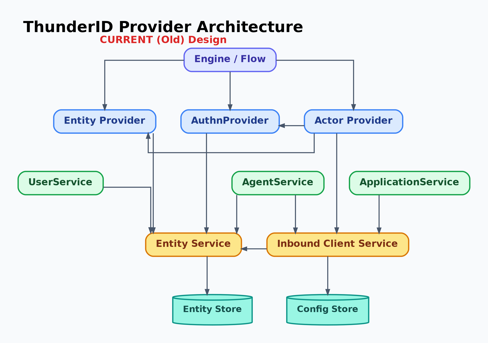
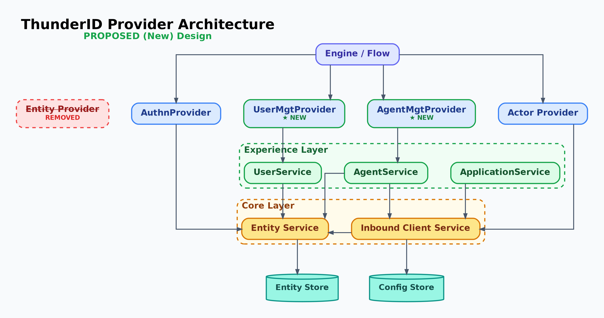
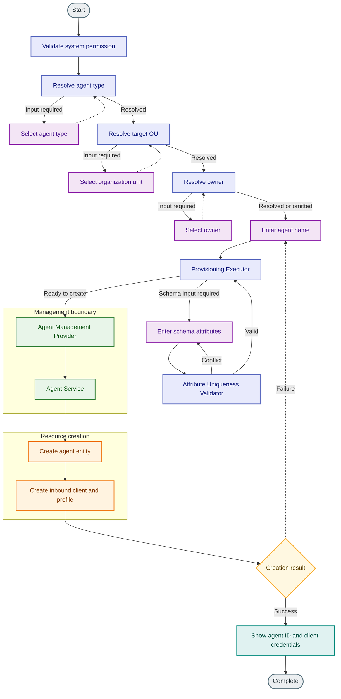
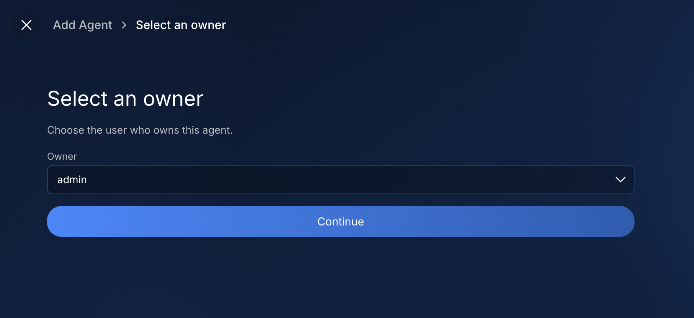
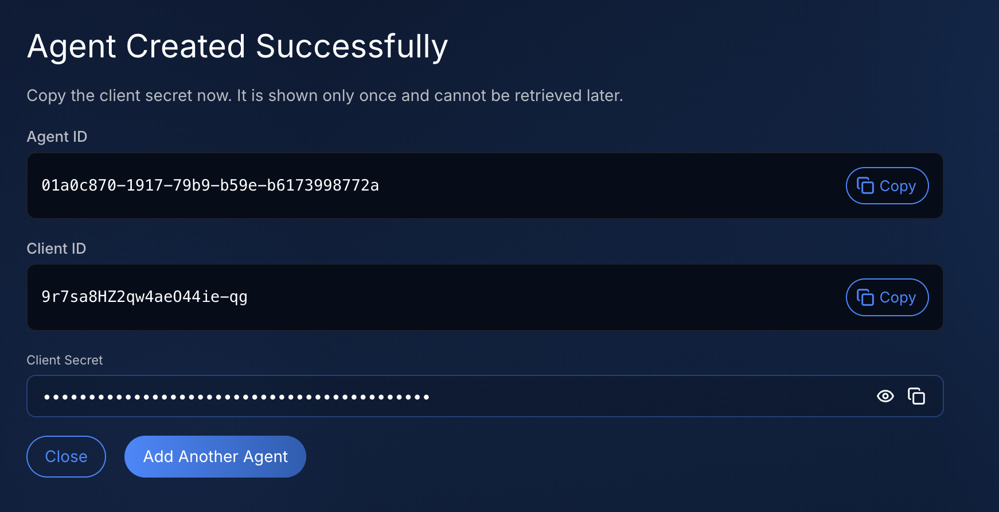

# Agent Onboarding Flow Specification

- **Status:** Draft
- **Version:** 0.1

## Summary

ThunderID agent creation uses a Console wizard whose screens and fields are defined in frontend code. This feature will replace that wizard with a configurable administration flow. The flow will determine which information to collect, resolve the agent schema type and organization unit, verify the owner, and provision the agent. The Console will render the flow and present the generated credentials.

Supporting agent creation requires a change below the UI. Creating an agent involves an entity, an inbound client, and an authentication profile. The agent management service already coordinates these resources and validates the request. Flow executors must use that service through a management provider, rather than reproduce its business logic or create only the underlying entity.

The same boundary will apply to users. This specification therefore includes the prerequisite management-provider changes, category-aware flow execution, the onboarding flow, and the Console experience. The initial supported categories will be users and agents. Shared executors must accommodate category differences without introducing a separate provisioning executor for each category.

Agent self-registration, changes to agent editing, and the complete replacement of the entity provider are outside this feature. Enforcing application agent-type restrictions across all OAuth authentication paths is also outside this scope, as is rendering the new user selection input outside the Console, in the client SDKs.

## Architecture

### Why the provider architecture must change

The entity provider exposes operations on the common entity representation. Using its creation operation from a flow is sufficient to persist an entity, but does not establish that the complete category-specific resource has been created.

For an agent, provisioning must also create and configure its inbound client and authentication profile. It must apply agent rules such as name validation, owner resolution, credential generation, and inbound authentication validation. Calling the entity provider alone would bypass that work. Calling the inbound services separately from the executor would make the executor another owner of the agent creation process, including its failure handling.

The same problem applies to users even though their creation does not require the agent's inbound resources. ThunderID already has a user management service. Keeping flow creation below that service would require user-specific rules to be repeated in executors or would leave different creation entry points with different validation.

The architectural direction is to keep the entity service internal to management services. A provider exposed to the runtime should represent a supported management capability, with its business rules intact. It should not expose entity persistence as an alternative way to create a user or agent.

The current architecture lets the flow engine reach the entity service through `EntityProvider`. Category management services also use the entity service, but flow-based creation can bypass them.

### Agreed management boundary

Introduce category management providers between flow execution and the management services. The provisioning executor will prepare the request and select the provider for its category. Each default provider will delegate creation to the corresponding management service.

| Component | Responsibility |
|---|---|
| Flow executor | Resolve flow inputs, request missing information, choose the category, and orchestrate the next step. |
| `UserMgtProvider` | Expose user creation to the runtime and delegate to the user management service. |
| `AgentMgtProvider` | Expose agent creation to the runtime, translate flow-level delegation intent into an inbound configuration, and delegate to the agent management service. |
| User management service | Apply user creation rules and coordinate entity creation. |
| Agent management service | Apply agent creation rules and coordinate the entity, inbound client, and authentication profile. |
| Inbound client service | Validate and manage inbound authentication settings and their associated resources. |
| Entity service | Manage the common entity representation used internally by the management services. |

For example, a flow that provisions an agent will call `AgentMgtProvider.CreateAgent`. The provider will call the agent service, which will use the entity and inbound services. The executor will not create an inbound client or generate credentials itself.

Management services will remain the authority for business validation. Flow validation will serve a different purpose: resolving trusted selections and collecting enough information to submit a meaningful creation request. A successful flow precheck will never replace service validation.

The proposed architecture gives the engine category management providers. Each provider enters through its category's management service, which preserves the service layer as the owner of validation and multi-resource creation.

The proposed diagram shows the longer-term provider direction in which `EntityProvider` is removed from the engine boundary. This feature delivers the creation part of that direction: user and agent creation move to their management providers, while the entity provider remains temporarily available for the non-creation operations listed below.

### Prerequisite refactor and phase boundary

The provider refactor must precede agent onboarding. Its initial phase will establish the creation boundary for both categories:

1. Define `UserMgtProvider.CreateUser` and `AgentMgtProvider.CreateAgent` as runtime contracts.
2. Supply default adapters that call the existing management services, preserving service errors and results.
3. Remove creation from the entity provider contract and migrate flow creation to the management providers.
4. Make the management providers available to flow provisioning, with a clear failure when a creation capability is unavailable.

This phase is sufficient for agent onboarding. The entity provider will remain available for existing identification, retrieval, update, deletion, and credential operations. Removing its creation capability must not be described as removing the whole provider. Migrating its remaining responsibilities will require separate work.

This is also a deliberate limit on generalization. Supporting another entity category will require its management capability and category behavior to be defined. Creation itself will not fall back: a node's mode is validated against the known categories before the node runs, and the create dispatch fails for a category it does not name rather than selecting another one.

The shared lookup of per-category behavior is the one exception, and it is a defaulting rule rather than a creation path. Asked for a category it holds no entry for, it returns the user category's behavior, which is what keeps an existing user flow working unchanged. Mode validation runs first and only user and agent exist, so that default is unreachable today. Adding a third category must add its entry in the same change: the lookup will not report a missing one.

### Provider foundation for this feature

Agent onboarding will build on the creation boundary established by the prerequisite refactor. At that point, user creation will go through `UserMgtProvider` to the user service, and agent creation will go through `AgentMgtProvider` to the agent service. The entity provider will no longer create either resource, but will retain its other operations during this phase.

This boundary resolves the original provisioning problem: the flow can request a complete agent through one management operation, while the agent service coordinates the entity, inbound client, and authentication profile. User creation will follow the same ownership model. Executors can therefore share flow orchestration without taking ownership of either category's business rules.

The onboarding design will depend on these management capabilities being available. If the required capability is unavailable, provisioning must fail rather than bypass the management service through entity creation. Provider construction and service wiring are implementation details outside this feature specification.

### Shared flow executors

`ProvisioningExecutor` will provision both users and agents. Its `mode` node property will select the category. Missing or empty mode will retain user behavior for existing flows; supported explicit values will be `user` and `agent`. An unknown category name must fail.

Input collection, schema lookup, existing-entity handling, creation error handling, and post-creation processing will share one execution path. Category-specific facts, such as the application type list, conflict code, required record fields, and group or role assignment type, will be centralized. Creation dispatch will remain explicit because users and agents have different management contracts.

`AttributeUniquenessValidator` will use the same category selection convention. `UserTypeResolver` and the new `AgentTypeResolver` will share type-resolution behavior while retaining their category-specific entry points. The new `OwnerResolver` will verify an optional owner selection.

Errors on these shared paths must describe the selected category. An agent provisioning failure must not report that a user could not be created. Existing error codes will remain stable where the failure meaning is unchanged; messages and localization parameters will supply the category. Callers that translate flow errors, including CIBA, must compare codes rather than message text.

## Detailed design

### Design sequence

Implementation will follow the architectural dependencies. First establish management-provider creation for users and agents. Next adapt shared executors and introduce the resolvers needed by an agent flow. Then define the default administration flow and builder resources. Finally, replace the Console wizard with a page that executes the configured flow.

User provisioning must continue to work throughout this change. The service-backed user path is part of the feature's foundation and must receive regression coverage alongside the new agent path.

### Administration access

The onboarding flow will have type `ADMINISTRATION`. Initiation and every continuation must require an authenticated caller with the root `system` permission. An unauthenticated request will receive the administration authentication error; an authenticated caller without that permission will receive a permission error. A runtime context alone will not satisfy this caller check.

The default flow will also include `PermissionValidator`. The entry-point check must remain effective if a custom flow omits that node. Initiating a flow by ID must be restricted to administration flows, and continuation must recheck authorization before executing another node.

Agent provisioning in a registration flow will be refused before creation. `AgentTypeResolver` will not be offered as a registration-flow capability and will also reject registration execution. Supporting agent self-registration later will require a separate policy decision.

### Resolve the schema type and organization unit

An entity category identifies the kind of resource, such as an agent. An entity type identifies the schema within that category. The onboarding flow must resolve both the agent schema type and the organization unit (OU) in which to create the agent.

For administration, `AgentTypeResolver` will obtain agent types from the entity type service. The node's `allowedAgentTypes` property will optionally narrow that set. An empty node list will impose no additional type restriction. If an OU has already been selected, only types defined in that OU or an ancestor will be eligible.

The resolver will handle the remaining candidates as follows:

| Eligible types | Flow behavior |
|---|---|
| None | Fail with a category-specific type-resolution error. |
| One | Resolve the type without displaying a selection screen. |
| Several | Request a selection and provide the eligible options. |

A submitted selection must be checked again for category, allowed-list membership, and OU compatibility. The resolver will publish the type name and its owning OU into runtime state. The default flow will resolve the type first, then use `OUResolverExecutor` to choose a compatible target OU.

Administration type selection will use the node's allowed list. An application's `allowedAgentTypes` controls application behavior and will not limit what a system administrator may create through this resolver. In authentication flows, `AgentTypeResolver` will reject an application with an empty allowed-agent-type list. This check must not be presented as enforcement across OAuth grants that do not execute the flow.

If provisioning has no resolved target, it may use the existing application-based fallback. That fallback must consider the category's allowed types and their self-registration eligibility. It must not invent a built-in agent type when no eligible type is configured. The shipped administration flow will resolve its target explicitly.

### Runtime data contract

The flow will distinguish submitted selections from values resolved by executors. Downstream provisioning will consume the resolved type, OU, and owner.

| Value | Submitted input | Resolved runtime value | Consumer |
|---|---|---|---|
| User schema type | `userType` | `categoryType` | User provisioning and uniqueness validation. |
| Agent schema type | `agentType` | `categoryType` | Agent provisioning and uniqueness validation. |
| Target OU | `ouId` | `ouId` | Provisioning after OU resolution. |
| Schema's owning OU | No direct input | `defaultOUID` | Default target when no explicit OU is resolved. |
| Agent owner | `owner` | `ownerId` | Agent provisioning after owner verification. |

The shared `categoryType` value must always be interpreted together with the node's category. It is not a global schema identifier. This design assumes one provisioning category at a time within the relevant flow state; a flow author must not reuse an earlier category's resolved type for another category.

Existing `userType` input identifiers will remain compatible. The new agent input will use `agentType`. The shared runtime key does not require renaming stored prompt inputs. Component references may differ from input identifiers, but each prompt must map its components to the corresponding resolver input.

### Resolve the owner

`OwnerResolver` will request an optional `USER_SELECT` input. The Console will obtain user candidates from the user management API and submit the selected user ID. Candidate display is a UI responsibility; accepting the identifier is a server responsibility.

The resolver must verify that the selected entity exists and belongs to the user category. A missing entity and an entity of another category will produce the same owner-selection error and return to the prompt. A lookup service failure will fail execution rather than masquerade as an invalid selection.

After verification, the resolver will write `ownerId`. Provisioning must read the owner only from that runtime value. Posting `owner` or `ownerId` as an unverified input must not bypass the resolver.

If the optional selection is declined, the flow will continue without a resolved owner. The agent service will use the authenticated caller as the default owner. The Console will preselect the signed-in user to make this default visible.

### The user selection input type

Owner selection needs a step that asks for a user, and no existing input type can express that. `SELECT` carries its options in the flow response, whether the flow definition declares them or an executor fills them in at runtime. A user directory does not belong there: it is large, it changes between the moment a flow is authored and the moment it runs, and enumerating it is not the flow's job. A plain text input would accept an identifier but offer the administrator nothing to choose from.

`USER_SELECT` is the input type for that step, and this feature adds it to the engine. It follows the contract `OU_SELECT` already sets: the flow declares the input, the client sources the candidates, and the value submitted is an entity identifier rather than a display value. The engine must recognize the type before a flow can declare it, because flow validation rejects an input whose type it does not know.

The type is a rendering hint, not a trust boundary. Nothing about it constrains what a caller may post, which is why `OwnerResolver` verifies the submitted identifier rather than trusting it. A surface that offers a narrower candidate list does not narrow what the server will accept, and a surface that offers no list at all does not prevent a valid selection from being submitted directly.

The Console will render the input by listing users from the user management API, showing each user's display value, and submitting the selected identifier. For the owner input it will preselect the signed-in user, so the server's default owner is visible before the step is submitted.

#### Carrying the type into the SDKs

The type must reach the client SDKs on the same terms as every other input type, and today it does not. The SDK's embedded flow component enum carries `OU_SELECT` but has no `USER_SELECT` member, and its renderer is the one case that declines to draw: the `OU_SELECT` branch logs a warning and renders nothing. A data callback for the organization unit picker exists in the SDK and no consumer passes it, so it is the data half of a picker whose interface half was never built.

The consequence is that a surface can only render either picker by recognizing the type through a string comparison, fetching the candidates itself, and drawing the control itself. That is what the Console onboarding page does, and it is why that page matches components by hand instead of delegating to the shared renderer, and why it imports from feature packages to satisfy what is a protocol-level input type. Every further surface that wants the capability repeats the same work, and renaming the type on the backend would continue to compile in all of them while the field silently stopped appearing.

Registering `USER_SELECT` in the SDKs, with a rendering adapter and a user-fetch callback beside the organization unit picker's existing one, is required before the capability is usable outside the Console. It is not delivered by this feature. The two picker types have to move together, since supporting one would leave a single step with one picker drawn by the SDK and another drawn by the consumer, and drawing the organization unit picker through the SDK changes its appearance in flows that already ship. That is a user-visible change needing design agreement of its own rather than a refactor this feature can absorb. It is written up in `tasks/issues/user-select-flow-input-type.md`.

The flow builder's input-type picker for executor inputs does not offer `USER_SELECT` either. The owner prompt is composed from the Owner Resolution widget, which carries the input in its own definition.

### Collect and validate agent information

Agent information has two sources of definition. System attributes, including the agent name, belong to the agent management model. Schema attributes belong to the selected agent type and may differ between deployments. The flow will collect these through separate prompts so that each has a correction path appropriate to its validation owner.

#### Agent name and system-attribute validation

The flow will collect the required agent name in a dedicated name prompt. The name is an agent system attribute, not an attribute defined by the agent schema. It must therefore be collected independently of the schema-driven details prompt.

After the name is submitted, the flow will proceed to `ProvisioningExecutor`. Once the required information is available, that executor will call the agent management provider, which will delegate creation to the agent service. The agent service will validate system attributes, including the name and its uniqueness. These rules will remain in the service so that flow-based and direct API creation use the same business validation.

The provisioning node's failure connection will return to the name prompt. This gives the administrator a place to correct a name rejected by the agent service and resubmit it. The flow must preserve the service error and previously collected details. This connection is the default flow's correction route; it does not mean every provisioning failure is a name error or can be resolved by editing the name.

#### Schema attributes and their correction path

A separate details prompt will collect attributes defined by the resolved agent schema. Required attributes must be supplied before creation. The flow may also request optional attributes, and schema enumeration values will supply choices where appropriate. Changing an agent schema must not require changing the Console page's field definitions.

When provisioning needs schema information, its incomplete connection will lead to the details prompt. Submission from that prompt will pass through `AttributeUniquenessValidator` before returning to provisioning. The validator will check supplied values for attributes marked unique in the selected schema. A conflict will return to the details prompt so the administrator can correct the affected schema attribute separately from the agent name.

The validator is a schema-attribute uniqueness check, not a replacement for all schema validation. The management-service creation path will remain responsible for accepting or rejecting the complete request, including conflicts that arise after the preliminary check.

| Connection | Purpose |
|---|---|
| Name prompt to provisioning | Submit the system attribute and attempt to advance creation. |
| Provisioning incomplete to details prompt | Collect outstanding schema information. |
| Details prompt to attribute uniqueness validator | Check unique schema attributes before creation. |
| Uniqueness validator incomplete to details prompt | Correct a conflicting schema attribute. |
| Uniqueness validator success to provisioning | Continue creation with the collected details. |
| Provisioning failure to name prompt | Present service validation errors and support correction of the agent name. |

#### Other collected information

Owner selection will use the separate verification step described above. Description and logo will be optional management fields when included in a custom flow. A missing logo will use the standard agent avatar. These fields must not be treated as schema attributes merely because a flow collects them.

A custom flow may also collect delegation intent and callback URIs. A delegated agent must supply callback URIs before creation; an absent delegation choice will mean a non-delegated agent. An unreadable delegation value must produce an error rather than silently change the requested behavior. Inbound configuration validation will remain with the management services.

The schema details prompt may be unnecessary when no schema information is outstanding. An agent with a valid name and no supplied optional schema attributes must still be eligible for creation. The flow must not require an artificial schema attribute merely to establish that agent information has been collected.

### Uniqueness and existing entities

The uniqueness validator will load unique attributes from the resolved type in the selected category. If a supplied value conflicts, it will return an input-required response with an error identifying the attribute. The flow can then return to the relevant prompt without discarding other inputs.

This is an early correction step. Management-service validation will remain authoritative at creation, including when another request creates a conflicting record after the precheck. Attribute-conflict errors from the user or agent service will map to the shared flow conflict error with the correct category. Other service errors will retain their codes and parameters.

Existing-entity and cross-OU provisioning behavior will remain shared. With cross-OU provisioning disabled, an existing identity must follow the existing skip, correction, or failure behavior for the flow type. With it enabled, provisioning must resolve a target OU and refuse another matching identity in that target.

The retained entity provider's identification methods do not receive a category or OU argument. Selecting agent mode changes the schema and error context; it does not, by itself, make those lookups category- or OU-scoped. This feature does not promise a new uniqueness namespace or complete the wider entity-identification refactor.

### Create the complete resource

After collecting valid input, the provisioning executor will build a category-specific request and invoke its management provider. A user request will include its type, OU, and schema attributes. An agent request will also include its management fields and delegation intent.

The default agent provider will derive the supported OAuth configuration:

| Setting | Agent acting on its own behalf | Delegated agent |
|---|---|---|
| Grant types | `client_credentials` | `client_credentials`, `authorization_code`, and `refresh_token` |
| Client authentication | `client_secret_basic` | `client_secret_basic` |
| Response types | None | `code` |
| PKCE | No authorization-code requirement | Required |
| Redirect URIs | Not required | Supplied callback URIs required |

The provider will accept delegation intent and caller-supplied redirect URIs rather than accept arbitrary inbound settings from flow inputs. It will leave flow identifiers and token settings to the inbound service's OU and server defaults. It must not invent a callback URI. Allowed user types on a provider request will apply only to delegated agents; adding a dedicated onboarding control for that setting is outside this feature.

The agent service will validate the request, resolve an absent owner, generate credentials, and coordinate entity and inbound-resource creation. If inbound creation fails after entity creation, compensation will remain the agent service's responsibility. The executor must not implement its own resource-creation or rollback sequence.

A missing provider, disabled provider, service error, or creation result without an entity ID must prevent successful provisioning. After creation, the shared executor will perform configured group and role assignments using the category's corresponding member or assignee type and update the flow authentication state through the existing authentication provider.

The overall flow is not a transaction. Failure during post-creation assignment or authentication can leave the resource created. Leaving the page after provisioning must not be described as canceling or deleting that resource. Abandoning the default flow before provisioning will create no agent.

### Return credentials

Successful agent creation will publish `agentId`, `clientId`, and `clientSecret` as additional flow response data. The credentials prompt will bind its display components to these values.

The client secret is a creation-time result and cannot be retrieved later through an agent read operation. The UI must present it masked, with explicit reveal and copy controls, and explain that it must be saved before leaving. Restarting the flow must clear the previous run's values.

The screen will tell the administrator that the secret is shown once and cannot be retrieved later. That wording states the guarantee the agent management API gives, which is that no read operation returns the secret. It is not a statement about the flow runtime: execution state may retain the response data for the lifetime of the run, under the runtime's storage and expiry rules. Secrets must not be added to logs or persistent browser storage.

### Default onboarding flow

The shipped flow will have handle `default-agent-onboarding-flow` and type `ADMINISTRATION`. It will provide the following sequence, with prompt loops where information is required:

The flow keeps orchestration in the executor layer and creation ownership in the management layer. `ProvisioningExecutor` collects the flow result and calls `AgentMgtProvider` only when the required information is available. The provider delegates to the agent service, which validates the system attributes and coordinates the entity, inbound client, and authentication profile. A successful service result supplies the identifiers and secret used by the credentials prompt.

1. Validate the administrator's permission.
2. Resolve the agent schema type, initially restricted to the `default` agent type.
3. Resolve the target OU.
4. Resolve the owner.
5. Collect the agent name.
6. Run agent provisioning, requesting outstanding schema attributes through the details prompt and checking submitted unique attributes before retrying creation.
7. Display the created agent's identifiers and client secret, then finish the flow.

The provisioning node will set `mode: agent` and `includeOptional: true`. Its incomplete path will return to the details prompt, and its failure path will return to the separate name prompt with the service error, supporting correction of system attributes validated during agent creation. The uniqueness validator will also use agent mode. The details prompt will submit through that validator, whose incomplete path will return to the same details prompt for schema-attribute correction and whose success path will return to provisioning. The validator will declare no failure connection of its own.

The default flow will create a non-delegated agent unless delegation input is added. Flow authors will be able to add the delegation widget and collect callback URIs without changing the Console creation page. The flow will determine screen order, branching, and which optional details are requested.

### Data model and API

The feature will reuse existing entity, agent, inbound-client, and flow-execution storage. It requires no new database tables, columns, or indexes. Type, OU, and owner resolution will use existing transient flow state. Schema enumeration metadata will be exposed to input generation from the existing stored schema.

No dedicated onboarding endpoint is required. The Console will compose existing APIs:

| API | Purpose |
|---|---|
| `GET /server-config/flow` | Read the effective onboarding flow handle. |
| `GET /flows?flowType=ADMINISTRATION` | Resolve the handle to a flow ID, following pagination. |
| `POST /flow/execute` | Initiate and continue the authorized administration flow. |
| `GET /users?include=display` | Supply owner candidates with user display values. |
| Existing OU APIs | Supply the OU selector. |

The Console will initiate execution with the resolved `flowId` and continue using the execution ID and action/input contract. Verbose responses will provide the components needed to render each step. Provider contracts and `USER_SELECT` are runtime additions; they do not introduce a new REST creation model. Direct agent creation will continue to use the agent management API.

### UI

#### Onboarding page

The agent create route will render a flow-driven onboarding page in place of the wizard. The page will resolve the configured flow, start it, render the returned components, and submit the selected action and input values. It must not assemble an agent creation request or fall back to posting to the agent API.

Text, input blocks, ordinary selects, user and OU selectors, actions, and copyable values will use the Console's visual components. The renderer will support runtime options and schema-generated fields. User selection will show a display value while submitting the user ID. The OU selector will respect the root supplied by the flow.

The owner step will follow this layout:

The name and details prompts will use the same page shell, with fields and labels supplied by the flow. Their number and order will not be hardcoded into a wizard model. Read failures will appear where the missing content belongs, and submission failures will remain visible beside the current step. A submission failure will show the message the flow engine returned, which arrives with its parameters already substituted and therefore already names the agent category. The page will not re-resolve that message from the error code. A response carrying no readable message will fall back to a generic step-failure string from the Console catalog.

Breadcrumbs will derive from visited step headings. Returning to a previously visited heading will trim the trail. Only the first breadcrumb will restart the run; other breadcrumbs will not imply that the engine supports backward navigation. Since branches and dynamic prompts can change the number of screens, progress will be an activity indication rather than a fixed step count.

#### Credentials screen

The result prompt will present copyable agent and client IDs and a masked client secret. **Close** will return to the agent list. **Add Another Agent** will start a fresh execution.

#### Flow builder

The builder will expose the flow capabilities through its existing resource panel and property editor:

| Resource | Authoring behavior |
|---|---|
| Provision User | Insert `ProvisioningExecutor` configured for users. |
| Provision Agent | Insert the same executor with `mode: agent`. |
| Agent Type Resolver | Insert `AgentTypeResolver` and edit its allowed agent types. |
| Owner Resolver | Insert owner verification with a user-selection prompt. |
| Attribute Uniqueness Validator | Select the category whose schema defines the unique attributes. |
| Owner Resolution widget | Compose the owner prompt and resolver. |
| Agent Delegation widget | Collect delegation intent and callback information. |
| Agent Onboarding Flow template | Start a flow from the permission check, owner resolution, name and details prompts, provisioning node, and credentials screen. |

Canvas metadata must distinguish the two provisioning resources by their mode as well as their executor name. Reopening an agent provisioning node must retain its agent label and settings. These resources will use the existing builder panels; a separate agent-specific flow editor is not required.

The template is a starting point, not a runnable onboarding flow. It omits agent type resolution, so a flow authored from it resolves no `categoryType`. An administration flow has no application behind it, which means provisioning cannot fall back to an application's allowed agent types either, and the node fails before it collects anything. An author must add `AgentTypeResolver` ahead of provisioning, and will usually add `OUResolverExecutor` and `AttributeUniquenessValidator` as well. Closing that gap in the shipped template is outstanding work; until then the bootstrapped `default-agent-onboarding-flow` is the reference for a flow that runs end to end.

### Configuration

| Setting | Default or initial value | Scope | Validation and behavior |
|---|---|---|---|
| `flow.agentOnboardingFlow.defaultHandle` | `default-agent-onboarding-flow` | Server configuration | Must resolve to an administration flow before onboarding can start. |
| `user_mgt_provider.type` | Default service-backed provider | Deployment | `disabled` must reject user provisioning. |
| `agent_mgt_provider.type` | Default service-backed provider | Deployment | `disabled` must reject agent provisioning. |
| Provisioning or uniqueness node `mode` | `user` when absent or empty | Flow node | Accept `user` or `agent`; reject unknown category names. |
| Agent resolver `allowedAgentTypes` | `default` in the shipped flow | Flow node | Restrict the candidate schema types; an empty list adds no restriction. |
| Provisioning `includeOptional` | `true` in the shipped flow | Flow node | Include optional schema attributes in collection. |

The Console must read the `merged` configuration layer. A missing handle, a handle that does not resolve to an administration flow, and a configuration request failure are distinct conditions. Missing configuration will identify the setting to configure; a missing flow will identify the configured handle. A request failure must not be reported as an empty setting.

Handle resolution must search subsequent pages of administration flows. The Console must not assume the bootstrap flow is on the first page or hardcode its ID.

The default flow and its configuration will be bootstrap resources. Existing deployments must apply those resources through the bootstrap process during upgrade; a binary update alone must not be assumed to install them. Flow authors may select another administration flow by changing the configured handle.

## Requirements

### R1. Preserve management-service ownership of creation

**Requirement:** Flow creation must use the business rules of the corresponding category management service.

**Acceptance criteria:**

- **AC1.1:** Given user provisioning, when creation runs, then the executor calls `UserMgtProvider` and the default provider calls the user service.
- **AC1.2:** Given agent provisioning, when creation runs, then the executor calls `AgentMgtProvider` and the default provider calls the agent service to coordinate the complete agent resource.
- **AC1.3:** Given the provider refactor, when the entity provider contract is inspected, then it exposes no creation operation; its remaining operations are not required to be removed by this feature.
- **AC1.4:** Given invalid creation data, when the management service rejects it, then the flow preserves the service error except for the specified category-aware attribute-conflict mapping.

### R2. Require the management-provider foundation

**Requirement:** Agent onboarding must depend on the category management capabilities established by the prerequisite refactor.

**Acceptance criteria:**

- **AC2.1:** Given the prerequisite refactor, when flow provisioning creates a user or agent, then creation reaches the corresponding management service through its provider.
- **AC2.2:** Given an unavailable management capability, when provisioning is attempted, then the flow fails without falling back to entity-provider creation.
- **AC2.3:** Given agent onboarding, when the complete agent resource is created, then coordination of the entity and inbound resources remains in the agent service rather than the executor.

### R3. Share provisioning across categories

**Requirement:** One provisioning executor must serve users and agents while preserving category-specific behavior.

**Acceptance criteria:**

- **AC3.1:** Given `mode: agent`, when provisioning runs, then it creates an agent through the agent management boundary.
- **AC3.2:** Given `mode: user` or an omitted mode, when provisioning runs, then it uses user provisioning and preserves existing registration and eligible authentication behavior.
- **AC3.3:** Given an unknown category name, when provisioning or uniqueness validation runs, then it fails without selecting a different category.
- **AC3.4:** Given an agent-path error, when it is rendered, then it names the agent category without unresolved localization placeholders or user-specific wording.
- **AC3.5:** Given configured group or role assignments, when creation succeeds, then assignment uses the created category's member or assignee type.

### R4. Resolve an eligible agent schema and OU

**Requirement:** The flow must resolve a valid agent schema type and compatible target OU before creation.

**Acceptance criteria:**

- **AC4.1:** Given one eligible type, when resolution runs, then it continues without prompting; given several, it requests a selection.
- **AC4.2:** Given no eligible type, when resolution runs, then it fails with an agent type-resolution error.
- **AC4.3:** Given a submitted type outside the node's allowed list or incompatible with the selected OU, when it is validated, then it is refused.
- **AC4.4:** Given successful resolution, when provisioning runs, then it consumes `categoryType` and the resolved OU, preferring `ouId` over `defaultOUID`.
- **AC4.5:** Given an application fallback with no eligible types, when a target is requested, then it does not substitute a built-in agent type.

### R5. Verify agent ownership

**Requirement:** An administrator may select a user owner or use the authenticated caller as the default.

**Acceptance criteria:**

- **AC5.1:** Given a selected user, when the owner resolver verifies it and creation succeeds, then that user owns the agent.
- **AC5.2:** Given a nonexistent ID or an ID from another category, when it is submitted as owner, then the same selection error is returned and the prompt is shown again.
- **AC5.3:** Given an unverified owner input, when provisioning runs, then that value cannot replace the resolved owner.
- **AC5.4:** Given no selected owner, when creation succeeds, then the authenticated caller owns the agent.
- **AC5.5:** Given a flow declaring a `USER_SELECT` input, when the flow is validated, then the input type is accepted; and when the Console renders that step, then it lists candidates it sourced itself and submits the selected user's identifier rather than a display value.

### R6. Collect and validate system and schema attributes separately

**Requirement:** The flow must collect the agent name separately from schema attributes and provide correction paths that reflect their different validation responsibilities.

**Acceptance criteria:**

- **AC6.1:** Given agent onboarding, when information is collected, then the required name is requested through a dedicated prompt and outstanding schema attributes through a separate details prompt.
- **AC6.2:** Given optional collection is enabled and a string schema attribute has enumerated values, when the details prompt renders, then it offers those values.
- **AC6.3:** Given a valid agent name and no supplied optional schema attributes, when provisioning runs, then an empty attribute payload alone does not prevent creation.
- **AC6.4:** Given a submitted details prompt, when the schema uniqueness validator detects a conflict, then its incomplete path returns to the details prompt with the conflicting attribute identified.
- **AC6.5:** Given a conflict arising after the precheck, when creation runs, then management-service validation rejects it.
- **AC6.6:** Given a name rejected by the agent service, when the error returns through the provider and provisioning executor, then the provisioning failure path leads to the name prompt with the error and previously collected details preserved.
- **AC6.7:** Given outstanding schema information, when provisioning cannot proceed, then its incomplete path leads to the details prompt; successful uniqueness validation then returns to provisioning.

### R7. Create the requested inbound authentication configuration

**Requirement:** Flow delegation intent must produce the supported agent inbound configuration through the management services.

**Acceptance criteria:**

- **AC7.1:** Given no delegation, when an agent is created, then its inbound client supports client credentials with `client_secret_basic`.
- **AC7.2:** Given delegation and valid callback URIs, when creation succeeds, then authorization code, refresh token, code response, and PKCE settings are included.
- **AC7.3:** Given delegation with no callback URI, when provisioning runs, then a URI is requested and no fabricated default is used.
- **AC7.4:** Given an unreadable delegation value, when provisioning processes it, then creation fails with an error identifying that input.
- **AC7.5:** Given an inbound-creation failure after entity creation, when the service handles the failure, then it invokes its compensation path and the flow does not report successful provisioning.

### R8. Restrict onboarding execution

**Requirement:** Agent onboarding must require an authorized administration caller and refuse agent self-registration.

**Acceptance criteria:**

- **AC8.1:** Given no authenticated caller, when an administration flow is initiated or continued, then execution is rejected before provisioning.
- **AC8.2:** Given an authenticated caller without root `system` permission, when the same request is made, then execution is refused.
- **AC8.3:** Given a custom administration flow without `PermissionValidator`, when an unauthorized caller executes it, then the entry-point gate still rejects the request.
- **AC8.4:** Given a registration flow containing agent provisioning, when it executes, then no agent is created.

### R9. Run onboarding from the configured Console flow

**Requirement:** The Console must replace its fixed creation wizard with the configured administration flow.

**Acceptance criteria:**

- **AC9.1:** Given a configured and available flow, when the agent create page opens, then it executes that flow and renders its first prompt.
- **AC9.2:** Given the matching flow is on a later listing page, when the handle is resolved, then onboarding still starts.
- **AC9.3:** Given missing configuration, a missing flow, or a failed configuration request, when the page opens, then it reports the appropriate distinct condition without using direct agent creation as a fallback.
- **AC9.4:** Given a flow change using supported components, when onboarding starts again, then the page follows the changed prompts and actions without a wizard code change.
- **AC9.5:** Given the default flow is abandoned before provisioning, when the page is closed, then no agent has been created.

### R10. Present creation credentials

**Requirement:** Successful onboarding must show the generated credentials and make their creation-time availability clear.

**Acceptance criteria:**

- **AC10.1:** Given successful provisioning, when the credentials prompt appears, then the agent ID, client ID, and masked client secret are available with copy controls.
- **AC10.2:** Given a masked secret, when reveal is selected, then the secret is displayed for copying.
- **AC10.3:** Given a completed creation, when Close is selected, then the Console returns to the agent list; when Add Another Agent is selected, it starts a fresh run without the previous credentials.
- **AC10.4:** Given a later agent read, when details are fetched, then onboarding does not depend on retrieving the creation secret again.

### R11. Author and configure onboarding flows

**Requirement:** A flow author must be able to compose and select an agent onboarding flow through existing configuration surfaces.

**Acceptance criteria:**

- **AC11.1:** Given the builder resource panel, when agent onboarding is authored, then the agent provisioning entry, agent type resolver, owner resolver, related widgets, and template are available.
- **AC11.2:** Given an agent provisioning node, when the flow is reopened, then the canvas labels it as Provision Agent and retains agent mode.
- **AC11.3:** Given an agent resolver or uniqueness validator, when its properties are edited, then the corresponding allowed types or category can be configured.
- **AC11.4:** Given another valid administration flow handle in the merged server configuration, when onboarding starts, then the Console runs that flow.
- **AC11.5:** Given a flow authored from the Agent Onboarding Flow template with no agent type resolver added, when it runs, then provisioning fails rather than creating an agent under an assumed type.

## Change log

| Version | Date | Change |
|---|---|---|
| 0.1 | 2026-09-07 | Initial specification. |