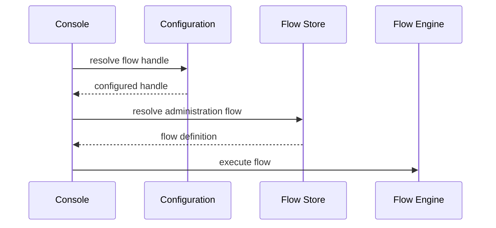
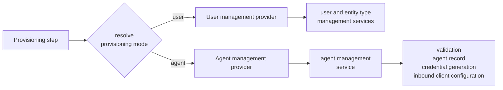
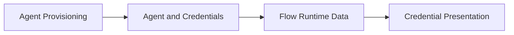

# Agent Onboarding Flow Specification

- **Status:** Draft
- **Version:** 0.1

## Summary

Agent onboarding in ThunderID is currently a fixed sequence embedded in the Admin Console. The console decides what information is collected, the order of the steps, and how the resulting agent credentials are presented. Because the sequence lives in the console, organizations cannot adapt onboarding to their own security, governance, or operational requirements, and any change to the sequence requires a product change and a console release.

This specification moves agent onboarding to a configurable flow that is resolved and executed at runtime, reusing the resolution model ThunderID already applies to other administrator-driven operations such as user onboarding and user deletion. A default Agent Onboarding flow ships so the feature works out of the box, and organizations customize the experience through the existing flow management capabilities.

Agent onboarding differs from those operations in one respect. User onboarding and user deletion each retain a non-flow path, so an unresolved flow handle degrades to direct creation or deletion. Agent onboarding has no such fallback: the console creates an agent only by executing the resolved flow, so a deployment that does not provide the flow cannot create an agent through the console.

The governing design decision is to implement agent onboarding as an Administrator Flow that reuses the existing flow model, rather than introducing a new flow type or keeping a hardcoded console sequence. The flow orchestrates the onboarding experience, while the existing agent management service stays authoritative for validation, agent creation, credential generation, and inbound client configuration.

## Architecture

The feature is built on the existing flow infrastructure and the existing agent management layer. No new flow type is introduced.

The participating components and their ownership boundaries are:

- **Admin Console.** Resolves the configured flow handle and executes the resolved flow. It no longer owns the onboarding sequence or a completion screen.
- **Configuration.** Holds the flow handle that maps agent onboarding to a flow definition, so the default flow can be replaced without a console change.
- **Flow Store.** Stores and returns the administrator flow definition for the resolved handle.
- **Flow Engine.** Provides sequencing, prompting, conditional execution, authorization, and runtime data. It executes the onboarding flow and carries generated credentials as runtime data.
- **Provisioning step and providers.** A generalized provisioning step resolves a provisioning mode and delegates creation to the correct provider. The user management provider handles user creation; a new agent management provider handles agent creation. The entity provider participates in this step to identify an entity that already matches, not to create one.
- **Attribute uniqueness validator.** Checks the values supplied for the attributes the entity type marks unique before creation runs, so a conflict is reported against the attribute that caused it. It is a flow step in its own right and is configured with the entity category it applies to.
- **Agent Management Service (and Agent API).** Remains the authoritative path for agent validation, agent record creation, credential generation, and inbound client configuration.
- **Agent type schema.** Continues to determine which agent attributes can be collected and stored.

The onboarding flow is resolved as an administrator flow at runtime:

## Detailed design

### Flow resolution and execution

Agent onboarding is executed through a flow definition resolved at runtime. The console reads a configurable flow handle from configuration, resolves the matching administrator flow definition from the flow store, and hands execution to the flow engine. Because the handle is configurable, the default onboarding flow can be replaced without changing the console implementation. This mirrors the resolution pattern already used by other administrator-driven operations.

Ownership: the console owns only resolution and execution kickoff. All sequencing, prompting, and conditional logic belong to the flow engine and the flow definition.

### Default Agent Onboarding flow

A default Agent Onboarding flow provides the baseline experience so the feature works without configuration. Organizations can add, remove, reorder, or branch from these steps through flow configuration.

Name collection is a step of its own rather than part of attribute collection. The name is a field of the agent record, not an entry in the agent type schema, so it is collected and validated separately from the schema-driven attributes.

The default steps are a starting point, not a fixed contract. The only invariants are that provisioning delegates to the agent management service and that credential presentation happens within the flow.

### Owner resolution executor

A new executor resolves the agent owner during the flow. It runs as a flow step and makes the resolved owner available as runtime data for later steps, including provisioning. Keeping owner resolution in its own executor lets organizations reorder or replace it without affecting provisioning logic.

The owner is optional. When the administrator selects none, ownership resolves to the authenticated subject running the flow. When one is selected, the executor confirms it names an existing user before publishing it.

The owner is chosen through a user selection input. The flow declares the input and the client retrieves the candidate users itself, so the flow does not carry a user list in its response.

### Provisioning delegation and the agent provider

The provisioning step is generalized so that it provides the common orchestration for collecting the required information while delegating the actual creation to a provider selected by a resolved provisioning mode. The user path delegates to the user management provider, and the agent path delegates to a new agent management provider. The agent provider connects to the existing agent management service, which performs validation, creates the agent record, generates credentials, and configures the inbound client.

The provisioning mode is the entity category the step operates on, either a user or an agent. It is set as a property on the provisioning node, so the same executor serves both categories and the flow definition states which one applies. A node that sets no mode operates on the default category.

Ownership: the flow owns orchestration and information collection. Creation rules stay entirely in the agent management service and are not duplicated in the flow.

### Credential presentation and completion

After provisioning, the agent provider ensures the newly created agent has the required authentication configuration and returns the generated credentials as flow runtime data. The final flow step presents those credentials to the administrator. Credential presentation is a flow step, not a hardcoded console completion screen.

The client secret is returned only when the agent is created, and cannot be retrieved afterwards. The response that completes provisioning is therefore the single opportunity to surface it, which is why presentation belongs inside the flow rather than to a screen that could be reached again later. The secret is presented so that it can be copied without being displayed.

### Failure handling and recovery

Onboarding must not leave behind a partially configured or unusable agent, and it must not leave an unintended live credential.

Failures that occur during the creation operation itself continue to be handled by the agent management service, which is responsible for not producing a partial agent record.

The flow is responsible for the other half: returning the administrator to a step that can resolve the failure. A rejection is only actionable if the administrator lands on the step that collected the value causing it, so the provisioning step routes each outcome to a different destination.

| Outcome | Destination | Reason |
|---|---|---|
| Success | Credential presentation | The run completes. |
| More input required | Attribute collection | The values the step still needs are collected there. |
| Creation rejected | Name collection | A rejected name is the recoverable failure the creation call reports, and the name step is where it can be changed. |

A conflict on an attribute the entity type marks unique is detected before creation by the uniqueness step, which returns the administrator to attribute collection with the offending attribute named. Detecting it there rather than at creation is what allows the message to identify the attribute rather than reporting a generic conflict.

Without this routing a rejection ends the run on a screen holding no editable value, leaving the administrator to restart onboarding from the beginning.

### Data model

No new schema is introduced by this feature. Agent records, credentials, and inbound client configuration continue to be owned and stored by the existing agent management service. The default Agent Onboarding flow is provided as a flow definition through bootstrap file.

### API

No new external agent API is introduced. The existing Agent API and agent management service remain the authoritative path for agent validation and creation, and the agent provider calls that existing path. Flow execution uses the existing flow engine interfaces.

### UI

This feature changes user-facing behavior in the Admin Console:

- The hardcoded agent creation wizard is replaced by a flow-driven experience that executes the resolved Agent Onboarding flow.
- Credential presentation moves from a console completion screen into a flow step.
- Flow authoring and customization for Agent Onboarding is supported through the existing flow builder, including an Agent Onboarding template based on the default flow.

### Configuration

A configurable flow handle maps agent onboarding to a flow definition and allows the default flow to be replaced without a console change.

The handle lives in the flow section of the server configuration, alongside the handles for the other flow types:

| Key | Default | Validation |
|---|---|---|
| `flow.agentOnboardingFlow.defaultHandle` | `default-agent-onboarding-flow` | Must name an existing flow of the administration type. |

The handle is deployment-level, matching every other flow handle in that section. The default is provided with the bootstrap resources, so a deployment that takes those resources unchanged needs no configuration.

Because agent creation has no non-flow fallback, a deployment that provisions its resources declaratively must supply both the flow definition and this handle. Omitting either leaves agent creation unavailable in the console.

## Requirements

### R1. Agent onboarding is a configurable flow

**Requirement:** Agent onboarding must be executed through a flow definition resolved at runtime rather than through a hardcoded console sequence. A default Agent Onboarding flow is provided so the feature works out of the box, and organizations can customize the flow through the existing flow management capabilities.

**Acceptance criteria:**

- **AC1.1:** Given an organization using the default configuration, when an administrator starts agent onboarding, then the console resolves the configured flow handle and executes the resolved flow definition instead of a hardcoded sequence.
- **AC1.2:** Given an organization that has customized the Agent Onboarding flow, when an administrator starts agent onboarding, then the customized flow is executed with no console code change or console release.
- **AC1.3:** Given a fresh deployment with no customization, when an administrator runs agent onboarding, then the default Agent Onboarding flow completes onboarding end to end and produces a usable agent with credentials.

### R2. The organization controls the onboarding experience

**Requirement:** The flow definition determines which steps are included, the order of the steps, what information is collected, and which additional organization-specific steps are performed. The agent type schema continues to determine which agent attributes can be collected and stored.

**Acceptance criteria:**

- **AC2.1:** Given a flow definition that inserts an organization-specific step, when the flow runs, then that step executes in its configured position.
- **AC2.2:** Given a flow definition that reorders the onboarding steps, when the flow runs, then the steps execute in the configured order.
- **AC2.3:** Given a resolved agent type, when attribute collection runs, then only attributes permitted by the agent type schema can be collected and stored.

## Change log

| Version | Date | Change |
|---|---|---|
| 0.1 | 2026-09-07 | Initial specification. |
