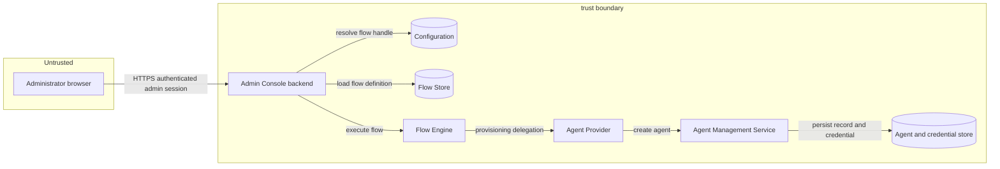
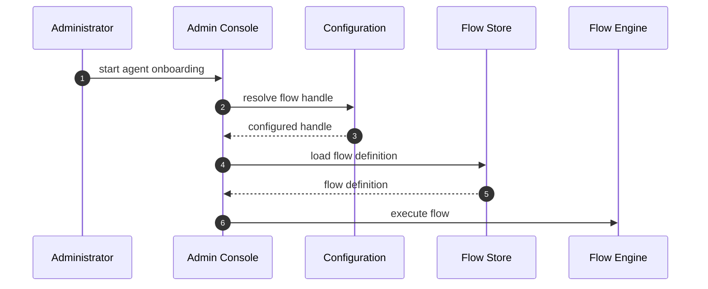
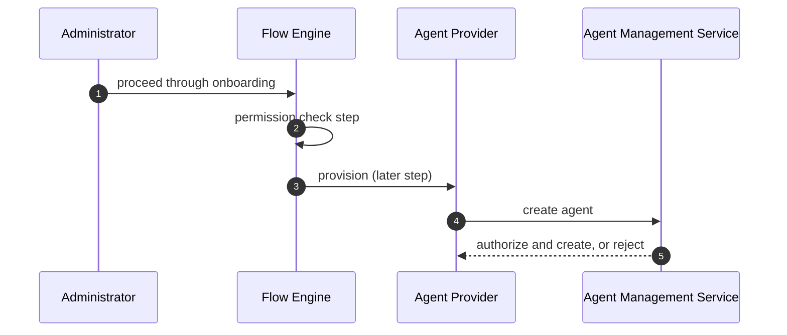
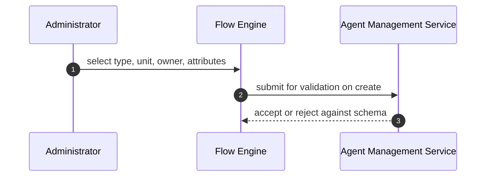
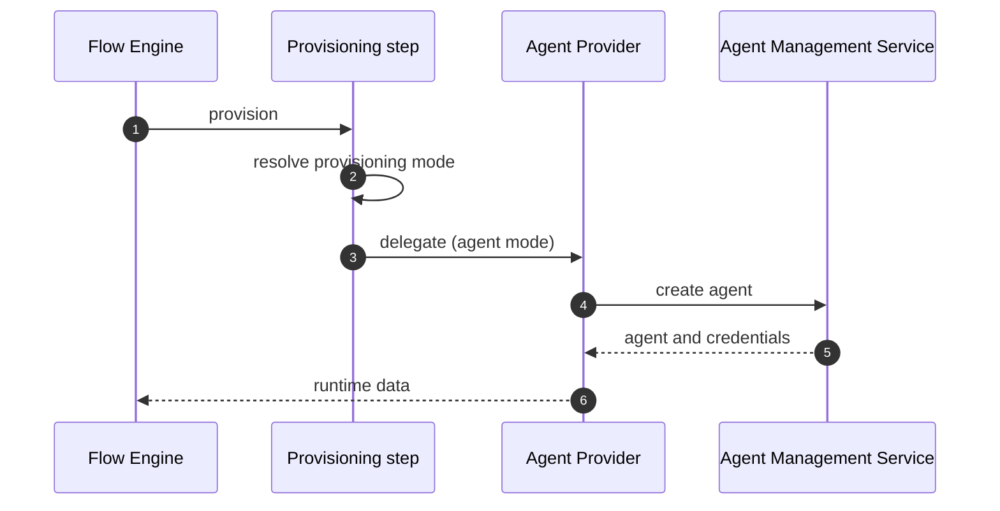
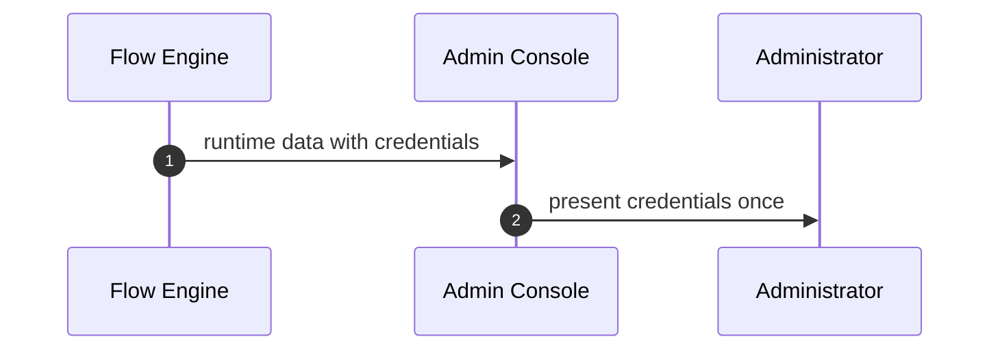
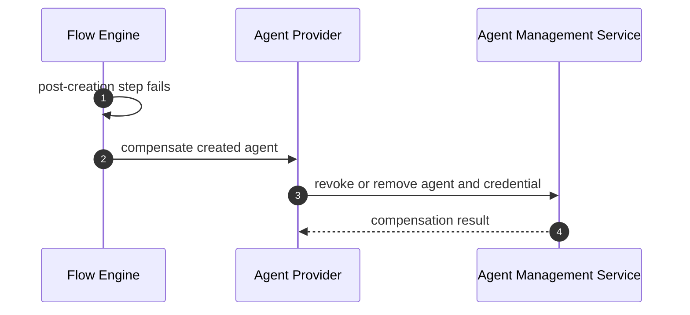
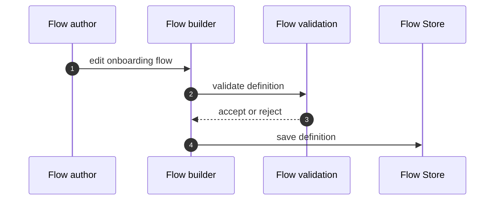

# Agent Onboarding Flow Threat Model

- **Status:** Draft
- **Version:** 0.1
- **Companion spec:** Agent Onboarding Flow Specification v0.1

This model covers the configurable Agent Onboarding administrator flow: resolution and execution of the flow, the onboarding steps, delegation of agent creation to the agent provider, presentation of the generated credentials.

## Overview

Agent onboarding creates a new agent principal and issues it authentication credentials. It runs as an administrator flow that the Admin Console resolves at runtime from a configurable handle and executes through the flow engine. The flow orchestrates the experience, while the existing agent management service stays authoritative for validation, agent record creation, credential generation, and inbound client configuration.

The security-relevant behaviour is the issuance of a live agent credential as the result of an administrator-driven flow, and the fact that the flow itself is configurable by organizations. The primary entry point is the authenticated administrator session in the Admin Console.

Cross-cutting concerns covered elsewhere: administrator authentication and session establishment, the flow engine's generic execution and step authorization internals, agent credential format and signing, and agent runtime authentication. These are referenced here as trust inputs and are not re-analysed.

## Scope

This model covers:
- Flow resolution and execution kickoff (console, configuration, flow store, flow engine).
- The onboarding steps that are specific to agent onboarding: permission check, organization unit and owner resolution, attribute collection.
- Provisioning delegation from the generalized provisioning step to the agent provider and the agent management service.
- Presentation of generated credentials carried as flow runtime data.
- Authoring and customization of the Agent Onboarding flow.

## Architecture

### Components

| Component | Task |
| --- | --- |
| Admin Console backend | Resolves the configured flow handle, loads the flow definition, and starts execution. Renders flow prompts and the credential presentation step. Does not own the onboarding sequence. |
| Configuration | Holds the flow handle that maps agent onboarding to a flow definition. Changing it changes which flow runs. |
| Flow Store | Stores and returns administrator flow definitions, including the default Agent Onboarding flow and any customized versions. |
| Flow Engine | Executes the flow steps, evaluates conditions, enforces step-level authorization, and holds runtime data including the generated credentials. |
| Provisioning step and agent provider | Resolves the provisioning mode and delegates agent creation to the agent provider, which calls the agent management service and returns the created agent and its credentials as runtime data. |
| Agent Management Service | Authoritative for agent validation, agent record creation, credential generation, and inbound client configuration. Owns the creation rules. |

### Actors

| Actor | Description | Roles or permissions |
| --- | --- | --- |
| Onboarding administrator | Authenticated administrator who runs the flow and views the presented credentials. | Requires the system root permission |
| Flow author | Administrator who creates or customizes the Agent Onboarding flow definition. | Requires the system root permission |
| Unauthorized administrator | Authenticated user without that permission who should not be able to onboard agents. | No system root permission |
| New agent | The principal created by the flow. It is the target of onboarding and becomes an authenticating principal afterwards. | Holds the issued credential and inbound client configuration |
| Agent Management Service | Internal service invoked by the agent provider to create the agent. Trusted dependency. | N/A |

#### Entitlement matrix

| Actor | Run onboarding flow | View presented credentials | Author or customize onboarding flow | Create agent record |
| --- | --- | --- | --- | --- |
| Onboarding administrator | [Yes] | [Yes] | [Yes] | [No, delegated to the service] |
| Flow author | [Yes] | [Yes] | [Yes] | [No] |
| Unauthorized administrator | [No] | [No] | [No] | [No] |
| New agent | [No] | [No] | [No] | [No] |

Onboarding and flow authoring are not separately grantable today. Both are gated on the single system root permission, so the two administrator actors above are distinguished by intent rather than by entitlement, and anyone able to run one administration flow can run and author all of them. Narrowing this is tracked as residual R1.

### External Dependencies (not owned)

| Dependency | Description (usage, purpose, authentication, authorization, security) |
| --- | --- |
| Administrator authentication and session | Establishes the authenticated administrator identity that enters this flow. Owned by the authentication flow model. |
| Flow engine | Provides sequencing, conditional execution, step authorization, and runtime data. Owned by the flow engine model. |
| Agent Management Service | Performs validation, agent creation, credential generation, and inbound client configuration. Owned by the agent management model. |
| Credential issuance and agent authentication | Defines the format, signing, and later authentication of the issued agent credential. Owned by the client authentication and token model. |
| Configuration and flow storage | Persist the flow handle and flow definitions. Integrity of these stores is assumed and owned by the platform. |

## Threats and mitigations

### Out-of-scope interactions and risks

- Compromise of the administrator session or credential theft before the flow starts. Owned by the authentication flow model.
- Weaknesses in the credential format, signing, or agent runtime authentication after issuance. Owned by the client authentication and token model.
- Internal correctness of agent validation and record creation. Owned by the agent management model.

### Interactions

#### [01]: Flow resolution and execution kickoff

**Description**

The console reads the configured flow handle, loads the matching flow definition from the flow store, and starts execution in the flow engine. The handle is configurable so the default flow can be replaced.

**Assets involved**

| Initiator | Intermediate | Target |
| --- | --- | --- |
| Onboarding administrator | Admin Console, Configuration | Flow Store, Flow Engine |

**Data flow**

**Security considerations**

| Area | Response | Comments |
| --- | --- | --- |
| Data confidentiality | [C-Low] | Handle and definition are configuration, not secrets. |
| Communication medium | [M-IN] | Internal calls between console and platform stores. |
| Transport security | [TLS] | Administrator request over HTTPS; internal calls over the platform's secured channel. |
| Authentication | Authenticated administrator session | Session owned by the authentication model. |
| Accessibility | [Restricted] | Reachable only from an authenticated admin session. |
| Authorization and Access Control | Onboarding permission required to start the flow | Enforced server-side, not only in the console. |

**Threat assessment**

| ID | Category | Threat | Materializable | Mitigation / comment |
| --- | --- | --- | --- | --- |
| 1 | Tampering | The configured flow handle is changed to point at a weaker or malicious flow that omits the permission check or leaks credentials, leading to unauthorized onboarding or credential exposure. | [No] | Changing the handle requires configuration or flow management permission and is audited. Security controls (authorization, schema validation) are enforced server-side and do not depend on the flow content. See residual R1 for the org-level scope question. |
| 2 | Spoofing | An unauthenticated request starts the flow. | [No] | The flow starts only from an authenticated administrator session (authentication model). |
| 3 | Denial of Service | The handle names a flow that does not exist, or the definition is removed, so onboarding cannot start. | [Partial] | Agent creation has no path outside the flow, so an unresolvable handle removes the capability entirely rather than degrading it. The console reports that the flow could not be resolved rather than failing silently. Deployments that provision resources declaratively must supply both the definition and the handle. |

#### [02]: Authorization for agent onboarding

**Description**

The permission check step gates onboarding in the flow. Authorization is also enforced at the flow execution boundary, before any step runs, so that removing the step in a customized flow cannot bypass it.

The enforcement point is the flow execution service, which asserts the caller's permission for every administration flow. It is not the agent management service: the provisioning path calls that service under an internal runtime context, and authorization is granted unconditionally for such callers. The service is therefore authoritative for creation rules, not for who may create.

**Assets involved**

| Initiator | Intermediate | Target |
| --- | --- | --- |
| Onboarding administrator | Flow Engine | Agent Provider, Agent Management Service |

**Data flow**

**Security considerations**

| Area | Response | Comments |
| --- | --- | --- |
| Data confidentiality | [C-Low] | Authorization decision only. |
| Communication medium | [M-IN] | Internal calls. |
| Transport security | [TLS] | Platform secured channel. |
| Authentication | Authenticated administrator session | |
| Accessibility | [Restricted] | |
| Authorization and Access Control | Permission asserted at the flow execution boundary and repeated by the permission check step | Defense in depth. The execution boundary is the control that must hold; the flow step is the redundant layer. |

**Threat assessment**

| ID | Category | Threat | Materializable | Mitigation / comment |
| --- | --- | --- | --- | --- |
| 1 | Elevation of Privilege | An administrator without the required permission runs the flow and creates an agent, gaining the ability to mint a live credential. | [No] | The flow execution service asserts the caller's permission for every administration flow before any step runs, and the permission check step repeats it in the flow. Authorization does not rely on the flow step alone. See residual R-A. |
| 2 | Elevation of Privilege | A customized flow removes the permission check step, so the only remaining gate is the back end. | [No] | Authorization is enforced at the flow execution boundary rather than by flow content, so removing the step degrades the experience without bypassing the control. The agent management service does not provide a second gate, because the provisioning path calls it under an internal runtime context. See residual R-A. |
| 3 | Process Risk | Customization removes an approval or governance step the organization intended, weakening oversight without a code change. | [No] | Flow authoring is privileged and audited. Organizations own their own governance for custom flows. Noted as a governance consideration, not a product-side exploit. |

#### [03]: Agent type resolution and attribute collection

**Description**

The flow resolves the agent type and organization unit, resolves the owner, and collects attributes. The agent type schema governs which attributes may be collected and stored.

**Assets involved**

| Initiator | Intermediate | Target |
| --- | --- | --- |
| Onboarding administrator | Flow Engine, agent type schema | Agent Management Service |

**Data flow**

**Security considerations**

| Area | Response | Comments |
| --- | --- | --- |
| Data confidentiality | [C-Medium] | Attributes may include organization-specific or personal data. |
| Communication medium | [M-IN] | Internal calls. |
| Transport security | [TLS] | |
| Authentication | Authenticated administrator session | |
| Accessibility | [Restricted] | |
| Authorization and Access Control | Attribute set constrained by the agent type schema, enforced server-side | The schema is the source of truth for permitted attributes. |

**Threat assessment**

| ID | Category | Threat | Materializable | Mitigation / comment |
| --- | --- | --- | --- | --- |
| 1 | Tampering | The client submits attributes outside the agent type schema, or an owner or unit the administrator is not entitled to assign, to create an over-privileged or misattributed agent. | [No] | Attributes are bounded by the agent type schema and validated server-side, not trusted from the client. Owner resolution confirms the selected owner exists and is a user, and the organization unit is validated against the type. Neither check tests whether the administrator is entitled to assign that particular owner or unit, which is acceptable only while onboarding requires the system root permission. Narrowing that permission would make entitlement checks necessary. See residual R1. |
| 2 | Elevation of Privilege | Attribute values are used to grant the new agent broader access than intended. | [No] | Permitted attributes and their effect are bounded by the schema and validated on create. Custom flows cannot widen the schema. |
| 3 | Privacy Risk | A custom flow collects personal or unnecessary attributes beyond what onboarding needs. | [No] | Collection is bounded by the schema. Organizations that add custom steps own data minimization for those steps. Recorded under privacy considerations. |
| 4 | Information Disclosure | A uniqueness check before creation reports which attribute value is already taken, letting a caller probe for existing values. | [No] | The check runs only inside an onboarding run, which requires the system root permission, so the caller can already read the entities it would reveal. Naming the attribute is deliberate, so a conflict can be corrected on the step that collected it. Narrowing the onboarding permission would make this worth re-examining. |

#### [04]: Agent provisioning delegation

**Description**

The generalized provisioning step resolves the provisioning mode and delegates to the agent provider, which calls the agent management service to validate, create the agent, generate credentials, and configure the inbound client.

**Assets involved**

| Initiator | Intermediate | Target |
| --- | --- | --- |
| Flow Engine | Provisioning step, Agent Provider | Agent Management Service, agent and credential store |

**Data flow**

**Security considerations**

| Area | Response | Comments |
| --- | --- | --- |
| Data confidentiality | [C-High] | The response includes newly generated credential material. |
| Communication medium | [M-IN] | Internal service call. |
| Transport security | [TLS] | Secured internal channel. |
| Authentication | Service-to-service trust within the trust boundary | |
| Accessibility | [Internal] | Not reachable directly by external actors. |
| Authorization and Access Control | Caller already authorized at the flow execution boundary; provider path fixed by the resolved mode | The agent management service is called under an internal runtime context and does not re-authorize the caller. |

**Threat assessment**

| ID | Category | Threat | Materializable | Mitigation / comment |
| --- | --- | --- | --- | --- |
| 1 | Tampering | The provisioning mode is manipulated to invoke a different provider or to bypass agent-specific validation. | [No] | The mode is resolved server-side inside the provisioning step, and each provider enforces its own validation before creation. |
| 2 | Elevation of Privilege | A crafted provisioning request creates an agent with elevated privileges. | [No] | The agent management service is the authoritative validator and applies creation rules regardless of the caller. |
| 3 | Denial of Service | Repeated onboarding requests exhaust credential generation or storage. | [Partial] | No quota or rate limit currently bounds provisioning, so an authorized administrator, or a compromised one, can onboard without limit. Restricting the path to authorized callers reduces who can reach it but does not bound volume. Requires quotas, monitoring, and a defined behaviour on rejection. Tracked as residual R-D. |

#### [05]: Credential presentation

**Description**

The generated credentials are carried as flow runtime data and shown to the administrator in the final flow step, rather than through a hardcoded console screen.

**Assets involved**

| Initiator | Intermediate | Target |
| --- | --- | --- |
| Flow Engine | Runtime data | Onboarding administrator |

**Data flow**

**Security considerations**

| Area | Response | Comments |
| --- | --- | --- |
| Data confidentiality | [C-High] | The credential is a secret that authenticates the new agent. |
| Communication medium | [M-NT] | Delivered to the administrator browser. |
| Transport security | [TLS] | Presented only over HTTPS. |
| Authentication | Authenticated administrator session | Only the initiating administrator sees the result. |
| Accessibility | [Restricted] | |
| Authorization and Access Control | Runtime data scoped to the flow session of the requesting administrator | |

**Threat assessment**

| ID | Category | Threat | Materializable | Mitigation / comment |
| --- | --- | --- | --- | --- |
| 1 | Information Disclosure | The credential is written to server logs, audit logs, the URL, or persisted runtime storage in cleartext, exposing it to unintended parties. | [Partial] | The credential is carried in the flow response as additional data and is presented over TLS to the initiating session. Exclusion from logs, URLs, and persisted flow state is stated as a requirement rather than demonstrated by an enforced control, so this stays partial until the evidence in residual R-B exists. |
| 2 | Information Disclosure | Runtime data leaks the credential to another administrator or session. | [No] | Runtime data is scoped to the requesting flow session. |
| 3 | Repudiation | Credential issuance cannot be traced to the administrator who performed it. | [No] | An audit record captures who onboarded which agent and when, without recording the secret itself. |

#### [06]: Failure after creation

**Description**

If a step after successful creation fails, the created agent should be compensated so onboarding does not leave an unintended live credential.

No such compensation exists today. The agent management provider contract exposes a single operation, agent creation, so the flow has no delete or revoke operation to call. The data flow below is the intended design, not current behaviour.

The default flow reaches only credential presentation after creation, so the exposure is bounded there. A customized flow that performs real work after provisioning is where an orphan agent with a live credential becomes reachable. Closing this requires an authenticated delete operation on the provider contract before the flow can rely on compensation at all, tracked as residual R-C.

**Assets involved**

| Initiator | Intermediate | Target |
| --- | --- | --- |
| Flow Engine | Agent Provider | Agent Management Service, agent and credential store |

**Data flow**

**Security considerations**

| Area | Response | Comments |
| --- | --- | --- |
| Data confidentiality | [C-High] | Concerns the live credential that must not survive a failed onboarding. |
| Communication medium | [M-IN] | Internal call. |
| Transport security | [TLS] | |
| Authentication | Service-to-service trust within the boundary | |
| Accessibility | [Internal] | |
| Authorization and Access Control | Compensation acts only on the agent created in the same flow session | |

**Threat assessment**

| ID | Category | Threat | Materializable | Mitigation / comment |
| --- | --- | --- | --- | --- |
| 1 | Operational Risk | A step after creation fails and no compensation runs, leaving an orphan agent with a live, unintended credential. | [Partial] | Not mitigated by a control today: compensation is not implemented, and the provider contract offers no operation to remove the created agent. Bounded in the default flow, which performs no work after creation, and reachable in a customized flow that does. Requires the provider operation and the flow-side path in residual R-C. |
| 2 | Repudiation | A created-then-removed agent leaves no trace. | [Partial] | Creation is audited. Compensation cannot be audited until it exists. See residual R-C. |

#### [07]: Flow authoring and customization

**Description**

An administrator with flow management permission creates or customizes the Agent Onboarding flow through the flow builder. Flow validation is extended to support agent onboarding.

**Assets involved**

| Initiator | Intermediate | Target |
| --- | --- | --- |
| Flow author | Flow builder, flow validation | Flow Store |

**Data flow**

**Security considerations**

| Area | Response | Comments |
| --- | --- | --- |
| Data confidentiality | [C-Low] | Flow definitions are configuration. |
| Communication medium | [M-IN] | |
| Transport security | [TLS] | |
| Authentication | Authenticated administrator session | |
| Accessibility | [Restricted] | Requires the flow management permission. |
| Authorization and Access Control | Authoring restricted to flow management permission; changes audited with a diff | |

**Threat assessment**

| ID | Category | Threat | Materializable | Mitigation / comment |
| --- | --- | --- | --- | --- |
| 1 | Tampering | A flow author inserts a step that exfiltrates the presented credential or alters the provisioning behaviour. | [No] | The generated credential is carried as additional data on the flow response, which no step can read: the placeholder syntax available to a flow definition resolves only against runtime data and user inputs, and the context passed to an executor does not carry additional data at all. A step that references the credential therefore resolves nothing. Provisioning validation is enforced server-side and is not defined by flow content, and authoring is privileged and audited. Any change that exposes additional data to steps would invalidate this and needs review. |
| 2 | Elevation of Privilege | A custom flow is authored to skip authorization or schema checks. | [No] | Authorization and schema validation are enforced at the back end regardless of flow content, per residuals R-A and the schema controls in interaction 03. |
| 3 | Repudiation | Flow changes cannot be attributed or reviewed. | [No] | Configuration change auditing records the author and the difference between versions. |

## Residual requirements

Each residual names a control this model depends on that is not fully in place. A residual is closed when its acceptance condition is demonstrable, not when the design intends it.

| ID | Requirement | Owner | Required control | Acceptance condition |
| --- | --- | --- | --- | --- |
| R1 | Scope of the onboarding flow handle | Platform configuration | Decide whether the handle is deployment-level only, and if organization-level scoping is added, gate changes to it on the same permission that gates flow authoring. | The scope is documented, and changing the handle at every supported scope requires a privileged, audited action. |
| R-A | Authorization independent of flow content | Flow execution service | Every administration flow execution asserts the caller's permission at the execution boundary, so a flow that omits the permission step cannot reach provisioning. | A hand-built administration flow with no permission step is rejected for an unprivileged caller, covered by a test. |
| R-B | Credential confidentiality in transit and at rest | Flow engine and platform logging | The generated client secret is excluded from logs, URLs, and any persisted flow state, and is transmitted only over TLS to the initiating session. | Log and persistence review shows no credential material, and a test asserts the secret is absent from persisted flow state. |
| R-C | Recovery from failure after creation | Agent management provider | An authenticated delete operation on the agent management provider contract, and a flow-side path that invokes it when a step after creation fails. | The provider exposes the operation, the flow calls it on post-creation failure, and a failed attempt is logged and alerted for manual cleanup. |
| R-D | Bounding onboarding volume | Provisioning path | A quota or rate limit on agent provisioning, with monitoring and a defined behaviour when the limit is reached. | Thresholds are configured, exceeding them is rejected and observable, and the behaviour on rejection is documented. |

## Security Review Checklist

The states below reflect the intended design posture for a Draft threat model and must be confirmed at implementation. Items that a deployer owns are noted.

### Security considerations

| # | Consideration | State | Comments |
| --- | --- | --- | --- |
| 1 | Are all inputs and outputs validated (syntactic and semantic)? | [Partial] | Attribute, owner, unit, and type inputs validated server-side against the agent type schema. Confirm coverage for custom step inputs at implementation. |
| 2 | Are rate limits in place where necessary? | [No] | None currently bound provisioning. Thresholds, monitoring, and behaviour on rejection are required. Residual R-D. |
| 3 | Are permissions, roles, and entitlements defined on least privilege and business need? | [Partial] | Onboarding and flow authoring are both gated on the single system root permission rather than separate entitlements, so the two are not independently grantable. Residual R1. |
| 4 | Are authentication and authorization validated at both UI and API layers? | [Yes] | Permission asserted at the flow execution boundary for every administration flow, and repeated by the permission check step. The agent management service does not re-authorize, as it is called under an internal runtime context. |
| 5 | Are proper isolations in place between components to reduce blast radius? | [Yes] | Flow orchestration is separated from creation rules, which stay in the agent management service. |
| 6 | Have default credentials been changed and default superuser accounts avoided? | [N/A] | No default credentials introduced by this feature. |
| 7 | Has the implementation followed best-practice guidelines? | [Partial] | Aligned to OWASP proactive controls in design. Confirm at implementation. |
| 8 | Are secrets and internal-only material kept out of the public source tree and git history? | [Yes] | No secrets committed. Generated credentials are runtime only. |
| 9 | Was a security-focused code review conducted and findings addressed? | [No] | To be done during implementation. |
| 10 | Is SAST or IaC scanning conducted and findings addressed? | [Partial] | Applies through the standard pipeline. Confirm coverage for new code. |
| 11 | Is SCA conducted or integrated and findings addressed? | [Partial] | No new external dependency expected. Confirm at implementation. |
| 12 | Is DAST or API scanning conducted on non-production and findings addressed? | [No] | To be scheduled for the flow-driven path. |
| 13 | Are audit logs generated for critical functionality and available to authorized users? | [Yes] | Onboarding, credential issuance, and compensation are audited. Note retention with the platform default. |
| 14 | Do audit logs for critical configuration changes record old versus new versions? | [Yes] | Flow definition changes are recorded with a diff. |
| 15 | Are data in transit and at rest encrypted? | [Yes] | TLS in transit. Credential material at rest owned by the agent management and credential store. |
| 16 | Are sensitive values stored in a secret store or vault? | [Yes] | Credential storage owned by the agent management model and its store. |
| 17 | Is personal, sensitive, or confidential data kept out of logs? | [Yes] | Credentials and personal attributes excluded from logs. Enforce for custom steps. |
| 18 | Have users been given clear instructions for secure usage? | [Partial] | Documentation to describe secure customization and credential handling. |

### Business impact and resilience

| # | Consideration | State | Comments |
| --- | --- | --- | --- |
| 1 | Has a business impact analysis been done to identify resilience requirements? | [Partial] | Onboarding availability follows the platform's flow engine and agent service. Deployer owns targets. |

Resilience details to record:
- High availability requirements: inherited from the flow engine and agent management service.
- Disaster recovery requirements: inherited from the platform.
- Backups, frequency, and retention: flow definitions and agent records follow platform backup policy.
- Health checks: provided by the underlying services.
- User banners: not specific to this feature.

### Dependency and component health

| # | Consideration | State | Comments |
| --- | --- | --- | --- |
| 1 | Are dependencies, base images, and runtimes monitored and kept current? | [Partial] | Through the standard pipeline. Confirm for any new code. |
| 2 | Are any End-of-Life or End-of-Service components in use? | [No] | None introduced by this feature. |
| 3 | Is hardening guidance published for operators? | [Partial] | Provide guidance on secure flow customization and credential handling. |

### Privacy considerations

| # | Consideration | State | Comments |
| --- | --- | --- | --- |
| 1 | Is the purpose and legal basis for processing personal data clearly defined? | [Partial] | Agent attributes are usually non-personal, but custom steps may collect personal data. Deployer owns basis for custom collection. |
| 2 | Are collection through disposal aligned with data minimization? | [Partial] | Bounded by the agent type schema. Custom steps owned by the deployer. |
| 3 | Is personal data stored securely? | [Yes] | Storage owned by the agent management model. |
| 4 | Are privacy notices updated for new processing? | [N/A] | No new default personal-data processing. Revisit if custom steps collect personal data. |
| 5 | Is access to personal data granted on a need-to-know basis? | [Yes] | Restricted to authorized administrators. |
| 6 | Are data retention requirements considered? | [Partial] | Agent records follow platform retention. |
| 7 | Is there a process to dispose of personal data on request? | [Partial] | Follows platform agent lifecycle. |
| 8 | Are records of processing maintained in the data inventory? | [Partial] | Update if custom steps introduce personal data. |

## Change log

| Version | Date | Change |
|---|---|---|
| 0.1 | 2026-09-07 | Initial threat model. |
