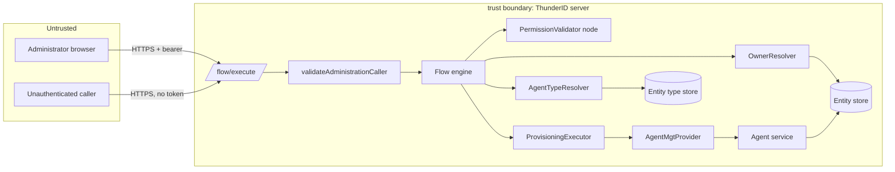
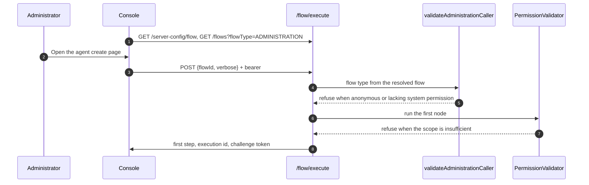
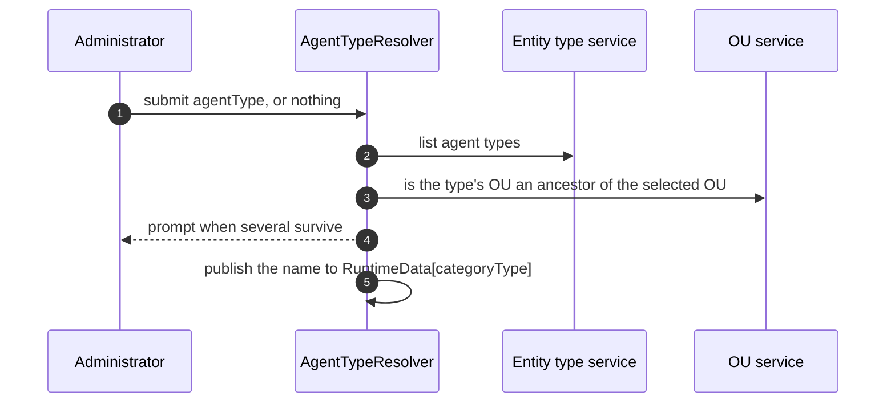
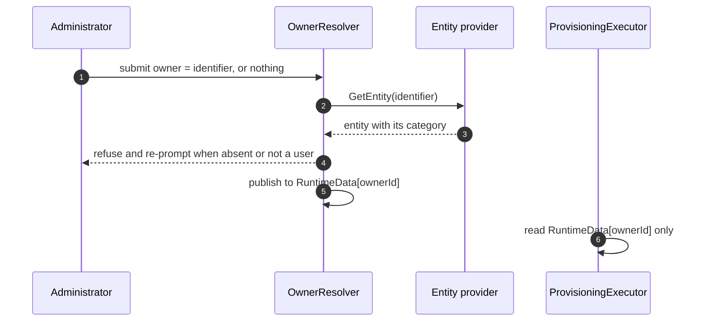
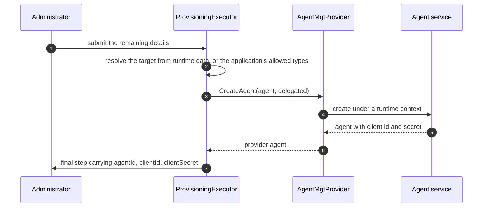
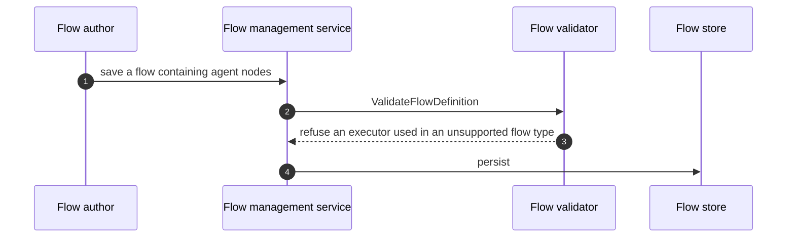

# Agent Onboarding Threat Model

This model covers the agent onboarding flow: the console page that runs it, the `/flow/execute` interactions that drive it, the executors that resolve the agent type and owner, and the provisioning step that creates the agent and returns its OAuth credentials.

## Overview

Agent onboarding creates a new OAuth client and returns its client secret once. That makes it a credential-issuing path reachable over HTTP, so the questions that matter are who may run it, what they may assert about the agent being created, and where the secret goes.

Two gates protect it. The engine refuses an administration flow to a caller without the system permission, and the flow's own `PermissionValidator` node re-checks the scope. Inside the run, the owner is verified by an executor rather than accepted as submitted, and the entity type is resolved from the catalogue rather than taken from the caller. Nothing a caller submits may stand in for either, and no built-in default may substitute for an application's own configuration: those two constraints carry most of the design's security weight.

The entry points are `POST /flow/execute` for an administration flow and the console page that drives it. Every threat below that remains materializable is a property of the administration flow surface as a whole, shared with the other administration flows, rather than something this design introduces.

Cross-cutting concerns covered elsewhere: bearer token issuance and validation, the OAuth client credentials grant an agent later uses, flow session storage and its TTL, and the entity type service's own authorization. These are trust inputs here, not re-analysed.

## Scope

This model covers:
- `POST /flow/execute` for an administration flow of type agent onboarding, initiation and each step
- `AgentTypeResolver`, `OwnerResolver`, `AttributeUniquenessValidator` and `ProvisioningExecutor` in agent mode
- The agent management provider's derivation of the inbound authentication shape
- The console's resolution of the configured flow and its rendering of each step, including the credentials screen
- The flow builder resources that let an author compose such a flow

Out of scope (see the referenced companion models):
- Bearer token issuance, signature validation and revocation
- The client credentials and authorization code grants a provisioned agent later uses
- The `/agents` REST API, which this feature does not change
- User onboarding and registration flows, except where agent behaviour is compared to them
- Flow context storage, encryption and expiry

## Architecture

### Components

| Component | Task |
| --- | --- |
| `/flow/execute` | Single entry point for initiating and stepping a flow. Treated as public by the shared clients, so it performs its own caller validation. |
| `validateAdministrationCaller` | Refuses an administration flow when the context is a runtime context, the subject is empty, or the caller lacks the system root permission. |
| `PermissionValidator` node | Re-checks the caller's scope inside the flow, defaulting to the system root permission, with hierarchical matching. |
| `AgentTypeResolver` | Resolves the agent type from the catalogue, narrowed by the node's allowed list and the selected organization unit. Refuses registration flows. |
| `OwnerResolver` | Verifies a submitted owner identifier resolves to an entity of the **user** category, then publishes it to a runtime slot distinct from the input name. |
| `AttributeUniquenessValidator` | Checks the agent's unique schema attributes against existing records before creation. |
| `ProvisioningExecutor` | Creates the entity for the category named by the node's `mode` property, and publishes the generated credentials into the step response. |
| `AgentMgtProvider` | Elevates to a runtime context and derives the inbound authentication shape from the delegation flag. Forwards only the redirect URIs the caller supplied. |
| `AgentOnboardPage` | Resolves the configured flow by handle, drives it, and renders each step. Holds no agent-creation logic. |

### Actors

#### Actors

| Actor | Description | Roles or permissions |
| --- | --- | --- |
| Administrator | Runs the onboarding flow from the console to create an agent. | Bearer token carrying the system root permission |
| Authenticated non-administrator | Any other authenticated caller with a valid token. | Any permission short of system root |
| Unauthenticated caller | Anyone able to reach `/flow/execute` over the network. | None |
| Flow author | Composes or edits flows in the builder, or writes declarative flow resources. | System root permission for flow management |
| Provisioned agent | The OAuth client created by the flow. Not an actor during onboarding. | Its own credentials, used afterwards |

#### Entitlement matrix

| Actor | Run the onboarding flow | Choose an arbitrary owner | Read the client secret | Author a flow using agent mode |
| --- | --- | --- | --- | --- |
| Administrator | [Yes] | [Yes], any user | [Yes], once | [Yes] |
| Authenticated non-administrator | [No] | [No] | [No] | [No] |
| Unauthenticated caller | [No] | [No] | [No] | [No] |
| Flow author | [Yes] | [Yes] | [Yes] | [Yes] |

### External Dependencies (not owned)

| Dependency | Description (usage, purpose, authentication, authorization, security) |
| --- | --- |
| Entity type service | Supplies agent type schemas and unique attributes. Called under a runtime context by the uniqueness validator. Owns its own authorization; trusted here. |
| Agent service | Creates the agent record, validates the owner exists and the name is unique, and generates the client credentials. Owned by the agent area's model. |
| Inbound client service | Refuses an authorization code client with no redirect URI. Relied on as the backstop for a delegated agent lacking a callback. |
| Runtime store | Holds the flow execution context between steps, with a TTL. Confidentiality and expiry owned by the flow session model. |

## Threats and mitigations

### Out-of-scope interactions and risks

- Theft or replay of the administrator's bearer token, owned by the token and session models
- The provisioned agent's later authentication, owned by the OAuth grant models
- Persistence and expiry of the flow context, owned by the flow session model

### Interactions

#### 01: Initiating the onboarding flow

**Description**

The console resolves the configured handle to a flow id, then posts `flowId` to `/flow/execute` with the administrator's bearer token. The engine takes the flow type from the resolved flow, not from the request, then applies `validateAdministrationCaller` and runs the flow's own `PermissionValidator` node.

**Assets involved**

| Initiator | Intermediate | Target |
| --- | --- | --- |
| Administrator browser | `/flow/execute`, flow engine | Flow execution context |

**Data flow**

**Security considerations**

| Area | Response | Comments |
| --- | --- | --- |
| Data confidentiality | [C-Medium] | The step carries no credential until the final screen. |
| Communication medium | [M-NT] | |
| Transport security | [TLS] | |
| Authentication | Bearer token, subject required | A runtime context is refused explicitly. |
| Accessibility | [Restricted] | System root permission required. |
| Authorization and Access Control | Two gates: engine-level and in-flow | The flow type comes from the resolved flow, so a mismatched request type cannot weaken it. |

**Threat assessment**

| ID | Category | Threat | Materializable | Mitigation / comment |
| --- | --- | --- | --- | --- |
| 1 | [Elevation of Privilege] | An unauthenticated caller drives the flow directly and obtains an agent with OAuth credentials, bypassing the console entirely. | [No] | `validateAdministrationCaller` refuses an empty subject with `FES-1017` before any node runs (AC8.1) |
| 2 | [Elevation of Privilege] | An authenticated caller without administrative rights runs the flow. | [No] | The same gate requires `HasSystemPermission`, an exact match on the system root permission, and the flow's `PermissionValidator` node re-checks it. |
| 3 | [Spoofing] | A caller requests a permissive flow type to avoid the administration gate. | [No] | `engineCtx.FlowType` is taken from the resolved flow, not the request, so the requested type cannot weaken the check. |
| 4 | [Elevation of Privilege] | An internal caller reaches the flow through a runtime context, where authorization checks return true unconditionally. | [No] | `validateAdministrationCaller` refuses `security.IsRuntimeContext(ctx)` outright, so the elevated path cannot be used to run an administration flow. |
| 5 | [Security Risk] | Authorization is coarse: any holder of the system root permission can onboard agents, because no granular agent-onboarding permission exists. | [Yes] | Residual. The gate is the system root permission, so this is equivalent to full administrative access rather than an escalation. Recorded under residual risks. |

#### 02: Resolving the agent type

**Description**

`AgentTypeResolver` lists the agent type catalogue for the agent category, narrows it by the node's `allowedAgentTypes` property and by the selected organization unit, and either takes the single survivor or offers the choice. A submitted type is re-validated against the same constraints.

**Assets involved**

| Initiator | Intermediate | Target |
| --- | --- | --- |
| Administrator | AgentTypeResolver, OU service | Entity type catalogue |

**Data flow**

**Security considerations**

| Area | Response | Comments |
| --- | --- | --- |
| Data confidentiality | [C-Low] | Type names and organization units only. |
| Communication medium | [M-NT] | |
| Transport security | [TLS] | |
| Authentication | Inherited from interaction 01 | |
| Accessibility | [Restricted] | |
| Authorization and Access Control | Allowed list plus OU ancestry | |

**Threat assessment**

| ID | Category | Threat | Materializable | Mitigation / comment |
| --- | --- | --- | --- | --- |
| 6 | [Tampering] | A caller submits an agent type outside the node's allowed list, provisioning into a schema the flow was not meant to use. | [No] | The submitted name is re-checked against `allowedTypes` before it is accepted (AC3.4) |
| 7 | [Elevation of Privilege] | A caller submits a type belonging to an organization unit outside the selected scope, placing the agent where they should not reach. | [No] | The submitted type's OU is checked with `ouService.IsParent` against the selected OU, and candidates are filtered by the same rule. |
| 8 | [Information Disclosure] | The prompt's option list reveals every agent type the deployment has, including those in other organization units. | [No] | Candidates are filtered by the allowed list and OU ancestry before being offered, so the list is already scoped to what the caller may use. |
| 9 | [Tampering] | A caller writes the resolved type directly, skipping the resolver's checks, by submitting the runtime slot name as an input. | [No] | Readers take the type from `RuntimeData`, and `collectedValue` prefers runtime data over submitted input, so a resolver's value is not displaced. |

#### 03: Resolving the owner

**Description**

`OwnerResolver` offers an optional `USER_SELECT` input. A submitted identifier is looked up through the entity provider and must resolve to an entity of the user category. The verified identifier is published to `RuntimeData["ownerId"]`, deliberately a different key from the `owner` input.

**Assets involved**

| Initiator | Intermediate | Target |
| --- | --- | --- |
| Administrator | OwnerResolver, entity provider | Entity store |

**Data flow**

**Security considerations**

| Area | Response | Comments |
| --- | --- | --- |
| Data confidentiality | [C-Medium] | The picker lists user identifiers and display names. |
| Communication medium | [M-NT] | |
| Transport security | [TLS] | |
| Authentication | Inherited from interaction 01 | |
| Accessibility | [Restricted] | |
| Authorization and Access Control | Category check in the resolver | The only place the category is enforced. |

**Threat assessment**

| ID | Category | Threat | Materializable | Mitigation / comment |
| --- | --- | --- | --- | --- |
| 10 | [Tampering] | A caller submits an agent identifier as the owner, creating an agent owned by an agent and a chain that no later check would unpick. | [No] | `OwnerResolver` must refuse an entity whose category is not user. `agentService.validateOwnerExists` checks existence only, so this resolver is the sole enforcement point and provisioning reads only its output (AC4.2) |
| 11 | [Tampering] | A caller submits `owner`, or guesses the runtime key `ownerId`, as a raw input to bypass the resolver entirely. Submitted inputs are merged unfiltered by the engine. | [No] | Provisioning must read `ctx.RuntimeData[ownerIDKey]` directly rather than through `collectedValue`, so no submitted value is consulted (AC4.5) |
| 12 | [Information Disclosure] | The rejection reveals whether an identifier names an existing entity of another category. | [No] | A non-existent identifier and one of the wrong category must be reported the same way, so the response does not disclose what it does name (AC4.3) |
| 13 | [Privacy Risk] | The owner picker exposes the deployment's user list, including display names, to anyone who can open the page. | [No] | The page is restricted to administrators by interaction 01, and the listing is the same `GET /users` they may already call. |
| 14 | [Repudiation] | An agent is created with an owner that was never chosen, leaving no record of who assigned it. | [No] | An unresolved owner defaults to `security.GetSubject(ctx)`, the authenticated caller, so ownership always resolves to a real principal. |

#### 04: Provisioning the agent and returning its credentials

**Description**

`ProvisioningExecutor` reads the category from the node's `mode` property, collects the record fields and schema attributes, and calls `AgentMgtProvider.CreateAgent`. The provider elevates to a runtime context and derives the inbound authentication shape. The generated client id and secret are published into the step response, which the final prompt renders.

**Assets involved**

| Initiator | Intermediate | Target |
| --- | --- | --- |
| Administrator | ProvisioningExecutor, AgentMgtProvider, agent service | Entity store, OAuth client credentials |

**Data flow**

**Security considerations**

| Area | Response | Comments |
| --- | --- | --- |
| Data confidentiality | [C-High] | The response carries a client secret that is never retrievable again. |
| Communication medium | [M-NT] | |
| Transport security | [TLS] | |
| Authentication | Inherited from interaction 01 | |
| Accessibility | [Restricted] | |
| Authorization and Access Control | Category from the node, not the caller | |

**Threat assessment**

| ID | Category | Threat | Materializable | Mitigation / comment |
| --- | --- | --- | --- | --- |
| 15 | [Elevation of Privilege] | A flow author sets `mode: agent` on a provisioning node in a registration flow, which is reachable unauthenticated, and an anonymous caller obtains an agent with OAuth credentials. | [No] | Provisioning refuses the agent category in a registration flow with `FET-1091`. Independently, target resolution requires the application to admit the agent type and the type to permit self-registration, so an application that never opted in resolves no target in any flow type (AC7.1) |
| 16 | [Elevation of Privilege] | An application that never opted into agents still yields a provisionable target, because the resolver falls back to a built-in default agent type. | [No] | No built-in default type may stand in. Agents follow the same rule as users: the application must admit the type and the type must permit self-registration (AC7.2, AC7.3) |
| 17 | [Information Disclosure] | The client secret is written to logs, or persisted in the flow context where it outlives the response. | [No] | The secret is placed in `AdditionalData` on the response only. Agent identifiers are logged masked, and the secret is not logged. The credential is not carried in `NodeContext`, so a later custom node cannot read it through placeholder resolution. |
| 18 | [Information Disclosure] | The secret remains on screen after the run, or is copied into somewhere unintended by a shared link. | [No] | The final screen masks the secret behind a reveal control, and the page is reachable only by an authenticated administrator. The flow context expires with its TTL. |
| 19 | [Tampering] | A caller submits a delegation value that is not a boolean, and the agent is silently created in the opposite authentication shape. | [No] | A value that cannot be read as a boolean must fail the run with `FET-1092` naming the input, rather than defaulting to false (AC5.4) |
| 20 | [Security Risk] | A delegated agent is created with no redirect URI and is given a default callback pointing at a local address, which would accept an authorization code in an unintended place. | [No] | No default callback may be substituted. Provisioning requests the redirect URI once the flow reports delegation, and the inbound client service refuses an authorization code client without one (AC5.2) |
| 21 | [Tampering] | A caller inflates the agent's privileges by submitting group or role assignments as inputs. | [No] | Groups and roles come from the node's `assignGroup` and `assignRole` properties, which are part of the flow definition, not from caller input. |
| 22 | [Denial of Service] | Repeated flow initiation exhausts flow context storage or creates agents in bulk. | [Yes] | Residual. The path requires the system root permission, so the actor is already fully privileged, but no rate limit is applied to `/flow/execute`. Recorded under residual risks. |
| 23 | [Repudiation] | An agent is created with no record of which administrator created it. | [Yes] | Residual. The agent records its owner, which defaults to the caller, and debug logs carry the execution id, but there is no audit event for agent creation through a flow. Recorded under residual risks. |

#### 05: Composing a flow in the builder

**Description**

A flow author adds agent executors, widgets or the shipped template to a flow, and saves it. `ValidateFlowDefinition` runs on save and on declarative import.

**Assets involved**

| Initiator | Intermediate | Target |
| --- | --- | --- |
| Flow author | Flow management service, flow validator | Flow definition store |

**Data flow**

**Security considerations**

| Area | Response | Comments |
| --- | --- | --- |
| Data confidentiality | [C-Low] | Flow definitions carry no credentials. |
| Communication medium | [M-NT] | |
| Transport security | [TLS] | |
| Authentication | Bearer token with flow management permission | |
| Accessibility | [Restricted] | |
| Authorization and Access Control | Flow management permission, plus validator | |

**Threat assessment**

| ID | Category | Threat | Materializable | Mitigation / comment |
| --- | --- | --- | --- | --- |
| 24 | [Elevation of Privilege] | An author places `AgentTypeResolver` in a flow type where it would run for an unauthenticated caller. | [No] | The executor declares `SupportedFlowTypes` of administration and authentication, and `validateExecutorFlowType` refuses it elsewhere, on save and on declarative import alike. |
| 25 | [Tampering] | An author sets an entity category the backend does not accept on a uniqueness or provisioning node. | [No] | The property panel offers a select over the two categories the backend accepts rather than free text, and `categoryFromMode` rejects an unrecognized value at runtime. |
| 26 | [Process Risk] | A flow granting agent creation is authored or changed without review, since flow definitions are configuration rather than code. | [Yes] | Residual. Flow management requires the system root permission, but the project applies no approval workflow to flow changes. Recorded under residual risks. |

## Security Review Checklist

### Security considerations

| # | Consideration | State | Comments |
| --- | --- | --- | --- |
| 1 | Are all inputs and outputs validated (syntactic and semantic)? | [Yes] | The entity type is checked against the allowed list and OU ancestry; the owner against existence and category; the delegation flag is parsed strictly; schema attributes are validated by the entity type schema. |
| 2 | Are rate limits in place where necessary? | [No] | No rate limit on `/flow/execute`. The path requires system root permission. See residual risks. |
| 3 | Are permissions, roles, and entitlements defined on the principle of least privilege and business need? | [Partial] | Only the system root permission gates the flow; no granular agent-onboarding permission exists. See residual risks. |
| 4 | Are authentication and authorization validated at both the UI and API layers, front end and back end, before granting access to resources? | [Yes] | The console route is behind `ProtectedRoute`, and the server applies `validateAdministrationCaller` plus the in-flow `PermissionValidator` independently of it. |
| 5 | Are proper isolations in place between components to ensure least-privilege access and reduce the blast radius against lateral movement? | [Yes] | The engine reaches the agent service only through `AgentMgtProvider`, which exposes `CreateAgent` alone. A disabled provider rejects every operation. |
| 6 | Have any default credentials been changed, and are default superuser or root accounts not in use? | [N/A] | The feature introduces no credentials of its own; the agent's secret is generated per agent. |
| 7 | Has the implementation followed best-practice guidelines? | [Yes] | Delegated agents are authorization code clients with PKCE required; non-delegated agents hold client credentials only. |
| 8 | Are secrets, credentials, and internal-only material kept out of the public source tree and its git history? | [Yes] | The design commits no secret and specifies no built-in callback or credential default. |
| 9 | Was a security-focused code review conducted for this change, and have the findings been addressed? | [Yes] | This model is the review. Owner injection, an unreadable delegation value and agent mode in a registration flow each carry a required control; see threats 11, 19 and 15. |
| 10 | Is Static Analysis (SAST) or IaC scanning conducted, and are findings addressed? | [Yes] | `golangci-lint` runs in the pull request gate, which the change must pass before merge. |
| 11 | Is Software Composition Analysis (SCA) conducted or integrated into the repository? | [Yes] | Repository-wide. The design requires no new dependency. |
| 12 | Is Dynamic (DAST) or API scanning conducted on a non-production setup? | [N/A] | Not established for this area. The specification requires the flow to be exercised end to end by integration and e2e suites. |
| 13 | Are audit logs generated in a standardized format for critical functionality? | [No] | Agent creation through a flow emits debug logs carrying the execution id and a masked agent id, not an audit event. See residual risks. |
| 14 | Do audit logs for critical configuration changes record the difference between the old and new versions? | [N/A] | This feature changes no configuration at runtime. |
| 15 | Are data in transit and at rest encrypted? | [Yes] | TLS in transit. The client secret is returned once and not persisted in plaintext by this feature. |
| 16 | Are sensitive values such as credentials and keys stored in a secret store or vault? | [N/A] | The feature stores no secret; it hands the generated one to the caller once. |
| 17 | Is personal, sensitive, or confidential data kept out of logs? | [Yes] | Entity identifiers are logged with masking, and the client secret is never logged. |
| 18 | Have users been given clear instructions for secure usage? | [Yes] | The credentials screen states that the secret is shown only once and cannot be retrieved later. |

### Business impact and resilience

| # | Consideration | State | Comments |
| --- | --- | --- | --- |
| 1 | Has a business impact analysis been done to identify resilience requirements? | [N/A] | Inherited from the deployment. Agent onboarding is an administrative operation; its unavailability blocks creating new agents but does not affect agents already issued credentials. |

Resilience details to record:
- High availability: inherited from the server deployment; the feature adds no new service
- Disaster recovery: agent records live in the entity store and are covered by its backups
- Backups: no new store is introduced. The flow execution context is transient with a TTL and is deliberately not backed up; an interrupted run is restarted rather than recovered
- Health checks: unchanged
- User banners: not applicable

### Dependency and component health

| # | Consideration | State | Comments |
| --- | --- | --- | --- |
| 1 | Are dependencies, base images, and runtimes monitored for known vulnerabilities and kept current? | [Yes] | Repository-wide. This feature adds no dependency to either the backend or the console. |
| 2 | Are any End-of-Life or End-of-Service components in use? | [No] | |
| 3 | Is hardening guidance published for operators who deploy the project? | [Partial] | The configuration key and its failure modes are documented in the specification; no separate hardening guide covers agent onboarding. |

### Privacy considerations

The feature processes personal data only as the owner reference and the owner picker's listing.

| # | Consideration | State | Comments |
| --- | --- | --- | --- |
| 1 | Is the purpose and legal basis for processing personal data clearly defined? | [Yes] | The owner identifies the person accountable for an agent, a necessary part of the record. |
| 2 | Are the collection, storage, processing, sharing, archival, and disposal of personal data aligned with the data minimization principle? | [Yes] | Only a user identifier is stored on the agent. The picker's display values are read for rendering and not persisted by this feature. |
| 3 | Is personal data stored securely? | [Yes] | The owner identifier lives in the entity store under its existing protections. |
| 4 | Are privacy notices updated to reflect any new processing or changes to purpose and legal basis? | [N/A] | No new category of personal data is processed. |
| 5 | Is access to personal data granted on a need-to-know basis? | [Partial] | The owner picker lists every user in the first page of results to any administrator running the flow. Administrators may already list users directly. |
| 6 | Are data retention requirements considered? | [Yes] | The owner reference lives as long as the agent. The flow context expires with its TTL. |
| 7 | Is there a process to dispose of personal data on request in a timely manner? | [N/A] | Deleting a user is owned by the user management area; this feature adds no separate copy of personal data. |
| 8 | Are records of personal-data processing maintained in the project's data inventory? | [N/A] | No new processing record is introduced. |

## Residual risks (open items)

- Agent onboarding is gated by the system root permission, the same gate every administration flow uses, so any full administrator can create agents. There is no granular agent-onboarding permission. The actor is already fully privileged, so this is a granularity gap rather than an escalation, and it is accepted. It matters more here than for the other administration flows because this one issues OAuth client credentials where they create no new principal, which is the argument for adding the granular permission later.
- `/flow/execute` carries no rate limit, for any flow type. A privileged caller could create agents in bulk or exhaust flow context storage. Not introduced by this design and accepted on the same reasoning as above.
- Provisioning emits no audit event, for either entity category. The agent records its owner, which defaults to the caller, and debug logs carry the execution id and a masked agent id, but there is no durable record naming who created an agent. Agent creation is no less observable than user creation, so this is a platform gap rather than a feature one.
- A flow granting agent creation can be authored or edited by any holder of the flow management permission without review, since flow definitions are configuration rather than code. This is a property of flow management shared by every flow a deployment holds.
- `allowedAgentTypes` documents that an agent may authenticate to a resource only when its type is listed, but nothing reads it at the token endpoint. The agent type resolver enforces it inside a flow, and agents authenticate through the client credentials grant, which runs no flow. Out of scope for this design and tracked separately.

## Appendix

- Sample requests and configurations: see the specification's API and Configuration sections
- References: Agent Onboarding Specification

## Change log

| Version | Date | Change |
|---|---|---|
| 0.1 | 2026-09-07 | Initial threat model, covering the design in the accompanying specification. |
