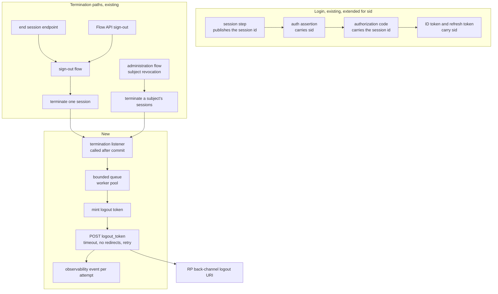
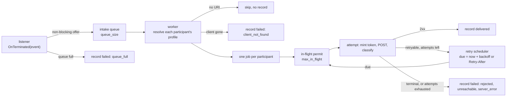

# OIDC Back-Channel Logout Specification

- **Status:** Draft
- **Version:** 0.4
- **Related documents:** [threat-model.md](threat-model.md), [#5233](https://github.com/thunder-id/thunderid/issues/5233), [#5258](https://github.com/thunder-id/thunderid/discussions/5258), [OpenID Connect Back-Channel Logout 1.0](https://openid.net/specs/openid-connect-backchannel-1_0.html), [OpenID Connect RP-Initiated Logout 1.0](https://openid.net/specs/openid-connect-rpinitiated-1_0.html), [OpenID Connect Core 1.0](https://openid.net/specs/openid-connect-core-1_0.html), [OpenID Connect Discovery 1.0](https://openid.net/specs/openid-connect-discovery-1_0.html)

## Summary

ThunderID implements RP-Initiated Logout 1.0 today. The end session endpoint resolves the calling client, runs the application's sign-out flow, and the session service deletes the SSO session with its participants and revokes their token families. That ends the session at ThunderID and kills the tokens issued from it, and it does nothing for the other applications that shared the session. Their local sessions stay alive, so the user believes they signed out and, at every other application, they did not.

Two pieces are missing. ThunderID issues no `sid` claim, so a relying party has no identifier for the session that ended. And there is no outbound notification path: no logout token, no delivery, and no way for a relying party to hear about a termination it did not start, such as an administrator revoking a subject's sessions or a sign-out from a different application.

The hard part already exists. The session participant record tracks every application that joined a session, keyed by the session identifier, with the application id and its current token family id. That is the list of relying parties a logout has to reach. This specification turns it into a notification set, by issuing `sid`, observing termination, and delivering a signed logout token to each participant that registered an endpoint.

One decision governs the rest:

> Session termination is the trigger, and it is observed through the session service, after the terminating transaction commits, by listeners registered through a termination hook.

The session service owns the only transaction that knows a session's participants. It gains one seam: a termination topic, built on the system layer's generic event-listener contract, whose hook the composition root uses to register listeners, alongside the criteria revoker it already accepts. Everything protocol shaped sits behind that seam in the OAuth layer: client lookup, token minting, the HTTP call, retry, and delivery-outcome events. Delivery runs in process, asynchronously, with a bounded retry budget. There is no new table, no polling worker, and nothing to coordinate between replicas.

Scope is the notification mechanism and the configuration, metadata, and observability surface around it. Front-Channel Logout 1.0, Session Management 1.0, and SAML Single Logout are out of scope; the `sid` claim and the client configuration defined here are shared groundwork for the first of them. Notification on session expiry, persistence of pending notifications across a hard process crash, operator redelivery, and pairwise subject identifiers are also out of scope, each for a reason recorded in [#5258](https://github.com/thunder-id/thunderid/discussions/5258).

## Architecture

The feature adds one package under the OAuth logout area, holding the termination listener, token minting, the dispatcher, and the HTTP delivery client. Everything else is an addition to an existing component.

| Component | Responsibility |
|---|---|
| Session identifier publication | Carries the SSO session identifier from the session step of the login flow to the `sid` claim on the ID token and the refresh token |
| Termination listener | The seam the session service calls after a terminating transaction commits. Declared by the session area so that area keeps no dependency on the OAuth layer, and implemented by the back-channel package |
| Dispatcher | Bounded queue, worker pool, client profile resolution, concurrency bound, retry scheduling, and shutdown drain. Described in [The dispatcher](#the-dispatcher) |
| Logout token minter | Builds and signs the logout token, and encrypts it for a client that negotiated ID token encryption |
| Delivery client | One HTTP POST per attempt, with a timeout, redirect refusal, a capped response drain, and response classification |
| Client configuration | Accepts, validates, persists, and returns the back-channel logout registration parameters across the Console, the management API, the agent API, and Dynamic Client Registration |
| Discovery metadata | Advertises the two capability flags |

Ownership boundary: the session area owns termination and the participant list, and declares the listener seam. The OAuth layer owns everything protocol shaped behind it. The session area therefore takes no dependency on clients, tokens, or HTTP, and a defect in delivery cannot reach session termination.

The feature uses these existing seams without changing their contracts:

| Seam | Use |
|---|---|
| Session service termination hook | The hook of the session service's termination topic, returned by its initialiser to the composition root, which registers listeners through it. No listener registered means the feature is inactive |
| Event-listener contract | A generic system package that owns listener registration and fan-out for any producer. The session service is its first producer |
| Session participant record | Already keyed by session identifier and already naming each participating application, which makes it the notification set without modification |
| JWT generation service | Signs the logout token. It already requires an audience, mints a unique identifier, sets the issuer and the time claims, and honours a caller-supplied token type and algorithm |
| JWE encryption service | Encrypts the logout token for clients that negotiated ID token encryption. It gains the ability to carry one extra header, described in [The logout token](#the-logout-token) |
| Token configuration resolution | Resolves the issuer and signing algorithm, so a client that chose its own ID token signing algorithm gets a logout token it can verify |
| Actor provider | Resolves a participating application's OAuth profile at delivery time |
| Observability publisher | Publishes one event per delivery attempt. Its detached-work shape, with a derived context carrying the trace id, wait group accounting, panic recovery, and a shutdown drain, is the pattern the dispatcher follows |
| Shared HTTP client | Issues the delivery request, configured with a redirect policy that refuses to follow a 3xx |



## Detailed design

### Issuing the session identifier

`sid` is the SSO session's internal identifier, a UUIDv7. It MUST NOT be the session handle. The handle is the cookie value and a bearer credential, and putting it in every relying party's ID token would hand each of them the ability to resume the session. The internal identifier confers nothing and no API accepts it.

The value reaches the ID token along the path the token family id already takes:

| Stage | Behaviour |
|---|---|
| Session step of the login flow | Publishes the session identifier on flow runtime data, on both the save and the load path |
| Auth assertion | Carries the identifier as a claim beside the token family id |
| Authorization code | Carries the identifier through to token issuance |
| ID token | Emits `sid` beside the other session-derived claims |
| Refresh token | Carries the identifier the way it carries the token family id, so a refreshed ID token keeps the same `sid` |

Constraints:

- On the load path the identifier MUST be published after a flow snapshot is replayed, and it MUST be excluded from snapshot restoration in the same way the token family id already is. A value copied out of a replayed snapshot could name a session other than the one now in force.
- Access tokens MUST NOT carry `sid`. The token family design keeps session identifiers off resource-server-facing tokens deliberately, and nothing here needs one there.
- Whether an ID token carries `sid` depends only on whether the authentication flow ran a session step. Token exchange and client credentials run no such flow, so their ID tokens carry no `sid`. CIBA runs the application's login flow on the user's device; when that flow has a session step, the session is created, the CIBA client is recorded as a participant, and the CIBA-issued ID token carries `sid` like any other. A flow with no session step produces no `sid` and no notification, because there is no session to terminate. A synthetic `sid` MUST NOT be issued in that case: an identifier that no termination can reference would promise a notification that cannot come.
- The logout token's `sub` MUST equal the `sub` the relying party saw in its ID token, for that client. Both MUST derive the claim through one shared function, and a differential test builds both tokens for the same subject and client and compares the result. Today that function returns the entity id unchanged, because discovery advertises only the public subject type. Pairwise subject identifiers are out of scope, and this function is where they would land; the test fails if either path diverges.

A session established before this feature ships already has an identifier, so its logout token carries `sid`. The ID tokens issued to it did not, so a relying party holding one matches on `sub` or ignores the notification, which is the behaviour it has today.

### Observing session termination

The mechanics of announcing a state change to listeners are generic and live in a system package, the event-listener contract, so that the next producer, a Shared Signals emitter or an audit hook, does not declare its own interface, hook, and fan-out loop. That package provides a typed topic per event: a listener interface with one method, a hook that registers listeners, and a notify call that fans out. The session area declares one topic for terminated sessions and names its listener and hook types after it. Everything below is the contract of that package as the session topic uses it.

| Aspect | Contract |
|---|---|
| Payload | The session identifier, the subject id, the participant list, and the termination reason, which is either sign-out or subject revocation |
| When called | After the terminating transaction has committed, never inside it |
| Context | Carries the terminating request's values, such as the trace id, but is never cancelled, so a listener may hand it to work that outlives the request |
| Obligation | Return promptly and perform no I/O |
| Registration | Through the topic's hook, which the session service's initialiser returns to the composition root. The hook is not part of the session service interface, so a consumer of the service cannot change who observes terminations. Registration is additive: any number of listeners, notified in registration order, none removable. A nil listener is rejected |
| Absence | No listener registered means the feature is inactive |
| Isolation | Each listener runs under its own panic recovery, owned by the topic, so a failing listener neither reaches the terminating request nor silences the next listener |
| Ownership | Mechanics in the system layer, the topic and its payload in the session area, the listener implemented in the OAuth layer, registration at the composition root, so the session area gains no dependency on OAuth types |

Calling after commit means a notification problem can never fail or delay a logout, and relying parties are only told about terminations that actually happened. A failed transaction deletes nothing, revokes nothing, and produces no listener call. A panic in a listener is recovered and logged, and the logout result is unaffected.

More than one listener is allowed because the moment a session ends is of interest beyond back-channel logout: a Shared Signals session-revoked emitter or an audit record would observe the same event. The back-channel dispatcher is the first listener, not the only possible one. The generic package is deliberately small: it does not queue, spawn goroutines, or persist. A fuller domain-event layer with after-commit hooks in the transaction layer and sealed registration is a separate design; this package is shaped so that it can grow into one without renaming.

Behaviour on the two termination paths:

- **Single session sign-out** already reads the participant list inside its transaction in order to revoke token families. The read happens whenever a criteria revoker or at least one listener is present, and the list is retained and handed to the listeners after commit, so this path performs no additional read. When neither is present the read is skipped. If the read fails and only listeners need it, the session is still terminated and the listeners are not called for it; if the revoker needs it, the failure ends the termination as it does today.
- **Subject-wide revocation** already reads the subject's session list before its transaction. It gains one further read there: a single participant query across all of those sessions, grouped by session in memory. The read sits before the transaction because it must precede the delete, not because it needs the transaction's snapshot. Under read committed, a participant that joins between the read and the delete is deleted without notification wherever the read is placed. The cost is one round trip however many sessions the subject holds, which matters because no per-subject session cap exists. The listener is then called once per terminated session. This path revokes no token families, because a subject criterion already covers the tokens, but no token revocation touches a relying party's local session, so it MUST still notify.

The sign-out and revocation steps of the flow engine are unchanged. Application-native sign-out through the Flow API reaches the same step and is covered without further work.

Termination revokes every participant's token family. Section 2.7 says refresh tokens issued with `offline_access` normally SHOULD NOT be revoked on logout, while those issued without it SHOULD be. ThunderID does not implement `offline_access`, so every refresh token today is one issued without it and the behaviour is conformant. Whoever implements `offline_access` MUST exempt those families here.

### The dispatcher

The dispatcher is the one new runtime component. It turns a terminated session into deliveries and owns everything between the listener call and the HTTP request: queueing, worker scheduling, retry timing, the concurrency bound, and the shutdown drain. Its shape follows the decision recorded in [#5258](https://github.com/thunder-id/thunderid/discussions/5258) section 3 and alternative A1: in-process, asynchronous, bounded, with no persistence and nothing shared between replicas.

**Parts.**

| Part | Role |
|---|---|
| Termination event | What the listener receives: session id, subject id, participant list, and the reason (`sign_out` or `subject_revocation`). Copied, never referenced, so the caller's data is not shared with a goroutine |
| Intake queue | A bounded channel of termination events, sized by `queue_size`. The listener offers to it without blocking |
| Worker pool | A fixed set of goroutines that take events off the queue, expand each into jobs, and run deliveries |
| Job | One participant of one event: application id, session id, subject id, attempt counter, and the time the next attempt is due. The dispatcher's unit of work |
| Retry scheduler | Holds jobs whose next attempt is not yet due and hands them back to a worker when it is. A waiting job never occupies a worker |
| In-flight bound | A semaphore of `max_in_flight` permits, held for the duration of one HTTP attempt, shared by the whole dispatcher |
| Minter and delivery client | Build the logout token ([The logout token](#the-logout-token)) and perform one attempt ([Delivery](#delivery)) |

**Data flow.**



**Lifecycle.**

1. **Construction** happens at the composition root once the JWT and JWE services, the actor provider, the observability service, and configuration exist. The session service is built earlier than the actor provider, so the dispatcher is registered afterwards through the termination topic's hook, which the session service's initialiser returned, the same two-phase wiring the consent enforcer already uses.
2. **Start** launches the workers and the retry scheduler with a context the dispatcher owns. It is skipped when the process is the bootstrap one-shot, which never serves requests and never runs graceful shutdown.
3. **Stop** runs during graceful shutdown, before the observability service shuts down, so the final outcome events still have a subscriber. It stops accepting new work, lets in-flight attempts finish, and returns when they are done or when its own deadline passes. The server's whole shutdown has one shared five-second budget covering HTTP drain, services, database, and cache, so the dispatcher self-imposes a budget of about two seconds rather than consuming the whole window. Queued events and retries still pending at that point are recorded with reason `shutdown` and abandoned. The intake channel is never closed, because a request still in flight during shutdown can call the listener, and a send on a closed channel panics; a separate stop signal tells the workers to stop taking work.

**Context handling.** The listener runs on the terminating request's goroutine, and that request's context is cancelled the moment its response is written. The session service therefore hands the listener a context that keeps the request's values but not its cancellation. The dispatcher still does not hold that context across goroutines: each job carries the request's trace id, and a worker builds a fresh detached context carrying that id, so outcome events and logs correlate with the logout that caused them while outliving it. This is the pattern the observability publisher already uses for detached work.

**Why resolution happens in the worker.** The listener does no I/O. It copies the event and returns, so the logout path pays no configuration read for participants it will never contact. The worker resolves each participant's OAuth profile by application id through the actor provider, which covers applications and agents alike, and only then decides whether there is anything to send.

**Retry without parking a worker.** A retryable outcome computes the next due time, `retry_delay` doubled per attempt or a capped `Retry-After`, both bounded by `retry_max_delay`, and hands the job to the scheduler. The worker moves on immediately. If waits were slept inside the worker, a few slow relying parties would idle the whole pool during a subject-wide revocation. The scheduler selects on the dispatcher's context as well as its timers, so shutdown abandons pending waits instead of sleeping through them.

**Invariants.**

- The listener never blocks the terminating request and never returns an error to it. A full queue drops the event and records it; a panic is recovered by the session service.
- Memory is bounded by `queue_size` events, each expanding to at most its participant count in jobs. Nothing is persisted.
- A job is held by exactly one goroutine at any time: a worker during an attempt, the scheduler between attempts.
- Attempts for one participant are sequential and carry an increasing attempt number. There is no ordering across participants or across sessions, and none is needed.
- Every job ends in exactly one terminal record: delivered, or failed with one of the reason codes in [Delivery outcomes and observability](#delivery-outcomes-and-observability). Skipping a participant with no URI is the one silent outcome, because there was nothing to attempt.
- Each replica delivers only for terminations its own process handled. There is no shared queue, no lease, and no coordination, which is what alternative A1 in [#5258](https://github.com/thunder-id/thunderid/discussions/5258) traded the delivery table for.

**Failure by stage.**

| Stage | Failure | Outcome |
|---|---|---|
| Enqueue | Queue full | Event dropped, recorded `queue_full`, logout unaffected |
| Resolve | Profile read error or client deleted | That participant recorded `client_not_found`; the others proceed |
| Resolve | No back-channel logout URI | Skipped, no record |
| Mint | Signing or encryption error | Attempt counted as failed; retried like a transient error, then `server_error` |
| Send | Connection error, timeout, 5xx, 429 | Retried per [Delivery](#delivery); terminal after `max_attempts` as `unreachable` or `server_error` |
| Send | 3xx or other 4xx | Terminal immediately, `rejected` |
| Record | Observability publisher unavailable | The structured log line still carries the outcome |
| Shutdown | Deadline reached with work pending | Pending jobs recorded `shutdown` and abandoned |

### Delivery

This section covers one delivery attempt. How attempts are scheduled, bounded, retried, and drained is in [The dispatcher](#the-dispatcher).

For each event, a worker:

1. Resolves each participant's OAuth profile by application id. A participant with no registered back-channel logout URI is skipped silently, and this is not an error. A participant whose client configuration has been deleted since the logout is recorded as failed with reason `client_not_found`. Resolution happens here rather than in the listener so the logout path pays no configuration-store read.
2. Delivers to the remaining participants concurrently, bounded by a global in-flight limit, so a subject-wide revocation across many sessions cannot open unbounded connections.
3. Per delivery, mints a logout token, POSTs it, and classifies the response.

The delivery request:

- A POST to the registered URI, with content type `application/x-www-form-urlencoded` and a body carrying a single `logout_token` parameter.
- A redirect policy that never follows a 3xx. Following one would turn the POST into a GET at a host the client did not register.
- No address filtering. Any host the registrant configured is dialled. The rationale, and the residual risk it carries, are in [threat-model.md](threat-model.md).
- One timeout per attempt, from `request_timeout`. The response body is drained up to a small cap and discarded, so a hostile endpoint cannot return an unbounded body and only the status code influences behaviour.

Response classification:

| Response | Outcome |
|---|---|
| 200, 204 | Delivered |
| Connection error, timeout, 5xx | Retryable. The next attempt waits `retry_delay` doubled per attempt, capped at `retry_max_delay`. After `max_attempts`, failed with reason `unreachable` or `server_error` |
| 429 | Retryable. A parseable `Retry-After` sets the wait, capped at `retry_max_delay`; otherwise the backoff schedule applies. Section 2.5 asks the OP to delay retransmission by an appropriate amount, and `Retry-After` is the relying party stating it. The cap keeps a hostile or misconfigured value from holding a delivery slot for minutes |
| Any other 4xx, any 3xx | Failed immediately with reason `rejected`. Retrying a misconfigured or decommissioned endpoint only delays the record |

A fresh token is minted per attempt, so a retry that lands after the previous token expired is still valid, a key rotation between attempts does not matter, and a relying party tracking token identifiers does not reject the retry as a replay.

**Shutdown.** The dispatcher stops as part of the server's graceful shutdown. It closes intake, lets workers finish queued and in-flight deliveries, and returns when they are done or when the shutdown deadline expires. Anything abandoned at the deadline is recorded as failed with reason `shutdown`. A hard kill loses pending deliveries with no record, which is accepted: the outcome for those sessions is the behaviour that exists today, bounded by each relying party's own session lifetime.

**Ordering with the post-logout redirect.** ThunderID does not wait for any notification before redirecting. This deviates from RP-Initiated Logout 1.0, whose section 2 says the initiating relying party "is to be included in these notifications before the post-logout redirection is performed" and whose section 3 says the redirection "is performed after the OP has finished notifying the RPs". Neither sentence carries an RFC 2119 keyword. The session is already terminated when the first byte is sent, so a wait would buy the user nothing, and a slow or hung initiator would hold the user on the logout page for up to one request timeout. The initiating relying party has already cleared its own session before calling the end session endpoint, so the notification it receives is confirmatory, and the browser can reach the post-logout URI before that notification is processed. Dispatch usually reaches the initiator first, but that is a race rather than a property: under a queue backlog it can lose, and a dropped event is never sent. Keycloak and Duende IdentityServer wait for the back-channel POSTs, bounded by a timeout, before the redirect reaches the user; Ory Hydra does not, and this design takes Hydra's position.

### The logout token

The existing JWT generation service supplies everything needed, so no new signing primitive is introduced. It already requires an audience, mints a unique token identifier, sets the issuer and the time claims, and honours a caller-supplied token type and algorithm.

| Claim or header | Value |
|---|---|
| `iss` | The issuer resolved for that client, the same one its ID tokens carry |
| `aud` | The client id of the single participating application this token is for |
| `sub` | Derived through the shared subject-claim function, so it matches that client's ID token |
| `sid` | The identifier of the terminated session |
| `events` | One member, `http://schemas.openid.net/event/backchannel-logout`, with an empty object value |
| `jti` | Unique per token, so a relying party can detect replay |
| `iat`, `exp` | Issued at, and an expiry from `token_validity_period` |
| `nonce` | MUST be absent |
| `typ` | `logout+jwt` |
| Signing algorithm | The same one resolved for that client's ID tokens |

Points that follow from those values:

- A client that chose its own ID token signing algorithm receives logout tokens it can verify with the key it already trusts.
- `sub` and `sid` are both always sent. Every terminated session has an identifier, so there is never a token without one.
- The absence of `nonce` is asserted by a test rather than trusted to inspection. The specification forbids the claim precisely so a relying party cannot mistake a logout token for an ID token.
- The token type distinguishes a logout token from an ID token. The ID token hint check on the end session endpoint accepts only plain JWTs, so a logout token captured at a relying party cannot be replayed as a hint.
- Default validity is 120 seconds, the maximum the specification recommends.
- If the client negotiated ID token encryption, the signed token goes through the same JWE step the ID token path applies, with one addition. Section 2.4 says an encrypted logout token SHOULD replicate `iss` in the JWE header, and the encryption service today writes only the algorithm, encryption, key id, content type, and key-agreement headers. It gains the ability to carry one extra header, and the logout minter passes the issuer through it. The ID token path is unchanged. The specification says a relying party that negotiated encryption should reject an unencrypted logout token, so signing only would break exactly those clients.

### Client configuration

Two registration parameters join the OAuth client configuration, beside the post-logout redirect URIs.

| Parameter | Management API and Console name | DCR name | Behaviour |
|---|---|---|---|
| Back-channel logout URI | `backchannelLogoutUri` | `backchannel_logout_uri` | Where notifications are POSTed. Empty means the application is not notified |
| Session required | Not exposed in the Console; read-only on the management API | `backchannel_logout_session_required` | Accepted, stored, and echoed. It never changes what is delivered |

Every configuration path that carries the post-logout redirect URIs today MUST carry the back-channel logout URI: the inbound client service, the application service, handler, and declarative resource, the configuration importer, the agent service, and the actor provider. A profile stored before this feature shipped MUST read back with an empty URI rather than as absent or invalid.

Validation runs on every path, beside the existing redirect URI validation:

| Rule | Behaviour |
|---|---|
| Empty | Valid. The application is not notified |
| Parse | MUST parse as an absolute URI with a scheme and a host |
| Fragment | MUST be rejected |
| Wildcard | Any `*` anywhere MUST be rejected. This is a URI ThunderID dials, so a wildcard is either meaningless or a request to post tokens at a host the client did not pin |
| Scheme | MUST be `https` or `http`. Plain `http` is accepted only for a confidential client, so a public client, which Dynamic Client Registration derives from a token endpoint authentication method of `none`, MUST register `https` |
| Host | Any host is accepted, including loopback, link-local, and private addresses |

The scheme rule is the condition section 2.2 attaches to `http`: the client type must be confidential and the OP must allow it. The confidential half is enforced at registration and the OP half is a project decision. A back-channel endpoint implies a server component, so the restriction costs public clients nothing real. Plain HTTP exists so that confidential relying parties on internal networks and local development setups can receive notifications, and the guide recommends HTTPS for anything outside a private network. Accepting private hosts is deliberate for the same reason: relying parties on internal networks are the common case, and refusing them the way the JWKS URI does would force an opt-out flag that every deployment sets.

A dedicated validation error is raised for a rejected URI and translated in both the application and the agent service, with defaults in the core locale.

**Why the session-required parameter is kept.** The specification defines it so a relying party can say it acts only on logout tokens that carry `sid`. ThunderID puts `sid` in every logout token, so the parameter can never change what is delivered. It is kept because standard relying party libraries send it during Dynamic Client Registration and expect it echoed back. It MUST NOT be validated beyond its type, MUST NOT be read at delivery time, and MUST NOT be exposed in the Console, where a control implying an effect it does not have would mislead.

**Dynamic Client Registration** accepts and echoes both parameters under the names the specification defines, copying them beside the post-logout redirect URIs in both directions. Registration delegates validation to application creation, so the rules above apply unchanged, and a rejected URI surfaces as `invalid_client_metadata`.

### Discovery metadata

Two boolean fields join the OIDC provider metadata: `backchannel_logout_supported` and `backchannel_logout_session_supported`. Both are always present rather than omitted when false, because the specification defines their default as false and an explicit false is the honest advertisement.

Both are set from the back-channel enablement flag, inside the existing block that is conditional on logout being enabled. Session identifier issuance is unconditional, so `backchannel_logout_session_supported` is true whenever delivery is.

### Delivery outcomes and observability

Every attempt publishes one event through the existing observability publisher, the way token revocation publishes `TOKEN_REVOKED`. These are observability events: emitted best-effort to the configured subscribers, not a durable audit trail. The audit capability proposed in [#5438](https://github.com/thunder-id/thunderid/issues/5438) can take the two event types below as inputs without any change on the delivery side, since they already carry the identifiers an audit record needs and nothing they must not.

| Event | When | Data |
|---|---|---|
| `BACKCHANNEL_LOGOUT_DELIVERED` | 2xx received | `client_id`, `app_id`, `session_id`, `attempt`, `http_status`, `duration_ms` |
| `BACKCHANNEL_LOGOUT_FAILED` | Terminal failure | The same, plus `error` as a reason code |

The reason codes are `unreachable`, `server_error`, `rejected`, `client_not_found`, `queue_full`, and `shutdown`.

- Each attempt also writes one structured Info log line with the same fields, so the record exists without an observability sink configured.
- Nothing records the token, the URI's query string, request or response bodies, or subject attributes. The subject identifier is not among the recorded fields.
- The session identifier is recorded deliberately. Issue #5233 asks that delivery failures be handled without exposing session information, and the reading applied here is that the opaque session identifier is what makes a failed delivery traceable to the session it belonged to, while the material worth protecting is the token, the credentials, and the user's attributes. The identifier confers nothing and no API accepts it. [threat-model.md](threat-model.md) covers the privacy consequence.

### Data model

No schema change. The SSO session, session participant, session context, and OAuth inbound profile tables are reused unchanged, and the cleanup procedures are untouched.

- The session participant table is already keyed by session identifier and already records the application id, which makes it the notification set without modification.
- The two registration parameters need no DDL. The OAuth profile is persisted as a single JSON column, so existing rows read back with the parameters absent, which is the correct default.
- The only semantic change is that the session identifier becomes a value published as `sid`, and the comments that describe it as never exposed to clients are updated to say so.

### API

No new endpoints.

| Specification | Change |
|---|---|
| `api/application.yaml` | `backchannelLogoutUri` on the OAuth application configuration schemas, beside `postLogoutRedirectUris`, and `backchannelLogoutSessionRequired` as a read-only property reflecting what Dynamic Client Registration registered. `postLogoutRedirectUris` is accepted today but missing from both schemas, and is added at the same time |
| `api/oauth2.yaml` | `backchannel_logout_uri` and `backchannel_logout_session_required` on the registration request and response schemas, with the same pre-existing gap for `post_logout_redirect_uris` closed |
| `api/discovery.yaml` | The two metadata booleans, beside `end_session_endpoint` |

Error codes, in the existing application error envelope:

| Code | Default message |
|---|---|
| `error.applicationservice.invalid_backchannel_logout_uri` | Invalid back-channel logout URI. It must be an absolute http or https URI with a host, no fragment, and no wildcard. |

An `error.agentservice.*` twin exists for the agent service's translation table. Agents are OAuth clients that run a login flow, and when that flow has a session step the agent is recorded as a session participant exactly like an application, with its own token family. The agent API therefore carries the back-channel logout URI as a live setting, validated the same way, and the agent Console surfaces it beside the application field. Agent-initiated sign-out through the end session endpoint already works: the agent receives the default sign-out flow, accepts an explicit one, and validates any post-logout redirect URI against its own registered list.

### UI

Console only. The field sits on the application edit page, under Advanced settings, in the OAuth 2 configuration section, directly after the post-logout redirect URIs block and gated by the same condition. The agent edit page gets the same field in its OAuth 2 configuration section, since an agent is a session participant and a notification target in its own right.

```text
┌─ OAuth 2 Configuration ─────────────────────────────────────────────┐
│                                                                     │
│  Post-Logout Redirect URIs                                          │
│  ┌──────────────────────────────────────────────────┐ ┌────┐        │
│  │ https://app.example.com/signed-out               │ │ 🗑 │        │
│  └──────────────────────────────────────────────────┘ └────┘        │
│  [ + Add URI ]                                                      │
│                                                                     │
│  Back-Channel Logout URI                                            │
│  ThunderID posts a signed logout token here when a session this     │
│  application joined ends. Leave empty to disable.                   │
│  ┌──────────────────────────────────────────────────────────┐       │
│  │ https://app.example.com/backchannel-logout               │       │
│  └──────────────────────────────────────────────────────────┘       │
│                                                                     │
└─────────────────────────────────────────────────────────────────────┘
```

- A single text field, not a list. The specification registers one URI. The existing redirect URI field is the styling reference.
- No control for the session-required parameter, for the reason given in [Client configuration](#client-configuration).
- Validation runs inline on blur and joins the section's existing validation contract. Server errors are surfaced through the error catalog, never as raw server text.
- The Console's OAuth application model and the post-logout group in its locale file gain the new field and its labels.
- The create wizard is unchanged. This is an integration detail configured after the application exists.
- There is no delivery status view. Outcomes are observable as events and logs.

### Configuration

The existing logout configuration block is extended. Every key is deployment level.

```yaml
oauth:
  logout:
    enabled: true
    backchannel:
      enabled: true                  # kill switch; also drives the discovery flags
      token_validity_period: 120     # seconds
      request_timeout: 5             # seconds per attempt
      max_attempts: 3                # 1 means no retry
      retry_delay: 2                 # seconds, doubles per attempt
      retry_max_delay: 30            # seconds, cap on backoff and on Retry-After
      max_in_flight: 16              # concurrent deliveries across the dispatcher
      queue_size: 1024               # pending termination events before drops are recorded
```

| Key | Default | Notes |
|---|---|---|
| `enabled` | `true` | Follows the existing convention that lets an explicit false in the deployment file override the default. Also drives both discovery flags |
| `token_validity_period` | 120 | Seconds. The maximum the specification recommends |
| `request_timeout` | 5 | Seconds, per attempt |
| `max_attempts` | 3 | 1 disables retry |
| `retry_delay` | 2 | Seconds, doubled per attempt |
| `retry_max_delay` | 30 | Seconds. Caps both the backoff schedule and a relying party supplied `Retry-After` |
| `max_in_flight` | 16 | Concurrent deliveries across the dispatcher |
| `queue_size` | 1024 | Pending termination events before drops are recorded |

Back-channel logout is enabled by default because registering a URI is itself the opt-in: delivery only happens to applications that have one, and upgrading starts no outbound traffic because no URI exists yet. Defaulting it off would hide the feature behind a second switch and advertise `backchannel_logout_supported: false` on every fresh install. The deployment flag remains the kill switch.

With the defaults, a delivery is settled within two waits, each capped at `retry_max_delay`, plus at most three timeouts. A fresh token is minted per attempt, so the waits never outrun token validity, and the shutdown drain records anything still pending as `shutdown`.

## Requirements

### R1. Notify every participating relying party when a session ends

**Requirement:** As an end user signed in to several applications through ThunderID, I want signing out of one of them to sign me out of all of them, so that logout means what it says.

**Acceptance criteria:**

- **AC1.1:** Given a session with participants A, B, and C, each with a registered back-channel logout URI, when the session is terminated through the end session endpoint, then a logout token is POSTed to all three, including the initiator.
- **AC1.2:** Given a terminated session, when notifications are delivered, then each request is an HTTP POST with content type `application/x-www-form-urlencoded` and a single `logout_token` parameter.
- **AC1.3:** Given a session is terminated, when the notification is delivered, then it is sent directly from ThunderID to the endpoint with no browser interaction, and it succeeds with the user agent closed.
- **AC1.4:** Given an administrator revokes a subject's sessions, when the revocation commits, then every participant of every terminated session is notified.
- **AC1.5:** Given an application-native sign-out through the Flow API, when the session is terminated, then notification behaves exactly as it does for the end session endpoint.
- **AC1.6:** Given a participating application with no registered back-channel logout URI, when notifications are delivered, then that application is skipped, and the skip is not an error and produces no failure record.
- **AC1.7:** Given the user's logout response, when notifications are dispatched, then dispatch is asynchronous with respect to that response and the post-logout redirect is not held for it.
- **AC1.8:** Given back-channel logout is disabled in configuration, when a session is terminated, then no notification is sent and no delivery event is recorded.
- **AC1.9:** Given an agent that is an OAuth client whose login flow has a session step, when a person signs in through it and the session is later terminated, then the agent is a participant of that session and is notified at its registered back-channel logout URI like any application.

### R2. A standards-compliant logout token

**Requirement:** As a relying party, I want a signed token I can verify and act on with a standard OpenID Connect library, so that integrating costs me no custom parsing.

**Acceptance criteria:**

- **AC2.1:** Given a notification, when the logout token is decoded, then it carries `iss`, `aud`, `iat`, `jti`, and an `events` member holding `http://schemas.openid.net/event/backchannel-logout` with an empty object value.
- **AC2.2:** Given a notification, when the logout token is decoded, then it carries both `sub` and `sid`.
- **AC2.3:** Given a notification, when the logout token is decoded, then it carries no `nonce` claim, asserted by a test rather than by inspection.
- **AC2.4:** Given a notification, when the logout token header is decoded, then its type is `logout+jwt`.
- **AC2.5:** Given a logout token, when it is presented to the end session endpoint as an ID token hint, then it is rejected.
- **AC2.6:** Given two notifications, when their `jti` claims are compared, then they differ, so a relying party can detect replay.
- **AC2.7:** Given a client with a configured ID token signing algorithm, when its logout token is verified, then the signature validates against ThunderID's published JWKS using that algorithm.
- **AC2.8:** Given a client that negotiated ID token encryption, when it receives a logout token, then the token is encrypted with the same JWE parameters its ID tokens use and its JWE header replicates `iss`.
- **AC2.9:** Given an ID token and a logout token built for the same subject and client, when their `sub` claims are compared, then they are equal, asserted by a differential test.
- **AC2.10:** Given the default configuration, when a logout token is issued, then its lifetime is 120 seconds.

### R3. Session-scoped logout through `sid`

**Requirement:** As a relying party holding more than one session for a user, I want to know which session ended, so that I terminate that one and leave the others alone.

**Acceptance criteria:**

- **AC3.1:** Given a login through a flow containing a session step, when the ID token is decoded, then it carries `sid` equal to the SSO session's identifier.
- **AC3.2:** Given an ID token carrying `sid`, when the access token issued alongside it is decoded, then it carries no `sid`.
- **AC3.3:** Given a refresh token exchange, when the new ID token is decoded, then its `sid` equals the original.
- **AC3.4:** Given a session termination, when the logout token is decoded, then its `sid` matches the `sid` the relying party received in its ID token for that session.
- **AC3.5:** Given a relying party with two sessions for one user, when one of them is terminated, then only that session is named in a notification and the other stays active.
- **AC3.6:** Given a flow with no session step, on any grant, when the ID token is decoded, then it carries no `sid`.
- **AC3.7:** Given a replayed flow snapshot, when `sid` is published, then the value names the session in force rather than the one recorded in the snapshot.
- **AC3.8:** Given a session established before this feature shipped, when it is terminated, then the logout token still carries `sid`, because the value is the pre-existing session identifier.
- **AC3.9:** Given a CIBA request whose authentication flow has a session step, when the ID token is decoded, then its `sid` names the session that flow created and the CIBA client is recorded as a participant of it.

### R4. Configure a back-channel logout endpoint

**Requirement:** As an administrator or a registering client, I want to declare where notifications go, so that an application receives them without further coordination.

**Acceptance criteria:**

- **AC4.1:** Given an application, when the back-channel logout URI is set through the Console or the management API, then it is persisted and returned on read.
- **AC4.2:** Given a registration request carrying `backchannel_logout_uri` and `backchannel_logout_session_required`, when registration succeeds, then both are stored and echoed in the registration response.
- **AC4.3:** Given a URI that is relative, has no host, carries a fragment, or contains a `*`, when it is submitted on any path, then it is rejected with `error.applicationservice.invalid_backchannel_logout_uri`, and Dynamic Client Registration maps that to `invalid_client_metadata`.
- **AC4.4:** Given a public client, when an `http` URI is submitted, then it is rejected. Given a confidential client, when an `http` URI is submitted, then it is accepted.
- **AC4.5:** Given a URI naming a loopback, link-local, or private address, when it is submitted, then it is accepted.
- **AC4.6:** Given an empty back-channel logout URI, when the profile is validated, then it is accepted and the application is not notified.
- **AC4.7:** Given an application profile stored before this feature shipped, when it is read, then the back-channel logout URI is empty rather than absent or invalid.
- **AC4.8:** Given the session-required parameter is set to either value, when a session is terminated, then the logout token delivered to that client is identical, because `sid` is always present.
- **AC4.9:** Given the Console application edit page, when the OAuth 2 configuration section is rendered, then a single Back-Channel Logout URI field appears after the post-logout redirect block, and no control for the session-required parameter is shown.

### R5. Advertise the capability

**Requirement:** As a relying party or a conformance tool, I want provider metadata to state whether back-channel logout is available, so that I can configure against it without trial and error.

**Acceptance criteria:**

- **AC5.1:** Given logout and back-channel logout are enabled, when the OIDC discovery document is fetched, then `backchannel_logout_supported` and `backchannel_logout_session_supported` are both `true`.
- **AC5.2:** Given back-channel logout is disabled, when the discovery document is fetched, then both flags are present and `false` rather than omitted.
- **AC5.3:** Given the discovery document, when the two flags are compared with delivery behaviour, then they match what the deployment will actually do.

### R6. A failing relying party affects nobody else

**Requirement:** As an operator, I want one unreachable application to cost nothing beyond its own notification, so that a logout never depends on the health of every registered endpoint.

**Acceptance criteria:**

- **AC6.1:** Given an endpoint that times out or returns 5xx, when the session is terminated, then the ThunderID session is still deleted and its token families still revoked.
- **AC6.2:** Given three participants where one endpoint fails, when notifications are delivered, then the other two are still delivered.
- **AC6.3:** Given an endpoint that never responds, when a delivery is attempted, then each attempt is bounded by `request_timeout` and the delivery settles after `max_attempts`.
- **AC6.4:** Given an endpoint returning 429 with a `Retry-After` larger than `retry_max_delay`, when the retry is scheduled, then the wait is capped at `retry_max_delay`.
- **AC6.5:** Given an endpoint returning a 3xx, when the response is classified, then the redirect is not followed and the delivery fails immediately with reason `rejected`.
- **AC6.6:** Given an endpoint returning a large response body, when the response is handled, then the body is drained to a fixed cap, discarded without parsing, and only the status code influences behaviour.
- **AC6.7:** Given a subject-wide revocation across many sessions, when deliveries are dispatched, then concurrent deliveries never exceed `max_in_flight`.
- **AC6.8:** Given the dispatch queue is full, when a further termination occurs, then the logout completes normally and the dropped event is recorded with reason `queue_full`.
- **AC6.9:** Given work in flight, when the server shuts down gracefully, then queued and in-flight deliveries are drained within the shutdown deadline and anything abandoned is recorded with reason `shutdown`.
- **AC6.10:** Given the listener panics, when the logout completes, then the panic is recovered and logged and the logout result is unaffected.
- **AC6.11:** Given the terminating transaction fails, when the operation returns, then no listener call is made and no notification is sent.

### R7. Every attempt is recorded

**Requirement:** As a security officer or an incident responder, I want to know which applications were notified and which were not, so that I can tell where a session may still be live. The record is the observability event and log line per attempt; a durable audit trail is the subject of [#5438](https://github.com/thunder-id/thunderid/issues/5438).

**Acceptance criteria:**

- **AC7.1:** Given a successful delivery, when the event stream is inspected, then one `BACKCHANNEL_LOGOUT_DELIVERED` event exists carrying `client_id`, `app_id`, `session_id`, `attempt`, `http_status`, and `duration_ms`.
- **AC7.2:** Given a terminal failure, when the event stream is inspected, then one `BACKCHANNEL_LOGOUT_FAILED` event exists with the same fields plus a reason code.
- **AC7.3:** Given any delivery attempt, when logs are inspected, then one structured Info line carries the same fields, so the record survives an unconfigured observability sink.
- **AC7.4:** Given any delivery attempt, when events and logs are inspected, then they contain no logout token, no URI query string, no request or response body, and no subject attribute.
- **AC7.5:** Given a dropped or abandoned event, when the event stream is inspected, then it is recorded as failed with `queue_full` or `shutdown` rather than passing silently.

### R8. Documented for the relying party that has to act on it

**Requirement:** As a developer integrating an application, I want to know what arrives, how to validate it, and what ThunderID does when my endpoint fails, so that I can implement the receiving end correctly.

**Acceptance criteria:**

- **AC8.1:** Given the back-channel logout guide, when it is read, then it explains how to register an endpoint, what the logout token contains, and how to validate it, covering the signature, `iss`, `aud`, the token type, the `events` member, the absence of `nonce`, and `jti` for replay detection.
- **AC8.2:** Given the guide, when the failure behaviour it documents is compared with the implementation, then they match, including retry counts, timeouts, and which responses are treated as terminal.
- **AC8.3:** Given the guide, when the transport guidance is read, then it recommends HTTPS for any endpoint outside a private network and states that an endpoint should be idempotent under retry.
- **AC8.4:** Given the RP-Initiated Logout, Sessions, and Server Metadata pages, when they are read after this ships, then they reference back-channel logout and the new metadata.

## Change log

| Version | Date | Change |
|---|---|---|
| 0.1 | 2026-09-17 | Initial specification, from design discussion #5258 version 0.3. |
| 0.2 | 2026-09-24 | Review round one. CIBA carries `sid` when its flow has a session step (section 1, AC3.6, AC3.9). Agents confirmed as session participants; the agent API and Console carry the back-channel logout URI (client configuration, UI, AC1.9). Delivery outcomes described as observability events rather than audit, with a pointer to #5438. New section on the dispatcher, from #5258 section 3 and A1. |
| 0.3 | 2026-09-24 | Listener registration moved off the session service interface onto a termination hook returned by the initialiser: additive, ordered, panic-isolated per listener, not removable. The listener receives a context that keeps request values but is never cancelled. The single sign-out path reads participants whenever a revoker or a listener is present. |
| 0.4 | 2026-09-25 | Listener and hook mechanics generalised into a system-layer event-listener contract (typed topic, listener interface, hook, ordered fan-out with per-listener panic recovery and a non-cancelling context). The session area keeps the payload and declares one termination topic; its listener and hook types are aliases. Review request on #5448. |
