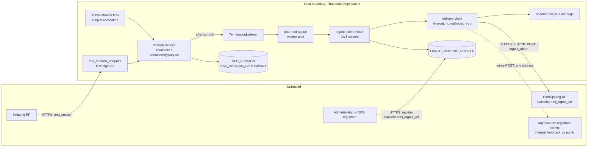
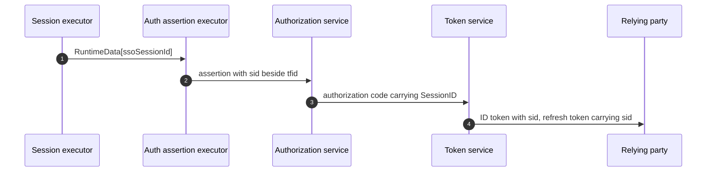
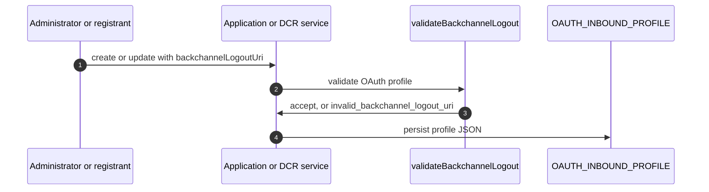
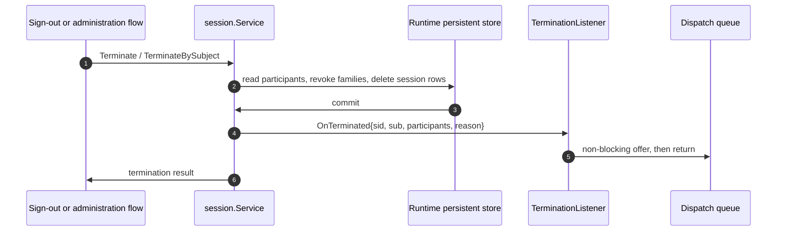
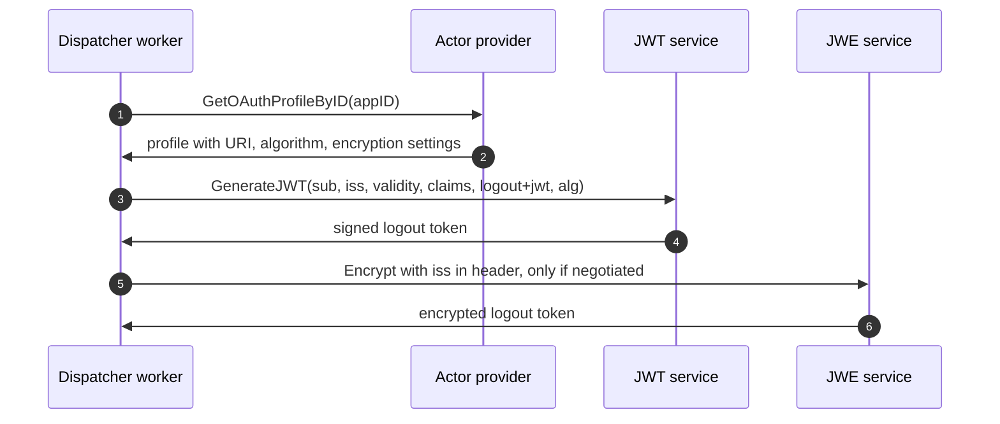
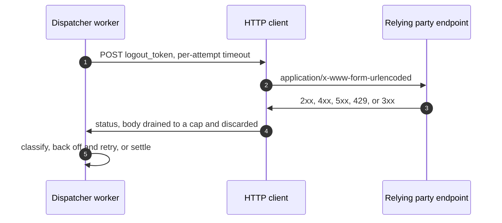
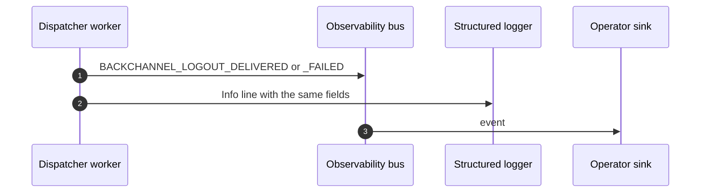

# OIDC Back-Channel Logout Threat Model

This model covers OpenID Connect Back-Channel Logout 1.0 in ThunderID: the `sid` claim carried on ID and refresh tokens, the `backchannel_logout_uri` registered by an application, the listener that observes SSO session termination, and the outbound delivery of logout tokens to relying parties.

## Overview

Back-channel logout turns a session termination at ThunderID into a server-to-server notification at every application that joined the session. Three mechanisms make it up. The SSO session's `SESSION_ID` is published as the `sid` claim so a relying party can name the session that ended. A `TerminationListener` on the session service is called after the terminating transaction commits, carrying the session id, the subject id, and the participant list. A bounded in-process queue and worker pool then mint one logout token per participant that registered a `backchannel_logout_uri`, POST it, and record the outcome.

The security-relevant shift is direction. The OAuth surface a relying party touches today is inbound: a client calls, the server answers. This one is outbound. ThunderID dials a host named in a client's own registration, from inside the deployment's network, on a schedule an end user triggers. That single fact drives most of what follows: the address policy for the registered URI, the refusal to follow redirects, the bounds on concurrency and retry, and the residual risks at the end of this document.

Cross-cutting concerns covered elsewhere: JWT signing, key management, and JWE encryption at the system JOSE layer; client authentication and the authorization code flow; token family issuance and revocation; RP-Initiated Logout's client resolution and post-logout redirect validation; the permission model behind the application management API and Dynamic Client Registration. These are trust inputs here, not re-analysed.

## Scope

This model covers:

- Publication of the SSO session id as the `sid` claim on ID tokens and refresh tokens.
- Registration and validation of `backchannel_logout_uri` and `backchannel_logout_session_required` through the Console, the application management API, and Dynamic Client Registration.
- Observation of session termination through `session.TerminationListener`, on both the sign-out path (`Terminate`) and the administrative subject-revocation path (`TerminateBySubject`).
- Queueing, dispatch, retry, and graceful-shutdown drain in the back-channel dispatcher.
- Minting of the logout token, including its signing and optional encryption.
- The outbound HTTP POST to the relying party's registered endpoint and the handling of its response.
- The audit and observability records produced per delivery attempt.
- The `backchannel_logout_supported` and `backchannel_logout_session_supported` discovery metadata.

Out of scope (see the referenced companion models or the owning area):

- Signature generation, key rotation, and JWE primitives. Owned by the system JOSE layer; used here unchanged through `jwtService.GenerateJWT` and `jweService.Encrypt`.
- Session establishment, the session cookie handle, idle and absolute deadlines, and the cleanup procedures. Owned by the session area.
- Token family revocation on logout, and criteria revocation on subject-wide termination. Owned by the token revocation area. Back-channel delivery neither performs nor depends on revocation.
- End session endpoint client resolution, `id_token_hint` verification, and post-logout redirect URI validation. Owned by RP-Initiated Logout, which shipped earlier.
- The permission check that gates application configuration changes and Dynamic Client Registration. Trust input here.
- What a relying party does with a logout token after validating it. Covered by the adopter guide, not defensible from the OP.
- Front-Channel Logout 1.0, Session Management 1.0, and SAML Single Logout.
- Notification on session expiry, which this design does not implement.

## Architecture

The trust boundary sits at the deployment edge. Everything inside it is ThunderID code and storage. Two things cross it in the direction that is new for this feature: the registered URI comes in from a registrant, and the logout token goes out to whatever that URI names. Other outbound calls exist, to federated identity providers, but their destinations are set by an administrator configuring a connection. This one can also be set by a client registering itself, and the design deliberately declines the SSRF check that guards `jwks_uri` on the same profile. That decision is recorded in alternative A6 of the design and carried as a residual risk here.

### Components

| Component | Task |
| --- | --- |
| `sessionExecutor` | Publishes the SSO session id on flow runtime data, so it can reach the auth assertion. Adds the key to `requestScopedSnapshotDenyList` so a replayed snapshot cannot carry a stale session id |
| `authAssertExecutor` and the authorization code | Carry `sid` from the flow to the OAuth layer beside the token family id |
| ID token builder and refresh token grant | Stamp `sid` into the ID token, and carry it on the refresh token so a refreshed ID token keeps the same value |
| `session.Service` | Owns the terminating transaction and the participant list. Calls the listener after commit, never inside the transaction, and never with I/O of its own |
| `TerminationListener` | Copies the terminated session into an event and offers it to the queue without blocking. Does no I/O and no configuration lookup |
| Dispatcher | Bounded channel plus fixed worker pool. Resolves each participant's OAuth profile, skips participants with no registered URI, bounds concurrency with a global semaphore, and drains on graceful shutdown |
| Logout token minter | Builds the claim set, derives `sub` through `tokenservice.SubjectClaim`, signs with the client's ID token algorithm, and encrypts when the client negotiated ID token encryption |
| Delivery client | One POST per attempt with a per-attempt timeout, a redirect policy that refuses to follow 3xx, a capped response drain, and classified retry with backoff |
| Client configuration validation | Rejects a relative URI, a URI with no host, a fragment, a wildcard, and plain HTTP for a public client |
| Observability and logging | One event and one structured log line per attempt, carrying no token and no subject attributes |

### Actors

#### Actors

| Actor | Description | Roles or permissions |
| --- | --- | --- |
| End user | Signs out of one application, or has their sessions revoked by an administrator | None over this feature; the trigger only |
| Participating relying party | An application that joined the SSO session and may have registered a back-channel logout URI | Receives a logout token scoped to itself |
| Administrator | Configures `backchannelLogoutUri` through the Console or the application management API | Application configuration permission |
| DCR registrant | Registers a client through `POST /oauth2/dcr/register`, supplying `backchannel_logout_uri` | System permission, unless the deployment set `oauth.dcr.insecure` |
| Operator | Deploys ThunderID and owns `oauth.logout.backchannel` configuration, network egress policy, and log retention | Deployment configuration |
| Network observer | Positioned between ThunderID and a relying party's endpoint | Observation, and modification absent TLS |
| Malicious or compromised relying party | A registered application whose endpoint is attacker controlled, or whose configuration an attacker can edit | Whatever its own registration grants |

#### Entitlement matrix

| Actor | Register a back-channel logout URI | Receive a logout token | Trigger a notification | Read delivery outcomes |
| --- | --- | --- | --- | --- |
| End user | [No] | [No] | [Yes], by signing out | [No] |
| Participating relying party | [Yes], for itself through DCR | [Yes], only tokens with its own `aud` | [Yes], by calling the end session endpoint | [No] |
| Administrator | [Yes] | [No] | [Yes], by revoking a subject's sessions | [Yes], through observability events and logs |
| DCR registrant | [Yes], for the client it registers | [Yes], for that client | [No] | [No] |
| Operator | [Yes] | [No] | [No] | [Yes] |
| Network observer | [No] | [Yes], only where the endpoint is plain HTTP | [No] | [No] |

### External Dependencies (not owned)

| Dependency | Description (usage, purpose, authentication, authorization, security) |
| --- | --- |
| Relying party back-channel endpoint | The host named by `backchannel_logout_uri`. ThunderID authenticates itself to it only by the signature on the logout token. It does not authenticate the endpoint beyond TLS, and where the registrant chose HTTP there is no authentication of the peer at all. Whether the logout token is validated correctly is the relying party's obligation, documented in the adopter guide |
| System JOSE layer | `jwtService.GenerateJWT` for signing and `jweService.Encrypt` for encryption, including key selection and rotation. Owned by the JWT and key management area |
| `syshttp` HTTP client | Transport, TLS minimum version from server configuration, and the redirect policy hook. The SSRF-safe dialer this package also offers is deliberately not used here, as the registered URI is allowed to name a private address |
| Observability bus | Delivery of `BACKCHANNEL_LOGOUT_DELIVERED` and `BACKCHANNEL_LOGOUT_FAILED` events to whatever sink the operator configured. Retention and access control are the operator's |
| Runtime persistent database | `SSO_SESSION_PARTICIPANT` is the notification set and `OAUTH_INBOUND_PROFILE` holds the registered URI. Both are reused without schema change |

## Threats and mitigations

### Out-of-scope interactions and risks

- Forgery or misuse of the signing key, and failure of key rotation. Owned by the JWT and key management area; the logout token uses that layer without extension beyond an optional extra JWE header.
- Bypass of the permission check on application update or Dynamic Client Registration. Owned by the application management and DCR areas. This model takes "the registrant is authorized" as a trust input and analyses what an authorized registrant can then cause.
- Revocation of access and refresh tokens on logout. Owned by the token revocation area. No control here depends on it, and no failure here affects it.
- Compromise of the relying party itself, or of the network between ThunderID and a relying party that registered an HTTPS endpoint with a valid certificate.
- The deployment's own egress policy. Where a deployment needs the delivery client confined to a set of destinations, that is a network control the operator applies, and this model records it as the compensating control for the address policy rather than implementing it.

### Interactions

#### 01: Publishing the SSO session id as `sid`

**Description**

The SSO session's `SESSION_ID` is published on flow runtime data by the session executor, copied onto the auth assertion beside the token family id, carried on the authorization code, stamped into the ID token, and carried on the refresh token so a refreshed ID token keeps the same value. The value is the internal `SESSION_ID`, not the session `HANDLE_ID`.

**Assets involved**

| Initiator | Intermediate | Target |
| --- | --- | --- |
| End user's login flow | Session executor, auth assertion, authorization code | ID token and refresh token held by the relying party |

**Data flow**

**Security considerations**

| Area | Response | Comments |
| --- | --- | --- |
| Data confidentiality | [C-Medium] | An opaque session identifier. It names a session but confers no ability to use one |
| Communication medium | [M-NT], [M-IN] | In process to the token service, then over the network inside the token response |
| Transport security | [TLS] | The token endpoint response, on the deployment's own listener |
| Authentication | The client authentication and code exchange that precede issuance | |
| Accessibility | [Restricted] | Delivered only to the client that redeemed the code |
| Authorization and Access Control | Only session-bearing flows produce a `sid`; CIBA, token exchange, and client credentials produce none | |

**Threat assessment**

| ID | Category | Threat | Materializable | Mitigation / comment |
| --- | --- | --- | --- | --- |
| 1 | [Elevation of Privilege] | The claim carries the session `HANDLE_ID`, which is the cookie value and a bearer credential, so every relying party that receives an ID token can resume the user's SSO session and impersonate them at every other application | [No] | `sid` is the internal `SESSION_ID`, a UUIDv7 that no API accepts and that confers nothing. The choice is recorded in alternative A3, and the comment on `Session.SessionID` is updated to say the value is published |
| 2 | [Tampering] | A `sid` copied out of a replayed flow snapshot names a session other than the one now in force, so a later termination notifies relying parties about a session they were never part of, or fails to notify about the one they were | [No] | The runtime key is added to `requestScopedSnapshotDenyList`, the same treatment the token family id already receives, so the value is republished after replay rather than restored from the snapshot |
| 3 | [Information Disclosure] | A session identifier reaches a resource server through the access token, widening the set of parties that can correlate a user's activity to one session | [No] | Access tokens deliberately carry no `sid`. The token family design keeps session identifiers off resource-server-facing tokens, and nothing in delivery needs one there |
| 4 | [Privacy Risk] | Every application in a session receives the same `sid`, so two relying parties that compare notes can establish that a given user's sessions at both are the same session, which is a correlation handle beyond the individual application | [Yes] | The same parties already share `sub`, since discovery advertises only the `public` subject type, so `sid` adds no new linkage today. It would become the residual linkage if pairwise subject identifiers were introduced. `tokenservice.SubjectClaim` is the named seam where pairwise subjects would land, and a per-participant `sid` is the mitigation available at that point. Recorded as a residual |
| 5 | [Operational Risk] | An ID token issued before this feature shipped carries no `sid`, so a relying party holding such a token cannot match the logout token it later receives and ignores a legitimate logout | [No] | Every session has a `SESSION_ID`, so the logout token always carries `sid` and always carries `sub`. A relying party with a pre-upgrade token matches on `sub` or ignores the notification, which is exactly today's behaviour for that session and no worse |
| 6 | [Security Risk] | A synthetic `sid` is issued for an authorization with no SSO session, promising a notification that no termination can ever produce | [No] | A flow with no session nodes publishes no `sid`. Only sessions that can be terminated are named |

#### 02: Registering the back-channel logout URI

**Description**

An administrator sets `backchannelLogoutUri` on an application through the Console or the management API, or a client supplies `backchannel_logout_uri` during Dynamic Client Registration. `validateBackchannelLogout` runs inside `validateOAuthProfile` for every path. The URI must parse, carry a scheme and a host, carry no fragment, and carry no wildcard. Plain HTTP is accepted only for confidential clients. No address filtering is applied.

**Assets involved**

| Initiator | Intermediate | Target |
| --- | --- | --- |
| Administrator or DCR registrant | Console, application service, inbound client validation | `OAUTH_INBOUND_PROFILE` |

**Data flow**

**Security considerations**

| Area | Response | Comments |
| --- | --- | --- |
| Data confidentiality | [C-Low] | The URI is configuration, not a secret |
| Communication medium | [M-NT], [M-DB] | |
| Transport security | [TLS] | On the management API and Console listener |
| Authentication | Management API authentication; DCR requires a system permission unless `oauth.dcr.insecure` is set | |
| Accessibility | [Restricted] for the management API and Console; [Public] for the DCR endpoint when `oauth.dcr.insecure` is set | |
| Authorization and Access Control | Application configuration permission, or the DCR system permission | |

**Threat assessment**

| ID | Category | Threat | Materializable | Mitigation / comment |
| --- | --- | --- | --- | --- |
| 1 | [Security Risk] | A registrant names an address inside the deployment's network, and ThunderID performs a POST against it from a network position the registrant does not have, reaching a metadata service, an admin port, or a neighbouring service | [Yes] | Accepted by design in alternative A6, because the common deployment has relying parties on internal addresses. The exposure is bounded: the request is a fixed `application/x-www-form-urlencoded` body holding a signed JWT the registrant cannot shape, the response is drained to a small cap and discarded so nothing is read back, redirects are never followed, and the request only fires when a real session terminates. Registration requires an authorized principal, so this is a privilege the deployment grants rather than an anonymous one, unless `oauth.dcr.insecure` is set. Residual below, with operator guidance to keep DCR authenticated and to confine delivery egress where the threat model of the deployment calls for it |
| 2 | [Denial of Service] | A registrant names a third party's address, making ThunderID an unwitting source of POST traffic at a victim it has no relationship with | [Yes] | Bounded by construction rather than by filtering: one POST per participating application per termination, at most `max_attempts` attempts with exponential backoff capped at `retry_max_delay`, and a global `max_in_flight` semaphore across the dispatcher. The volume is therefore capped by real logout volume, not by anything the registrant controls. Every attempt is recorded with the client id and app id, so the source of the traffic is attributable. Residual below |
| 3 | [Information Disclosure] | A plain HTTP endpoint is registered, so the logout token, which carries `sub` and `sid`, crosses the network in the clear and a network observer learns the subject identifier and that their session ended | [Yes] | Accepted for confidential clients only, the condition section 2.2 of the specification attaches to HTTP, and enforced at registration: a client whose `PublicClient` flag is set must register HTTPS. The token is signed, so what HTTP costs is confidentiality, not integrity. The guide recommends HTTPS for anything outside a private network. Residual below |
| 4 | [Tampering] | An actor who can edit an application's configuration repoints `backchannelLogoutUri` at a host they control and starts receiving logout tokens for that application's sessions, learning which subjects use the application and when they sign out | [No] | The change requires the application configuration permission, the same permission that already controls redirect URIs and client secrets, so this actor has strictly greater capabilities by other means. Each token is minted with `aud` set to that client, so nothing belonging to another application is disclosed. Detection depends on the change being audited; see threat 5 |
| 5 | [Repudiation] | An endpoint is repointed and later repointed back, and the audit trail records that the application was updated without recording what the URI was before, so the interval cannot be reconstructed during an investigation | [Yes] | Application configuration changes are audited as events but do not record an old-to-new difference. This is a pre-existing gap in the application service rather than something introduced here, but a back-channel endpoint is a high-value field to repoint. Recorded as a residual with a pointer to checklist item 14 |
| 6 | [Security Risk] | A wildcard or a fragment in the registered URI causes ThunderID to dial a host the registrant did not pin, or to send a request whose target differs from what was reviewed | [No] | Any `*` anywhere is rejected, a fragment is rejected, and the URI must be absolute with a scheme and a host. A wildcard in a URI that ThunderID dials is either meaningless or a request to post tokens somewhere unpinned |
| 7 | [Security Risk] | `backchannel_logout_session_required` is accepted at registration and a relying party concludes that setting it to false changes what ThunderID sends | [No] | `sid` is present on every logout token, so the flag cannot change delivery. It is stored and echoed for Dynamic Client Registration compatibility only, not read at delivery time, and deliberately not surfaced in the Console so no control implies an effect it does not have |

#### 03: Observing session termination

**Description**

`Terminate` and `TerminateBySubject` call the injected `TerminationListener` after their transaction commits, passing the session id, subject id, participant list, and termination reason. The listener performs no I/O. `Terminate` reuses the participant list it already read inside the transaction. `TerminateBySubject` performs one additional bulk participant read, before its transaction, keyed by the set of session ids it is about to delete.

**Assets involved**

| Initiator | Intermediate | Target |
| --- | --- | --- |
| Sign-out flow or administration flow | `session.Service`, `SSO_SESSION_PARTICIPANT` | `TerminationListener` and the dispatch queue |

**Data flow**

**Security considerations**

| Area | Response | Comments |
| --- | --- | --- |
| Data confidentiality | [C-High] | The participant list and subject id describe which applications a user was signed in to |
| Communication medium | [M-IN] | In process only |
| Transport security | [Not Encrypted] | In-process call inside the trust boundary |
| Authentication | The termination path that reached the service is already authenticated | |
| Accessibility | [Internal] | Not reachable from outside the process |
| Authorization and Access Control | Injected at the composition root; a nil listener means the feature is off | |

**Threat assessment**

| ID | Category | Threat | Materializable | Mitigation / comment |
| --- | --- | --- | --- | --- |
| 1 | [Denial of Service] | A notification problem, such as a saturated queue or a slow endpoint, blocks or fails the user's logout, so a user who wants to sign out cannot | [No] | The listener is called after commit, does no I/O, and offers to the queue without blocking. The session is already gone before anything outbound happens, so a failed or dropped notification cannot fail a logout. A panic in the listener is recovered and logged, leaving the logout result untouched |
| 2 | [Spoofing] | Relying parties are told a session ended when the terminating transaction actually rolled back, so they tear down live sessions and users are signed out of applications they never left | [No] | The listener runs only after `Transact` returns successfully. A failed transaction deletes nothing, revokes nothing, and produces no listener call |
| 3 | [Repudiation] | Administrative subject revocation is not observed, so revoking a user's sessions leaves every relying party's local session alive and the administrator believes the user was signed out everywhere | [No] | `TerminateBySubject` calls the listener once per session. That path revokes no token families, because a subject criterion already covers the tokens, but no token revocation touches a relying party's local session, so it must notify, and it does |
| 4 | [Operational Risk] | A participant that joins between the pre-transaction participant read and the delete is never notified, so one application keeps a session that ThunderID considers ended | [Yes] | Under read committed the window exists wherever the read is placed, including inside the transaction, so the read's position before the transaction does not create it. The window is the width of one transaction and the affected application's local session is bounded by its own timeout and by the ID token lifetime. Recorded as a residual |
| 5 | [Information Disclosure] | The session package takes a dependency on the OAuth layer to build the notification, spreading protocol and client knowledge into the session core and widening what a defect there can reach | [No] | The listener is an interface declared in the session package beside `CriteriaRevoker`, and every protocol-shaped concern sits behind it in `oauth2/logout/backchannel`. The session package learns nothing about clients, tokens, or HTTP |
| 6 | [Denial of Service] | A subject holding a large number of sessions makes the additional participant read expensive enough to slow the revocation path | [No] | One bulk query keyed by the set of session ids, grouped in memory, so the cost is one round trip regardless of session count. It replaces neither the delete nor any existing read |

#### 04: Minting the logout token

**Description**

For each participant with a registered URI, a worker mints a fresh logout token per attempt: `aud` set to the client id, `sid` set to the terminated session id, `sub` derived through `tokenservice.SubjectClaim`, an `events` member carrying the back-channel logout event URI, a UUIDv7 `jti`, and `typ` of `logout+jwt`. Issuer and signing algorithm come from the same `ResolveTokenConfig` the ID token builder uses. If the client negotiated ID token encryption, the signed token goes through the JWE step with `iss` replicated in the JWE header.

**Assets involved**

| Initiator | Intermediate | Target |
| --- | --- | --- |
| Dispatcher worker | JWT service, JWE service, actor provider | Logout token for one client |

**Data flow**

**Security considerations**

| Area | Response | Comments |
| --- | --- | --- |
| Data confidentiality | [C-High] | The token names a subject and a session, and is a valid credential for causing a logout at the relying party |
| Communication medium | [M-IN] | Minting is in process; transmission is interaction 05 |
| Transport security | [Not Encrypted] | In process. Transport protection is interaction 05; JWE, where negotiated, is end-to-end |
| Authentication | The signature is how ThunderID authenticates itself to the relying party | |
| Accessibility | [Restricted] | One token per client, audience scoped |
| Authorization and Access Control | `aud` is the single client id; profile resolution is by participant app id | |

**Threat assessment**

| ID | Category | Threat | Materializable | Mitigation / comment |
| --- | --- | --- | --- | --- |
| 1 | [Spoofing] | A logout token captured at a relying party is replayed to ThunderID as an `id_token_hint`, suppressing the end-user sign-out confirmation and driving a logout the user did not ask for | [No] | The hint check accepts only `typ: JWT`, and the logout token carries `typ: logout+jwt`, so it is rejected before any other processing. The existing check is at `backend/internal/oauth/oauth2/logout/service.go:239` |
| 2 | [Spoofing] | A logout token is accepted by a relying party as an ID token, letting an attacker who can deliver one establish a session rather than end one | [No] | The specification forbids `nonce` in a logout token precisely so a lax relying party cannot mistake one for an ID token. A `nonce` is never added, and a test asserts its absence rather than relying on inspection. `typ` and the `events` member distinguish the two for any relying party that checks them |
| 3 | [Information Disclosure] | A token minted for one application is delivered to another, disclosing that a subject used an application to a party with no relationship to it | [No] | One token is minted per participant, with `aud` set to that client id and the token sent only to that client's registered URI. A relying party validating `aud`, as the specification requires, rejects anything else |
| 4 | [Tampering] | The logout token's `sub` differs from the `sub` that relying party saw in its ID token, so it cannot match the notification to a local session and silently ignores every logout | [No] | Both derive `sub` through one function, `tokenservice.SubjectClaim`, and a differential test builds an ID token and a logout token for the same subject and client and compares the claim. The test fails if either path diverges, which also protects the invariant if pairwise subject identifiers are added later |
| 5 | [Spoofing] | A relying party accepts an unsigned or weakly signed logout token, so anyone who can reach its endpoint can force logouts for arbitrary subjects | [No] | The algorithm comes from the same `ResolveTokenConfig` the ID token builder uses, so a client that selected its own `id_token_signed_response_alg` receives logout tokens it can verify with the key it already trusts, and the algorithm policy is the ID token's policy. Validation obligations on the relying party side are stated in the adopter guide |
| 6 | [Information Disclosure] | A client that negotiated ID token encryption receives an unencrypted logout token, so `sub` and `sid` travel in the clear against that client's explicit configuration | [No] | The signed token goes through the same JWE step the ID token builder applies whenever encryption is configured, with `iss` replicated in the JWE header as section 2.4 recommends. The specification says such a relying party should reject an unencrypted logout token, so signing only would break exactly the clients that asked for more |
| 7 | [Denial of Service] | A retry carries a token that expired during backoff, or one signed with a key that has since rotated, so every retry fails validation and the retry budget is spent achieving nothing | [No] | A fresh token is minted per attempt, with a new `jti` and a new validity window. That also avoids a relying party tracking `jti` rejecting the retry as a replay, which minting once would cause |
| 8 | [Security Risk] | A long-lived logout token captured in transit stays usable, so an attacker can force a logout well after the fact | [No] | Default validity is 120 seconds, the maximum the specification recommends, and is deployment configurable. The worst outcome of a successful replay inside that window is a forced sign-out at one relying party, which is a nuisance rather than an access gain |

#### 05: Delivering the logout token

**Description**

The worker POSTs `logout_token=<JWT>` as `application/x-www-form-urlencoded` to the registered URI, with a per-attempt timeout, a redirect policy returning `http.ErrUseLastResponse`, and a capped response drain. 200 and 204 are success. Connection errors, timeouts, 5xx, and 429 are retryable with exponential backoff capped at `retry_max_delay`, honouring a capped `Retry-After` on 429. Any other 4xx and any 3xx fail immediately. Concurrency across the dispatcher is bounded by `max_in_flight`.

**Assets involved**

| Initiator | Intermediate | Target |
| --- | --- | --- |
| Dispatcher worker | `syshttp` client, network | Relying party back-channel logout endpoint |

**Data flow**

**Security considerations**

| Area | Response | Comments |
| --- | --- | --- |
| Data confidentiality | [C-High] | The token in transit carries `sub` and `sid` |
| Communication medium | [M-NT] | Outbound from inside the trust boundary |
| Transport security | [TLS] where the registrant chose HTTPS, [Not Encrypted] where a confidential client chose HTTP | Minimum TLS version comes from server configuration. The HTTP case is the accepted deviation in interaction 02 threat 3 |
| Authentication | ThunderID authenticates to the relying party by the token signature. The peer is authenticated only by TLS, and not at all over HTTP | |
| Accessibility | [Public] | The destination is whatever the registrant named |
| Authorization and Access Control | Destination fixed by registration; no per-request destination input exists | |

**Threat assessment**

| ID | Category | Threat | Materializable | Mitigation / comment |
| --- | --- | --- | --- | --- |
| 1 | [Lateral Movement] | The endpoint answers 3xx and the client follows it, turning the POST into a GET at a host that was never registered and placing the request at an address outside the registrant's pinned destination | [No] | The redirect policy returns `http.ErrUseLastResponse`, so a 3xx is never followed and is classified as a terminal failure. This closes the redirect path to both an unregistered host and the method downgrade that would carry the request into a URL |
| 2 | [Information Disclosure] | The relying party's response body is read into the dispatcher, so a hostile endpoint can return an unbounded or crafted body and either exhaust memory or feed data into ThunderID's processing | [No] | The response body is drained up to a small cap and discarded without parsing. Only the status code influences behaviour, and `Retry-After` on a 429 only within a cap |
| 3 | [Denial of Service] | A hostile or hung endpoint holds worker slots open, starving delivery for every other relying party and, under a mass revocation, for every other session | [No] | One `context.WithTimeout(request_timeout)` per attempt, a fixed worker pool, and a global `max_in_flight` semaphore across the dispatcher. A single slow endpoint can occupy at most its own attempts for at most the timeout, and cannot open unbounded connections |
| 4 | [Denial of Service] | A relying party returns 429 with a `Retry-After` of many minutes, holding a delivery slot and starving other deliveries | [No] | `Retry-After` is honoured only up to `retry_max_delay`, defaulting to 30 seconds, so a hostile or misconfigured value cannot hold a slot beyond the cap |
| 5 | [Denial of Service] | A mass termination, such as subject-wide revocation across many sessions, floods the queue and delivery collapses or the process exhausts memory | [Yes] for the notifications | The process itself is not at risk: the channel is bounded by `queue_size` and the offer is non-blocking, so memory is capped and the logout path never blocks. Events beyond the bound are dropped and recorded as failed with reason `queue_full`, which is a lost notification rather than a lost logout. Recorded as a residual |
| 6 | [Security Risk] | The host resolves to a private address at validation time and to a different one at connection time, or the reverse, so what was dialled is not what was reviewed | [No] | Address filtering and the DNS pinning that accompanies it are deliberately not applied here, because a private address is the expected destination. There is therefore nothing for a rebinding attack to bypass: naming a private address directly is already permitted. This is the same accepted exposure as interaction 02 threat 1, not an additional one |
| 7 | [Information Disclosure] | Anything the registrant controls reaches an internal service as request content, turning the blind POST into a usable request forgery primitive | [No] | The body is exactly `logout_token=<JWT>` and the token's every claim is server derived. The registrant chooses the destination and nothing else. The content type is fixed and no header carries registrant input |
| 8 | [Operational Risk] | Deliveries in flight when the process stops are lost, so relying parties keep sessions that ThunderID has already terminated | [Yes] | On graceful shutdown the dispatcher closes intake and drains queued and in-flight work within the shutdown deadline, recording anything abandoned at the deadline as failed with reason `shutdown`. A hard kill loses pending deliveries with no record, which alternative A1 accepts: the outcome is today's behaviour for those sessions, bounded by each relying party's own session lifetime. Recorded as a residual |
| 9 | [Repudiation] | The initiating relying party's post-logout redirect completes before its own logout token arrives, and a user or operator concludes from the browser that every application was notified | [No] for correctness, noted as a deviation | ThunderID does not wait for notifications before redirecting, which deviates from the non-normative ordering in RP-Initiated Logout sections 2 and 3, as the design records. The session is terminated before the first byte is sent, so the redirect never overstates the state of the session itself, and the initiator cleared its own session before calling the end session endpoint. What the redirect does not prove is that other relying parties were reached, and the audit events are the authoritative record of that |
| 10 | [Denial of Service] | Delivery is disabled or misconfigured deployment-wide and nobody notices, so logouts silently stop propagating | [No] | `oauth.logout.backchannel.enabled` drives the discovery flags as well as delivery, so a deployment with delivery off advertises `backchannel_logout_supported: false` rather than claiming a capability it will not honour. Every failure is recorded as an event and a log line |

#### 06: Recording delivery outcomes

**Description**

Every attempt publishes one observability event, `BACKCHANNEL_LOGOUT_DELIVERED` on a 2xx or `BACKCHANNEL_LOGOUT_FAILED` on a terminal failure, and writes one structured Info log line with the same fields. Fields are `client_id`, `app_id`, `session_id`, `attempt`, `http_status`, `duration_ms`, and on failure a reason code.

**Assets involved**

| Initiator | Intermediate | Target |
| --- | --- | --- |
| Dispatcher worker | Observability bus, logger | Operator's sink and log store |

**Data flow**

**Security considerations**

| Area | Response | Comments |
| --- | --- | --- |
| Data confidentiality | [C-Medium] | The records associate an application with a session identifier and a time |
| Communication medium | [M-NT], [M-FS] | Depends on the sink the operator configured |
| Transport security | [TLS] | Owned by the sink configuration |
| Authentication | Sink authentication, owned by the operator | |
| Accessibility | [Restricted] | Operator access to logs and events |
| Authorization and Access Control | Owned by the observability area and the deployment | |

**Threat assessment**

| ID | Category | Threat | Materializable | Mitigation / comment |
| --- | --- | --- | --- | --- |
| 1 | [Repudiation] | A logout that never reached a relying party leaves no trace, so an incident responder cannot tell which applications were notified and which kept a live session | [No] | Every attempt is recorded, including terminal failures and events dropped for `queue_full` or abandoned at `shutdown`, each with a reason code. The reason codes are the enumeration in the design's failure-mode table |
| 2 | [Information Disclosure] | The logout token, or the registered URI's query string, reaches the log store, so anyone with log access holds a replayable credential or a secret embedded in the endpoint URL | [No] | Nothing records the token, the URI's query string, request or response bodies, or subject attributes. The recorded fields are identifiers, counters, and status codes |
| 3 | [Privacy Risk] | `session_id` in an operator's log store links an application to a user's session for the life of the log retention, beyond what the operational purpose needs | [No] | `sid` is opaque and confers nothing, `sub` is not recorded, and the field is what makes a failed delivery traceable to the session it belonged to. Retention is the operator's, as it is for every other event this bus carries |
| 4 | [Operational Risk] | No observability sink is configured, so the only record of a failed notification is lost | [No] | Each attempt also writes a structured log line, so the record exists at the logger without any sink |

## Security Review Checklist

A review aid that complements the threat model. Guidance follows the [OWASP Top 10 Proactive Controls](https://top10proactive.owasp.org/).

### Security considerations

| # | Consideration | State | Comments |
| --- | --- | --- | --- |
| 1 | Are all inputs and outputs validated (syntactic and semantic)? | [Yes] | `backchannel_logout_uri` is validated syntactically and semantically at registration on every path, including DCR, which delegates to `CreateApplication`. `backchannel_logout_session_required` is type checked only, which is sufficient because it is never read at delivery time. The only input from an untrusted peer at runtime is the relying party's HTTP response, and only its status code and a capped `Retry-After` are used; the body is drained and discarded |
| 2 | Are rate limits in place where necessary? | [Partial] | The repository has no rate limiting framework, so there is none in the request-count sense. Outbound volume is bounded structurally instead: `max_in_flight` caps concurrency across the dispatcher, `queue_size` caps pending work, `max_attempts` caps retries per delivery, and `retry_max_delay` caps both backoff and a relying party supplied `Retry-After`. Delivery volume is driven by real termination volume, which no external party can inflate beyond its own logout rate |
| 3 | Are permissions, roles, and entitlements defined on the principle of least privilege and business need? | [Yes] | Registering a URI requires the application configuration permission, or the DCR system permission. Each relying party receives only tokens with its own `aud`. The dispatcher reads the OAuth profile and nothing else, and the session package gains no OAuth dependency |
| 4 | Are authentication and authorization validated at both the UI and API layers, front end and back end, before granting access to resources? | [Yes] | The Console field writes through the same application service the API uses, and `validateOAuthProfile` runs server side on every path. Console-side validation is for feedback only and is not the enforcement point |
| 5 | Are proper isolations in place between components to ensure least-privilege access and reduce the blast radius against lateral movement? | [Partial] | Within the process the seam is clean: the session package declares an interface, the OAuth layer implements it, and no protocol knowledge crosses. At the network layer the dispatcher shares the server's egress with every other outbound call and applies no destination restriction of its own, which is the accepted decision in alternative A6. Confining that egress is available to the operator as a deployment control and is recommended in the residual risks |
| 6 | Have any default credentials been changed, and are default superuser or root accounts not in use (when using third-party components)? | [N/A] | The feature ships no credentials and introduces no third-party component |
| 7 | Has the implementation followed best-practice guidelines (OWASP, Kubernetes, vendor, or technology provider)? | [Yes] | OpenID Connect Back-Channel Logout 1.0 is followed, including the `typ`, `events`, and absent `nonce` requirements, the 120 second validity ceiling, the section 2.2 condition on HTTP, and the section 2.4 recommendation to replicate `iss` in the JWE header. The one deviation, not waiting for notifications before the post-logout redirect, is from a non-normative sentence in RP-Initiated Logout and is documented with its rationale and its precedent |
| 8 | Are secrets, credentials, and internal-only material kept out of the public source tree and its git history? | [Yes] | The feature introduces no secret material. Signing keys stay with the existing JOSE layer |
| 9 | Was a security-focused code review conducted for this change, and have the findings been addressed? | [N/A] | This document precedes the implementation. It applies to the pull requests that follow, where the redirect policy, the response drain cap, the `typ` value, and the absence of `nonce` are the points to verify |
| 10 | Is Static Analysis (SAST) or IaC scanning conducted, and are findings addressed? | [Yes] | `gosec` runs as part of the backend golangci-lint configuration, which `make pr_checks` gates on |
| 11 | Is Software Composition Analysis (SCA) conducted or integrated into the repository, and are findings addressed (for example FOSSA, Trivy)? | [Partial] | Go dependency changes are validated against the dependency registry on every pull request that touches `go.mod`, and npm advisories have a documented remediation workflow. There is no continuous vulnerability scan of the full dependency set. This feature adds no dependency |
| 12 | Is Dynamic (DAST) or API scanning conducted on a non-production setup, and are findings addressed? | [No] | No DAST pipeline exists. The outbound direction of this feature is in any case not what an inbound scanner exercises; the delivery client is best covered by integration tests against a controlled endpoint that returns each classified response |
| 13 | Are audit logs generated in a standardized format for critical functionality, and available to authorized users to trace critical events and aid incident response? Note the retention period in Comments. | [Yes] | `BACKCHANNEL_LOGOUT_DELIVERED` and `BACKCHANNEL_LOGOUT_FAILED` are published per attempt through the existing observability bus, with a matching structured log line so the record survives an unconfigured sink. Retention is the operator's and is not set by the project |
| 14 | Do audit logs for critical configuration changes record the difference between the old and new versions? | [No] | Application configuration changes are recorded without an old-to-new difference. Repointing a back-channel logout URI is a change worth diffing, since it redirects where logout tokens go. Pre-existing gap in the application service, recorded as a residual rather than fixed here |
| 15 | Are data in transit and at rest encrypted? | [Partial] | Delivery is over TLS wherever the registrant chose HTTPS, with the minimum version from server configuration, and end-to-end under JWE for clients that negotiated ID token encryption. Plain HTTP is accepted for confidential clients by the decision in alternative A6, and that path is not encrypted. At rest, the registered URI is configuration rather than a secret, and nothing new is persisted |
| 16 | Are sensitive values such as credentials and keys stored in a secret store or vault? | [N/A] | The feature introduces no new key or secret. Signing and encryption keys are held by the existing JOSE layer |
| 17 | Is personal, sensitive, or confidential data kept out of logs? | [Yes] | No token, no URI query string, no request or response body, and no subject attribute is recorded. `sub` is not among the recorded fields |
| 18 | Have users been given clear instructions for secure usage? | [Partial] | A back-channel logout guide is part of the deliverable, along with updates to the RP-Initiated Logout, Sessions, and Server Metadata pages. It must state the relying party's validation obligations, that HTTPS is recommended for anything leaving a private network, and that an endpoint should be idempotent under retry. Operator guidance on confining delivery egress belongs there too and does not exist yet |

### Business impact and resilience

For an open-source component, most of these are shared with the operator who deploys it.

| # | Consideration | State | Comments |
| --- | --- | --- | --- |
| 1 | Has a business impact analysis been done to identify resilience requirements (maximum tolerable downtime, uptime, RPO, RTO)? | [N/A] | Owned by the deployer. What this design fixes is the blast radius: back-channel delivery is not on the user's logout path, so its unavailability degrades notification only and never authentication or sign-out |

Resilience details for this area:

- High availability: the dispatcher is per replica and holds no shared state, so replicas need no coordination and adding one adds delivery capacity. A termination is notified by the replica that handled it.
- Disaster recovery: there is nothing to recover. Delivery state is in memory by the decision in alternative A1, and a lost notification degrades that session to pre-feature behaviour, bounded by the relying party's own session lifetime.
- Backups and retention: no new table and no new retention requirement. Event retention is the operator's.
- Health checks: none specific to the dispatcher. Sustained `queue_full` or `unreachable` reasons in the event stream are the operational signal, and the guide should say so.
- User banners: not applicable.

### Dependency and component health

| # | Consideration | State | Comments |
| --- | --- | --- | --- |
| 1 | Are dependencies, base images, and runtimes monitored for known vulnerabilities and kept current (for example automated dependency scanning), and are findings addressed? | [Partial] | As checklist item 11. This feature adds no dependency and uses only the standard library HTTP client through `syshttp` |
| 2 | Are any End-of-Life or End-of-Service components in use? | [No] | |
| 3 | Is hardening guidance published for operators who deploy the project (optional)? | [No] | The egress guidance this feature warrants does not exist yet. See checklist item 18 and the residual risks |

### Privacy considerations

The feature processes one personal identifier, the subject id, and one identifier that is personal by association, the session id.

| # | Consideration | State | Comments |
| --- | --- | --- | --- |
| 1 | Is the purpose and legal basis for processing personal data clearly defined? | [Yes] | The purpose is to tell an application that a session it participated in has ended, which is the user's own sign-out being carried out. The controller is the deployer |
| 2 | Are the collection, storage, processing, sharing, archival, and disposal of personal data aligned with the data minimization principle? | [Yes] | The logout token carries `sub`, `sid`, `aud`, `iss`, `iat`, `exp`, `jti`, and the `events` member, and nothing else. No user attribute, no email, no name. Audit records carry no `sub` at all |
| 3 | Is personal data stored securely? | [Yes] | Nothing new is stored. The identifiers exist in the session tables the session area already owns |
| 4 | Are privacy notices updated to reflect any new processing or changes to purpose and legal basis? | [N/A] | Owned by the deployer. The disclosure to the relying party is disclosure to a party that already holds the user's tokens |
| 5 | Is access to personal data granted on a need-to-know basis? | [Yes] | A relying party is told about a session it joined and no other, and receives a token audience scoped to itself |
| 6 | Are data retention requirements considered? | [Yes] | The logout token lives 120 seconds by default and is never persisted. Audit retention is the operator's |
| 7 | Is there a process to dispose of personal data on request in a timely manner while meeting retention requirements? | [N/A] | Owned by the session and user areas; nothing new is retained here |
| 8 | Are records of personal-data processing maintained in the project's data inventory or records of processing? | [N/A] | Owned by the deployer |

## Residual risks (open items)

- **Outbound POST to an operator or registrant chosen address, with no address filtering.** Accepted in alternative A6, because relying parties on internal networks are the common deployment. The request is blind: a fixed body the registrant cannot shape, a response that is drained and discarded, and redirects refused. Registration requires an authorized principal. Two things bound it further and belong in operator guidance: keep Dynamic Client Registration authenticated, since `oauth.dcr.insecure` turns an authorized capability into an anonymous one, and confine the deployment's egress where the network holds services that a fixed-body POST could disturb.
- **ThunderID as a source of POST traffic at a third party named by a registrant.** Bounded by real logout volume, `max_attempts`, `max_in_flight`, and capped backoff, and attributable through the per-attempt audit events. No amplification factor is under the registrant's control.
- **Plain HTTP accepted for confidential clients.** Costs confidentiality of `sub` and `sid` and of the fact that a session ended, not integrity, since the token is signed. Accepted in alternative A6, with the guide recommending HTTPS for anything outside a private network.
- **A captured logout token is replayable at the relying party within its validity window**, which matters only on the HTTP path above. The worst outcome is a forced sign-out at one application. Bounded by the 120 second default validity.
- **Lost notifications.** Events dropped under `queue_full`, deliveries abandoned at the shutdown deadline, and everything pending at a hard kill. Each of the first two is recorded with a reason code; the third is not recorded at all. Accepted in alternative A1: the outcome is pre-feature behaviour for that session, bounded by the relying party's own session lifetime. The durable delivery table remains the option if operational evidence shows the loss rate matters.
- **No notification on session expiry.** An idle or absolute timeout deletes the session through a database sweep with no hook, so relying parties are never told. The specification does not require it, and relying parties bound their own sessions by ID token lifetime. Explicitly out of scope in the design.
- **A participant that joins a session between the pre-transaction participant read and the delete on the subject revocation path is not notified.** One transaction wide, and present under read committed wherever the read is placed.
- **Application configuration changes are audited without an old-to-new difference**, so a back-channel logout URI that is repointed and repointed back leaves no reconstructable interval. Pre-existing in the application service, surfaced here because this field is worth diffing.
- **Shared `sid` across every participant in a session** is a correlation handle between relying parties. Inert today, because `sub` is already shared under the `public` subject type. It becomes the residual linkage if pairwise subject identifiers are introduced, and `tokenservice.SubjectClaim` is the seam where both would be addressed.
- **Relying party validation is unenforceable from the OP.** A relying party that ignores `aud`, `iss`, `typ`, or the signature can be driven by a forged token from anyone who can reach its endpoint. The mitigation available here is documentation, in the adopter guide.

## Appendix

- References: [OpenID Connect Back-Channel Logout 1.0](https://openid.net/specs/openid-connect-backchannel-1_0.html), [OpenID Connect RP-Initiated Logout 1.0](https://openid.net/specs/openid-connect-rpinitiated-1_0.html), [OpenID Connect Core 1.0](https://openid.net/specs/openid-connect-core-1_0.html), [OpenID Connect Discovery 1.0](https://openid.net/specs/openid-connect-discovery-1_0.html), [RFC 7519](https://datatracker.ietf.org/doc/html/rfc7519), [RFC 7591](https://datatracker.ietf.org/doc/html/rfc7591), [OAuth 2.0 Security Best Current Practice](https://datatracker.ietf.org/doc/html/rfc9700), [OWASP Top 10 Proactive Controls](https://top10proactive.owasp.org/).
- Design discussion: [Support OIDC Back-Channel Logout](https://github.com/thunder-id/thunderid/discussions/5258), and the feature issue [#5233](https://github.com/thunder-id/thunderid/issues/5233).

## Change log

| Version | Date | Change |
|---|---|---|
| 0.1 | 2026-09-16 | Initial threat model, from design discussion #5258 version 0.3. |
