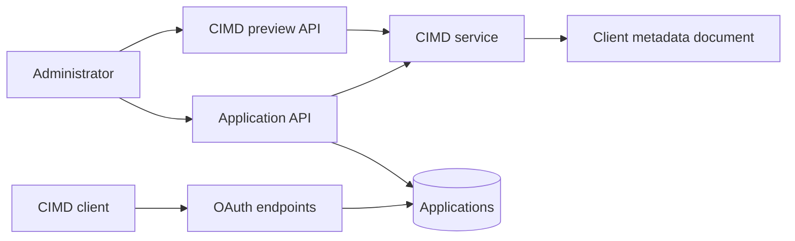
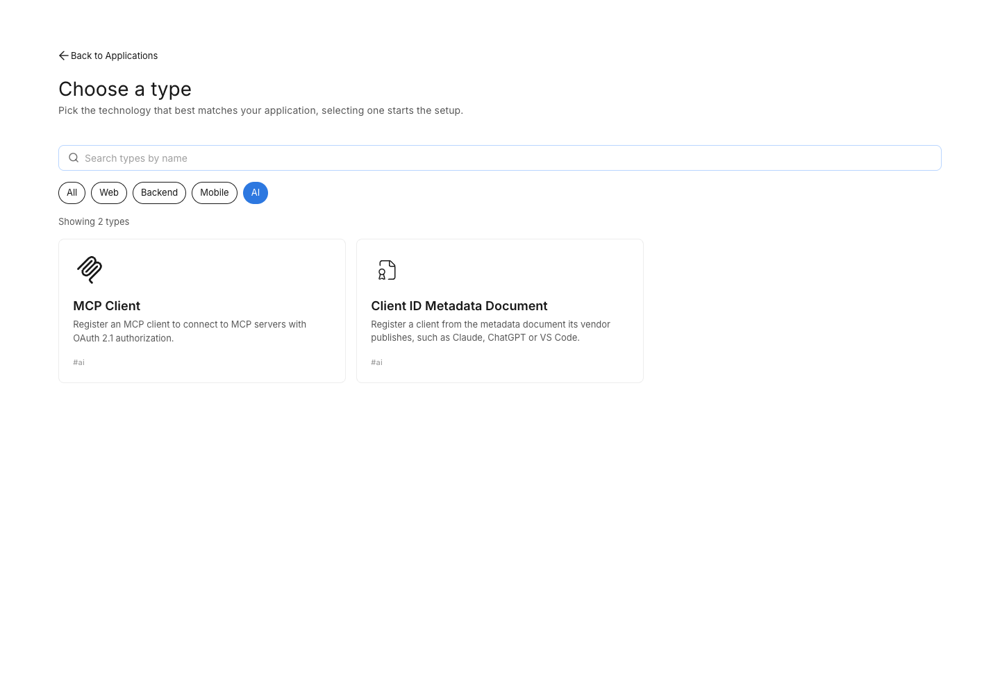
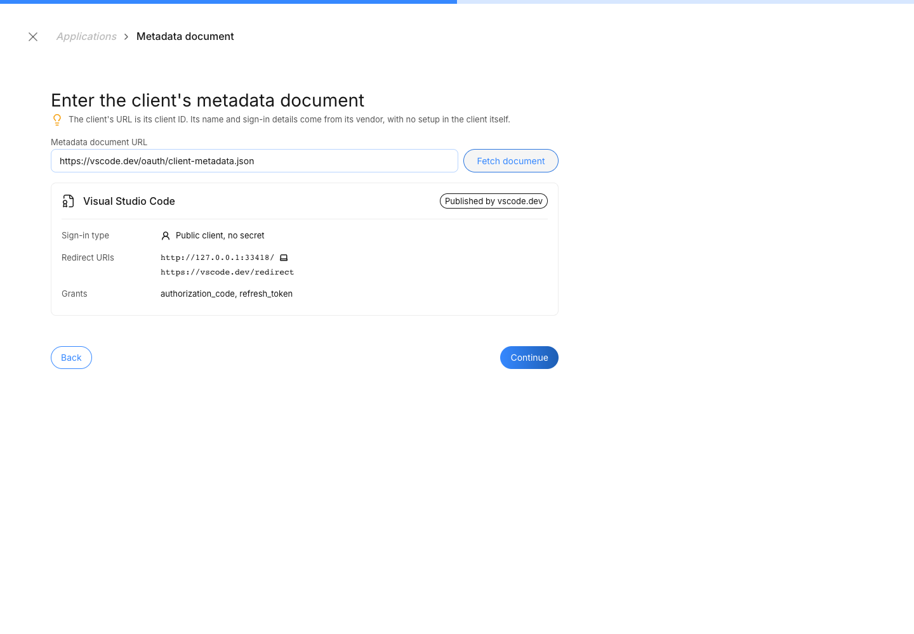
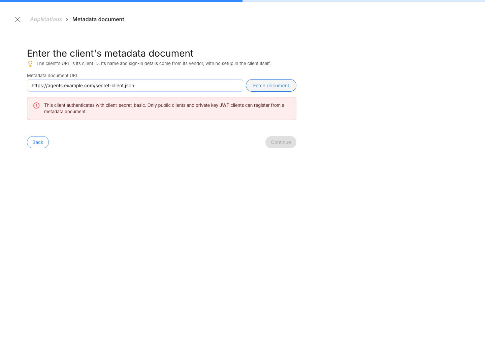
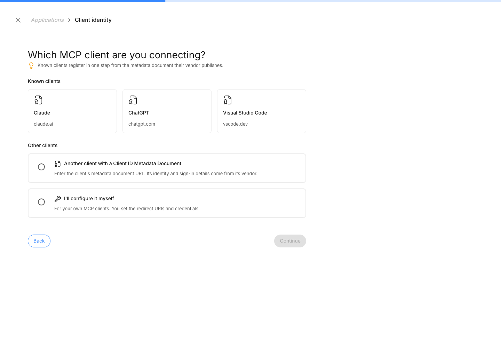
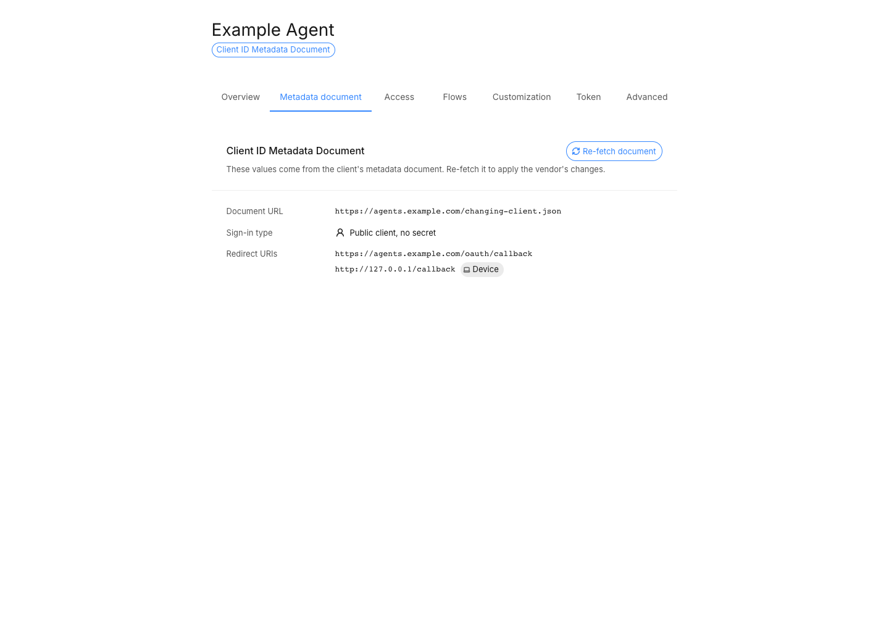
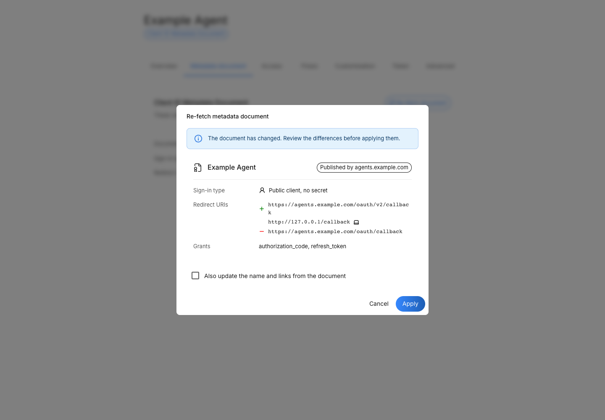

# CIMD Client Registration Specification

- **Status:** Draft
- **Version:** 0.1
- **Related documents:** [MCP authorization specification 2025-11-25](https://modelcontextprotocol.io/specification/2025-11-25/basic/authorization), [OAuth Client ID Metadata Document](https://datatracker.ietf.org/doc/draft-ietf-oauth-client-id-metadata-document/)

## Summary

Clients such as Claude, Claude Code, VS Code and ChatGPT identify themselves with a Client ID Metadata Document (CIMD): their `client_id` is an HTTPS URL on the vendor's domain that serves the client's metadata. The MCP authorization specification recommends CIMD over Dynamic Client Registration (DCR), which gives every install an anonymous client and gives administrators no way to allow one app and refuse another.

ThunderID treats CIMD as a way to register an ordinary application. An administrator enters the Client Identifier URL, reviews what the document declares, and confirms. ThunderID stores an application whose `client_id` is that URL, with the redirect URIs, authentication method and key source taken from the document. From then on the client signs in as any other application does. Registration is offered in two places: a CIMD template for any client, and an option inside the MCP Client template. For agents, CIMD registration will come with agent templates, reusing the same preview and document rules.

ThunderID retrieves a document only when an administrator previews one. Creating or updating the application takes the values the administrator reviewed, so what is approved is exactly what is stored. Public clients (`none`) and confidential clients (`private_key_jwt`, handled as DCR handles them) are supported. Redirect URIs match exactly, as for any application. Out of scope are clients that authenticate with a secret, an enterprise's own clients, which it registers as normal applications, and native clients that rely on an ephemeral loopback port, such as Claude Code. Open registration, where ThunderID registers an unregistered CIMD client the first time it authorizes so that a public MCP server can accept any client, is future work.

## Architecture



- The **CIMD service** owns preview: it validates the URL, retrieves and validates the document, and returns the values to store. It also holds the document rules, which the Application Service applies to the values submitted when a CIMD application is created or updated. It depends on neither applications nor agents, so agent registration can reuse it.
- Only preview retrieves a document. Create and update never do. The Console never fetches a document itself, because vendors do not send CORS headers for these documents.
- The OAuth endpoints resolve a CIMD client as a registered application by its `client_id`, with no CIMD-specific lookup. A Client Identifier URL that no application holds is an unknown client.

## Detailed design

### Registration

- **Preview** is the only operation that retrieves a document. It validates the document and returns the values in the mapping below: what the administrator reviews, and what create stores. It stores nothing.
- **Create** is the application create operation. It takes the reviewed values with the `clientIdMetadataDocument` marker, applies the document rules to them, and retrieves nothing. What the administrator approved is therefore exactly what is stored, even if the publisher serves a different document afterwards.
- **Known client** registration, offered by the MCP Client template, runs preview and create in one action. Choosing a listed client is the administrator's approval: the Console previews its document and creates the application with the returned values, named from the document, with no further steps. The application page then shows the stored values.
- **Re-fetch** is a preview of the application's URL followed by an application update with the reviewed values. The Console shows what would change before the administrator applies it, and copies the presentation fields only on request.
- There is no single operation that creates an application from a URL alone. API callers preview, then create with the returned values, as the Console does.
- The CIMD marker and `client_id` are fixed at creation. Everything else is edited as for any application.
- Declarative resources carry the stored values, so loading them retrieves nothing.

Create and update check the submitted values, not the live document. ThunderID therefore guarantees that a CIMD application's values satisfy the document rules and were supplied by an administrator, not that they match what the publisher serves at that moment.

The two entry points differ only in the application type they store:

| Entry point | For | Stored type |
| --- | --- | --- |
| CIMD template | Any client that publishes a document | `custom`, as for a DCR registration, since a document can describe any client |
| MCP Client template, a known client or "Another client with a CIMD" | MCP clients | `mcp` |

Each template can list known clients in its template data, as `metadataDocumentClients` entries with a `name` and a `clientId`. The `name` is the client's own name, as its document's `client_name` gives it, not the vendor's product family. Like other template data, the list ships with the Console, and adding a client is a change to the template:

```json
{
  "id": "mcp-client",
  "metadataDocumentClients": [
    {"name": "Claude", "clientId": "https://claude.ai/oauth/mcp-oauth-client-metadata"},
    {"name": "ChatGPT", "clientId": "https://chatgpt.com/oauth/client.json"},
    {"name": "Visual Studio Code", "clientId": "https://vscode.dev/oauth/client-metadata.json"}
  ]
}
```

The MCP Client template lists the known MCP clients above and shows them as tiles. The CIMD template lists none. Choosing a known client does not bypass validation: ThunderID still retrieves and validates its document, and a failure is shown on the step with nothing created. Listing a client does not make ThunderID trust it.

### Mapping from the document

| CIMD field | ThunderID value | Rule |
| --- | --- | --- |
| `client_id` | `oauth2.clientId` | Equals the document URL, stored byte for byte |
| `redirect_uris` | `oauth2.redirectUris` | Copied. See the document rules |
| `token_endpoint_auth_method` | `oauth2.tokenEndpointAuthMethod`, `oauth2.publicClient` | `none` is public, `private_key_jwt` is confidential |
| `jwks_uri` or `jwks` | `oauth2.certificate` (`JWKS_URI` or `JWKS`) | `private_key_jwt` only, stored as DCR stores it |
| `grant_types` | `oauth2.grantTypes` | Narrowed, never widened: the document's grants intersected with `authorization_code` and `refresh_token`. Absent means `authorization_code` |
| `response_types` | `oauth2.responseTypes` | Always `code` |
| `client_name`, `client_uri`, `tos_uri`, `policy_uri`, `contacts` | `name`, `url`, `tosUri`, `policyUri`, `contacts` | Editable defaults. The name falls back to the URL's host |
| `logo_uri`, scopes, token settings, other fields | None | Ignored |

ThunderID also sets `pkceRequired: true` and the `clientIdMetadataDocument` marker. Client secrets are never permitted. Scopes, the login flow, allowed user types and token settings are set by the administrator, as for any application.

### Document rules

These rules apply to a document at preview, and to the submitted values when a CIMD application is created or updated. A document, or a set of values, is accepted only when:

- its `client_id` equals the URL it was retrieved from;
- it lists at least one redirect URI, and each is either `https` on the same origin as the Client Identifier URL, or `http` on `localhost`, `127.0.0.1` or `[::1]`;
- `token_endpoint_auth_method` is `none`, or is `private_key_jwt` with exactly one of `jwks_uri` or `jwks`. An absent method means `client_secret_basic`, as in RFC 7591, and is rejected;
- it declares no `client_secret`;
- its grants include `authorization_code`, and the values stored hold no grant other than `authorization_code` and `refresh_token`.

The Client Identifier URL must be an `https` URL with a DNS host and a path, with no user information, fragment or dot segments, and at most 2048 bytes. A `client_id` in an OAuth request must match the registered value byte for byte.

Retrieval uses HTTPS, follows no redirects, applies the fixed time and size limits, and refuses loopback, link-local and private addresses, checked on the address actually connected to. It uses the same protection as ThunderID's other server-side fetches.

The MCP authorization specification says an authorization server SHOULD fetch the document when it sees a URL-formatted `client_id`. ThunderID deliberately fetches only at preview, so authorization does not depend on the vendor's site and document changes take effect only after an administrator reviews them.

### Runtime behavior

- **Redirect URIs** match as they do for any application: exactly, or by pattern when the deployment enables `oauth.allow_wildcard_redirect_uri`. CIMD adds no matching rule of its own. A native client that declares a port-less loopback redirect URI but binds an ephemeral port, as Claude Code does, therefore cannot sign in. Wildcard patterns do not cover it either: they apply to host labels and paths, not the port, and a CIMD application's redirect URIs come from its document. Supporting such clients is future work, through port-agnostic loopback matching (RFC 8252, section 7.3) or port wildcards.
- **Confidential clients** authenticate through the existing `private_key_jwt` client authentication, exactly as a DCR client with the same key source. Keys at a JWKS URI are retrieved at the token endpoint, because vendors rotate them, under the same address restriction as document retrieval.
- **Refresh tokens** follow the deployment's refresh token settings, as for any application. The defaults rotate them and revoke the presented one, which is what the MCP authorization specification requires for public clients.
- **Consent** shows the application name, the Client Identifier URL host and the redirect URI host, and warns when the redirect URI is a loopback address, because any local program can claim to be a loopback client.

### Data model

- The OAuth configuration in `OAUTH_INBOUND_PROFILE.OAUTH_CONFIG` gains a `clientIdMetadataDocument` flag.
- `CERTIFICATE.REF_ID`, which holds the `client_id` of an OAuth application certificate, is widened from `VARCHAR(36)` to `VARCHAR(2048)` in the PostgreSQL and SQLite config database scripts. Existing PostgreSQL deployments run `ALTER TABLE "CERTIFICATE" ALTER COLUMN REF_ID TYPE VARCHAR(2048);`.

### API

The application API's `oauth2` configuration gains `clientIdMetadataDocument`. When it is `true`, `clientId` must be a Client Identifier URL, the other values are those returned by preview, and they must satisfy the document rules. `clientSecret` must be omitted.

```json
{
  "name": "ChatGPT",
  "type": "mcp",
  "template": "mcp-client",
  "inboundAuthConfig": [
    {
      "type": "oauth2",
      "config": {
        "clientId": "https://chatgpt.com/oauth/client.json",
        "clientIdMetadataDocument": true,
        "redirectUris": ["https://chatgpt.com/connector_platform_oauth_redirect"],
        "tokenEndpointAuthMethod": "private_key_jwt",
        "certificate": {"type": "JWKS_URI", "value": "https://chatgpt.com/oauth/jwks.json"},
        "grantTypes": ["authorization_code", "refresh_token"],
        "responseTypes": ["code"],
        "pkceRequired": true
      }
    }
  ]
}
```

One operation is added, outside the application API so that agent registration can use it later. It requires the system permission, as the application API does:

| Operation | Purpose |
| --- | --- |
| `POST /cimd/preview` with `{ "clientId": "<url>" }` | Retrieve and validate a document, and return the values to store |

The response carries the values in the shape of the fields a create request takes: `name`, `url`, `tosUri`, `policyUri`, `contacts` and `inboundAuthConfig`. The caller copies them into an application create request, and later an agent one.

Errors use `CIMD-` codes, one for each rule, so the Console can say which rule failed. Preview returns `400` for an invalid URL, an unreachable or invalid document, a rule violation, or disabled CIMD. Create and update return `400` with the same codes when the submitted values break a document rule or CIMD is disabled, and `400` when another application already holds the Client Identifier URL, as for any application.

### UI

**Template picker.** A CIMD template sits beside MCP Client.



**Registration from the template.** The first step takes the document URL. ThunderID shows what the document declares, and marks redirect URIs that return to the user's device. The Details step starts from the document's name.



A rejected document shows the rule it broke, next to the URL.



**Registration from MCP Client.** The template's first step asks which MCP client is being connected. Known clients come first, as tiles: choosing one registers it straight away. Below them, "Another client with a CIMD" shows the same URL form and preview as the standalone template, followed by the Details step, and "I'll configure it myself" keeps the existing flow. The Client type step is skipped for both metadata document paths.



**Application details.** The values taken from the document are read-only: a Metadata document tab for the standalone template, and the Connect tab for an MCP client. The Credentials tab and the redirect URI editor are hidden.



**Re-fetch.** Re-fetching previews the application's URL and shows which redirect URIs would be added or removed, and any change to the authentication method. Applying the change updates the application with the values shown.



**Consent.** The consent screen in Gate adds the client and redirect hosts, and the device warning:

```text
+--------------------------------------------------------------+
| Visual Studio Code wants to access your account              |
| Published by vscode.dev. Returns to 127.0.0.1.               |
| ! This app runs on your device.                              |
|                                      [ Deny ]  [ Allow ]     |
+--------------------------------------------------------------+
```

### Configuration

`oauth.cimd.enabled`, deployment-level, defaults to `true`. When it is `false`, preview is rejected, create and update of CIMD applications are rejected, and CIMD applications cannot authorize or refresh.

Retrieval limits are fixed rather than configurable: 5 seconds, 5 KB as the CIMD draft recommends, and the `application/json` media type.

When CIMD is enabled, discovery publishes `client_id_metadata_document_supported: true`.

## Requirements

### R1. Register a CIMD client

**Requirement:** An administrator can register a CIMD client from its Client Identifier URL after reviewing what its document declares, from either entry point.

**Acceptance criteria:**

- **AC1.1:** Given a URL that serves a valid document, when an administrator previews it, then ThunderID returns the values to store and stores nothing.
- **AC1.2:** Given the preview of a valid `none` document, when an administrator creates a client with the returned values from the CIMD template, then ThunderID stores a public `custom` application with those values; and from the MCP Client template, a public `mcp` application.
- **AC1.3:** Given the preview of a valid `private_key_jwt` document with a `jwks_uri`, when an administrator creates a CIMD application with the returned values, then ThunderID stores a confidential application with a JWKS URI certificate.
- **AC1.4:** Given a document that declares `authorization_code`, `refresh_token` and `urn:ietf:params:oauth:grant-type:device_code`, when an administrator previews it, then the returned grants are `authorization_code` and `refresh_token`.
- **AC1.5:** Given a document that breaks a document rule or cannot be retrieved, when an administrator previews it, then ThunderID rejects it with the rule that failed.
- **AC1.6:** Given a create or update of a CIMD application whose submitted values break a document rule, when it is submitted, then ThunderID rejects it with `400` and stores nothing.
- **AC1.7:** Given a publisher that serves a different document after the preview, when the administrator creates or updates the application with the reviewed values, then ThunderID stores the reviewed values and retrieves nothing.
- **AC1.8:** Given a changed document, when an administrator re-fetches and applies the change, then the application takes the redirect URIs, authentication method, grants and key source shown in the preview.
- **AC1.9:** Given CIMD is disabled, when an administrator previews, or creates or updates a CIMD application, then ThunderID rejects it without retrieving a document.
- **AC1.10:** Given the MCP Client template lists a client in `metadataDocumentClients`, when an administrator chooses it, then ThunderID previews its document and creates the application with the returned values and the document's name, with no further steps; given its document fails validation, then the failure is shown and nothing is created; and given a template that lists none, no known clients are shown.

### R2. Authorize a registered CIMD client

**Requirement:** A user can authorize a registered CIMD client with no document retrieval at runtime.

**Acceptance criteria:**

- **AC2.1:** Given a registered CIMD application, when its client authorizes with a stored redirect URI, then ThunderID completes the flow without retrieving the document.
- **AC2.2:** Given a Client Identifier URL that no application holds, or one that differs from a registered URL by any byte, when it is submitted as a `client_id`, then ThunderID rejects it as an unknown client.
- **AC2.3:** Given a stored `http://localhost/callback`, when the client requests `http://localhost:3118/callback`, then it is rejected, as for any application.
- **AC2.4:** Given consent is shown for a loopback redirect URI, then it shows the client host, the redirect host and the device warning.

### R3. Authenticate and refresh

**Requirement:** A CIMD client authenticates as its document declared and stays signed in safely.

**Acceptance criteria:**

- **AC3.1:** Given a confidential CIMD application, when a token request carries a valid client assertion signed with a key from its JWKS URI, then ThunderID authenticates it; and without a valid assertion, ThunderID rejects it.
- **AC3.2:** Given a public CIMD application and the default refresh token settings, when a refresh token is used, then ThunderID issues a new one and revokes the presented one.
- **AC3.3:** Given a CIMD application is deleted or CIMD is disabled, when a refresh token is presented, then ThunderID rejects it.

### R4. Restrict retrieval

**Requirement:** Retrieval never reaches an address the deployment did not intend to expose.

**Acceptance criteria:**

- **AC4.1:** Given a document or JWKS URI whose host resolves, on any lookup, to a loopback, link-local or private address, when ThunderID retrieves it, then the connection is refused and the error does not disclose the address.

## Change log

| Version | Date | Change |
|---|---|---|
| 0.1 | 2026-09-28 | Initial specification. |
