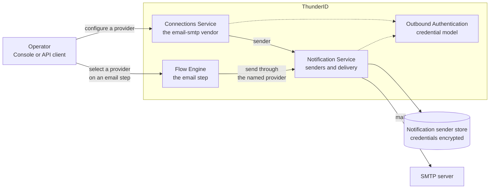

# Email Provider Configuration Specification

- **Status:** Draft
- **Version:** 0.1
- **Related documents:** [Design discussion #3277](https://github.com/thunder-id/thunderid/discussions/3277), [Feature issue #5415](https://github.com/thunder-id/thunderid/issues/5415), [Feature issue #3276](https://github.com/thunder-id/thunderid/issues/3276)

## Summary

ThunderID sends email for account recovery, user invitation, magic link, and email OTP steps. It configured the mail server that carries them in a single `email.smtp` block in `deployment.yaml`. That block described one server for the whole deployment, was read once at startup, and kept its password in plaintext in a configuration file. A deployment could not send different mail through different servers, could not change a server without a restart, and could not keep its SMTP credential out of the file system.

This specification replaces that block with an **email provider**, a stored connection managed at runtime through the connections API and the Console, whose credential is encrypted at rest and masked on read. Each email step in a flow names the provider it sends through.

Email providers reuse the notification sender store that already backs SMS providers, and the connections API that already exposes them. One provider type ships, an SMTP server, under the vendor name `email-smtp`. The vendor carries the channel in its name because the protocol alone does not identify the contract, since a carrier gateway that turns email into SMS speaks the same SMTP to a different channel.

Credentials for an outbound call are modelled separately from the transport that carries them. An outbound authentication package that stays neutral about the transport owns the authentication methods, their fields, and their validation, and serves those descriptors to a console so a method added later renders without a Console change. A binding per transport turns a resolved configuration into whatever that transport needs.

Removing the deployment block is a breaking change with no automatic migration. A deployment must create a provider, select it on every flow that sends email, and remove the block before upgrading, because the server refuses to start while the block is still present.

## Architecture

An email provider is configured on one path and used on another. The connections service owns how a provider is configured. The notification service owns how it is stored and how mail is delivered through it. The outbound authentication model owns everything about the credential, on both paths.

### Component responsibilities

| Component | Responsibility |
|---|---|
| Connections service | Own the configuration contract. It exposes the `email-smtp` vendor, maps its payload onto a sender and back, scopes every lookup to email senders, and describes the vendor's configurable options to a console. |
| Outbound authentication | Own the credential. It decides which methods exist, which fields each one takes, which values are secret, and how a configuration is validated, stored, and bound to a transport. |
| Notification service | Own the sender. It validates one on write, stores it, reports what references it, and resolves and dispatches through it at send time. |
| Flow engine | Name the provider an email step sends through, and turn a dispatch failure into a flow outcome. |
| Console | Render the provider form and the authentication section the server describes, and select a provider on an email step. |

The two paths meet only at the sender. The connections service never talks to a mail server, and the notification service never learns what a connection vendor is. Their only shared vocabulary is the sender and its property bag. The credential model is a dependency of both rather than a stage in either, because the same descriptors decide how a credential is validated on the configuration path and how it is presented on the delivery path.

Nothing in the architecture is new except the vendor and the credential model. Email providers are stored, listed, exported, and referenced through the paths the SMS providers already take.

### Why the credential model is its own package

`outboundauth` is the outbound counterpart to the inbound request authentication ThunderID already has. It stays neutral about the transport, and each binding lives in its own leaf subpackage that imports it and nothing else.

Binding shapes differ on purpose. `smtpauth` returns an `smtp.Auth`, a binding for HTTP would mutate a request, and a binding for client certificates would return a TLS certificate. A new transport brings its own signature rather than being forced through a common one.

Outbound transport hardening that is not authentication, such as the trust store, the TLS minimum version, egress proxying, and SSRF policy, stays out of the package.

## Detailed design

### Email providers as connections

An email provider is a notification sender of type `email` and provider `smtp`, surfaced through the connections API as the vendor `email-smtp`. No new table, service, or lifecycle is introduced. Creation, update, deletion, listing, usages, and declarative import all follow the paths the SMS vendors already take.

| Concern | Behavior |
|---|---|
| Vendor name | `email-smtp`, in the route, the flat list `type`, and the declarative document. |
| Stored provider | `smtp`. The vendor name exists for presentation alone. |
| Category | `email-provider`, alongside `identity-provider` and `sms-provider`. |
| Supported channel | `email`. Applied as the default on write, and rejected if set to anything else. |
| Scoping | Every read, update, delete, and usages lookup matches on sender type **and** provider, so an email route cannot reach an SMS sender and a mismatch reports not found. |

The client factory dispatches on the sender type before the provider name, so a provider name can never resolve to a client of the wrong channel. A resolved client is asserted to the channel interface the caller wants, so a sender that is not an email client is refused rather than dispatched to.

### Outbound authentication

#### Descriptors as the single source of truth

A method descriptor declares the method's discriminator, its console label, and its credential fields in render order. A field descriptor declares the property key its value is stored under, whether a value is required, whether the value is a secret, an optional enumeration or pattern, and the console label.

Adding a method means adding a descriptor. No other code enumerates methods or field names. Storage, validation, masking, declarative export, and the console form all derive from the table. The table is fixed at compile time, because there is no plugin system in the product and runtime registration would make the supported set depend on initialization order.

| Method | Fields | Notes |
|---|---|---|
| `none` | none | Sends no credentials. The default when the block is omitted. |
| `basic` | `username`, `password` (credential) | SMTP `AUTH PLAIN`. |

Field values are strings. A method needing a list encodes it in one value delimited by spaces, as OAuth scopes already are.

#### Storage

Authentication values live in the consumer's flat property bag under the reserved prefix `authentication_`. The prefix is deliberately longer than `auth_`, because the Twilio sender already stores a transport secret named `auth_token` that a shorter prefix would silently claim.

`authentication_type` is written even for `none`, so a reader can tell "authenticates nothing" from "was configured before outbound authentication existed". A field the resolved method does not declare is dropped rather than stored, which guarantees nothing reaches storage unencrypted by being named something the descriptors do not know. A secret is stored exactly as given, and every other value is trimmed. A blank value is skipped, matching how the sender services treat a missing property.

Consumers skip keys the package owns when walking their own properties, so a parser that warns about an unrecognized property does not warn about a field it has no reason to know.

#### Validation

Validation checks a configuration against its descriptor and against the set of methods the caller supports. It requires a known and permitted type, a value that is not blank for every required field, values within any declared enumeration or pattern, and no field the method does not declare. A method may then run rules the descriptors cannot express.

Policy that depends on the transport belongs to the caller. SMTP refusing to carry credentials over a plaintext connection is such a rule, and lives with the SMTP validation rather than in the model.

An unrecognized stored type is surfaced verbatim rather than downgraded to `none`, so validation rejects it with a descriptive message instead of silently authenticating with nothing.

#### Credential lifecycle

A credential field can be written but never read back. It is encrypted on construction, returned masked as `******`, and may be omitted on update to keep the stored value.

Carrying a stored credential over is conditional on the authentication type being unchanged. Changing the method, or setting it to `none`, discards the previous method's stored credential, so a later switch back cannot silently reuse a value the operator did not enter again. The type property is never secret, so the comparison needs no decryption.

### SMTP provider configuration

| Field | Required | Contract |
|---|---|---|
| `host` | Yes | Hostname of the SMTP server. |
| `port` | Yes | Integer in 1 to 65535. |
| `fromAddress` | Yes | Bare address used in the `From` header and as the SMTP envelope sender. A form carrying a display name is rejected. |
| `fromName` | No | Display name shown beside the address. Must not contain a line break. |
| `tls` | No | `none`, `starttls`, or `implicit`. Defaults to `starttls`. |
| `authentication` | No | An outbound authentication object. Omitting it means `none`, on update as much as on create. |

Port and TLS mode are typed at the API boundary even though the store holds every property as a string, because the conversion belongs there rather than in the public contract. Credentials are the deliberate exception. They travel in a discriminated object whose properties vary per method, which is what lets a new method ship without a schema change.

Every value is validated when the provider is written, not when an email is sent, so a malformed provider is rejected at configuration time rather than during a password reset. The client parses and validates the stored values again when it is constructed, and anything rejected there is a stored value that no longer parses.

Validation reads the supplied values alone. It does not resolve the host, open a connection, present the certificate chain, or try the credential, because a connect or send test is out of scope. A provider whose values are all well formed can therefore still fail against an unreachable server, an untrusted certificate, or a credential the server rejects, and that failure surfaces on the first dispatch.

#### Transport security

| Mode | Behavior |
|---|---|
| `starttls` | Connects in plaintext and upgrades with `STARTTLS`. If the server does not advertise the extension, the send fails. There is no plaintext fallback. |
| `implicit` | Dials TLS directly (SMTPS). |
| `none` | Sends in the clear. |

Both TLS paths require TLS 1.2 or later and verify the server certificate against the system trust store with the configured host as the server name.

An enabled authentication method cannot be combined with a transport security of `none`. The rule is enforced both when the provider is written and when the client is constructed, because a credential must never travel in the clear.

An omitted `tls` resolves to the secure default rather than to plaintext. An invalid value is stored as given so that validation rejects it with a descriptive error instead of coercing it.

### Message construction and delivery

The client builds an RFC 5322 message with `From`, `To`, optional `Cc`, `Subject`, `Date`, `Message-ID`, `MIME-Version`, and a `text/html` or `text/plain` content type in UTF-8.

| Concern | Behavior |
|---|---|
| `From` header | The bare address when no display name is set. Otherwise the address rendered with its name, quoted and MIME encoded where needed, so a name carrying a comma, a quote, or characters outside ASCII still renders as one valid address. |
| Envelope sender | Always the bare from address, whatever the display name, so SPF and DMARC alignment are unaffected by setting a name. |
| `Subject` | Encoded with MIME Q encoding. |
| `Message-ID` | Random, with the from address' domain as its domain part, because receivers score messages without one as more likely to be spam. |
| BCC | Carried in the envelope only and never written as a header. |

#### Header injection

A value carrying a carriage return or line feed would end its header and let the rest be read as headers of its own, which is how a configured display name turns into an injected `Bcc`. Three checks close that gap.

- An address must parse as a bare address and must not contain CR or LF. The check runs before trimming, so the characters cannot be trimmed away.
- A subject carrying CR or LF is rejected.
- A display name carrying CR or LF is rejected, at write time and again at client construction.

A payload is also rejected when it has no recipient after trimming.

#### Connection handling

`net/smtp` sets no deadlines of its own, so a server that accepts the connection and then stalls would block the calling goroutine indefinitely. Two bounds apply. A dial timeout covers the TCP connection and, for implicit TLS, the handshake, and a session deadline covers the whole conversation after the dial.

| Stage | Bound |
|---|---|
| Dial | 30 seconds |
| Session | 60 seconds |

A failed `QUIT` does not fail the send, because the server has already accepted the data. The connection is closed by force when the graceful close did not succeed.

The authenticator is built once per client rather than per send, so a method that has to acquire and cache a token has somewhere to keep it.

### Provider selection in flows

The email executor gains a `senderId` node property naming the provider that step sends through. There is no default for the whole deployment to fall back to, so a dispatch that names no provider is refused.

The property is declared as supported but **not** required. The shipped default flows declare their email steps before any provider can exist, so marking it required would make a fresh installation's own recovery and invite flows fail their own declaration check. The server enforces the requirement at execution instead.

| Dispatch outcome | Flow result |
|---|---|
| Empty `senderId`, or a sender that does not resolve | A flow failure carrying "email provider not configured", recording that no email was sent. |
| Any other dispatch failure | A flow failure carrying "email send failed", with the failure logged for diagnosis. |
| Success | The step continues, recording that the email was sent. |

A missing or unnamed provider is a configuration problem the flow can surface to the caller. Every other failure is a delivery problem that is logged rather than described to the caller.

### Declarative configuration

A connection document gains the SMTP fields and a shared `authentication` block carrying the same shape of discriminator and properties that the REST API carries, so a declarative document and an API payload read the same and take the same mapping path.

Each secret field of the authentication block is externalized to a template variable whose path is derived from the method's descriptor rather than hardcoded, which is what keeps a new method from needing a change to the exporter. A field with an empty value is left out rather than exported as a blank variable, matching how an unset vendor secret is treated.

### Removal of the deployment SMTP configuration

The `email.smtp` block, its startup seeding path, the `system/email` package, and the Helm values that rendered the block and injected the SMTP password secret are removed. Nothing reads the block's contents, and nothing migrates it.

This is a breaking change. A deployment that has upgraded and configured no provider sends no email, and every feature that depends on email stops working. Email OTP, magic link, password recovery, and user invitation all fail.

#### Upgrade diagnostic

The configuration loader rejects unknown fields, so removing the block from the configuration model turns a leftover `email` block into a startup failure that names the unrecognized field. A deployment that upgrades without migrating does not start with email quietly broken. It does not start at all.

That is deliberate. Ignoring the block would let a deployment come up healthy and fail only later, when a user was already waiting on a recovery mail, and the operator would have no signal tying the failure to the upgrade.

The error names the field rather than the remedy, so the remedy belongs in the documentation. Every document that instructs an operator to configure the block is rewritten around creating a provider and selecting it on each email step: the deployment configuration reference, the Kubernetes deployment path, the SMTP server guide, the Helm chart README and its values, and the account recovery walkthrough.

| Removed deployment property | Provider field |
|---|---|
| `host` | Host |
| `port` | Port |
| `from_address` | From address |
| `username` | The `basic` method's `username` |
| `password` | The `basic` method's `password` |
| `enable_start_tls` set to `true` | Transport security `starttls` |
| `enable_start_tls` set to `false` | Transport security `none` |
| `enable_authentication` set to `true` | Authentication method `basic`, which requires both `username` and `password` |
| `enable_authentication` set to `false` | Authentication method `none`, carrying neither legacy credential |

A block with a host but no username becomes a provider that sends no credentials, rather than one that claims to authenticate with nothing to present. Implicit TLS and the display name have no equivalent in the removed block.

One legacy combination has no direct equivalent. A block with `enable_authentication` set to `true` and `enable_start_tls` set to `false` maps to a credential over a plaintext transport, which AC2.4 refuses. Such a deployment resolves it before it creates the provider, either by enabling TLS on the mail server and choosing `starttls` or `implicit`, or by dropping the credential and choosing authentication `none`.

The migration is to create a provider from the existing settings, select it on every flow with an email step, and then remove the block and the Helm values.

### Data model

No schema change. An email provider is a row in the existing notification sender store, with type `email` and provider `smtp`.

| Property key | Secret | Contract |
|---|---|---|
| `host` | No | Hostname. |
| `port` | No | Port, stored as a decimal string. A zero or absent port is stored as no property rather than as port 0, so validation reports it as missing. |
| `from_address` | No | Bare address. |
| `from_name` | No | Display name. Absent when blank, so clearing it on update drops the property. |
| `tls` | No | Resolved mode, or the supplied value when it does not parse. |
| `supported_channels` | No | `email`. Defaulted on write. |
| `authentication_type` | No | Method discriminator, written even for `none`. |
| `authentication_<field>` | Per descriptor | One key per declared field of the resolved method. |

Secret properties are encrypted on construction and decrypted only on the delivery path. The read path rebuilds the response from the value map that is already masked rather than decrypting again, so a secret cannot be read back in plain text through the API.

### API

#### Vendor metadata

`GET /connections/meta?vendor={vendor}` returns the description of a vendor's configurable options that the server supplies. Only authentication is described today, namely the methods the vendor supports, in the order a console should offer them, and the fields each one takes.

The endpoint takes the vendor as a query parameter rather than living at `/connections/{vendor}/meta`, which would need registering per vendor and would shadow an instance whose identifier is literally `meta`. An unregistered vendor is a client error. A registered vendor with no configurable choice, such as Twilio, reports an empty method list.

Each method's fields are an ordered array rather than a keyed object, because a JSON object's keys are serialized in sorted order, which would put a password above the username it belongs under with no way for the server to express render order.

The supported set is read from the same constant the sender validation reads, so the API cannot advertise a method the server would reject.

#### Provider endpoints

| Endpoint | Behavior |
|---|---|
| `GET /connections?category=email-provider` | List email provider instances in the flat connection list. |
| `POST /connections/email-smtp` | Create a provider. |
| `GET /connections/email-smtp/{id}` | Read a provider with its credentials masked. |
| `PUT /connections/email-smtp/{id}` | Replace a provider. An omitted credential field keeps the stored value while the method is unchanged. An omitted `authentication` object resolves to `none` and discards the stored credential. |
| `DELETE /connections/email-smtp/{id}` | Delete a provider. |
| `GET /connections/email-smtp/{id}/usages` | List the resources that reference the provider. |

Existing connections API authorization applies. A response always carries a concrete `authentication` object, so a console select always has a value to bind to.

A flow that references a provider reports its usage as restricting deletion, so the provider cannot be deleted while a flow still sends through it.

#### Errors

| Code | Condition |
|---|---|
| `CON-1004` | The `vendor` parameter does not name a registered connection vendor. |
| `CON-1005` | The payload names an authentication method this deployment does not implement. |
| `MNS-1017` | An email dispatch named no provider. |
| `FET-1038` | An email step ran without a usable provider. |

A payload naming an unimplemented method is the caller's mistake and is reported as a client error, distinct from a genuine failure to build a property, which is a server fault. Property validation failures are reported as an invalid request with the specific rule that failed.

### UI

#### Creating a provider

The custom connection wizard gains an **Email Provider (SMTP)** card. Its form carries Host, Port, From address, Sender name, and Transport security, followed by an Authentication section.

| Field | Console behavior |
|---|---|
| Host | Required text. |
| Port | Required number, defaulting to 587. Coerced to an integer in the payload rather than sent as a string. |
| From address | Required, validated against an address pattern. |
| Sender name | Optional. |
| Transport security | Select over STARTTLS, Implicit TLS (SMTPS), and None, defaulting to STARTTLS. |

#### Authentication section

The section is rendered entirely from the vendor metadata. Nothing in the Console enumerates methods or field names, so a method added on the server appears without a Console change. A vendor that advertises no methods renders no section, which is how a provider with a fixed vendor credential contract opts out.

Server supplied labels are either plain text or an i18n template pattern. A pattern whose key has no locale entry falls back to the raw field name, so a method the Console has no translation for is still identifiable rather than blank.

A credential field renders as a masked field. It is blanked when the stored value loads, stays locked until the operator chooses to replace it, and is omitted from the payload while blank. The mask exists only for display and is never sent back.

#### Selecting a provider on a flow step

The email executor's property panel gains an **Email Provider** select listing the configured providers. When exactly one provider exists, a new email step selects it automatically, matching how the SMS executor already behaves. With no providers configured, the select is disabled and a warning explains that a provider must be created first.

#### Flagging a step with no provider

An email step whose `senderId` is absent, blank, or still the unresolved template placeholder is flagged in flow validation.

It is a **warning**, not an error. The shipped default flows declare their email steps before any provider can exist, so erroring would flag a fresh installation's own recovery and invite flows and block them from being saved. The check covers both the absent property and the placeholder, because a plain rule that only requires a value would pass on the placeholder.

### Configuration

The feature removes configuration rather than adding it. There is no configuration section for email providers at deployment level or at runtime. A provider is a stored resource, created through the API, the Console, or a declarative document.

### Scope exclusions

This specification does not define the following.

- Email providers other than SMTP, such as a vendor HTTP API provider.
- A default provider for the whole deployment, or any fallback for a step that names none.
- Automatic migration of a removed `email.smtp` block.
- A connect or send test action on a provider.
- Outbound transport hardening that is not authentication, such as trust store configuration, egress proxying, or SSRF policy.
- Ownership of providers per organization.
- Delivery retries, queuing, or bounce handling.
- Describing anything but authentication through the vendor metadata endpoint.

## Requirements

### R1. Email providers managed at runtime

**Requirement:** An operator can configure the mail server ThunderID sends through at runtime, without a restart or a configuration file.

**Acceptance criteria:**

- **AC1.1:** Given an authorized operator, when a provider is created through the Console or the connections API, then it is stored and immediately usable without a restart.
- **AC1.2:** Given a stored provider, when it is listed by category or read by identifier, then it appears as an `email-smtp` connection in the `email-provider` category.
- **AC1.3:** Given a stored provider, when it is updated or deleted, then the change takes effect on the next dispatch without a restart.
- **AC1.4:** Given a provider a flow still references, when deletion is attempted, then the referencing resources are reported and the deletion is refused.

### R2. Credentials protected at rest and in transit

**Requirement:** A provider credential is never stored in the clear, returned to a caller, or sent over an unencrypted connection.

**Acceptance criteria:**

- **AC2.1:** Given a provider created with a credential, when it is read through any API path, then the credential is masked and never returned in plain text.
- **AC2.2:** Given a stored credential, when an update names the stored authentication method and omits the credential field, then the stored value is kept.
- **AC2.3:** Given a stored credential, when the update changes the authentication method, sets it to `none`, or omits the `authentication` object entirely, then the stored credential is discarded rather than carried over.
- **AC2.4:** Given an enabled authentication method and a transport security of `none`, when the provider is written, then it is rejected, and given the same combination already stored, when the client is constructed, then it is refused.
- **AC2.5:** Given a field the resolved method does not declare, when it is supplied, then it is not written to storage.

### R3. Transport security that does not silently degrade

**Requirement:** A provider connects under the transport security it declares, or fails.

**Acceptance criteria:**

- **AC3.1:** Given a transport security of `starttls` and a server that does not advertise the extension, when a send is attempted, then it fails rather than sending in plaintext.
- **AC3.2:** Given a transport security of `implicit`, when a send is attempted, then the connection is dialed over TLS with no upgrade step.
- **AC3.3:** Given either TLS mode, when the connection is established, then TLS 1.2 or later is required and the certificate is verified against the configured host.
- **AC3.4:** Given an omitted transport security value, when the provider is stored, then it resolves to `starttls` rather than to plaintext.
- **AC3.5:** Given an unrecognized transport security value, when the provider is written, then it is rejected with the permitted values named.

### R4. Configuration validated where it is configured

**Requirement:** A provider whose configured values are malformed is refused when it is configured, not when a user needs the email. Validation covers the supplied values alone and never reaches the mail server.

**Acceptance criteria:**

- **AC4.1:** Given a missing host, a port outside 1 to 65535, or a missing or malformed from address, when the provider is written, then it is rejected with the failing rule named.
- **AC4.2:** Given a from address that carries a display name, when the provider is written, then it is rejected.
- **AC4.3:** Given a supported channel other than `email`, when the provider is written, then it is rejected, and given no supported channel, then `email` is applied.
- **AC4.4:** Given an authentication method missing a required field, when the provider is written, then it is rejected naming the field.
- **AC4.5:** Given a stored provider whose values no longer parse, when its client is constructed, then construction fails rather than producing a client that cannot deliver.
- **AC4.6:** Given well formed values naming an unreachable server, an untrusted certificate, or a credential the server rejects, when the provider is written, then it is accepted, because configuration never contacts the server, and the failure is reported on the first dispatch instead.

### R5. No header injection through configured or rendered values

**Requirement:** No configured or rendered value can end a message header and start one of its own.

**Acceptance criteria:**

- **AC5.1:** Given a display name containing a carriage return or line feed, when the provider is written, then it is rejected.
- **AC5.2:** Given a recipient address containing a carriage return or line feed, when a send is attempted, then it is rejected before any header is built, including when the characters surround otherwise trimmable whitespace.
- **AC5.3:** Given a subject containing a carriage return or line feed, when a send is attempted, then it is rejected.
- **AC5.4:** Given a display name containing a comma, a quote, or characters outside ASCII, when the message is built, then the `From` header carries one valid quoted and encoded address.
- **AC5.5:** Given BCC recipients, when the message is built, then they appear in the envelope only and in no header.
- **AC5.6:** Given a payload with no recipient after trimming, when a send is attempted, then it is rejected.

### R6. Explicit provider selection per email step

**Requirement:** Every email step names the provider it sends through, with no fallback for the whole deployment.

**Acceptance criteria:**

- **AC6.1:** Given an email step with no `senderId`, when it runs, then the dispatch is refused and the step reports that no email provider is configured.
- **AC6.2:** Given an email step naming a provider that does not resolve, when it runs, then the step reports that no email provider is configured rather than a delivery failure.
- **AC6.3:** Given an email step naming a resolvable provider, when a dispatch fails for any other reason, then the step reports a send failure and the cause is logged.
- **AC6.4:** Given a shipped default flow with an unresolved provider placeholder, when the flow is loaded or saved, then the declaration is accepted and the executor still refuses the dispatch at execution.
- **AC6.5:** Given a `senderId` that is not a string, when the step runs, then it fails with the type mismatch reported rather than dispatching.

### R7. Channel isolation across senders

**Requirement:** A sender configured for one channel cannot be reached or dispatched through as another.

**Acceptance criteria:**

- **AC7.1:** Given an SMS sender's identifier, when it is requested through an email vendor endpoint, then it reports not found.
- **AC7.2:** Given an email sender's identifier, when a message dispatch resolves it, then it is refused as the wrong sender type.
- **AC7.3:** Given a sender whose type and provider do not pair, when a client is requested, then the factory refuses it rather than constructing a client of the other channel.

### R8. Authentication methods described by the server

**Requirement:** A console renders the authentication methods a deployment supports without being built against them.

**Acceptance criteria:**

- **AC8.1:** Given a registered vendor, when its metadata is requested, then the supported methods and their fields are returned in render order, with credential fields marked.
- **AC8.2:** Given an unregistered vendor, when metadata is requested, then it is a client error.
- **AC8.3:** Given a vendor whose credentials are a fixed contract, when its metadata is requested, then it reports an empty method list and the Console renders no authentication section.
- **AC8.4:** Given a method the Console has no translation for, when the form renders, then the raw field name is shown rather than a blank label.
- **AC8.5:** Given a payload naming a method the deployment does not implement, when it is submitted, then it is refused as a client error naming the metadata endpoint.
- **AC8.6:** Given a new authentication method added to the descriptor table, when a vendor supports it and the transport binding carries it, then it becomes storable, validatable against its descriptors, exportable, and renderable with no Console change and no schema change. The binding that presents it to a transport, and any rule the descriptors cannot express, are the method's own code.

### R9. Declarative parity

**Requirement:** A provider expressed as a declarative document behaves identically to one created through the API.

**Acceptance criteria:**

- **AC9.1:** Given a declarative connection document with SMTP fields and an authentication block, when it is imported, then it takes the same mapping and validation path as the equivalent API payload.
- **AC9.2:** Given a stored provider, when it is exported, then its SMTP fields and its authentication block are rendered and every populated credential field is externalized to a template variable.
- **AC9.3:** Given a credential field with no value, when the provider is exported, then no variable is emitted for it.

### R10. Deliberate migration off the deployment configuration

**Requirement:** A deployment upgrading past this change is told what broke and how to fix it, rather than silently losing email.

**Acceptance criteria:**

- **AC10.1:** Given a deployment still carrying an `email.smtp` block, when it starts, then startup fails naming the unrecognized `email` field, and no implicit provider is created from the block.
- **AC10.2:** Given a deployment with no provider, when a flow that depends on email runs, then the step reports that no email provider is configured.
- **AC10.3:** Given the removed block's properties, when they are mapped through the documented migration, then every property has an equivalent provider field, and a block with a host but no username becomes a provider that sends no credentials.
- **AC10.4:** Given a block with `enable_authentication` set to `true` and `enable_start_tls` set to `false`, when it is migrated, then the documentation names the two remedies rather than a provider field, because the combination is refused by AC2.4.
- **AC10.5:** Given a document that instructed an operator to configure `email.smtp`, when this change ships, then it instructs the operator to create a provider and select it on each email step instead.

## Change log

| Version | Date | Change |
|---|---|---|
| 0.1 | 2026-09-19 | Initial specification for email providers as connections, the outbound authentication model, SMTP delivery, provider selection per step, and the removal of the deployment SMTP configuration. |
