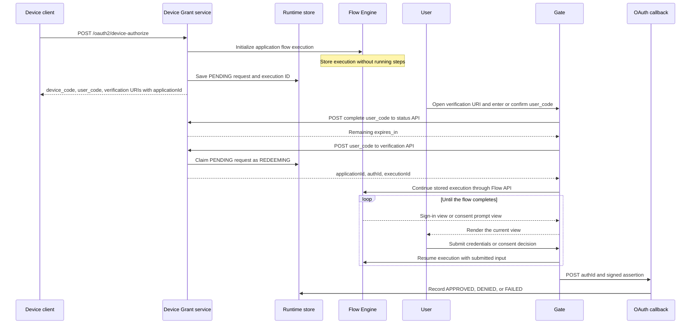
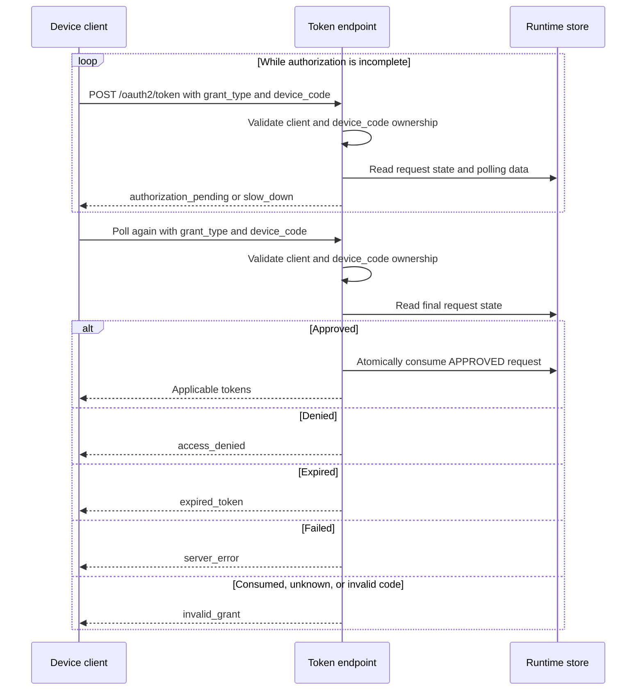

# OAuth 2.0 Device Authorization Grant Specification

- **Status:** Draft
- **Version:** 0.1
- **Related documents:**
  - [Discussion #5705](https://github.com/thunder-id/thunderid/discussions/5705)
  - [Feature issue #5156](https://github.com/thunder-id/thunderid/issues/5156)
  - [RFC 8628](https://www.rfc-editor.org/info/rfc8628/)

## Summary

Smart TVs, command-line tools, and other limited-input clients cannot conveniently complete a browser-based sign-in on the device itself. Device Authorization Grant lets the device start an OAuth request while the user signs in and approves it in a browser on another device.

ThunderID will add the Device Authorization Grant defined by RFC 8628. The device receives a `device_code`, a short `user_code`, and a verification URI, then polls the existing token endpoint. The governing design decision is to initialize an execution of the application's configured Authentication Flow when the device request is created, but run no flow steps until Gate has verified the user's code. Code entry belongs to Gate, outside the application flow. No separate Device Grant flow or device-code executor is required.

This specification covers request creation, user verification, authentication and approval, polling, token issuance, discovery, configuration, and the Gate user interface.

## Architecture

| Component | Responsibility |
| --- | --- |
| Device client | Requests codes, displays the verification URI and `user_code`, and polls with `device_code` |
| Device Grant service | Validates requests, manages codes and request state, and verifies user codes |
| Runtime store | Holds the short-lived request, code lookups, polling data, and flow execution ID |
| Flow Engine | Initializes the application's configured Authentication Flow and runs it after verification |
| Gate | Shows the code-entry page and countdown, calls the status, verification, and Flow APIs, and renders authentication and consent |
| OAuth callback | Validates the signed flow result and records the user's decision |
| Token endpoint | Enforces client ownership and polling rules, then issues tokens once after approval |

**User authorization**



After authentication, the user must explicitly approve or deny the device request. The application's configured Authentication Flow must include a User Consent step after authentication. If the flow completes without an explicit decision, the callback records the request as failed and must not approve it. An existing browser SSO session may satisfy authentication, but it does not approve the request.

**Device polling and token issuance**

The device polls independently while the browser journey is in progress.



The device never receives the browser's flow execution ID, and Gate never receives the secret `device_code`.

## Detailed design

### Device request and flow initialization

`POST /oauth2/device-authorize` accepts a form-encoded request. Public clients identify themselves with `client_id`. A confidential client must also authenticate. ThunderID checks that the client may use Device Grant, validates the requested scopes, and resolves an optional `resource` to one permitted resource server.

ThunderID generates a `device_code` from at least 32 cryptographically random bytes and an eight-letter `user_code`. ThunderID initializes the application's configured Authentication Flow with the Device Grant request ID, client, scopes, resource, expiry, and callback type in its context. Initialization stores an execution but runs no authentication step. The request record links that execution to both codes. If initialization or storage fails, the endpoint returns an error and does not return usable codes.

The response includes `device_code`, `user_code`, `verification_uri`, and `expires_in`. This design also returns `interval` and `verification_uri_complete`, which RFC 8628 defines as optional fields:

```json
{
  "device_code": "<device-code>",
  "user_code": "WDJB-MJHT",
  "verification_uri": "https://id.example.com/gate/device?applicationId=app-123",
  "verification_uri_complete": "https://id.example.com/gate/device?applicationId=app-123&user_code=WDJB-MJHT",
  "expires_in": 600,
  "interval": 5
}
```

Both URIs include `applicationId` so Gate can load the application's design before code entry. The complete URI also includes the user code for a link or QR code. The device still displays the code so the user can confirm that it matches. The `applicationId` is a branding hint, not proof of which request is being approved: verification must check that it matches the request found from the user code. Including this ID makes the manually entered URI longer, which is a usability tradeoff against RFC 8628's recommendation for a short URI. Return this response with `Cache-Control: no-store` so the codes are not cached.

### User-code verification and browser flow

Gate submits the entered or confirmed code to `POST /oauth2/device-authorize/verify`. ThunderID normalizes the code and returns the same user-facing error for unknown, expired, denied, or already-claimed codes. For a valid code, it atomically moves the request from `PENDING` to `REDEEMING` and returns the application ID, authId, and stored executionId.

The verification response identifies the claimed request and its stored execution. In addition, the verification API establishes a short-lived browser claim in an `HttpOnly`, `Secure`, `SameSite` cookie. The server-side claim is scoped to that request and execution and expires no later than the Device Grant request. Gate sends the cookie when it continues the flow, and the Flow API rejects a continuation without a matching claim; possession of an `authId` or `executionId` alone must not authorize it. State-changing browser API requests also require CSRF protection or equivalent same-origin validation.

Gate then calls the Flow API to continue the stored execution. ThunderID runs the application's configured Authentication Flow, and Gate renders each returned view, including its User Consent step. That step must identify the requesting application and requested access and collect an explicit allow or deny decision. The decision must apply to the original client and requested access; authentication or an existing SSO session alone is not approval.

When the flow finishes, Gate sends its signed assertion and `authId` to `POST /oauth2/auth/callback` with the Device Grant callback type. The callback verifies the assertion signature, audience, request ID, expiry, `REDEEMING` state, and explicit approval result before accepting it. Granted scopes cannot exceed those requested. Approval records the authenticated user and granted scopes; denial records a denied state, and a flow that ends without an explicit decision records a failed state. The browser shows a completion message and receives no OAuth tokens.

### Polling and token issuance

The device posts `grant_type=urn:ietf:params:oauth:grant-type:device_code` and `device_code` to the existing token endpoint. A public client also sends `client_id`; a confidential client authenticates using its configured method. ThunderID confirms that the code belongs to that client and that any resource parameter does not broaden the original request.

| Request state | Token endpoint result |
| --- | --- |
| `PENDING` or `REDEEMING` | `authorization_pending`, or `slow_down` if polling too quickly |
| `APPROVED` | Applicable tokens; atomically move to `CONSUMED` |
| `DENIED` | `access_denied` |
| `FAILED` | `server_error` |
| Expired | `expired_token` |
| `CONSUMED` or unknown code | `invalid_grant` |

The client waits at least `interval` seconds between polls. Each `slow_down` increases the required interval by five seconds for subsequent polls. On a connection timeout, the client reduces its polling frequency before retrying; exponential backoff is recommended. Access tokens contain only the approved scopes and resource audience. An ID token is issued when `openid` was approved; a refresh token is issued only when the client is allowed to use refresh tokens. Only one concurrent exchange may move `APPROVED` to `CONSUMED` and receive tokens.

### Data model

Device requests reuse the existing runtime store; no new table is needed. Each request record contains its ID, client and application IDs, hashed `device_code`, keyed digest of the normalized `user_code` for lookup, flow execution ID, requested and approved scopes, resource binding, expiry, polling interval and last poll, current state, and authenticated user details after approval. Neither code is stored in plain text. The user-code lookup and flow execution expire with the request. The device-code lookup may be retained briefly after expiry so a polling client can receive `expired_token`; it cannot authorize a token after expiry.

PostgreSQL's `RUNTIME_STORE` is partitioned by namespace, so Device Grant needs a `device:req` partition in the runtime schema. Existing PostgreSQL deployments also need that partition created during upgrade before Device Grant is enabled. SQLite reuses its unpartitioned runtime store. Application grant types remain in existing application configuration; they need no new table.

### Request lifecycle

The request moves through `PENDING`, `REDEEMING`, `APPROVED`, `DENIED`, `FAILED`, `CONSUMED`, or `EXPIRED`. The `PENDING` to `REDEEMING` and `APPROVED` to `CONSUMED` transitions must be atomic. An abandoned browser journey remains `REDEEMING` until the request expires; it cannot approve another request or be claimed by a second browser.

### API

#### Device authorization endpoint

**`POST /oauth2/device-authorize`** accepts `application/x-www-form-urlencoded` requests. Confidential clients authenticate using their configured method; public clients identify themselves with `client_id`.

| Parameter | Required | Notes |
| --- | --- | --- |
| `client_id` | Public clients | Confidential clients authenticate instead |
| `scope` | No | Space-delimited requested scopes |
| `resource` | No | RFC 8707 resource indicator; ThunderID accepts at most one resource per request and binds the grant to it |

On success, return HTTP 200 with the JSON response shown in [Device request and flow initialization](#device-request-and-flow-initialization), and include `Cache-Control: no-store`. Errors use the standard OAuth JSON shape with `error` and optional `error_description`.

| Error | Condition |
| --- | --- |
| `invalid_request` | Required parameter is missing or the request is malformed |
| `invalid_client` | Client authentication or identification failed |
| `unauthorized_client` | Client is not enabled for Device Grant |
| `invalid_scope` | Requested scope is unknown, malformed, or not allowed |
| `invalid_target` | Requested resource is invalid or not allowed |
| `server_error` | ThunderID cannot create the request or initialize its flow execution |

OAuth errors use HTTP 400 by default. If client authentication using the HTTP `Authorization` header fails, return HTTP 401 and the appropriate `WWW-Authenticate` header.

#### Token endpoint

**`POST /oauth2/token`** is the existing token endpoint. The client must use form encoding and authenticate as required by its client type.

| Parameter | Required | Notes |
| --- | --- | --- |
| `grant_type` | Yes | `urn:ietf:params:oauth:grant-type:device_code` |
| `device_code` | Yes | Secret code returned by the device authorization endpoint |
| `client_id` | Public clients | Confidential clients authenticate instead |
| `resource` | No | At most one; if supplied, it must be the resource bound to the authorization request |

| Error | Condition | Client action |
| --- | --- | --- |
| `invalid_request` | A required parameter is missing or the request is malformed | Correct the request; do not poll |
| `unsupported_grant_type` | `grant_type` is not supported | Stop and use a supported grant |
| `invalid_client` | Client authentication failed | Correct client authentication |
| `unauthorized_client` | Client is not allowed to use Device Grant | Stop and have the application configured |
| `invalid_target` | The requested resource is invalid or not allowed | Correct the resource and start a new request |
| `authorization_pending` | User has not completed authorization | Retry after the current interval |
| `slow_down` | Client polled too soon | Add five seconds to the interval, then retry |
| `access_denied` | User denied the request | Stop polling |
| `expired_token` | Device authorization request expired | Stop polling |
| `invalid_grant` | Unknown, consumed, invalid, or another client's `device_code` | Stop polling |
| `server_error` | ThunderID marked the request `FAILED` | Stop polling |

Token endpoint errors use HTTP 400 unless OAuth specifies otherwise. If client authentication using the HTTP `Authorization` header fails, return HTTP 401 and the appropriate `WWW-Authenticate` header.


#### Gate verification APIs

These browser-facing APIs are separate from the OAuth protocol endpoints above:

| Endpoint | Purpose | Access |
| --- | --- | --- |
| `POST /oauth2/device-authorize/status` | Return remaining lifetime for a complete pending `user_code` without claiming it | Browser request, rate limited |
| `POST /oauth2/device-authorize/verify` | Validate and atomically claim a `user_code` | Browser request, rate limited and bound to its continuing session |
| `POST /oauth2/auth/callback` | Process the signed flow result and record the request outcome | Existing callback with Device Grant dispatch |

For a valid verification claim, the verify API returns only `applicationId`, `authId`, and `executionId` in its JSON body and sets the browser-claim cookie; it never returns `device_code` or tokens. The callback receives the signed assertion and request identifier and must validate their binding before changing request state.

#### Discovery

OAuth Authorization Server Metadata at `/.well-known/oauth-authorization-server` publishes `device_authorization_endpoint` and includes the Device Grant URN, `urn:ietf:params:oauth:grant-type:device_code`, in `grant_types_supported` when the grant is enabled at deployment level, as specified by RFC 8628. ThunderID also publishes these fields in `/.well-known/openid-configuration` as a product extension. The endpoint value is the actual device authorization endpoint URL.

### UI

Gate adds an application-branded `/gate/device` code-entry screen using the `applicationId` in the URI. The code is prefilled when the user follows `verification_uri_complete`, but the user must confirm that it matches the code shown on the device.

```text
+----------------------------------------------+
| <Application logo>                           |
| Connect your device                          |
| Enter the code shown on your device.         |
|                                              |
| [ W ][ D ][ J ][ B ] - [ M ][ J ][ H ][ T ]  |
|                                              |
|                [ Continue ]                  |
|                                              |
|              Expires in 9:47                 |
+----------------------------------------------+
```

After the user enters a complete code, Gate calls the status endpoint to retrieve the server-calculated remaining lifetime. Gate displays a countdown while the code remains pending. The status request does not claim the code or start the Authentication Flow. A visitor who has not supplied a code has no request-specific expiry to display. The countdown is a user-interface hint; the server checks expiry again when it verifies the code and processes the callback.

After authentication, the User Consent step in the application's configured Authentication Flow must show the requesting application and requested access and collect **Allow** or **Deny** before the request can complete. This specification requires that consent behavior but does not define the executor's internal UI implementation. The callback accepts approval only when the signed flow result records an explicit affirmative decision. A denial or missing decision cannot produce tokens; a flow without an explicit decision fails closed.

Gate also shows a terminal outcome after approval, denial, expiry, or an invalid code. An invalid, expired, or already-used user code gets the same error text on the code-entry screen. After approval or denial, the page tells the user they may return to their device; it does not display tokens. The terminal screen uses the same layout for every outcome, with the heading and message changed to match the result.

```text
+----------------------------------------------+
| Device approved.                             |
| You can return to your device.               |
+----------------------------------------------+
```

### Configuration

The server setting controls whether ThunderID offers Device Grant. Each application must also allow the grant before its client can use it.

| Setting | Level | Default | Purpose |
| --- | --- | --- | --- |
| Device Grant in `oauth.allowed_grant_types` | Deployment | Enabled only when allowed | Registers the grant and its discovery metadata |
| Device Grant in application `grantTypes` | Application | Disabled | Allows that client to start and poll Device Grant |
| `oauth.device.expires_in` | Deployment | 600 seconds | Lifetime of both codes and the linked flow execution |
| `oauth.device.interval` | Deployment | 5 seconds | Initial minimum time between polls |
| Gate device path | Deployment | `/gate/device` | Browser-facing verification URI |
| Application Authentication Flow | Application | Existing configured flow | Runs after the user verifies the code; must include authentication and an explicit User Consent step |

## Requirements

### R1. Start a device authorization request

**Requirement:** An eligible device client can start a request and receive the information needed to guide the user and poll.

**Acceptance criteria:**

- **AC1.1:** Given an eligible public client or a confidential client authenticated with its configured method, when it starts a request at `/oauth2/device-authorize`, then ThunderID returns `device_code`, `user_code`, `verification_uri`, `verification_uri_complete`, `expires_in`, and `interval`.
- **AC1.2:** Given a client that is not enabled for Device Grant, fails client authentication, when it starts a request, then ThunderID rejects it without issuing usable codes.
- **AC1.3:** Given a successful request, when ThunderID generates and stores its codes, then `device_code` is generated from at least 32 cryptographically random bytes and only its hash is stored, while `user_code` follows the specified eight-letter format and is unique among active requests.
- **AC1.4:** Given a successful response, when its verification URIs are inspected, then both contain the requesting application's ID and `verification_uri_complete` also contains the `user_code`.
- **AC1.5:** Given a successful request, when ThunderID returns the codes, then the linked application flow execution exists but has not run any steps.

### R2. Verify and authorize the user

**Requirement:** A user can verify a device request in Gate and complete the application's authentication and approval journey.

**Acceptance criteria:**

- **AC2.1:** Given a pending request, when the user submits its `user_code` manually or confirms the prefilled code from `verification_uri_complete`, then ThunderID atomically claims the request, sets the browser-claim cookie, and Gate receives the matching application, request, and execution IDs to continue the linked execution; concurrent submissions allow only one browser to continue.
- **AC2.2:** Given an unknown, expired, denied, or already-claimed code, when it is submitted, then Gate shows the same generic error and does not continue a flow execution.
- **AC2.3:** Given the user has authenticated, including through an existing SSO session, when the configured User Consent step presents the request, then it identifies the requesting application and requested access and requires an explicit allow or deny decision.
- **AC2.4:** Given a signed flow result records an explicit allow or deny decision, when the callback accepts it, then the request records the corresponding terminal state; a result without an explicit decision records `FAILED` and must not mark the request `APPROVED`.
- **AC2.5:** Given the Gate URL contains an `applicationId` that does not match the request resolved from `user_code`, when the code is verified, then Gate rejects the request rather than using the wrong application's design.
- **AC2.6:** Given a complete pending user code, when Gate requests its status, then it receives the server-calculated remaining lifetime without claiming the request or starting its flow.

### R3. Poll and issue tokens once

**Requirement:** The device client receives the correct polling result and can exchange an approved `device_code` only once.

**Acceptance criteria:**

- **AC3.1:** Given a token request missing `grant_type` or `device_code`, when it reaches the token endpoint, then ThunderID returns `invalid_request`; given a `grant_type` not supported by ThunderID, it returns `unsupported_grant_type`. Neither response issues tokens.
- **AC3.2:** Given a valid request for a pending or redeeming authorization, when its client polls at the allowed interval, then the token endpoint returns `authorization_pending`.
- **AC3.3:** Given a client polls sooner than the current interval, when the token endpoint responds, then it returns `slow_down` and the client adds five seconds to its interval for subsequent polls.
- **AC3.4:** Given a denied, expired, or failed request, when its client polls, then the endpoint returns `access_denied`, `expired_token`, or `server_error`, respectively, and does not issue tokens.
- **AC3.5:** Given an approved request, when its client polls, then the access token contains only the approved scopes and resource audience, an ID token is issued only when `openid` was approved, and a refresh token is issued only when permitted.
- **AC3.6:** Given two polls exchange the same approved request concurrently, when the token endpoint consumes the request, then only one poll receives tokens and the other receives `invalid_grant`.
- **AC3.7:** Given a consumed, unknown, invalid, or another client's device code, when a client polls, then the endpoint returns `invalid_grant` without disclosing the request's authorization state or issuing tokens.
- **AC3.8:** Given a token request times out, when the client retries, then it reduces its polling frequency before retrying.

### R4. Protect request binding and user-code entry

**Requirement:** Codes, browser verification, and the signed callback cannot be used to approve the wrong request.

**Acceptance criteria:**

- **AC4.1:** Given a flow execution ID obtained by a different browser, when that browser attempts to continue it without the matching short-lived browser-claim cookie, then the Flow API rejects it.
- **AC4.2:** Given a flow assertion with an invalid signature, wrong audience, or request binding, when the callback is submitted, then the request is not approved.
- **AC4.3:** Given a request's lifetime has elapsed, when the user submits its code or the flow attempts completion, then no approval or token issuance occurs.
- **AC4.4:** Given repeated attempts to check or verify user codes, when the aggregate attempt budget for distinct code candidates is exceeded, then both the status and verification endpoints reject further guesses using a shared budget; this protection applies across both endpoints and is supplemented by per-source and per-code limits. Per-code lockout uses the same generic response as an invalid code, and rate-limit responses do not reveal whether a submitted code is valid.

### R5. Advertise and configure the grant

**Requirement:** ThunderID advertises Device Grant when the server allows it, and only applications configured for the grant can use it.

**Acceptance criteria:**

- **AC5.1:** Given the server allows Device Grant, when a client reads OAuth Authorization Server Metadata, then it finds `device_authorization_endpoint` and the Device Grant URN in `grant_types_supported`; ThunderID also publishes them in OpenID Configuration.
- **AC5.2:** Given the server does not allow Device Grant, then discovery does not advertise it and the device authorization endpoint does not accept requests.
- **AC5.3:** Given the server allows Device Grant and a public application is configured to use it, then that application can use Device Grant without enabling Authorization Code.
- **AC5.4:** Given a configured code lifetime, when a request starts, then `expires_in` reflects that lifetime.
- **AC5.5:** Given a configured polling interval, when a request starts, then `interval` reflects that interval.

## Change log

| Version | Date | Change |
| --- | --- | --- |
| 0.1 | 2026-10-09 | Initial specification. |
