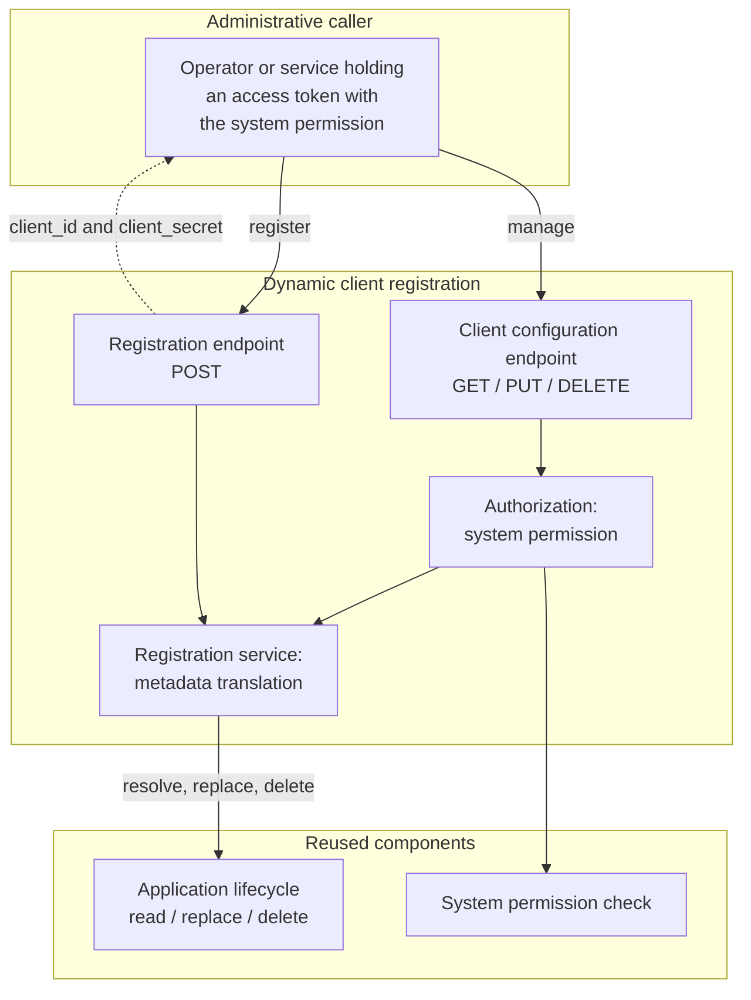

# Component architecture

How the client configuration endpoint relates to the components it reuses. The dynamic client
registration component owns the protocol surface only; client state and credentials stay with their
existing owners.

A registered client is not shown as an actor here because it cannot reach the configuration endpoint.
In phase 1 the only caller that can read, replace or delete a registration is an administrative one,
and the registration response carries no per-client management credential.

## Ownership

| Component | Owns |
|---|---|
| Dynamic client registration | The protocol surface: RFC 7591 metadata translation, what may be changed through the endpoint, and the authorization decision |
| Application lifecycle | Client state. The single owner of the registered record |
| System permission check | The one authorization decision the endpoint makes |
