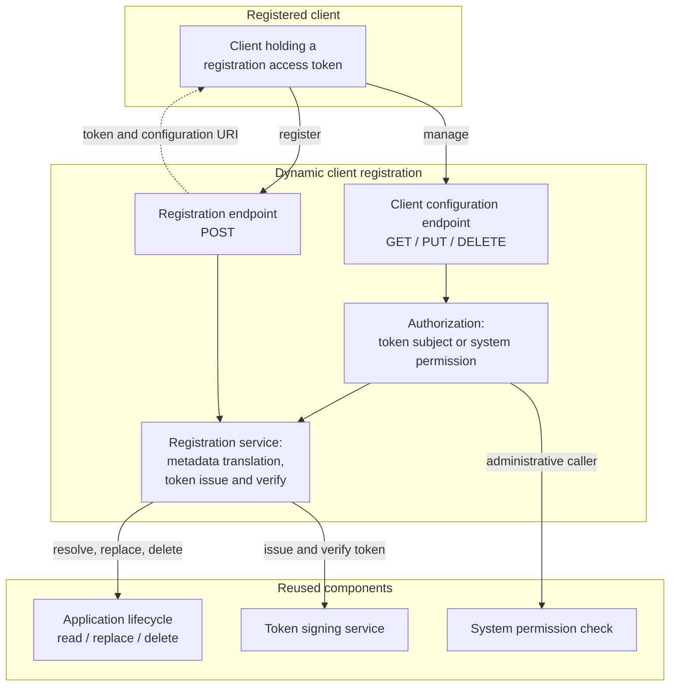

# Component architecture

How the client configuration endpoint relates to the components it reuses. The dynamic client
registration component owns the protocol surface only; client state, credentials and signing keys
stay with their existing owners.

## Ownership

| Component | Owns |
|---|---|
| Dynamic client registration | The protocol surface: RFC 7591 metadata translation, what a client may change, whether a registration access token is issued at all, and token issuance and validation |
| Application lifecycle | Client state. The single owner of the registered record |
| Token signing service | Signing keys, algorithm selection, issuer identity |
| System permission check | Administrative authorization |
