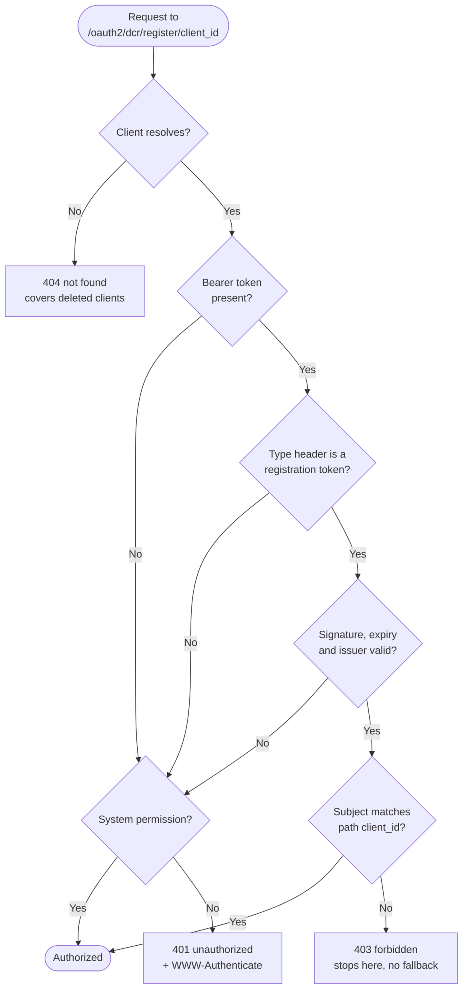

# Authorization decision flow

How a request to the client configuration endpoint is authorized. The order of checks is deliberate
and is the security-relevant part of the design.

## Why this order

**Client resolution runs first.** A token for a deleted client has nothing to authorize against, so
resolution failing is what makes the token inert. Authorizing first and resolving second would leak
whether a client exists to any caller holding a syntactically valid token.

**The type check precedes signature verification.** An ordinary access token is signed by the same
key and would verify successfully. Checking the type first is what stops it being accepted here, and
stops a registration access token being accepted at the token endpoint.

**The subject check runs last, and does not fall through.** A valid token naming a different client is
a permission failure and terminates. It must not fall through to the administrative check, because
that would evaluate a legitimate client credential against a different authorization rule entirely.
This is the one branch in the flow that deliberately has no fallback.

**The audience is not asserted.** The token carries its client's configuration URI as the audience,
but verification does not check it. Asserting it would make a cross-client token fail as malformed
(401) rather than forbidden (403), reporting the wrong condition to the caller.

**Issuance being disabled changes nothing in this flow.** The order of checks is identical; there is
simply no client holding a token, so every request either carries the administrative permission or
falls to the 401. The flow is drawn for the enabled case because it is the one with branches.

## Outcomes

| Outcome | Condition |
|---|---|
| Authorized | Registration access token whose subject matches the path, or an administrative caller |
| 401 unauthorized | No credential, wrong token type, or a token that fails signature, expiry or issuer checks, and no system permission |
| 403 forbidden | Valid registration access token issued for a different client |
| 404 not found | No such registration, including one already deleted |
