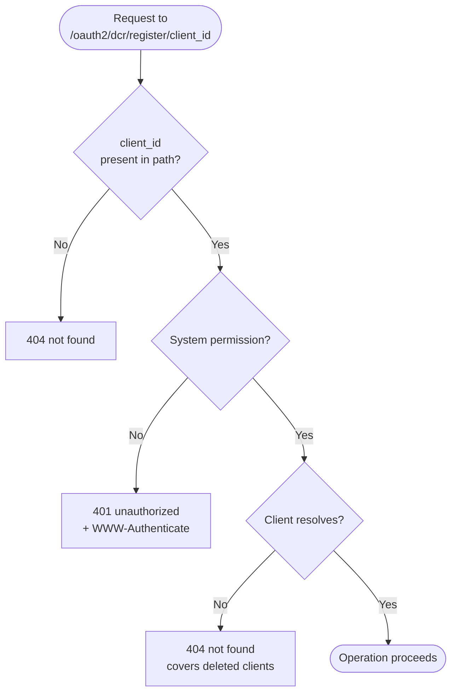

# Authorization decision flow

How a request to the client configuration endpoint is authorized. In phase 1 there is a single authorization rule, so the flow is short, and the security-relevant part is what the endpoint does not do rather than the order of several checks.

## Why this shape

**There is one credential and one rule.** A caller either holds the system permission or it does not. No per-client credential is issued, so there is nothing to bind to a particular registration and no second authorization path to get wrong.

**Authorization precedes client resolution.** The permission check runs in the handler, before the service looks the client up. An unprivileged caller therefore cannot tell a registered client from an unregistered one: every client identifier it probes returns the same 401. This is the opposite order from a per-client credential design, where resolution has to run first so that a credential for a deleted client has nothing to authorize against.

**A permission failure is 401, not 403.** The caller is unauthenticated as far as this endpoint is concerned: it presented nothing the endpoint accepts. The response carries a `WWW-Authenticate` challenge per RFC 6750. There is no 403 path, because there is no case where a caller is recognized but scoped to a different registration.

**404 does not disclose anything.** It is only reachable by a caller that already holds the system permission and could read every registration anyway.

## Outcomes

| Outcome | Condition |
|---|---|
| Operation proceeds | Caller holds the system permission and the client resolves |
| 401 unauthorized | No credential, or a credential without the system permission |
| 404 not found | No client identifier in the path, or no such registration, including one already deleted |

## Trade-off

One rule means one blast radius. The system permission authorizes management of every dynamically registered client, so a caller that obtains an administrative token can rewrite or delete all of them. A design that issued a per-client credential would have scoped a single leak to a single registration, at the cost of minting and holding a durable credential for every registrant. Phase 1 takes the first trade: fewer credentials in existence, each one worth more. This is recorded as a threat in the threat model.
