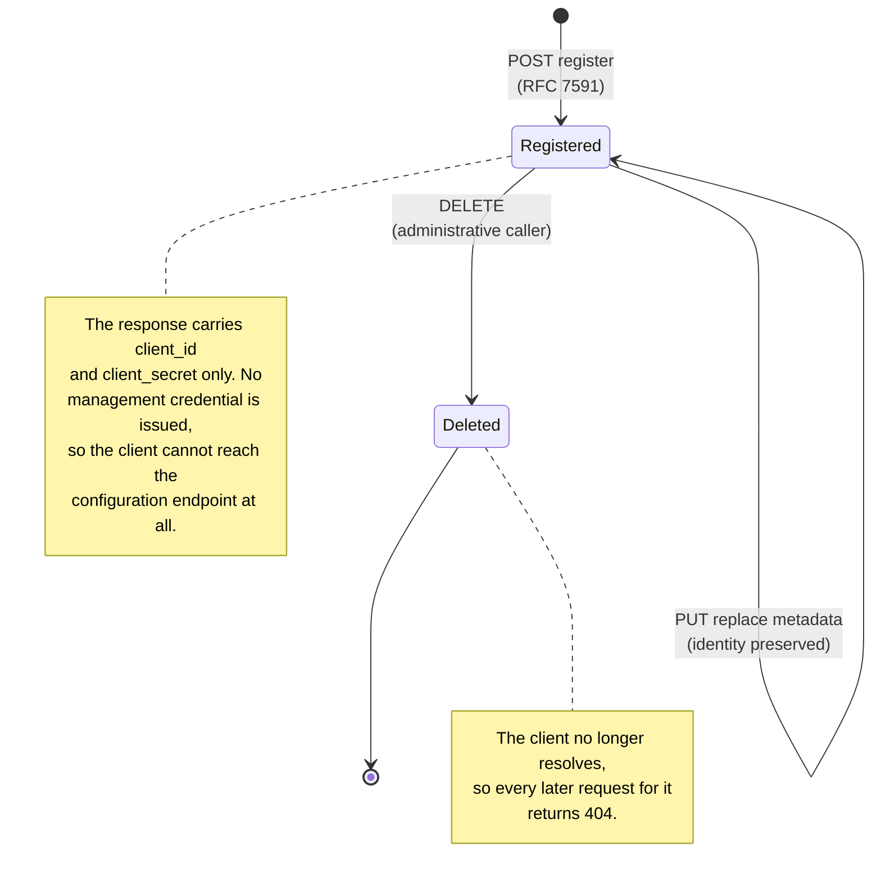

# Registration lifecycle

The lifecycle of a dynamically registered client, from registration through management to deletion. Every step is driven by an administrative caller: the client itself takes no part after it has been registered.

There is no expiry or rotation step in this lifecycle. A registration stays manageable for as long as it exists, because nothing time-bound stands between the endpoint and the record. A client can therefore never silently lose manageability; the only way out of `Registered` is an explicit delete.

## Who can act at each stage

| Stage | Administrative caller | Registered client | Client usable for OAuth |
|---|---|---|---|
| Registered | Read, replace and delete | Nothing | Yes |
| Deleted | Nothing, the client no longer resolves | Nothing | No |

The second row is enforced by the client no longer existing rather than by invalidating a credential. The service resolves the client on every operation, so a deleted registration has nothing to act on and reports 404 even to an administrative caller.
