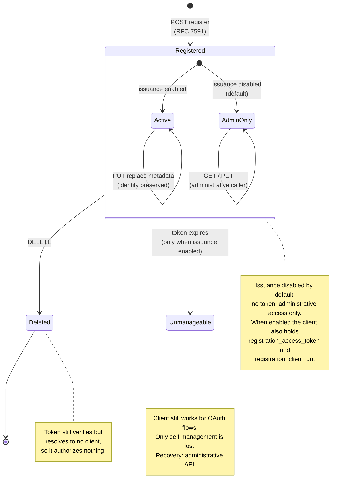

# Registration lifecycle

The full lifecycle a dynamically registered client can drive on its own, from registration through
management to deletion, and what happens to the registration access token at each step.

## Token state at each stage

| Stage | Token verifies | Token authorizes | Client usable for OAuth |
|---|---|---|---|
| Registered, issuance disabled | No token exists | Administrative caller only | Yes |
| Registered, within validity | Yes | Yes, its own registration only | Yes |
| Registered, past validity | No, expired | No | Yes. Only self-management is lost |
| Deleted | Yes, cryptographically | No, resolves to no client | No |

The first row is the default. Disabling issuance after tokens have been handed out does not move a
client into it: the setting governs issuance alone, so an existing token keeps working until it
expires or its client is deleted.

The third row is the important one: deletion is not enforced by invalidating the token, but by the
client no longer existing. Every operation resolves the client before authorizing, so a token for a
deleted client has nothing to act on.
