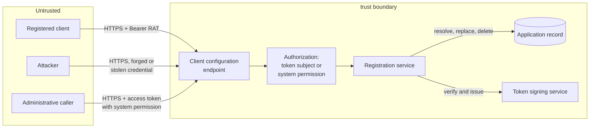
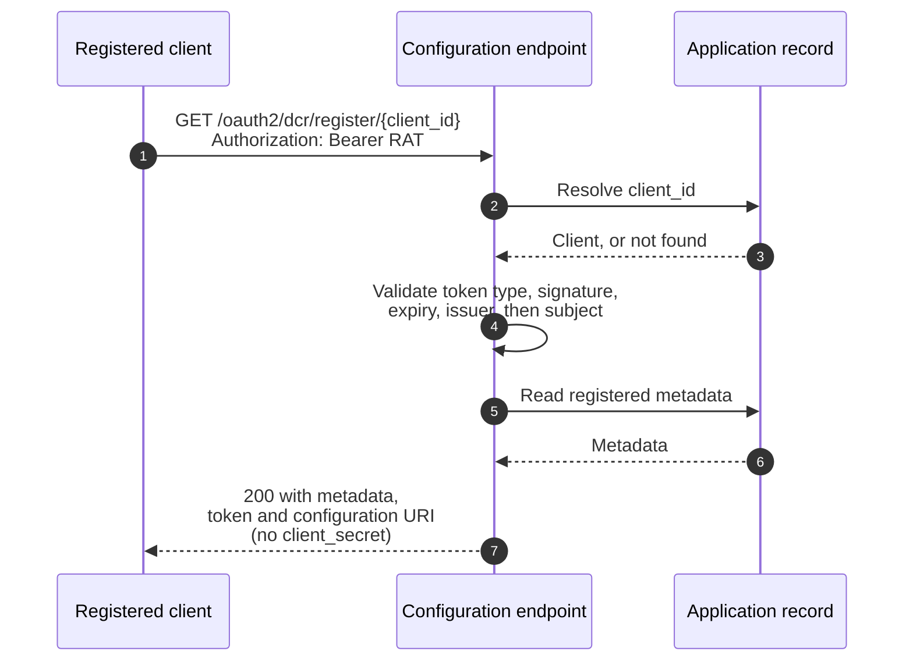
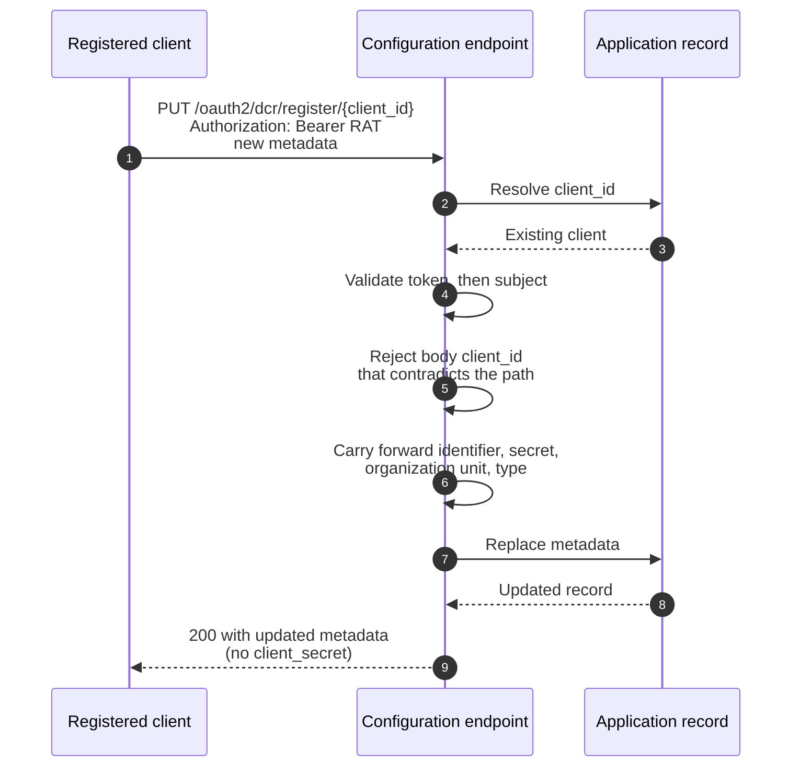
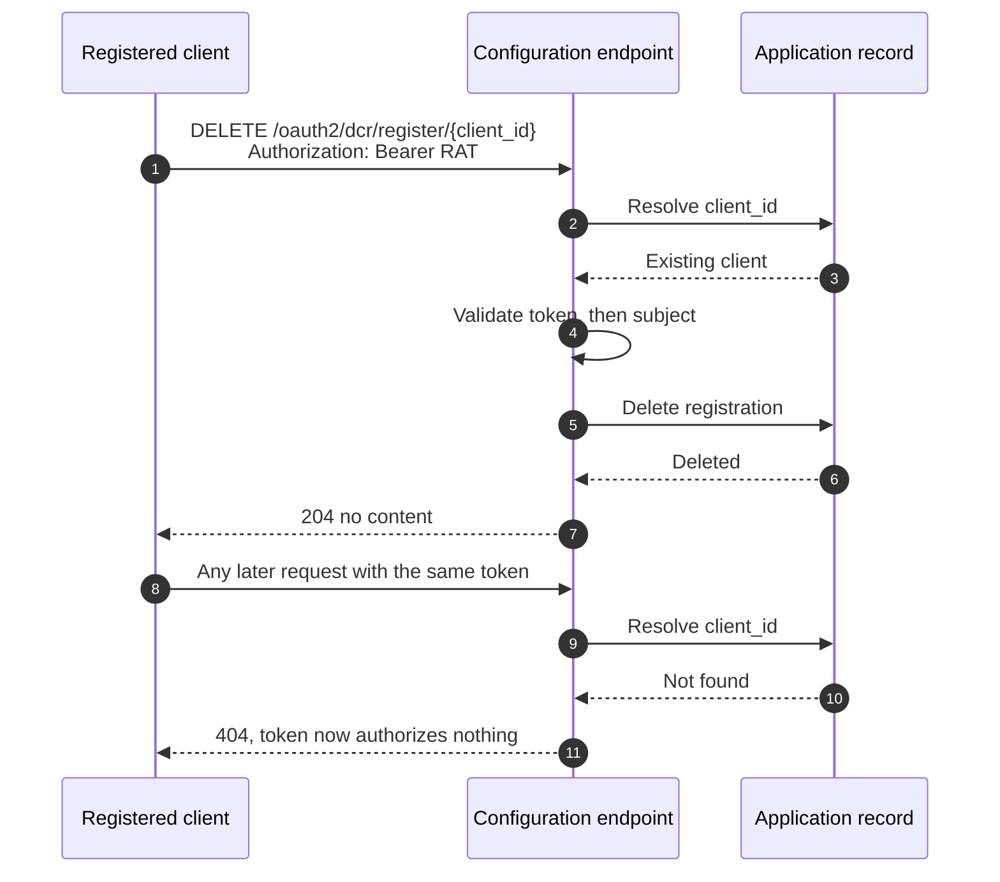
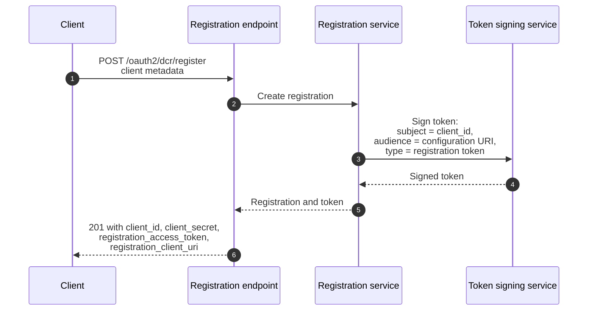

# Dynamic Client Registration Management Threat Model

This model covers the RFC 7592 client configuration endpoint (`/oauth2/dcr/register/{client_id}`),
the registration access token that authorizes it, and the two registration response fields that
deliver that token to the client.

## Overview

The client configuration endpoint lets a dynamically registered OAuth client read, replace and delete
its own registration. It is reachable from the public internet and is authorized by a
`registration_access_token` bound to a single client, or by an administrative caller holding the system permission.

Issuance of that token is disabled by default. In a default deployment no client holds one, the only
credential that authorizes the endpoint is the administrative permission, and the threats below that
depend on a client-held token cannot arise. This is the single largest control in the model, and it
is why several otherwise materializable threats are conditional on a deliberate operator decision.
The analysis that follows assumes issuance has been enabled, which is the worst case.

What makes this area security-relevant is that the endpoint modifies OAuth client configuration. A
caller who can change another client's redirect URIs can redirect that client's authorization codes
to itself, and a caller who can delete a registration can deny service to a working integration. The
key security-relevant behaviors are therefore that the token names exactly one client, that the
endpoint resolves the client before authorizing, and that a registration access token cannot be
interchanged with an OAuth access token.

Cross-cutting concerns covered elsewhere: token signing and key management (the registration access
token is signed by the same service and inherits its key handling), client authentication at the
token endpoint, client secret storage, and the dynamic client registration endpoint itself. These are
referenced here as trust inputs, not re-analysed.

## Scope

This model covers:
- Read, update and delete interactions at the client configuration endpoint
- Registration access token issuance, validation and lifetime, including the setting that governs
  whether tokens are issued at all
- Authorization decisions at the endpoint, including the administrative path
- Disclosure of registered client metadata through the endpoint
- Delivery of the registration access token in the registration response

Out of scope (see the referenced companion models):
- Signing key generation, storage and rotation, owned by the token signing and key management model
- Client secret generation and storage, owned by the client credential model
- Authorization of the initial registration request, owned by the dynamic client registration model
- Downstream use of registered metadata during authorization flows, for example redirect URI matching
  at the authorization endpoint, owned by the authorization endpoint model

## Architecture

### Components

The endpoint owns no storage. It translates protocol metadata, decides authorization, and delegates
state changes to the application record.

| Component | Task |
| --- | --- |
| Client configuration endpoint | Accepts read, update and delete requests per client. Extracts the client identifier from the path and the Bearer credential from the request. |
| Authorization | Validates the registration access token against the client being addressed, or falls back to the system permission check. Resolves the client before authorizing, so a deleted client's token authorizes nothing. |
| Registration service | Translates RFC 7591 metadata to and from the application model. Issues and verifies the registration access token. Carries client identity forward across an update so a metadata change cannot reissue credentials. |
| Application record | The single owner of registered client state. Security-relevant because it holds the redirect URIs and grant types that govern the client's OAuth behavior. |
| Token signing service | Signs and verifies the registration access token using the deployment signing key. Credential storage and key handling are owned elsewhere. |

### Actors

#### Actors

| Actor | Description | Roles or permissions |
| --- | --- | --- |
| Registered client | A dynamically registered OAuth client holding the registration access token issued for it | Manage its own registration only |
| Administrative caller | An operator or service holding an access token with the system permission | Manage any registration |
| Attacker without credentials | An unauthenticated party probing the endpoint | None |
| Attacker holding another client's token | A registered client, or a party that obtained one client's registration access token, attempting to act on a different client | Manage only the client its token names |

#### Entitlement matrix

| Actor | Read own registration | Update own registration | Delete own registration | Read or modify another client |
| --- | --- | --- | --- | --- |
| Registered client | [Yes] | [Yes] | [Yes] | [No] |
| Administrative caller | [Yes] | [Yes] | [Yes] | [Yes] |
| Attacker without credentials | [No] | [No] | [No] | [No] |
| Attacker holding another client's token | [Yes] for the client its token names | [Yes] for the client its token names | [Yes] for the client its token names | [No] |

### External Dependencies (not owned)

| Dependency | Description (usage, purpose, authentication, authorization, security) |
| --- | --- |
| Token signing service | Signs and verifies the registration access token. The confidentiality and integrity of the signing key are prerequisites for every authorization decision here. Owned by the token signing and key management model. |
| Application component | Persists and deletes registered client state. Enforces its own validation on replacement. Owned by the application lifecycle model. |
| System permission check | Authorizes the administrative path. Owned by the platform authorization model. |
| TLS termination | All interactions are HTTPS. Bearer token usage per RFC 6750 depends on it. Owned by the deployment. |

## Threats and mitigations

### Out-of-scope interactions and risks

- Compromise or misuse of the deployment signing key, which would allow forging any token including a
  registration access token. Owned by the token signing and key management model.
- Theft of a client secret, or its use at the token endpoint. Owned by the client credential model.
- Whether the initial registration should be open or authorized. Owned by the dynamic client
  registration model.
- Redirect URI matching during an authorization flow. This model covers who may change a redirect
  URI; the authorization endpoint model covers how a stored URI is then honored.

### Interactions

#### [01]: Read client registration

**Description**

A client retrieves its currently registered metadata. The endpoint resolves the client from the path,
validates the registration access token's type, signature, expiry, issuer and subject, and returns the
metadata. The client secret is omitted because it is stored write-only and cannot be read back.

**Assets involved**

| Initiator | Intermediate | Target |
| --- | --- | --- |
| Registration access token | Client configuration endpoint, registration service | Registered client metadata |

**Data flow**

**Security considerations**

| Area | Response | Comments |
| --- | --- | --- |
| Data confidentiality | [C-Medium] | Registered client metadata is configuration, not personal data. It reveals a client's redirect URIs and grant types, which is useful reconnaissance for an attacker. |
| Communication medium | [M-NT] | |
| Transport security | [TLS] | Bearer token usage requires it per RFC 6750 |
| Authentication | Registration access token as an RFC 6750 Bearer token, or an access token carrying the system permission | |
| Accessibility | [Public] | Reachable from the internet; authorization is per client |
| Authorization and Access Control | Token subject must equal the client identifier in the path. Client resolution precedes authorization. | Administrative callers bypass the subject check by design |

**Threat assessment**

| ID | Category | Threat | Materializable | Mitigation / comment |
| --- | --- | --- | --- | --- |
| 1 | [Information Disclosure] | A client reads another client's registration, exposing its redirect URIs, grant types and contacts, which is reconnaissance for a redirect-hijack or impersonation attempt. | [No] | The token subject must equal the client identifier in the request path. A mismatch returns 403 and terminates without falling through to the administrative check. Covered by an integration test asserting the other client's registration is neither disclosed nor modified. |
| 2 | [Spoofing] | An ordinary OAuth access token, signed by the same deployment key, is presented at the configuration endpoint and accepted, letting any client with a token manage registrations. | [No] | The token carries a dedicated type header, and the type is checked before signature verification. An access token is refused. Covered by a unit test presenting an access token type. |
| 3 | [Information Disclosure] | Probing the endpoint with arbitrary client identifiers reveals which clients exist. | [No] | Client resolution precedes authorization, and an unresolved client returns 404 regardless of credential. A caller without a valid token for a given client cannot distinguish a non-existent client from one it may not access, since a cross-client token returns 403 before any metadata is read. |
| 4 | [Information Disclosure] | The client secret is returned on read and captured from logs, proxies or client-side storage. | [No] | The secret is stored write-only with no read path in the platform, so the response cannot contain it. This is also a deliberate deviation from the RFC 7592 example response, recorded in the specification. |
| 5 | [Spoofing] | A registration access token leaks, for example through client-side logging or an insecure client, and is replayed by an attacker to read the registration. | [Yes, only when issuance is enabled] | Residual. Not reachable in a default deployment, where no token is issued. Where issuance is enabled, a self-contained token cannot be revoked individually, so a leaked token remains valid until it expires. Bounded by the configurable validity period (90 days by default), by the token authorizing only one registration, and by the token being useless once the client is deleted. Operators handling a suspected leak must delete and re-register the client. Single-use tokens, which would also supply individual revocation, are designed and deferred in the specification. Tracked as a residual risk below. |

#### [02]: Update client registration

**Description**

A client replaces its registered metadata. The endpoint resolves and authorizes as in [01], then
carries the client identifier, client secret, owning organization unit and application type forward
from the existing registration before applying the replacement. Server-managed registration fields are
ignored, and a `client_id` in the body that contradicts the path is rejected.

**Assets involved**

| Initiator | Intermediate | Target |
| --- | --- | --- |
| Registration access token, submitted client metadata | Client configuration endpoint, registration service | Registered client metadata, client identifier, client secret |

**Data flow**

**Security considerations**

| Area | Response | Comments |
| --- | --- | --- |
| Data confidentiality | [C-High] | The interaction writes the redirect URIs and grant types that govern the client's OAuth behavior. Unauthorized modification is the highest-impact threat in this area. |
| Communication medium | [M-NT] | |
| Transport security | [TLS] | |
| Authentication | Registration access token as an RFC 6750 Bearer token, or an access token carrying the system permission | |
| Accessibility | [Public] | |
| Authorization and Access Control | As [01]. Additionally, client identity and credentials are carried forward by the server, not accepted from the request. | |

**Threat assessment**

| ID | Category | Threat | Materializable | Mitigation / comment |
| --- | --- | --- | --- | --- |
| 6 | [Tampering] | A client adds an attacker-controlled redirect URI to another client's registration, then harvests authorization codes issued for that client, resulting in account takeover for that client's users. | [No] | The token subject must match the client in the path, so a cross-client update returns 403 before any write. This is the highest-impact threat in this area and the primary reason authorization is per client rather than per endpoint. Covered by an integration test. |
| 7 | [Elevation of Privilege] | A client escalates its own capability by adding grant types or scopes it was not registered with, for example adding `client_credentials` to obtain tokens without a user. | [Yes] | Residual by design. RFC 7592 permits a client to update its own metadata, and ThunderID applies the same validation as registration, including the configured allowed grant types and authentication methods. A deployment that does not want clients choosing their own grant types should restrict `oauth.allowed_grant_types` or disable dynamic registration. Bounded because the client can only affect itself, and cannot exceed the deployment's allow lists. |
| 8 | [Tampering] | A client asserts server-managed fields, for example a longer secret expiry or a different registration token, and the server accepts them. | [No] | Server-managed fields (registration access token, configuration URI, issuance timestamp, secret expiry) are ignored on update. The client identifier is carried forward from the existing record, and a contradicting `client_id` in the body is rejected with 400. |
| 9 | [Tampering] | An update silently reissues the client identifier or client secret, breaking a working integration or invalidating credentials the client still holds. | [No] | The existing identifier is set explicitly on the replacement, and no secret is supplied, which is what preserves the stored one. Covered by an integration test that completes a client credentials request with the original secret after an update. |
| 10 | [Denial of Service] | A client submits repeated updates, or a large metadata payload, to exhaust server resources. | [Yes] | Residual. There is no rate limit specific to this endpoint. Bounded because the caller must hold a valid registration access token for a client that exists, so the surface is limited to registered clients acting on themselves, and each request replaces a single record. Operators should apply request rate limiting at the edge. Tracked below. |
| 11 | [Tampering] | An update leaves the registration in a partially applied state, for example new metadata written while the identifier is lost. | [No] | The replacement is applied as a single operation by the application component. A validation failure is rejected before any write, leaving the registration unchanged. Covered by an integration test asserting an invalid update leaves the registration intact. |

#### [03]: Delete client registration

**Description**

A client removes its registration. The endpoint resolves and authorizes as in [01], then deletes the
underlying application record. Afterwards the registration access token still verifies
cryptographically but resolves to no client, so it authorizes nothing.

**Assets involved**

| Initiator | Intermediate | Target |
| --- | --- | --- |
| Registration access token | Client configuration endpoint, registration service | Registered client, and the client's ability to participate in OAuth flows |

**Data flow**

**Security considerations**

| Area | Response | Comments |
| --- | --- | --- |
| Data confidentiality | [C-High] | Deletion is irreversible through this endpoint and removes a working integration |
| Communication medium | [M-NT] | |
| Transport security | [TLS] | |
| Authentication | Registration access token as an RFC 6750 Bearer token, or an access token carrying the system permission | |
| Accessibility | [Public] | |
| Authorization and Access Control | As [01] | |

**Threat assessment**

| ID | Category | Threat | Materializable | Mitigation / comment |
| --- | --- | --- | --- | --- |
| 12 | [Denial of Service] | A client deletes another client's registration, breaking a working integration and denying service to that client's users. | [No] | The token subject must match the client in the path, so a cross-client delete returns 403 before any state change. |
| 13 | [Spoofing] | A registration access token continues to work after its registration has been deleted, letting a holder act on a client that no longer exists or on a later client that reuses the identifier. | [No] | Client resolution precedes authorization, so a deleted client's token resolves to nothing and every operation returns 404. Client identifiers are randomly generated rather than sequential, so reuse is not a practical concern. Covered by an integration test asserting the token is unusable after deletion. |
| 14 | [Repudiation] | A registration is deleted with no record of who did it, leaving no way to distinguish a legitimate client action from a compromise. | [Yes] | Residual. Requests are captured in access logs with a trace identifier, but there is no dedicated audit record naming the acting client for a configuration change. See checklist items 13 and 14. Tracked below. |

#### [04]: Registration access token issuance and delivery

**Description**

At registration, and on every read and update, the server mints a registration access token for the
client and returns it alongside the configuration URI. The token is a signed JWT whose subject is the
client identifier and whose audience is that client's configuration URI, marked with a dedicated type
header.

**Assets involved**

| Initiator | Intermediate | Target |
| --- | --- | --- |
| Client metadata | Registration service, token signing service | Registration access token |

**Data flow**

**Security considerations**

| Area | Response | Comments |
| --- | --- | --- |
| Data confidentiality | [C-High] | The response carries two credentials: the client secret, shown once, and the registration access token |
| Communication medium | [M-NT] | |
| Transport security | [TLS] | Both credentials are exposed if transport is not encrypted |
| Authentication | Inherited from the registration endpoint, which requires the system permission unless dynamic registration is configured as insecure | |
| Accessibility | [Public] | |
| Authorization and Access Control | The issued token authorizes only the registration it was created for | |

**Threat assessment**

| ID | Category | Threat | Materializable | Mitigation / comment |
| --- | --- | --- | --- | --- |
| 15 | [Spoofing] | An attacker forges a registration access token for an arbitrary client and manages that client's registration. | [No] | The token is signed with the deployment signing key and the signature is verified on every request. Forgery reduces to compromising the signing key, which is out of scope here and owned by the key management model. |
| 16 | [Elevation of Privilege] | A registration access token is accepted as an OAuth access token at a protected resource, granting access beyond registration management. | [No] | The token carries a dedicated type header rather than the access token type, and the audience names the client's configuration endpoint rather than a resource. Access token validation is a separate path that does not accept this type. |
| 17 | [Information Disclosure] | The registration access token or client secret is written to a server log during issuance. | [No] | Neither credential is logged. Registration logging masks the client name and records only error codes. Checklist item 17 covers this. |
| 18 | [Security Risk] | The token never expires, so a leaked token is permanently valid. | [No] | The token carries an expiry, defaulting to 90 days and configurable per deployment. Note this is the inverse of the RFC 7592 guidance that the token SHOULD NOT expire; the specification records the deviation and the reasoning. |
| 19 | [Operational Risk] | The token lifetime is configured too short, and clients silently lose the ability to manage their registrations. | [Yes, only when issuance is enabled] | Residual. The default is deliberately long and the setting is documented, but an operator can still choose a short period. Recovery requires the administrative API. Tracked below. |

## Security Review Checklist

A review aid that complements the threat models and the self-assessment. Guidance follows the [OWASP Top 10 Proactive Controls](https://top10proactive.owasp.org/).

### Security considerations

| # | Consideration | State | Comments |
| --- | --- | --- | --- |
| 1 | Are all inputs and outputs validated (syntactic and semantic)? | [Yes] | The client identifier comes from the request path and is used only as a lookup key. Submitted metadata passes the same validation as registration. A `client_id` in the body that contradicts the path is rejected. Server-managed fields are ignored. |
| 2 | Are rate limits in place where necessary? | [No] | No endpoint-specific rate limit. Bounded because a caller must hold a valid token for an existing client. Operators should rate limit at the edge. See threat 10. |
| 3 | Are permissions, roles, and entitlements defined on the principle of least privilege and business need? | [Yes] | A registration access token authorizes exactly one registration and nothing else. It is not the client secret and grants no access to resources. The administrative path reuses the existing system permission rather than introducing a new one. |
| 4 | Are authentication and authorization validated at both the UI and API layers, front end and back end, before granting access to resources? | [N/A] | API only; there is no user-facing surface in this feature. Authorization is enforced server-side on every request. |
| 5 | Are proper isolations in place between components to ensure least-privilege access and reduce the blast radius against lateral movement? | [Yes] | The endpoint owns no storage and delegates state changes to the application component. A registration access token cannot be used at the token endpoint or any protected resource, so a leaked token does not enable lateral movement beyond one registration. |
| 6 | Have any default credentials been changed, and are default superuser or root accounts not in use (when using third-party components)? | [N/A] | No third-party components and no default credentials introduced. |
| 7 | Has the implementation followed best-practice guidelines (OWASP, Kubernetes, vendor, or technology provider)? | [Yes] | RFC 7592 for the protocol, RFC 6750 for Bearer token usage including the `WWW-Authenticate` challenge, and RFC 8725 for JWT practice: the type header is checked to prevent token confusion, and the audience and subject are explicit. |
| 8 | Are secrets, credentials, and internal-only material kept out of the public source tree and its git history? | [Yes] | No credentials introduced into the tree. Test fixtures use clearly non-secret placeholder values. |
| 9 | Was a security-focused code review conducted for this change, and have the findings been addressed? | [Partial] | Authorization ordering, token confusion and the update identity-preservation traps were reviewed during design and are covered by tests. A reviewer sign-off on the implementation PR is outstanding. |
| 10 | Is Static Analysis (SAST) or IaC scanning conducted, and are findings addressed? | [Yes] | The repository lint gate includes static analysis and runs clean for this change. |
| 11 | Is Software Composition Analysis (SCA) conducted or integrated into the repository, and are findings addressed (for example FOSSA, Trivy)? | [Yes] | Repository-wide SCA applies. This change introduces no new dependencies. |
| 12 | Are audit logs generated in a standardized format for critical functionality, and available to authorized users to trace critical events and aid incident response? Note the retention period in Comments. | [Partial] | Requests appear in access logs with a trace identifier, and server errors are logged with an error code and the operation. There is no dedicated audit record naming the acting client for a registration change or deletion. Retention is left to the deployment. See threat 14. |
| 13 | Do audit logs for critical configuration changes record the difference between the old and new versions? | [No] | An update replaces client metadata without recording the previous value. Reconstructing what changed is not possible from logs. See threat 14. |
| 14 | Are data in transit and at rest encrypted? | [Yes] | All interactions are HTTPS. Registered metadata is stored by the application component under its existing storage protections; this feature adds no new storage. |
| 15 | Are sensitive values such as credentials and keys stored in a secret store or vault? | [Yes] | The registration access token is not stored at all, by design. The client secret is stored write-only by the existing credential path, which this feature does not change or read. |
| 16 | Is personal, sensitive, or confidential data kept out of logs? | [Yes] | Neither the registration access token nor the client secret is logged. Registration logging masks the client name. Client metadata is configuration rather than personal data. |
| 17 | Have users been given clear instructions for secure usage? | [Yes] | The public documentation states that the token is not the client secret, is bound to one client, cannot be recovered if lost, and that an update replaces metadata in full. The absence of the client secret on read is stated explicitly. |

### Business impact and resilience

For an open-source component, most of these are shared with the operator who deploys it. Capture the project's defaults and recommendations here, and note what is left to the deployer.

| # | Consideration | State | Comments |
| --- | --- | --- | --- |
| 1 | Has a business impact analysis been done to identify resilience requirements (maximum tolerable downtime, uptime, RPO, RTO)? | [N/A] | This feature adds no new stateful component and no new availability requirement. If the endpoint is unavailable, existing clients continue to function in OAuth flows; only self-service management is unavailable. Platform-level resilience is inherited from the deployment. |

Resilience details to record:
- High availability requirements: inherited from the deployment; the endpoint is stateless and adds no
  new coordination point.
- Disaster recovery requirements: no new state. Registered clients are recovered with the application
  data they already live in.
- Backups, frequency, and retention: no new storage introduced. Registration access tokens are not
  stored and therefore need no backup; they remain valid after a restore because they are
  self-contained and verified against the signing key.
- Health checks: no new dependency to probe.
- User banners: not applicable.

### Dependency and component health

| # | Consideration | State | Comments |
| --- | --- | --- | --- |
| 1 | Are dependencies, base images, and runtimes monitored for known vulnerabilities and kept current (for example automated dependency scanning), and are findings addressed? | [Yes] | Repository-wide monitoring applies. This feature introduces no new dependency. |
| 2 | Are any End-of-Life or End-of-Service components in use? | [No] | |
| 3 | Is hardening guidance published for operators who deploy the project (optional)? | [Partial] | The token lifetime setting and its default are documented. Guidance on rate limiting this endpoint and on responding to a leaked registration access token is not yet published. |

### Privacy considerations

Fill this in only if the change processes personal data.

Not applicable. The feature processes OAuth client configuration, not personal data. The one field
that can carry personal information is `contacts`, an optional list of administrator email addresses
supplied by the client itself at registration. It is stored and echoed back to the client that
submitted it, and is neither collected from users nor shared with third parties by this feature.

## Residual risks (open items)

- A leaked registration access token cannot be revoked individually and remains valid until it
  expires. Not present in a default deployment, where token issuance is disabled and no client holds
  one. Where issuance is enabled, the risk is bounded by the configurable validity period, by the
  token authorizing only one registration, and by deletion making it inert. Mitigation for a
  suspected leak is to delete and re-register the client. Closing this properly means recording the
  token on the platform's existing single-token deny list, the same mechanism the deferred single-use
  design would use; no new storage is required. (threat 5)
- No endpoint-specific rate limiting. Operators should rate limit at the edge. (threat 10)
- No dedicated audit record for a registration change or deletion, and no before-and-after diff, so a
  configuration change cannot be attributed from logs alone. (threat 14, checklist items 13 and 14)
- A client can widen its own grant types or scopes within the deployment's allow lists, which is
  permitted by RFC 7592 but may be unexpected. Operators who do not want this should restrict the
  allowed grant types or disable dynamic registration. (threat 7)
- An operator can configure a token lifetime short enough that clients silently lose self-service
  management, recoverable only through the administrative API. (threat 19)

## Appendix

- Sample requests and configurations: see the API specification for the endpoint and the public
  documentation for a worked read, update and delete sequence. Token issuance is controlled with
  `oauth.dcr.registration_access_token_enabled`, which defaults to disabled, and the token lifetime
  with `oauth.dcr.registration_access_token_validity_period`.
- References:
  - [RFC 7592](https://www.rfc-editor.org/rfc/rfc7592) OAuth 2.0 Dynamic Client Registration Management Protocol
  - [RFC 7591](https://www.rfc-editor.org/rfc/rfc7591) OAuth 2.0 Dynamic Client Registration Protocol
  - [RFC 6750](https://www.rfc-editor.org/rfc/rfc6750) OAuth 2.0 Bearer Token Usage
  - [RFC 8725](https://www.rfc-editor.org/rfc/rfc8725) JSON Web Token Best Current Practices
  - [spec.md](spec.md), and the diagrams under [assets/](assets)
  - Companion models, referenced as trust inputs: token signing and key management, client
    credentials, dynamic client registration, authorization endpoint

## Change log

| Version | Date | Change |
|---|---|---|
| 0.2 | 2026-09-10 | Recorded token issuance as disabled by default and made the token-dependent threats conditional on it. Corrected the revocation residual: the existing deny list covers it, so no new storage is required. |
| 0.1 | 2026-09-07 | Initial threat model. |
