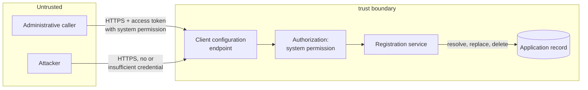
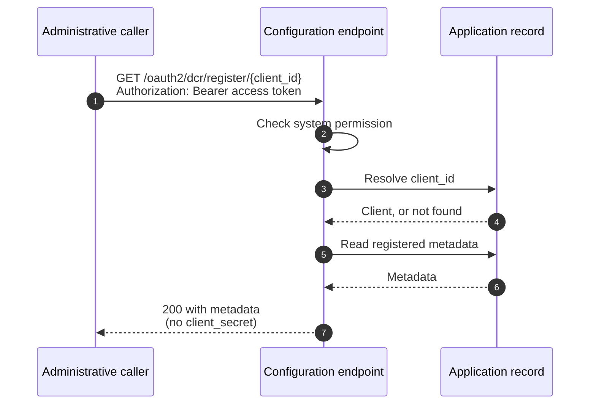
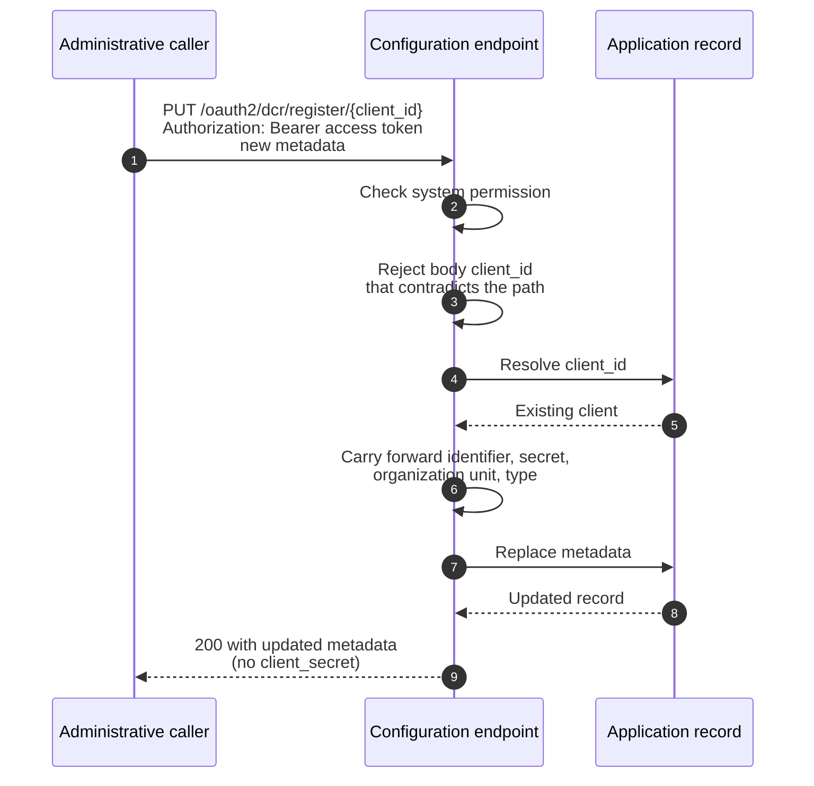
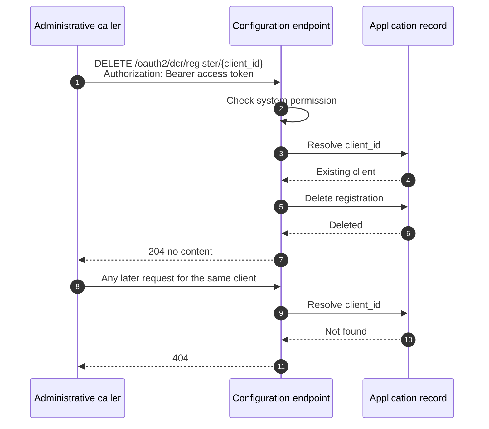

# Dynamic Client Registration Management Threat Model

This model covers the RFC 7592 client configuration endpoint (`/oauth2/dcr/register/{client_id}`) and the single authorization rule that governs it: the caller must hold the system permission.

## Overview

The client configuration endpoint lets a caller read, replace and delete the registration of a dynamically registered OAuth client. It is reachable from the public internet and is authorized by an administrative caller holding the system permission. In this phase there is no per-client credential: a registered client cannot manage itself, and the registration response carries no management token or configuration URI.

That single rule is the largest fact in this model, and it cuts both ways. It removes a whole class of threats, because there is no durable per-client credential to leak, replay, rotate, expire or confuse with an access token, and no client-side credential handling to get wrong. It also concentrates risk: the administrative credential is now the only thing standing between a caller and every dynamically registered client.

What makes this area security-relevant is that the endpoint modifies OAuth client configuration. A caller who can change a client's redirect URIs can redirect that client's authorization codes to itself, and a caller who can delete a registration can deny service to a working integration. The key security-relevant behaviors are therefore that the permission check runs before anything else, that it is the only path to the operation, and that an update cannot rewrite the identity or credentials of the registration it replaces.

Cross-cutting concerns covered elsewhere: issuance and validation of the administrative access token, client authentication at the token endpoint, client secret storage, and the dynamic client registration endpoint itself. These are referenced here as trust inputs, not re-analysed.

## Scope

This model covers:
- Read, update and delete interactions at the client configuration endpoint
- The authorization decision at the endpoint, which is the system permission check
- Disclosure of registered client metadata through the endpoint
- The consequences of scoping management to administrative callers only

Out of scope (see the referenced companion models):
- Issuance, lifetime, revocation and protection of the administrative access token that carries the system permission, owned by the platform authorization and token models
- Client secret generation and storage, owned by the client credential model
- Authorization of the initial registration request, owned by the dynamic client registration model
- Downstream use of registered metadata during authorization flows, for example redirect URI matching at the authorization endpoint, owned by the authorization endpoint model

## Architecture

### Components

The endpoint owns no storage. It translates protocol metadata, decides authorization, and delegates state changes to the application record.

| Component | Task |
| --- | --- |
| Client configuration endpoint | Accepts read, update and delete requests per client. Extracts the client identifier from the path. |
| Authorization | Checks the system permission on the request's security context. This is the whole decision: there is no second path and no per-client credential. It runs before the client is resolved. |
| Registration service | Translates RFC 7591 metadata to and from the application model. Resolves the client on every operation. Carries client identity forward across an update so a metadata change cannot reissue credentials. |
| Application record | The single owner of registered client state. Security-relevant because it holds the redirect URIs and grant types that govern the client's OAuth behavior. |

### Actors

#### Actors

| Actor | Description | Roles or permissions |
| --- | --- | --- |
| Administrative caller | An operator or service holding an access token with the system permission | Manage any registration |
| Registered client | A dynamically registered OAuth client | None at this endpoint. It holds no credential that authorizes management of its own registration |
| Attacker without credentials | An unauthenticated party probing the endpoint | None |
| Attacker holding a non-administrative token | A party holding a valid platform access token that lacks the system permission, for example an ordinary OAuth client's token | None at this endpoint |

#### Entitlement matrix

| Actor | Read a registration | Update a registration | Delete a registration | Manage every registration |
| --- | --- | --- | --- | --- |
| Administrative caller | [Yes] | [Yes] | [Yes] | [Yes] |
| Registered client | [No] | [No] | [No] | [No] |
| Attacker without credentials | [No] | [No] | [No] | [No] |
| Attacker holding a non-administrative token | [No] | [No] | [No] | [No] |

There is no row for partial access. A caller either manages every registration or none, which is the defining property of this phase and the source of threat 8.

### External Dependencies (not owned)

| Dependency | Description (usage, purpose, authentication, authorization, security) |
| --- | --- |
| System permission check | The endpoint's only authorization decision. Its correctness, and the integrity of the security context it reads, are prerequisites for every operation here. Owned by the platform authorization model. |
| Administrative access token | Carries the system permission to the endpoint. Its issuance, lifetime and revocation are owned by the platform token models, not by this feature. |
| Application component | Persists and deletes registered client state. Enforces its own validation on replacement. Owned by the application lifecycle model. |
| TLS termination | All interactions are HTTPS. Bearer token usage per RFC 6750 depends on it. Owned by the deployment. |

## Threats and mitigations

### Out-of-scope interactions and risks

- Theft of an administrative access token from outside this endpoint, or weaknesses in how it is issued, stored or revoked. Owned by the platform authorization and token models. The consequence of such a theft for this endpoint is in scope and recorded as threat 8.
- Theft of a client secret, or its use at the token endpoint. Owned by the client credential model.
- Whether the initial registration should be open or authorized. Owned by the dynamic client registration model.
- Redirect URI matching during an authorization flow. This model covers who may change a redirect URI; the authorization endpoint model covers how a stored URI is then honored.

### Interactions

#### [01]: Read client registration

**Description**

An administrative caller retrieves a client's currently registered metadata. The endpoint checks the system permission, then the service resolves the client and returns its metadata. The client secret is omitted because it is stored write-only and cannot be read back.

**Assets involved**

| Initiator | Intermediate | Target |
| --- | --- | --- |
| Administrative access token | Client configuration endpoint, registration service | Registered client metadata |

**Data flow**

**Security considerations**

| Area | Response | Comments |
| --- | --- | --- |
| Data confidentiality | [C-Medium] | Registered client metadata is configuration, not personal data. It reveals a client's redirect URIs and grant types, which is useful reconnaissance for an attacker. |
| Communication medium | [M-NT] | |
| Transport security | [TLS] | Bearer token usage requires it per RFC 6750 |
| Authentication | An access token carrying the system permission | |
| Accessibility | [Public] | Reachable from the internet; authorization is administrative |
| Authorization and Access Control | The system permission is required. The check precedes client resolution, so an unauthorized caller learns nothing about which clients exist. | |

**Threat assessment**

| ID | Category | Threat | Materializable | Mitigation / comment |
| --- | --- | --- | --- | --- |
| 1 | [Information Disclosure] | An unauthenticated party, or a party holding an ordinary platform access token without the system permission, reads a registration and learns its redirect URIs, grant types and contacts, which is reconnaissance for a redirect-hijack or impersonation attempt. | [No] | The system permission is required and is the only path to the operation. A caller without it gets 401 with a `WWW-Authenticate` challenge, and the service is never called. Covered by unit tests for an unauthenticated caller and for a caller holding an unrelated scope, both asserting the service is not invoked. |
| 2 | [Information Disclosure] | Probing the endpoint with arbitrary client identifiers reveals which clients exist. | [No] | The permission check runs before client resolution, so an unprivileged caller receives 401 for every identifier and cannot distinguish a registered client from an unregistered one. The 404 for an unknown client is reachable only by a caller that already holds the system permission and could read every registration anyway. |
| 3 | [Information Disclosure] | The client secret is returned on read and captured from logs, proxies or client-side storage. | [No] | The secret is stored write-only with no read path in the platform, so the response cannot contain it. Covered by a unit test asserting the read response carries no secret. This is also a deliberate deviation from the RFC 7592 example response, recorded in the specification. |

#### [02]: Update client registration

**Description**

An administrative caller replaces a client's registered metadata. The endpoint authorizes as in [01], then the service resolves the client and carries the client identifier, client secret, owning organization unit and application type forward from the existing registration before applying the replacement. A `client_id` in the body that contradicts the path is rejected.

**Assets involved**

| Initiator | Intermediate | Target |
| --- | --- | --- |
| Administrative access token, submitted client metadata | Client configuration endpoint, registration service | Registered client metadata, client identifier, client secret |

**Data flow**

**Security considerations**

| Area | Response | Comments |
| --- | --- | --- |
| Data confidentiality | [C-High] | The interaction writes the redirect URIs and grant types that govern the client's OAuth behavior. Unauthorized modification is the highest-impact threat in this area. |
| Communication medium | [M-NT] | |
| Transport security | [TLS] | |
| Authentication | An access token carrying the system permission | |
| Accessibility | [Public] | |
| Authorization and Access Control | As [01]. Additionally, client identity and credentials are carried forward by the server, not accepted from the request. | |

**Threat assessment**

| ID | Category | Threat | Materializable | Mitigation / comment |
| --- | --- | --- | --- | --- |
| 4 | [Tampering] | A caller without the system permission adds an attacker-controlled redirect URI to a registration, then harvests authorization codes issued for that client, resulting in account takeover for that client's users. | [No] | The system permission is required before the request reaches the service, so an unauthorized update never touches the record. This is the highest-impact threat in this area and the reason the endpoint is administrative rather than open to the client. Covered by unit tests asserting an unauthorized caller cannot invoke the update. |
| 5 | [Tampering] | An update silently reissues the client identifier or client secret, breaking a working integration or invalidating credentials the client still holds. | [No] | The existing identifier and organization unit are set explicitly on the replacement, and no secret is supplied, which is what preserves the stored one. The application type is left empty so the immutable existing type is inherited. Covered by a unit test asserting client identity is preserved across an update. |
| 6 | [Tampering] | Because the update is a full replacement per RFC 7592, a caller that omits a field it did not intend to change silently wipes it, for example dropping a redirect URI or a set of contacts from a working registration. | [Yes] | Residual by design. RFC 7592 specifies replacement rather than merge, and ThunderID follows it: fields absent from the request are not retained, except for the identity fields listed above and the client name, which is inherited when omitted. Bounded because the caller is administrative and the previous value is recoverable only from a backup, not from logs. The public documentation states explicitly that an update replaces metadata in full. Tracked below. |
| 7 | [Denial of Service] | A caller submits repeated updates, or a large metadata payload, to exhaust server resources. | [Yes] | Residual. There is no rate limit specific to this endpoint. Bounded because the caller must hold the system permission, which narrows the surface to administrative callers, and each request replaces a single record. Operators should apply request rate limiting at the edge. Tracked below. |
| 8 | [Elevation of Privilege] | An attacker who obtains one administrative access token gains full control of every dynamically registered client at once: it can rewrite every client's redirect URIs, widen every client's grant types, and delete every registration. There is no per-client credential, so nothing scopes the damage to a single client. | [Yes] | Residual, and the defining trade-off of this phase. Accepted rather than eliminated. Three things bound it. The system permission check is the single, uniform gate, so there is no weaker secondary path to compromise. The administrative token is already a high-value platform credential, protected, issued and audited accordingly by the platform token models, rather than a new credential type minted per registrant and handled by client software of unknown quality. Normal access token lifetime and revocation apply to it, so a suspected compromise is remediated by revoking one token rather than by re-registering every affected client. The alternative, a durable per-client credential, would have scoped a single leak to a single registration but would have put one long-lived credential in the hands of every registrant, and the leak of any one of them could not be revoked individually. Tracked below. |
| 9 | [Tampering] | An update leaves the registration in a partially applied state, for example new metadata written while the identifier is lost. | [No] | The replacement is applied as a single operation by the application component. A validation failure is rejected before any write, leaving the registration unchanged. Covered by unit tests asserting an invalid update is rejected without reaching the application component. |

#### [03]: Delete client registration

**Description**

An administrative caller removes a registration. The endpoint authorizes as in [01], then the service resolves the client and deletes the underlying application record. Afterwards the client no longer resolves, so every later request for it returns 404.

**Assets involved**

| Initiator | Intermediate | Target |
| --- | --- | --- |
| Administrative access token | Client configuration endpoint, registration service | Registered client, and the client's ability to participate in OAuth flows |

**Data flow**

**Security considerations**

| Area | Response | Comments |
| --- | --- | --- |
| Data confidentiality | [C-High] | Deletion is irreversible through this endpoint and removes a working integration |
| Communication medium | [M-NT] | |
| Transport security | [TLS] | |
| Authentication | An access token carrying the system permission | |
| Accessibility | [Public] | |
| Authorization and Access Control | As [01] | |

**Threat assessment**

| ID | Category | Threat | Materializable | Mitigation / comment |
| --- | --- | --- | --- | --- |
| 10 | [Denial of Service] | A caller without the system permission deletes a registration, breaking a working integration and denying service to that client's users. | [No] | The permission check precedes the service call, so an unauthorized delete causes no state change. Covered by the handler unit tests, which assert the service is not invoked for an unauthorized caller. |
| 11 | [Denial of Service] | A registration is deleted and a later request acts on a client that no longer exists, or on a different client that has reused the identifier. | [No] | The service resolves the client on every operation, so a deleted client resolves to nothing and every operation returns 404. Client identifiers are randomly generated rather than sequential, so reuse is not a practical concern. Covered by unit tests for an unknown client on read, update and delete. |
| 12 | [Repudiation] | A registration is deleted or rewritten with no record of who did it, leaving no way to distinguish a legitimate administrative action from a compromise. | [Yes] | Residual, and more significant in this phase than it would be with a per-client credential, because every change is made by an administrative caller and the record alone does not say which one. Requests are captured in access logs with a trace identifier, but there is no dedicated audit record naming the acting principal for a configuration change. See checklist items 13 and 14, and threat 8. Tracked below. |

## Security Review Checklist

A review aid that complements the threat models and the self-assessment. Guidance follows the [OWASP Top 10 Proactive Controls](https://top10proactive.owasp.org/).

### Security considerations

| # | Consideration | State | Comments |
| --- | --- | --- | --- |
| 1 | Are all inputs and outputs validated (syntactic and semantic)? | [Yes] | The client identifier comes from the request path and is used only as a lookup key. Submitted metadata passes the same validation as registration. A `client_id` in the body that contradicts the path is rejected. |
| 2 | Are rate limits in place where necessary? | [No] | No endpoint-specific rate limit. Bounded because a caller must hold the system permission. Operators should rate limit at the edge. See threat 7. |
| 3 | Are permissions, roles, and entitlements defined on the principle of least privilege and business need? | [Partial] | The endpoint reuses the existing system permission rather than introducing a new one, which avoids a new credential type. It is not least privilege with respect to the managed clients: the permission authorizes management of every registration, with no way to scope a caller to one. This is the accepted trade-off recorded as threat 8. |
| 4 | Are authentication and authorization validated at both the UI and API layers, front end and back end, before granting access to resources? | [N/A] | API only; there is no user-facing surface in this feature. Authorization is enforced server-side on every request. |
| 5 | Are proper isolations in place between components to ensure least-privilege access and reduce the blast radius against lateral movement? | [Partial] | The endpoint owns no storage and delegates state changes to the application component. It introduces no new credential that could be replayed elsewhere. Within the feature itself there is no isolation between registrations: one administrative credential reaches all of them. See threat 8. |
| 6 | Have any default credentials been changed, and are default superuser or root accounts not in use (when using third-party components)? | [N/A] | No third-party components and no default credentials introduced. |
| 7 | Has the implementation followed best-practice guidelines (OWASP, Kubernetes, vendor, or technology provider)? | [Yes] | RFC 7592 for the protocol and RFC 6750 for Bearer token usage, including the `WWW-Authenticate` challenge on an unauthorized request. |
| 8 | Are secrets, credentials, and internal-only material kept out of the public source tree and its git history? | [Yes] | No credentials introduced into the tree. Test fixtures use clearly non-secret placeholder values. |
| 9 | Was a security-focused code review conducted for this change, and have the findings been addressed? | [Partial] | Authorization ordering and the update identity-preservation traps were reviewed during design and are covered by tests. A reviewer sign-off on the implementation PR is outstanding. |
| 10 | Is Static Analysis (SAST) or IaC scanning conducted, and are findings addressed? | [Yes] | The repository lint gate includes static analysis and runs clean for this change. |
| 11 | Is Software Composition Analysis (SCA) conducted or integrated into the repository, and are findings addressed (for example FOSSA, Trivy)? | [Yes] | Repository-wide SCA applies. This change introduces no new dependencies. |
| 12 | Is Dynamic (DAST) or API scanning conducted on a non-production setup, and are findings addressed? | [No] | Not performed for this feature. The API specification is published, so the endpoint is scannable if the project adopts API scanning. |
| 13 | Are audit logs generated in a standardized format for critical functionality, and available to authorized users to trace critical events and aid incident response? Note the retention period in Comments. | [Partial] | Requests appear in access logs with a trace identifier, and server errors are logged with an error code and the operation. There is no dedicated audit record naming the acting principal for a registration change or deletion, which matters more now that every change is administrative. Retention is left to the deployment. See threat 12. |
| 14 | Do audit logs for critical configuration changes record the difference between the old and new versions? | [No] | An update replaces client metadata without recording the previous value. Reconstructing what changed is not possible from logs. See threats 6 and 12. |
| 15 | Are data in transit and at rest encrypted? | [Yes] | All interactions are HTTPS. Registered metadata is stored by the application component under its existing storage protections; this feature adds no new storage. |
| 16 | Are sensitive values such as credentials and keys stored in a secret store or vault? | [Yes] | This feature introduces no credential of its own. The client secret is stored write-only by the existing credential path, which this feature does not change or read. |
| 17 | Is personal, sensitive, or confidential data kept out of logs? | [Yes] | No credential is logged. Registration logging masks the client name and records only error codes. Client metadata is configuration rather than personal data. |
| 18 | Have users been given clear instructions for secure usage? | [Partial] | The public documentation states that management requires administrative authorization, that a client cannot manage its own registration, that an update replaces metadata in full, and that the client secret is absent from a read. Guidance on the blast radius of an administrative credential at this endpoint is not yet published. See threat 8. |

### Business impact and resilience

For an open-source component, most of these are shared with the operator who deploys it. Capture the project's defaults and recommendations here, and note what is left to the deployer.

| # | Consideration | State | Comments |
| --- | --- | --- | --- |
| 1 | Has a business impact analysis been done to identify resilience requirements (maximum tolerable downtime, uptime, RPO, RTO)? | [N/A] | This feature adds no new stateful component and no new availability requirement. If the endpoint is unavailable, existing clients continue to function in OAuth flows; only administrative management of registrations is unavailable. Platform-level resilience is inherited from the deployment. |

Resilience details to record:
- High availability requirements: inherited from the deployment; the endpoint is stateless and adds no new coordination point.
- Disaster recovery requirements: no new state. Registered clients are recovered with the application data they already live in.
- Backups, frequency, and retention: no new storage introduced. Because an update is a full replacement and no previous value is retained, a backup of the application data is the only way to recover metadata overwritten in error.
- Health checks: no new dependency to probe.
- User banners: not applicable.

### Dependency and component health

| # | Consideration | State | Comments |
| --- | --- | --- | --- |
| 1 | Are dependencies, base images, and runtimes monitored for known vulnerabilities and kept current (for example automated dependency scanning), and are findings addressed? | [Yes] | Repository-wide monitoring applies. This feature introduces no new dependency. |
| 2 | Are any End-of-Life or End-of-Service components in use? | [No] | |
| 3 | Is hardening guidance published for operators who deploy the project (optional)? | [Partial] | The endpoint and its administrative authorization are documented. Guidance on rate limiting this endpoint, and on containing a compromised administrative credential that has reached it, is not yet published. |

### Privacy considerations

Fill this in only if the change processes personal data.

Not applicable. The feature processes OAuth client configuration, not personal data. The one field that can carry personal information is `contacts`, an optional list of administrator email addresses supplied at registration. It is stored and echoed back through the endpoint, and is neither collected from users nor shared with third parties by this feature.

## Residual risks (open items)

- One administrative credential governs every dynamically registered client. A caller that obtains an administrative access token can rewrite or delete all of them, with nothing scoping the damage to a single registration. This is the accepted trade-off of scoping management to administrative callers in this phase, taken in exchange for issuing no durable per-client credential at all. Containment relies on the platform's existing protection, lifetime and revocation of administrative tokens. Closing it further means a scoped permission that names the registrations a caller may manage, or reintroducing a per-client credential with individual revocation. (threat 8)
- An update replaces metadata in full, so an omitted field is dropped rather than retained, and the previous value is not recoverable from logs. (threat 6, checklist item 14)
- No endpoint-specific rate limiting. Operators should rate limit at the edge. (threat 7)
- No dedicated audit record for a registration change or deletion, and no before-and-after diff, so a configuration change cannot be attributed to a particular administrative caller from logs alone. This is more significant now that every change is administrative. (threat 12, checklist items 13 and 14)
- Clients cannot manage their own registrations at all, so a deployment that wants self-service must wait for a later phase. This is a functional gap rather than a security risk, and it removes the client-side credential-handling risks that self-service would introduce.
- Operator guidance on the blast radius of an administrative credential at this endpoint is not yet published. (checklist items 3 and 18)
- No dynamic API scanning has been performed against this endpoint. (checklist item 12)

## Appendix

- Sample requests and configurations: see the API specification for the endpoint and the public documentation for a worked read, update and delete sequence. The feature is controlled with `oauth.dcr.enabled`, and `oauth.dcr.insecure` governs only whether the initial registration request requires authorization. Neither affects the client configuration endpoint, which always requires the system permission.
- References:
  - [RFC 7592](https://www.rfc-editor.org/rfc/rfc7592) OAuth 2.0 Dynamic Client Registration Management Protocol
  - [RFC 7591](https://www.rfc-editor.org/rfc/rfc7591) OAuth 2.0 Dynamic Client Registration Protocol
  - [RFC 6750](https://www.rfc-editor.org/rfc/rfc6750) OAuth 2.0 Bearer Token Usage
  - [spec.md](spec.md), and the diagrams under [assets/](assets)
  - Companion models, referenced as trust inputs: platform authorization, client credentials, dynamic client registration, authorization endpoint

## Change log

| Version | Date | Change |
|---|---|---|
| 0.3 | 2026-09-11 | Removed the registration access token from the design. Management is now authorized by administrative callers only. Dropped the threats that depended on a per-client token: cross-client access, token leak and replay, token confusion with an access token, token forgery, expiry and lifetime misconfiguration, and post-deletion token use. Removed the token issuance and delivery interaction. Added the concentration of risk in the administrative credential as a threat with its mitigations, recorded the full-replace update as its own threat, and elevated the audit gap. Renumbered the remaining threats. |
| 0.2 | 2026-09-10 | Recorded token issuance as disabled by default and made the token-dependent threats conditional on it. Corrected the revocation residual: the existing deny list covers it, so no new storage is required. |
| 0.1 | 2026-09-07 | Initial threat model. |
