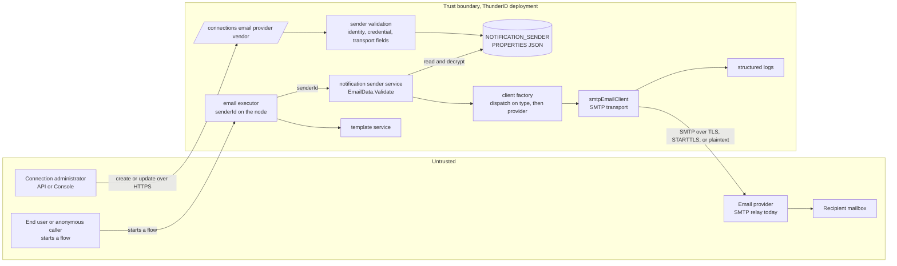
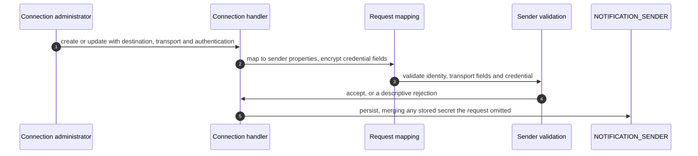
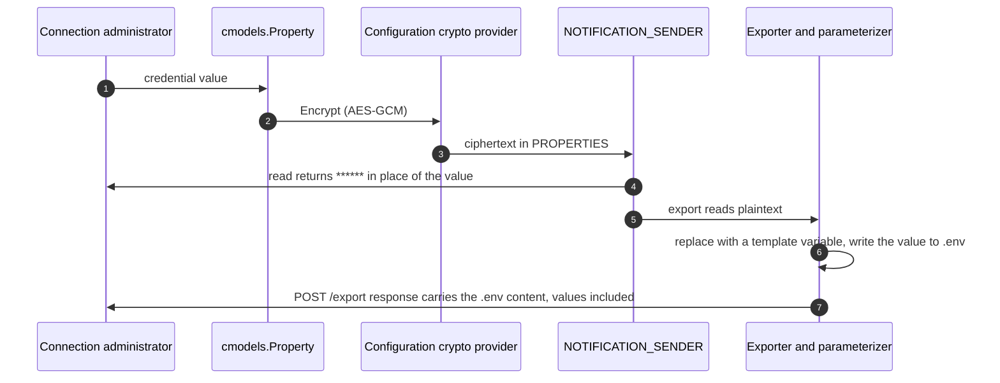
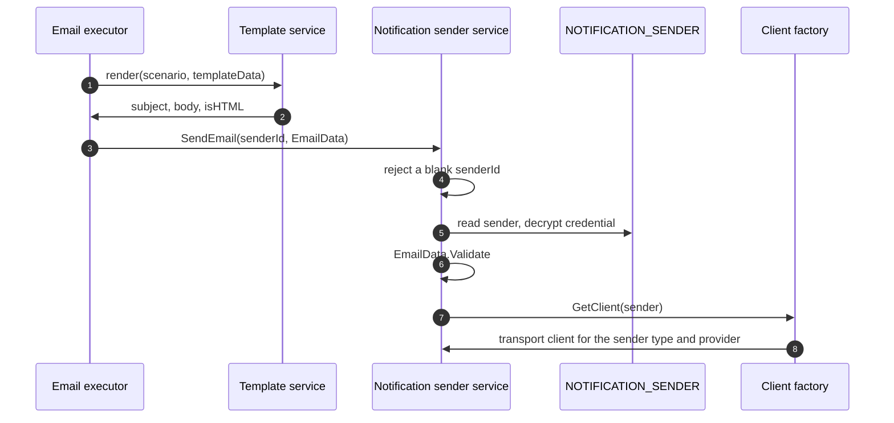
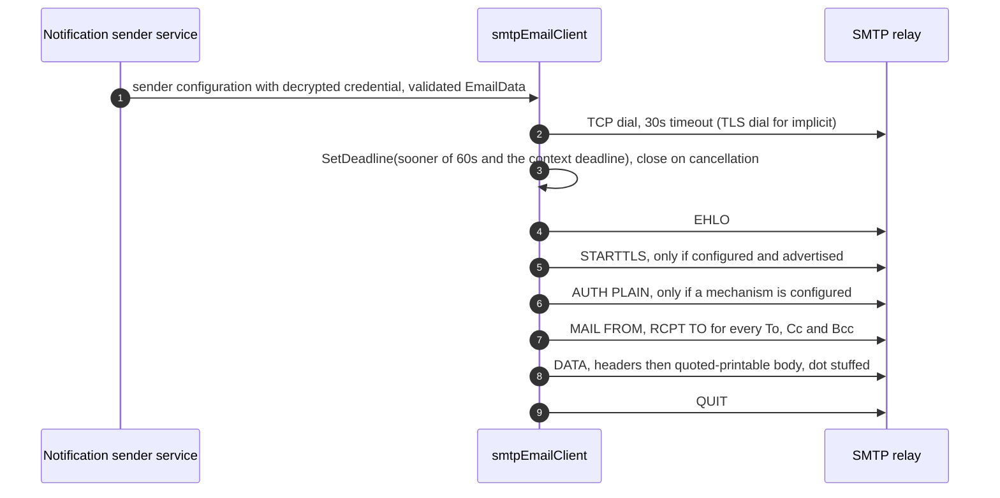
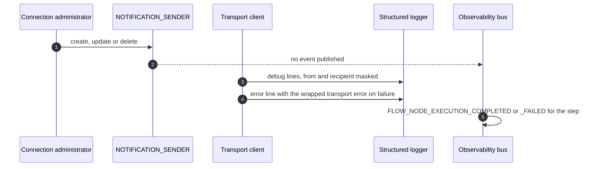

# Email Provider Threat Model

This model covers the email provider connection in ThunderID, meaning the connection record that holds an email provider's destination, sender identity and credential, the `senderId` that names it on a flow's email step, and the outbound delivery of a rendered message to that provider. SMTP is the only transport implemented today and is analysed in its own sub-section. Everything around it is transport-independent and holds for any transport added later.

## Overview

Before this change, email was a static `email.smtp` block in `deployment.yaml`, seeded once at startup, with the password injected by Helm as `SMTP_PASSWORD`. It is now a runtime connection, a row in `NOTIFICATION_SENDER` of type `EMAIL` whose credential is encrypted at rest, created and edited through `/connections/{vendor}` or a declarative document, and named per flow node. There is no deployment-wide default and no automatic migration.

The security-relevant shift is direction and lifetime. The configuration that decides where ThunderID opens an outbound connection, and which credential it presents there, moved from a file an operator edits on disk into a record an API caller can change at runtime. Everything that follows turns on that, namely the address policy for the configured destination, what an update to an existing provider can do to a credential it never read, what the transport guarantees when the message carries a one-time code, and what record is left behind.

The second shift is that the transport is now a property of the connection rather than of the build. The client factory dispatches on the sender type first and the provider name second, `outboundauth` describes a credential without knowing how it will be carried, and `smtpauth` is the binding that turns one into a SASL mechanism. A second email transport, such as a provider reached over HTTP, lands at those seams and inherits every transport-independent control here. It does not inherit the transport-specific ones, which is why they are separated.

Cross-cutting concerns covered elsewhere are the authentication, authorization, input handling and transport of the management API itself, which the common API threat model owns; secret encryption at rest through the configuration crypto provider; flow authoring and the permission model that gates it; OTP generation, validity and verification; and email template rendering. These are trust inputs here, not re-analysed.

## Scope

This model covers the following.

- What an email provider connection establishes about an outbound connection, namely its destination, sender identity, transport selection and credential, and the validation applied to each.
- Storage and reuse of the provider credential, including the update path that carries a stored secret forward and the declarative export path that externalizes it.
- Resolution of the provider at send time through the `senderId` on a flow's email step, and the construction and validation of the message payload.
- Delivery to the provider, with one sub-section per implemented transport. SMTP is the only one today, and its sub-section covers the dial, STARTTLS or implicit TLS, SASL authentication, deadlines, and RFC 5322 message construction.
- The record left behind by a configuration change and by a send.

The following are out of scope. See the referenced companion model or the owning area.

- Authentication, authorization, request validation and transport for the connection endpoints, `/connections/meta` and the usages endpoint. Owned by the common API threat model. This model takes "the caller is authorized to manage connections" as a trust input and analyses what an authorized caller can then cause.
- Encryption of secret property values. Owned by the configuration crypto provider (`crypto.encryption.key`, AES-GCM), used here unchanged through `cmodels.NewProperty`.
- Who may author a flow and set `senderId` on a node. Owned by the flow management area.
- OTP length, validity and attempt limits, magic link minting, and recovery link validity. Owned by the OTP and recovery areas. This model treats the rendered body as carrying a credential and analyses what happens to it in transit.
- Template content and rendering. Owned by the template area.
- The SMS connections that share the sender store and the outbound authentication registry, except where a control is shared and named as such.
- What a provider does with a message after accepting it, and the recipient's mailbox.
- Any email transport other than SMTP. The seams anticipate one and this document is structured for one, but nothing about an unimplemented transport is analysed here. Adding one means adding a sub-section to interaction 04 and re-examining the rows this document marks as transport dependent.

## Architecture

The trust boundary sits at the deployment edge. Two things cross it in the direction that matters here. A destination and a credential come in from a connection administrator, and a message carrying a one-time code or a recovery link goes out to whatever the administrator named, authenticating with the credential they stored. Neither the destination nor the provider is validated against anything the deployment owns.

### Components

Components above the dashed line in the table are transport-independent. They hold the connection, the credential and the message, and a new transport reuses them unchanged. The two marked as SMTP are the transport itself.

| Component | Task |
| --- | --- |
| Connection handlers for the email vendor | CRUD and usages over the shared sender handler. Masks every secret property value on read as `******` |
| Request and response mapping | Maps the wire payload onto sender properties and back. For SMTP, an omitted `tls` resolves to STARTTLS, not plaintext; an invalid one is stored as given so validation rejects it with a descriptive error |
| Sender validation | Runs in the notification service on every write path, so the API, the Console and the declarative loader are validated identically. Rejects a missing or non-bare from address, a display name carrying CR or LF, and a credential the transport cannot carry |
| `outboundauth` registry and `ToProperties` | Declares the authentication methods, which fields each takes, and which of them is a credential, without knowing how any of them will be carried. A credential field is encrypted by `cmodels.NewProperty` on construction. A field the method does not declare is dropped rather than stored, so nothing reaches storage unencrypted by being named something the registry does not know |
| `mergeStoredSecrets` | Carries a stored secret forward when the update omits it, but only while the credential target is unchanged, meaning the authentication type, every non-secret authentication property such as the username, and the vendor's `credentialTargetKeys` (for SMTP, the host and port). Changing any of them drops every `authentication_` secret, so the stored credential is never presented to a destination or identity it was not entered for |
| `emailExecutor` | Reads `senderId` from the node properties and hands it to `SendEmail`. An absent property yields an empty id, which `SendEmail` rejects |
| `notificationSenderService.SendEmail` | Refuses a blank sender id, reads the sender, validates the payload, builds the client, and maps every delivery failure onto a generic internal error so nothing about the provider reaches the caller |
| Client factory | Dispatches on the sender type first and the provider name second, so a provider name can never resolve to a client of the wrong channel. This is the seam a second email transport is added at |
| `connectionExporter` | Renders a connection into a declarative document. It reads secret values in plaintext so the parameterizer can externalize each credential field to a template variable in the generated `.env`; the YAML carries a placeholder. The fields are derived from the registry rather than hardcoded. `POST /export` returns the `.env` content, values included, in the `environment_variables` field of its JSON response, and the Console's export page displays it |
| `smtpauth` (SMTP) | Binds an `outboundauth` configuration to the SASL mechanism `net/smtp` expects. Only `none` and `basic` (SASL PLAIN) are carried today. Nothing in it is reachable from another transport |
| `smtpEmailClient` (SMTP) | Parses the stored configuration, dials with a 30 second timeout, bounds the whole conversation by the sooner of a 60 second deadline and the caller's context deadline, closes the connection when the caller's context is cancelled, performs STARTTLS or implicit TLS, authenticates, builds the RFC 5322 message with a quoted-printable body, and writes it |

### Transports

| Transport | Provider value | Binding and client | Status |
| --- | --- | --- | --- |
| SMTP | `smtp` | `smtpauth`, `smtpEmailClient` | Implemented. Analysed in interaction 04.1 |
| HTTP | none assigned | none | Not implemented. Anticipated by the client factory and by `outboundauth` staying transport neutral. Not analysed here |

### Actors

#### Actors

| Actor | Description | Roles or permissions |
| --- | --- | --- |
| Connection administrator | Creates and edits email provider connections through the Console or the management API, or supplies them as declarative documents | Connection management permission, as the common API threat model defines it |
| Flow author | Sets `senderId` on an email step, choosing which provider a given flow sends through | Flow management permission |
| End user or anonymous caller | Starts a flow that contains an email step, such as password recovery, registration, email OTP or a magic link | None over this feature; the trigger only |
| Operator | Deploys ThunderID and owns `crypto.encryption.key`, network egress policy, the system trust store, and log retention | Deployment configuration |
| Email provider | The destination the connection names. Receives the credential and the message. An SMTP relay today | Whatever the configured credential grants at that destination |
| Network observer | Positioned between ThunderID and the provider | Observation, and modification absent TLS |

#### Entitlement matrix

| Actor | Set the destination | Set or replace the credential | Read the stored credential | Trigger a send | See where a message went |
| --- | --- | --- | --- | --- | --- |
| Connection administrator | [Yes] | [Yes] | [Yes], through `POST /export`, which requires the same root system permission and returns the value in plaintext; masked on every `/connections` read path | [No] directly | [Yes], by reading the connection |
| Flow author | [No] | [No] | [No] | [No] directly | [Yes], for the provider a flow names |
| End user or anonymous caller | [No] | [No] | [No] | [Yes], by starting a flow with an email step | [No] |
| Operator | [Yes] | [Yes] | [Yes], through the database and key | [No] | [Yes], through the logs |
| Email provider | [No] | [No] | [Yes], it is presented on every send | [No] | [Yes], it is the destination |
| Network observer | [No] | [No] | [No], validation refuses authentication over a transport configured without encryption | [No] | [Yes], only on a transport configured without encryption |

### External Dependencies (not owned)

| Dependency | Description (usage, purpose, authentication, authorization, security) |
| --- | --- |
| Email provider | The destination the connection names. ThunderID authenticates to it with whatever the configured method carries, and authenticates it only by the transport's own peer authentication. It is a fully trusted party for the content. Every message ThunderID sends through it carries a one-time code, a magic link or a recovery link, so a provider that reads mail can take over any account whose recovery runs through it. Choosing a trustworthy provider is the operator's decision and is not defensible in product |
| `net/smtp` and `crypto/tls` (SMTP) | The SMTP conversation and its transport. `smtp.PlainAuth` refuses to present credentials over an unencrypted connection unless the server name is localhost, and refuses if the server name does not match the host the credential was bound to. `textproto.DotWriter`, which `Client.Data` returns, performs dot stuffing and turns a bare LF into CRLF. It passes a bare CR through unchanged and does not dot stuff after one, so it is not on its own a defence against SMTP smuggling; see interaction 04.1 threat 6 |
| System trust store (SMTP) | Relay certificate validation. There is no per-connection trust anchor and no client certificate option, so an internal relay behind a private CA needs that CA in the container's trust store |
| Configuration crypto provider | AES-GCM encryption of the credential at rest, keyed from `crypto.encryption.key`. Owned by the key management area |
| Configuration database | `NOTIFICATION_SENDER` holds the connection, with every property in a JSON column, scoped by `DEPLOYMENT_ID`. Reused without schema change |

## Threats and mitigations

### Out-of-scope interactions and risks

- Authentication, authorization and request validation on the connection management endpoints. Owned by the common API threat model.
- Compromise of the configuration crypto key or the key management area. Owned by that area; the credential's confidentiality at rest rests entirely on it.
- Compromise of the provider itself, or of the network between ThunderID and a provider reached over an authenticated, encrypted transport.
- Whether a flow should email an address the caller supplied, and account enumeration through the presence or absence of a message. Owned by the flow designs for recovery and registration.
- The deployment's egress policy. Where a deployment needs the outbound client confined to a set of destinations, that is a network control the operator applies, and this model records it as the compensating control for the address policy rather than implementing it.

### Interactions

Interactions 01, 02, 03 and 05 are transport-independent. They cover the connection record, the credential, the resolution and payload at send time, and the record left behind, and they hold for any email transport. Interaction 04 is where the transport shows through, and it carries one sub-section per implemented transport.

Rows in the transport-independent interactions whose bound or exposure depends on the transport are marked **transport dependent** in the mitigation column. Those are the rows a new transport has to re-examine on its own terms rather than inherit.

#### 01 Registering an email provider

**Description**

A connection administrator creates or updates an email provider connection with a destination, a from address, an optional display name, a transport configuration and an authentication block. Validation runs in the notification service on every path, including the declarative loader, so the API, the Console and an imported document are validated identically.

For SMTP the destination is a host and a port, and the transport configuration is a TLS mode of `none`, `starttls` or `implicit`. The host is accepted as given. There is no address filtering, no scheme restriction, and no check that the port is an SMTP port. `syshttp.IsSSRFSafeURL`, which guards `jwks_uri` elsewhere, requires an HTTPS URL and does not apply to a host and port pair.

**Assets involved**

| Initiator | Intermediate | Target |
| --- | --- | --- |
| Connection administrator | Connection handler, sender validation | `NOTIFICATION_SENDER` |

**Data flow**

**Security considerations**

| Area | Response | Comments |
| --- | --- | --- |
| Data confidentiality | [C-High] | The payload carries the provider credential |
| Communication medium | [M-NT], [M-DB] | |
| Transport security | [TLS] | On the management API and Console listener |
| Authentication | Management API authentication | Owned by the common API threat model |
| Accessibility | [Restricted] | Connection management permission |
| Authorization and Access Control | Connection management permission, the same permission that governs every other connection's secret | |

**Threat assessment**

| ID | Category | Threat | Materializable | Mitigation / comment |
| --- | --- | --- | --- | --- |
| 1 | [Security Risk] | An administrator names a destination inside the deployment's network, and ThunderID opens a connection against it from a network position the administrator does not have, reaching a metadata service, an admin port or a neighbouring service | [Yes] | Accepted, because an internal provider is the common deployment and an address policy that rejected private addresses would reject it. **Transport dependent.** For SMTP the exposure is bounded. `smtp.NewClient` sends nothing until the peer returns a `220` greeting, so a service that does not speak first, such as Redis, receives no bytes and the attempt times out; a service that does greet receives only `EHLO` or `HELO` before the exchange fails. Nothing of the peer's response content reaches the caller (every delivery failure maps to a generic internal error), and the conversation is bounded by a 30 second dial timeout and a 60 second deadline. The time the flow step takes to fail does distinguish a refused port, an open one and a filtered one, so an actor who can also start a flow that uses the provider has a slow reachability probe of the internal network. An HTTP transport would name a URL rather than a host and port, which brings `syshttp.IsSSRFSafeURL` into range, and whether to apply it is a decision that transport must take on its own terms rather than inherit this one. Registration requires an authorized principal either way, so this is a privilege the deployment grants rather than an anonymous one. Residual below, with operator guidance to confine the deployment's egress |
| 2 | [Information Disclosure] | An actor with connection management permission repoints an existing provider at a destination they control, or changes the username, omits the credential so the stored one is carried forward, and receives the deployment's provider credential on the next send. The same path also discloses the credential by accident, since an administrator who migrates a provider to a new relay would otherwise present the old relay's password to a third party | [No] through the update path | `mergeStoredSecrets` carries a stored `authentication_` secret forward only while the credential target is unchanged, meaning the authentication type, every non-secret authentication property, and the vendor's `credentialTargetKeys`, which for SMTP are the host and port. Any change drops the stored secret, and sender validation then refuses the update until a credential is supplied. A value that cannot be read is treated as a change. **Transport dependent.** A new transport must declare its own target keys, or its credential is carried forward whatever the destination. The TLS requirements are not a meaningful bound on their own. `smtp.PlainAuth` binds the credential to the configured server name, but an attacker who configures a name they control obtains a publicly trusted certificate for it in minutes. This mitigation does not change what the same actor can read today, because `POST /export` returns the stored credential in plaintext under the same permission; see interaction 02 threat 1. Its value is closing accidental disclosure, and keeping the update path safe once export and connection management are separately permissioned |
| 3 | [Information Disclosure] | The transport is configured without encryption, so the exchange, including a message carrying a one-time code, a magic link or a recovery link, crosses the network in the clear and an observer can read or replay the credential in it | [Yes] | **Transport dependent.** For SMTP it is bounded rather than closed. The default is STARTTLS, an omitted value resolves to STARTTLS rather than plaintext, and validation refuses plaintext whenever authentication is configured, so it can never expose the SMTP credential. What it still exposes is the message body, which is the account recovery credential. It exists for a relay reached over a trusted path, typically a sidecar or a host-local relay. Residual below, with guidance to prefer STARTTLS or implicit TLS for anything leaving the pod |
| 4 | [Spoofing] | The from address is not verified against any domain the deployment owns, so a provider can be configured to send mail claiming to be from a domain it has no relationship with, and recipients receive convincing mail with ThunderID's content | [No] | The provider is the enforcement point and is the only party that can be. It holds the SPF, DKIM and DMARC posture for the domains it is allowed to send for, and rejects or fails to align a sender it does not authorize. ThunderID cannot verify domain ownership without becoming a mail administration product. The actor needs connection management permission, and the from address is visible on every read of the connection |
| 5 | [Tampering] | A display name or a from address carrying CR or LF ends a message header and lets the rest be read as headers of its own, adding a `Bcc` that silently copies every message ThunderID sends | [No] | `IsValidEmailAddress` rejects any value containing CR or LF before trimming, and rejects display-name forms so only a bare address is stored. `IsValidHeaderText` rejects CR or LF in the display name. Both run in the sender service rather than in the SMTP client, so the values are clean before any transport sees them and a new transport inherits the guarantee. What SMTP then does with them is interaction 04.1 threat 7 |
| 6 | [Elevation of Privilege] | Authentication is turned off and later turned back on, and the credential the operator believed was removed is silently reused, or a switch between methods leaves the previous method's credential behind for a later switch back | [No] | The authentication type is part of the credential target `mergeStoredSecrets` compares (threat 2). Changing the method, or turning authentication off, drops every `authentication_` secret rather than keeping it. The type property is not secret, so the comparison needs no decryption |
| 7 | [Security Risk] | A payload names an authentication method the deployment does not implement, or one the transport cannot carry, or carries a credential under a field name the registry does not declare, and the value reaches storage unencrypted or fails only when mail is sent | [No] | `ToProperties` resolves the method from the registry and writes only the fields that method declares, dropping anything else, so a value can only be stored under a declared field and a field marked `Credential` is encrypted on construction. `outboundauth.Validate` is given the set of methods the transport supports, which the transport binding itself declares, so a method it cannot carry is refused at configuration time rather than at send time. An unknown method is refused with `CON-1005`, and the Console renders the method list from `GET /connections/meta`, which is served from the same registry |

#### 02 Storing and reusing the provider credential

**Description**

A credential field is encrypted with AES-GCM by `cmodels.NewProperty` and stored in the `PROPERTIES` JSON column. Every read path through the connection API replaces a secret value with `******`. An update may omit the credential, in which case the stored value is carried forward while the credential target is unchanged (interaction 01 threat 2). The declarative export path deliberately reads the plaintext value so the parameterizer can externalize it to the generated `.env` content, leaving a placeholder in the YAML. That content is not only written to disk. `POST /export` returns it, values included, in the `environment_variables` field of the JSON response, and the Console's export page displays it. The endpoint has no entry of its own in the API permission map, so it requires the root system permission, which is also what `/connections` requires. None of this is transport-specific. The registry decides which fields are credentials, and the storage path treats them the same however they are later carried.

**Assets involved**

| Initiator | Intermediate | Target |
| --- | --- | --- |
| Connection administrator, exporter | `cmodels.Property`, configuration crypto provider | `NOTIFICATION_SENDER`, generated `.env` |

**Data flow**

**Security considerations**

| Area | Response | Comments |
| --- | --- | --- |
| Data confidentiality | [C-High] | A provider credential grants the ability to send mail as the deployment |
| Communication medium | [M-DB], [M-NT], [M-FS] | Database at rest, the export API response, and wherever the caller saves the export |
| Transport security | [TLS] on the API, [Not Encrypted] for the saved `.env` | Once the export response is saved, the `.env` is a plaintext file the caller handles |
| Authentication | Management API authentication | Both `/connections` and `/export` |
| Accessibility | [Restricted] | |
| Authorization and Access Control | Root system permission for both the connection endpoints and `POST /export`, so reading the credential needs no permission beyond managing the connection | |

**Threat assessment**

| ID | Category | Threat | Materializable | Mitigation / comment |
| --- | --- | --- | --- | --- |
| 1 | [Information Disclosure] | The credential is readable through the management API, so anyone who can manage connections holds the deployment's provider credential | [Yes] | On the `/connections` read path it is not. `propertyValues` replaces every secret value with `******` before the response model is built, and `authenticationFromValues` rebuilds the authentication block from that already-masked map rather than from the properties, so the plaintext cannot be reached there even by a later change to the mapping. The Console blanks the mask on load and never sends it back. `POST /export` does return it. The connection exporter reads the plaintext through `rawPropertyValues`, the export service writes it into the `.env` content, and the handler returns that content in the response under the same root system permission. The comment on `rawPropertyValues`, that the value never reaches an external response, does not hold. Pre-existing for every connection secret, including OIDC client secrets and SMS provider tokens, rather than introduced here. Residual below |
| 2 | [Information Disclosure] | The credential is recoverable from a database backup or a compromised database host | [No] | Stored as AES-GCM ciphertext keyed from `crypto.encryption.key`, so the database alone is not enough. The key is a file the deployment reads (by default the `config/certs/crypto.key` file), so a host compromise that reaches both does recover it. That is the key management area's posture and is not specific to this feature |
| 3 | [Information Disclosure] | A declarative export carries the provider credential in plaintext through the API response and the Console's export page to the caller's machine, and the saved `.env` is committed to the GitOps repository along with the YAML it accompanies | [Yes] | By design, and the same treatment every other connection secret already receives. The YAML carries a template variable and the value goes to the `.env`, which exists so the value can be handled as a secret separately. The credential fields are derived from the registry rather than hardcoded, so a new method or a new transport cannot ship without its secret being externalized. What remains is that the value leaves the server at all on an API call, and an obligation on whoever saves the export to keep the `.env` out of version control, which the export guidance must state. Leaving secret variables empty in an API export by default, with an explicit opt-in to include them, would close the first. Residual below |
| 4 | [Information Disclosure] | The credential reaches the logs, either directly or inside an error from the provider | [No] | Nothing logs the credential. The from address is logged with `log.MaskedString` at debug level, the recipient likewise, and a send failure logs the wrapped transport error, which carries the provider's status line and not the secret. `SendEmail` maps every delivery failure onto a generic internal error, so nothing about the provider reaches the API caller either |
| 5 | [Information Disclosure] | The credential sits in `deployment.yaml`, in a rendered Kubernetes Secret, and in the pod's environment as `SMTP_PASSWORD`, reachable by anyone who can read the pod spec or exec into the container | [No] | Closed by this change. The `email.smtp` block, the `smtp-password` Secret key and the `SMTP_PASSWORD` environment variable are all removed. The credential now exists only as ciphertext in the configuration database, and on the export path as described in threat 3 |
| 6 | [Tampering] | An API client that is not the Console reads a connection, sends the whole response back as an update, and stores the literal `******` as the credential, breaking delivery until someone notices | [No] for confidentiality, noted as a footgun | The merge is presence-based on purpose. A caller that never read the secret can omit the field, which is what makes the credential write-only. The Console blanks the mask on load and refuses to send it back. The cost of the naive round trip is a broken provider and an authentication failure on the next send, not an exposure. The API documentation states that a secret is omitted to keep the stored value |

#### 03 Resolving the provider and building the message

**Description**

The email executor renders the template and reads `senderId` from the node properties. `SendEmail` refuses a blank id, reads the sender, and validates the payload before any client is built. `EmailData.Validate` trims and checks every address in `To`, `Cc` and `BCC`, rejects a payload with no recipient, and rejects a subject carrying CR or LF. The client factory then dispatches on the sender type first and the provider name second. Everything in this interaction happens before a transport is chosen.

**Assets involved**

| Initiator | Intermediate | Target |
| --- | --- | --- |
| Flow email step | Template service, notification sender service, client factory | A transport client, then the provider |

**Data flow**

**Security considerations**

| Area | Response | Comments |
| --- | --- | --- |
| Data confidentiality | [C-High] | The payload carries a one-time code, a magic link or a recovery link, and the recipient's address |
| Communication medium | [M-IN], [M-DB] | In process, over a read of the sender record |
| Transport security | [Not Encrypted] | In-process calls inside the trust boundary; transmission is interaction 04 |
| Authentication | The flow that reached this point is already authenticated or is a deliberately anonymous path such as recovery | |
| Accessibility | [Internal] | Not reachable from outside the process |
| Authorization and Access Control | The recipient is resolved by the flow; no caller-supplied header or envelope field exists | |

**Threat assessment**

| ID | Category | Threat | Materializable | Mitigation / comment |
| --- | --- | --- | --- | --- |
| 1 | [Tampering] | A recipient address or a subject carrying CR or LF injects additional fields into whatever the transport builds, adding a `Bcc` that copies a password reset link to an attacker | [No] | `EmailData.Validate` rejects any address containing CR or LF before trimming, requires every address to round-trip through `mail.ParseAddress` unchanged (so a display-name form is refused), and rejects a subject containing CR or LF. The recipient itself is resolved from flow data rather than from a header the caller controls. The check runs in the notification service, before a client exists, so it holds for every transport. **Transport dependent** only in what a bad value would have cost; SMTP's own rendering is interaction 04.1 threat 7 |
| 2 | [Information Disclosure] | The provider reads every message, so whoever operates it holds every one-time code, magic link and recovery link the deployment issues and can take over any account whose recovery runs through it | [Yes] | Inherent to email as a delivery channel and not closable in product. What bounds it is the short validity of what the message carries, which the OTP and recovery areas own, and the operator's choice of provider. It is recorded here because moving the provider from a file to a runtime record makes that choice something an API caller can change; see interaction 01 threat 2. Residual below |
| 3 | [Denial of Service] | An anonymous caller repeatedly starts a flow with an email step, naming addresses of their choosing, and ThunderID becomes a source of unsolicited mail that exhausts the provider's quota and burns its sending reputation, after which no legitimate recovery mail is delivered | [Yes] | There is no rate limiting framework in the repository, so there is no send-rate control in the product. The OTP executor caps verification attempts per execution, which does not bound how many executions are started. Every message is a fixed template with no caller-supplied body, so the deployment cannot be used to send arbitrary content, only its own notifications. The controls available today are the provider's own rate limits and quota, and an edge rate limit in front of the flow endpoints. Residual below |
| 4 | [Denial of Service] | The provider a flow names is deleted, or its `senderId` is left unset, and password recovery, email OTP and invitations stop working with no fallback | [Yes] | This is deliberate. Removing the deployment-wide default is what makes every send attributable to a named provider. The usages endpoint lists the flows referencing a connection and drives a pre-delete confirmation, but does not block the delete. An unset sender surfaces as `FET-1038` to the caller and a Console warning on the step, and `MNS-1017` names the remedy. Every upgrade from a `deployment.yaml` configured deployment lands in this state until a provider is created, which is why it is a documented breaking change. Residual below |
| 5 | [Spoofing] | The `senderId` on a node names an SMS connection or an arbitrary id, and the message is dispatched through a client of the wrong channel | [No] | `SendEmail` refuses a blank id, and the client factory dispatches on the sender type before the provider name, so a message-type sender cannot resolve to an email client. A type mismatch is caught by the `EmailClientInterface` assertion and returns `ErrorRequestedSenderIsNotOfExpectedType`. The same dispatch keeps a second email transport from being reached by an SMS sender, and the reverse |

#### 04 Delivering to the provider

This is where the transport shows through. Everything above is shared; nothing below is. One sub-section per implemented transport, each carrying its own assets, data flow, security considerations and threat assessment.

**Adding a transport.** A new transport adds a sub-section here, and re-examines on its own terms the rows marked transport dependent above. Those are interaction 01 threats 1, 2 and 3 (the address policy, the credential target keys that stop a stored credential following a repointed destination, and the unencrypted option) and interaction 03 threat 1, where the shared validation's value depends on what the transport would otherwise have built. It also declares the authentication methods it can carry, so `outboundauth.Validate` refuses the rest at configuration time.

##### 04.1 SMTP

**Description**

On each send the notification sender service builds a fresh `smtpEmailClient` from the decrypted sender. The client dials with a 30 second timeout, using a direct TLS connection for implicit TLS, sets a deadline covering the whole conversation at the sooner of 60 seconds and the caller's context deadline, closes the connection when the caller's context is cancelled, performs STARTTLS when configured, and authenticates. There is no connection pooling and no cap on how many sends run at once. It then builds the RFC 5322 message with a `From`, `To`, optional `Cc`, a Q-encoded `Subject`, a `Date`, a random `Message-ID` on the from address's domain, a content type of `text/html` or `text/plain` in UTF-8, and a `Content-Transfer-Encoding` of `quoted-printable`. BCC recipients are placed in the envelope only. The body is quoted-printable encoded and written through the writer `Client.Data` returns.

**Assets involved**

| Initiator | Intermediate | Target |
| --- | --- | --- |
| Notification sender service | `smtpEmailClient`, `net/smtp`, `crypto/tls` | SMTP relay, then the recipient's mailbox |

**Data flow**

**Security considerations**

| Area | Response | Comments |
| --- | --- | --- |
| Data confidentiality | [C-High] | The credential is presented on this connection and the body carries the account recovery credential |
| Communication medium | [M-NT] | Outbound from inside the trust boundary |
| Transport security | [TLS] for `starttls` and `implicit`, [Not Encrypted] for `none` | Minimum TLS 1.2, server name pinned to the configured host, system roots. The plaintext case is the accepted deviation in interaction 01 threat 3 |
| Authentication | SASL PLAIN when basic authentication is configured; the peer is authenticated only by TLS | |
| Accessibility | [Public] | The destination is whatever the administrator named |
| Authorization and Access Control | Destination fixed by the stored connection; no per-send destination input exists | |

**Threat assessment**

| ID | Category | Threat | Materializable | Mitigation / comment |
| --- | --- | --- | --- | --- |
| 1 | [Information Disclosure] | An on-path attacker strips the STARTTLS capability from the relay's EHLO response, the client continues on the plaintext connection, and the credential and the message are exposed | [No] | The client fails closed twice over. It checks for the advertised extension and returns `STARTTLS not supported by server` rather than continuing, and even if that check were removed, `smtp.PlainAuth` refuses to present credentials on a connection whose TLS state is false unless the server name is localhost. The localhost exemption is `net/smtp`'s and is the intended carve-out for a host-local relay |
| 2 | [Spoofing] | The relay presents a certificate for a different name, or a self-signed one, and ThunderID completes the handshake anyway, delivering the credential and the message to whoever intercepted the connection | [No] | `tls.Config` sets `ServerName` to the configured host and `MinVersion` to TLS 1.2, and nothing sets `InsecureSkipVerify`. Verification is against the system roots. `smtp.PlainAuth` additionally refuses if the server name does not match the host the credential was built for |
| 3 | [Operational Risk] | An internal relay uses a private CA, the handshake fails, and the operator's only in-product remedy is to set `tls` to `none`, turning a certificate problem into a plaintext one | [Yes] | There is no per-connection trust anchor and no client certificate option, so the operator's correct move is to add the CA to the container's trust store. That is a documented deployment step rather than a product control, and the shape of the failure makes the wrong move the easy one. Residual below |
| 4 | [Denial of Service] | A hung or hostile relay holds the calling goroutine open, and under a burst of flows the process accumulates SMTP connections until it runs out of file descriptors or the relay throttles the deployment | [Yes] | Each attempt is bounded by a 30 second dial timeout and a deadline covering the whole conversation at the sooner of 60 seconds and the caller's context deadline, set explicitly because `net/smtp` sets no deadlines of its own and takes no context, so a relay that accepts and then stalls would otherwise block forever. When the caller's context is cancelled, for example because the client that started the flow disconnected, `context.AfterFunc` closes the connection and unblocks whatever call is in flight, so an abandoned request does not hold its connection for the rest of the deadline. There is no ceiling on concurrent sends, no pooling and no queue, so concurrency is whatever flow volume produces. Each connection is small and short lived, and a send failure fails only its own flow step, not the flow engine. Residual below |
| 5 | [Security Risk] | A stored configuration that no longer parses, for example a TLS mode or a port written directly into the database, causes the client to fall back to a weaker transport | [No] | `parseSMTPConfig` starts from STARTTLS and re-runs `validateSMTPConfig` on every client construction, so a value that fails to parse produces a client construction error and no connection, not a downgrade. The same rules that ran on write run again on read |
| 6 | [Tampering] | The rendered body contains a line consisting of a single dot, or an end-of-data sequence built from a bare CR or bare LF (`\r.\r\n`, `\n.\n`) that a lenient relay accepts, ending the DATA phase early and letting the remainder be read as SMTP commands (SMTP smuggling), which would let template content forge envelope recipients or a second message | [No] | Two layers, and the order matters. The body is first quoted-printable encoded, and `quotedprintable.Writer` turns every bare CR and bare LF into CRLF, so no bare line terminator reaches the wire. The encoded body is then written to the writer `Client.Data` returns, a `textproto.DotWriter`, which dot stuffs every line that begins with a dot. `DotWriter` alone is not enough, because it turns a bare LF into CRLF but passes a bare CR through unchanged and does not dot stuff after one, so `\r.\r\n` would survive it. The quoted-printable encoding is therefore the control against smuggling, and switching the body to 8-bit or binary transfer would reopen it. The body is also written after the blank line that ends the header block, so it cannot reach the header parser regardless. A test that sends a body containing `\r.\r\n` and `\n.\n` and asserts the DATA stream carries no line consisting of a single dot would keep this from regressing |
| 7 | [Tampering] | A from address, display name or subject that reached the client intact is rendered into the header block in a way that breaks it, undoing the validation in interactions 01 and 03 | [No] | The display name and address go through `mail.Address.String`, which quotes and MIME encodes, so a name carrying a comma, a quote or non-ASCII still renders as one valid address. The subject is Q-encoded, which encodes anything non-ASCII rather than emitting it raw. The envelope sender and the `Message-ID` domain read the bare address, which is what they require |
| 8 | [Information Disclosure] | BCC recipients appear in the message headers, disclosing to every recipient who else was copied | [No] | BCC is deliberately absent from the header block and travels in the envelope only. The email executor sends to a single recipient today, so this is a latent property of the client rather than a live path |
| 9 | [Denial of Service] | The credential is decrypted on every send rather than once, so a high send rate multiplies key operations | [No] | One AES-GCM decryption per send against an in-memory key, which is negligible beside the network round trips it precedes. Rebuilding the client per send is what keeps a configuration change effective immediately rather than until the next restart |

#### 05 Recording the configuration change and the send

**Description**

A connection create, update or delete writes to `NOTIFICATION_SENDER` and produces no observability event. A send produces debug-level log lines with the from address and the recipient masked, and on failure an error line carrying the wrapped transport error. The surrounding flow node emits `FLOW_NODE_EXECUTION_COMPLETED` or `FLOW_NODE_EXECUTION_FAILED`.

**Assets involved**

| Initiator | Intermediate | Target |
| --- | --- | --- |
| Connection handler, transport client | Structured logger, observability bus | Operator's log store and sink |

**Data flow**

**Security considerations**

| Area | Response | Comments |
| --- | --- | --- |
| Data confidentiality | [C-Medium] | The records associate a flow execution with a send outcome |
| Communication medium | [M-NT], [M-FS] | Depends on the sink the operator configured |
| Transport security | [TLS] | Owned by the sink configuration |
| Authentication | Sink authentication, owned by the operator | |
| Accessibility | [Restricted] | Operator access to logs and events |
| Authorization and Access Control | Owned by the observability area and the deployment | |

**Threat assessment**

| ID | Category | Threat | Materializable | Mitigation / comment |
| --- | --- | --- | --- | --- |
| 1 | [Repudiation] | A message that never arrived leaves no trace, so an incident responder cannot tell whether a recovery mail was sent, which provider handled it, or why it failed | [Yes] | The flow node execution events record that the step ran and whether it failed, which is the coarse record. Below that there is no event for a send and no Info-level log line. The successful path logs at debug only, and the failure path logs an error without the provider id. Nothing correlates a send to the connection that carried it. Residual below |
| 2 | [Repudiation] | A provider is repointed at an attacker-controlled destination and repointed back, or its credential is read out through `POST /export`, and nothing records that it happened, who did it, or what the destination was before, so the interval cannot be reconstructed during an investigation | [Yes] | The most consequential detection gap here. Repointing no longer carries the stored credential forward (interaction 01 threat 2), but a repointed provider still receives every one-time code and recovery link the deployment sends through it, and the export path still returns the credential; neither leaves a record. There is no observability event for a connection create, update or delete, and therefore no old-to-new difference either, and none for an export. `UPDATED_AT` on the row is the only signal, and it does not say what changed or who changed it. Pre-existing across the connection and export areas rather than introduced here, surfaced because the destination and the credential are a pair worth diffing. An Info-level structured log line on each connection change, naming the actor, the connection, the non-secret keys that changed and whether the credential was replaced, kept or dropped, and one on each export that includes connections, would close most of it without the observability framework. Residual below, and checklist items 13 and 14 |
| 3 | [Information Disclosure] | The recipient's address or the message body reaches the log store, putting personal data and a live one-time code in a system with a long retention | [No] | The recipient is logged with `log.MaskedString` and only at debug level, the from address likewise, and neither the body nor the subject is logged anywhere. A send failure logs the wrapped transport error, which carries the provider's status line |
| 4 | [Tampering] | A provider whose destination an attacker chose returns a crafted status line, which is wrapped into an error and logged, forging additional log records or breaking a downstream parser | [No] | The provider's text is carried as a value in a structured log field, and both the JSON and the text `slog` handlers escape it, so it cannot terminate the record. Nothing parses the status line; only the presence of an error influences behaviour |

## Security Review Checklist

A review aid that complements the threat model. Guidance follows the [OWASP Top 10 Proactive Controls](https://top10proactive.owasp.org/). Where an answer depends on the transport it is given for SMTP, the only one implemented.

### Security considerations

| # | Consideration | State | Comments |
| --- | --- | --- | --- |
| 1 | Are all inputs and outputs validated (syntactic and semantic)? | [Yes] | Sender validation runs in the notification service, so the API, the Console and the declarative loader are validated identically. The from address must be a bare RFC 5322 address with no CR or LF, the display name must be free of CR or LF, and authentication is checked against the registered method's declared fields and against the set the transport can carry. For SMTP it adds host present, port 1 to 65535, TLS mode one of three values, and authentication refused over a plaintext transport; the same validation runs again when the client is built from stored values. At send time `EmailData.Validate` re-checks every address and the subject. The only input from the provider is its status line, which is logged and otherwise unread. The destination itself is deliberately not constrained; see the residual risks |
| 2 | Are rate limits in place where necessary? | [No] | The repository has no rate limiting framework and this feature adds none. Each SMTP send is bounded in time (30 second dial, 60 second conversation) but there is no cap on concurrent sends and no cap on send volume. Volume is driven by flow executions, which an anonymous caller can start on the recovery and registration paths. The provider's own quota and an edge rate limit in front of the flow endpoints are the controls available to an operator today. Interaction 03 threat 3 |
| 3 | Are permissions, roles, and entitlements defined on the principle of least privilege and business need? | [Partial] | Configuring a provider requires the root system permission, the same permission that already governs every other connection's secret; there is no connection-specific permission. The credential is write-only through `/connections`, but `POST /export` returns it in plaintext under that same permission, so there is no way to grant connection management without granting read access to every stored connection credential. A flow author selects a provider but cannot read or change its credential. No new role or permission is introduced |
| 4 | Are authentication and authorization validated at both the UI and API layers, front end and back end, before granting access to resources? | [Yes] | The Console writes through the same connection endpoints, and validation runs server side in the notification service on every path. Console-side validation, including the transport policy that refuses credentials over a plaintext connection, is for feedback only and is not the enforcement point. The authentication method list the Console renders comes from `GET /connections/meta`, which is served from the same registry the server validates against |
| 5 | Are proper isolations in place between components to ensure least-privilege access and reduce the blast radius against lateral movement? | [Partial] | Within the process the seams are clean. `outboundauth` stays transport neutral, `smtpauth` owns the SMTP binding and is unreachable from another transport, the client factory dispatches on the sender type before the provider name, and the notification service learns nothing about connections beyond a sender DTO. At the network layer the transport client shares the deployment's egress with every other outbound call and applies no destination restriction of its own. Confining that egress is available to the operator as a deployment control and is recommended in the residual risks |
| 6 | Have any default credentials been changed, and are default superuser or root accounts not in use (when using third-party components)? | [Yes] | Improved by this change. The sample `deployment.yaml` previously shipped a working `email.smtp` block with `dev` as both the username and the password. That block is removed, and there is no default provider, so email does not work until one is configured |
| 7 | Has the implementation followed best-practice guidelines (OWASP, Kubernetes, vendor, or technology provider)? | [Yes] | The SMTP transport follows RFC 5321 and RFC 5322 for the envelope and the message, RFC 3207 for STARTTLS, RFC 4616 for SASL PLAIN, and RFC 2047 for the encoded subject. The transport rules follow RFC 8314's direction. Implicit TLS is offered, STARTTLS is the default, and credentials are refused over a plaintext connection. Plaintext without authentication remains available for a host-local relay and is not the default |
| 8 | Are secrets, credentials, and internal-only material kept out of the public source tree and its git history? | [Yes] | The sample credentials in `deployment.yaml` are removed rather than replaced, and nothing takes their place. The remaining values in tests and in the declarative integration fixture are self-evidently fictional (`declarative-secret` against `smtp.declarative.example.com`) and reach no real service |
| 9 | Was a security-focused code review conducted for this change, and have the findings been addressed? | [Partial] | This document follows the implementation in [#5495](https://github.com/thunder-id/thunderid/pull/5495) and [#5496](https://github.com/thunder-id/thunderid/pull/5496) rather than preceding it. The points to verify in review are the masked read path, the credential target condition on the secret merge, the STARTTLS required-if-configured check, the absence of `InsecureSkipVerify`, the header validation on the from address and display name, and the quoted-printable body encoding that the smuggling defence rests on. Review found that `POST /export` returns connection credentials in plaintext (interaction 02 threat 1), which is pre-existing and recorded as a residual rather than fixed here |
| 10 | Is Static Analysis (SAST) or IaC scanning conducted, and are findings addressed? | [Yes] | `gosec` runs as part of the backend golangci-lint configuration, which `make pr_checks` gates on |
| 11 | Is Software Composition Analysis (SCA) conducted or integrated into the repository, and are findings addressed (for example FOSSA, Trivy)? | [Partial] | Go dependency changes are validated against the dependency registry on every pull request that touches `go.mod`, and npm advisories have a documented remediation workflow. There is no continuous vulnerability scan of the full dependency set. This feature adds no dependency, since the SMTP transport is `net/smtp` and `crypto/tls` from the standard library |
| 12 | Is Dynamic (DAST) or API scanning conducted on a non-production setup, and are findings addressed? | [No] | No DAST pipeline exists. The outbound half of this feature is not what an inbound scanner exercises in any case; it is covered by unit tests against a scripted SMTP server and by the end-to-end mock email flows |
| 13 | Are audit logs generated in a standardized format for critical functionality, and available to authorized users to trace critical events and aid incident response? Note the retention period in Comments. | [No] | No observability event is published for a connection change, for an export that returns a connection credential, or for a send. The flow node execution events record that an email step ran and whether it failed, which does not identify the provider or the outcome of the delivery. Retention is the operator's and is not set by the project. Interaction 05 threats 1 and 2 |
| 14 | Do audit logs for critical configuration changes record the difference between the old and new versions? | [No] | Connection changes are not recorded at all, so there is no difference to record. Repointing a provider's destination is the change most worth diffing. It no longer carries the stored credential forward, but it redirects every message the provider sends. Recorded as a residual rather than fixed here |
| 15 | Are data in transit and at rest encrypted? | [Partial] | At rest, the credential is AES-GCM ciphertext keyed from `crypto.encryption.key`; the destination and addresses are configuration rather than secrets and are stored in the clear. In transit over SMTP, STARTTLS is the default and implicit TLS is available, both at TLS 1.2 or above with the server name pinned and system-root verification. A `tls` value of `none` is accepted and is not encrypted; validation refuses it whenever authentication is configured, so it can never expose the credential, but it does expose the message |
| 16 | Are sensitive values such as credentials and keys stored in a secret store or vault? | [Partial] | The credential is encrypted in the configuration database rather than held in a dedicated secret store; the encryption key is what the operator places in a secret store. This change narrows the exposure it replaces, since the Helm-rendered Secret key and the `SMTP_PASSWORD` environment variable are gone. On the declarative path the value is externalized to a generated `.env`, which `POST /export` returns in its response and the caller then handles as a secret |
| 17 | Is personal, sensitive, or confidential data kept out of logs? | [Yes] | The recipient and the from address are logged only at debug level and only through `log.MaskedString`. The subject, the body, and the credential are not logged anywhere. A send failure logs the provider's status line and no payload |
| 18 | Have users been given clear instructions for secure usage? | [Partial] | The breaking change notes carry the migration and the property mapping. The documentation still owes guidance that the provider is a fully trusted party because it can read every one-time code and recovery link, that STARTTLS or implicit TLS should be used for anything leaving the pod, that an internal relay behind a private CA needs that CA in the trust store rather than setting `tls` to `none`, that a declarative export, through the API or the Console, returns the credential in plaintext in the generated `.env`, that changing a provider's host, port, username or authentication method requires re-entering the credential, and that a deployment which needs the transport client confined to known destinations should apply an egress policy |

### Business impact and resilience

For an open-source component, most of these are shared with the operator who deploys it.

| # | Consideration | State | Comments |
| --- | --- | --- | --- |
| 1 | Has a business impact analysis been done to identify resilience requirements (maximum tolerable downtime, uptime, RPO, RTO)? | [N/A] | Owned by the deployer. What this design fixes is the blast radius, because a send failure fails one flow step and returns a typed error, and never the flow engine or authentication as a whole. What it widens is the dependency. With no deployment-wide default, every email path depends on a provider existing and being named |

The resilience details for this area are as follows.

- **High availability.** The transport client is stateless and built per send, so replicas need no coordination and a configuration change takes effect on the next send rather than at the next restart.
- **Disaster recovery.** The connection is a row in the configuration database and is covered by that database's backup. The encryption key must be restored with it, or the credential is unrecoverable and must be re-entered.
- **Backups and retention.** No new table and no new retention requirement.
- **Health checks.** None specific to email. A provider that cannot deliver is discovered on the next flow that uses it, which is a recovery or registration attempt by a real user. A connection test action would be the operational improvement here and does not exist.
- **User banners.** Not applicable.

### Dependency and component health

| # | Consideration | State | Comments |
| --- | --- | --- | --- |
| 1 | Are dependencies, base images, and runtimes monitored for known vulnerabilities and kept current (for example automated dependency scanning), and are findings addressed? | [Partial] | As checklist item 11. This feature adds no dependency and uses only `net/smtp`, `crypto/tls`, `net/mail` and `mime` from the standard library |
| 2 | Are any End-of-Life or End-of-Service components in use? | [No] | `net/smtp` is frozen rather than deprecated. It receives security fixes but no new features, which is why the deadlines, the STARTTLS check and the session bounds are set by the client rather than relied on from the package |
| 3 | Is hardening guidance published for operators who deploy the project (optional)? | [No] | The egress and provider-trust guidance this feature warrants does not exist yet. See checklist item 18 and the residual risks |

### Privacy considerations

The feature processes one personal identifier directly, the recipient's email address, and carries whatever the template renders about that user in the message body.

| # | Consideration | State | Comments |
| --- | --- | --- | --- |
| 1 | Is the purpose and legal basis for processing personal data clearly defined? | [Yes] | The purpose is to deliver an authentication or account recovery message the user's own action triggered. The controller is the deployer |
| 2 | Are the collection, storage, processing, sharing, archival, and disposal of personal data aligned with the data minimization principle? | [Yes] | The address is read from the flow context or the user entity and used for one message. Nothing about the recipient is stored by this feature, and the message is not retained after the provider accepts it |
| 3 | Is personal data stored securely? | [Yes] | Nothing new is stored. The connection holds a from address and a display name, which are the deployment's own identity rather than a user's |
| 4 | Are privacy notices updated to reflect any new processing or changes to purpose and legal basis? | [N/A] | Owned by the deployer. The processor is the provider the deployer chose, which is the same relationship the previous `deployment.yaml` configuration created |
| 5 | Is access to personal data granted on a need-to-know basis? | [Yes] | The address reaches the provider and no other party. It is masked in the logs and never returned by the connection API |
| 6 | Are data retention requirements considered? | [Yes] | Nothing is retained in ThunderID. Retention at the provider and in the recipient's mailbox is outside the deployment |
| 7 | Is there a process to dispose of personal data on request in a timely manner while meeting retention requirements? | [N/A] | Owned by the user area; this feature retains nothing to dispose of |
| 8 | Are records of personal-data processing maintained in the project's data inventory or records of processing? | [N/A] | Owned by the deployer, who also chose the provider |

## Residual risks (open items)

Risks marked (SMTP) belong to that transport and would have to be re-established, not inherited, by another.

- **Outbound connection to an administrator-chosen destination, with no address policy.** An internal provider is the common deployment, so rejecting private addresses would reject the normal case. For SMTP the exposure is bounded. Nothing is sent until the peer greets, nothing of the peer's response content reaches a caller, and every attempt is bounded by a dial timeout and a conversation deadline. How long a send takes to fail still reveals whether an internal port is open, so an actor who can also start a flow has a slow reachability probe. Confining the deployment's egress is the compensating control and belongs in operator guidance. A transport reached over HTTP would bring `syshttp.IsSSRFSafeURL` into range and must decide on it explicitly.
- **The management API returns the stored credential in plaintext through `POST /export`.** The export response carries the generated `.env` content, values included, and the Console displays it. It requires the root system permission, which is also what connection management requires, so any actor who can manage connections can read every connection credential, this provider's included. Pre-existing across every connection secret rather than introduced here, and it makes the write-only treatment on `/connections` a convention rather than a boundary. Leaving secret variables empty in an API export by default, with an explicit and audited opt-in to include them, is the fix, and belongs to the export area.
- **Credential target binding covers the email provider only.** Repointing an email provider now drops its stored credential. The identity provider update path shares `mergeStoredSecrets` but declares no credential target keys, and an OIDC or OAuth client secret is not an `authentication_` property, so changing a connection's token endpoint still carries its client secret forward to the new endpoint. Outside this feature, recorded because the control is shared.
- **No audit record of a connection change or an export, and therefore no old-to-new difference.** There is no observability event for a connection create, update or delete, or for an export that returns a credential. The destination and credential pair is the change most worth diffing. Pre-existing across the connection and export areas, surfaced here.
- **No record of a send.** No event and no Info-level log line says that an email was sent, through which provider, or why it failed. Only the flow node execution event marks that the step ran.
- **Plaintext transport remains available (SMTP).** A `tls` value of `none` is accepted when authentication is off, which exposes the message body, and the body carries the account recovery credential. Default is STARTTLS and the plaintext choice is explicit; guidance should confine it to a host-local or sidecar relay.
- **No in-product trust anchor for a private CA (SMTP).** An internal relay behind a private CA fails the handshake, and the easiest in-product remedy is to turn TLS off. The correct remedy is a deployment step. A per-connection CA bundle is the option if this proves to be a common setup.
- **The provider reads every one-time code, magic link and recovery link.** Inherent to email and not closable in product. Bounded by the short validity of what the message carries, and by the operator's choice of provider, which this change makes editable at runtime rather than at deploy time.
- **A declarative export puts the credential in the generated `.env` in plaintext.** By design and consistent with every other connection secret, but it carries a live credential through an API response and onto the caller's disk, next to a document that is meant for version control.
- **No rate limit on flow-triggered sends.** An anonymous caller on the recovery or registration path can drive mail at addresses of their choosing, spending the provider's quota and its sending reputation. The content is always a fixed template, so the deployment cannot be used to send arbitrary mail. The controls today are the provider's own limits and an edge rate limit.
- **No ceiling on concurrent connections (SMTP).** Each send dials its own connection with no pooling and no semaphore, so a burst of flows produces a burst of connections. Each is short lived and bounded, and a failure fails only its own step.
- **Email stops working on upgrade until a provider is created, and deleting a provider a flow names breaks that flow.** The deliberate cost of removing the deployment-wide default. The usages endpoint warns before a delete but does not block it, and the failure surfaces as `FET-1038` and `MNS-1017` rather than silently.

## Appendix

- SMTP transport references are [RFC 5321](https://datatracker.ietf.org/doc/html/rfc5321), [RFC 5322](https://datatracker.ietf.org/doc/html/rfc5322), [RFC 3207](https://datatracker.ietf.org/doc/html/rfc3207), [RFC 4616](https://datatracker.ietf.org/doc/html/rfc4616), [RFC 8314](https://datatracker.ietf.org/doc/html/rfc8314) and [RFC 2047](https://datatracker.ietf.org/doc/html/rfc2047).
- The general reference is the [OWASP Top 10 Proactive Controls](https://top10proactive.owasp.org/).
- The implementation is in backend [#5495](https://github.com/thunder-id/thunderid/pull/5495) and Console [#5496](https://github.com/thunder-id/thunderid/pull/5496), for feature issue [#5415](https://github.com/thunder-id/thunderid/issues/5415).

## Change log

| Version | Date | Change |
|---|---|---|
| 0.1 | 2026-09-23 | Initial threat model, from the implementation in #5495 and #5496. SMTP is the only transport analysed. |
| 0.2 | 2026-09-24 | Recorded that `POST /export` returns connection credentials in plaintext under the permission that manages connections, and corrected the entitlement matrix and interaction 02 accordingly. Updated the secret merge to the credential target rule (type, username, host and port) and restated why it matters. Credited quoted-printable encoding, not `DotWriter`, as the SMTP smuggling defence. Added context cancellation to the SMTP session bounds. Recorded the timing side channel on the address policy and the identity provider gap in credential target binding. |
