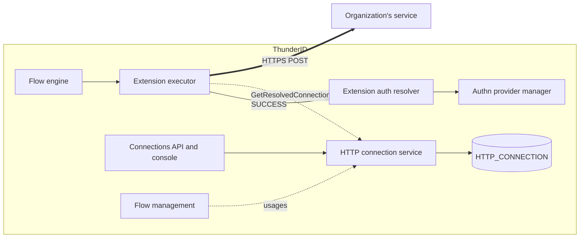

# Extension Executor Specification

- **Status:** Draft
- **Version:** 0.1
- **Related documents:**
  - Discovery issue #5555 (ThunderID Extensibility: extension model and authentication)
  - Design discussion #5659 (Extension executor: architecture, response contract and custom authentication)
  - [threat-model.md](threat-model.md)
  - Flow conditions issue #5145

## Summary

Organizations need ThunderID flows to consult their own services: to stop a sign-in a risk engine
rejects, to check a credential against an internal list, to authenticate with a method ThunderID does
not implement, or to bring in data that only their systems hold. Today the only outbound call in a
flow is the HTTP request executor. It fails open by default, passes upstream error text to users, and
has no outcome contract.

This specification adds three things:

- an **extension executor**, a flow step that calls an organization's service and acts on a fixed
  response contract;
- an **HTTP endpoint connection**, a connection type that holds where and how to reach that service;
- an **extension auth resolver**, an authentication step that turns a service's verified answer into
  a session for a local user.

**The governing design decision:** the extension executor is blind to identity. It can only add data
to the flow, under a closed set of four outcomes. Anything that changes who the user is lives in a
separate, explicitly placed step (the resolver), so the power to sign a user in is never a property of
an ordinary extension.

**In scope:**

- flows of every type;
- server-to-server calls from ThunderID;
- the console and API to configure them.

**Out of scope** (future specifications):

- redirects to a service's own page;
- asynchronous approval;
- non-blocking notifications;
- surfaces outside flows;
- recording an authentication method and assurance level for logins through the resolver;
- OAuth client credentials or mutual TLS on the back channel;
- branching on returned values (#5145).

## Architecture



| Component | Owner package | Responsibility | Existing seam used |
|---|---|---|---|
| Extension executor | `internal/flow/executor` | Build the request, call the service, evaluate the response, route the flow, store data | Executor registry and catalog (`executormeta`), `ExecutorDependencies` |
| HTTP connection service | `internal/connection/httpconnection` | Store, validate and resolve HTTP endpoint connections | Connection routes, declarative resources, export and import, `cmodels` encryption |
| Extension auth resolver | `internal/flow/executor` | Resolve and authenticate the user a service verified | Entity provider, authn provider manager |
| `extensionVerifiedEntityID` credential type | `internal/authnprovider` | The internal path the resolver authenticates through | `InternalCredentialTypes`, default provider dispatch |
| Usage tracking | `internal/flow/mgt`, `internal/system/resourcedependency` | Report flows that reference a connection; block its deletion | Dependency registry |
| Console and flow builder | `frontend/packages/configure-connections`, `configure-flows` | Configure connections and the two steps | Connection wizard, executor property panels |

The extension executor is a utility executor and cannot set the authenticated user. The resolver is an
authentication executor, which is what allows it to.

## Detailed design

### Extension executor: node properties

| Property | Type | Default | Meaning |
|---|---|---|---|
| `connectionId` | string | none | The HTTP endpoint connection to call. |
| `url` | string | none | An inline endpoint for development. Used only when `connectionId` is not set. |
| `headers` | object, or a JSON string | none | Inline headers. Used only with `url`. |
| `timeout` | number, or a string of seconds | 10 | Inline timeout, from 1 to 20 seconds. Used only with `url`. |
| `inputKeys` | string array | empty | The user inputs to send. See *Request construction*. |
| `runtimeDataKeys` | string array | unset | Restricts the runtime data sent. See *Request construction*. |
| `responseKeys` | string array, or a comma-separated string | unset | The response fields to store. Unset stores all fields that are allowed. |

Validation:

- Exactly one endpoint source applies. When `connectionId` is set, `url`, `headers` and `timeout` are
  ignored.
- When neither is set, the node fails with `ErrExtensionConfigInvalid` (configuration invalid) before any call.

### Extension executor: endpoint resolution

- **With `connectionId`:** the executor calls `GetResolvedConnection` on every execution. That returns
  the URL, the timeout and the final header map, with the authentication header applied and secrets
  decrypted in memory only. A connection that is missing, deleted or cannot be resolved fails the node
  with `ErrExtensionConfigInvalid`, and no call is made.
- **With `url`:** the inline values are used, with the timeout clamped to 1 to 20 seconds.

### Extension executor: request construction

The request is a `POST` with:

- `Content-Type: application/json`;
- `X-Correlation-ID`, the flow's trace ID, unless a configured header supplies it;
- the connection's or node's headers.

The body:

```json
{
  "version": "1",
  "userInputs":  { "<inputKey>": "<value>" },
  "runtimeData": { "<key>": "<value>" }
}
```

`version` is the contract version, fixed at `"1"` by this specification. A future incompatible
contract uses a new version value. ThunderID never changes the meaning of a published version.

**User inputs:**

- Only the inputs named in `inputKeys` are sent, and only those present in the flow.
- An unset or empty `inputKeys` sends `{}`.
- Credentials (password and OTP inputs) are therefore sent only when an administrator names them on
  that node, for example on an extension that performs authentication.

**Runtime data**, in three classes:

| Class | Members | Sent |
|---|---|---|
| Secret engine state | `otpSessionToken`, `consent_session_token`, `oauthState`, `oidcNonce`, `magicLinkUsedJti`, `storedInviteToken`, `inviteLink`, `magicLinkURL`, `ssoSessionHandle`, `ssoSessionId`, `tokenFamilyId`, `candidateUsers`, `failureReasonJSON` | Never, even when named. |
| Other engine keys | Every other key on the reserved list (see *Response storage*), for example `clientId`, `requested_permissions`, `ouId` | Only when named in `runtimeDataKeys`. Exception: `applicationId` and `userID` are sent by default when present. |
| Flow data | Every key not on the reserved list, such as data stored by earlier extensions | By default. When `runtimeDataKeys` is set, only the keys it names. |

### Extension executor: the call

- The HTTP client does not follow redirects. A 3xx response is evaluated like any other status.
  Following one would resend the request's headers, including API keys, to another host.
- The client uses the server's TLS settings.
- Private and loopback addresses are allowed, because endpoints are set only by administrators. This
  allows on-premise services.
- The response body is read up to 64 KiB (65 536 bytes). A larger body makes the outcome `ERROR`
  without being parsed.
- A timeout is not retried.

### Extension executor: response evaluation

The outcome is decided in this order:

1. The status code is outside 200 to 299: **`ERROR`**.
2. The body is empty, is not a JSON object, or exceeds the size cap: **`ERROR`**.
3. `actionStatus` is missing, is not a string, or is not one of the four values (the comparison is
   case-sensitive): **`ERROR`**.
4. Otherwise, the value of `actionStatus`.

| Outcome | Executor status | Flow continues at | Client error | Runtime data |
|---|---|---|---|---|
| `SUCCESS` | complete | `onSuccess` | none | Response fields stored; earlier `failureReason` and `failureDescription` reset to `""` |
| `FAILED` | failure | `onFailure`, or ends the flow with an error if none is set | `ErrExtensionActionFailed` | `failureReason` and `failureDescription` stored |
| `INCOMPLETE` | user input required | `onIncomplete`, which must lead to a prompt | `ErrExtensionInputRequired` when a message exists | Response fields plus `failureReason` and `failureDescription` stored |
| `ERROR` | failure | `onFailure`, or ends the flow with an error | `ErrExtensionCallFailed` (generic) | unchanged |

On `ERROR`, nothing from the response reaches the client. `failureReason` and `failureDescription`
appear only in the audit event (see *Audit event*).

### Extension executor: response storage

**Rendering.**

- Top-level response fields are stored as strings.
- Numbers keep their exact text, and booleans become `true` or `false`.
- Objects and arrays are stored as compact JSON.
- `null` values are skipped.
- `actionStatus`, `failureReason` and `failureDescription` are never stored as data. On `FAILED` and
  `INCOMPLETE` the two failure fields are stored under their own names, as the table above describes.

**Allowlist.** When `responseKeys` is set, only the fields it names are stored. Fields outside it are
dropped without error, so upstream tokens never enter the flow.

**Reserved keys.**

- The executor keeps a single list of runtime-data keys that the engine or a built-in step relies on:
  - every `RuntimeKey*` constant in `internal/flow/common`;
  - the identity keys `userID`, `userId` and `ouId`;
  - `applicationId`;
  - `failureReasonJSON`;
  - `authorized_permissions`;
  - the keys each built-in executor defines for its own state.
- A unit test fails if any `RuntimeKey*` constant is missing from the list, so the list cannot fall
  behind as the engine grows.
- **A response that contains a reserved key as a top-level field is `ERROR`.** That holds even when
  `responseKeys` would have dropped the field, so a misbehaving service is always visible. Nothing
  from such a response is stored.

### Extension executor: failure information and user messages

- **`failureReason`:**
  - passed as `params.reason`;
  - limited to 64 characters from `[A-Za-z0-9_.-]`;
  - a value outside that is dropped.
- **`failureDescription`:**
  - shown as the error description and passed as `params.description`;
  - control characters are removed and whitespace runs collapsed;
  - cut to 256 characters;
  - always rendered as text, never as markup.
- **Defaults:** if `failureDescription` is missing or empty after cleaning:
  - `FAILED` uses "The request was rejected";
  - `INCOMPLETE` returns no error.
- **Credential failures:**
  - When `failureReason` is `invalid_credentials` or `user_not_found`, the user sees ThunderID's own
    message, "Invalid username or password.", whatever the service sent.
  - `params.reason` is still passed, so a client application can tell the cases apart.
  - The same message for both cases stops an extension from revealing which accounts exist.

### Extension executor: audit event

Every execution emits one structured log event at `INFO`, `extension.call`, with these fields:

- `executionId`, `nodeId`, `flowType`;
- `connectionId` (or `inline`);
- `outcome`;
- `failureReason`, for `FAILED` and `INCOMPLETE`;
- `httpStatus`, when a response was received;
- `latencyMs`;
- `errorKind`, for `ERROR`: `timeout`, `transport`, `status`, `body`, `contract` or `reserved_key`.

The event never contains URLs, header values, request or response bodies, user inputs, runtime-data
values or `failureDescription`. Configuration and resolution failures (`ErrExtensionConfigInvalid`) emit the same event
with `outcome` set to `CONFIG_ERROR`.

### Extension executor: errors

Errors are named here by their constant. Numeric codes are assigned from the next free `FET-` and
`CON-` ranges at implementation, so that other in-flight changes cannot collide with this spec.

| Error | When | Client sees |
|---|---|---|
| `ErrExtensionConfigInvalid` | No endpoint configured; connection missing or unresolvable; invalid inline headers | "Configuration error", generic description |
| `ErrExtensionCallFailed` | Outcome `ERROR` for any reason | "Extension call failed", generic description |
| `ErrExtensionActionFailed` | Outcome `FAILED` | "Request rejected"; description from `failureDescription` or the credential-failure message; `params.description`, `params.reason` |
| `ErrExtensionInputRequired` | Outcome `INCOMPLETE` with a message | "Additional input required"; `params.description`, `params.reason` |

### HTTP endpoint connection

A connection of type `http`. Fields and validation:

| Field | Rule | Error |
|---|---|---|
| `name` | Required, unique per deployment | `ErrHTTPConnectionInvalidName`; `ErrHTTPConnectionAlreadyExists` when duplicate |
| `description` | Optional | |
| `url` | Required, absolute `http` or `https` URL | `ErrHTTPConnectionInvalidURL` |
| `timeoutMs` | 1 to 20 000; `0` or omitted means 10 000 | `ErrHTTPConnectionInvalidTimeout` |
| `headers` | `[{name, value}]`; names valid and unique (case-insensitive); values without line breaks. A PUT replaces the whole list, so omitted means none. | `ErrHTTPConnectionInvalidHeaders` |
| `authentication.scheme` | `NONE` (default), `BEARER`, `BASIC` or `API_KEY` | `ErrHTTPConnectionInvalidAuthentication` |
| `authentication.bearer.token` | Required for `BEARER` | `ErrHTTPConnectionInvalidAuthentication` |
| `authentication.basic` | `username` required, with no colon; `password` required | `ErrHTTPConnectionInvalidAuthentication` |
| `authentication.apiKey.headers` | At least one `{name, value}`; names unique (case-insensitive) | `ErrHTTPConnectionInvalidAuthentication` |

**Secrets** are the bearer token, the basic password and the API-key header values.

- **Storage:** encrypted with the server's configuration key and stored in the connection's
  properties, never in plain text.
- **Reads:** every read returns each secret as `******`. The basic username and the API-key header
  names are returned in clear.
- **Updates** keep a secret, in this order:
  1. If the scheme changes, the old scheme's secrets are discarded and the new scheme's are required.
  2. If the URL's **origin** changes (scheme, host or port, with default ports normalized) and the
     scheme is not `NONE`, every secret must be supplied again. A masked or omitted value is rejected
     with `ErrHTTPConnectionInvalidAuthentication`. This stops an editor from pointing a connection at their own server and
     collecting its stored token.
  3. Otherwise, a secret that is omitted, empty or `******` keeps its stored value. API-key headers
     are matched by name, case-insensitively. A new header name sent as `******` is rejected. API-key
     headers left out of the request are removed.

**Resolution for calls.** Plain headers first, then authentication, which overrides a plain header of
the same name:

| Scheme | Header |
|---|---|
| `BEARER` | `Authorization: Bearer <token>` |
| `BASIC` | `Authorization: Basic base64(username:password)` |
| `API_KEY` | One header per entry |

Decrypted values exist only in the returned header map, for the duration of the call.

**Lifecycle.**

- Delete is refused with `ErrHTTPConnectionHasBlockingDependencies` while any flow references the connection through `connectionId`.
  Flow management reports those references through the dependency registry. A failure to determine
  usages also refuses the delete.
- Connections defined in declarative YAML are read-only (update and delete fail as declarative
  resources).
- Export writes secrets as `.env` parameters: one per bearer token or basic password, and one per
  API-key header. Import accepts the same shape.

### Extension auth resolver

| Property | Default | Meaning |
|---|---|---|
| `sourceKey` | required | The runtime-data key holding the identifier the service verified. |
| `matchAttribute` | `username` | The local user attribute to match. `userID` matches by entity ID. |

Steps:

1. Read `runtimeData[sourceKey]`. If it's missing or empty, fail with "user not authenticated".
2. Resolve the entity:
   - by ID when `matchAttribute` is `userID`;
   - otherwise through the entity provider, filtered on `matchAttribute`.
   - Not found fails with `ErrEntityNotFound`; more than one match fails with
     `ErrAmbiguousEntityIdentity`.
3. Load the entity. It must be of category `user` and in state `ACTIVE`. Anything else fails with
   `ErrEntityNotFound`, the same answer credential authentication gives, so a caller cannot use the
   resolver to tell which accounts exist.
4. Authenticate through `AuthenticateUser`, with the credential `extensionVerifiedEntityID: <id>`.
   Failure fails with `ErrEntityAuthFailed`.
5. Complete, and copy the authenticated claims into runtime data.

A missing `sourceKey` property fails with `ErrExtensionAuthResolverConfigInvalid` (configuration invalid).

The resolver trusts whatever value sits under `sourceKey`. The flow builder places it directly after
the extension that authenticates, and the threat model records this as an accepted trust.

### Internal credential type `extensionVerifiedEntityID`

- The default authn provider accepts `extensionVerifiedEntityID` with a non-empty user ID and returns
  that ID as the authenticated entity, as it already does for `provisionedEntityID`.
- The type is on `InternalCredentialTypes`, so the credentials authentication API rejects it from API
  clients. The existing test that every dispatched credential type is on that list covers it.

### Data model

A new table in the configuration database. The SQLite script uses `TEXT` and `datetime('now')`
defaults:

```sql
CREATE TABLE "HTTP_CONNECTION" (
    DEPLOYMENT_ID VARCHAR(255) NOT NULL,
    ID            VARCHAR(36)  PRIMARY KEY,
    NAME          VARCHAR(255) NOT NULL,
    DESCRIPTION   VARCHAR(500),
    PROPERTIES    JSONB        NOT NULL,
    CREATED_AT    TIMESTAMPTZ  DEFAULT NOW(),
    UPDATED_AT    TIMESTAMPTZ  DEFAULT NOW()
);
CREATE UNIQUE INDEX idx_http_connection_name_deployment ON "HTTP_CONNECTION" (DEPLOYMENT_ID, NAME);
```

- `PROPERTIES` holds `url`, `timeoutMs`, `headers`, `authScheme`, `basicUsername` and `secrets`.
  `secrets` is a property array whose every value is encrypted (`bearerToken`, `basicPassword`,
  `apiKeyHeader:<name>`).
- The table is added to the SQLite and Postgres configuration scripts. There is no migration framework,
  so the release notes carry the DDL for existing deployments.
- No other table changes.

### API

All routes require the same authorization as the other connection routes.

| Method and path | Request | Response |
|---|---|---|
| `GET /connections/http` | none | `200`, a list of connection summaries |
| `POST /connections/http` | `HTTPConnectionCreateRequest` | `201`, `HTTPConnectionResponse` |
| `GET /connections/http/{id}` | none | `200`, `HTTPConnectionResponse`; `404 ErrHTTPConnectionNotFound` |
| `PUT /connections/http/{id}` | `HTTPConnectionUpdateRequest` | `200`; `400`, one of the validation errors in the field table above; `404`; `409 ErrHTTPConnectionAlreadyExists` |
| `DELETE /connections/http/{id}` | none | `204`; `404`; `409 ErrHTTPConnectionHasBlockingDependencies` |
| `GET /connections/http/{id}/usages` | none | `200`, `{totalResults, summary, usages[]}` |
| `GET /connections?category=http` | none | `200`, the standard paginated list |

The request and response bodies have the fields in *HTTP endpoint connection*. Responses carry `id` and
`type: "http"`, with secrets masked. `api/connections.yaml` defines these schemas, the `http` category
and the `http` type.

### UI

**Connections, create.** "HTTP Endpoint" in the custom section of the wizard. The steps are name, then
URL. Timeout, headers and authentication use defaults on create and can be edited afterwards.

**Connections, detail page:**

```text
HTTP Endpoint · Risk Engine                                   [Delete]
┌ General ───────────────────────────────────────────────────────────┐
│ URL      [https://risk.example.com/evaluate                      ] │
│ Timeout  [5000] ms                                                  │
│ Headers  [X-Tenant      ] [acme          ] ×                        │
│          +                                                          │
└────────────────────────────────────────────────────────────────────┘
┌ Authentication ────────────────────────────────────────────────────┐
│ Method   [Bearer token ▾]                                           │
│ Token    [••••••••]  (Replace)                                      │
│ Changing the URL host requires re-entering the token.               │
└────────────────────────────────────────────────────────────────────┘
┌ Usages ────────────────────────────────────────────────────────────┐
│ Flow  Default sign-in                                               │
└────────────────────────────────────────────────────────────────────┘
```

When the URL's origin is edited, the Save button stays disabled until every secret field of the
current method holds a new value.

**Flow builder, extension step:**

```text
Extension
 Connection        [Risk Engine ▾]   (None: enter URL)
 Inputs to send    [username ×] [password ×]  +     ← user inputs; none by default
 Runtime data      [all flow data ▾]  +              ← optional restriction
 Stored fields     [riskScore, challengeId        ]
 The service must answer with actionStatus SUCCESS, FAILED, INCOMPLETE or ERROR.
```

URL, headers and timeout fields appear only when no connection is selected.

**Flow builder, extension auth resolver:** Source key (required) and Match attribute (default
`username`).

### Configuration

| Key | Level | Default | Meaning |
|---|---|---|---|
| `http_connection.store` | deployment | the global declarative mode | `mutable`, `declarative` or `composite` storage for HTTP connections, as for other connection types |

The executor's timeout bounds and the 64 KiB cap are constants, not configuration.

## Requirements

### R1. An administrator can call an organization's service from any flow

**Requirement:** An administrator can add an extension step to any flow, pointing at an HTTP endpoint
connection or an inline URL, without a server restart.

**Acceptance criteria:**

- **AC1.1:** Given a flow with an extension step that references a connection, when the flow reaches
  the step, then ThunderID POSTs to the connection's URL with the connection's headers, and the
  inline `url`, `headers` and `timeout` are ignored.
- **AC1.2:** Given an extension step with neither `connectionId` nor `url`, when the flow reaches it,
  then the step fails with `ErrExtensionConfigInvalid` and no request is sent.
- **AC1.3:** Given an extension step that references a deleted connection, when the flow reaches it,
  then the step fails with `ErrExtensionConfigInvalid` and no request is sent.

### R2. Endpoints are reusable and secrets are protected

**Requirement:** An administrator defines a service endpoint once, as an HTTP endpoint connection, with
back-channel credentials that ThunderID never discloses.

**Acceptance criteria:**

- **AC2.1:** Given a connection with a bearer token, basic password or API-key headers, when it is
  read through any API, then every secret value is `******`, and the stored record contains no secret
  in plain text.
- **AC2.2:** Given a stored connection, when it is updated with masked secrets, the same scheme and the
  same URL origin, then the next call carries the original secret.
- **AC2.3:** Given a stored connection with scheme `BEARER`, when it is updated to `BASIC` without a
  password, then the update fails with `400 ErrHTTPConnectionInvalidAuthentication` and the connection is unchanged.
- **AC2.4:** Given a stored connection with a non-`NONE` scheme, when its URL host, port or scheme
  changes and any secret is masked or omitted, then the update fails with `400 ErrHTTPConnectionInvalidAuthentication`.
- **AC2.5:** Given a connection that is updated, when a flow next calls it, then the new URL,
  headers and secrets are used without editing the flow.
- **AC2.6:** Given a connection, when it is exported, then each secret appears as a `.env` parameter
  and not in the YAML.

### R3. Connections in use cannot be deleted

**Requirement:** An administrator can see which flows use a connection, and cannot delete a connection
that a flow uses.

**Acceptance criteria:**

- **AC3.1:** Given a flow whose extension step references a connection, when its usages are
  requested, then the flow is listed.
- **AC3.2:** Given that reference, when the connection is deleted, then the request fails with
  `409 ErrHTTPConnectionHasBlockingDependencies`.
- **AC3.3:** Given no references, when the connection is deleted, then it returns `204`, and a later
  read returns `404 ErrHTTPConnectionNotFound`.

### R4. A service answers with a fixed contract and the flow routes on it

**Requirement:** A service reports its decision with `actionStatus` (`SUCCESS`, `FAILED`,
`INCOMPLETE`, `ERROR`), and the flow continues at the matching path.

**Acceptance criteria:**

- **AC4.1:** Given `SUCCESS`, when the step completes, then the flow continues at `onSuccess`.
- **AC4.2:** Given `FAILED` with `failureReason` and `failureDescription`, when the step has
  `onFailure`, then the flow continues there. The client receives `ErrExtensionActionFailed` with the description
  and `params.reason`.
- **AC4.3:** Given `INCOMPLETE` with a `failureDescription`, when the step has `onIncomplete` leading
  to a prompt, then that prompt is shown with `ErrExtensionInputRequired` and the description.
- **AC4.4:** Given `ERROR`, a missing, non-string or unknown `actionStatus`, a non-2xx status, a 3xx
  redirect, an empty or non-object body, a body over 64 KiB, a timeout, or an unreachable service,
  when the step evaluates the answer, then the outcome is `ERROR` with `ErrExtensionCallFailed`. The client
  response contains nothing from the service's body, and a redirect target is never called.

### R5. Only what the administrator selects is sent

**Requirement:** An extension receives the contract version, the user inputs the administrator names,
and runtime data within the configured selection. Secret engine state is never sent.

**Acceptance criteria:**

- **AC5.1:** Given an extension step with no `inputKeys`, when it calls the service, then `userInputs`
  is `{}`, even when the flow holds a password.
- **AC5.2:** Given `inputKeys: [username, password]`, when it calls the service, then `userInputs`
  holds exactly those two inputs.
- **AC5.3:** Given runtime data holding `otpSessionToken` and `oauthState`, when any extension step
  calls the service, even with both named in `runtimeDataKeys`, then neither key is sent.
- **AC5.4:** Given no `runtimeDataKeys`, when the step calls the service, then `runtimeData` holds
  `applicationId`, `userID` (when present) and every key not on the reserved list, and no other engine
  key.
- **AC5.5:** Given `runtimeDataKeys: [clientId, riskScore]`, when the step calls the service, then
  `runtimeData` holds only those keys that are present.
- **AC5.6:** Given any call, when the request is sent, then the body carries `"version": "1"`.

### R6. Returned data is stored safely

**Requirement:** Data a service returns is available to later steps, within an allowlist, and can never
overwrite state the engine trusts.

**Acceptance criteria:**

- **AC6.1:** Given `SUCCESS` with fields `risk` and `claims`, when the step completes, then a later
  step's `runtimeData` holds `risk` as text and `claims` as compact JSON. `actionStatus` is not stored.
- **AC6.2:** Given `responseKeys: [username]` and a response that also carries `accessToken`, when the
  step completes, then only `username` is stored.
- **AC6.3:** Given a response containing a reserved key (for example `mapped_role_ids` or `userID`)
  as a top-level field, when the step evaluates it, then the outcome is `ERROR` and nothing from the
  response is stored.
- **AC6.4:** Given a reserved-key list in the executor, when a `RuntimeKey*` constant is missing from
  it, then the unit test suite fails.
- **AC6.5:** Given `FAILED` followed in the same execution by `SUCCESS`, when a later step reads
  runtime data, then `failureReason` and `failureDescription` are empty.

### R7. User-facing failure text is bounded and cannot reveal accounts

**Requirement:** Text a service sends for users is plain, bounded, and replaced by ThunderID's own
message for credential failures.

**Acceptance criteria:**

- **AC7.1:** Given a `failureDescription` of 300 characters containing control characters, when it
  is shown, then the user sees at most 256 characters, with no control characters.
- **AC7.2:** Given `FAILED` with `failureReason` `user_not_found`, and separately with
  `invalid_credentials`, when each is shown, then both show "Invalid username or password." and
  `params.reason` differs.
- **AC7.3:** Given `FAILED` with no `failureDescription`, when it is shown, then the description is
  "The request was rejected".
- **AC7.4:** Given a `failureReason` containing characters outside `[A-Za-z0-9_.-]` or longer than 64
  characters, when the error is returned, then `params.reason` is absent.

### R8. Every call is audited without sensitive data

**Requirement:** Each extension execution leaves one record an operator can use to tell a refusal from
a broken service.

**Acceptance criteria:**

- **AC8.1:** Given any execution, when it ends, then exactly one `extension.call` event is emitted
  with `executionId`, `nodeId`, `connectionId` or `inline`, `outcome`, `latencyMs`, and `httpStatus`
  when a response was received.
- **AC8.2:** Given an `ERROR` caused by a timeout, when the event is emitted, then `errorKind` is
  `timeout`.
- **AC8.3:** Given any execution, when the event is emitted, then it contains no URL, header value,
  request or response body, user input, runtime-data value or `failureDescription`.

### R9. A service can authenticate a user

**Requirement:** An administrator can let a service perform authentication, so that the flow ends
with a normal session for the local user the service verified.

**Acceptance criteria:**

- **AC9.1:** Given an extension that answers `SUCCESS` with `authenticatedUsername: jdoe`, followed by
  a resolver with `sourceKey: authenticatedUsername`, when the flow completes, then the assertion's
  subject is the local user `jdoe`, even though the user's stored password was never checked.
- **AC9.2:** Given the same flow, when the service answers `FAILED`, then no user is authenticated,
  and the flow follows `onFailure`.
- **AC9.3:** Given a resolver whose source value is missing, matches no user, matches more than one,
  matches a non-user entity, or matches a user that is not `ACTIVE`, when it runs, then it fails and
  authenticates no one. The not-found, non-user and inactive cases give the same error.
- **AC9.4:** Given the credentials authentication API, when a client sends credential type
  `extensionVerifiedEntityID`, then the request is rejected.
- **AC9.5:** Given a resolver with no `sourceKey` property, when it runs, then it fails with
  `ErrExtensionAuthResolverConfigInvalid`.

### R10. Administrators configure everything in the console

**Requirement:** An administrator can create and edit HTTP endpoint connections and both steps
without writing JSON.

**Acceptance criteria:**

- **AC10.1:** Given the connection wizard, when an administrator chooses HTTP Endpoint and enters a
  name and URL, then a connection is created with timeout 10 000 ms and scheme `NONE`.
- **AC10.2:** Given a connection's detail page, when the administrator edits the URL origin, then
  Save stays disabled until each secret of the current method is re-entered.
- **AC10.3:** Given the flow builder, when an administrator selects a connection on an extension
  step, then the URL, headers and timeout fields are hidden and `connectionId` is stored. Choosing
  None restores them.
- **AC10.4:** Given the flow builder, when an administrator adds inputs to send, then `inputKeys`
  stores them. With none chosen, `inputKeys` is empty.

## Change log

| Version | Date | Change |
|---|---|---|
| 0.1 | 2026-10-09 | Initial specification, from design discussion #5659 and the proof of concept. |
