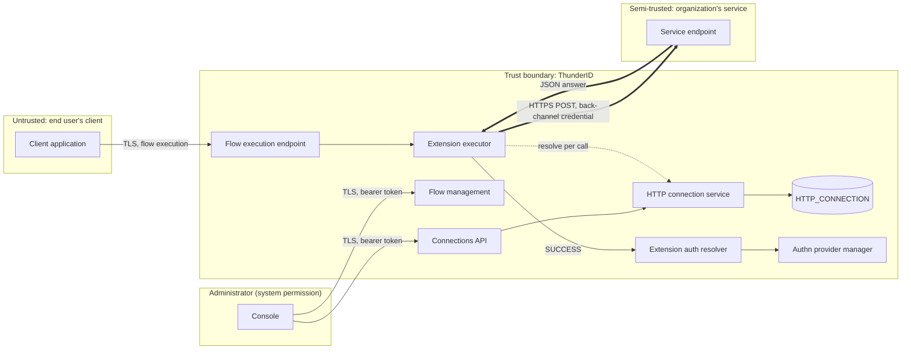
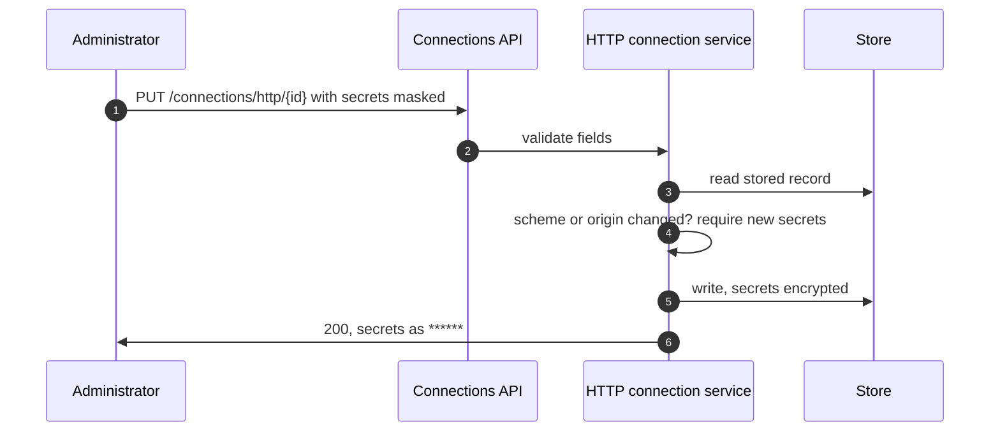
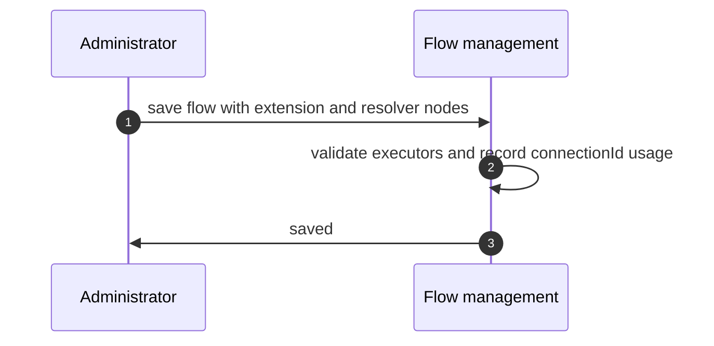
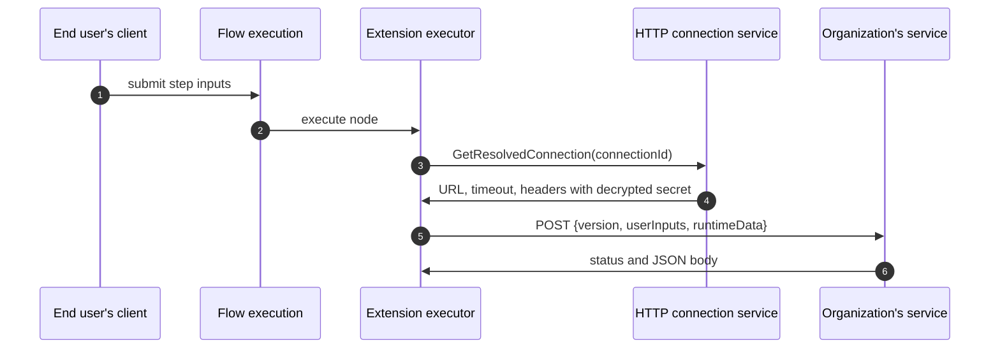
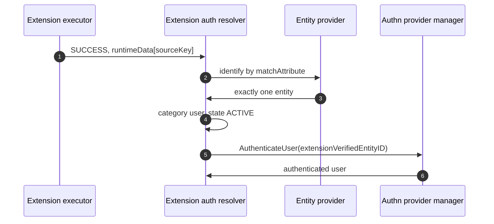
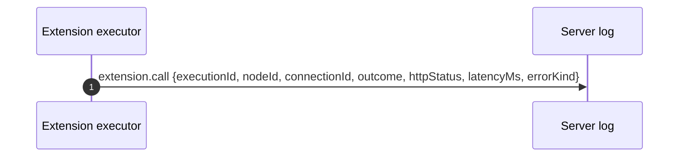

# Extension Executor Threat Model

This model covers the extension executor, the HTTP endpoint connection, and the extension auth
resolver defined in [spec.md](spec.md): the outbound call from a flow to an organization's service,
the evaluation of that service's answer, and the authentication of a local user on the strength of it.

## Overview

The extension executor makes ThunderID call a service it does not own, in the middle of a flow, and
act on what comes back. That creates two new trust boundaries. Outbound, ThunderID sends user inputs
and flow state, together with stored back-channel credentials, to an administrator-chosen endpoint.
Inbound, an answer from that endpoint decides how the flow continues and what data later steps see,
and through the extension auth resolver it can decide which local user is signed in.

The entry points are the connection management routes under `/connections/http`, the flow
definitions that place the two steps, the flow execution endpoint that runs them, and the response
of the organization's service.

Cross-cutting concerns covered elsewhere: authentication and authorization of the management API,
the flow execution endpoint and its session handling, the authn provider manager, encryption of
stored properties with the server's configuration key, and token issuance after a flow completes.
These are trust inputs here, not re-analysed.

## Scope

This model covers:

- Creating, reading, updating, deleting, exporting and importing HTTP endpoint connections.
- Placing and configuring an extension step and an extension auth resolver in a flow.
- The outbound request: endpoint resolution, request construction, and the call.
- Evaluation of the response and storage of returned data in the flow.
- Authentication of a local user through the extension auth resolver.
- The `extension.call` audit event.

Out of scope:

- The security of the organization's service itself, including how it authenticates the user and
  stores what it receives. ThunderID cannot observe or enforce it.
- The management API's authentication and permission model, owned by the system security model.
- The HTTP request executor, which is an existing step with its own behaviour.
- Redirects to a service's page, asynchronous approval and notifications, which are future
  specifications.

## Architecture



The organization's service is semi-trusted. An administrator chose it and gave it a credential, so
ThunderID trusts its decision on the questions it was asked. ThunderID does not trust the shape of
its answer, and never lets that answer change engine state other than through the fixed contract.

### Components

| Component | Task |
| --- | --- |
| Connections API and HTTP connection service | Validate, store and resolve HTTP endpoint connections. Encrypt secrets at rest and mask them on every read |
| Flow management | Store flow definitions that place the two steps, and report which flows use a connection |
| Extension executor | Build the request from selected inputs and runtime data, call the service, evaluate the answer, route the flow, store allowed data |
| Extension auth resolver | Map a value the service verified to a single active local user, and authenticate that user through an internal credential type |
| Authn provider manager | Accept the internal `extensionVerifiedEntityID` credential type from the resolver only |

### Actors

#### Actors

| Actor | Description | Roles or permissions |
| --- | --- | --- |
| Administrator | Manages connections and flows in the console or through the API | The root `system` permission, which the connection and flow management routes require |
| End user | Runs a flow through a client application | None; the flow execution endpoint is public |
| Organization's service | Answers extension calls | The back-channel credential stored on the connection |
| Network attacker | Positioned between ThunderID and the service | Observation, and modification without TLS |

#### Entitlement matrix

| Actor | Manage connections | Read a stored secret | Place an extension or resolver | Run a flow | Decide an extension outcome | Choose the authenticated user |
| --- | --- | --- | --- | --- | --- | --- |
| Administrator | [Yes] | [No] | [Yes] | [Yes] | [No] | [No] |
| End user | [No] | [No] | [No] | [Yes] | [No] | [No] |
| Organization's service | [No] | [No] | [No] | [No] | [Yes] | [Yes], only where a resolver follows its step |
| Network attacker | [No] | [No] | [No] | [Yes] | [No] | [No] |

### External Dependencies (not owned)

| Dependency | Description |
| --- | --- |
| Organization's service | Receives the request and returns the contract answer. Authenticates ThunderID with the connection's bearer token, basic credential or API key |
| TLS stack and the server's TLS settings | Certificate verification and the minimum TLS version for the outbound call |
| Server configuration key | Encrypts connection secrets at rest, owned by the configuration encryption model |
| Configuration database or declarative files | Hold connection records, depending on `http_connection.store` |

## Threats and mitigations

### Out-of-scope interactions and risks

- Compromise of an administrator account, owned by the management API model. An administrator can
  already configure flows and users directly.
- How the organization's service authenticates users and protects what it receives.
- Brute force against the flow execution endpoint, owned by the flow execution model.

### Interactions

#### 01: Administrator manages HTTP endpoint connections

**Description**

An administrator creates, reads, updates, deletes, exports or imports a connection. The service
validates the URL, timeout, headers and authentication, encrypts secrets, masks them on read, keeps a
masked secret only when the scheme and the URL origin are unchanged, and refuses deletion while a flow
references the connection.

**Assets involved**

| Initiator | Intermediate | Target |
| --- | --- | --- |
| Administrator | Connections API | HTTP connection service, `HTTP_CONNECTION` or declarative files |

**Data flow**



**Security considerations**

| Area | Response | Comments |
| --- | --- | --- |
| Data confidentiality | [C-High] | Back-channel credentials for the organization's service |
| Communication medium | [M-NT], [M-DB], [M-FS] | Files in declarative mode and on export |
| Transport security | [TLS] | |
| Authentication | Bearer token of an administrator | |
| Accessibility | [Restricted] | |
| Authorization and Access Control | The root `system` permission | |

**Threat assessment**

| ID | Category | Threat | Materializable | Mitigation / comment |
| --- | --- | --- | --- | --- |
| 1 | [Information Disclosure] | A stored token is read back through the API or the console and reused outside ThunderID | [No] | Every read masks each secret as `******`; the stored record holds only encrypted values (AC2.1) |
| 2 | [Information Disclosure] | An administrator who can edit but should not learn a secret points the connection's URL at a server they control, keeps the masked secret, and collects the token from the next call | [No] | A change of URL origin with a non-`NONE` scheme requires every secret to be entered again (AC2.4, AC10.2) |
| 3 | [Information Disclosure] | A scheme change keeps the old scheme's secret and sends it in a new header | [No] | A scheme change discards the old secrets and requires the new scheme's (AC2.3) |
| 4 | [Tampering] | A header value with a line break injects further headers into the outbound request | [No] | Header names are validated and values with line breaks are rejected |
| 5 | [Information Disclosure] | An export file carries secrets in plain text into source control | [No] | Secrets are written as `.env` parameters, not into the YAML (AC2.6) |
| 6 | [Operational Risk] | A connection is deleted while a flow uses it, breaking sign-in | [No] | Deletion is refused while any flow references it, and also when usages cannot be determined (AC3.2) |
| 7 | [Repudiation] | A connection's URL or credential is changed and no record says who changed what | [Yes] | Connection changes are recorded only in the general server log. A management audit trail with old and new values is outside this feature. See *Residual risks* |

#### 02: Administrator places an extension step or a resolver in a flow

**Description**

An administrator adds an extension step that references a connection or an inline URL, chooses the
inputs and runtime data it sends and the response fields it stores, and optionally places an extension
auth resolver after it.

**Assets involved**

| Initiator | Intermediate | Target |
| --- | --- | --- |
| Administrator | Flow management | Flow definition |

**Data flow**



**Security considerations**

| Area | Response | Comments |
| --- | --- | --- |
| Data confidentiality | [C-Medium] | An inline `url` and its headers sit in the flow definition |
| Communication medium | [M-NT], [M-DB] | |
| Transport security | [TLS] | |
| Authentication | Bearer token of an administrator | |
| Accessibility | [Restricted] | |
| Authorization and Access Control | The root `system` permission | |

**Threat assessment**

| ID | Category | Threat | Materializable | Mitigation / comment |
| --- | --- | --- | --- | --- |
| 1 | [Security Risk] | An administrator points an extension at an internal address and uses ThunderID to reach a host they could not otherwise reach | [No] | Only holders of the root `system` permission can set endpoints, and they already control the deployment's configuration. Private addresses are allowed on purpose, for on-premise services. Recorded as a residual |
| 2 | [Information Disclosure] | A credential in an inline `headers` value is stored in the flow definition in plain text and exported with it | [Yes] | Inline endpoints exist for development. Connections are the supported way to hold credentials, and the console hides inline fields once a connection is chosen. See *Residual risks* |
| 3 | [Elevation of Privilege] | A resolver is placed after an extension that does not authenticate, so any value that service returns signs a user in | [No] | Requires an administrator to build that flow. The resolver acts only on the `sourceKey` it is given, and the console describes it as following an authenticating extension |

#### 03: Flow calls the organization's service

**Description**

When a flow reaches an extension step, the executor resolves the endpoint from the connection on every
execution, builds a JSON body with the contract version, the selected user inputs and the selected
runtime data, and sends a `POST` with the connection's headers. It does not follow redirects, and it
applies the timeout and a 64 KiB response cap.

**Assets involved**

| Initiator | Intermediate | Target |
| --- | --- | --- |
| End user through the flow execution endpoint | Extension executor, HTTP connection service | Organization's service |

**Data flow**



**Security considerations**

| Area | Response | Comments |
| --- | --- | --- |
| Data confidentiality | [C-High] | The request can carry credentials the administrator chose to send, and always carries the back-channel credential |
| Communication medium | [M-NT] | |
| Transport security | [TLS] | Certificates are verified with the server's TLS settings. An `http` URL is accepted, and then the call is not encrypted |
| Authentication | ThunderID to the service: bearer token, basic credential or API key. The service to ThunderID: TLS server certificate | |
| Accessibility | [Internal] | Server to server |
| Authorization and Access Control | Only an administrator-configured endpoint can be called | |

**Threat assessment**

| ID | Category | Threat | Materializable | Mitigation / comment |
| --- | --- | --- | --- | --- |
| 1 | [Information Disclosure] | Every extension receives the user's password and one-time codes, so a risk or enrichment service holds credentials it never needed | [No] | Only the inputs named in `inputKeys` are sent, and none by default (AC5.1, AC5.2) |
| 2 | [Information Disclosure] | Engine secrets in runtime data, such as OTP session tokens, OAuth state, nonces or SSO handles, are sent to the service and replayed against ThunderID | [No] | Secret engine state is never sent, even when named (AC5.3). Other engine keys are sent only when named (AC5.4, AC5.5) |
| 3 | [Information Disclosure] | The service answers with a redirect to another host, and the client resends the back-channel credential there | [No] | Redirects are not followed; a 3xx is `ERROR` (AC4.4) |
| 4 | [Information Disclosure] | A network attacker reads the request or the credential | [No] | TLS with certificate verification. An administrator who chooses an `http` URL removes that protection; recorded as a residual |
| 5 | [Spoofing] | An attacker impersonates the service and answers `SUCCESS` | [No] | TLS server certificate verification. For the resolver case this would sign a user in, which is why an `http` URL is a residual worth guidance |
| 6 | [Denial of Service] | A slow or unresponsive service holds flow executions open and exhausts server resources | [No] | The timeout is at most 20 seconds, the call is not retried, and the body is read up to 64 KiB (AC4.4) |
| 7 | [Denial of Service] | A service that is down blocks every sign-in that uses it | [Yes] | By design the step fails closed (`ERROR`). An administrator can route `onFailure` elsewhere for non-critical extensions. No circuit breaker exists. See *Residual risks* |
| 8 | [Tampering] | A connection is edited during a flow and later calls use stale values | [No] | The connection is resolved on every execution (AC2.5) |

#### 04: Evaluating the answer and storing returned data

**Description**

The executor decides one of four outcomes from `actionStatus`, treating anything outside the contract
as `ERROR`, routes the flow, shows bounded failure text to the user, and stores allowed fields in
runtime data as strings.

**Assets involved**

| Initiator | Intermediate | Target |
| --- | --- | --- |
| Organization's service | Extension executor | Flow runtime data, end user's client |

**Data flow**

```mermaid
sequenceDiagram
  autonumber
  participant S as Organization's service
  participant EX as Extension executor
  participant RD as Runtime data
  participant U as End user's client
  S->>EX: {actionStatus, failureReason, failureDescription, fields}
  EX->>EX: status 2xx, object body, size, known actionStatus, no reserved key
  EX->>RD: allowed fields as strings
  EX->>U: route; bounded description on FAILED or INCOMPLETE; generic error on ERROR
```

**Security considerations**

| Area | Response | Comments |
| --- | --- | --- |
| Data confidentiality | [C-Medium] | Returned fields may hold personal data and tokens |
| Communication medium | [M-IN] | In memory and in the flow's stored context |
| Transport security | [TLS] | |
| Authentication | As interaction 03 | |
| Accessibility | [Internal] | |
| Authorization and Access Control | The response can only add data and pick one of four outcomes | |

**Threat assessment**

| ID | Category | Threat | Materializable | Mitigation / comment |
| --- | --- | --- | --- | --- |
| 1 | [Elevation of Privilege] | The response writes `userID`, `ouId`, role mappings or another engine key, and a later step trusts it | [No] | A response containing any reserved key is `ERROR` and nothing is stored, even when `responseKeys` would drop it (AC6.3). A unit test keeps the reserved list complete (AC6.4) |
| 2 | [Security Risk] | A malformed, empty or unexpected answer is treated as success, and the flow fails open | [No] | Only an exact `SUCCESS` in a 2xx JSON object completes the step. Everything else is `ERROR` (AC4.4) |
| 3 | [Information Disclosure] | An upstream error page, stack trace or token reaches the end user | [No] | `ERROR` returns a generic message only. Nothing from the body reaches the client (AC4.4) |
| 4 | [Information Disclosure] | Tokens in the response are stored in the flow and sent to later extensions | [No] | `responseKeys` restricts what is stored (AC6.2); runtime data sent onwards is subject to `runtimeDataKeys` |
| 5 | [Information Disclosure] | Different failure text for unknown accounts and wrong passwords lets an attacker enumerate accounts through the extension | [No] | For `invalid_credentials` and `user_not_found` the user sees ThunderID's own message (AC7.2) |
| 6 | [Tampering] | `failureDescription` carries markup or control characters that the client renders | [No] | Control characters are removed, the text is cut to 256 characters, and it is always rendered as text (AC7.1). `failureReason` is restricted to `[A-Za-z0-9_.-]` and 64 characters (AC7.4) |
| 7 | [Tampering] | A failure from an earlier attempt remains in runtime data and misleads a later step | [No] | `SUCCESS` resets both failure fields (AC6.5) |
| 8 | [Denial of Service] | A very large body exhausts memory | [No] | The body is read up to 64 KiB; anything larger is `ERROR` |

#### 05: Authenticating a user through the extension auth resolver

**Description**

After an extension answers `SUCCESS`, the resolver reads the identifier the service verified from
runtime data, resolves exactly one local user in state `ACTIVE`, and authenticates that user through
the internal `extensionVerifiedEntityID` credential type.

**Assets involved**

| Initiator | Intermediate | Target |
| --- | --- | --- |
| Organization's service, through runtime data | Extension auth resolver, entity provider | Authn provider manager, the flow's authenticated user |

**Data flow**



**Security considerations**

| Area | Response | Comments |
| --- | --- | --- |
| Data confidentiality | [C-Medium] | A user identifier |
| Communication medium | [M-IN] | |
| Transport security | [N/A] | In process |
| Authentication | The service's answer, trusted by configuration | |
| Accessibility | [Internal] | |
| Authorization and Access Control | Only where an administrator placed a resolver | |

**Threat assessment**

| ID | Category | Threat | Materializable | Mitigation / comment |
| --- | --- | --- | --- | --- |
| 1 | [Spoofing] | A compromised or malicious service answers `SUCCESS` with any username and signs in as that user | [Yes] | Accepted trust: delegating authentication to a service means trusting its answer. Bounded by the resolver being explicit and administrator-placed, by TLS and the back-channel credential, and by the `ACTIVE` and single-match checks. See *Residual risks* |
| 2 | [Spoofing] | An API client sends `extensionVerifiedEntityID` to the credentials authentication API and signs in as any user | [No] | The type is on `InternalCredentialTypes`, which the API rejects (AC9.4) |
| 3 | [Elevation of Privilege] | The service's answer writes the authenticated user directly, without the resolver | [No] | The extension executor is a utility step and cannot set the user. `userID` is a reserved key, so such a response is `ERROR` (AC6.3) |
| 4 | [Spoofing] | An ambiguous identifier matches several users and the first is signed in | [No] | More than one match fails (AC9.3) |
| 5 | [Elevation of Privilege] | A disabled or locked user, or a non-user entity, is signed in through the service | [No] | Only a `user` in state `ACTIVE` is accepted (AC9.3) |
| 6 | [Information Disclosure] | The resolver's answers reveal which accounts exist | [No] | Not found, non-user and inactive give the same error (AC9.3) |
| 7 | [Security Risk] | A downstream relying party cannot tell that the user authenticated through an external service rather than a password | [Yes] | Recording an authentication method and assurance level is out of scope for this specification. See *Residual risks* |

#### 06: Audit event

**Description**

Every execution emits one `extension.call` event with the outcome, the HTTP status, the latency and an
error kind, and never with URLs, header values, bodies, inputs or runtime-data values.

**Assets involved**

| Initiator | Intermediate | Target |
| --- | --- | --- |
| Extension executor | Logger | Server log |

**Data flow**



**Security considerations**

| Area | Response | Comments |
| --- | --- | --- |
| Data confidentiality | [C-Low] | Identifiers and outcomes only |
| Communication medium | [M-FS] | |
| Transport security | [N/A] | |
| Authentication | [N/A] | |
| Accessibility | [Restricted] | Operators with log access |
| Authorization and Access Control | Deployment log access controls | |

**Threat assessment**

| ID | Category | Threat | Materializable | Mitigation / comment |
| --- | --- | --- | --- | --- |
| 1 | [Information Disclosure] | Secrets, credentials or personal data reach the log | [No] | The event's fields are fixed and exclude URLs, header values, bodies, user inputs, runtime-data values and `failureDescription` (AC8.3) |
| 2 | [Repudiation] | An operator cannot tell a refusal by the service from a broken service | [No] | `outcome` and `errorKind` distinguish them (AC8.1, AC8.2) |

## Security Review Checklist

### Security considerations

| # | Consideration | State | Comments |
| --- | --- | --- | --- |
| 1 | Are all inputs and outputs validated (syntactic and semantic)? | [Yes] | Connection fields on write; the service's answer against the fixed contract, size cap and reserved keys; user-facing text bounded |
| 2 | Are rate limits in place where necessary? | [Partial] | Calls are bounded by the flow execution endpoint's own limits and a 20-second timeout. No per-connection rate limit or circuit breaker |
| 3 | Are permissions, roles, and entitlements defined on the principle of least privilege and business need? | [Partial] | Only the root `system` permission manages connections. No narrower permission for connections exists |
| 4 | Are authentication and authorization validated at both the UI and API layers, front end and back end, before granting access to resources? | [Yes] | The console uses the same management API, which enforces the permission |
| 5 | Are proper isolations in place between components to ensure least-privilege access and reduce the blast radius against lateral movement? | [Yes] | The extension executor cannot set the user; the resolver is separate and explicit; secret engine state is never sent |
| 6 | Have any default credentials been changed, and are default superuser or root accounts not in use? | [N/A] | No default connection or credential ships |
| 7 | Has the implementation followed best-practice guidelines? | [Yes] | OWASP guidance on server-side requests, output encoding and logging |
| 8 | Are secrets, credentials, and internal-only material kept out of the public source tree and its git history? | [Yes] | Export writes secrets as `.env` parameters |
| 9 | Was a security-focused code review conducted for this change, and have the findings been addressed? | [N/A] | This change introduces documents. It applies to the implementation that follows |
| 10 | Is Static Analysis (SAST) or IaC scanning conducted, and are findings addressed? | [Yes] | The repository's lint and security checks run on every pull request |
| 11 | Is Software Composition Analysis (SCA) conducted or integrated into the repository, and are findings addressed? | [Yes] | No new dependency is introduced |
| 12 | Is Dynamic (DAST) or API scanning conducted on a non-production setup, and are findings addressed? | [No] | Integration tests cover the contract and the connection API |
| 13 | Are audit logs generated in a standardized format for critical functionality? | [Partial] | Every execution emits `extension.call`. Retention is the deployer's log retention |
| 14 | Do audit logs for critical configuration changes record the difference between the old and new versions? | [No] | Connection changes have no management audit trail |
| 15 | Are data in transit and at rest encrypted? | [Partial] | Secrets are encrypted at rest. In transit depends on the administrator using an `https` URL |
| 16 | Are sensitive values such as credentials and keys stored in a secret store or vault? | [Partial] | Encrypted with the server's configuration key in the configuration store, not an external vault |
| 17 | Is personal, sensitive, or confidential data kept out of logs? | [Yes] | See interaction 06 |
| 18 | Have users been given clear instructions for secure usage? | [Partial] | User documentation is delivered with the feature and must cover `https`, credential handling and placing the resolver |

### Business impact and resilience

| # | Consideration | State | Comments |
| --- | --- | --- | --- |
| 1 | Has a business impact analysis been done to identify resilience requirements? | [N/A] | A flow that uses an extension depends on the organization's service. Its availability is owned by that organization |

Resilience characteristics that do belong to this feature: the step fails closed, a timeout is
bounded and not retried, and an administrator can route `onFailure` to a fallback path.

### Dependency and component health

| # | Consideration | State | Comments |
| --- | --- | --- | --- |
| 1 | Are dependencies, base images, and runtimes monitored for known vulnerabilities and kept current? | [Yes] | No new dependency |
| 2 | Are any End-of-Life or End-of-Service components in use? | [No] | |
| 3 | Is hardening guidance published for operators who deploy the project? | [No] | See checklist item 18 |

### Privacy considerations

The extension executor sends personal data to a service outside ThunderID: the user inputs and runtime
data an administrator selects.

| # | Consideration | State | Comments |
| --- | --- | --- | --- |
| 1 | Is the purpose and legal basis for processing personal data clearly defined? | [N/A] | Determined by the deploying organization, which chooses the service and what it receives |
| 2 | Are the collection, storage, processing, sharing, archival, and disposal of personal data aligned with the data minimization principle? | [Yes] | No user inputs are sent by default, runtime data can be restricted, and returned data can be allowlisted |
| 3 | Is personal data stored securely? | [Yes] | Returned data lives in the flow context for the life of the flow |
| 4 | Are privacy notices updated to reflect any new processing or changes to purpose and legal basis? | [N/A] | Owned by the deploying organization |
| 5 | Is access to personal data granted on a need-to-know basis? | [Yes] | Per-step selection of inputs and runtime data |
| 6 | Are data retention requirements considered? | [Yes] | ThunderID keeps no copy beyond the flow context |
| 7 | Is there a process to dispose of personal data on request in a timely manner? | [N/A] | Data held by the organization's service is outside ThunderID |
| 8 | Are records of personal-data processing maintained? | [N/A] | Owned by the deploying organization |

## Residual risks (open items)

- **Delegated authentication trusts the service.** Where a resolver follows an extension, a compromised
  service or a stolen back-channel credential with a spoofed endpoint can sign in any active local
  user. This is the nature of delegating authentication, and it is accepted. It is bounded by TLS, the
  back-channel credential, an explicit administrator-placed resolver, and single-match `ACTIVE` users.
  Signed answers or mutual TLS would narrow it and are future specifications.
- **No authentication method or assurance level is recorded** for logins through the resolver, so a
  relying party cannot apply a policy that depends on how the user authenticated.
- **Plain `http` URLs are accepted.** An administrator who chooses one sends the back-channel credential
  and any selected inputs unencrypted, and a network attacker can answer in place of the service.
  Documentation must recommend `https`; a console warning is a candidate follow-up.
- **Private and loopback addresses are reachable** by design, so an administrator can direct calls to
  internal hosts. Only holders of the root `system` permission can do this.
- **Inline endpoints store headers in the flow definition** in plain text. They are intended for
  development, and connections are the supported way to hold credentials.
- **No management audit trail** records who changed a connection and what changed.
- **No circuit breaker or per-connection rate limit.** A failing service fails every flow step that
  uses it until it recovers, within the 20-second timeout per call.
- **Static back-channel credentials** have no rotation support beyond editing the connection.

## Appendix

- Sample request and answer: see [spec.md](spec.md#extension-executor-request-construction).
- References: [OWASP Server-Side Request Forgery Prevention Cheat Sheet](https://cheatsheetseries.owasp.org/cheatsheets/Server_Side_Request_Forgery_Prevention_Cheat_Sheet.html),
  [OWASP Logging Cheat Sheet](https://cheatsheetseries.owasp.org/cheatsheets/Logging_Cheat_Sheet.html),
  [OWASP Top 10 Proactive Controls](https://top10proactive.owasp.org/).
- Companion document: [spec.md](spec.md).

## Change log

| Version | Date | Change |
|---|---|---|
| 0.1 | 2026-10-10 | Initial threat model. |
