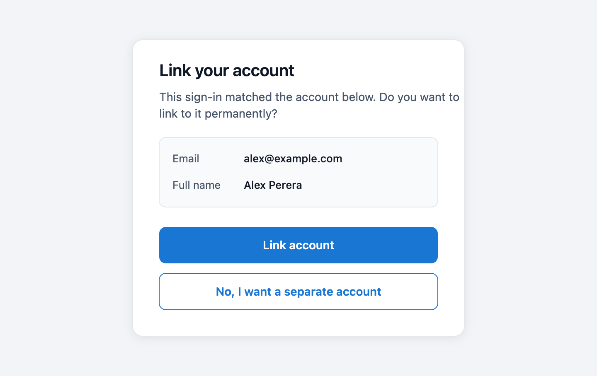

# Federated Account Linking Specification

- **Status:** Draft
- **Version:** 0.1
- **Related documents:**
  [Flows: advanced configurations](../../docs/content/guides/flows/advanced-configurations.mdx),
  [Add an OIDC provider](../../docs/content/guides/identity-providers/add-oidc-provider.mdx),
  [User type reference](../../docs/content/guides/users/user-type-reference.mdx)

## Summary

Currently a federated sign-in resolves a local user inside the authentication layer, by looking up
the `sub` claim and then the connection's account-linking attributes. A matching attribute names an
account. It does not prove one. Whoever controls an email address at an external identity provider
is signed in as the local account holding that email, with nothing asked and nothing recorded. And
because nothing is recorded, every sign-in repeats the match, so the account a returning identity
lands on depends on an attribute that can change or be reused.

This feature separates the candidate vs proven user. **A federated authentication will resolve a
local user only through a recorded `(connection, subject)` link.** Matching an unlinked identity
against an existing account moves out of the authentication layer into a flow node, Account Linking
(`LinkingExecutor`). That node owns an `accountLinkingMode` property, which decides what a match has
to be backed by before it counts: `silent` takes the match alone, `verified` makes the End-User
prove the local account, and `approval` makes them accept it. Every outcome that settles an unlinked
identity onto an account that already exists records the link at that node. `ProvisioningExecutor`
records only the link of a user it just created.

One rule governs the split. Resolution proves, matching only names, and exactly one layer does each.
The authn provider turns a token into an entity and never has to guess or assume whether an account
is linked. The flow decides whether a match is good enough to become one.

Also in scope, because the same guarantee depends on them: the provisioning executor's detection of
an existing account, the federated identity carried through a flow across a second federated
authentication, flow validation of linking graphs, Console authoring for the node and its prompt,
and the client-error classification on the authentication assertion path.

Out of scope: unlinking an identity, an administrative API to list or revoke links, and cleanup of
links when a connection is deleted. There is also no migration. Flows that rely on the provider
matching attributes for them will stop resolving a user until an Account Linking node follows the
federated node. Breaking them is the main reason for this feature, since the behavior they rely on
is the one being fixed.

## Architecture

| Layer                                                                | Responsibility after this change                                                                                                                                                             |
| -------------------------------------------------------------------- | -------------------------------------------------------------------------------------------------------------------------------------------------------------------------------------------- |
| Entity (`internal/entity`)                                           | Stores links in the `linkedIds` system attribute, indexes each subject as an `ENTITY_IDENTIFIER` row, and resolves a `(connection, subject)` pair to one entity.                             |
| Federated authn (`internal/authn/oauth`, `oidc`, `google`, `github`) | Maps claims and builds the token that names the federated identity. Resolves nothing.                                                                                                        |
| Authn provider (`internal/authnprovider/...`)                        | Turns a token into an entity. The default provider resolves a federated token through the recorded link only; it also writes links. The REST provider forwards both to the external service. |
| Authn provider manager                                               | Adds the three operations a flow needs over an `AuthUser`: resolve a candidate from the account-linking attributes, promote a candidate to authenticated, and record a link.                 |
| Flow executors (`internal/flow/executor`)                            | Federated executors publish the identity into `RuntimeData`; `LinkingExecutor` decides and records; `ProvisioningExecutor` creates and records.                                              |
| Flow management (`internal/flow/mgt`)                                | Validates that a linking node has somewhere to forward to and that the decisions it must read are routed back to it.                                                                         |
| Authentication service (`internal/authn`)                            | The atomic (non-flow) federated API, which has nowhere to prompt, behaves as silent mode.                                                                                                    |
| Console (`frontend/apps/console`)                                    | Offers the executor, its properties, the approval prompt step, the two widgets that wire a working graph, and the element and action type that prompt needs.                                 |

No new data mechanism is needed to carry this. The feature runs on the `AuthUser` per-provider state
(entity reference token and attribute token), `RuntimeData` for values that outlive a node, the
prompt node's `ForwardedData["actionType"]` hand-off that `sessionSignOutExecutor` already relies
on, the `ENTITY_IDENTIFIER` index with its multi-value primary key, and the reserved system
attribute mechanism that already preserved `credentialUpdatedAt`.

## Detailed design

### Link storage and resolution

The entity service records a link in the entity's server-owned system attributes under `linkedIds`,
keyed by connection and holding that connection's subjects:

```json
{ "linkedIds": { "<idpId>": ["<sub>"] } }
```

One connection can hold several subjects, so a user may link more than one account at the same
provider. `entityService.LinkFederatedIdentity` reads the current blob inside a transaction, appends
the subject if it is not already recorded, and writes the blob back. Recording a subject that is
already there is a no-op, which matters because every federated sign-in calls it.

`linkedIds` joins `credentialUpdatedAt` in the reserved system attribute keys. Both write paths
replace the blob wholesale, and the services that own an entity rebuild it from their own model, so
an unrelated update drops any key that is not reserved. The preservation that holds one key today
has to hold a list.

Each subject gets its own `ENTITY_IDENTIFIER` row: name `linkedIds.<idpId>`, value the subject,
`source = 'system'`. Putting the connection in the name and the subject in the value buys three
things. The name stays inside the column's 255 characters whatever the connection emits, and OIDC
permits a 255-character subject on its own. One name carries several values, so a user can hold more
than one account per connection. A connection's links stay enumerable, which is what a future unlink
needs. `linkedIdentifierName` derives that name for both the read and the write path, and a
second copy of the derivation anywhere is how links come to be written successfully and never
resolve.

The index covers federated links unconditionally, not through `user.indexed_attributes`. Gate them
on a configuration line and a missing entry silently breaks federated login. A malformed entry in
the blob is skipped instead of failing the write, so one bad link cannot block an unrelated
attribute update.

`ResolveFederatedIdentity(idpID, sub)` reads the index and nothing else, so a miss definitively
means "not linked yet" and never falls back to a JSON scan. Two rows mean two entities claim one
identity. That is a data integrity problem rather than a choice, so the call returns
`ErrAmbiguousEntity` and the sign-in fails instead of picking one.

The database store, the composite store and the file-based (declarative) store all implement the
lookup. The declarative store has no index, so it reads the blob directly. The cache-backed store
passes the call straight through. A cache would save nothing over a single indexed hit, and a stale
entry would authenticate a subject as the wrong entity once the link set changes.

### The federated token

`BuildFederatedAuthResult` is the shared entry point for every federated authenticator. It maps
claims and returns a token that names the identity:

```json
{"federatedIdpId": "<idpId>", "sub": "<sub>", "<linkingAttr>": "<value>", ...}
```

It resolves nothing. The account-linking attributes travel with the token instead of being consumed
here, because whether an attribute match may authenticate is the authn provider's call and the
flow's, not this layer's. This deletes `GetInternalUser`, `buildAccountLinkingFilter` and
`resolveFilter`, and the OAuth authn service stops taking an entity provider at all.

`authnprovidercm.IsFederatedToken` reports whether a token names a federated identity. Both halves
are required, because a subject is unique only within the connection that issued it.

### Provider-side resolution

The default authn provider resolves a federated token through `ResolveFederatedIdentity` alone. A
hit yields the entity. A miss hands the token back unchanged as both the entity reference token and
the attribute token, so the identity keeps travelling as pending. The `AuthUser` then reads as
authenticated and survives node boundaries and flow pauses on its own, while resolving to nobody.
An ambiguous link fails as a client error. A federated token that reaches
`resolveEntityFromToken` has already been through resolution, so it fails as "user not found"
rather than falling through to `IdentifyEntity`, which would scan for keys no index can answer.

`LinkFederatedIdentity` on the provider resolves the entity from the caller-supplied entity
reference token, the provider's own, and writes the link. A provider that does not store links
returns `ErrorCodeInvalidRequest`, which the manager reads as "nothing to do" rather than a failure.
Failing the sign-in over it would break every federated authentication through that provider.

### Candidate resolution and promotion

The manager adds three operations, all over the `AuthUser`:

- `ResolveFederatedCandidate` strips the two federated keys from the pending token and resolves what
  is left through the ordinary indexed attribute lookup. Nothing here touches the `AuthUser`, since
  a match names an account without proving it. Nothing matching returns `nil, nil`; two entities
  matching fails.
  A federated token carrying no linking attributes yields no filter, which means the connection
  configured nothing to match on.
- `PromoteCandidateReference` swaps the pending federated token for `{"userID": "<id>"}` on both the
  entity reference token and the attribute token. A promoted candidate's attributes are the local
  account's, and the federated token resolves to nobody by design. Only the flow knows what the
  candidate is, so the caller names it; nothing pending is a client error rather than a silent
  no-op.
- `LinkFederatedIdentity` picks the provider that should store the link. With one provider in the
  `AuthUser` it is that one; with several, which happens once a password authentication follows the
  federated one, it is whichever provider claimed the federated credential. The token it passes is
  the provider state's entity reference token, or the already-resolved reference's entity id.

`GetEntityReference` keeps its contract and fails the whole lookup if any one provider state
does not resolve. That is what makes a pending identity alongside an earlier authentication read as
"nobody authenticated" rather than as the earlier user.

### The Account Linking node

`LinkingExecutor` is a utility executor supported in authentication and registration flows, with two
properties: `accountLinkingMode` (`silent` by default) and `linkingApprovalAttributes` (an ordered
list of `{label, attribute}` objects, defaulting to the `email` attribute under an `Email` label). It runs in at most two passes, distinguished by
`RuntimeData["linkingVerificationRequested"]`.

**First pass.** Four outcomes:

1. Somebody is already authenticated. This is a returning identity whose link is recorded, so there
   is nothing to decide and nothing to write. Completes with `entityState = exists`.
2. Nothing matched. This identity has no local account; the node completes and provisioning creates
   one.
3. A candidate matched under `silent`. The node promotes it immediately, writes the link, and
   completes.
4. A candidate matched under `verified` or `approval`. The node stores the candidate id in
   `RuntimeData["linkingCandidateUserId"]`, sets the verification marker, publishes the matched
   account's `linkingApprovalAttributes` values into `AdditionalData["linkingApprovalDetails"]` as a
   JSON array of `{label, value}` objects, and goes `USER_INPUT_REQUIRED`, forwarding to
   `onIncomplete`.

An invalid mode value is logged and treated as non-silent, the safer of the two directions. Failing
to load the candidate entity is cosmetic rather than fatal, so the prompt renders without the
details, and an attribute the candidate does not carry is left out along with its label rather than
shown blank.

**Second pass.** Both non-silent modes forward to the same prompt, which names the matched account
and offers two buttons and no field. The answer is which action was raised, never a value anyone
typed. Each button carries an `action.type` that the prompt node forwards to whatever that action
points at, as `ForwardedData["actionType"]`.

| Forwarded type | Meaning                                                                                               | Where the action points                                                                                                                                                             |
| -------------- | ----------------------------------------------------------------------------------------------------- | ----------------------------------------------------------------------------------------------------------------------------------------------------------------------------------- |
| `REJECT`       | The End-User wants a separate account. The candidate is cleared and the flow continues as a new user. | Back at the linking node, in both modes.                                                                                                                                            |
| `CONFIRM`      | The End-User accepts the match.                                                                       | Back at the linking node in `approval` mode, where saying yes is the whole of what the mode requires; at the verification step in `verified` mode, where it never reaches the node. |
| none           | A verification step ran. Whoever authenticated decides.                                               | n/a                                                                                                                                                                                 |

`CONFIRM` rather than `SUBMIT` is the acceptance because `SUBMIT` is what an ordinary form action
carries, so reading it here would let any plain submit wired at this node pass as an acceptance.

With no recognized type, the node reads who authenticated. Nobody authenticated means the
verification was attempted and failed (`ErrVerificationNotCompleted`, `FET-1090`); this is also the
guard against re-offering the chooser forever, since the engine has no visited-node tracking and no
step cap. Somebody other than the candidate authenticated fails with `ErrCandidateNotVerified`
(`FET-1089`). The candidate itself authenticated writes the link and completes.

What proves the account is the flow author's call: a password prompt, a passkey, an OTP, another
connection, or a `LOGIN_OPTIONS` chooser offering several. The node only checks that the entity that
authenticated is the candidate it sent.

A step that authenticates against a named user takes the candidate from `RuntimeData` rather than
asking for it. `CredentialsAuthExecutor` reads `linkingCandidateUserId` the way it already reads a
userID left by `IdentifyingExecutor` in resolve mode, so a password step on the verification branch
collects the password alone and authenticates it against the matched account. A step that resolves
its own user, a second federated connection being the plain case, is what the candidate check
exists for.

Promotion that fails is terminal wherever it happens: `ErrFailedToIdentifyUser` on the silent path,
`ErrLinkingApprovalPromotionFailed` (`FET-1093`) after an acceptance. Continuing instead would reach
provisioning with nobody authenticated and no candidate left to refuse over, which creates the
duplicate the whole node exists to prevent.

A refusal continues to provisioning, which creates a user carrying the attribute that matched. Where
that attribute is unique, the create fails on the constraint and the End-User sees a provisioning
failure. That is the intended path. The refusal is honored, and the uniqueness rule is what stops a
second account on the same address, so nothing raises a separate error for it.

### Carrying the identity through the flow

The connection id lives in the federated node's properties, which later nodes cannot read, so the
federated executors publish it. Three `RuntimeData` keys:

- `federatedIdpId`: the connection the most recent federated authentication ran against.
- `pendingLinkIdpId` / `pendingLinkSub`: the identity actually being linked. Only the first
  federated authentication in an execution sets them, and only when it published a subject; a later
  verification-step federated login cannot overwrite them. Claiming the keys with a connection id
  alone would leave a pair that can never be completed nor overwritten, so both are set together or
  neither is.

`federatedIdentityFrom` prefers the pending pair and falls back to `federatedIdpId` + `sub`, and
returns nil for every non-federated flow, which is what keeps credentials, OTP, passkey,
self-registration and OpenID4VP on their existing paths.

Two existing mechanisms had to change for a second federated authentication mid-flow:

- `validateFederatedIdentifierConsistency` compares the incoming subject and email against what the
  context already holds. A federated authentication at a connection other than the one being linked
  is a verification step. Its subject and email are its own and will not match, so the comparison is
  skipped for it.
- `consumeFederatedCallbackInputs` takes the authorization code and state off the context once a
  callback is processed. `UserInputs` persist for the whole execution, so the next federated node
  reads a code left behind as its own, skips its redirect, and exchanges this connection's code at
  its own token endpoint. A verified or approval linking node forwards to exactly such a node.

`setFederatedEntityState` has to return early for an unauthenticated `AuthUser` instead of asking
`GetEntityReference`, which treats being asked in that state as a fault and logs an error that reads
as a bug rather than the ordinary outcome it is here.

### Where the link is written

Exactly one writer per outcome, and every writer goes through the authn provider rather than the
entity store, so the provider holding the user is the one that stores the link:

| Outcome                                            | Writer                                      |
| -------------------------------------------------- | ------------------------------------------- |
| Candidate promoted silently, approved, or verified | `LinkingExecutor`                           |
| No local account, user just created                | `ProvisioningExecutor`                      |
| Returning identity that already carries its link   | nobody; there is nothing to record          |
| Atomic federated API, silent-equivalent            | `authenticationService.recordFederatedLink` |

`LinkingExecutor` reads the identity from `RuntimeData` rather than from the `AuthUser`, because
promotion has already replaced the pending token. By the time a link is worth writing, the
`AuthUser` no longer names the connection or the subject. A failed write fails the flow
(`ErrLinkingWriteFailed`, `FET-1094`); completing anyway would sign the user in with nothing
recorded, and the next sign-in would resolve nothing and provision a duplicate.

`ProvisioningExecutor` writes the link of the user it just created rather than deferring it to the
next sign-in, because deferring only works while attribute linking is enabled; with it off the next
sign-in would miss the index, find no fallback, and provision a duplicate that then fails on a
unique attribute.

On the atomic API the write is its own commit point. Authentication has completed with no pending
second factor, so no window exists in which a link outlives a sign-in that never finished. A failure
is logged and swallowed, since the user has authenticated and the only cost is that the next sign-in
resolves the same way this one did.

### Provisioning: detecting an existing account

`ProvisioningExecutor` today identifies an existing user from every identifying attribute collected,
in one conjunctive filter. That filter can match a user the store would not reject, or miss one it
would. Three rules replace it:

- **A user this execution already resolved wins.** In an authentication flow, a resolved user
  short-circuits the whole executor before required inputs are collected, so the flow does not
  prompt for schema attributes that user already has. Registration flows keep the longer path, which
  decides separately whether an existing user may continue.
- **Otherwise, one lookup per unique attribute.** Only attributes the user type schema marks
  `unique`, and that the flow collected, can identify a conflict, because the store rejects the
  write when any single one is taken. A combined filter is conjunctive and would not model that.
  Name order keeps the reported conflict stable. Credential attributes are never used.
- **A federated sign-in skips the attribute lookup entirely.** A federated identity's account is the
  one its recorded link names, never one that merely shares an attribute.

Two guards close the paths that would otherwise duplicate an account:

- Reaching provisioning in an authentication flow with `linkingCandidateUserId` still set means a
  candidate was named and nobody proved or promoted it. Provisioning is refused
  (`ErrUnverifiedLinkingCandidate`, `FET-1091`). A candidate the End-User refused is cleared rather
  than left behind, so it does not land here.
- `verifiedAsResolvedCandidate` covers the shape where a candidate was resolved before
  authentication (`IdentifyingExecutor` in resolve mode) and a linking verification step was
  offered. A federated option at that step is indexed by connection alone, so a second account
  linked at the same connection could complete it, and every downstream write routes through the
  `AuthUser`. The check fails with `ErrCandidateVerificationMismatch` (`FET-1088`). Flows with
  neither marker, which is every ordinary flow, return untouched.

The registration-flow branch that assumes a federated identity has no local account goes away. A
returning identity that already carries its link resolves first and defers to the existing-user
rules, instead of collecting a second account.

### Flow validation

`validateLinkingExecutor` runs on save:

- A node in `verified` or `approval` mode requires `onIncomplete`. Silent mode is a pass-through and
  needs none.
- Every action the node has to read must point straight back at the node, because a forwarded action
  type survives exactly one hop. That is `REJECT` in both modes, and `CONFIRM` in `approval` mode
  only; in `verified` mode the confirmation leads to the verification step and may point anywhere.
  A misrouted action is silently inert at runtime, and the node would report a verification nobody
  completed.

The Console adds a graph rule, `linkingRejectActionRule`, that warns while authoring when a `REJECT`
button is unwired or does not lead back to a linking node. It covers the refusal only. In verified
mode the confirmation may legitimately point anywhere, so a client-side rule would have to guess the
mode, and it would flag correct graphs. The server still rejects a misrouted confirmation on save,
with a precise message.

### Error classification on the authentication assertion path

`authAssertExecutor` wraps provider failures in `errors.New`, which throws the classification away
before the flow sees it. Every provider error then answers `500 / SSE-5000`, including a caller's
own mistake, such as a federated sign-in that names no local user and carries no allowance. Both
fetches have to record a client error on the response (`ErrFailedToIdentifyUser`,
`ErrAttributeRetrievalFailed`) so the flow terminates in `ERROR` carrying the code. Server-type
errors still collapse to 500.

### Data model

No schema change. This reuses the existing `ENTITY_IDENTIFIER` table. The multi-value primary key
that lets one identifier name carry several values ships separately, as a prerequisite.

One query is added, `ASQ-ENTITY_MGT-30` (`QueryResolveIdentifier`), an exact `NAME`/`VALUE` lookup
scoped by `DEPLOYMENT_ID` that returns the entity ids claiming the identifier. More than one row
counts as ambiguous rather than resolved.

Links live in the `linkedIds` key of the entity's system attributes, described above. It is
server-owned, and the user API never returns it.

### API

No public REST endpoint is added or changed. Two behaviors change:

- `FinishIDPAuthentication`, the atomic federated authentication API, has no flow in which to
  prompt, so after authenticating it resolves a candidate and promotes it immediately, mirroring
  silent mode, then records the link. Verified and approval cannot be reached here by construction.
  The error mapping gains the ambiguous-user and entity-reference client-error codes, both of which
  answer as a failed federated authentication.
- Custom authn providers (the REST provider contract) gain `POST /link-federated-identity` with body
  `{entityReferenceToken, idpId, sub}`, answering `200` with no body. The call is idempotent by
  contract, so recording a subject the provider already holds answers `200`. A provider that does
  not store links answers with the invalid-request code, and the sign-in proceeds unaffected.

### UI

The node, its properties, and the prompt it forwards to, are added to the Console.

**Account Linking executor.** Listed on the resource panel as a task execution with `onSuccess`,
`onFailure` and `onIncomplete` handles. Its property panel (`LinkingProperties`) offers the mode as
a select (Silent / Verified / Approval, defaulting to Silent) and the approval prompt attributes as
a `KeyValueEditor`, each row pairing the label to show with the attribute to read. Naming none
falls back to the `email` attribute under the localized `Email` label.

**Link Approval View.** A new step in the catalog, holding a heading, an explanatory line, the
matched account's details rendered from `linkingApprovalDetails`, and a block with two submit buttons
carrying `CONFIRM` and `REJECT`. No field.



| Region                       | Element                                                   |
| ---------------------------- | --------------------------------------------------------- |
| Heading                      | `TEXT`, `HEADING_3`                                       |
| Explanatory line             | `TEXT`, `BODY_1`                                          |
| Matched account              | `KEY_VALUE_LIST`, `source: linkingApprovalDetails`        |
| Link account                 | `ACTION`, `PRIMARY`, `actionType: CONFIRM`                |
| No, I want a separate account | `ACTION`, `SECONDARY`, `actionType: REJECT`               |

Both modes render this screen; only where the `CONFIRM` action points differs. The rows shown are
whatever `linkingApprovalAttributes` names on the matched account, defaulting to its email, and the
list renders nothing when none of those attributes are available.

**`KEY_VALUE_LIST` element.** A general display element rendering label/value rows read at runtime
from the additional data key named in `source`, accepting either an array or the JSON encoding of
one, since additional data carries strings. It is bound to a key rather than to a fixed set of rows,
so whatever publishes the pairs decides how many there are and what they are called, and the flow
author only names where to read them. Rows carrying no value are dropped, and a list with no rows
left renders nothing. On the canvas there is no runtime value, so the adapter shows the bound key.

**Widgets.** Two catalog entries drop a working graph in one action, since the node, the prompt and
the routing between them are what an author would otherwise wire by hand. Account Linking with
Approval adds the node in `approval` mode and the approval view, both of whose actions point back at
the node. Account Linking with Verification adds the same pair with the confirmation routed instead
to the branch that proves the account: a view collecting the password alone, and a
`CredentialsAuthExecutor` step that returns to the node.

**`REJECT` action type.** The button action selector gains "Reject Action" beside "Confirm Action".
Both are a submit button plus a prompt action, and both carry the same literal that is persisted as
`prompts[].action.type`, so the Console vocabulary and the flow definition are one vocabulary rather
than a UI-only alias. Picking a plain action clears only the types this selector owns.

The approval prompt runs into two existing Console defects, which this specification fixes alongside
it. The Console has to translate its `CHECKBOX` element to the API's `BOOLEAN_INPUT` on save and
back on load. And an execution node preceded by a chooser has to collect the inputs of the option
that routes to it, rather than every input on the screen, which today makes the executor demand
fields a different option collects.

## Requirements

### R1. A federated identity resolves a local user only through a recorded link

**Requirement:** Authentication must never sign an End-User into a local account on the strength of
a matching attribute alone.

**Acceptance criteria:**

- **AC1.1:** Given a connection with account-linking attributes configured and a local user holding
  a matching email, when a federated identity with no recorded link authenticates through a flow
  with no Account Linking node, then no local user is resolved and the flow proceeds as a new user.
- **AC1.2:** Given a recorded link for `(connection, subject)`, when that identity authenticates
  again, then the linked account is resolved with no prompt, regardless of whether its account-
  linking attributes still match.
- **AC1.3:** Given two entities linked to the same `(connection, subject)` pair, when that identity
  authenticates, then the sign-in fails as ambiguous rather than resolving either.
- **AC1.4:** Given a federated identity with no link, when the account-linking attributes match more
  than one account, then the sign-in fails rather than choosing one.

### R2. Links are stored per connection, allow several subjects, and survive unrelated updates

**Requirement:** A link must be durable, indexed, and must not be lost by a write that rebuilds the
entity's system attributes.

**Acceptance criteria:**

- **AC2.1:** Given an entity with no links, when a link is recorded, then `linkedIds` holds the
  subject under the connection id and one `ENTITY_IDENTIFIER` row exists for it.
- **AC2.2:** Given an entity already linked at a connection, when a second subject at the same
  connection is recorded, then both subjects are held and both resolve to that entity.
- **AC2.3:** Given an entity already linked to a subject, when the same subject is recorded again,
  then the stored value is unchanged and no duplicate is appended.
- **AC2.4:** Given an entity with links, when an unrelated service replaces the entity's system
  attributes, then `linkedIds` is preserved.
- **AC2.5:** Given a declarative (file-based) entity carrying `linkedIds`, when that identity
  authenticates, then the entity resolves, without an index.

### R3. Silent mode links on the match alone

**Requirement:** A flow author must be able to keep the pre-existing convenience of attribute-based
linking, explicitly.

**Acceptance criteria:**

- **AC3.1:** Given an Account Linking node with no mode set, when an identity matches an existing
  account, then the account is signed in, the link is recorded, and no prompt is shown.
- **AC3.2:** Given a silent-mode node, when the identity matches nothing, then the flow continues to
  provisioning as a new user.
- **AC3.3:** Given a silent-mode node, when promotion of the matched account fails, then the flow
  fails rather than continuing to provisioning.

### R4. Verified mode links only after the local account is proved

**Requirement:** A match must be provable by the End-User before the identity is linked to it.

**Acceptance criteria:**

- **AC4.1:** Given a verified-mode node and a matching account, when the identity authenticates,
  then the flow prompts with the matched account's configured attribute rather than signing in.
- **AC4.2:** Given that prompt, when the End-User confirms and then authenticates as the matched
  account, then the link is recorded and the flow completes as that account.
- **AC4.3:** Given that prompt, when the End-User confirms and the verification fails, then the flow
  fails with `FET-1090` and no link is recorded.
- **AC4.4:** Given that prompt, when the verification is completed by an account other than the
  candidate, then the flow fails with `FET-1089` and no link is recorded.
- **AC4.5:** Given a verification step that is itself a federated authentication at another
  connection, when it completes, then the identity linked is the one that started the flow, not the
  one that verified.
- **AC4.6:** Given a verified-mode node forwarding to a password step, when that step runs, then it
  collects the password alone and authenticates it against the candidate, with no identifier asked
  for.

### R5. Approval mode links on the End-User's acceptance

**Requirement:** Where the local session or context already proves the local side, acceptance alone
must be enough.

**Acceptance criteria:**

- **AC5.1:** Given an approval-mode node and a matching account, when the identity authenticates,
  then the flow prompts naming the matched account.
- **AC5.2:** Given that prompt, when the End-User accepts, then the account is signed in and the
  link is recorded.
- **AC5.3:** Given that prompt, when the End-User refuses, then the candidate is dropped and the
  flow continues to provisioning as a new user; where the matched attribute is unique, provisioning
  fails on the uniqueness rule.
- **AC5.4:** Given a linked account, when the same identity signs in again, then no prompt is shown.

### R6. Every settling outcome records its link, exactly once

**Requirement:** A sign-in that settles an identity onto an account must leave a link behind, so the
next sign-in resolves without repeating the decision.

**Acceptance criteria:**

- **AC6.1:** Given any mode, when the node settles the identity onto an existing account, then the
  link is recorded before the node completes.
- **AC6.2:** Given a new user, when provisioning creates the account, then provisioning records the
  link.
- **AC6.3:** Given a returning identity whose link is already recorded, when the node runs, then no
  write is attempted.
- **AC6.4:** Given that the link write fails, when the node would otherwise complete, then the flow
  fails with `FET-1094` instead.

### R7. Provisioning does not duplicate an account

**Requirement:** Provisioning must detect an existing account on the same rules the store enforces,
and must refuse to run where it would duplicate an account the flow was about to link.

**Acceptance criteria:**

- **AC7.1:** Given a user type with unique attributes, when provisioning runs with a collected value
  that an existing user holds, then that user is reported as existing rather than a duplicate being
  attempted.
- **AC7.2:** Given a user type with no unique attributes, when provisioning runs, then no lookup is
  performed and the record is created.
- **AC7.3:** Given a federated sign-in, when provisioning runs, then no attribute lookup is
  performed.
- **AC7.4:** Given an authentication flow where a linking candidate was named and never settled,
  when provisioning is reached, then it fails with `FET-1091`.
- **AC7.5:** Given a registration flow and a federated identity that already carries its link, when
  provisioning is reached, then the existing-user rules apply and no second account is created.
- **AC7.6:** Given a candidate resolved before authentication and a linking verification step, when
  a different account completes that step, then provisioning fails with `FET-1088`.

### R8. A linking graph that cannot work is rejected before it runs

**Requirement:** Misrouting that is silently inert at runtime must be caught at authoring or save
time.

**Acceptance criteria:**

- **AC8.1:** Given a linking node in verified or approval mode with no `onIncomplete`, when the flow
  is saved, then the save is rejected naming the node.
- **AC8.2:** Given a linking node whose prompt's `REJECT` action points anywhere other than that
  node, when the flow is saved, then the save is rejected naming the action and the prompt.
- **AC8.3:** Given an approval-mode node whose prompt's `CONFIRM` action points elsewhere, when the
  flow is saved, then the save is rejected; given a verified-mode node, then it is accepted.
- **AC8.4:** Given a flow with a linking node, when a `REJECT` button is unwired or leads elsewhere,
  then the Console raises a warning on the canvas.

### R9. The atomic federated API behaves as silent mode

**Requirement:** The non-flow federated endpoint, which cannot prompt, must keep working and must
record links.

**Acceptance criteria:**

- **AC9.1:** Given a connection with linking attributes and a matching local user, when the atomic
  federated authentication finishes, then the user is returned and the link is recorded.
- **AC9.2:** Given that same identity, when it authenticates again, then it resolves through the
  recorded link.
- **AC9.3:** Given linking attributes that match more than one user, when the authentication
  finishes, then it fails as a federated authentication failure.
- **AC9.4:** Given that recording the link fails, when the authentication has otherwise succeeded,
  then the caller still receives the authenticated user.

### R10. Custom providers participate without being required to store links

**Requirement:** An external authn provider must be able to hold the link, and must not break the
sign-in if it does not.

**Acceptance criteria:**

- **AC10.1:** Given a user held by a REST provider, when a link is recorded, then the provider's
  `/link-federated-identity` endpoint is called with the provider's own entity reference token.
- **AC10.2:** Given a provider that answers the invalid-request code, when a link is recorded, then
  the sign-in succeeds with nothing stored.
- **AC10.3:** Given an `AuthUser` holding several providers, when a link is recorded, then it is
  written by the provider that claimed the federated credential.

### R11. A caller's own error is answered as a client error

**Requirement:** A federated sign-in that names no local user must not answer as a server fault.

**Acceptance criteria:**

- **AC11.1:** Given a federated identity with no local user and no allowance, when the assertion
  node runs, then the flow terminates in `ERROR` carrying `FET-1002` rather than `500 / SSE-5000`.
- **AC11.2:** Given a server-type provider failure, when the assertion node runs, then the response
  is still a 500.

## Change log

| Version | Date       | Change                                                                                   |
| ------- | ---------- | ---------------------------------------------------------------------------------------- |
| 0.1     | 2026-09-21 | Initial specification.                                                                   |
| 0.2     | 2026-09-22 | Add the candidate-aware password step and the two Console widgets.                       |
