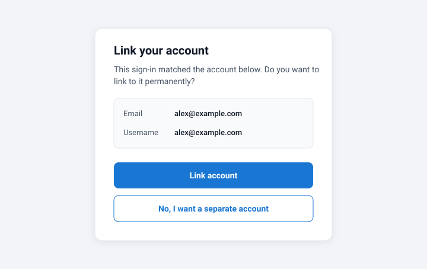
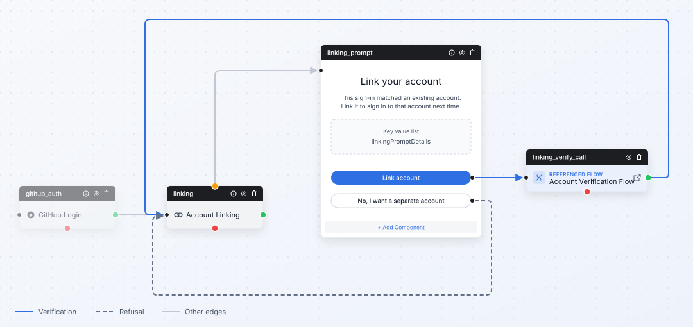
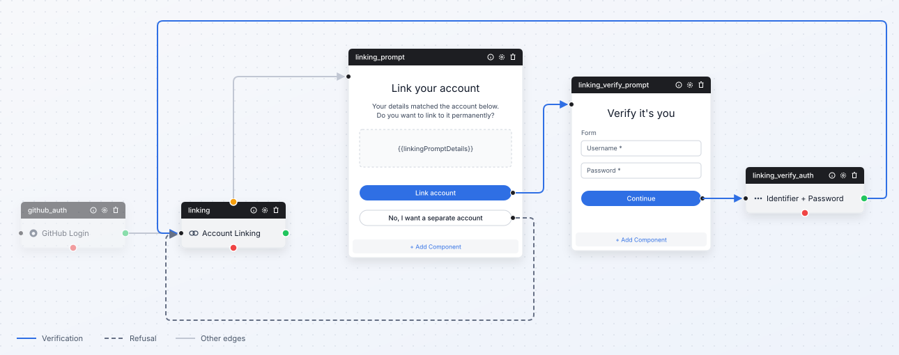

# Federated Account Linking Specification

- **Status:** Draft
- **Version:** 0.3
- **Related documents:** [Threat model](threat-model.md), multi-value support for the `ENTITY_IDENTIFIER` table (prerequisite), [Flows: advanced configurations](../../docs/content/guides/flows/advanced-configurations.mdx), [Add an OIDC provider](../../docs/content/guides/identity-providers/add-oidc-provider.mdx), [User type reference](../../docs/content/guides/users/user-type-reference.mdx), [OpenID Connect Core, Section 2](https://openid.net/specs/openid-connect-core-1_0.html#IDToken)

The key words MUST, MUST NOT, SHOULD and MAY are to be interpreted as described in [RFC 2119](https://www.rfc-editor.org/rfc/rfc2119).

## Summary

A federated sign-in has to decide which local account, if any, the incoming identity becomes. Today ThunderID answers that by looking the identity up on user attributes: a `sub` attribute, then the connection's account-linking attributes. Any unique match signs the End-User in. An external provider that asserts a victim's email therefore signs its user in as the victim.

This specification proposes that a federated identity resolves a local account only through a recorded `(connection, subject)` link. The link lives on the entity as a server-owned system attribute and is indexed for lookup.

An identity with no link MAY be matched against existing accounts on the connection's account-linking attributes. The match happens in one place, a new Account Linking flow node, and it only names candidates. The node shows the End-User the values that matched and asks whether to link or to continue with a separate account. Linking runs a verification sign-in chosen by the flow author, either as a separate flow through a `CALL` node or as steps in the same flow. The node records the link only when the End-User authenticates there as one of the candidates. Refusing drops the candidates, and the flow continues as a new user.

The federated executors hand the identity and its claims to later nodes as one `RuntimeData` entry, `externalIdentity`, and never write a claim under its own name. A claim therefore cannot take the place of the state executors use to steer the flow.

Exactly two executors write links. The Account Linking node writes one for a verified candidate, and provisioning writes one for the user it creates. The direct federated authentication API resolves recorded links and never writes one.

Out of scope: unlinking an identity, an administrative API to list or revoke links, and removing links when a connection is deleted.

## Architecture

| Component | Responsibility |
| --- | --- |
| Entity service and stores (`internal/entity`) | Store links in the `linkedIds` system attribute, index each subject as an `ENTITY_IDENTIFIER` row, and resolve a pair to at most one entity. |
| Federated authn services (`internal/authn/oauth`, and the OIDC, Google and GitHub services built on it) | Exchange the code, map the claims, and build the federated token with its account-linking filters. They resolve nothing. |
| Identity provider management (`internal/idp`) | Derive the account-linking filters from a connection's configuration, and reject reserved linking attributes when a connection is saved. |
| Default authn provider (`internal/authnprovider/defaultprovider`) | Resolve a federated token through a recorded link only, list the entities an ambiguous attribute lookup matches, and write links. |
| REST authn provider (`internal/authnprovider/restprovider`) | Forward link writes to the custom provider service. |
| Authn provider manager (`internal/authnprovider/manager`) | Resolve candidates from the account-linking filters, and route a link write to the provider that holds the user. |
| Flow core (`internal/flow/core`) | Decode the `externalIdentity` entry for the executors and prompts that read claims. |
| Flow executors (`internal/flow/executor`) | The federated executors publish the identity and its claims as the `externalIdentity` entry. `LinkingExecutor` matches, prompts, saves and restores the checkpoint around verification, checks the verification, rolls the `AuthUser` back when the wrong account verified, and writes the link. `ProvisioningExecutor` creates and links a new user and refuses to create one while candidates are unsettled. |
| Flow management (`internal/flow/mgt`) | Validate the wiring around a linking node when a flow is saved. |
| Authentication service (`internal/authn`) | Serve the direct federated API from recorded links only. |
| Console (`frontend/apps/console`) and flow renderer (`frontend/packages/design`) | Author the linking node, its prompt and its verification step, and render the matched values at runtime. |

The design reuses two existing seams without modifying them.

- The `ENTITY_IDENTIFIER` table, with the multi-value primary key `(ENTITY_ID, DEPLOYMENT_ID, NAME, VALUE)` from the prerequisite change, holds one row per linked subject.
- The flow engine's `CALL` node runs a called verification flow in a frame of its own. The called flow starts with an empty `RuntimeData`, and the engine restores the caller's `RuntimeData` when it returns. The `AuthUser` and `UserInputs` are shared across both frames.

In-frame verification needs no engine change. Executors hold the engine's own `RuntimeData` map, so the linking node saves and restores it itself (see [The checkpoint](#the-checkpoint)). The engine adopts any authenticated `AuthUser` an executor returns, so the linking node can also put back the `AuthUser` it saved.

## Detailed design

### Link storage

A link MUST live in the entity's server-owned system attributes under `linkedIds`, keyed by connection id and then by subject:

```json
{ "linkedIds": { "<idpId>": { "<sub>": {} } } }
```

An entity MAY hold several subjects for one connection. Each subject maps to an object holding that link's own data. The object is empty today. Later per-link data, such as when the link was last synced, goes inside it.

`EntityService.LinkFederatedIdentity(entityID, idpID, sub)` MUST require all three arguments. It MUST run as one transaction that:

1. holds a write lock on the entity for the rest of the transaction;
2. resolves the pair and fails with `ErrFederatedIdentityConflict` when another entity already holds it, or when the pair is already ambiguous;
3. reads the entity's system attributes and adds the subject under the connection with an empty object;
4. writes the system attributes back.

Recording a subject the entity already holds MUST be a no-op. The lock stops two concurrent writes to the same entity from losing a subject.

`linkedIds` and `credentialUpdatedAt` are the reserved system attribute keys. A service that replaces an entity's system attributes wholesale MUST carry both over.

Each subject MUST be indexed as its own `ENTITY_IDENTIFIER` row with name `linkedIds.<idpId>`, value `<sub>`, and `SOURCE = 'system'`. The per-link object MUST NOT be indexed. The write path and the read path MUST derive the name the same way. Links MUST be indexed whatever `user.indexed_attributes` holds. A malformed entry in the attribute MUST be skipped when the rows are built.

The user API MUST NOT return `linkedIds`.

### Link resolution

`EntityService.ResolveFederatedIdentity(idpID, sub)` MUST require both halves of the pair and return:

- the entity id when exactly one entity holds the pair,
- `ErrEntityNotFound` when none does,
- `ErrAmbiguousEntity` when more than one does.

The database store MUST answer from the index with a new query, `ASQ-ENTITY_MGT-30`, which matches `NAME` and `VALUE` exactly and is scoped by `DEPLOYMENT_ID`. It MUST NOT scan attributes. The file-based store reads `linkedIds` from each declarative resource's system attributes. The composite store tries the database store first and then the file-based store. The cache-backed store MUST pass the call through without caching, so a changed link set takes effect on the next sign-in.

### The federated token

Every federated authenticator (OAuth, OIDC, Google, GitHub) MUST exit through one shared builder. It maps the claims through the connection's attribute mappings and returns a token that names the identity:

```json
{
  "federatedIdpId": "<idpId>",
  "sub": "<sub>",
  "accountLinkingFilters": [{ "<localAttr>": "<value>" }, { "<localAttr>": "<value>" }]
}
```

The mapped claims come back alongside the token as the authenticated claims. After the filters are built, the builder MUST set the authenticated claims' `sub` to the token's `sub`. A connection MAY map any claim onto the local attribute `sub`, and the flow links the `sub` it publishes, so the mappings must not be able to change it. `accountLinkingFilters` MUST be present only when the connection has account-linking attributes and at least one filter could be built. A token counts as federated only when `federatedIdpId` and `sub` are both non-empty strings. The filters sit under their own key, apart from `federatedIdpId`, `sub` and `userID`, so a filter can never name an account by id.

Change from current behavior: the OAuth service resolves the identity itself. It looks up a `sub` user attribute, then the account-linking attribute values, and returns the matched user's id in the token. `GetInternalUser` looks users up by `sub`. The service MUST stop resolving, and `GetInternalUser` is removed.

### Account-linking filters

The filters are built from the connection's `AccountLinking.Attributes`, the mapped claims, and the attribute mappings.

Each linking attribute is an external claim name. Its match targets are the local attributes that carry a value, in this order:

1. every local attribute the claim is mapped to, in mapping order;
2. the local attribute that has the claim's own name, when that name contains only letters, digits and underscores and, for a mapped claim, no other claim is mapped onto it.

A reserved name MUST NOT be a target.

Every linking attribute that has a target MUST match, and any one of its targets MAY. The result is one flat filter per combination of targets. A filter matches only when all its entries match, and the filters are alternatives. A linking attribute that has a value but no target MUST make the whole connection match nobody. A linking attribute with no value is skipped. Values MUST be compared verbatim, with no case folding and no trimming.

For example, linking on `email` with `email` mapped to `username` yields `[{"username": "<email>"}, {"email": "<email>"}]`.

The reserved linking names are `userID`, `federatedIdpId`, `credentialUpdatedAt`, `linkedIds`, and any name that starts with `linkedIds.`. Saving a connection MUST fail with an invalid attribute configuration error when a linking attribute is empty, is reserved, or is mapped to a reserved local attribute.

### Provider-side resolution

When the default provider authenticates a federated credential, it MUST handle the token as follows.

- **A recorded link resolves.** The result carries that entity's reference and attributes.
- **No link.** The token comes back unchanged as both the entity reference token and the attribute token. The `AuthUser` reads as authenticated but resolves to nobody. This is the pending federated identity.
- **Ambiguous link.** Authentication fails with the provider's ambiguous-user code, `AUP-0007`.

For a federated credential, the manager's `AuthenticateUser` MUST map `AUP-0007` to `AUTHN-MGR-1009` (`ErrorAmbiguousUser`), and the federated executor fails the flow with it. For every other credential, `AUP-0007` stays `AUTHN-MGR-1001`, as the credential flows expect.

Resolving an entity from a federated token that carries no `userID` MUST answer user-not-found. The provider MUST NOT pass a federated token to `IdentifyEntity`, so `GetEntityReference` on a pending identity always answers user-not-found.

The manager's `GetEntityReference` resolves every provider state in the `AuthUser`. It MUST fail when any state does not resolve, or when two states resolve to different entities. A later authentication at the same provider replaces that provider's state. So a pending federated identity next to an earlier authentication at a different provider reads as nobody authenticated.

Change from current behavior: the default provider passes the federated token to `IdentifyEntity` as an attribute filter, and the manager falls back to disambiguating on `sub`. Both MUST go.

### Candidate matching

`AuthnProviderManager.ResolveFederatedCandidates(authUser)` MUST take the first provider state whose entity reference token is a federated token carrying filters, and resolve each filter through that provider.

| Provider answer for one filter | Result |
| --- | --- |
| One entity | That entity is a candidate. |
| User not found | No candidate from this filter. |
| Ambiguous | The manager lists the matches through `SearchEntityReferences`, and every listed entity is a candidate. A provider without that method, or a listing with fewer than two entities, fails as ambiguous. Only the default provider implements it. |
| Server error, or any other client error | Internal server error. |

Candidates from all filters are unioned and sorted by id. `MatchedAttributes` holds the entries of every filter that matched, keyed by local attribute name, with the value the identity supplied. More than 10 candidates MUST fail as ambiguous. An `AuthUser` with no pending federated identity, or with no filter that matches, returns `nil`.

Candidate matching MUST NOT modify the `AuthUser` or write anything.

### The Account Linking node

`LinkingExecutor` is a utility executor for authentication and registration flows. It has no properties and MUST have `onIncomplete`. It runs a first pass and then settling passes, told apart by `RuntimeData["linkingVerificationRequested"]`. Settling repeats only when the wrong account verified. Every other settling outcome ends the cycle (see [Ending the cycle](#ending-the-cycle)).

**First pass.**

1. When the `AuthUser` resolves to an entity, the identity already carries its link. The node sets `entityState = exists` and completes without writing.
2. It calls `ResolveFederatedCandidates`. An error MUST fail the node with `FET-1002` (`ErrFailedToIdentifyUser`). That covers ambiguity and more than 10 candidates.
3. With no candidates, the node completes and the flow continues as a new user.
4. With candidates, the node stores their entity ids in `RuntimeData["linkingCandidateUserIds"]` as a JSON array, sets `linkingVerificationRequested = true`, saves the checkpoint, publishes the prompt details, and returns `USER_INPUT_REQUIRED`, which routes to `onIncomplete`.

The prompt details go to `AdditionalData["linkingPromptDetails"]` as a JSON array of `{"label", "value"}` objects. There is one object per entry in `MatchedAttributes`, ordered by attribute name, and labelled with the attribute name with its first letter capitalized. The values MUST be the ones the federated identity supplied, never values read from an account. The details MUST NOT reveal how many accounts matched.

**Settling pass.** The node first restores the checkpoint. It then reads `ForwardedData["actionType"]`. A prompt node sets it to the `action.type` of the button that was pressed and hands it only to the node that action points at.

| Condition | Outcome | Edge | Cycle |
| --- | --- | --- | --- |
| The action type is `REJECT` | Clear `linkingCandidateUserIds` and complete. The flow continues as a new user. | `onSuccess` | Ends |
| Nobody authenticated | Fail with `FET-1094` (`ErrVerificationNotCompleted`). | `onFailure` | Ends |
| The authenticated entity is not in `linkingCandidateUserIds` | Return `USER_INPUT_REQUIRED` with `FET-1093` (`ErrCandidateNotVerified`), and roll the `AuthUser` back (see [Retrying after the wrong account](#retrying-after-the-wrong-account)). | `onIncomplete` | Stays armed |
| The authenticated entity is a candidate | Write the link, set `entityState = exists`, clear `linkingCandidateUserIds`, and complete. | `onSuccess` | Ends |
| The link write fails with a client error | Fail with `FET-1096` (`ErrLinkingWriteFailed`). | `onFailure` | Ends |
| The link write fails with a server error | Internal server error. | None | n/a |

The node MUST ignore every action type other than `REJECT`, `CONFIRM` included, and read who authenticated. A client that submits `CONFIRM` without verifying therefore gets `FET-1094`.

`onIncomplete` carries the outcomes the End-User can retry, and `onFailure` carries the ones they cannot. Choosing the wrong account is the only retryable one. A wrong password is retried inside verification, before it reaches this node. Nobody authenticating means the verification path ended without a sign-in, which is a fault in the flow. A link conflict is permanent, and a storage fault is a server error.

The link is written with the pair from the restored `externalIdentity` entry (see [Carrying the identity through the flow](#carrying-the-identity-through-the-flow)), through `AuthnProviderManager.LinkFederatedIdentity`, against the entity the `AuthUser` now names.

### The checkpoint

The checkpoint lets verification run in the same frame as the linking node and still see what a called flow sees. The node saves and restores it for both wirings, so it does not need to know which one the flow uses.

**Save.** In step 4 of the first pass, the node MUST write `RuntimeData["linkingCheckpoint"]` as the JSON encoding of an object with two members:

- `runtimeData`: every `RuntimeData` entry as it stands with the pass's own writes, `externalIdentity` included, and `linkingCheckpoint` excluded;
- `authUser`: the `AuthUser` as the first pass found it, which holds the pending federated identity;
- `userInputs`: the `UserInputs` as the first pass found them, before verification collects any;
- `promptDetails`: the encoded prompt details the pass published. `AdditionalData` is not kept between requests, so a retry has to publish them again.

It MUST then set `externalIdentity` to the empty string. While verification runs, the pending identity and its claims are therefore absent from `RuntimeData`:

- no claim fills a verification input, and the End-User types the identifier;
- a federated verification step finds no earlier identity to compare its own with, so `validateFederatedIdentifierConsistency` passes it without a special case. Its `email` comparisons against `RuntimeData`, `UserInputs` and the authenticated user still apply, as they do inside a called flow.

The candidates and `linkingVerificationRequested` stay in `RuntimeData`. A path that leaves verification without reaching the linking node, such as a `CALL` node's `onFailure`, therefore fails closed. Provisioning fails with `FET-1095`, and link writers find no identity.

**Restore.** Before it reads anything else in a settling pass, the node MUST remove every `RuntimeData` entry that the saved `runtimeData` does not hold, other than `linkingCheckpoint`, and set every entry it holds back to its saved value. The checkpoint stays, so a retry after the wrong account can restore from it again. The node removes entries from the context's map directly, as the federated executors already do with their state key. A missing or malformed checkpoint is an internal error. The `AuthUser` and `UserInputs` are not restored here, because the `AuthUser` carries the verification result. Both are rolled back only when the wrong account verified.

After the restore, whatever the verification steps wrote is gone. That includes a `userID` a step resolved, OTP and passkey session keys, the completed auth class, the entry a federated verification step wrote, and the `failureReasonJSON` of an earlier wrong-account retry. The original `externalIdentity` entry is back for the link write, and for provisioning after a refusal.

#### Retrying after the wrong account

When the authenticated entity is not a candidate, the node MUST return the saved `authUser` as the response's `AuthUser`, put `UserInputs` back to the saved `userInputs` in the context's map, publish the saved `promptDetails` under `linkingPromptDetails` again, set `externalIdentity` to the empty string again, and keep `linkingVerificationRequested` and `linkingCheckpoint`. The engine adopts the saved `AuthUser`, because a pending federated identity reads as authenticated, and the non-candidate's authentication is discarded. The task node forwards to `onIncomplete` with `FET-1093` as `failureReasonJSON`, so the linking prompt shows the error and offers `CONFIRM` and `REJECT` again.

The retry therefore starts from the state the first verification attempt started from. Every verification method behaves as it did the first time. `UserInputs` live for the whole execution and are shared with a called flow, so without their rollback the identifier the first attempt collected would satisfy the retry's identifier input, and the retry would verify the same account again. Without the `AuthUser` rollback, the non-candidate would stay authenticated. The OTP and magic-link steps would then target that account, a federated step would fail the consistency check against its attributes, and a `REJECT` would continue signed in as it.

Before it rolls back, the node MUST check that the saved `authUser` reads as authenticated and resolves to nobody. A first pass that found somebody authenticated completes without saving a checkpoint, so a saved `AuthUser` always holds only the pending identity. One that fails the check MUST end the cycle and fail with `FET-1093` through `onFailure`. The engine would ignore an `AuthUser` that does not read as authenticated. One that resolves to an entity would sign the flow in as that entity.

#### Ending the cycle

Every settling outcome except the wrong-account retry MUST end the cycle by setting `linkingVerificationRequested` and `linkingCheckpoint` to the empty string. A later linking node in the same execution then starts a first pass of its own.

The candidates are cleared on success and on refusal. On failure they stay, so a path from `onFailure` into provisioning still fails with `FET-1095`.

A cycle that ends on failure leaves whoever verified authenticated. A path from `onFailure` that came straight back to the linking node would run a first pass, find that account authenticated, and complete as it with no link written. [Flow validation](#flow-validation) therefore requires such a path to sign in at a connection again first.

### Verification

The prompt's `CONFIRM` action starts verification. It MUST be wired in one of two ways.

- **Called flow.** `CONFIRM` points at a `CALL` node, and that node's `onSuccess` points back at the linking node. The called flow is an ordinary authentication flow that the flow author picks.
- **In-frame steps.** `CONFIRM` points at a node in the same flow, and the nodes it reaches lead back to the linking node (see [Flow validation](#flow-validation)). These nodes are the verification segment.

Any branch that authenticates a candidate satisfies the linking node: a password step, a passkey, an OTP, another federated connection, or a `LOGIN_OPTIONS` chooser offering several.

Both wirings give the verification steps the same guarantees. The engine's frame provides them for a called flow. The checkpoint provides them for in-frame steps, and again after a called flow returns.

- The steps see an ordinary sign-in, with none of the claims the connection published, and the End-User types the identifier.
- No authenticator needs a linking special case.
- A federated authentication during verification cannot change the identity linked. A called flow's `RuntimeData` is discarded, and an in-frame step's entry is overwritten by the restore. Either way the identity linked is the one that started the flow.
- Nothing the steps resolved reaches the linking decision or provisioning.
- The linking node's settling pass reads whoever the steps authenticated.

Verification MUST authenticate the candidate through the authn provider that holds the pending federated identity. Authentication through a different provider leaves the pending state in the `AuthUser`, the `AuthUser` resolves to nobody, and the node fails with `FET-1094`.

A wrong password during verification returns `USER_INPUT_REQUIRED` with `FET-1005` and re-prompts. It does not reach the linking node. A federated step during verification authenticates only through a recorded link at its own connection.

### Carrying the identity through the flow

After a successful authentication, the OAuth and OIDC executors, and the Google and GitHub executors built on them, MUST write one `RuntimeData` entry, `externalIdentity`, holding the JSON encoding of:

```json
{
  "idpId": "<the connection the federated authentication ran against>",
  "sub": "<the token's sub>",
  "claims": { "<claim>": "<value, with its JSON type>" }
}
```

`sub` is the `sub` of the authenticated claims, which the shared builder sets to the token's `sub`. `claims` holds the mapped claims with their JSON types, so arrays and booleans survive. The OpenID4VP verifier writes the same entry with `claims` only. A new entry MUST replace an earlier one whole, so the claims of two sign-ins are never mixed. No executor MAY write a claim into `RuntimeData` under the claim's own name.

Link writers read the pair from the entry. They treat the identity as absent when the entry is missing or empty, or when `idpId` or `sub` is empty. Non-federated flows never set `idpId`.

**Reading claims.** Flow core provides `GetExternalIdentity(runtimeData)`, which decodes the entry, and `GetExternalClaim(runtimeData, name)`, which returns one claim as a string. A missing, empty or malformed entry reads as absent. Each reader consults claims right after its own `RuntimeData` lookup, the position flat claims used to hold. A value an executor set in `RuntimeData` therefore wins over a claim of the same name, and every other precedence is unchanged.

| Reader | Consults claims |
| --- | --- |
| Attribute values: provisioning's non-credential attributes, the attribute collector, the auth assertion's token attributes, prompt and executor input satisfaction, `{{ctx(name)}}` placeholders, email and SMS template data | Yes |
| Delivery targets: the email and SMS recipient, the OTP destination | Yes |
| Identity resolution: the identifying executor's and the OTP executor's user search | Yes, for now |
| Credential attributes in provisioning | MUST NOT |
| Flow control state: executor prerequisites, `userID`, `userId`, `ouId`, `categoryType`, `ownerId`, and every key an executor keeps flow control state under | MUST NOT |

A credential an external party chose is not one the End-User set, so a claim never fills one.

Identity resolution SHOULD stop consulting claims, because picking a local account by a value the external provider asserted is the unverified match that the Account Linking node replaces. It cannot stop on its own. Executors decide whether an input is present through the same input satisfaction that prompts use, which consults claims. An identifying executor that ignored claims would treat a claim-satisfied input as present, search with nothing, and never prompt. Cutting identity resolution off from claims needs input satisfaction per executor, and is a separate change.

`validateFederatedIdentifierConsistency` MUST run before the new entry is written. It MUST fail when the earlier entry has a non-empty `sub` and its `idpId` or `sub` differs from the new connection and subject: subjects are unique only within a connection, so the two are compared together, and an entry without a subject, as OpenID4VP publishes, is not compared. It MUST compare the new `email` with `RuntimeData`, the earlier entry's `claims.email`, `UserInputs`, and the attributes of the authenticated user. It MUST NOT compare `sub` under its own name in `RuntimeData`, `UserInputs` or the user's attributes, which hold local values rather than a subject the connection issued.

The executors MUST also:

- remove the authorization `code` and `state` from `UserInputs` before processing the callback, keeping the returned state for validation, so the next federated node in the same execution cannot consume them as its own;
- set `entityState` to `exists` only when the `AuthUser` resolves to an entity, and skip that lookup for an unauthenticated `AuthUser`.

Change from current behavior: the executors copy every mapped claim into `RuntimeData` under its own name, holding back only the three mapped-authorization keys. They leave `code` and `state` in `UserInputs` and do not record the connection id. The identifying and OTP executors resolve users from those claims.

### Link writes

| Outcome | Writer |
| --- | --- |
| A candidate verified at the Account Linking node | `LinkingExecutor` |
| A new user created for a federated identity | `ProvisioningExecutor` |
| A returning identity that already carries its link | None |
| The direct federated API | None |

`AuthnProviderManager.LinkFederatedIdentity(authUser, idpID, sub)` MUST:

1. require both `idpID` and `sub`, and fail with `AUTHN-MGR-1008` (`ErrorInvalidRequest`) otherwise;
2. fail with `AUTHN-MGR-1001` when the `AuthUser` holds no provider state;
3. pick the provider. With one provider state it is that one. With several, it is the provider that owns the `federated` credential (the default provider unless a custom provider claims it), and otherwise the first state;
4. pass that provider's entity reference token, or `{"userID": <entity id>}` built from the resolved reference. A state that names no entity fails with `AUTHN-MGR-1008`;
5. map the answer. Success is success. The provider's invalid-request code, `AUP-0006`, means the provider does not store links and counts as success. A server error is an internal server error. Any other client error is `AUTHN-MGR-1012` (`ErrorLinkFederatedIdentityFailed`).

The default provider resolves the entity from the token and calls the entity service. The REST provider posts to `/link-federated-identity`.

### Provisioning

In an authentication flow, `ProvisioningExecutor` MUST check two things before anything else:

- When the `AuthUser` resolves to a user, it completes without provisioning or linking. The linking node has already written a verified candidate's link.
- When `linkingCandidateUserIds` is non-empty, it fails with `FET-1095` (`ErrUnverifiedLinkingCandidate`). A refusal clears the candidates, so it is not mistaken for an unsettled match.

Existing-user detection, in every flow type:

1. A user this execution already resolved is the existing user.
2. Otherwise, provisioning runs one lookup per attribute that the user type schema marks `unique` and the flow collected, in name order. Credential attributes MUST NOT be used. With no unique attributes, there is no lookup.
3. For a federated identity, the attribute lookup MUST be skipped.

For a federated identity with no existing user, the node creates the user, authenticates as them, and writes the link. When the link write fails, the node MUST delete the user it just created, through `UserMgtProvider.DeleteUser` so the user service removes what it deletes alongside the user, and then fail with `FET-1021` (`ErrProvisioningFailed`). The next sign-in then starts from the same state and neither prompts to link a leftover account nor provisions a duplicate. A create that collides with a unique attribute fails with the unique-conflict error. That is what happens when the End-User refuses a match on a unique attribute such as email.

In a registration flow, a federated identity that already carries its link resolves as the existing user and follows the `allowRegistrationWithExistingUser` rules.

Change from current behavior: provisioning identifies an existing user by one combined lookup over every identifying attribute the flow collected, federated or not, and does not write links. The lookup MUST change to unique attributes only, for every flow type.

### Direct federated API

`FinishIDPAuthentication` authenticates the federated credential and then calls `GetEntityReference`. A recorded link returns that user. A pending identity has no link, fails user-not-found, and answers `AUTHN-FED-1001` (`ErrorFederatedAuthenticationFailed`). The ambiguous-user and entity-reference client errors MUST map to the same code. This API cannot prompt, so it MUST NOT match on account-linking attributes and MUST NOT write a link.

Change from current behavior: the API signs in any user that the account-linking attributes match uniquely.

### Flow validation

Saving a flow MUST run these checks for every `LinkingExecutor` node:

- `onIncomplete` is present.
- On the node `onIncomplete` points at, every prompt action of type `REJECT` has `nextNode` equal to the linking node. A forwarded action type reaches only the node its action points at, so a refusal routed anywhere else never arrives.
- On that node, every prompt action of type `CONFIRM` is wired in one of two ways:
  - it points at a `CALL` node, and that `CALL` node's `onSuccess` returns to the linking node; or
  - it points at an in-frame verification segment. The segment is every node reachable from the action's target without passing through the linking node, following every outgoing edge and prompt action. The segment MUST NOT contain an `END` node, another `LinkingExecutor`, a `ProvisioningExecutor` or an `AuthAssertExecutor`, and at least one of its edges MUST lead to the linking node.
- When the node has `onFailure`, every path from its target that reaches the linking node again MUST first pass through a federated authentication executor (`OAuthExecutor`, `OIDCAuthExecutor`, `GoogleOIDCAuthExecutor` or `GithubOAuthExecutor`). The search follows every outgoing edge and prompt action from the `onFailure` target, except a federated executor's `onSuccess`. Only that edge follows a sign-in, so a federated executor's `onFailure` is followed. Flows loaded declaratively are validated the same way.

The segment rule makes every way out of verification pass through the linking node, which restores the checkpoint before anything else runs. A path that ends the flow, provisions or signs in from inside the segment would carry what the steps wrote past the restore, or skip the candidate check.

The `onFailure` rule covers the cycle ending on failure (see [Ending the cycle](#ending-the-cycle)). The documented pattern, `onFailure` pointing at the sign-in prompt, is still accepted: the End-User signs in at a connection again, which replaces the verified account's provider state with the new federated result before the linking node runs. A path that loops back without a federated sign-in is rejected. That includes a retry action on the error prompt that points straight at the linking node.

A missing `onIncomplete` target or `CONFIRM` target is left to the rule that validates node references. Other action types are not checked.

Change from current behavior: `FederatedAuthResolverExecutor`, which disambiguates attribute matches by asking the End-User for more attributes, is removed. Saving a flow that references it fails, because the executor is not registered.

### Error classification in the auth assertion

When the entity reference or attribute fetch returns a client error, `AuthAssertExecutor` MUST set `FET-1002` (`ErrFailedToIdentifyUser`) or `FET-1062` (`ErrAttributeRetrievalFailed`) on the response, and the flow ends in `ERROR` with that code. A server error MUST return a 500. A federated identity with no local user and no allowance to proceed lands here.

Change from current behavior: a client error from either fetch returns a 500.

### Data model

This specification adds no table or column. Links reuse the `ENTITY_IDENTIFIER` table and the multi-value primary key from the prerequisite change. It adds one query, `ASQ-ENTITY_MGT-30`. The cross-entity uniqueness of a pair is enforced by the transactional check in [Link storage](#link-storage), not by a constraint.

### API

**Custom authn provider contract.** A custom provider that stores links MUST implement:

```
POST {baseURL}/link-federated-identity
```

```json
{ "entityReferenceToken": <the provider's own token>, "idpId": "<idpId>", "sub": "<sub>" }
```

A `200` with no body is success, and the call MUST be idempotent. A provider that does not store links answers the invalid-request code `AUP-0006`, and the sign-in proceeds. A provider that finds the subject linked to another of its users answers `AUP-0007`. Any other client error fails the sign-in. A REST provider does not list ambiguous matches, so a filter that matches several of its users fails as ambiguous. The endpoint MUST be added to `api/extensions/authn-provider.yaml`.

**Connections API.** The `AccountLinking` description in `api/connections.yaml` MUST state that the attributes match an identity that has no recorded link, that every configured attribute with a value must match, and that each attribute matches on the local attributes it is mapped to and on the local attribute of the same name.

### UI

**Account Linking executor.** A task execution node with `onSuccess`, `onFailure` and `onIncomplete` handles and no properties.

**Link Prompt View.** A step holding:

| Region | Element |
| --- | --- |
| Heading | `TEXT`, `HEADING_3`, `forms.link_prompt.title` |
| Explanatory line | `TEXT`, `BODY_1`, `forms.link_prompt.description` |
| Matched values | `KEY_VALUE_LIST`, `source: linkingPromptDetails` |
| Link button | `ACTION`, `PRIMARY`, submit, `actionType: CONFIRM`, `forms.link_prompt.actions.confirm.label` |
| Separate account button | `ACTION`, `SECONDARY`, submit, `actionType: REJECT`, `forms.link_prompt.actions.reject.label` |

The `forms.link_prompt.*` strings are runtime `signin` translations in the default bootstrap resources ("Link your account", "Link account", "No, I want a separate account").



**`KEY_VALUE_LIST` element.** Renders label and value rows, read at runtime from the `AdditionalData` key named in `source`, which MAY hold an array or its JSON encoding. Rows without a value are dropped, and an empty list renders nothing. Values MUST render as text, never as HTML. On the canvas the element shows the bound key.

**Account Linking with Verification widget.** Drops in after a Google, GitHub, OIDC or OAuth executor, before provisioning or the auth assertion. It adds:

- the linking node, with `onIncomplete` pointing at the Link Prompt View;
- the Link Prompt View, with `CONFIRM` pointing at the `CALL` step and `REJECT` pointing at the linking node;
- a `CALL` step that offers authentication flows, with `onSuccess` pointing at the linking node. The flow author picks the verification flow it calls.



An author MAY replace the `CALL` step with verification steps in the same flow, wiring `CONFIRM` to the first of them and the last back to the linking node.



**`REJECT` action type.** The button action selector offers "Reject Action" alongside "Confirm Action". Both set a submit button's `actionType`, which is saved as the prompt action's `type`. Switching to a plain action clears either.

**Canvas warning.** In authentication flows that contain a linking node, the Console MUST warn on every `REJECT` button that has no outgoing edge, or whose edge does not lead to a linking node. It SHOULD also warn on an in-frame verification segment that breaks the segment rule in [Flow validation](#flow-validation). Registration flows get no canvas warning and rely on save-time validation.

**Chooser inputs.** When the Console serializes an executor that follows a prompt, the executor's inputs MUST come from the prompt action that routes to it, when there is one. A `LOGIN_OPTIONS` verification flow offers several branches from one screen, and each executor would otherwise demand the inputs of every branch. A screen with no routing prompt falls back to all its inputs.

**Sample graphs.** `tests/e2e/utils/server-setup/verified-linking-flow-nodes.json` follows the widget's shape and calls the flow in `tests/e2e/utils/server-setup/verified-linking-verify-flow-nodes.json`. That verification flow opens with a `LOGIN_OPTIONS` chooser offering a password step or a GitHub connection.

### Error codes

| Code | Name | Raised when |
| --- | --- | --- |
| `FET-1002` | `ErrFailedToIdentifyUser` | Candidate matching failed (ambiguous, more than 10, or provider error), or the auth assertion could not resolve a user. |
| `FET-1005` | `ErrInvalidCredentials` | A wrong password in the verification flow. The step re-prompts. |
| `FET-1021` | `ErrProvisioningFailed` | Provisioning could not write the new user's link. The user is deleted first. |
| `FET-1062` | `ErrAttributeRetrievalFailed` | The auth assertion's attribute fetch returned a client error. |
| `FET-1093` | `ErrCandidateNotVerified` | The account that verified is not a candidate. The node re-prompts through `onIncomplete`, and fails through `onFailure` only when the saved `AuthUser` cannot be restored. |
| `FET-1094` | `ErrVerificationNotCompleted` | A settling pass found nobody authenticated and no `REJECT`. |
| `FET-1095` | `ErrUnverifiedLinkingCandidate` | Provisioning ran in an authentication flow with candidates still set. |
| `FET-1096` | `ErrLinkingWriteFailed` | The provider rejected the linking node's link write with a client error. A server error is a 500 instead. |
| `AUTHN-MGR-1001` | `ErrorAuthenticationFailed` | A link write was requested for an `AuthUser` with no provider state. |
| `AUTHN-MGR-1008` | `ErrorInvalidRequest` | A link write was requested without a connection id or subject, or for a state that names no entity. |
| `AUTHN-MGR-1009` | `ErrorAmbiguousUser` | Two entities hold the recorded pair. |
| `AUTHN-MGR-1012` | `ErrorLinkFederatedIdentityFailed` | The provider rejected a link write with a client error other than `AUP-0006`. |
| `AUTHN-FED-1001` | `ErrorFederatedAuthenticationFailed` | The direct federated API found no recorded link, or an ambiguous one. |

## Requirements

### R1. A federated identity resolves a local user only through a recorded link

**Requirement:** A federated sign-in MUST resolve a local account only from a recorded `(connection, subject)` link, and never from attribute values.

**Acceptance criteria:**

- **AC1.1:** Given a connection with account-linking attributes and a local user holding a matching value, when an unlinked identity authenticates through a flow with no Account Linking node, then no local user is resolved.
- **AC1.2:** Given a recorded link for `(connection, subject)`, when that identity authenticates, then the linked account is resolved with no prompt, whether or not its attributes still match.
- **AC1.3:** Given two entities holding the same `(connection, subject)`, when that identity authenticates, then the sign-in fails with `AUTHN-MGR-1009`.
- **AC1.4:** Given the direct federated API and an identity with no recorded link, when the authentication finishes, then it fails with `AUTHN-FED-1001`, even when an account matches the linking attributes.

### R2. Links are durable, indexed and per connection

**Requirement:** A link MUST persist on the entity, be indexed per subject, and be scoped to the connection that asserted it.

**Acceptance criteria:**

- **AC2.1:** Given an entity with no links, when a link is recorded, then `linkedIds` holds the subject under the connection id and one `ENTITY_IDENTIFIER` row `linkedIds.<idpId>` exists for it.
- **AC2.2:** Given an entity linked at a connection, when a second subject at that connection is recorded, then the entity holds both and both resolve to it.
- **AC2.3:** Given an entity already holding a subject, when it is recorded again, then nothing changes.
- **AC2.4:** Given an entity with links, when another service replaces its system attributes, then `linkedIds` is preserved.
- **AC2.5:** Given a declarative entity carrying `linkedIds`, when that identity authenticates, then the entity resolves.
- **AC2.6:** Given two concurrent link writes of different subjects to one entity, when both commit, then the entity holds both subjects.
- **AC2.7:** Given an entity that holds a pair, when a link write records the same pair against another entity, then the write fails and nothing changes.

### R3. Account-linking filters follow the attribute mappings

**Requirement:** The filters MUST target local attributes derived from the connection's mappings, and no claim MAY steer an account id or flow control state.

**Acceptance criteria:**

- **AC3.1:** Given a linking attribute mapped to one or more local attributes, when filters are built, then there is one alternative per local attribute that carries a value, plus the same-named local attribute where eligible.
- **AC3.2:** Given several linking attributes, when filters are built, then each filter requires all of them to match.
- **AC3.3:** Given a linking attribute with a value and no local attribute to match on, when filters are built, then the connection matches nobody.
- **AC3.4:** Given a connection whose linking attribute is, or maps to, a reserved name, when it is saved, then the save is rejected, and at runtime the reserved name is never a target.
- **AC3.5:** Given any claim, when the federated executor publishes claims, then no `RuntimeData` entry is written under the claim's name, and a claim named after flow control state (for example `categoryType`, `ouId` or `linkingCandidateUserIds`) does not change the entity type, the OU, or the linking decision.
- **AC3.6:** Given a connection that maps another claim onto the local attribute `sub`, when a link is written, then the subject recorded is the federated token's `sub`.
- **AC3.7:** Given a claim that an input needs, when a prompt, provisioning or the auth assertion reads that input, then the claim's value is used where nothing the End-User typed or an executor set takes precedence.
- **AC3.8:** Given a claim named after a credential attribute of the user type, when provisioning creates the user, then the claim is not used as the credential.
- **AC3.9:** Given a federated sign-in that follows another in the same frame, outside verification, when the second asserts a different `sub` or `email`, then it fails with `ErrInvalidFederatedUser`.
- **AC3.10:** Given two federated sign-ins in one frame, when the second completes, then `externalIdentity` holds only the second one's claims.

### R4. A match is linked only after the End-User verifies a candidate

**Requirement:** An attribute match MUST NOT sign anyone in. The identity MUST be linked only after the End-User authenticates as a candidate during verification, whether it runs as a called flow or as in-frame steps. Unless an AC names one wiring, it applies to both.

**Acceptance criteria:**

- **AC4.1:** Given one or more matching accounts, when the identity reaches the Account Linking node, then the node forwards to `onIncomplete` with the matched values in `linkingPromptDetails`, and nobody is signed in.
- **AC4.2:** Given the prompt, when the End-User confirms and authenticates as a candidate, then the link is recorded and the flow completes as that account.
- **AC4.3:** Given several candidates, when the End-User verifies any one of them, then that one is linked.
- **AC4.4:** Given the prompt, when the verification authenticates an account that is not a candidate, then the node forwards to `onIncomplete` with `FET-1093`, the `AuthUser` is the one the first pass saved, and nothing is linked.
- **AC4.5:** Given the prompt, when the linking node runs again with nobody authenticated and no `REJECT`, then the flow fails with `FET-1094`.
- **AC4.6:** Given a wrong password during verification, then the step re-prompts with `FET-1005` and nothing is linked.
- **AC4.7:** Given a verification that authenticates at another connection linked to a candidate, when it reaches the linking node, then the consistency check has passed, and the identity linked is the one that started the flow.
- **AC4.8:** Given verification, when its steps run, then `externalIdentity` is empty, and a claim the connection published does not fill the identifier.
- **AC4.9:** Given more than 10 candidates, or a provider that cannot list an ambiguous match, when the node runs, then it fails with `FET-1002`.
- **AC4.10:** Given a verification that authenticates a candidate through a provider other than the one holding the pending identity, when it reaches the linking node, then the node fails with `FET-1094` and nothing is linked.
- **AC4.11:** Given in-frame verification steps that write `RuntimeData` entries (for example a `userID` from an identifying step), when the linking node's settling pass runs, then those entries are gone and `RuntimeData` matches the saved `runtimeData`.
- **AC4.12:** Given a settling pass with no checkpoint, or a checkpoint that does not decode, then the node returns an internal error and nothing is linked.
- **AC4.13:** Given a wrong-account retry, then the prompt shows the matched values again, and verification asks for the identifier again. When the End-User then authenticates as a candidate, that candidate is linked with the original `externalIdentity` entry. This holds for any number of earlier wrong-account attempts, and for every verification method, OTP and magic link included.
- **AC4.14:** Given a wrong-account retry, when the End-User refuses, then the flow continues as a new user and is not signed in as the account that verified.
- **AC4.15:** Given a checkpoint whose saved `AuthUser` does not read as authenticated, or resolves to an entity, when the wrong account verifies, then the node fails with `FET-1093` through `onFailure`, ends the cycle, and does not adopt that `AuthUser`.
- **AC4.16:** Given a settling pass that links, refuses or fails, then `linkingVerificationRequested` and `linkingCheckpoint` are empty afterwards, and a later linking node in the same execution runs a first pass instead of failing on a missing checkpoint.
- **AC4.17:** Given a settling pass that fails, then `linkingCandidateUserIds` still holds the candidates, and provisioning reached from `onFailure` fails with `FET-1095`.

### R5. Refusal continues as a new user

**Requirement:** The End-User MUST be able to refuse a match and continue as a new user.

**Acceptance criteria:**

- **AC5.1:** Given the prompt, when the End-User refuses, then the checkpoint is restored, the candidates are cleared, and the flow continues to provisioning with the original `externalIdentity` entry. Where the matched attribute is unique, provisioning fails on the uniqueness rule and nothing is linked.
- **AC5.2:** Given a refused match, when the same identity signs in again, then the prompt is shown again.

### R6. Each settling outcome records its link once

**Requirement:** A verified candidate and a newly provisioned user MUST each get exactly one link write, and a failed write MUST fail the flow without leaving partial state.

**Acceptance criteria:**

- **AC6.1:** Given a verified candidate, then `LinkingExecutor` records the link before completing. A write the provider rejects with a client error fails through `onFailure` with `FET-1096`, and a server error returns a 500.
- **AC6.2:** Given a new user created for a federated identity, then provisioning records the link. When the write fails, the created user is deleted and the flow fails with `FET-1021`.
- **AC6.3:** Given a returning identity with a recorded link, when the linking node runs, then no write is attempted.
- **AC6.4:** Given an `AuthUser` holding several provider states, when a link is recorded, then the provider that owns the federated credential writes it.
- **AC6.5:** Given a custom provider that answers `AUP-0006`, when a link is recorded, then the sign-in succeeds.

### R7. Provisioning does not duplicate an account

**Requirement:** Provisioning MUST NOT create an account that shadows an unsettled candidate, and MUST NOT adopt an existing account on a non-unique attribute.

**Acceptance criteria:**

- **AC7.1:** Given unique attributes in the user type, when a collected value is already held, then that user is reported as existing.
- **AC7.2:** Given no unique attributes, then no lookup is performed.
- **AC7.3:** Given a federated identity, then no attribute lookup is performed.
- **AC7.4:** Given an authentication flow with linking candidates still set, when provisioning is reached, then it fails with `FET-1095`.
- **AC7.5:** Given a registration flow and a federated identity that already carries its link, then the existing-user rules apply.

### R8. A linking graph that cannot work is rejected before it runs

**Requirement:** Saving a flow MUST reject linking wiring that the runtime cannot honor, and the Console SHOULD warn while the flow is authored.

**Acceptance criteria:**

- **AC8.1:** Given a linking node with no `onIncomplete`, when the flow is saved, then the save is rejected, naming the node.
- **AC8.2:** Given a `REJECT` action on the linking prompt that points anywhere other than the linking node, when the flow is saved, then the save is rejected, naming the action and the prompt.
- **AC8.3:** Given a `CONFIRM` action on the linking prompt that points at a node in the same flow, when its verification segment contains an `END` node, another linking node, a `ProvisioningExecutor` or an `AuthAssertExecutor`, or has no edge back to the linking node, then the save is rejected, naming the action, the prompt and the offending node.
- **AC8.4:** Given a `CONFIRM` action whose `CALL` node's `onSuccess` does not return to the linking node, when the flow is saved, then the save is rejected, naming the `CALL` node.
- **AC8.5:** Given an authentication flow with a linking node, when a `REJECT` button is unwired or leads elsewhere, then the Console warns on the canvas.
- **AC8.6:** Given a `CONFIRM` action wired to a valid in-frame verification segment, when the flow is saved, then the save succeeds.
- **AC8.7:** Given a linking node whose `onFailure` target has a path back to the linking node that does not take a federated authentication executor's `onSuccess`, including one through a federated executor's `onFailure`, when the flow is saved, then the save is rejected, naming the linking node and the `onFailure` target.
- **AC8.8:** Given a linking node whose `onFailure` points at a sign-in prompt, and every path from there to the linking node passes through a federated authentication executor, when the flow is saved, then the save succeeds.

### R9. A federated identity with no local user is a client error

**Requirement:** The auth assertion MUST report an unresolvable user as a flow error, and keep 500s for server failures.

**Acceptance criteria:**

- **AC9.1:** Given a federated identity with no local user and no allowance, when the auth assertion runs, then the flow ends in `ERROR` with `FET-1002`.
- **AC9.2:** Given a server-type provider failure, when the auth assertion runs, then the response is a 500.

## Change log

| Version | Date | Change |
|---|---|---|
| 0.1 | 2026-09-25 | Initial specification. |
| 0.2 | 2026-09-26 | Publish the identity and claims as one `externalIdentity` entry instead of claim-named keys filtered by a reserved-key list. Add in-frame verification through a checkpoint that the linking node saves and restores, alongside the called flow. |
| 0.3 | 2026-10-01 | Define the verification cycle. The checkpoint also holds the `AuthUser`, the `UserInputs` and the prompt details, and survives the restore. A wrong account (`FET-1093`) re-prompts through `onIncomplete` with the `AuthUser` rolled back, guarded by a check that the saved `AuthUser` resolves to nobody. Every other settling outcome ends the cycle, so a later linking node starts fresh. Candidates are cleared on success and kept on failure. A server error on the link write is a 500, and `FET-1096` covers client errors only. Saving a flow rejects an `onFailure` path from the linking node that returns to it without a federated sign-in. ACs 4.4 and 6.1 changed, 4.13 to 4.17, 8.7 and 8.8 added. |
