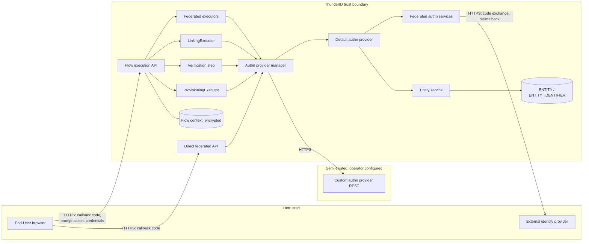
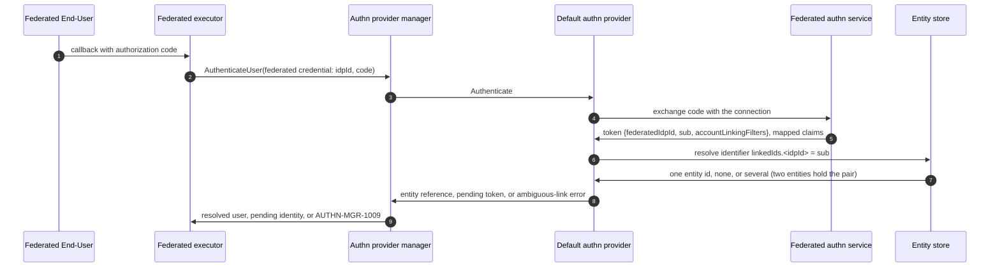
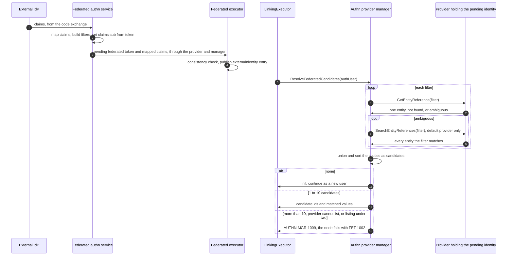
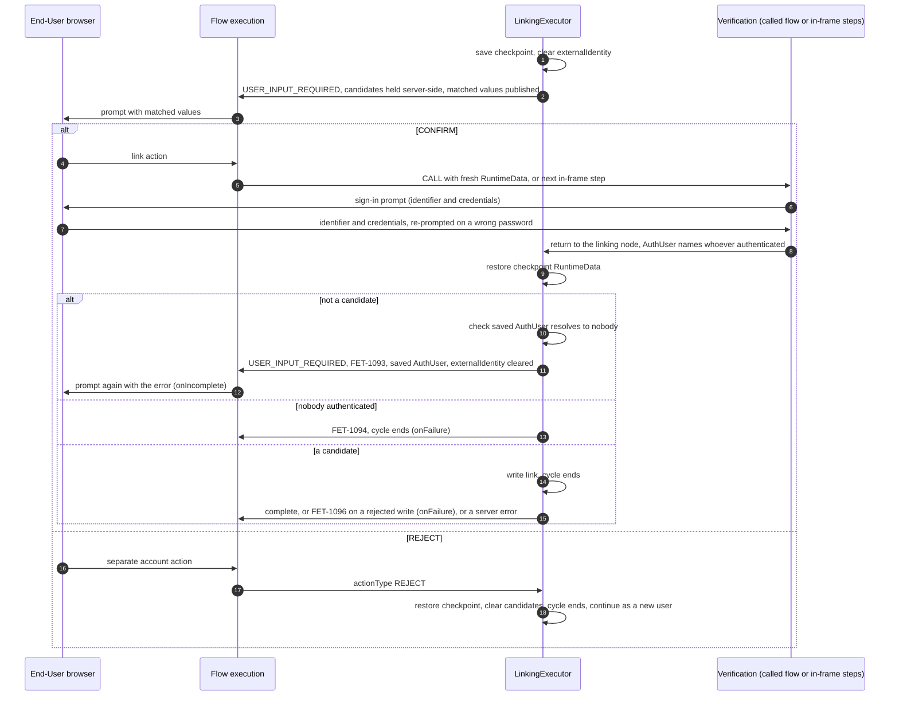
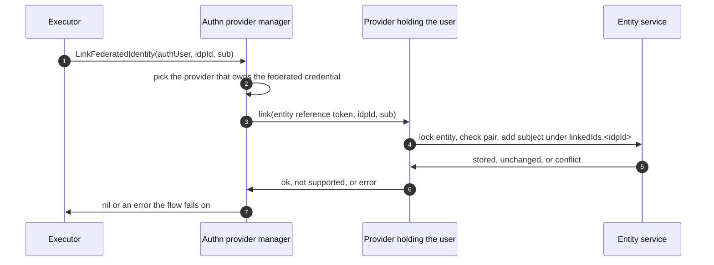
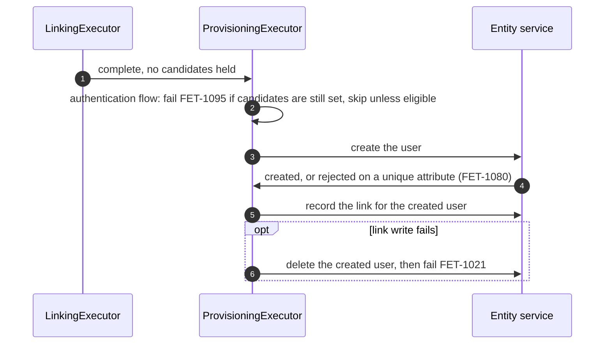

# Federated Account Linking Threat Model

This model covers how a federated identity comes to be associated with a local ThunderID account. It covers the `(connection, subject)` link and its storage, the candidate match on a connection's account-linking attributes, the Account Linking flow node with its prompt and verification, and the two executors that write a link. It accompanies the [federated account linking specification](spec.md).

## Overview

A federated sign-in arrives holding claims that an external identity provider asserted. The most security-relevant decision in this area is which local account, if any, that identity may become. A wrong answer is an account takeover by anyone who can make an external provider assert the right claim.

ThunderID resolves a federated identity to a local account only through a recorded `(connection, subject)` link. An identity with no link can be matched on the connection's account-linking attributes, but the match only names candidates. The Account Linking node shows the matched values and links the identity only after the End-User authenticates as one of the candidates during verification. Verification runs either as a separate flow that the node calls or as steps in the same flow. Refusing the match continues as a new user.

The federated executors hand the identity and its claims to later nodes as one `RuntimeData` entry, `externalIdentity`. No claim is written under its own name, so no claim overwrites flow control state. Placeholder resolution, and so node conditions, still fall back to the claims for a key `RuntimeData` does not hold (threat 7).

The entry points are the flow execution API and the direct federated authentication API. The flow execution API carries the federated callback that resumes a paused execution, the linking prompt submission, and the verification steps' submissions. The direct federated API resolves recorded links only.

Cross-cutting concerns covered elsewhere, and treated here as trust inputs: the OAuth2 and OIDC exchange itself (code exchange, ID token signature, nonce and state), flow execution context storage and encryption, session issuance and token signing, the entity store's access control, credential verification inside the password, passkey and OTP authenticators, and Console administrative authentication.

## Scope

This model covers:

- Recording a link, and the storage and indexing of `linkedIds`.
- Resolving a federated identity to a local entity through a recorded link.
- Building account-linking filters from a connection's configuration, and matching an unlinked identity against existing accounts.
- Publishing the federated identity and claims as the `externalIdentity` entry, and which executors may read claims from it.
- The linking prompt, the decision it asks for, and the values it discloses.
- Verification, as a called flow or as in-frame steps, the checkpoint the linking node saves and restores around it, the check that the account that verified is a candidate, and the retry after the wrong account verified.
- Provisioning's refusal to create an account that duplicates a candidate.
- The link write on the custom (REST) authn provider contract.
- The direct federated authentication API's handling of unlinked identities.

Out of scope (owned by the companion models named):

- The federated authentication exchange that produces the claims. Owned by the federated authentication model.
- Whether a claim asserted by an external provider is true. That is the provider's assurance, not ThunderID's.
- Flow context confidentiality, integrity and expiry. Owned by the flow execution model.
- Session and token issuance after a successful sign-in. Owned by the session and OAuth2 models.
- Console authentication and authorization for editing flows and connections. Owned by the Console and management API models.

## Architecture

### Components

The federated executors hand the identity to the Account Linking node through the server-side flow context. The node and provisioning both reach the stores through the authn provider manager, which routes each call to the provider that holds the user.

| Component | Task |
| --- | --- |
| Flow execution API | Resumes a paused execution. Holds the `AuthUser` and `RuntimeData` in the server-side flow context. The End-User never sees or supplies either directly. |
| Federated executors (OAuth, OIDC, Google, GitHub) | Hand the callback's code to the authn provider manager as a `federated` credential, run the consistency check on the claims that come back, and publish one `externalIdentity` entry holding the connection, the token's subject and the mapped claims. |
| Federated authn services (OAuth, OIDC, Google, GitHub) | Called by the default provider. Exchange the code with the connection, map the claims, derive the account-linking filters, and build the federated token. |
| `LinkingExecutor` | Matches an unlinked identity, stores the candidate ids server-side, saves a checkpoint of `RuntimeData`, the `AuthUser`, the `UserInputs` and the prompt details, clears `externalIdentity`, and forwards to the prompt. On re-entry it restores the checkpoint's `RuntimeData`, then links only when the authenticated entity is a candidate. When the wrong account verified, it rolls the `AuthUser` and the `UserInputs` back and re-prompts. Every other outcome ends the cycle. |
| Verification | The steps that run after `CONFIRM`, chosen by the flow author. Either a flow that a `CALL` node runs with a `RuntimeData` of its own, which the engine discards on return, or in-frame steps whose writes the linking node's restore discards. The `AuthUser` and `UserInputs` are shared in both. The linking node puts the `AuthUser` back only after a non-candidate verified. |
| `ProvisioningExecutor` | Creates and links the account for an identity that matched nothing, and deletes it again when the link write fails. Refuses to run in an authentication flow while candidates are unsettled. |
| Direct federated API | `FinishIDPAuthentication`. Returns a user only for a recorded link. |
| Authn provider manager | Routes the `federated` credential to the default provider, or to a custom provider that claims it. `ResolveFederatedCandidates` matches, turns an ambiguous lookup into candidates, and never authenticates. `LinkFederatedIdentity` routes the write to the provider holding the user. |
| Default authn provider | Resolves a federated token through the recorded link only. Lists the entities an ambiguous attribute lookup matches, the only provider that can. Writes links through the entity service. |
| Entity service and store | Stores `linkedIds` as a reserved system attribute under an entity lock, refuses a pair another entity holds, indexes each subject, and resolves a pair to at most one entity. |
| Custom authn provider (REST) | Optionally holds the user and the link, and resolves its own links when it claims the `federated` credential. Cannot list an ambiguous match. Runs outside the ThunderID process. |

### Actors

#### Actors

| Actor | Description | Roles or permissions |
| --- | --- | --- |
| Federated End-User | Arrives holding claims asserted by an external connection. May or may not own a local account. | None until resolved or linked |
| Local account owner | Holds an existing account that an incoming identity's attributes match. Often not present in the flow. | Their own account |
| Flow author | Administrator who places the Account Linking node and chooses the verification. | Console flow management |
| Connection administrator | Administrator who configures a connection's account-linking attributes and attribute mappings. | Console identity provider management |
| External identity provider | Asserts the subject and the claims the match is made on. | Trusted only as far as the connection's configuration assumes |
| Custom authn provider | External service that may hold the user and the link. | Operator-configured |

#### Entitlement matrix

| Actor | Resolve a local user through a link | Cause a candidate match | Settle a match into a link | Write a link | Choose the verification |
| --- | --- | --- | --- | --- | --- |
| Federated End-User | [Yes] (their own recorded link) | [Yes] (by the claims their provider asserts) | [Yes] only by authenticating as a candidate | [No] directly | [No] |
| Local account owner | [Yes] (their own) | [No] | [Yes] (by completing verification) | [No] directly | [No] |
| Flow author | [No] | [No] | [No] | [No] | [Yes] |
| Connection administrator | [No] | [Yes] (by choosing which attributes match) | [No] | [No] | [No] |
| External identity provider | [No] | [Yes] (by what it asserts) | [No] | [No] | [No] |

### External Dependencies (not owned)

| Dependency | Description (usage, purpose, authentication, authorization, security) |
| --- | --- |
| External identity provider (OIDC, OAuth2, Google, GitHub) | Asserts the subject and the claims a candidate match is made on. Whether a claim such as `email` is verified depends on the provider. Owned by the federated authentication model. |
| Custom authn provider (REST) | Receives `POST /link-federated-identity` with its own entity reference token. Transport and service authentication are the operator's. |
| Entity database | Stores `linkedIds` and the identifier index. Encryption at rest and access control are the deployment's. |

## Threats and mitigations

### Out-of-scope interactions and risks

- Forged or replayed authorization codes, ID tokens, `state` and `nonce`: federated authentication model.
- Theft of the flow execution id or challenge token, and flow context confidentiality or expiry: flow execution model.
- Session fixation and token theft after sign-in: session and OAuth2 models.
- Unauthorized edits to a flow or a connection: Console and management API models.

### Interactions

#### [01]: Resolving a federated identity through a recorded link

**Description**

The federated executor passes the callback's code to the authn provider manager, which routes it to the default provider. The provider's federated authn service exchanges the code with the connection and returns a federated token naming the connection and the subject. The provider then looks up the identifier `linkedIds.<idpId>` with the subject as the value, scoped to the deployment. One hit resolves the entity. A miss returns the token as a pending identity that resolves to nobody. Two entities holding the same pair is a data fault, not a match, and fails the sign-in with `AUTHN-MGR-1009`. A federated token is never resolved by attribute lookup. Several accounts sharing a linking attribute is a different case, handled in [02].

**Assets involved**

| Initiator | Intermediate | Target |
| --- | --- | --- |
| Federated End-User | Flow execution or direct API, authn provider manager, default authn provider | Local entity, identifier index |

**Data flow**

**Security considerations**

| Area | Response | Comments |
| --- | --- | --- |
| Data confidentiality | [C-High] | The pair authenticates a user, so a wrong resolution is an account takeover. |
| Communication medium | [M-DB] | Index read inside the deployment. |
| Transport security | [TLS] | Browser and provider legs. Database transport is per deployment. |
| Authentication | Federated authentication completed for this connection | The subject is only as trustworthy as the connection that asserted it. |
| Accessibility | [Internal] | No API exposes the link index. |
| Authorization and Access Control | Deployment-scoped query | Links never cross deployments. |

**Threat assessment**

| ID | Category | Threat | Materializable | Mitigation / comment |
| --- | --- | --- | --- | --- |
| 1 | [Spoofing] | A subject asserted by one connection resolves a link recorded for another, and signs in as that account. | [No] | The identifier name carries the connection id, and every layer requires both halves of the pair. |
| 2 | [Spoofing] | Two entities hold the same pair and the sign-in resolves the wrong one. | [No] | The link write refuses a pair that another entity already holds, inside its transaction. If the state arises anyway, resolution fails closed with `AUTHN-MGR-1009`. Residual 5. |
| 3 | [Spoofing] | A federated token with no link falls back to an attribute lookup and authenticates whoever shares an attribute. | [No] | A federated token that its link did not resolve answers user-not-found and is never passed to `IdentifyEntity`. The account-linking filters are read only by candidate matching in [02], which names and never authenticates. The direct API therefore fails an unlinked identity. |
| 4 | [Spoofing] | A stale cached resolution authenticates a subject as the wrong entity after the link set changes. | [No] | The cache-backed store does not cache this lookup. |

#### [02]: Building filters and matching candidates

**Description**

The shared federated token builder, which every federated authn service calls, maps the claims and derives the account-linking filters from the connection's linking attributes and mappings. The token carries `federatedIdpId`, `sub` and, when the connection has linking attributes, `accountLinkingFilters`, apart from each other. The builder then sets the claims' `sub` to the token's `sub`. The federated executor runs the consistency check and publishes the connection, the subject and the mapped claims as one `externalIdentity` entry, replacing any earlier one whole.

Readers of attribute values fall back to the entry's claims after their own sources: executor and prompt input satisfaction, the attribute collector, provisioning's attributes, the auth assertion's requested attributes, the identifying and OTP executors' user searches, and the email and SMS recipients and templates. The order varies by reader. So does `{{ctx(key)}}` placeholder resolution, which node conditions use, for every key except `userId` and `ouId`. Provisioning never reads a credential attribute from the claims. Executors that read a flow control key directly from `RuntimeData`, such as the candidates, the checkpoint and `userEligibleForProvisioning` at provisioning, never consult it.

At the Account Linking node the manager resolves each filter through the provider holding the pending identity. A filter that names one entity adds it. A filter the provider finds ambiguous is listed through `SearchEntityReferences`, and every entity listed is a candidate. The union across filters, up to 10, comes back with the values that matched. Several matches are candidates, not an error. The match fails only when there are more than 10, when the provider cannot list an ambiguous match (every provider except the default one), or when the listing names fewer than two. Nothing is written and the `AuthUser` is untouched.

**Assets involved**

| Initiator | Intermediate | Target |
| --- | --- | --- |
| Federated End-User, external identity provider | Federated executor, authn provider manager, default authn provider | Local entities (named, not entered), `RuntimeData` |

**Data flow**

**Security considerations**

| Area | Response | Comments |
| --- | --- | --- |
| Data confidentiality | [C-High] | The match decides which accounts the End-User may try to verify. |
| Communication medium | [M-DB] | |
| Transport security | [TLS] | |
| Authentication | None. A match is not an authentication. | |
| Accessibility | [Internal] | |
| Authorization and Access Control | No caller names the filter. It comes from the connection's configuration and the asserted claims. | |

**Threat assessment**

| ID | Category | Threat | Materializable | Mitigation / comment |
| --- | --- | --- | --- | --- |
| 5 | [Spoofing] | A provider asserts an unverified claim, typically `email`, that matches a victim's account, and the match signs the attacker in. | [No] | A match never authenticates. The identity is linked only after the End-User authenticates as a candidate in [03]. Verification's own strength is residual 1. |
| 6 | [Spoofing] | A claim named `userID`, `federatedIdpId` or a system attribute becomes part of a filter, so the provider picks the account by id instead of by attribute. | [No] | Filters live under their own token key. Reserved names (`userID`, `federatedIdpId`, `credentialUpdatedAt`, `linkedIds` and `linkedIds.*`) are never targets: a connection whose every target is reserved builds no filters at all. Saving a connection through the API rejects a linking attribute that is, or maps to, a reserved name. A declaratively loaded connection skips that check and relies on the runtime drop. |
| 7 | [Elevation of Privilege] | A claim named after flow control state (for example `userID`, `groups`, `ouId`, `categoryType`, `userEligibleForProvisioning`, `linkingCandidateUserIds`) changes which account, entity type, OU or branch a later node acts on. | [Yes] | No claim is written to `RuntimeData` under its own name, and executors that read a flow control key straight from `RuntimeData` never consult the claims. But `{{ctx(key)}}` placeholders, and with them node conditions, fall back to the entry's claims when `RuntimeData` holds no value for the key. Only `userId` and `ouId` are excluded. A key the executors always set, such as `entityState`, cannot be overridden. A key set only on one outcome, such as `userEligibleForProvisioning`, can: a claim of that name satisfies a condition on it. Provisioning re-reads the key from `RuntimeData` and still skips. Residual 11. |
| 8 | [Spoofing] | A mapping onto the local attribute `sub` (for example `email` to `sub`) makes the flow link a value other than the provider's subject. A later identity that asserts that value then resolves the account. | [No] | The shared builder overwrites the authenticated claims' `sub` with the token's `sub` after mapping, so the published `sub` is always the provider's subject. The filters are built before that overwrite, so a linking attribute on local `sub` matches the mapped value. That only names candidates, which still need verification. |
| 9 | [Denial of Service] | A linking attribute that barely tells accounts apart names a large number of candidates. | [No] | More than 10 candidates fails the node with `FET-1002`. A provider that cannot list an ambiguous match fails closed the same way. The listing is a separate query from the lookup: it matches only the profile attributes, with a typed comparison, capped at 100. A listing that names fewer than two entities also fails closed with `FET-1002`, so a legitimate owner is then refused rather than mismatched. |
| 10 | [Information Disclosure] | An attacker learns whether an account holds a value by watching whether the prompt appears. | [Yes] | The attacker has to get the connection to assert the value, and learns only that some account holds a value they supplied. Accepted. |
| 11 | [Operational Risk] | A value that differs only in case or whitespace misses the account it belongs to, and the identity is provisioned as a new user. | [Yes] | Values are compared verbatim. Whether the unique constraint then stops the second account depends on how the store compares the value. Residual 7. |
| 41 | [Spoofing] | An identifying or OTP executor searches for a local user on a claim the provider asserted (for example an unverified `email`) and resolves the victim's account without the Account Linking node. | [Yes] | Only when a flow author places such an executor after a federated sign-in. User searches still consult the entry's claims, because executor input satisfaction is shared with prompts. Residual 9. |
| 42 | [Tampering] | Two federated sign-ins in one frame leave a mix of both providers' claims, and provisioning builds an account from it. | [No] | A new `externalIdentity` entry replaces the earlier one whole. A second sign-in fails the consistency check first with `FET-1014` when the earlier entry names a different connection or subject, or when its `email` differs from the entry's claims, `email` in `RuntimeData` and `UserInputs`, or the authenticated user's attributes. Connection and subject are compared together, so a sign-in at a second connection fails even when the two subjects happen to be equal. |

#### [03]: The linking prompt and verification

**Description**

With candidates, the node stores their ids in the server-side flow context, publishes the matched values under `linkingPromptDetails`, saves a checkpoint of `RuntimeData`, clears `externalIdentity`, and forwards to the prompt. The prompt has two buttons. `REJECT` points back at the node and clears the candidates. `CONFIRM` starts verification, wired in one of two ways:

- a `CALL` node that runs a verification flow, an ordinary authentication flow, in a frame of its own. The engine restores the caller's `RuntimeData` when it returns;
- verification steps in the same flow, the verification segment, whose every way out leads back to the linking node.

Either way, the steps find none of the connection's claims and no earlier subject in `RuntimeData`, and the End-User types the identifier. On re-entry the node restores the checkpoint's `RuntimeData`, which removes whatever the steps wrote and brings back the original `externalIdentity`. It then requires the `AuthUser` to resolve to an entity in the candidate list before it writes the link.

The checkpoint also holds the `AuthUser` as the first pass found it, the pending federated identity, the `UserInputs` from before verification, and the prompt details. When a non-candidate verified, the node hands that `AuthUser` back, puts the `UserInputs` back, publishes the prompt details again, clears `externalIdentity` again, and returns `USER_INPUT_REQUIRED` with `FET-1093`. The engine adopts it, the non-candidate's authentication is discarded, and `onIncomplete` shows the prompt again with the error. The retry starts from the state the first attempt started from. The node first checks that the saved `AuthUser` resolves to nobody.

Every other outcome ends the cycle by clearing `linkingVerificationRequested` and `linkingCheckpoint`. Linking and refusal complete and clear the candidates. Nobody authenticated (`FET-1094`) and a rejected link write (`FET-1096`) fail through `onFailure` and keep the candidates. A storage fault on the write is a server error.

**Assets involved**

| Initiator | Intermediate | Target |
| --- | --- | --- |
| Federated End-User | Prompt node, verification steps, `LinkingExecutor`, flow context | Candidate accounts, the `AuthUser` |

**Data flow**

**Security considerations**

| Area | Response | Comments |
| --- | --- | --- |
| Data confidentiality | [C-High] | The prompt shows only values the viewer's own connection supplied. |
| Communication medium | [M-NT] | The prompt, the action and the credentials cross the network. Candidate ids do not. |
| Transport security | [TLS] | |
| Authentication | A completed authentication as a candidate | |
| Accessibility | [Public] | The prompt is rendered to an unauthenticated browser. |
| Authorization and Access Control | Candidate ids live only in the encrypted server-side flow context. The client supplies only which action it chose and its credentials. | |

**Threat assessment**

| ID | Category | Threat | Materializable | Mitigation / comment |
| --- | --- | --- | --- | --- |
| 12 | [Tampering] | A client submits `CONFIRM`, or forges any action, to have the node link without verification. | [No] | The node ignores every action type except `REJECT`. On re-entry it reads only who authenticated, and nobody authenticated fails with `FET-1094`. |
| 13 | [Spoofing] | Verification authenticates an account that is not a candidate (the attacker's own local account, or a second account linked at the verification connection), and the identity is linked to it. | [No] | The node requires the authenticated entity to be in the candidate list. Otherwise it writes nothing, rolls the `AuthUser` back (threat 48), and re-prompts with `FET-1093`. |
| 14 | [Spoofing] | A value verification resolved (for example a `userID` from `IdentifyingExecutor` in resolve mode) leaks into the linking decision or into provisioning. | [No] | A called flow's `RuntimeData` is discarded when it returns. In-frame steps' writes are removed by the checkpoint restore, which runs before the node reads anything else. The node reads only who the `AuthUser` names and checks it against the candidate list. |
| 15 | [Spoofing] | A claim mapped onto the identifier input fills it on the End-User's behalf. | [No] | The linking node clears `externalIdentity` before verification, and again before each wrong-account retry. No claim is written under its own name, so no claim is there to fill an input. A called flow also starts with an empty `RuntimeData`. The End-User types the identifier. |
| 16 | [Spoofing] | An attacker whose connection asserts the victim's email reaches verification and guesses the victim's password without limit. | [Yes] | A wrong password re-prompts inside the same execution with no attempt cap. The ordinary password login has the same exposure and no lockout either. Only the optional CAPTCHA interceptor and the flow context's expiry slow it. Residual 2. |
| 17 | [Spoofing] | Account pre-hijacking. An attacker registers a local account holding the victim's email and a password the attacker knows. The victim's first federated sign-in matches it, the victim verifies it through a step the victim can pass (for example an email OTP), and the victim's federated identity is linked to an account the attacker can also sign in to. | [Yes] | Requires self-registration that lets an account claim an email without proving it, and a flow author who offers a verification the victim can pass without the password. Residual 3. |
| 18 | [Denial of Service] | Account squatting. An attacker registers a local account with the victim's email first. The victim is prompted to link to it, cannot verify, and refuses. Provisioning then fails on the unique email, so the victim cannot sign in. | [Yes] | Same precondition as threat 17. Residual 3. |
| 19 | [Tampering] | A `REJECT` action is wired to another node, so the refusal is lost and the End-User can never continue as a new user. | [No] | A forwarded action type reaches only the node its action points at, and the type always comes from the server-side action definition. Saving a flow of any type rejects a `REJECT` on the linking prompt that does not point back at the linking node. The Console also warns, but only in authentication flows, and it accepts any linking node as the target. Other actions on the prompt are not validated. A graph that gets past both fails closed in an authentication flow: `FET-1094` at the linking node, or `FET-1095` at provisioning. |
| 20 | [Denial of Service] | The prompt is offered repeatedly and the flow never ends. | [Yes] | A wrong account re-prompts with no cap. Each loop needs an End-User action and a successful sign-in as a non-candidate, and the flow context's expiry ends it. Every other settling outcome ends the cycle: it links, fails, or honors a refusal. Accepted, alongside residual 2. |
| 21 | [Tampering] | A verification that authenticates at another connection overwrites the identity being linked, so the verifying identity is linked instead. | [No] | The checkpoint restore puts the original `externalIdentity` entry back before the link write, whether the other connection ran in a called flow or in-frame. A called flow's entry is also discarded with its frame. |
| 22 | [Tampering] | The first connection's authorization code, left in `UserInputs`, is consumed by the verification connection. | [No] | Each federated executor removes `code` and `state` from `UserInputs` before it processes the callback, keeping the state only for its own validation. |
| 23 | [Information Disclosure] | The prompt discloses attributes of a matched account the viewer has not proved. | [No] | The prompt shows only the matched attribute names and the values the identity supplied. Nothing is read from the accounts. |
| 24 | [Information Disclosure] | The prompt, or verification, reveals how many accounts matched. | [No] | Neither does. Verification is an ordinary sign-in and asks for the same inputs whatever matched. |
| 25 | [Information Disclosure] | Claim values rendered in the prompt inject script into the page. | [No] | `KEY_VALUE_LIST` renders values as React text, not HTML. |
| 26 | [Operational Risk] | Verification authenticates the candidate through a different authn provider from the one holding the pending identity, so a legitimate owner can never link. | [No] | Fails closed. The pending state stays in the `AuthUser`, which resolves to nobody, and the node answers `FET-1094`. The specification requires verification through the same provider, and the guides need to say so (residual 1). |
| 43 | [Tampering] | An in-frame verification segment has a way out that skips the linking node (to an `END` node, provisioning or the auth assertion), so what the steps wrote survives, or the candidate check never runs. | [No] | Saving a flow rejects a segment that contains an `END` node, another linking node, a `ProvisioningExecutor` or an `AuthAssertExecutor`, or that has no edge back to the linking node. The segment is every node reachable from the `CONFIRM` target without passing through the linking node. A graph that gets past validation fails closed. `externalIdentity` is empty, so no link is written. In an authentication flow the candidates are still set, so provisioning answers `FET-1095`. Provisioning does not check candidates in a registration flow. There it would create an account from the End-User's own inputs, with no link. |
| 44 | [Operational Risk] | A legitimate owner verifies through a second connection linked to their account, and the consistency check rejects the second sign-in because its `sub` differs from the pending identity's. | [No] | The pending identity is in the checkpoint, not in `RuntimeData`, so the check has no earlier subject to compare with. The pending `AuthUser` resolves no attributes either. Only the `email` comparisons against `RuntimeData` and `UserInputs` still run, as they do inside a called flow. |
| 45 | [Tampering] | Clearing `externalIdentity` for verification switches off the consistency check for a second federated sign-in that is not a verification. | [No] | Only the linking node clears the entry, and only while its cycle is armed: from the first pass until a settling pass ends the cycle, wrong-account retries included. Outside that window the check reads the entry as usual (spec AC3.9). Inside it, the candidate check is the stronger rule. |
| 46 | [Tampering] | A verification step overwrites `linkingCheckpoint`, so the restore brings back state the step chose, including the `AuthUser` and `UserInputs` a wrong-account retry hands back (threat 49). | [No] | No external party names a `RuntimeData` key. The executors that write keys named by configuration (the attribute collector and credential steps, by user schema attribute, and HTTP request response mapping, by flow author) are controlled by administrators. Residual 6. |
| 47 | [Operational Risk] | The `CALL` node runs a registration flow with a `ProvisioningExecutor`. The called flow's `RuntimeData` holds no candidates, and provisioning checks candidates only in authentication flows, so it creates an account from the End-User's inputs that then fails the candidate check. | [Yes] | Saving the caller checks only that the `CALL` node's `onSuccess` returns to the linking node. The called flow's type and contents are not checked. In a called authentication flow, provisioning skips, because the fresh `RuntimeData` does not mark the identity eligible. The created account is not a candidate, so the node fails with `FET-1093` and writes no link, but the account stays. Flow author's choice. Residual 12. |
| 48 | [Spoofing] | After a non-candidate verifies, their authentication carries into the retry. A `REJECT` then continues signed in as that account, because provisioning sees an existing user. OTP and magic-link retries target that account, a federated retry fails the consistency check against its attributes, and the identifier the attempt collected fills the retry's identifier input, so the retry verifies the same account. | [No] | The node hands back the `AuthUser` its checkpoint saved, the pending federated identity, and the engine adopts it, so the non-candidate's authentication is discarded. It also puts the `UserInputs` back to what they were before verification. If the saved `AuthUser` would not be adopted, because it does not read as authenticated, the node fails with `FET-1093` through `onFailure` instead of offering the retry. |
| 49 | [Elevation of Privilege] | The `AuthUser` restored on a wrong-account retry names an entity, through a forged or corrupted checkpoint, and the flow continues signed in as that entity. | [No] | The node checks that the saved `AuthUser` resolves to nobody before it hands it back, and fails with `FET-1093` through `onFailure` otherwise. That always holds legitimately: a first pass that finds somebody authenticated completes without saving a checkpoint. The checkpoint also lives only in the encrypted flow context, and only key names an administrator configures can overwrite it. Residual 6. |
| 50 | [Information Disclosure] | The `FET-1093` error on the prompt tells the End-User that the account they verified is not the matched one. | [No] | They proved that account themselves. The error names neither the candidates nor how many matched, so threat 24 holds. |
| 51 | [Operational Risk] | A flow author routes the linking node's `onFailure` back to the node. The cycle has ended, so the node runs a first pass. After `FET-1094` it prompts again. After `FET-1096` the verified candidate is still authenticated, so the first pass completes as that account with no link written. | [No] | Saving a flow, declaratively loaded flows included, rejects a path from the linking node's `onFailure` target back to the node that does not take a federated authentication executor's `onSuccess`. A federated executor's `onFailure` does not count, since nobody signed in. A path that does take it, such as the documented `onFailure` to the sign-in prompt, signs in at a connection again, and that replaces the verified account's provider state with the new federated result before the node runs. Even without the check this is not a takeover, since that candidate proved their credentials. |

#### [04]: Recording the link

**Description**

`LinkingExecutor` writes the link for a verified candidate, and `ProvisioningExecutor` writes it for a user it just created. Both read the pair from the `externalIdentity` entry and call the manager, which picks the provider holding the user and passes that provider's own entity reference. The entity service locks the entity, refuses a pair another entity holds, and adds the subject inside one transaction. A subject already recorded is a no-op.

**Assets involved**

| Initiator | Intermediate | Target |
| --- | --- | --- |
| `LinkingExecutor`, `ProvisioningExecutor` | Authn provider manager, default or REST provider | `linkedIds` system attribute, identifier index |

**Data flow**

**Security considerations**

| Area | Response | Comments |
| --- | --- | --- |
| Data confidentiality | [C-High] | A wrongly written link is a durable takeover. |
| Communication medium | [M-DB], [M-NT] for a custom provider | |
| Transport security | [TLS] | The custom provider leg is the operator's to secure. |
| Authentication | Reached only after verification as a candidate, or after creating the user | |
| Accessibility | [Internal] | No public API writes a link. |
| Authorization and Access Control | The target is the entity the `AuthUser` already names | |

**Threat assessment**

| ID | Category | Threat | Materializable | Mitigation / comment |
| --- | --- | --- | --- | --- |
| 27 | [Tampering] | A link is written against an account other than the one the flow settled on. | [No] | The provider resolves the target from its own entity reference on the `AuthUser`. A reference that names no entity fails the write. |
| 28 | [Tampering] | Two concurrent link writes to one entity each read the old `linkedIds` and the later commit drops the other's subject, so that identity stops resolving. | [Yes] | The write takes a row lock on the entity (a no-op `UPDATE` inside the transaction) for the whole read, add and write. The read, though, goes through the cache-backed store. The cache is invalidated before the write, not after the commit, and an in-memory cache on another node is not invalidated at all. A read that re-caches the old blob before the first commit, or a stale copy on another node, hands the second writer an old `linkedIds`. Its write then drops the first subject, and the index re-sync drops that subject's row. Residual 10. |
| 29 | [Tampering] | An unrelated write that rebuilds an entity's system attributes drops `linkedIds`, so the next sign-in resolves nothing. | [Yes] | `linkedIds` is a reserved system attribute, carried over when the attributes are replaced. The list is maintained by hand, residual 6. The carry-over reads the current value through the same cache, so a stale copy drops a link added since. Residual 10. |
| 30 | [Repudiation] | A link is created with no durable record of the flow, connection and verification that produced it. | [Yes] | No audit event is emitted, only debug and error logs. Residual 4. |
| 31 | [Information Disclosure] | The subject or the entity id is written to logs. | [Yes] | On the linking paths, entity ids are masked, the subject is not logged, and the connection id is logged in the clear. The manager's subject-type check logs the resolved entity id unmasked at debug level on every sign-in. Error text a custom provider returns, and the store's error on a failed link, are logged as received. |
| 32 | [Security Risk] | A custom provider that does not store links fails every federated sign-in through it. | [No] | `AUP-0006` reads as "nothing to record", whatever the provider meant by it. Any other client error fails the flow with `AUTHN-MGR-1012`. A service that lacks the endpoint and answers a 404 without the error body is read as a server error and fails the sign-in. |
| 33 | [Operational Risk] | A link write fails and the sign-in completes anyway, or leaves a created user behind, so the next sign-in prompts to link that leftover account or provisions a duplicate. | [No] | A failed write ends the flow in both writers: `FET-1096` through `onFailure` at the linking node for a rejected write, a server error for a storage fault, and `FET-1021` at provisioning after it deletes the user it created. If that delete also fails, the flow ends with a server error and the unlinked user stays. Saving a flow keeps the linking node's `onFailure` from looping back to it without a fresh federated sign-in, which would otherwise complete without the link (threat 51). |

#### [05]: Provisioning an identity that matched nothing

**Description**

With no link and no candidates, or after a refusal, provisioning creates the account and records its link. When the link write fails, it deletes the account it created. For a federated identity it does not look an existing user up by attributes. In an authentication flow it refuses to run while candidates are set.

**Assets involved**

| Initiator | Intermediate | Target |
| --- | --- | --- |
| Federated End-User | `ProvisioningExecutor` | New local entity, identifier index |

**Data flow**

**Security considerations**

| Area | Response | Comments |
| --- | --- | --- |
| Data confidentiality | [C-Medium] | Creates an account holding the claims the connection mapped. |
| Communication medium | [M-DB] | |
| Transport security | [TLS] | |
| Authentication | The federated authentication that produced the claims | |
| Accessibility | [Internal] | |
| Authorization and Access Control | Gated by the flow's provisioning allowance and the user type configuration | |

**Threat assessment**

| ID | Category | Threat | Materializable | Mitigation / comment |
| --- | --- | --- | --- | --- |
| 34 | [Spoofing] | Provisioning runs while candidates were named and never settled, creating an account that shadows one. | [No] | Refused with `FET-1095` in authentication flows. A refusal clears the candidates, so it is not mistaken for an unsettled match. |
| 35 | [Spoofing] | A registration flow provisions a second account for an identity that already carries its link. | [No] | The linked identity resolves as the existing user, and the existing-user rules apply. |
| 36 | [Elevation of Privilege] | Provisioning matches an existing account on an attribute and completes as that user. | [No] | For a federated identity there is no attribute lookup, in any flow type. Only a recorded link resolves an existing user. Otherwise, for users, only `unique` attributes are matched, one lookup each, and credential attributes never are. |
| 37 | [Lateral Movement] | A refused match on a unique attribute creates a second account on the same address. | [No] | The create fails on the unique constraint with `FET-1080`. A refusal on a non-unique attribute creates a separate account, which is the intended outcome. |
| 38 | [Lateral Movement] | A linked federated identity reaches every application and role the local account holds, so the weakest verification offered for linking bounds the account's security. | [Yes] | Inherent to linking. The flow author chooses the verification per flow. Residual 1. |

#### [06]: The direct federated authentication API

**Description**

`FinishIDPAuthentication` authenticates the callback and returns a user only when the identity has a recorded link. An unlinked identity (`AUTHN-MGR-1007` inside) and an identity whose pair two entities hold (`AUTHN-MGR-1009` inside) both fail with `AUTHN-FED-1001`.

**Assets involved**

| Initiator | Intermediate | Target |
| --- | --- | --- |
| Federated End-User or client | Authentication service, authn provider manager | Local entity |

**Threat assessment**

| ID | Category | Threat | Materializable | Mitigation / comment |
| --- | --- | --- | --- | --- |
| 39 | [Spoofing] | The API, which cannot prompt, signs an identity in on an attribute match. | [No] | It never resolves candidates. An unlinked identity resolves to nobody and fails. |
| 40 | [Tampering] | The API records a link without verification. | [No] | It never writes a link. |

## Security Review Checklist

A review aid that complements the threat models and the self-assessment. Guidance follows the [OWASP Top 10 Proactive Controls](https://top10proactive.owasp.org/).

### Security considerations

| # | Consideration | State | Comments |
| --- | --- | --- | --- |
| 1 | Are all inputs and outputs validated (syntactic and semantic)? | [Partial] | Every layer requires both halves of a pair. Linking attributes are validated when a connection is saved through the API, and dropped at runtime for a declarative one. Claims reach `RuntimeData` only inside the `externalIdentity` entry, and the published `sub` is the token's, but placeholders and node conditions fall back to the claims (residual 11). Linking graphs, including in-frame verification segments and paths from the linking node's `onFailure`, are validated when a flow is saved. A called verification flow is not (residual 12). |
| 2 | Are rate limits in place where necessary? | [Partial] | No new endpoint. The verification password step has no attempt cap, the same as the ordinary password login, and wrong-account retries have none either. Residual 2. |
| 3 | Are permissions, roles, and entitlements defined on the principle of least privilege and business need? | [Yes] | A match names candidates and nothing more. Only authenticating as a candidate links. The write target is the entity the `AuthUser` names. |
| 4 | Are authentication and authorization validated at both the UI and API layers, front end and back end, before granting access to resources? | [Yes] | The Console warning is an authoring aid, shown in authentication flows only. The server validates on save for every flow type, and the runtime fails closed. |
| 5 | Are proper isolations in place between components to ensure least-privilege access and reduce the blast radius against lateral movement? | [Yes] | Links are scoped by connection and deployment. The provider that holds a user stores its links. |
| 6 | Have any default credentials been changed, and are default superuser or root accounts not in use (when using third-party components)? | [N/A] | No credentials introduced. |
| 7 | Has the implementation followed best-practice guidelines (OWASP, Kubernetes, vendor, or technology provider)? | [Yes] | A subject is interpreted only within its issuer (OIDC Core). Linking on a claim requires proof of the local account. |
| 8 | Are secrets, credentials, and internal-only material kept out of the public source tree and its git history? | [Yes] | No secrets added. |
| 9 | Was a security-focused code review conducted for this change, and have the findings been addressed? | [No] | This model is its input. |
| 10 | Is Static Analysis (SAST) or IaC scanning conducted, and are findings addressed? | [Yes] | Covered by the repository-wide CI scan. |
| 11 | Is Software Composition Analysis (SCA) conducted or integrated into the repository, and are findings addressed (for example FOSSA, Trivy)? | [Yes] | Covered by the repository-wide CI scan. No dependency added. |
| 12 | Is Dynamic (DAST) or API scanning conducted on a non-production setup, and are findings addressed? | [N/A] | No new endpoint. |
| 13 | Are audit logs generated in a standardized format for critical functionality, and available to authorized users to trace critical events and aid incident response? Note the retention period in Comments. | [No] | Creating a link emits no audit record. Residual 4. |
| 14 | Do audit logs for critical configuration changes record the difference between the old and new versions? | [N/A] | Flow and connection edits are owned by the management API model. |
| 15 | Are data in transit and at rest encrypted? | [Partial] | Transit is TLS. The flow context holding the pending identity, the candidates and the checkpoint, with its copies of the pending `AuthUser` and the `UserInputs`, is encrypted before storage. Entity database encryption at rest is the deployment's. |
| 16 | Are sensitive values such as credentials and keys stored in a secret store or vault? | [N/A] | A link is an identifier pair, not a credential. |
| 17 | Is personal, sensitive, or confidential data kept out of logs? | [Partial] | On the linking paths, entity ids are masked and the subject is not logged. The subject-type check logs an unmasked entity id at debug level, and custom provider error text is logged as received (threat 31). |
| 18 | Have users been given clear instructions for secure usage? | [Partial] | The flow and connection guides describe the node, the prompt, verification and several candidates. They do not yet cover the verification methods, the same-provider requirement, and the registration settings behind residuals 1 and 3. |

### Business impact and resilience

For an open-source component, most of these are shared with the operator who deploys it.

| # | Consideration | State | Comments |
| --- | --- | --- | --- |
| 1 | Has a business impact analysis been done to identify resilience requirements (maximum tolerable downtime, uptime, RPO, RTO)? | [N/A] | No service of its own. |

Resilience details to record:

- High availability: no new component. The link read is one indexed query.
- Disaster recovery: links live in the entity database and are restored with it. A restore that predates a link makes the next sign-in match again and prompt for verification.
- Backups: covered by the entity database's backup policy.
- Health checks: none added.
- User banners: not applicable.

### Dependency and component health

| # | Consideration | State | Comments |
| --- | --- | --- | --- |
| 1 | Are dependencies, base images, and runtimes monitored for known vulnerabilities and kept current (for example automated dependency scanning), and are findings addressed? | [Yes] | Repository-wide. No dependency added. |
| 2 | Are any End-of-Life or End-of-Service components in use? | [No] | |
| 3 | Is hardening guidance published for operators who deploy the project (optional)? | [Partial] | Residuals 1 and 3 need guidance. |

### Privacy considerations

| # | Consideration | State | Comments |
| --- | --- | --- | --- |
| 1 | Is the purpose and legal basis for processing personal data clearly defined? | [Yes] | The subject is stored to authenticate the same person at the same connection later. |
| 2 | Are the collection, storage, processing, sharing, archival, and disposal of personal data aligned with the data minimization principle? | [Yes] | Only the connection id and the subject are stored. |
| 3 | Is personal data stored securely? | [Partial] | A server-owned system attribute that the user API does not return. Encryption at rest is the deployment's. |
| 4 | Are privacy notices updated to reflect any new processing or changes to purpose and legal basis? | [N/A] | Deployment-owned. |
| 5 | Is access to personal data granted on a need-to-know basis? | [Yes] | No endpoint lists links. |
| 6 | Are data retention requirements considered? | [Partial] | A link lives as long as the entity. Residual 8. |
| 7 | Is there a process to dispose of personal data on request in a timely manner while meeting retention requirements? | [Partial] | Deleting the entity removes its links and index rows. A single link cannot be removed. Residual 8. |
| 8 | Are records of personal-data processing maintained in the project's data inventory or records of processing? | [N/A] | Deployment-owned. |

## Residual risks (open items)

1. **Verification strength is the flow author's choice.** Any step that authenticates a candidate links the identity. The link is therefore only as strong as the weakest method offered after `CONFIRM`, and the linked identity then reaches everything the account can. The guides need to say which methods to offer, particularly on connections whose linking claims the provider does not verify, and that verification has to go through the provider holding the pending identity. (tracking: to be filed)
2. **No attempt limit on the verification password, or on wrong-account retries.** A wrong password re-prompts within the execution without a cap. The ordinary password login has the same exposure and no lockout. A wrong account re-prompts without a cap too, and each retry starts verification again, so only the flow context's expiry bounds the time spent guessing. (tracking: to be filed)
3. **Pre-hijacking and squatting through unverified registration.** Where self-registration lets an account claim an email without proving it, an attacker can register the victim's address first. The victim's federated sign-in then either cannot complete (squatting), or links the victim to an account the attacker also controls, if the flow offers a verification the victim can pass without the password. Requiring email verification at registration, and choosing the verification methods with care, bound it. (tracking: to be filed)
4. **No audit record for a link.** Creating a link, refusing a match, or failing verification emits no audit event. (tracking: to be filed)
5. **Concurrent first links across entities.** The link write checks that no other entity holds the pair, inside its own transaction, and no constraint backs the check. Two concurrent writes of one pair to two different entities, for example two simultaneous first sign-ins that each provision a user, can both pass on PostgreSQL under its default isolation. SQLite's database-wide write lock serializes them. Resolution then fails closed with `AUTHN-MGR-1009`. (tracking: to be filed)
6. **Hand-maintained reserved lists and configured key names.** Reserved system attributes are an explicit list, and a new server-owned system attribute left off it is dropped by unrelated updates. Federated claims no longer need a reserved runtime key list. Executors that write `RuntimeData` keys named by configuration (a user schema attribute, or an HTTP request response mapping) could still overwrite `externalIdentity` or `linkingCheckpoint` if an administrator picks one of those names. The checkpoint now carries the `AuthUser` a wrong-account retry hands back, so the resolve-to-nobody check (threat 49) is the only guard on that path. Rejecting both names as schema attributes would close it. (tracking: to be filed)
7. **Verbatim value comparison.** Linking values are compared without case folding or trimming, so an address that differs only in case does not match the account it belongs to. (tracking: to be filed)
8. **No unlink.** A link cannot be removed without deleting the entity, and deleting a connection leaves its links behind. A connection recreated under the same id inherits them. (tracking: to be filed)
9. **User searches read external claims.** The identifying and OTP executors still fall back to the `externalIdentity` claims when they search for a user, so a flow that places one after a federated sign-in resolves an account on an asserted value, outside the Account Linking node. Stopping it needs input satisfaction per executor, since executors and prompts share it today. (tracking: to be filed)
10. **Cached reads inside system-attribute updates.** The link write and the reserved-attribute carry-over read the entity through the cache-backed store, although the link write holds the entity's row lock. The cache is invalidated before the write rather than after the commit, and an in-memory cache is per node. A stale copy makes a concurrent link, or an unrelated update, drop a recorded subject. Reading the entity from the database inside the transaction would close it. (tracking: to be filed)
11. **Placeholders and node conditions read external claims.** `{{ctx(key)}}` resolution falls back to the `externalIdentity` claims for any key except `userId` and `ouId` when `RuntimeData` holds no value. A connection that asserts a claim named after a flow control key the executors set only on one outcome, such as `userEligibleForProvisioning`, satisfies a node condition on it. The `GetExternalClaim` comment says flow control reads never consult the claims. Placeholder resolution does, so the code and the comment disagree. (tracking: to be filed)
12. **Called verification flows are not validated.** Saving a flow checks that a verification `CALL` node returns to the linking node, but not the called flow's type or contents. A registration flow with provisioning there creates an account that the candidate check then rejects. (tracking: to be filed)

## Appendix

- Sample configuration: `tests/e2e/utils/server-setup/verified-linking-flow-nodes.json`, a linking node with its prompt and a `CALL` to the verification flow in `tests/e2e/utils/server-setup/verified-linking-verify-flow-nodes.json`. The verification flow offers a password step or a second connection through a `LOGIN_OPTIONS` chooser. In-frame verification has no e2e sample. The integration tests build one as `InFrameLinkingFlow` in `tests/integration/flow/common/linking.go`.
- References:
  - [Federated account linking specification](spec.md)
  - [OpenID Connect Core, Section 2](https://openid.net/specs/openid-connect-core-1_0.html#IDToken), on the subject being unique only within its issuer
  - [Flows: advanced configurations](../../docs/content/guides/flows/advanced-configurations.mdx)
  - [Add an OIDC provider](../../docs/content/guides/identity-providers/add-oidc-provider.mdx)

## Change log

| Version | Date | Change |
|---|---|---|
| 0.1 | 2026-09-25 | Initial threat model. |
| 0.2 | 2026-09-26 | Claims published as one `externalIdentity` entry: threat 7 mitigated without a reserved-key list, threats 41 and 42 added, residual 6 narrowed. In-frame verification through the linking node's checkpoint: interaction [03] and threats 14, 15 and 21 cover both wirings, threats 43 to 46 added. |
| 0.3 | 2026-09-28 | Audited against the code. Several accounts matching a linking attribute are candidates, not an ambiguous error: [02] and its diagram now show the listing and the remaining failure cases, and [01] limits `AUTHN-MGR-1009` to two entities holding one pair. The architecture and [01] diagrams place the code exchange in the federated authn services. Threat 7 is materializable through placeholder fallback. Threats 28 and 29 are materializable through cached reads. Threat 47 and residuals 10 to 12 are new, and threats 3, 6, 8, 9, 16, 19, 31, 32, 33, 36, 37, 42, 43 and 44 are corrected. |
| 0.4 | 2026-10-01 | Verification cycle defined. A wrong account re-prompts through `onIncomplete` with the `AuthUser` rolled back from the checkpoint. Every other settling outcome ends the cycle. Components and [03] cover the retry and the cycle. Threat 20 is materializable and accepted. Threats 13, 15, 33, 45 and 46 are updated, threats 48 to 51 are new, and residuals 2 and 6 are widened. Threat 51 is closed by save-time validation of the linking node's `onFailure` paths. |
