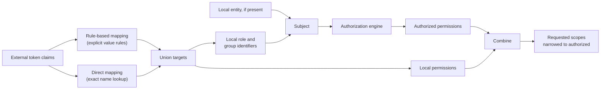
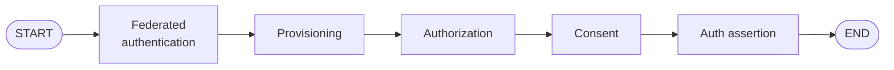
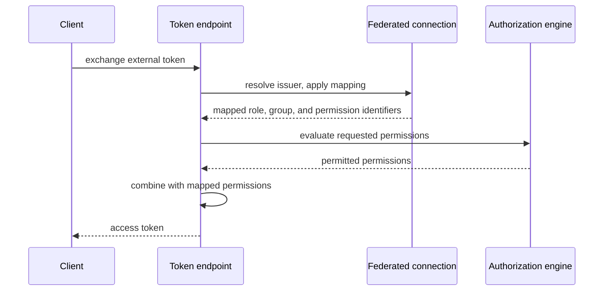

# Authorization support for federated entities

- **Status:** Final
- **Version:** 1.0
- **Related documents:** [Discussion #5197: Authorization support for federated entities](https://github.com/thunder-id/thunderid/discussions/5197), Issue #5192

## Summary

Organizations manage their users in an external identity provider while ThunderID manages agents,
applications, and the permission model. Without a way to translate what the provider asserts into local
authorization, every federated entity either goes unauthorized or has to be assigned roles and groups by
hand, duplicating policy the organization already maintains elsewhere.

Authorization mapping resolves values a connection's federated claims assert (a `groups` claim, a
`role_name` claim, and so on) into local role, group, or permission references, using the same
authorization model ThunderID already applies to locally-managed subjects. A mapping never authorizes on
its own; it only resolves a claim value to a local reference. ThunderID's own RBAC engine decides what a
resolved role or group is worth, the same way it does for a subject's direct assignments (an external
policy decision point is an alternative decision-maker at this same point; see Requirements). A resolved
permission target is different: it is not something a subject holds and an engine resolves, it is already
the answer, so it is combined with whatever the engine decides at the point the granted scopes are worked
out, rather than being fed into the decision itself.

Two independent mapping modes cover this, addressable together on one connection:

- **Rule-based mapping** compares a claim's resolved value(s) against an administrator-defined table of
  rules (value type, delimiter, operator, comparison value), each granting an explicit set of targets.
  This is the general mechanism: numeric and boolean comparisons, ordering operators, and set-membership
  tests over a multi-valued claim.
- **Direct name-based mapping** covers the common case where a claim's value already matches a local
  role, group, or permission's name exactly (a `role_name` claim carrying `"Billing Admin"`, say) and an
  administrator shouldn't have to write a rule just to say "look this up by name." Each value is looked
  up directly, with no rule table.

Both are evaluated at the same points (federated login, RFC 8693 token exchange, and ID-JAG assertion
consumption) through the same shared value-resolution logic, and their resolved targets union.
The governing design decision is that mapping is purely a *resolution* concern (external value to local
reference); every existing seam this project uses to decide what an entity holds (the RBAC engine, the
consent flow, provisioning) is reused unchanged.

## Architecture

Responsibilities:

- **Resolving a rule-based mapping** is a self-contained check against the connection's stored
  configuration and the presented claims. Every target a rule can grant was already validated to exist
  when the mapping was saved, so evaluating it needs no external call and cannot fail.
- **Resolving a direct mapping** defers the "does this name exist" check to request time instead, looking
  up each value live against current roles, groups, or resource-server permissions. Because that lookup
  is live, it can fail for genuine infrastructure reasons, unlike rule-based resolution.
- **The authorization engine** decides what a resolved role or group is worth, exactly as it does for
  direct assignments; mapping never bypasses it for roles or groups. An external policy decision point is
  an alternative decision-maker at this same point (see Requirements).
- **Token issuance** (token exchange and ID-JAG) resolves and combines rule-based and direct mapping
  together, and treats a resolution failure as fatal to the request, since these paths must produce a
  definitive answer.
- **Federated login** resolves and combines the same way, but treats the same kind of failure as
  non-fatal, continuing without the failed mapping's contribution, since login is best-effort enrichment
  rather than a step that must succeed.
- Mappings live beside the existing attribute mappings on the connection's stored configuration, with no
  new storage and no database schema change.

## Detailed design

### Rule-based mapping

An administrator names a source claim (a dot-notation path into a nested claim is supported), an
optional declared value type (string, number, boolean, or list), an optional delimiter for splitting a
single string value into multiple tokens, and a table of rules. Each rule pairs a comparison (equals,
not equals, an ordering comparison, or a set-membership test) against a value with the local roles,
groups, or permissions it grants when the comparison matches. The result of a mapping is the union of
every matching rule's targets; a claim value that satisfies no rule confers nothing, even if it happens
to match the name of a local role or group.

The declared value type does not control whether the claim's runtime value is treated as a list; that is
detected automatically from the claim's actual shape (see *Value resolution*). The declared value type
governs something else entirely: a mapping is declared multi-valued when its value type is list, or when
its value type is string with a delimiter set, a property of the mapping's own configuration fixed at
save time, unrelated to what shape a claim actually turns out to have at request time. A multi-valued
mapping only accepts a set-membership comparison, matched as a literal string against each resolved
token; every other mapping only accepts equals, not equals, or (for a numeric value type) an ordering
comparison, each parsed and compared as a number, a boolean, or a literal string to match the declared
type. Both are checked when the mapping is saved, independently of whether the named roles, groups, and
permissions actually exist, which is checked separately since it needs a live lookup.

### Direct name-based mapping

An administrator names a source claim, an optional delimiter, and a target kind (role, group, or
permission), plus a resource server when the target kind is permission, since a permission only means
something on one resource server. Every resolved value of the claim is looked up directly:

- **Role or group:** matched by exact name against all existing roles or groups, with no organization
  unit restriction. A name that matches no role/group, or matches more than one (role and group names
  are unique only within an organization unit), confers nothing, since the mapping fails closed on
  ambiguity rather than granting one match arbitrarily.
- **Permission:** validated directly against the named resource server's defined permission strings,
  since a permission is a string rather than a separately named entity with its own existence check.
  A value that doesn't validate is dropped individually, without rejecting the other valid values the
  same claim carries.

Direct mapping intentionally has no per-value rule table and no declared value type, since a claim value
is always used as a literal name or permission string, so there is nothing to declare a comparison type
for.

### Value resolution

Both mapping modes read a claim's resolved value the same way, driven entirely by its actual shape:

| Claim shape | Example | Handling |
|---|---|---|
| List | `groups: ["engineering", "platform-admins"]` | Each element resolved independently; no delimiter needed |
| Delimited string | `scope: "orders.read orders.write"` | Split on the configured delimiter, then each token resolved |
| Single value | `department: "platform"` | Used as one token, untrimmed (may carry meaningful whitespace) |

A list-valued claim is detected structurally from the JSON the identity provider actually asserts. The
UI has no separate "array" toggle because there is nothing to declare; a delimiter exists only to handle
the one ambiguous case, a single string that is secretly a packed list.

### Combining rule-based and direct mapping

A connection may configure rule-based mapping, direct mapping, both, or neither, independently. Every
matching rule's targets and every direct mapping's resolved targets union into one set, then split by
kind: role and group references fold into the subject the authorization engine evaluates, while
permission references combine directly with the engine's decision rather than going through it, since a
permission target is already the answer. The connection's mapping counts as configured, and is therefore
the sole authority for scopes in preference to the token's own asserted scope claim, once either mode has
at least one entry.

Rule-based and direct resolution are combined independently at token issuance (token exchange and
ID-JAG) and at federated login, rather than through one shared step, because the two entry points'
failure handling genuinely differs: token issuance must produce a definitive answer, so a resolution
failure there is fatal to the request; federated login is best-effort, so the same kind of failure there
is not.

### Provisioning-time assignment

A provisioning step may opt in, per target kind, to seeding role/group assignment from whatever the
mapping already resolved for the entity's claims, merged with any fixed role/group lists already
configured on the step. This is a one-time assignment
made when the entity is created; it becomes an ordinary assignment the administrator then owns, with no
provenance tracking and no reconciliation. An entity that has already been provisioned is not
re-evaluated on a later federated login, so a subsequent administrative change to its assignments stands.

### Federated login flow

Mapping is resolved during federated authentication, which already holds the connection service and the
claims, and carried forward as runtime data. Provisioning must precede authorization so that any
assignments it creates are visible to the RBAC engine. Consent follows authorization because it narrows
the authorized set, and the assertion intersects the consented set against it. Interactive login still
requires a local record for the assertion, consent, and released-attribute steps, though no longer for
authorization itself.

Claims come from the connection's ID token where it has one, supplemented by a UserInfo endpoint call
(authenticated with the access token) when the connection has one configured, merged in only for claims
the ID token doesn't already carry. A connection with neither an ID token nor a UserInfo endpoint
contributes no attributes beyond the subject, so a claim an admin maps against must actually be reachable
through one of these two sources.

### Token exchange and identity assertions

Resolving the issuer to a connection and applying its mapping already happens as part of validating the
incoming token, so this adds no additional lookup beyond the shared evaluate-and-combine step. This path
needs no local record; it is where authorization for externally managed entities without a ThunderID
record works end to end. For ID-JAG, the assertion is minted at issuance with the client's requested
scopes, unfiltered by mapping at that point; mapping is what determines the granted access at
consumption, when the assertion is presented on the jwt-bearer grant and its own claims are resolved
fresh against the connection's mapping.

A renewed token has no external claims to re-read: mapped role/group identifiers are carried on the
renewal credential and re-resolved against the RBAC engine, so a change to a role's own permissions is
picked up, while a change to the entity's memberships at the provider only applies at the next federated
login.

### API

A connection's attribute configuration gains an optional authorization mapping section holding the
rule-based and direct mapping lists described above, alongside the connection's existing attribute
mappings. The full schema, field-level requirements, and validation error catalog are defined in the
connections API spec. A rule-based mapping's role, group, and permission targets are validated to exist
at save time; a direct mapping has no such targets to validate, since its role, group, and permission
names only exist as claim values resolved at request time, but a permission-target direct mapping's
resource server is validated to exist at save time. The connection is rejected otherwise.

### UI

The console's connection edit page gains an "Authorization Mapping" card under the Attributes tab,
alongside the existing attribute mappings. Both editors, rule-based and direct, stay mounted
simultaneously (one CSS-hidden) so switching modes never discards unsaved edits in the hidden one.

Direct mode is the default for a new or empty configuration; a connection that already has only
rule-based mappings configured still opens on the Rule tab, so its existing configuration is never
hidden behind an extra click.

Each direct mapping row is a claim, a delimiter, and a Target Type dropdown (Role/Group/Permission); a
Resource Server dropdown appears inline beside it only when Permission is selected, since a resource
server is otherwise meaningless for that row.

Rule mode groups its claim-level settings (claim, value type, delimiter) above a list of value rows, each
combining an operator/value comparison with always-visible Role, Group, and Permission pickers, since a
single rule value can grant a combination of all three at once, so there is no exclusive target-type
toggle the way direct mode needs one.

## Requirements

### R1. Mapping external attributes to local authorization

**Requirement:** An administrator maps external attribute values to local roles, groups, or permissions,
and a federated entity receives the resulting permissions.

**Acceptance criteria:**

- **AC1.1:** Given an administrator maps an attribute value to a target, when they define how it
  resolves, then they can use either a value-based rule or a direct name match.
- **AC1.2:** Given an attribute value carries more than one value, whether as a list or a delimited
  string, when it is resolved, then every value is looked up independently and the results combine.
- **AC1.3:** Given an administrator maps attribute values to roles, groups, or permissions, when an
  entity federates in carrying one or more of those values, then the entity receives the union of the
  permissions those values map to.
- **AC1.4:** Given an attribute value has no mapping configured for it, or resolves ambiguously to more
  than one target, when an entity federates in carrying it, then it confers no permissions.
- **AC1.5:** Given a rule-based mapping names a role, group, or permission that does not exist, or a
  permission-target direct mapping names a resource server that does not exist or omits one, when an
  administrator saves the configuration, then ThunderID rejects it.

### R2. Narrowing requested scopes to what is permitted and consented

**Requirement:** An issued token carries only the scopes that were requested, permitted, and consented
to, so that it never grants more than the entity is authorized for.

**Acceptance criteria:**

- **AC2.1:** Given an entity is authorized through direct role/group assignment, through mapping, or
  both, when a token is issued, then the granted scopes are the requested scopes covered by those
  sources combined.
- **AC2.2:** Given a request targets a specific resource server, when a token is issued, then the
  granted scopes are limited to that resource server's permissions.
- **AC2.3:** Given an application requests scopes the user is authorized for through a mapping, when
  consent is presented, then those scopes are shown and can be declined.
- **AC2.4:** Given a token is renewed without a new federated login, when the token is issued, then a
  change at the provider takes effect no later than the end of the session.

### R3. Consistent behavior across entry points

**Requirement:** The same mapping is evaluated at federated login, at token exchange, and for identity
assertions, so that an entity's authorization does not depend on how its identity reached ThunderID.

**Acceptance criteria:**

- **AC3.1:** Given the presented token carries its own scopes, when those scopes are not covered by the
  connection's mapping, then they are not granted.
- **AC3.2:** Given a client presents its own identity alongside the entity's, when a token is issued,
  then the granted scopes do not exceed the client's own authorization.
- **AC3.3:** Given an identity assertion is exchanged for a token, then the granted scopes reflect the
  mapping evaluated from the assertion's own claims at that point, not from whatever was resolved when
  the assertion was issued.

### R4. Assigning roles and groups at provisioning

**Requirement:** An administrator can have roles and groups assigned to an entity when it is
provisioned, derived from what the connection's mapping resolved, so that a new entity starts with the
access its attributes indicate.

**Acceptance criteria:**

- **AC4.1:** Given a provisioning step opts in to seeding from the resolved mapping, when an entity is
  provisioned, then the roles and groups the mapping resolved are assigned to it, alongside any fixed
  lists configured on the step.
- **AC4.2:** Given an entity has already been provisioned, when it federates in again, then the
  assignments are not re-evaluated, so any later administrative change stands.

### R5. Federated entities without a local record

**Requirement:** An entity managed entirely in the external provider is authorized from its external
attributes without a ThunderID record, so that duplicate identity data is not maintained.

**Acceptance criteria:**

- **AC5.1:** Given no local record exists for the federated identity, when a client presents it through
  token exchange, then ThunderID authorizes the request from the connection's mapping.

### R6. Authorization from an external policy decision point (out of scope)

**Requirement:** An administrator can have a federated entity's requested permissions evaluated by an
external policy decision point, so that authorization policy can stay where the organization already
manages it, as an alternative to the authorization engine described in Architecture.

Not covered by this specification. Tracked separately in
[Discussion #5126](https://github.com/thunder-id/thunderid/discussions/5126) and Issue #5151.

## Change log

| Version | Date | Change |
|---|---|---|
| 1.0 | 2026-09-07 | Initial specification, covering rule-based mapping, direct name-based mapping, and their combination across federated login, token exchange, and ID-JAG. |
