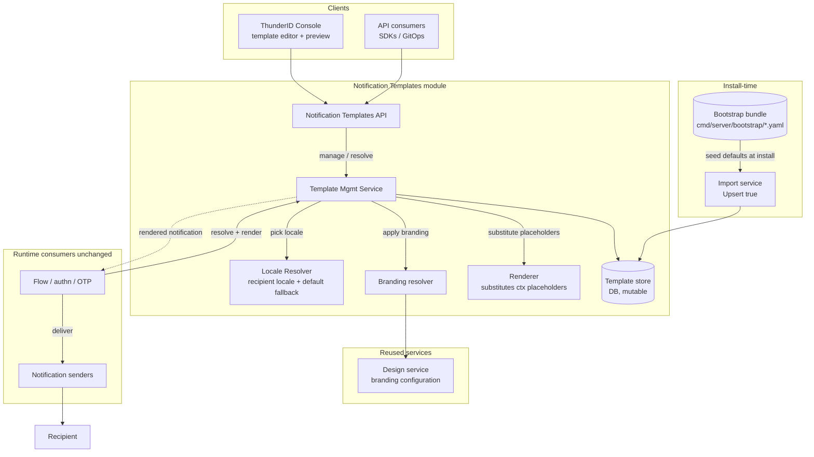

[Design Discussion] Manage Email/SMS Notification Templates via API and UI

<!-- Label: Type/Design · Category: 📐 Design -->

## Related Feature Issue

#5337

## Problem Summary

ThunderID ships a fixed set of email/SMS notification templates that can only be changed by editing files
on the server and restarting; there is no runtime API or Console to view, customize, or extend them. They
cannot be localized (one variant per scenario, no locale dimension), and each template hardcodes its own
inline HTML styling, so there is no way to apply consistent branding without editing files. This design
makes notification templates runtime-manageable, localizable per BCP-47 locale, and branded by composing
the existing Design output at render time.

## High-Level Approach

### Scope boundaries

1. **Template scenario types (OTP, password recovery) follow the flow scope.** A notification template is
   engaged through a **flow node**: the node defines which template scenario type is sent. Template
   **scenario types therefore live in the same bounding scope as flows**. A flow *definition* is a
   **global** object (deployment-scoped, with no app or OU column); applications and organization units
   bind to a flow **by reference** (`app.AuthFlowID`, `ou.AuthFlowID`, etc.), and interactive flows always
   **execute in an application context** (they require an `appId`). Because it is the global flow definition
   that references a scenario type, **scenario types are global too**.
2. **Content belongs at the OU level, but is not supported this phase.** While scenario *types* share the
   flow scope, the **content** of a scenario (subject / body per locale) naturally needs to be definable
   per **organization unit** (different OUs wording the same notification differently). That OU-level
   content capability is **not supported in this phase**: content is authored globally for now, and
   OU-level content is deferred to a later phase (tracking issue #5337).

### Template management

3. Provide the **Notification Templates management API and Console page** for the full lifecycle of templates
  (create / read / update / delete / list).
4. Store templates as **DB-backed, mutable** resources (pure `subject` + `body`, no branding markup, **per
  BCP-47 locale**). Ship the **default templates through the existing bootstrap bundle**
  (`cmd/server/bootstrap/`), seeded into the DB at install time via the import service (the same path used
  as the other default resources), so they become ordinary
  editable rows.
5. Treat **all templates uniformly** (no system/custom split): a bootstrapped default and an
  administrator-created template are the same kind of DB resource, managed the same way.

### Localization

6. **Keep different content for the same template type per locale.** A template scenario type can carry an
  independent content variant per locale (a full template per locale, `(channel, typeId, locale)` rows; see
  Alternative 1), each with its own subject and body. Locale identifiers are validated as well-formed BCP-47
  tags. Which variant is picked at render, with default-locale fallback, is covered in _Using templates in
  node execution_.

### Branding resolution

7. **Compose branding at render time** from the existing Design service (not owned here), applied on top of
  the resolved content. Content and branding stay **independent**, so a single branding change applies to
  every template without editing content. SMS is plain text with no branding. How branding resolves at
  render is covered in _Using templates in node execution_.

| Factor | Content | Branding |
|---|---|---|
| Owned by | This feature | Design feature |
| Varies by | locale | application |
| Applies to SMS | ✓ (plain text) | ✗ (`brandingApplied: false`) |
| Stored as | pure `subject` + `body` per locale | theme / layout / logo |

### Preview

8. Provide a **live, as-delivered preview** in the Console, driven by the same `resolve` output the runtime
  uses (resolved content + composed branding + selected locale, with `{{ctx(...)}}` shown as-is), so an
  author sees the final message while editing only the pure content. It is surfaced on the **top-level
  Notification Templates page** (beside Design & Branding). This is net-new UI, but it reuses the proven
  `/design/resolve` (`type=APP`) branding path the flow **End-user preview** already uses; there is no
  email/SMS preview today.

Template **content** (subject + body, per locale) is owned by this feature; template **branding** is owned
by Design. They meet only in the channel-aware render pipeline (branding resolver + renderer).

### Components

| Component | Role | Status |
|---|---|---|
| `internal/system/template` | Template resolve + `{{ctx(...)}}` render pipeline | Extend: add mutable write path, locale key dimension |
| Template store (DB) | Templates + per-locale content, mutable | New DB-backed store, replacing today's read-only declarative file store |
| Bootstrap bundle + import service | Ships the default templates, seeded into the DB at install time (`Upsert: true`) | New `resource_type: Template` entries + import/export support |
| Locale resolver | Pick the recipient-locale variant, else the default locale | New |
| `internal/design` (`/design/resolve`) | Branding source, composed at render | Reuse (owned by Design) |
| Flow email/SMS executors + notification senders | Trigger and deliver notifications | Pass locale into `Render(...)`; otherwise unchanged |

**Entity governance.** All templates are **uniform**: there is no system/custom distinction. ThunderID
preloads a default set of templates; administrators can create additional templates, and every template is
managed the same way. Templates and their content are governed **globally** in this phase, and content
carries **per-locale variants**. The default templates are shipped through the **bootstrap bundle** and
seeded into the DB at install time, so after install they are ordinary mutable rows with nothing special
about them at runtime beyond being pre-created.

### Template actions

Every template is managed the same way, whether it was preloaded or created by an administrator.

| Action | Behaviour |
|---|---|
| Create | ✓ create a new template; server assigns the id |
| Read / list | ✓ all templates; content is returned locale-resolved |
| Update | ✓ edit `displayName`; edit subject / body per locale |
| Delete | ✓ delete a template and all its locale variants (guard for flow-referenced or preloaded templates; see open questions) |
| Reset to shipped default | ○ re-apply the bootstrap-shipped version of a default template (proposed; see open questions) |
| Locale variant | ✓ add / edit / delete a `(channel, typeId, locale)` variant |

### Using templates in node execution

A template is engaged at runtime when a flow executes a node that sends a notification (an email or SMS
node). The node references a **template scenario type** (Data model (1)); when execution reaches it, the
runtime:

1. **Resolves content** for the recipient locale, falling back to the configured default locale when no
   variant matches, so a message is always produced: `recipient-locale variant → default-locale variant`.
2. **Resolves and composes branding** on top of the content, via Design at the application tier:
   `application → default` (skipped for SMS, which is plain text with no branding).
3. **Substitutes** the `{{ctx(...)}}` placeholders with the runtime data.
4. **Hands** the rendered message to the notification senders for delivery.

Flows need no structural change: the execution context already carries the `appId` (for branding) and the
recipient locale; the email/SMS executor passes both into the resolution.

### Data model and storage

There are **two related models**, both **mutable DB rows** seeded at install time by the **bootstrap
bundle** (through the import service, `Upsert: true`) and edited afterward through the same API as any other
template.

1. **Template scenario type** — keyed by **(channel, typeId)**. One row per scenario per notification
   channel (for example `email:otp`, `sms:otp`, `email:password-recovery`). This is the entity a **flow
   node references** to choose which notification to send; it carries the `displayName` and holds no content
   of its own.
2. **Template content** — keyed by **(Template scenario type, locale)**.
   One row per locale, holding the pure `contentType`, `content`. A scenario type has
   zero or more content rows, one per locale.

So templates get stored as raw with no branding markup.

## Security Considerations

- **AuthZ:** every operation requires the `system` scope; unauthorized → `AUTH-4010`, forbidden business
  rules → `AUTH-4030`. Domain errors use the `NTM-XXXX` prefix and the shared `Error`/`I18nMessage` shape.
- **Injection / templating:** `{{ctx(...)}}` values are substituted only at send time; the preview never
  evaluates them. Rendered email is composed in a sandbox to contain XSS from authored HTML.
- **Trusted authorship:** template content is admin-authored (privileged), but the rendered output still
  reaches end users, so HTML is treated as untrusted at render.
- **Input validation:** channel, content type, required fields, referenced substitution variables, and
  BCP-47 locale tags are validated; malformed input is rejected without persisting.
- **No empty delivery:** an unresolvable type/locale (with no default-locale fallback) surfaces an explicit
  error at send time, and an empty or fabricated message is never delivered.

## Impacted Areas

- `internal/system/template`: replace the read-only declarative file store with a DB-backed mutable store
  keyed `(channel, typeId[, locale])`; add create/update/delete/list and a locale dimension.
- Bootstrap + import service: add `resource_type: Template` import/export support and ship the default
  templates in the bootstrap bundle (`cmd/server/bootstrap/`), so defaults are DB-seeded at install like
  flows, groups, roles, and translations.
- `internal/design` (`/design/resolve`): reused to resolve branding at render; branding resolution is owned
  by Design, not this feature.
- Flow email/SMS executors: pass the recipient locale into `Render(...)`; no structural flow change.
- New `api/notification-templates.yaml`; Console (top-level Notification Templates page + editor).

## Alternatives Considered

The selected solution is a **full template per locale** (independent `(channel, typeId, locale)` rows), as
described in _Localization_ and _Data model and storage_. The alternative below was considered but **not**
selected.

**Alternative 1**: Localize with a **translation catalog** instead — one language-neutral template body
that references message keys / placeholders whose *values* differ per language (reusing ThunderID's existing
translation resource), rather than a full template per locale.
- Pros: no duplication of the template structure across languages; translators edit strings, not markup; a
  structural change to the body applies to every language at once.
- Cons: hard to vary structure or layout per language (ordering, length, RTL); large body copy becomes
  awkward as message keys; more indirection between a template and its text. **Both Okta and Ory localize
  with a full template per language, not a message catalog** — Okta uses per-language "translations", each
  with its own subject/body, customized independently; Ory Kratos uses nested per-language `gotmpl` blocks
  selected by the user's language trait.
- Decision: **not selected.** The design keeps a full template per locale, matching the Okta / Ory norm and
  preserving per-language structural freedom. The translation catalog is revisitable later if cross-language
  duplication becomes a real cost.

**Alternative 2**: Support template **content** customization at the **application level** (per-app content
overrides), so each application could override a scenario's wording.
- Pros: fine-grained per-app messaging; flows already carry an `appId`, so the resolution input is
  available; mirrors branding, which already resolves at the application tier.
- Cons: widens the content scope before the intended OU tier exists; content would then resolve across
  application + OU + global, which is more than this phase needs and harder to govern (divergent per-app
  copy).
- Decision: **content stays global this phase**; per-app content is **not supported**. The intended future
  tier for content is the **organization unit** (issue #5337), not the application; the application tier
  stays a branding concern, not a content one.

## Questions for Community Input

1. **Template deletion.** Deleting a template affects wherever it is used. Should deletion be blocked if the
   template is referenced by a flow, and can a preloaded template be deleted at all?
2. **Reset to shipped default.** Should an edited default template be resettable to the version shipped in
   the bootstrap bundle (re-applying the bundle entry)?
