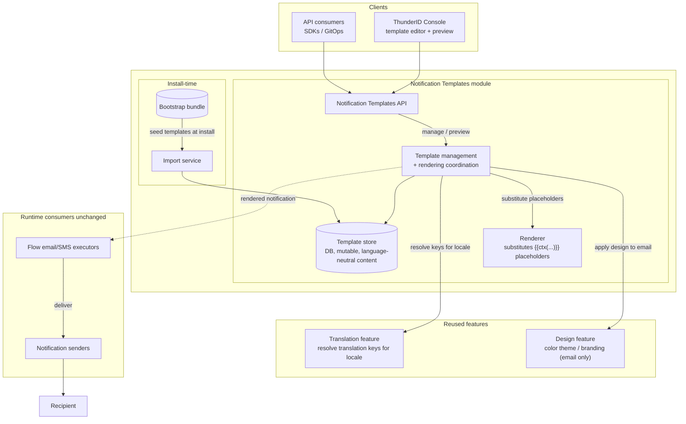

# Notification Templates Specification

- **Status:** Draft
- **Version:** 0.1
- **Related documents:** [Feature issue #5337](https://github.com/thunder-id/thunderid/issues/5337), [design discussion #5388](https://github.com/thunder-id/thunderid/discussions/5388)

## Summary

ThunderID ships fixed email and SMS templates. Changing their content requires editing server files and restarting the service. Administrators cannot manage or preview templates through the Console or an API. This specification adds runtime template management and live previews.

Each template is language-neutral: its subject and body reference translation keys rather than storing separate content for each language. The Design feature supplies the applicable design when an email is rendered. The template stores a color theme selection but does not embed application branding.

A flow node selects the template to send. During execution, ThunderID resolves its translation keys for the recipient’s language, substitutes values from the flow context, applies the applicable design, and sends the notification.

## Architecture

A template belongs to a notification channel, currently email or SMS. An administrator selects a template for a flow’s notification node, and the corresponding channel executor uses it. An email executor cannot use an SMS template, or vice versa.

Template content is global and independent of language and application design. Its subject and body reference translation keys; the resolved translation text, which can contain `{{ctx(...)}}` placeholders, is produced by the Translation feature at render time. The template stores the selected color theme for email; the Design feature supplies the applicable application or organization unit design when the notification is rendered or previewed.

The Notification Templates module manages templates and coordinates rendering. It uses the Translation feature to resolve localized text and the Design feature to apply the relevant design. Flow executors provide the selected template and execution context, and the existing notification senders deliver the result.

Templates required by flows created at bootstrap are imported through the existing bootstrap path. After import, they are ordinary editable templates. A feature installed or enabled later creates any additional template it requires.



| Component | Responsibility |
|---|---|
| Notification Templates module | Manage templates and coordinate rendering |
| Template store | Persist global templates and their content |
| Bootstrap and import | Create templates required by bootstrapped flows |
| Translation feature | Resolve translation keys for the recipient’s language |
| Design feature | Apply the applicable design based on given themes, color schemes |
| Flow executors | Select a template and provide application, language, and flow context |
| Notification senders | Deliver rendered email or SMS |
| Console | Manage templates and show template and flow previews |

## Detailed design

### Template configuration and management

Templates are global because flow definitions are global. Each template has one editable content definition. Applications and organization units cannot override that content in this phase.

Administrators can create, list, read, update, and delete templates, including those created at bootstrap. There is no system or custom classification: all templates follow the same management rules. A template cannot be deleted while a flow references it. If deletion is rejected, the template and flow remain unchanged.

The creation wizard offers sample templates, including samples for templates initially created at bootstrap. A sample supplies starting content for a new template and has no special status after creation.

### Content and localization

An email template has a subject and body. An SMS template has a body only. Each field references a single translation key, and the Translation feature resolves it to localized text for the recipient’s language.

The resolved translation text can contain `{{ctx(...)}}` placeholders for values supplied during flow execution. These placeholders are substituted when the notification is sent. They remain visible in previews because a preview has no execution context.

Email bodies are HTML (contentType is always text/html). SMS bodies are plain text. Notification layouts are outside the scope of this phase; the resolved body provides the full content.

### Preview

Previews show how a notification will appear for a selected language and applicable design. They use the same content, translation, and design resolution as delivery, but leave `{{ctx(...)}}` placeholders visible. Generating a preview never sends a notification.

Previews are available in two places:

- **Template editor:** Updates as the administrator edits the template or changes the preview language and design theme.
- **Flow preview:** Shows the template selected by the notification node using the selected language and application context.

### Rendering and delivery

When a flow reaches a notification node, its executor supplies the selected template, recipient language, application or organization unit context, and flow context. The Notification Templates module resolves translation keys, substitutes context placeholders, and applies the relevant design to email. It then passes the rendered content to the existing notification sender.

If the template, a required translation, or a required context value cannot be resolved, or if rendering fails, the notification is not sent and the error is surfaced to the flow execution.

### Data model

Templates are global resources identified by a server-assigned UUID. Each template stores a channel, a name, an optional description, and one channel-specific content definition. A single flat entity holds a template and its content; content is language-neutral, so there are no per-locale rows.

Templates are scoped to the deployment (global), so no application or organization unit dimension exists in this phase. `name` is unique per channel: creating a second template with an existing name in the same channel returns `409`.

Flows reference a template by its UUID. Templates seeded at bootstrap use fixed UUIDs so that the flow references created in the same bootstrap remain valid across installations.

The database-backed store replaces the current read-only template file store. Installation imports the templates required by bootstrapped flows. Migration must preserve existing shipped templates and valid flow references.

### API

The Notification Templates API manages templates by channel. The `channel` path parameter accepts `email` or `sms`, and `id` is a UUID assigned by the server. Management operations require the OAuth2 `system` scope.

| Method | Path | Description |
|---|---|---|
| `GET` | `/notification-templates/{channel}/templates` | List template summaries for the channel. |
| `POST` | `/notification-templates/{channel}/templates` | Create a template with its content. |
| `GET` | `/notification-templates/{channel}/templates/{id}` | Get a template. |
| `PUT` | `/notification-templates/{channel}/templates/{id}` | Update a template. |
| `DELETE` | `/notification-templates/{channel}/templates/{id}` | Delete a template if no flow references it. |
| `POST` | `/notification-templates/{channel}/templates/{id}/preview` | Render a locale- and design-applied preview without sending. |

A template has a `name`, an optional `description`, and channel-specific content. Email content has `subject` and `body` (contentType is always `text/html`, server-derived) and may select a `light` or `dark` `colorScheme`. SMS content has `body` only (plain text); supplying a subject or design is rejected with `400`. The subject and body each reference a single translation key.

An email template response using a translation key for each content field:

```json
{
  "id": "3fa85f64-5717-4562-b3fc-2c963f66afa6",
  "name": "OTP Verification",
  "description": "One-time passcode sent to verify a user's email address.",
  "self": "/notification-templates/email/templates/3fa85f64-5717-4562-b3fc-2c963f66afa6",
  "design": {
    "colorScheme": "light"
  },
  "content": {
    "contentType": "text/html",
    "subject": "notification.otp.email.subject",
    "body": "notification.otp.email.body"
  }
}
```

An SMS template response:

```json
{
  "id": "ca28e8df-d561-40d5-93fd-ce97e8f7e81b",
  "name": "OTP Verification",
  "description": "One-time passcode sent to verify a user's phone number.",
  "self": "/notification-templates/sms/templates/ca28e8df-d561-40d5-93fd-ce97e8f7e81b",
  "content": {
    "body": "notification.otp.sms.body"
  }
}
```

Invalid requests return `400`, unauthorized requests `401`, forbidden requests `403`, and missing templates `404`. Creating a template whose name already exists in the channel, or deleting one referenced by a flow, returns `409`. Errors use the shared `Error` response shape; template-specific error codes use the `NTM-XXXX` prefix.

A preview is served by `POST /notification-templates/{channel}/templates/{id}/preview`. It renders the locale- and design-applied notification, leaving `{{ctx(...)}}` placeholders visible, and never sends. Draft content may be supplied in the request body to preview unsaved edits without persisting them.

### UI

The Console adds a Notification Templates section alongside Design & Branding. The list shows templates by channel and provides actions to create, open, and delete them. The creation wizard presents **Custom template** and sample templates, from the bootstrap resources.

The editor provides content controls appropriate to the channel, available translation and desig keys and context placeholders, and a live preview with language and design theme selection. If deletion is blocked because a flow references the template, the Console shows the conflict and keeps the template available.

The flow editor lists templates for the selected notification node’s channel. Flow preview shows the selected template with the chosen language and applicable design.

## Requirements

### R1. Manage notification templates at runtime

**Requirement:** Administrators can manage global notification templates without editing server files or restarting ThunderID.

**Acceptance criteria:**

- **AC1.1:** Given an authorized administrator, when they create or update a template through the API or Console, then later reads and sends use its saved content without a restart.
- **AC1.2:** Given a template created during bootstrap, when an administrator edits it, then it follows the same management rules as an administrator-created template.
- **AC1.3:** Given a template referenced by a flow, when deletion is requested, then the API returns `409` and the template remains available to the flow.
- **AC1.4:** Given an unreferenced template, when deletion is requested, then the template is removed and sample content remains available in the creation wizard.

### R2. Localize content through translations

**Requirement:** A single template definition can produce content in the recipient’s language using translation keys.

**Acceptance criteria:**

- **AC2.1:** Given a template whose subject and body reference translation keys, when it is rendered for a language with corresponding translations, then the output contains the resolved text without changing the stored template.
- **AC2.2:** Given a required translation or context value that cannot be resolved, when rendering runs, then the notification is not sent and the error is surfaced.

### R3. Apply design at send time

**Requirement:** Notifications use the applicable design through tokens in the template content, without embedding application branding directly.

**Acceptance criteria:**

- **AC3.1:** Given a template used by two applications with different designs, when each sends an email, then each email uses its application’s applicable design.
- **AC3.2:** Given an application’s design changes, when a later email is rendered, then it reflects that change without updating the template.
- **AC3.3:** Given an SMS template, when it is rendered, then its output is plain text without design markup.

### R4. Preview notifications

**Requirement:** Administrators can inspect notifications in the template editor and flow preview.

**Acceptance criteria:**

- **AC4.1:** Given a template and selected language and design context, when its preview loads, then it shows the resolved translations and applicable design while leaving `{{ctx(...)}}` placeholders visible.
- **AC4.2:** Given a flow notification node with a selected template, when the flow is previewed, then the preview shows that template and no notification is sent.
- **AC4.3:** Given an email or SMS notification node, when its template picker opens, then it lists templates for that node’s channel.

### R5. Provision templates used by flows

**Requirement:** Flows and installed features that require a notification template have a corresponding manageable template.

**Acceptance criteria:**

- **AC5.1:** Given a fresh installation, when bootstrap creates notification-sending flows, then it creates only the templates those flows require.
- **AC5.2:** Given a feature that requires a new template, when it is installed or enabled, then the corresponding template is created through the resource import path.

## Change log

| Version | Date | Change |
|---|---|---|
| 0.1 | 2026-09-24 | Initial specification based on the notification templates design discussion. |
