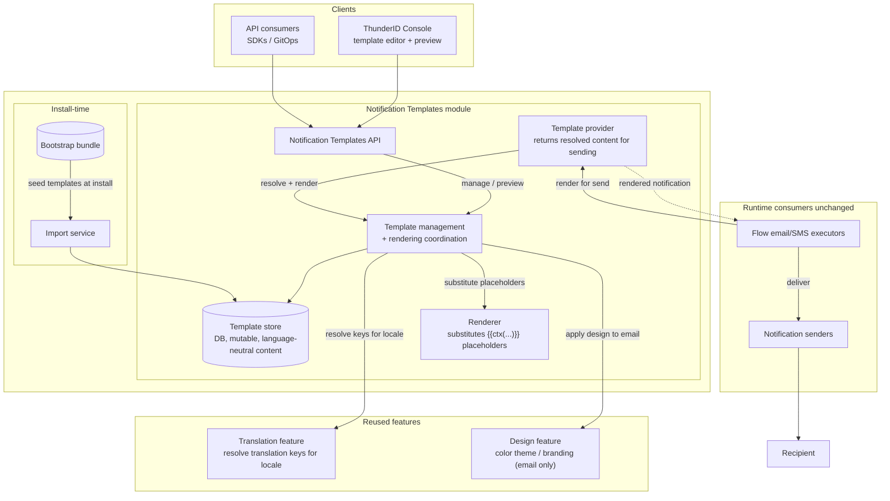

# Notification Templates Specification

- **Status:** Draft
- **Version:** 0.1
- **Related documents:** [Feature issue #5337](https://github.com/thunder-id/thunderid/issues/5337), [design discussion #5388](https://github.com/thunder-id/thunderid/discussions/5388)

## Summary

ThunderID ships fixed email and SMS templates. Changing their content requires editing server files and restarting the service. Administrators cannot manage or preview templates through the Console or an API. This specification adds runtime template management and live previews.

Each template is language-neutral: its message content reference translation keys rather than storing separate content for each language. The Design feature supplies the applicable design when an email is rendered. The template stores a color scheme selection but does not embed application branding.

A flow node selects the template to send. During execution, ThunderID resolves its translation keys for the recipient’s language, substitutes values from the flow context, applies the applicable design, and sends the notification.

## Architecture

A template belongs to a notification channel, currently email or SMS. An administrator selects a template for a flow’s notification node, and the corresponding channel executor uses it. An email executor cannot use an SMS template, or vice versa.

Template content is global and independent of language and application design. Its message content reference translation keys; the resolved translation text, which can contain `{{ctx(...)}}` placeholders, is produced by the Translation feature at render time. The template stores the selected color schemes; the Design feature supplies the applicable application design when the notification is rendered or previewed.

The Notification Templates module manages templates and coordinates rendering. It uses the Translation feature to resolve localized text and the Design feature to apply the relevant design. Runtime consumers invoke the template provider, which returns the fully resolved notification content ready for sending. They do not call the Translation or Design features themselves to resolve template placeholders; the provider has already applied them.

Templates required by flows created at bootstrap are imported through the existing bootstrap path. After import, they are ordinary editable templates. A feature installed or enabled later creates any additional template it requires.


```mermaid
flowchart TB
    subgraph clients [Clients]
        Console["ThunderID Console<br/>template editor + preview"]
        ApiClient["API consumers<br/>SDKs / GitOps"]
    end

    subgraph core [ ]
        direction LR
        subgraph nt [Notification Templates module]
            API["Notification Templates API"]
            MgmtSvc["Template management<br/>+ rendering coordination"]
            Provider["Template provider<br/>returns resolved content for sending"]
            Renderer["Renderer<br/>substitutes {{ctx(...)}} placeholders"]
            Store[("Template store<br/>DB, mutable, language-neutral content")]
        end

        subgraph install [Install-time]
            Bootstrap[("Bootstrap bundle")]
            Importer["Import service"]
        end
    end

    subgraph reused [Reused features]
        Translation["Translation feature<br/>resolve translation keys for locale"]
        Design["Design feature<br/>color theme / branding (email only)"]
    end

    subgraph consumers [Runtime consumers unchanged]
        Flow["Flow email/SMS executors"]
        Sender["Notification senders"]
    end
    Recipient["Recipient"]

    Console --> API
    ApiClient --> API
    API -->|manage / preview| MgmtSvc
    MgmtSvc --> Store
    Bootstrap -->|seed templates at install| Importer --> Store
    MgmtSvc -->|resolve keys for locale| Translation
    MgmtSvc -->|apply design to email| Design
    MgmtSvc -->|substitute placeholders| Renderer
    Flow -->|render for send| Provider
    Provider -->|resolve + render| MgmtSvc
    Provider -. rendered notification .-> Flow
    Flow -->|deliver| Sender --> Recipient

    Store ~~~ Translation
    Renderer ~~~ Design
    nt ~~~ reused
```

| Component | Responsibility |
|---|---|
| Notification Templates module | Manage templates and coordinate rendering |
| Template provider | Return fully resolved notification content (translations and design applied) for sending, so runtime consumers do not call the Translation or Design features directly |
| Template store | Persist global templates and their content |
| Bootstrap and import | Create templates required by bootstrapped flows |
| Translation feature | Resolve `notification`-namespace translation keys for the recipient’s language |
| Design feature | Apply the applicable design based on given themes, color schemes |
| Flow executors | Select a template and, through the template provider, supply application, language, and flow context |
| Notification senders | Deliver rendered email or SMS |
| Console | Manage templates and show template and flow previews |

## Detailed design

### Template configuration and management

Templates are global because flow definitions are global. Each template has one editable content definition. Applications and organization units cannot override that content in this phase.

Administrators can create, list, read, update, and delete templates, including those created at bootstrap. There is no system or custom classification: all templates follow the same management rules. A template cannot be deleted while a flow references it. If deletion is rejected, the template and flow remain unchanged.

The creation wizard offers sample templates, including samples for templates initially created at bootstrap. A sample supplies starting content for a new template and has no special status after creation.

### Content and localization

An email template has a subject and body. An SMS template has a body only. Each field is a string that can embed `{{t(...)}}` placeholders referencing translation keys, none, one, or multiple, alongside literal text. The Translation feature resolves each `{{t(...)}}` reference to localized text for the recipient’s language.

Template keys live under a dedicated `notification` translation namespace. The Translation feature resolves a key with this namespace at render time (`ResolveTranslationsForKey(ctx, language, "notification", key)`). The keys referenced by templates seeded at bootstrap, together with their default-language values, are created in the `notification` namespace through the same bootstrap import that seeds the templates.

Administrator-created templates can reference existing `notification` keys or require new ones. New keys are created through the Translation feature, with UI support in two places: the Console translation section manages `notification` keys directly, and the notification template editor can create a key inline when an administrator references one that does not yet exist. Either path persists the key, and its default-language value, in the `notification` namespace before the template is saved.

The resolved translation text can contain `{{ctx(...)}}` placeholders for values supplied during flow execution. These placeholders are substituted when the notification is sent. They remain visible in previews because a preview has no execution context.

Notification layouts are outside the scope of this phase; the resolved body provides the full content.

### Preview

Previews show how a notification will appear for a selected language and applicable design. They use the same content, translation, and design resolution as delivery, but leave `{{ctx(...)}}` placeholders visible. Generating a preview never sends a notification.

Previews are available in two places:

- **Template editor:** Updates as the administrator edits the template or changes the preview language and design theme.
- **Flow preview:** Shows the template selected by the notification node using the selected language and application context.

### Rendering and delivery

When a flow reaches a notification node, its executor calls the template provider with the selected template, recipient language, application or organization unit context, and flow context. The provider resolves translation keys, substitutes context placeholders, and applies the relevant design to email, then returns the fully resolved content ready for sending. The executor therefore never calls the Translation or Design features itself; it receives finished content and hands it to the existing notification sender for delivery.

Delivery reuses the existing senders unchanged. The email executor (`internal/flow/executor/email_executor.go`) hands the rendered subject and body to the reusable email client (`internal/system/email`), which sends over SMTP. The SMS executor (`internal/flow/executor/sms_executor.go`) passes the rendered body to the notification sender service (`internal/notification`) for the configured sender, which dispatches through the message client (`internal/notification/client`, backed by Twilio, Vonage, or a custom provider). Only the content these executors send changes; the transport packages are not modified.

A missing translation for the recipient’s language does not stop delivery. The Translation feature falls back to the best available match for the key and ultimately to the system language, so a key translated only in the system language still renders. The notification is not sent only when a referenced key has no translation in any language, the template or a required context value cannot be resolved, or rendering otherwise fails; in those cases the error is surfaced to the flow execution.

### Data model

Templates are global resources identified by a server-assigned UUID. Each template also carries a unique, immutable `handle` and a human-readable `displayName`, following the same convention as themes, layouts, and flows. It stores a channel, an optional description, and one channel-specific content definition. A single flat entity holds a template and its content; content is language-neutral, so there are no per-locale rows.

Templates are scoped to the deployment (global), so no application or organization unit dimension exists in this phase. The `handle` is unique per channel: creating a second template with an existing handle in the same channel returns `409`. The `displayName` is not unique and can be edited freely.

Flows reference a template by its `handle` rather than its UUID. Because the handle is stable and deployment-independent, bootstrapped flows stay valid without fixed UUIDs, and a flow exported from one deployment remains valid when imported into another.

The database-backed store replaces the current read-only template file store. Installation imports the templates required by bootstrapped flows. Migration must preserve existing shipped templates and valid flow references.

### API

The Notification Templates API manages templates by channel. The `channel` path parameter accepts `email` or `sms`, and `id` is the UUID assigned by the server. Management operations require the OAuth2 `system` scope.

| Method | Path | Description |
|---|---|---|
| `GET` | `/notification-templates/{channel}/templates` | List template summaries for the channel, with `limit` and `offset` pagination. |
| `POST` | `/notification-templates/{channel}/templates` | Create a template with its content. |
| `GET` | `/notification-templates/{channel}/templates/{id}` | Get a template. |
| `PUT` | `/notification-templates/{channel}/templates/{id}` | Update a template. The `handle` is immutable and cannot be changed. |
| `DELETE` | `/notification-templates/{channel}/templates/{id}` | Delete a template. Idempotent, and rejected if a flow references it. |

A template has a unique, immutable `handle`, a `displayName`, an optional `description`, and channel-specific content. Email content has a `subject` and `body`; SMS content has a `body` only (plain text, no subject or design configuration). Each content field is a string that may embed `{{t(...)}}` translation placeholders and `{{ctx(...)}}` context placeholders, so a field can reference none, one, or multiple translation keys alongside literal text. An email template may also carry a `design` with a `light` or `dark` `colorScheme`, composed on top of the content when the email is rendered and ignored for SMS. The `handle` is set at creation and is not accepted on update.

An email template response with translation-key references in its content:

```json
{
  "id": "3fa85f64-5717-4562-b3fc-2c963f66afa6",
  "handle": "otp-verification",
  "displayName": "OTP Verification",
  "description": "One-time passcode sent to verify a user's email address.",
  "design": {
    "colorScheme": "light"
  },
  "content": {
    "subject": "{{t(notification.otp.email.subject)}}",
    "body": "<p>{{t(notification.otp.email.message)}}</p><p>{{ctx(otp)}}</p>"
  }
}
```

An SMS template response:

```json
{
  "id": "0db4e64e-57aa-49cb-9b8e-1f3044ed5e17",
  "handle": "otp-verification",
  "displayName": "OTP Verification",
  "description": "One-time passcode sent to verify a user's phone number.",
  "content": {
    "body": "{{t(notification.otp.sms.message)}} {{ctx(otp)}}"
  }
}
```

Invalid requests return `400`, unauthorized requests `401`, forbidden requests `403`, and missing templates `404`. Creating a template whose handle already exists in the channel, or deleting one referenced by a flow, returns `409`. Delete is idempotent: deleting a template that does not exist still returns `204`. Errors use the shared `Error` response shape; template-specific error codes reuse the existing `TMP-XXXX` prefix from the template module rather than introducing a new one.

Previews are produced in the Console using the same content, translation, and design resolution as delivery (see Preview).

### UI

The Console adds a Notification Templates section alongside Design & Branding. The list shows templates by channel and provides actions to create, open, and delete them. The creation wizard presents **Custom template** and sample templates, from the bootstrap resources.

The editor provides content controls appropriate to the channel, the available `notification` translation keys, design tokens, and context placeholders, and a live preview with language and design theme selection. When an administrator needs a key that does not yet exist, the editor can create it inline in the `notification` namespace, mirroring what the Console translation section offers. If deletion is blocked because a flow references the template, the Console shows the conflict and keeps the template available.

The flow editor lists templates for the selected notification node’s channel. Flow preview shows the selected template with the chosen language and applicable design.

## Requirements

### R1. Manage notification templates at runtime

**Requirement:** Administrators can manage global notification templates without editing server files or restarting ThunderID.

**Acceptance criteria:**

- **AC1.1:** Given an authorized administrator, when they create or update a template through the API or Console, then later reads and sends use its saved content without a restart.
- **AC1.2:** Given a template created during bootstrap, when an administrator edits it, then it follows the same management rules as an administrator-created template.
- **AC1.3:** Given a template that is in use, for example referenced by a flow, when deletion is requested, then the API returns `409` and the template remains available to its consumers.

### R2. Localize content through translations

**Requirement:** A single template definition can produce content in the recipient’s language using translation keys.

**Acceptance criteria:**

- **AC2.1:** Given a template whose subject and body reference translation keys, when it is rendered for a language with corresponding translations, then the output contains the resolved text without changing the stored template.
- **AC2.2:** Given a key with no translation for the recipient’s language but a value in the system language, when rendering runs, then the notification is sent using the system-language fallback.
- **AC2.3:** Given a referenced key with no translation in any language, or a required context value that cannot be resolved, when rendering runs, then the notification is not sent and the error is surfaced.

### R3. Apply design at send time

**Requirement:** Notifications use the applicable design through tokens in the template content, without embedding application branding directly.

**Acceptance criteria:**

- **AC3.1:** Given a template used by two applications with different designs, when each sends an email, then each email uses its application’s applicable design.
- **AC3.2:** Given an application’s design changes, when a later email is rendered, then it reflects that change without updating the template.
- **AC3.3:** Given an SMS template, when it is rendered, then its output is plain text without design markup.

### R4. Preview notifications

**Requirement:** Administrators can inspect notifications in the template editor and flow preview.

**Acceptance criteria:**

- **AC4.1:** Given a template and selected language and design context, when its preview loads, then it shows the resolved translations and applicable design while leaving `{{ctx(...)}}` placeholders visible.
- **AC4.2:** Given a flow notification node with a selected template, when the flow is previewed, then the preview shows that template and no notification is sent.
- **AC4.3:** Given an email or SMS notification node, when its template picker opens, then it lists templates for that node’s channel.

### R5. Provision templates used by flows

**Requirement:** Flows and installed features that require a notification template have a corresponding manageable template.

**Acceptance criteria:**

- **AC5.1:** Given a fresh installation, when bootstrap creates notification-sending flows, then it creates only the templates those flows require.
- **AC5.2:** Given a feature that requires a new template, when it is installed or enabled, then the corresponding template is created through the resource import path.

## Change log

| Version | Date | Change |
|---|---|---|
| 0.1 | 2026-09-24 | Initial specification based on the notification templates design discussion. |
