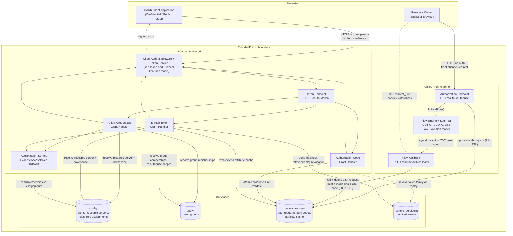
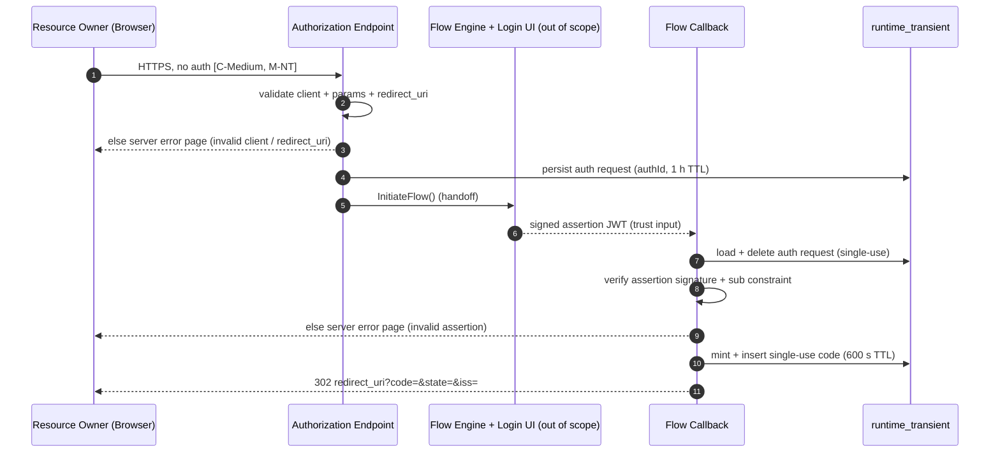
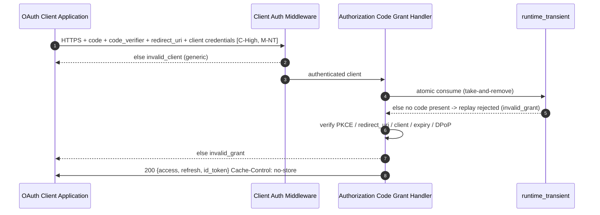
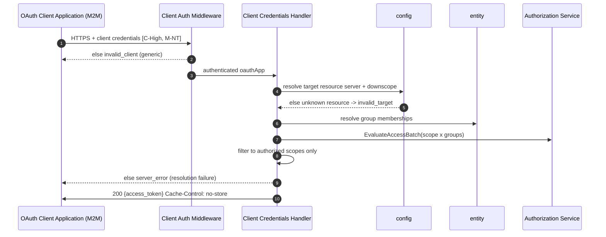
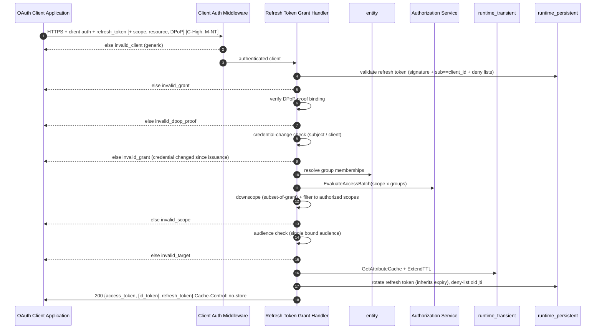

# OAuth 2.0 Authorization and Core Grants Threat Model

This model covers grant-type processing at the OAuth 2.0 / OpenID Connect token endpoint for the `authorization_code`, `client_credentials`, and `refresh_token` grants, together with the front-channel authorization request and flow callback that precede the `authorization_code` exchange.

## Overview

`ThunderID` is a lightweight, open-source IAM stack written in Go. Three grants converge on `POST /oauth2/token`:

- **`authorization_code` (with PKCE)** is the only grant driving an end-user login, via the browser front-channel. The authorization request validates and persists the client and parameters; the callback verifies a signed assertion and mints a 160-bit single-use code; the token endpoint atomically consumes that code and re-validates PKCE, `redirect_uri`, client identity, expiry, and DPoP binding before issuing tokens.
- **`client_credentials`** is the machine-to-machine grant, where a client authenticates as itself for a token on its own behalf (`sub` is the application's ID; no resource owner, front-channel, refresh token, or ID token). An authorization decision is made at issuance: scopes are downscoped to the single target resource server, then gated by RBAC against the application's group memberships.
- **`refresh_token`** is the back-channel exchange presenting a refresh token for a fresh access token, and an ID token when `openid` was granted, without re-login. The token is a stateless signed JWT bound to its client via `sub == client_id`.

In scope: grant-type processing for these three grants, and the front-channel authorization request and callback that precede `authorization_code`. Out of scope: client authentication, token issuance and signing, DPoP verification, the login flow itself, and revocation enforcement, each covered in a separate threat model.

## Scope

This model covers:
- `GET /oauth2/authorize`: client and parameter validation, PKCE enforcement, authorization-request persistence, flow initiation
- `POST /oauth2/auth/callback`: assertion verification and authorization code issuance
- `POST /oauth2/token` for `grant_type=authorization_code`: code consumption and binding re-validation
- `POST /oauth2/token` for `grant_type=client_credentials`: resource-server downscoping and the RBAC decision at issuance
- `POST /oauth2/token` for `grant_type=refresh_token`: token validation, credential-change rejection, re-authorization, rotation
- Resource indicators (RFC 8707) as they constrain audience and scope for these grants

Out of scope (see the referenced companion models):
- The authentication flow itself, including credential validation, MFA, federated IdP exchange, and the login UI, covered by the Flow Execution model
- Client authentication mechanics, token issuance and signing, the token model, and DPoP proof verification, covered by the Token and Protocol Features model
- The `token_exchange`, `ciba`, and `jwt-bearer`/ID-JAG grants, and OIDC logout, covered by the Token and Protocol Features model
- Token revocation and its enforcement, covered by the Token Revocation model

## Architecture



### Components

| Component | Task |
| --- | --- |
| Authorization endpoint | Front-channel `GET /oauth2/authorize`. Validates the client and request parameters, enforces S256 PKCE for public clients, persists the validated request to the auth-request store, and initiates the authentication flow. Sets frame-protection headers (`X-Frame-Options: DENY`, CSP `frame-ancestors 'none'`); CORS is disabled on this route. |
| Request validator | Client lookup, exact-match `redirect_uri` validation with open-redirect-safe ordering, `response_type`/`grant_type` checks, PKCE format and method enforcement, nonce length, resource-indicator resolution, and duplicate-parameter rejection. |
| Flow engine and login UI | Internal authentication for `authorization_code`, out of scope (Flow Execution model). Returns a signed assertion JWT that the grant consumes as a trust input. |
| Flow callback | `POST /oauth2/auth/callback`. Loads and deletes the single-use auth request, verifies the assertion signature, enforces the `sub` constraint, and mints the authorization code. |
| Token endpoint | `POST /oauth2/token`. Runs client authentication first, then dispatches to the per-grant handler. Sets `Cache-Control: no-store`. |
| Authorization code grant handler | Atomically consumes the code and re-validates PKCE, `redirect_uri`, `client_id`, expiry, and DPoP binding before delegating to token issuance. |
| Client credentials grant handler | Validates the grant and resource URIs, resolves resource servers, downscopes requested scopes to the single target resource server's defined permissions, runs the RBAC decision against the application's group memberships, and requests the signed access token. |
| Refresh token grant handler | Validates the refresh-token JWT against the revocation deny lists, enforces DPoP binding, rejects tokens predating a credential change, downscopes and re-authorizes scopes against the subject's current roles and groups, confirms the single bound audience, refreshes the attribute cache, rotates the refresh token by default (carrying over its expiry), and issues the new tokens. |
| Resource indicators (RFC 8707) | Resolves resource identifiers to internal resource servers, rejecting unknown ones with `invalid_target`; resolves the single target resource server and downscopes requested scopes to its defined permissions. |
| Authorization service | `EvaluateAccessBatch` performs the RBAC decision over (scope × group) tuples, for `client_credentials` at issuance and for `refresh_token` on every exchange; only positively-decided scopes are issued. |
| Attribute cache | Supplies user attributes for refresh-token issuance and extends its TTL to outlive the longest-lived issued token, bounded by the grant's fixed expiry since rotation no longer extends it. |
| Auth-request store / auth-code store | Short-lived runtime stores: the auth request (1 h TTL, keyed by `authId`, single-use) and the auth code (600 s TTL, atomically consumed single-use), held in the primary database or Redis. |
| Client auth middleware / token service | Cross-cutting; covered by the Token and Protocol Features model and only referenced here. |

### Actors

#### Actors

The actors below are the people who interact with this area. The OAuth client application is
software rather than an actor: it acts on behalf of the resource owner or the client developer,
and appears as a component in the architecture above.

| Actor | Description | Roles or permissions |
| --- | --- | --- |
| Resource owner (end user) | The person who authenticates through the OAuth front channel and grants a client application access to their identity and resources. Only the `authorization_code` grant involves them. | N/A |
| Client developer or integrator | The person who builds and operates a registered OAuth client. Their client initiates the grants, redeems codes, and exchanges refresh tokens. For `client_credentials` there is no end user, and the application itself is the RBAC subject they configure. | Per-client grant types, scopes, redirect URIs, auth method, DPoP binding |
| Administrator | The operator who registers and configures OAuth clients (redirect URIs, grant types, PKCE and DPoP policy, rotation, TTLs) and assigns application group memberships, scopes, and resource servers. | Root system permission |
| Malicious actor | An adversary, external or an authenticated user, attempting to steal or replay authorization codes and refresh tokens, supply malicious redirect URIs, forge assertions, brute-force client secrets, over-request scopes, widen audiences, or cause service disruption. | N/A |

#### Entitlement matrix

Actions are performed through an OAuth client; the rows record which people can cause them.

| Actor | Initiate `/oauth2/authorize` | Exchange code at `/oauth2/token` | Obtain `client_credentials` token | Exchange refresh token |
| --- | --- | --- | --- | --- |
| Resource owner (end user) | Yes, by following a client's redirect | No | No | No |
| Client developer or integrator | Yes, through their registered client | Yes, their client's own code and credentials | Yes, if allowlisted on their client | Yes, their client's own token |
| Administrator | Yes, via a client they configure | Yes | Yes | Yes |
| Malicious actor | Yes, the endpoint is public | Only with a stolen code plus the matching PKCE verifier, client credentials, and redirect URI | Only with stolen client credentials | Only with a leaked refresh token plus client credentials |

### External Dependencies (not owned)

| Dependency | Description (usage, purpose, authentication, authorization, security) |
| --- | --- |
| Flow engine and login UI | Internal authentication engine and UI invoked for the authentication flow triggered by `/oauth2/authorize`. Returns a signed assertion JWT consumed as a trust input. Covered by the Flow Execution model. |
| Client authentication, token service, signing key | Cross-cutting: client authentication, JWT build and sign, the on-disk signing key, and the stateless token model. Covered by the Token and Protocol Features model. |
| Authorization service (RBAC) | Evaluates (scope × group) access decisions for `client_credentials` at issuance and `refresh_token` on every exchange. The decision authority for issued scopes. Internal access only. |
| Actor provider | Resolves an application's group memberships so it can be evaluated as an RBAC subject. Internal access only. |
| Resource provider | Resolves resource identifiers to resource servers and downscopes to their defined permissions. Internal access only. |
| Attribute cache store | Backing store for user attributes referenced by the refresh token's `aci`; supports TTL extension. Internal access only. |
| Runtime Store (PostgreSQL, SQLite, or Redis) | The primary database stores OAuth client records, application group and role assignments, resource server definitions, and revoked-token entries. Auth codes, auth requests, and the attribute cache are held there by default, or in Redis when configured, which adds native TTL eviction and atomic consume operations for race-safe single-use consumption. Internal access only. |

## Threats and mitigations

### Out-of-scope interactions and risks

- Security of the authentication flow itself, including credential validation, MFA, federated IdP exchange, and the login UI, covered by the Flow Execution model. The returned assertion JWT is treated here only as a verifiable trust input.
- Client authentication mechanics, token issuance, JWT signing including algorithm-confusion defences, the token model, and DPoP proof verification, covered by the Token and Protocol Features model. The `token_exchange`, `ciba`, and `jwt-bearer`/ID-JAG grants and OIDC logout are also documented there.
- Token revocation and its enforcement, covered by the Token Revocation model.
- How the original grant behind a refresh token was obtained: covered in the relevant interaction here for `authorization_code`, or in the Token and Protocol Features model for `token_exchange` and `ciba`.
- Resource-server enforcement of the scopes and audiences embedded in issued access tokens: the responsibility of the protected resource consuming the token.
- Client-side storage and handling of issued tokens, authorization codes, and refresh tokens, for example XSS in the client application: the responsibility of the consuming application. Transport is protected by TLS.
- Database and Redis encryption and access controls: assumed to be managed at the infrastructure layer.
- TLS certificate management and configuration: assumed to be managed at the deployment layer.
- Filesystem protection of the signing key: assumed to be managed at the deployment or OS layer.
- Rate limiting, lockout, and bot detection on the OAuth endpoints: outside the product's core by design; applied at the deployment or gateway layer, see the Production Deployment Guidelines.

### Interactions

#### [01]: Authorization request and code issuance

**Description**

A client redirects the browser to `GET /oauth2/authorize`. The endpoint validates the client and parameters, persists the request (single-use `authId`, 1 h TTL), and initiates an authentication flow. The flow itself is out of scope. After authentication, the signed assertion is POSTed to `POST /oauth2/auth/callback`, which loads and deletes the auth request, verifies the assertion signature, and mints a single-use 160-bit code returned on the registered `redirect_uri`.

**Assets involved**

| Initiator | Intermediate | Target |
| --- | --- | --- |
| Resource owner (browser) | Flow engine and login UI (out of scope) | Authorization endpoint and flow callback |

**Data flow**



**Security considerations**

| Area | Response | Comments |
| --- | --- | --- |
| Data confidentiality | [C-Medium] | No credentials traverse the front channel, but the code and state pass through the browser and redirect URI, and the assertion carries user identity claims. |
| Communication medium | [M-NT] | |
| Transport security | TLS | An `http` redirect URI raises an insecure-configuration warning but is not blocked. |
| Authentication | Flow-engine authentication plus assertion signature | The endpoint is unauthenticated; identity is established by the flow (out of scope) and proven by a signed assertion verified at the callback. |
| Accessibility | Public | |
| Authorization and Access Control | Assertion-derived scopes, with pre-redirect validation | The `redirect_uri` is validated against the client's registered URIs before any redirect, so an invalid client or URI renders a server error page rather than redirecting to an attacker-supplied target. The auth request is consumed single-use at the callback. Granted scopes are taken from the assertion's authorized permissions, and consent is enforced as a flow step. The issued code is bound to client, `redirect_uri`, PKCE challenge, scope, nonce, and DPoP thumbprint, all re-verified at exchange. |

**Threat assessment**

| ID | Category | Threat | Materializable | Mitigation / comment |
| --- | --- | --- | --- | --- |
| 1 | Spoofing | Attacker supplies a malicious `redirect_uri` to steal the authorization code (open redirect). | No | `redirect_uri` is validated against registered URIs (exact match by default; wildcards are opt-in, constrained to single DNS labels, with path cleaning and fragment rejection). Invalid clients or URIs render a server error page and are never redirected to the attacker-supplied target. Wildcard patterns are the registering administrator's responsibility to scope to domains they control; `ThunderID` does not verify ownership of matching subdomains. |
| 2 | Information disclosure | Authorization code intercepted and replayed, for example on a public client. | No | PKCE is forced for all public clients, S256 only, with `plain` rejected and format strictly validated. The code binds the challenge, client, and redirect URI, all re-verified at the token endpoint. |
| 3 | Tampering | Forged or tampered assertion presented at the callback to mint a code for an arbitrary user. | No | The assertion signature is verified before issuance; an empty user ID is rejected and the `sub` constraint is enforced for OIDC requests. |
| 4 | Spoofing | Cross-site request forgery against the authorization request. | No | `state` is round-tripped as the client's CSRF token, and `iss` is returned for mix-up defence. PKCE and `state` together provide CSRF protection. |
| 5 | Tampering | Clickjacking, the authorization surface framed by a malicious site. | No | The endpoint sets `X-Frame-Options: DENY` and CSP `frame-ancestors 'none'`; CORS is disabled. |
| 6 | Denial of service | Flood of authorization requests creating flow contexts and auth-request rows. | No | Persisted rows are single-use and self-expiring (1 h TTL), so the store does not grow without bound, and no token signing occurs on this path. Rate limiting and bot detection are outside the product's core and belong at the deployment or gateway layer; see the Production Deployment Guidelines. |
| 7 | Tampering | Parameter pollution via duplicated query parameters. | No | All query parameters except `resource`, which is repeatable by specification, are rejected when duplicated. |
| 8 | Spoofing | A code is issued without explicit user consent. | No | Consent is enforced as a flow step that gates issuance, and `prompt=consent` forces a re-prompt. Enforcement runs in the flow engine (out of scope); this model records only that the gate exists. |
| 9 | Information disclosure | Authorization code or assertion leaked via logs. | No | Code and assertion contents are never logged; only `authId` at debug level and a masked `client_id` appear. |

#### [02]: Authorization code exchange at the token endpoint

**Description**

The client exchanges the code at `POST /oauth2/token` with `grant_type=authorization_code`. Client authentication runs as middleware first. The handler atomically consumes the code, then re-validates the PKCE `code_verifier` against the stored S256 challenge (when required by the client or when a challenge was set at authorization), plus `redirect_uri`, `client_id`, expiry, and DPoP binding, before token issuance.

**Assets involved**

| Initiator | Intermediate | Target |
| --- | --- | --- |
| OAuth client application | Client auth middleware (companion model) | Authorization code grant handler and auth-code store |

**Data flow**



**Security considerations**

| Area | Response | Comments |
| --- | --- | --- |
| Data confidentiality | [C-High] | The code, client credentials, PKCE verifier, and issued tokens are all high-value secrets transiting this endpoint. |
| Communication medium | [M-NT] | |
| Transport security | TLS | |
| Authentication | Client authentication plus code binding | Client auth is covered by the companion model; the code is additionally bound to client, redirect URI, PKCE, and DPoP, and re-verified here. |
| Accessibility | Public | |
| Authorization and Access Control | Capability bound at issuance | Client-authenticated using the client's single allowlisted method. The code is atomically consumed on first use, and the PKCE `code_verifier`, `redirect_uri`, `client_id`, expiry, and DPoP thumbprint are re-validated against the values bound at issuance. A code alone is insufficient without the matching verifier, client credentials, and redirect URI. Scopes were decided when the code was minted and are not widened here. |

**Threat assessment**

| ID | Category | Threat | Materializable | Mitigation / comment |
| --- | --- | --- | --- | --- |
| 1 | Security risk | Authorization code replayed for a second token issuance. | No | The code is consumed atomically on SQL or Redis; a replay finds no code and is rejected with `invalid_grant`. The code carries 160-bit entropy and a 600 s TTL. |
| 2 | Spoofing | Stolen authorization code redeemed by an attacker lacking the PKCE verifier. | No | The verifier is checked against the stored S256 challenge, and `redirect_uri` and `client_id` are re-checked against bound values. Without the verifier and matching client credentials the exchange cannot complete. |
| 3 | Elevation of privilege | On detecting a replayed code, already-issued tokens are not revoked. | No | The first redemption records a short-lived replay marker carrying the grant's token family id; a second redemption recovers it and revokes the whole family. Enabled by default. Tokens minted from the first legitimate use are therefore revoked when replay is detected. |
| 4 | Tampering | `redirect_uri` mismatch at exchange. | No | When the authorization request included a `redirect_uri`, the value presented at exchange must match the bound one; it may be omitted only if it was omitted at authorization. |
| 5 | Spoofing | A code issued for one client redeemed by another. | No | The code binds `client_id` at issuance; an exchange by a different authenticated client is rejected. |
| 6 | Tampering | Sender-constrained code redeemed without a matching key. | No | When the code carries a DPoP thumbprint, the handler enforces the proof key against the bound value. DPoP mechanics are covered by the companion model. |
| 7 | Tampering | Expired code accepted at exchange. | No | Code expiry is re-validated independently of the store TTL; expired codes are rejected. |
| 8 | Information disclosure | Code or `code_verifier` leaked via logs or error responses. | No | Neither is logged; `client_id` is masked. Error responses return only an error code and description. |
| 9 | Repudiation | Stale authorization after a permission change. | Yes | The access token is minted from the assertion's authorized permissions at exchange and is never re-evaluated afterward. A role or group change after issuance does not revoke it, and it keeps its original scopes until expiry. The refresh token issued alongside it does re-authorize scopes on every subsequent exchange (see [04]-9), which bounds later tokens, but the initially issued access token itself is unaffected. Mitigation: short access-token TTLs and explicit revocation by `jti`. See Residual risks below. |

#### [03]: Client credentials token issuance

**Description**

A self-authenticating client calls `POST /oauth2/token` with `grant_type=client_credentials`. After client authentication, the handler resolves resource servers, downscopes requested scopes to those valid for the target, runs an RBAC decision against the application's group memberships, composes the audience, and issues a single access token. There is no refresh or ID token.

**Assets involved**

| Initiator | Intermediate | Target |
| --- | --- | --- |
| OAuth client application (machine) | Client auth middleware, authorization service | Token endpoint and token service |

**Data flow**



**Security considerations**

| Area | Response | Comments |
| --- | --- | --- |
| Data confidentiality | [C-High] | Client credentials and the issued access token are high-value secrets transiting this endpoint. |
| Communication medium | [M-NT] | |
| Transport security | TLS | |
| Authentication | Client authentication | Single per-client allowlisted method with constant-time secret verification. See the companion model. |
| Accessibility | Public | |
| Authorization and Access Control | Resource-server downscoping plus RBAC at issuance | `client_credentials` must be allowlisted on the client. Two stages: requested scopes are downscoped to the target resource server's defined permissions, and unknown resource identifiers are rejected with `invalid_target`; the surviving scopes are then evaluated against the application's group memberships, and only positively decided scopes reach the token. Group resolution or RBAC evaluation failures fail closed with a server error. `refresh_token` enforces an equivalent RBAC decision on every exchange (see [04]). |

**Threat assessment**

| ID | Category | Threat | Materializable | Mitigation / comment |
| --- | --- | --- | --- | --- |
| 1 | Elevation of privilege | Scope over-request, the client requests scopes beyond what it should hold. | No | Two gates: downscoping drops any scope not defined on the target resource server, and the RBAC decision drops any the application is not authorized for. Only positively decided scopes reach the token. `refresh_token` re-runs an equivalent RBAC decision on every exchange (see [04]-9). |
| 2 | Spoofing | Client-secret brute force or credential stuffing. | No | Secrets are 256-bit and verified in constant time, so guessing is computationally impractical and timing gives nothing away. Failure responses are a generic `invalid_client`, revealing no distinction between unknown client and wrong secret. Attempt-rate limiting and lockout are outside the product's core and belong at the deployment or gateway layer; see the Production Deployment Guidelines. |
| 3 | Repudiation | Stale authorization after a permission change. | Yes | A stolen token can be revoked by `jti` and is rejected on the hot path. Residual: the decision depends on the application's group and role memberships, and while criteria-based revocation can express the application, role, and group dimensions, no writer records them and hot-path enforcement covers only the token-family and subject dimensions. A membership change therefore does not revoke outstanding tokens, which keep their scopes until expiry. This grant has no refresh exchange to self-heal at, so the token is stale for its full TTL rather than until a next refresh (see `[02]-9` and `[04]-9`). Mitigation: short TTLs and explicit revocation. See Residual risks below. |
| 4 | Spoofing | Stolen bearer access token replayed by an attacker. | No | Tokens are sender-constrained when the client is DPoP-bound, in which case the token carries a key thumbprint and requires a matching proof at the resource server. Otherwise mitigation relies on TLS and short TTLs, which is inherent to bearer tokens. |
| 5 | Repudiation | Audience confusion, a token minted for one resource server accepted by another. | No | The audience is composed from resolved resource server identifiers, falling back to the client ID only when no resource server contributes. Unknown identifiers are rejected before issuance, so tokens are resource-restricted rather than broadly scoped to the client itself. |
| 6 | Denial of service | Group resolution or RBAC evaluation failure mishandled, failing open or leaking detail. | No | Either error returns a generic server error and issues no token; the handler fails closed. |

#### [04]: Refresh token exchange

**Description**

A client presents a refresh token at `POST /oauth2/token` with `grant_type=refresh_token` for a fresh access token, and an ID token when `openid` was granted. After client authentication, the handler validates the refresh-token JWT, enforces DPoP binding if the token is sender-constrained, rejects the token when the subject's or client's credential changed after it was issued, re-evaluates permission scopes against the subject's current roles and groups, downscopes scopes to a subset of the original grant, narrows audiences, refreshes the attribute-cache TTL, and rotates the refresh token by default, carrying over its expiry.

**Assets involved**

| Initiator | Intermediate | Target |
| --- | --- | --- |
| OAuth client application | Client auth middleware, refresh token grant handler | Token endpoint and token service |

**Data flow**



**Security considerations**

| Area | Response | Comments |
| --- | --- | --- |
| Data confidentiality | [C-High] | The refresh token, client credentials, and issued tokens are all high-value secrets transiting this endpoint. |
| Communication medium | [M-NT] | |
| Transport security | TLS | |
| Authentication | Client authentication plus refresh-token JWT with `sub == client_id` | Client auth is cross-cutting; the grant binds the token to the client and enforces DPoP when present. |
| Accessibility | Public | Client-authenticated, with `Cache-Control: no-store` on the response. |
| Authorization and Access Control | Subset downscoping plus RBAC re-evaluation on every exchange | The refresh token must be a validly signed JWT whose `sub` equals the authenticated client ID, and a sender-constrained token additionally requires a matching DPoP proof. Requested scopes are constrained to a subset of the original grant and re-authorized against the subject's current roles and groups, and a supplied resource must match the token's single bound audience. Confidential clients receive unbound refresh tokens; only public clients receive DPoP-bound ones. |

**Threat assessment**

| ID | Category | Threat | Materializable | Mitigation / comment |
| --- | --- | --- | --- | --- |
| 1 | Security risk | Leaked refresh token replayed to mint new access tokens. | No | Rotation is on by default, so every refresh token is single-use: the consumed `jti` is deny-listed, and replaying an old token is rejected and revokes its entire token family, killing any token the attacker has already rotated. A token can also be revoked by `jti`, and a credential change on the subject or client invalidates every refresh token issued before it. Residual: detection is reactive, so a leaked token works until either party next refreshes, and a dormant victim never triggers it. The grant dies at its original expiry. |
| 2 | Security risk | A compromised refresh token cannot be invalidated before expiry. | No | A refresh token can be revoked by `jti`, is auto-revoked on every renewal since rotation is on by default, and is rejected if the subject's or client's credential changed after issuance. Criteria-based revocation also revokes a whole token family or every artifact for a subject, and sign-out and user deletion write subject-scoped revocations. Access tokens carry the token family id and are checked against the deny lists during validation. Residual: a resource server validating the JWT locally does not consult the deny list, so those tokens remain usable until expiry; that enforcement is out of scope. Keep TTLs short. |
| 3 | Elevation of privilege | Audience widening, requesting resource indicators beyond the original audiences. | No | A supplied resource must match the token's single bound audience; a mismatch, or more than one resource, returns `invalid_target`. Scopes are further downscoped against the resolved resource server. The rotated refresh token keeps the original audience and is never widened. |
| 4 | Tampering | DPoP binding bypass, using a sender-constrained refresh token without a matching proof. | No | A matching proof is enforced whenever the token carries a key thumbprint. The new access token carries the thumbprint for public clients, and sender-constrained refresh tokens are issued only to public clients. |
| 5 | Spoofing | One client redeeming another client's refresh token. | No | The validator enforces `sub == client_id`; a mismatched subject is rejected with `invalid_grant`. The actor decision is replayed from the stored marker rather than the client's current setting. |
| 6 | Tampering | Algorithm-confusion or `alg:none` attack on refresh-token verification. | No | Signature verification rejects `alg:none` and uses an asymmetric-only key set with no HMAC path. Cross-cutting; detailed in the companion model. |
| 7 | Denial of service | Flood of refresh exchanges driving token signing and attribute-cache reads. | No | Every exchange is client-authenticated before any signing work, so an unauthenticated attacker cannot drive it. Rate limiting is outside the product's core and belongs at the deployment or gateway layer; see the Production Deployment Guidelines. |
| 8 | Information disclosure | Refresh token or claims leaked via logs. | No | The refresh token is not logged; only a masked `client_id` appears. Error responses return only an error code and description. |
| 9 | Repudiation | Stale authorization after a permission change. | Yes | Each exchange re-evaluates scopes against the subject's current roles and groups (`reauthorizeScopes`) before minting a new access token, so a role or group change is picked up at the next refresh. The newly minted access token itself is then static: a further change after that point does not revoke it, and it keeps its scopes until its own expiry or the client's next refresh. Mitigation: short access-token TTLs and explicit revocation by `jti`. See Residual risks below. |

## Security Review Checklist

A review aid that complements the threat models and the self-assessment. Guidance follows the [OWASP Top 10 Proactive Controls](https://top10proactive.owasp.org/).

### Security considerations

| # | Consideration | State | Comments |
| --- | --- | --- | --- |
| 1 | Are all inputs and outputs validated (syntactic and semantic)? | Yes | Authorization-request parameters are validated: client lookup, exact-match `redirect_uri`, `response_type`/`grant_type`, S256 PKCE format, nonce length, resource URIs, duplicate-parameter rejection. |
| 2 | Are rate limits in place where necessary? | N/A | Rate limiting, lockout, and bot detection are outside the product's core by design and are applied at the deployment or gateway layer; see the Production Deployment Guidelines. Relevant to `/oauth2/authorize` (see [01]-6) and `/oauth2/token` (see [03]-2, [04]-7). |
| 3 | Are permissions, roles, and entitlements defined on the principle of least privilege and business need? | Yes | `client_credentials` is one of two grants with a server-side RBAC decision (`EvaluateAccessBatch` over the app's group memberships; only positively-decided scopes are issued). `refresh_token` re-runs the same decision against the subject's current roles and groups on every exchange; `authorization_code` inherits scope from the assertion. Front-end enforcement is out of scope. |
| 4 | Are authentication and authorization validated at both the UI and API layers, front end and back end, before granting access to resources? | Yes | |
| 5 | Are proper isolations in place between components to ensure least-privilege access and reduce the blast radius against lateral movement? | N/A | Cross-cutting; covered by the Token and Protocol Features model. All grants share the token endpoint and runtime stores. |
| 6 | Have any default credentials been changed, and are default superuser or root accounts not in use (when using third-party components)? | N/A | |
| 7 | Has the implementation followed best-practice guidelines (OWASP, Kubernetes, vendor, or technology provider)? | Yes | S256-only PKCE forced for public clients; single-use 160-bit codes bound to client/redirect/PKCE; refresh rotation with single-use (RFC 9700) on by default, with a bounded grant lifetime; RFC 8707 audience narrowing; DPoP binding. |
| 8 | Are secrets, credentials, and internal-only material kept out of the public source tree and its git history? | Yes | Client secrets are salted-hashed and the signing key is a deployment-supplied on-disk file (cross-cutting; Token and Protocol Features model); neither is committed. |
| 9 | Was a security-focused code review conducted for this change, and have the findings been addressed? | Yes | Covered by the product scan. |
| 10 | Is Static Analysis (SAST) or IaC scanning conducted, and are findings addressed? | Yes | Covered by the product scan. |
| 11 | Is Software Composition Analysis (SCA) conducted or integrated into the repository, and are findings addressed (for example FOSSA, Trivy)? | Yes | Covered by the product scan. |
| 12 | Is Dynamic (DAST) or API scanning conducted on a non-production setup, and are findings addressed? | Yes | Covered by the product scan. |
| 13 | Are audit logs generated in a standardized format for critical functionality, and available to authorized users to trace critical events and aid incident response? Note the retention period in Comments. | No | See Residual risks below. |
| 14 | Do audit logs for critical configuration changes record the difference between the old and new versions? | No | See Residual risks below. |
| 15 | Are data in transit and at rest encrypted? | Partial | TLS is configurable (minimum TLS 1.3) but optional. Authorization codes are stored plaintext in the runtime store, mitigated by 160-bit entropy and a 600 s TTL. Signing-key and at-rest encryption are cross-cutting; see the Token and Protocol Features model. |
| 16 | Are sensitive values such as credentials and keys stored in a secret store or vault? | No | Client secrets are salted-hashed and the signing key is an on-disk file (cross-cutting; Token and Protocol Features model). No secrets-manager integration. |
| 17 | Is personal, sensitive, or confidential data kept out of logs? | Yes | Codes, `code_verifier`, refresh tokens, assertions, and issued tokens are not logged by observed statements; `client_id`/`authId` are masked or debug-only. The `client_credentials` grant logs `appID` on group/RBAC resolution failures but this involves no end-user personal data. |
| 18 | Have users been given clear instructions for secure usage? | Yes | Docs should cover registering exact redirect URIs, enforcing HTTPS/TLS, requiring PKCE/DPoP for public clients, persisting the rotated refresh token returned by every exchange, keeping code/access/refresh TTLs short, and securing the runtime store. |

### Business impact and resilience

For an open-source component, most of these are shared with the operator who deploys it. This section captures the project's defaults and recommendations; the rest is left to the deployer.

| # | Consideration | State | Comments |
| --- | --- | --- | --- |
| 1 | Has a business impact analysis been done to identify resilience requirements (maximum tolerable downtime, uptime, RPO, RTO)? | N/A | Not applicable at the project level; left to the deploying organization. |

Resilience details to record:
- High availability requirements: not defined at the project level
- Disaster recovery requirements: not defined at the project level
- Backups, frequency, and retention: database backups and replication, system backups, object and volume storage backups, configuration backups, logs (all deployer-owned)
- Health checks: not defined at the project level
- User banners: not defined at the project level

### Dependency and component health

| # | Consideration | State | Comments |
| --- | --- | --- | --- |
| 1 | Are dependencies, base images, and runtimes monitored for known vulnerabilities and kept current (for example automated dependency scanning), and are findings addressed? | Yes | Covered by the SCA scanning noted above (see Security considerations item 11). A formal patching-frequency SLA for product and dependency vulnerabilities is not yet defined. |
| 2 | Are any End-of-Life or End-of-Service components in use? | No | `ThunderID` uses the latest stable Go version. PostgreSQL, SQLite, and Redis are actively maintained. |
| 3 | Is hardening guidance published for operators who deploy the project (optional)? | No | Deployment guidance exists (see Security considerations item 18); a dedicated hardening guide is not yet published. |

### Privacy considerations

Fill this in only if the change processes personal data.

| # | Consideration | State | Comments |
| --- | --- | --- | --- |
| 1 | Is the purpose and legal basis for processing personal data clearly defined? | Yes | The `authorization_code` and `refresh_token` grants process user identity and attribute claims, carried in the assertion or attribute cache and reflected into issued access/ID tokens. Not applicable to `client_credentials`. |
| 2 | Are the collection, storage, processing, sharing, archival, and disposal of personal data aligned with the data minimization principle? | Partial | The auth request and authorization code may reference user identity (subject, scope, nonce); refresh-token user claims are read from the attribute cache (DB/Redis, keyed by `aci`), whose TTL is extended to outlive the longest-lived token but is bounded by the grant's fixed expiry. Encryption at rest and access controls for both store types need verification. Not applicable to `client_credentials`. |
| 3 | Is personal data stored securely? | Partial | See item 2: encryption at rest and access controls for the auth-code and attribute-cache stores need verification. |
| 4 | Are privacy notices updated to reflect any new processing or changes to purpose and legal basis? | Partial | Not yet reviewed for this area. |
| 5 | Is access to personal data granted on a need-to-know basis? | Yes | |
| 6 | Are data retention requirements considered? | Yes | Authorization codes (600 s) and authorization requests (3600 s) have short TTLs; tokens expire by `exp` (refresh 24 h default). The attribute cache TTL is extended to outlive the longest-lived token, bounded by the grant's fixed expiry since rotation no longer extends it. |
| 7 | Is there a process to dispose of personal data on request in a timely manner while meeting retention requirements? | N/A | Codes and auth requests expire quickly; issued and refresh tokens are stateless and revocable individually by `jti` or in bulk by criteria, including by subject. |
| 8 | Are records of personal-data processing maintained in the project's data inventory or records of processing? | Partial | Not yet confirmed against the organization's data inventory. |

## Residual risks (open items)

| Risk | Description | Current Status | Recommendation |
| --- | --- | --- | --- |
| Criteria-based revocation is incomplete | Only the token-family and subject dimensions have a writer and are enforced on the hot path. Role, credential, group, application, and other dimensions are not yet wired in, so an issued access token, or an unredeemed authorization code, keeps its original authorization until it expires, across every grant (`[02]-9`, `[03]-3`, `[04]-9`). | Accepted. Added to the criteria-based revocation plan following review. | Interim mitigation is short TTLs and explicit revocation by `jti`. Extend the writer and hot-path enforcement to the remaining dimensions, per the criteria-based token revocation discussion in thunder-id/thunderid#4127. |
| No standardized audit logging | Critical OAuth events (token issuance, revocation, configuration changes) are not logged in a standardized format, and configuration-change logs do not capture before/after values, so critical events cannot be traced and incident response has no audit trail to work from. | Accepted; not yet implemented. | Add structured audit logging for critical functionality and configuration changes, with a defined retention policy. (tracking: thunder-id/thunderid#2116) |

## Appendix

- Sample requests and configurations: see below.
- References: RFC 6749 (OAuth 2.0), RFC 7636 (PKCE), RFC 7009 (Token Revocation), RFC 8707 (Resource Indicators), RFC 9207 (Issuer Identification), RFC 9449 (DPoP), RFC 9700 (OAuth 2.0 Security BCP). Companion models: Token and Protocol Features, Flow Execution, Token Revocation.

A typical confidential OAuth client, resolved runtime view. The secret is never returned after creation.

```json
{
  "client_id": "client-001",
  "redirect_uris": ["https://app.example.com/callback"],
  "grant_types": ["authorization_code", "refresh_token"],
  "response_types": ["code"],
  "token_endpoint_auth_method": "client_secret_basic",
  "pkce_required": false,
  "public_client": false,
  "dpop_bound_access_tokens": false,
  "scopes": ["openid", "profile", "email"]
}
```

A public client forces PKCE regardless of `pkce_required`:

```json
{
  "client_id": "spa-001",
  "redirect_uris": ["https://spa.example.com/callback"],
  "grant_types": ["authorization_code"],
  "token_endpoint_auth_method": "none",
  "public_client": true
}
```

A typical machine client for `client_credentials`:

```json
{
  "client_id": "svc-001",
  "grant_types": ["client_credentials"],
  "token_endpoint_auth_method": "client_secret_basic",
  "public_client": false,
  "dpop_bound_access_tokens": false,
  "scopes": ["orders:read", "orders:write"]
}
```

### Sample authorization code flow (with PKCE)

Step 1, authorization request (front-channel redirect):

```bash
curl 'https://localhost:8090/oauth2/authorize?response_type=code&client_id=client-001&redirect_uri=https%3A%2F%2Fapp.example.com%2Fcallback&scope=openid%20profile&state=xyz123&code_challenge=E9Melhoa2OwvFrEMTJguCHaoeK1t8URWbuGJSstw-cM&code_challenge_method=S256'
```

Response: `302 Found` to the Gate login UI (`?authId=...&appId=...&executionId=...`). The user then authenticates via the flow engine, out of scope (see the Flow Execution model).

Step 2, after authentication, the callback issues the code:

```http
POST /oauth2/auth/callback
Content-Type: application/json

{ "authId": "0195...auth-req-id", "assertion": "eyJ...", "type": "authorization_code" }
```

Response:

```json
{ "redirect_uri": "https://app.example.com/callback?code=AbC...&state=xyz123&iss=https://thunderid.example.com" }
```

Step 3, token exchange with `code_verifier`:

```http
POST /oauth2/token
Authorization: Basic base64(client_id:client_secret)
Content-Type: application/x-www-form-urlencoded

grant_type=authorization_code
&code=AbC...
&redirect_uri=https%3A%2F%2Fapp.example.com%2Fcallback
&code_verifier=dBjftJeZ4CVP-mB92K27uhbUJU1p1r_wW1gFWFOEjXk
```

Response (`Cache-Control: no-store`):

```json
{
  "access_token": "eyJhbGciOiJSUzI1NiIsInR5cCI6ImF0K2p3dCJ9...",
  "token_type": "Bearer",
  "expires_in": 3600,
  "refresh_token": "eyJhbGciOiJSUzI1NiJ9...",
  "id_token": "eyJhbGciOiJSUzI1NiJ9...",
  "scope": "openid profile"
}
```

### Sample client credentials exchange

Request, client authentication plus an optional resource indicator:

```http
POST /oauth2/token
Authorization: Basic base64(client_id:client_secret)
Content-Type: application/x-www-form-urlencoded

grant_type=client_credentials
&scope=orders:read
&resource=https%3A%2F%2Fapi.example.com%2Forders
```

Response (`Cache-Control: no-store`; note there is no `refresh_token` or `id_token`):

```json
{
  "access_token": "eyJhbGciOiJSUzI1NiIsInR5cCI6ImF0K2p3dCJ9...",
  "token_type": "Bearer",
  "expires_in": 3600,
  "scope": "orders:read"
}
```

### Sample refresh token exchange

```http
POST /oauth2/token
Authorization: Basic base64(client_id:client_secret)
Content-Type: application/x-www-form-urlencoded

grant_type=refresh_token
&refresh_token=eyJhbGciOiJSUzI1NiJ9...
&scope=openid%20profile
&resource=https%3A%2F%2Fapi.example.com
```

Response (`Cache-Control: no-store`):

```json
{
  "access_token": "eyJhbGciOiJSUzI1NiIsInR5cCI6ImF0K2p3dCJ9...",
  "token_type": "Bearer",
  "expires_in": 3600,
  "id_token": "eyJhbGciOiJSUzI1NiJ9...",
  "refresh_token": "eyJhbGciOiJSUzI1NiJ9...",
  "scope": "openid profile"
}
```

### Sample audit logs

N/A

## Change log

| Version | Date | Change |
| --- | --- | --- |
| 1.0 | 2026-09-06 | Initial specification, authored by Malith Dilshan and Thivaharan Kalyanasundaram. |
