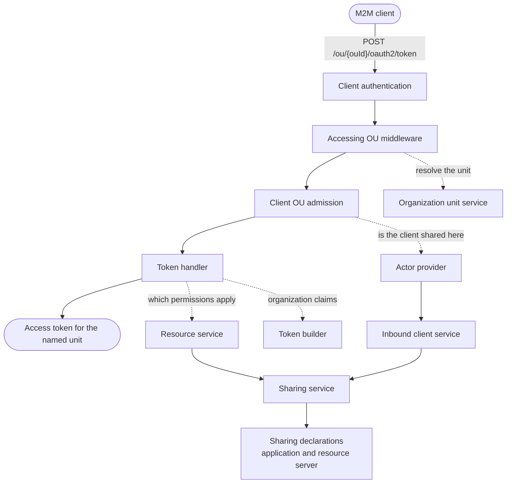

# Machine-to-Machine Access Across Organization Units Specification

- **Status:** Draft
- **Version:** 0.1
- **Related documents:** [Discussion #5461: Machine-to-Machine (M2M) service working across OUs](https://github.com/thunder-id/thunderid/discussions/5461), [Issue #4037: Allow trusted machine clients to obtain an access token scoped to a chosen Organization Unit (without a per-OU application)](https://github.com/thunder-id/thunderid/issues/4037)

## Summary

A service acting for many customer organizations needs one registration, not one per customer. Today it needs one per customer: credentials multiply, rotation fans out, and the operator keeps an application inventory that mirrors the customer list.

This feature gives one application one credential pair and an organization-unit-qualified token endpoint.

```
POST /oauth2/token                # unchanged
POST /ou/{ouId}/oauth2/token      # token scoped to the named organization unit
```

The application owner declares which organization units the credential may act for, as a policy on the resource sharing framework. Sharing an M2M application grants one thing: a named organization unit may be given as the accessing organization unit on a token request. It does not place the application in that unit's listings, and does not make it readable, editable, or deletable there.

The token is issued for the organization unit the request named: its claims carry that unit, and its scopes narrow to what the unit may reach. The resource server therefore knows which organization the service is acting for, and the token cannot carry more than that organization holds.

## Architecture

A solid arrow is the request moving to the next step. A dotted arrow is a step consulting a service for an answer.



| Component | Responsibility |
|---|---|
| Accessing OU middleware | Reads `{ouId}` from the path, resolves it through the organization unit service, and records it on the request context. A route carrying no such segment passes through untouched. Owns the refusal for an id that resolves to nothing |
| Client OU admission middleware | Asks whether the authenticated client may act for the organization unit the request named. Mounted after client authentication, so a caller that cannot authenticate never reaches it |
| Actor provider | Carries `IsOAuthClientAccessibleFromOU`, the one question the OAuth layer asks about organization units. The embeddable engine hosts no application management, so this is the seam rather than a new provider interface |
| Inbound client service | Answers that question from the sharing framework, short-circuiting on the client's own organization unit |
| Application sharing declaration | Registers applications as a sharing resource type. Declares no fields, resolves ownership, and implements nothing else |
| Resource service | Downscopes requested scopes to the target resource server's permissions, and in the same pass drops the ones the accessing organization unit may not use. Reads the accessing unit from the request context rather than taking it as a parameter |
| Sharing framework | Owns policies, targets, exclusions, and visibility. Described in its own [specification](../resource-sharing/spec.md); this feature is one consumer of it |
| Resource server sharing declaration | Registers resource servers as a sharing resource type, declaring one field, `permissions`, as a hierarchy over the server's permission strings |
| Token builder | Emits `ouId`, `ouName` and `ouHandle` for the accessing organization unit rather than the application's owner, where the application opted into those claims |

Three existing seams carry the feature, and no new ones are introduced. The token endpoint already composes middleware; the actor provider already abstracts the OAuth layer from entity management; and the sharing framework already answers visibility for any registered resource type.

## Detailed design

### The organization-unit-qualified token endpoint

`POST /ou/{ouId}/oauth2/token` is registered beside `POST /oauth2/token`, against the same handler. The bare endpoint is unchanged in every respect, which is the backwards-compatibility guarantee: a request that names no organization unit behaves exactly as it did before the prefix existed, and needs no policy.

Both routes are public paths, because the caller authenticates with its own client credentials rather than a bearer token.

The accessing organization unit sits in the path rather than in a header or a request parameter. Organization-specific branded URLs are a requirement in their own right, and a path segment is what makes organization partitioning and per-organization deployment scaling possible. Every API that needs branding follows the same convention.

The qualified route is registered only where the deployment turned it on. For the ThunderID server the setting defaults to on, because the actor provider enforces the association anyway. An engine embedder that implements no organization-unit-bound sharing leaves it off, so the route does not exist at all rather than existing and always refusing.

### Middleware ordering

The three middlewares run in a fixed order, and the order is a security property rather than a convenience:

1. **Client authentication.** A caller with no valid credential is refused `invalid_client` with `401`, whichever organization unit it named, before anything about that unit is consulted.
2. **Accessing organization unit resolution.** The id is resolved through the organization unit service and recorded on the context.
3. **Client OU admission.** The authenticated client is checked against the sharing policies for that unit.

Putting resolution behind authentication is what stops the endpoint being probed for which organization units exist. Putting admission after resolution is what lets an unknown id and an ungranted one answer identically: both are refused in step 2 or step 3 with the same status, code, and description.

An unknown id has to be refused in the middleware rather than left to the policy check. A deployment-wide `allOus` policy matches every organization unit without consulting the tree, so an id naming nothing would satisfy it, survive admission, and fail later as an internal error during claim resolution.

### Admission

`IsOAuthClientAccessibleFromOU` answers three ways:

- No accessing organization unit on the context: admitted. This is the bare endpoint.
- The client's own organization unit: admitted without consulting the framework. The framework would answer the same, but only after resolving ownership and reading the application, and this is the common path for every token an application takes in its own organization unit.
- Otherwise: `IsVisible` on the sharing framework, for the application resource type and the client's resource id.

A client whose entity category has no registered sharing resource type is usable in its own organization unit alone. It cannot be shared, so there is nothing for a policy to say about it.

The check is fused into the request path rather than offered as a separate endpoint, so there is no way to reach the token handler without passing it.

### What a sharing policy may say about an application

Applications register with the sharing framework as a resource type that **declares no fields**. A policy can only govern fields the type declares, so a policy on an application can grant visibility and nothing else. "A sharee may not edit anything" is true by construction rather than by an access check that could be missed.

The consequences are worth stating plainly:

- A policy naming an organization unit lets that unit be given as the accessing organization unit. Nothing more.
- The application does not appear in that unit's application listings, and is not readable, editable, or deletable there.
- An overlay rule on an application is refused, because there is no field for it to name.

A policy is a flat list of targets, each carrying its own scope, its own exclusions, and its own terms. These are the scopes a target may name:

| Scope | `ouId` | Reaches |
|---|---|---|
| `allOus` | omitted | Every organization unit in the deployment, including units created later. Declarative only |
| `allChildren` | omitted | Everything beneath the owning unit, at any depth, including units created later |
| `allRoots` | omitted | The root organization unit of every tree. Declarative only |
| `root` | required | The named root organization unit, and nothing below it |
| `child` | required | The named unit directly beneath the owner, and nothing below it |
| `childSubtree` | required | The named unit directly beneath the owner, and everything below it |

Three rules from the framework bear directly on how an operator writes these:

- **Targets of one policy may not overlap.** To grant one customer different reach from the rest, exclude it from the broader target and name it in a target of its own.
- **Exclusions belong to a target, not to the policy.** A target reaching into the owner's own tree may only exclude units directly beneath the owner, and an exclusion naming its own target's anchor is refused because it would leave that target reaching nothing.
- **Deployment-wide reach is declarative only.** `allOus` and `allRoots` cannot be set through an API, because a reach not bounded by the issuer's own position in the tree is a deployment decision rather than a request.

Reaching outside the owner's own tree, by `allOus`, `allRoots`, or a `root` target naming another tree, is additionally gated on `resource_sharing.allow_child_ou_cross_tree_sharing` when the owner sits below a root.

### Declaring policies in a resource file

An application's resource file declares its own policies, in the `applications` directory alongside the application itself:

```yaml title="applications/billing-service.yaml"
resource_type: application
id: billing-service
name: Billing Service
ouId: acme-root
type: m2m
sharingPolicies:
  - id: billing-service-customers
    targets:
      - scope: allChildren
        excludedOuIds:
          - acme-trial-customers
```

A declaration carries its own id, so a reshare beneath it points at the same policy on every restart. Declared policies are held in memory for the life of the process and never written to the database: the file is their source of truth, and persisting them would strand rows when the file changes and duplicate them on the next start. Re-applying a file replaces what it declared, keyed on the resource and the initiating organization unit, so replaying every file on every start is idempotent.

A declaration the framework refuses is fatal at startup, naming the application, the policy index and the organization unit, because a silent skip leaves an operator with a service that cannot act for anyone and no indication why.

### Claims naming the accessing organization unit

Where an application opted into the organization claims, the token names the organization unit it was issued for rather than the application's owner.

The claims are resolved apart from the subject attributes and handed to the token builder in a field of their own, so the accessing unit takes precedence without the two sources racing. A request with no accessing organization unit falls back to the application's own, unchanged, which is what keeps the other grant types working: only the client credentials grant carries an accessing organization unit today.

The claims stay gated by the application's own `clientConfig.attributes` allow-list. An application that did not ask for `ouId`, `ouName` or `ouHandle` gets a token without them, qualified endpoint or not.

An application with no organization unit of its own still answers for one a request named, which is why the guard checks the application and the accessing unit separately rather than together.

### Scopes available to the accessing organization unit

A token issued for an organization unit must not carry permissions that unit may not use. The accessing unit travels on the request context, so the resource service reads it while downscoping rather than taking it as a parameter:

1. Requested scopes are downscoped to the permissions the target resource server defines.
2. In the same pass, a permission the accessing organization unit may not use is treated as undefined and dropped.
3. The application's own entitlement is evaluated afterwards, unchanged.

What the accessing unit may use comes from the resource server's own sharing policy. A resource server declares one field, `permissions`, as a hierarchy over its permission strings, so naming a resource shares it together with everything beneath it. The field is pinned: the sharing organization unit decides what is shared, and a reached unit has nothing of its own to choose.

Three cases decide a permission:

- The accessing unit owns the resource server. Every permission is available.
- The resource server carries no sharing policy at all. Every permission is available, as before sharing existed. This is temporary, until resource servers can be shared through the API and the Console.
- Otherwise the permission is available only where the unit's resolved rule grants it, and a unit the server never reached gets none.

The accessing organization unit can only narrow, never widen. Entitlement is still evaluated against the application's own identity afterwards, so a permission the application does not hold stays out whichever organization unit is named.

The same bound applies to role creation, so a permission an organization unit may not use cannot be put on a role there either. A reshare is bounded the same way: the framework validates the permissions a policy names as the initiating organization unit, which refuses one its own sharer withheld.

### Refusals

Every refusal on this path is in the vocabulary of the OAuth 2.0 token endpoint.

| Condition | Status | `error` | `error_description` |
|---|---|---|---|
| Client credentials are wrong or missing | 401 | `invalid_client` | the client authentication failure |
| Organization unit id resolves to nothing | 400 | `unauthorized_client` | `Client is not authorized for the requested organization unit` |
| Client is not shared to the organization unit | 400 | `unauthorized_client` | `Client is not authorized for the requested organization unit` |
| Organization unit lookup failed | 500 | `server_error` | `Failed to resolve the organization unit` |
| Sharing lookup failed | 500 | `server_error` | `Failed to resolve the organization unit access` |

The second and third rows are byte-identical on purpose, naming no organization unit at all. An authenticated client that could tell "does not exist" from "you may not act for it" could enumerate the deployment's organization units one request at a time.

The first row is deliberately distinct from the other two. Client authentication is not bypassed or weakened by the organization unit logic, and a caller needs to be able to tell a bad secret from an ungranted organization unit.

### Data model

No new tables. The feature stores nothing of its own: the accessing organization unit lives on the request context for the life of one request, and the grant is a sharing policy in the framework's existing tables.

The sharing framework's own schema is specified in [the resource sharing specification](../resource-sharing/spec.md). PR #5704 changes it as follows, and applications inherit those changes rather than introducing any:

| Table | Change |
|---|---|
| `RESOURCE_SHARING_POLICY_TARGET` | `TARGET_SCOPE` check values renamed to `allOus`, `allRoots`, `root`, `allChildren`, `child`, `childSubtree` |
| `RESOURCE_SHARING_POLICY_TARGET_EXCLUSIONS` | Renamed from `RESOURCE_SHARING_POLICY_EXCLUSION`, gains `TARGET_ID` in its primary key and a composite foreign key to the target |
| `RESOURCE_SHARING_POLICY_OVERLAY_RULE` | `TARGET_ID` becomes `NOT NULL`; the policy-wide partial unique index is dropped |

Applications declare no fields, so an application never writes a row to `RESOURCE_SHARING_POLICY_OVERLAY_RULE` or `RESOURCE_OVERLAY_VALUE`.

### API

The token endpoint is specified above. The management API below is **to be added**; policies are declarative-only until it lands.

All six operations are mounted under the application they govern, because a sharing policy has no life of its own: it is one organization unit's decision about one application.

| Method | Path | Purpose |
|---|---|---|
| `POST` | `/applications/{id}/sharing-policies` | Record a sharing policy |
| `GET` | `/applications/{id}/sharing-policies` | List an application's sharing policies |
| `GET` | `/applications/{id}/sharing-policies/{policyId}` | Get one sharing policy |
| `PUT` | `/applications/{id}/sharing-policies/{policyId}` | Replace a sharing policy |
| `DELETE` | `/applications/{id}/sharing-policies/{policyId}` | Delete a sharing policy |
| `GET` | `/applications/{id}/overlay-rules` | Resolve what an organization unit may do with the application |

**Request model.** A policy request carries `initiatingOuId`, `targets` and, on an edit, `version`. There is no policy-level rule list and no policy-wide exclusion list; a target and its terms travel together.

```json
{
  "initiatingOuId": "acme-root",
  "targets": [
    { "scope": "allChildren", "excludedOuIds": ["acme-customer-a"] }
  ]
}
```

A target is one of four shapes, expressed as an `anyOf` with `additionalProperties: false` on each branch so a misspelled field is caught rather than ignored:

| Branch | `scope` | `ouId` |
|---|---|---|
| `TargetRoot` | `root` | required |
| `TargetAllChildren` | `allChildren` | must be absent |
| `TargetChild` | `child` | required |
| `TargetChildSubtree` | `childSubtree` | required |

`allOus` and `allRoots` have no API branch at all. They are declarative only, and a schema that cannot express them is a better refusal than a runtime one.

**Authorization.** The operations are management APIs, authorized the way the rest of the application API is. A policy may only be issued by an organization unit that may act on the application: its owner, or a sharee the resource already reached and stopped at. The framework enforces the second condition; the API layer does not re-derive it.

**Validation and errors.** Validation is the framework's, surfaced unchanged, so the API and a resource file refuse the same request for the same reason.

| Status | Code | Condition |
|---|---|---|
| 400 | `SHR-1001` | Malformed request, no target, or a target whose scope and organization unit disagree |
| 400 | `SHR-1004` | A target that is not a direct child, names a unit twice, or is owner-only |
| 400 | `SHR-1006` | Reach outside the initiator's own tree, with cross-tree sharing off |
| 400 | `SHR-1016` | `allOus` or `allRoots` requested through the API |
| 400 | `SHR-1017` | An edit reaching past an organization unit that has already shared the application on |
| 400 | `SHR-1018` | An exclusion no target of its own reaches |
| 400 | `SHR-1028` | Two targets reaching the same organization unit |
| 400 | `SHR-1029` | An exclusion naming its own target's anchor |
| 400 | `SHR-1030` | An exclusion that is not a direct child of the initiator |
| 403 | `SHR-1005` | A reshare from an organization unit the application never reached |
| 404 | `APP-1001` | No such application |
| 404 | `SHR-1003` | No such policy |
| 409 | `SHR-1013` | The organization unit already holds a policy for this application |
| 409 | `SHR-1015` | The policy moved since it was read |

A declared policy is visible through `GET` and refused by `PUT` and `DELETE` with `SHR-1007`, because its existence belongs to the file that declares it.

### UI

TODO. No Console support is specified yet. Until it exists, policies are written in a resource file or, once the management API lands, through that API.

### Configuration

| Key | Level | Default | Effect |
|---|---|---|---|
| `server.enable_ou_qualified_endpoints` | Deployment | `true` on the ThunderID server; `false` for an engine embedder | Registers `POST /ou/{ouId}/oauth2/token`. When off, the route does not exist and the bare endpoint is unaffected |
| `resource_sharing.allow_child_ou_cross_tree_sharing` | Deployment | `false` | Lets an application owned below a root reach outside its own tree, which `allOus`, `allRoots` and a foreign `root` target all require |

The qualified-endpoint setting is a server setting rather than an OAuth setting, and is resolved once at configuration load. The route either exists for the process or it does not; deciding per request would mean a config read on the token path for an answer that cannot change.

An application opts into the organization claims per application, not per deployment:

```yaml
inboundAuthConfig:
  - type: oauth2
    config:
      token:
        accessToken:
          clientConfig:
            attributes: [ ouId, ouName, ouHandle ]
```

## Requirements

### R1. One registration serves many organization units

**Requirement:** A single application with a single credential pair can obtain tokens bound to any organization unit its owner has granted it, without an application being registered in those units.

**Acceptance criteria:**

- **AC1.1:** Given an application owned by A with a policy reaching B, when the client requests a token at `/ou/B/oauth2/token` with its own credentials, then a token is issued.
- **AC1.2:** Given the same application, when the client requests a token at `/oauth2/token`, then a token is issued with no policy consulted.
- **AC1.3:** Given an application with no policy at all, when its owner requests a token at `/ou/{owner}/oauth2/token`, then a token is issued, because an organization unit needs no policy to act for itself.
- **AC1.4:** Given a deployment where `server.enable_ou_qualified_endpoints` is off, when any client requests `/ou/{ouId}/oauth2/token`, then the route is not registered and the bare endpoint still works.

### R2. The grant is visibility only

**Requirement:** Sharing an application permits it to be named as the accessing organization unit and nothing else. The application stays invisible inside the organization units it is shared to.

**Acceptance criteria:**

- **AC2.1:** Given an application shared to B, when a delegated administrator in B lists applications, then the application is absent.
- **AC2.2:** Given an application shared to B, when a delegated administrator in B attempts to read, edit, or delete it, then the attempt is refused.
- **AC2.3:** Given a policy on an application that names any overlay rule, when it is created, then the request is refused, because the application resource type declares no fields.

### R3. The owner controls which organization units are reached

**Requirement:** The owner states reach as a sharing policy, in the same target vocabulary every resource type uses.

**Acceptance criteria:**

- **AC3.1:** Given a policy with an `allChildren` target, when any unit beneath the owner requests a token for itself, then a token is issued, including for units created after the policy was written.
- **AC3.2:** Given that policy with `excludedOuIds` naming one direct child, when that child requests a token, then the request is refused, and so is every request from beneath it.
- **AC3.3:** Given a policy naming children individually with `child` targets, when a sibling no target names requests a token, then the request is refused.
- **AC3.4:** Given a policy with a `child` target naming B, when a unit beneath B requests a token, then the request is refused, because a `child` target stops at the unit it names.
- **AC3.5:** Given a policy with a broad target and a narrower target the broad one already reaches, when it is written, then the request is refused as overlapping targets.
- **AC3.6:** Given a resource file declaring `allOus` or `allRoots`, when it is loaded, then the policy is created; and when either is requested through the management API, then the request is refused.

### R4. An organization unit the client may not act for is indistinguishable from one that does not exist

**Requirement:** The endpoint cannot be used to discover which organization units a deployment contains.

**Acceptance criteria:**

- **AC4.1:** Given an authenticated client, when it names an organization unit that does not exist and one it was not granted, then the two responses are identical in status, `error` and `error_description`, and name no organization unit.
- **AC4.2:** Given a caller with an invalid client secret, when it names an organization unit that exists and one that does not, then both responses are `401 invalid_client` and identical, because the unit is resolved behind client authentication.
- **AC4.3:** Given a caller with an invalid client secret, when it names an organization unit the client would have been granted, then the response is `401 invalid_client` and not `400 unauthorized_client`, so client authentication stays distinguishable from an organization unit refusal.

### R5. The token states which organization unit it was issued for

**Requirement:** A resource server receiving the token can tell which organization the service is acting for, without inferring it from the client id.

**Acceptance criteria:**

- **AC5.1:** Given an application that opted into the organization claims, when it requests a token at `/ou/B/oauth2/token`, then `ouId`, `ouName` and `ouHandle` name B rather than the application's owner.
- **AC5.2:** Given the same application, when it requests a token at `/oauth2/token`, then those claims name the application's own organization unit.
- **AC5.3:** Given an application that did not opt into the organization claims, when it requests a token at `/ou/B/oauth2/token`, then the token carries none of them.
- **AC5.4:** Given a grant other than client credentials, when the organization claims are requested, then the subject's organization unit is returned and the grant is unaffected.

### R6. A token carries no more than the accessing organization unit may reach

**Requirement:** The scopes on a token issued for an organization unit are bounded by what that organization unit may use on the target resource server, as well as by the application's own entitlement.

**Acceptance criteria:**

- **AC6.1:** Given a resource server the accessing organization unit reaches in part, when a token is requested for that unit naming a permission outside that part, then the permission is absent from the issued token.
- **AC6.2:** Given a resource server carrying at least one sharing policy and an accessing organization unit it never reached, when a token is requested for that unit, then the token carries none of that resource server's permissions.
- **AC6.3:** Given a resource server carrying no sharing policy at all, when a token is requested for any organization unit, then every permission the application is entitled to is carried, as before sharing existed.
- **AC6.4:** Given the resource server's own owner as the accessing organization unit, when a token is requested, then every permission the application is entitled to is carried.
- **AC6.5:** Given a permission the application is not entitled to, when any organization unit is named, then the permission is absent, so the accessing unit never widens.
- **AC6.6:** Given a permission an organization unit may not use, when a role is created in that unit naming it, then the request is refused, so the bound is not specific to tokens.
- **AC6.7:** Given a request to the bare endpoint, when a token is issued, then the scopes are unchanged from before this feature.

### R7. The deployment decides whether the qualified endpoint exists

**Requirement:** An engine embedder that has no organization-unit-bound sharing does not serve the route at all.

**Acceptance criteria:**

- **AC7.1:** Given an embedder that sets nothing, when the server starts, then the qualified route is not registered, because the setting defaults off outside the ThunderID server.
- **AC7.2:** Given the ThunderID server, when it starts, then the route is registered without the operator configuring anything, and the actor provider enforces the organization unit association.
- **AC7.3:** Given the route registered but no organization unit resolver wired, when a request names an organization unit, then the request fails closed with a server error rather than reaching a policy check.

## Change log

| Version | Date | Change |
|---|---|---|
| 0.1 | 2026-10-09 | Initial specification. |
