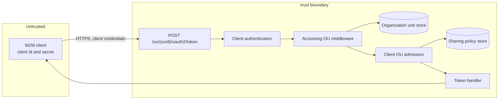
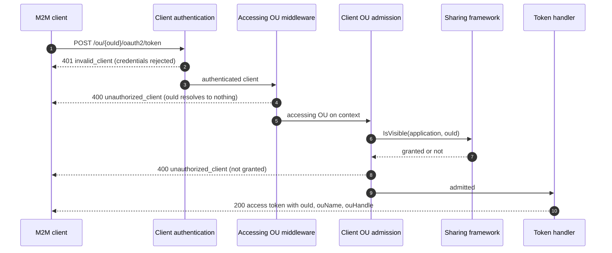
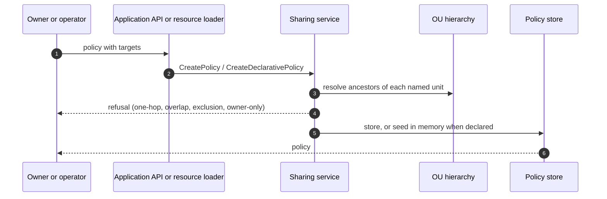
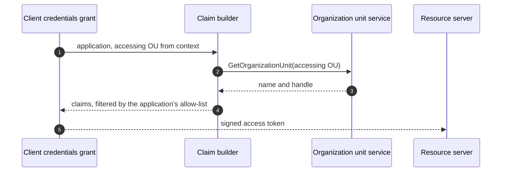

# Machine-to-Machine Access Across Organization Units Threat Model

This model covers the organization-unit-qualified token endpoint `POST /ou/{ouId}/oauth2/token`, the admission decision behind it, the sharing policies that grant it, and the organization claims the issued token carries.

## Overview

One M2M application holds one credential pair and obtains tokens bound to any organization unit its owner has granted it. The entry point is the qualified token endpoint; the security-relevant behaviour is the ordering of client authentication, organization unit resolution and sharing admission, and the deliberate indistinguishability of the refusals those last two produce.

The asset being protected is the boundary between customer organizations. A client that could name an organization unit it was not granted would act on that organization's data under a token the resource server trusts.

Cross-cutting concerns covered elsewhere: client authentication (`client_secret_basic`, `client_secret_post`, `private_key_jwt`), token signing and key management, the authorization evaluation that decides which scopes a token carries, and the resource sharing framework's own policy algebra. These are trust inputs here, not re-analysed.

## Scope

This model covers:
- `POST /ou/{ouId}/oauth2/token`, and how it differs from `POST /oauth2/token`
- Resolution of the accessing organization unit and its placement on the request context
- The admission decision: whether an authenticated client may act for the named organization unit
- Sharing policies written against applications, declaratively and through the management API to be added
- The organization claims (`ouId`, `ouName`, `ouHandle`) emitted for the accessing organization unit
- The `server.enable_ou_qualified_endpoints` and `resource_sharing.allow_child_ou_cross_tree_sharing` settings

Out of scope (see the referenced companion models):
- Client authentication mechanisms and credential storage, which the OAuth client authentication model owns
- Token format, signing, lifetime and revocation, which the token service model owns
- Scope and permission evaluation, which the authorization model owns
- The general correctness of the sharing framework's visibility algebra, which the [resource sharing specification](../resource-sharing/spec.md) owns
- Organization unit creation, movement and deletion

## Architecture

### Components

The request passes through three gates before it reaches the token handler, and each refuses in the token endpoint's own vocabulary.

| Component | Task |
| --- | --- |
| Accessing OU middleware | Reads `{ouId}` from the path and resolves it through the organization unit service. Refuses an id that resolves to nothing, in wording identical to the admission refusal. Fails closed with a server error where no resolver is wired, so an unknown id cannot reach a deployment-wide policy |
| Client authentication | Authenticates the client before anything about the organization unit is consulted. Owned by the companion model; its position in the chain is this model's concern |
| Client OU admission | Asks the actor provider whether the authenticated client may act for the resolved organization unit. Refuses with `unauthorized_client`, logging the client id masked |
| Inbound client service | Short-circuits the client's own organization unit, then asks the sharing framework. Returns false for a client whose entity category has no registered sharing resource type |
| Sharing framework | Answers `IsVisible` from the policies on the application. Policies are the only grant; there is no implicit trust between organization units |
| Application sharing declaration | Declares no fields, which makes "a sharee may not edit anything" a property of the type rather than of an access check |
| Token builder | Emits the organization claims for the accessing unit, gated by the application's own attribute allow-list |

### Actors

#### Actors

| Actor | Description | Roles or permissions |
| --- | --- | --- |
| M2M client | The shared application, authenticating with its own client credentials | Whatever the authorization layer grants its application identity |
| Application owner | The organization unit that owns the application and writes its sharing policies | Management API access to the application it owns |
| Sharee administrator | A delegated administrator in an organization unit the application is shared to | Management access within their own organization unit only |
| Deployment operator | Writes resource files and deployment configuration | Full control of declarative resources and settings |
| Resource server | Receives and validates the issued token | Relies on the organization claims to decide which organization's data to serve |

#### Entitlement matrix

| Actor | Obtain a token for an OU | Write a policy on the application | See the application in listings | Edit or delete the application |
| --- | --- | --- | --- | --- |
| M2M client | [Yes] where a policy grants it | [No] | [No] | [No] |
| Application owner | [Yes] for its own OU | [Yes] | [Yes] | [Yes] |
| Sharee administrator | [No] | [No] | [No] | [No] |
| Deployment operator | [No] | [Yes] via resource files | [Yes] | [Yes] |

### External Dependencies (not owned)

| Dependency | Description (usage, purpose, authentication, authorization, security) |
| --- | --- |
| Organization unit service | Resolves `{ouId}` and supplies the name and handle for the claims. A lookup failure is a server error here, never a refusal |
| Resource sharing framework | Answers visibility. Its policy algebra and storage are specified and threat-modelled with the framework |
| Client authentication | Establishes the client identity every later check depends on. Owned by the OAuth client authentication model |
| Authorization service | Decides which scopes the token carries. Resolved from the application's own identity, unchanged by this feature |

## Threats and mitigations

### Out-of-scope interactions and risks

- Theft or leakage of the client secret, which the client authentication model owns. Its impact is amplified here, and that amplification is recorded as a residual risk below
- Token replay and token lifetime, which the token service model owns
- Privilege escalation through the authorization policies attached to the application identity, which the authorization model owns
- Correctness of chain evaluation and exclusion handling inside the sharing framework, which the resource sharing model owns

### Interactions

#### 01: Obtaining a token for a named organization unit

**Description**

A client posts a client credentials grant to `/ou/{ouId}/oauth2/token`. The client is authenticated, the organization unit is resolved, the client is admitted to that unit from the sharing policies, and a token is issued carrying the unit in its claims.

**Assets involved**

| Initiator | Intermediate | Target |
| --- | --- | --- |
| M2M client credentials | Accessing OU on the request context; sharing policies | Access token bound to the named organization unit |

**Data flow**

**Security considerations**

| Area | Response | Comments |
| --- | --- | --- |
| Data confidentiality | [C-High] | The token authorizes action on another organization's data |
| Communication medium | [M-NT] | |
| Transport security | [TLS] | The endpoint carries client credentials and must not be served without it |
| Authentication | `client_secret_basic`, `client_secret_post` or `private_key_jwt` | Unchanged from the bare endpoint |
| Accessibility | [Public] | Registered as a public path; the caller authenticates with client credentials rather than a bearer token |
| Authorization and Access Control | Sharing policy on the application, checked per request after authentication | No implicit trust between organization units; the owner's own unit short-circuits |

**Threat assessment**

| ID | Category | Threat | Materializable | Mitigation / comment |
| --- | --- | --- | --- | --- |
| 1 | [Elevation of Privilege] | A client names an organization unit it was never granted and obtains a token that a resource server accepts as authority over that organization's data. Every customer served by the deployment would be reachable from one stolen or misconfigured credential | [No] | Admission runs on every request, before the handler, and consults the sharing policies rather than anything the caller supplies. The client's own organization unit is the only case that short-circuits. A client whose entity category has no registered sharing resource type is refused outright |
| 2 | [Information Disclosure] | An authenticated client walks organization unit ids and learns which exist, from a difference between "no such unit" and "not granted". The customer list of the deployment is commercially sensitive and is a target list for later attacks | [No] | Both refusals are produced with the same status, `error` and `error_description`, name no organization unit, and are pinned by an integration test that compares the two responses field by field |
| 3 | [Information Disclosure] | An unauthenticated caller probes organization unit ids, learning which exist from the endpoint's behaviour before it authenticates | [No] | The organization unit is resolved behind client authentication. A caller with no valid credential receives `401 invalid_client` whichever unit it names, and the two responses are identical. Pinned by test |
| 4 | [Spoofing] | A caller supplies the accessing organization unit itself, through a header or a request parameter the handler trusts, and bypasses the path check | [No] | The accessing unit is read only from the path parameter, by the middleware, and written to the request context. No handler reads it from the request body or headers |
| 5 | [Elevation of Privilege] | An id that resolves to nothing satisfies a deployment-wide `allOus` policy, survives admission, and produces a token naming an organization unit that does not exist | [No] | Resolution happens in the middleware, before any policy is consulted, precisely because a blanket policy matches without consulting the tree. With no resolver wired the request fails closed with a server error |
| 6 | [Tampering] | A delegated administrator inside a sharee organization edits or deletes the shared application, affecting every other organization it serves | [No] | The application sharing declaration declares no fields, so a policy can grant visibility and nothing else. There is no code path from a sharing policy to an application write |
| 7 | [Elevation of Privilege] | A sharee organization re-shares the application onward to organizations the owner never intended | [No] | Resharing is the sharing framework's frontier rule: only an organization unit a policy named and stopped at may issue a policy of its own, and never wider than it holds. An organization reached by a cascading target holds nothing to pass on |
| 8 | [Repudiation] | A token is issued for an organization unit with no record of which unit it was for, so a later investigation cannot attribute the action | [No] | The accessing organization unit is stamped on the token issue event, and the issued token itself carries `ouId` where the application opted into the claims |
| 9 | [Information Disclosure] | The client id appears in logs on the refusal path, linking a credential to the organizations it was probing | [No] | The client id is masked in both the refusal and the failure log lines; the organization unit id is logged unmasked, which is a deployment-internal identifier rather than a secret |
| 10 | [Denial of Service] | A caller drives repeated requests at the qualified endpoint, forcing an organization unit lookup and a sharing lookup per request | [Yes] | No rate limiting is applied by the project at this endpoint, as for the bare token endpoint. Both lookups sit behind client authentication, so an unauthenticated caller pays only the authentication cost. Deployments are expected to rate limit the token endpoint at the ingress; recorded as a residual risk |
| 11 | [Operational Risk] | A deployment turns the qualified endpoint on with no organization unit resolver wired, and requests fail in a way that looks like a policy problem | [No] | The middleware fails closed with `server_error` and a distinct description, rather than refusing as if the caller were at fault |
| 12 | [Lateral Movement] | A compromised credential for an application shared with `allOus` reaches every organization in the deployment, present and future | [Yes] | `allOus` and `allRoots` cannot be set through the API at all; they are declarative only, so granting them requires a reviewed change to a resource file. Reaching outside the owner's tree additionally requires `allow_child_ou_cross_tree_sharing`. The blast radius of a stolen credential remains proportional to the reach granted, and is recorded as a residual risk |

#### 02: Writing a sharing policy on an application

**Description**

An organization unit records which organization units an application may act for, either in the application's resource file at startup or, once the management API lands, through that API. The framework validates the targets, the exclusions and the issuer's standing before storing anything.

**Assets involved**

| Initiator | Intermediate | Target |
| --- | --- | --- |
| Application owner or deployment operator | Policy request; organization unit hierarchy | Sharing policy rows, or in-memory declared policies |

**Data flow**

**Security considerations**

| Area | Response | Comments |
| --- | --- | --- |
| Data confidentiality | [C-Medium] | A policy reveals which organizations an application serves |
| Communication medium | [M-DB] / [M-FS] | Stored policies in the configuration database; declared policies read from the file system at startup |
| Transport security | [TLS] | For the management API; a resource file is read locally |
| Authentication | Management API authentication, or file system trust for a resource file | |
| Accessibility | [Restricted] | Management API, scoped to the application's own organization unit |
| Authorization and Access Control | Owner or a frontier sharee; owner-only for root and deployment-wide scopes | Enforced in the framework, not re-derived by the API layer |

**Threat assessment**

| ID | Category | Threat | Materializable | Mitigation / comment |
| --- | --- | --- | --- | --- |
| 13 | [Elevation of Privilege] | An organization unit writes a policy naming a unit deeper than its own child, granting reach over the intervening unit's head | [No] | The one-hop rule: a target may only name a direct child of the issuer, and a deeper name is refused. Reaching further requires a subtree target, which cascades on the issuer's own terms, or a policy issued by the named unit itself |
| 14 | [Elevation of Privilege] | An organization unit inside another policy's reach writes a policy of its own, producing a second policy over units it does not control | [No] | Only a frontier organization unit may issue a policy. One organization unit holds at most one policy per application, and the targets of one policy may not overlap, so exactly one target covers any unit |
| 15 | [Elevation of Privilege] | An organization unit reaches outside its own tree, handing an application to an unrelated customer's organization | [No] | Cross-tree reach lands on another tree's root and nothing beneath it, and is gated on `allow_child_ou_cross_tree_sharing` for any owner that sits below a root. The receiving root decides its own interior |
| 16 | [Tampering] | An edit widens a deployment-wide policy, extending an application's reach across the deployment in one step | [No] | A blanket policy's targets cannot change and its rules cannot widen. A unit may still be carved out and named in a target of its own, which names the unit it affects rather than loosening the whole family, and is still bounded by what the issuer holds |
| 17 | [Tampering] | A policy carries an exclusion that silently does nothing, so an operator believes an organization unit was withheld when it was not | [No] | An exclusion its own target does not reach is refused; so is one naming the target's own anchor, which would leave the target reaching nothing; so is one deeper than a direct child of the issuer |
| 18 | [Repudiation] | A policy is added or widened with no record of who did it | [Partial] | A declared policy is in version control, which carries the author and the review. The management API is to be added; its audit coverage is tracked as a residual risk below |
| 19 | [Operational Risk] | A resource file declaring an invalid policy is skipped at startup, leaving a service that silently cannot act for anyone | [No] | A refused declaration is fatal at startup and names the application, the policy index and the organization unit |
| 20 | [Tampering] | A declared policy and a stored policy disagree about the same organization unit, and the effective grant depends on read order | [No] | A declaration is refused where a stored policy already governs the same application and initiating unit, and the reverse. Declared policies are never written to the database |

#### 03: Emitting the accessing organization unit in the token

**Description**

Where the application opted into the organization claims, the issued token names the accessing organization unit rather than the application's owner. A resource server uses the claim to decide which organization's data to serve.

**Assets involved**

| Initiator | Intermediate | Target |
| --- | --- | --- |
| Token handler | Organization unit service | `ouId`, `ouName`, `ouHandle` in the access token |

**Data flow**

**Security considerations**

| Area | Response | Comments |
| --- | --- | --- |
| Data confidentiality | [C-Medium] | The claims name an organization, not personal data |
| Communication medium | [M-NT] | |
| Transport security | [TLS] | |
| Authentication | N/A, internal to issuance | |
| Accessibility | [Restricted] | Only in tokens the client already authenticated for |
| Authorization and Access Control | The application's own `clientConfig.attributes` allow-list | An application that did not ask gets no organization claims |

**Threat assessment**

| ID | Category | Threat | Materializable | Mitigation / comment |
| --- | --- | --- | --- | --- |
| 21 | [Spoofing] | The token names the application's owner while the request was for another organization, and a resource server serves the wrong organization's data | [No] | The accessing unit takes precedence over the owner, is resolved apart from the subject attributes, and is handed to the builder in a field of its own so the two sources cannot race. Pinned by an integration test that decodes the token |
| 22 | [Information Disclosure] | An application that never asked for the organization claims receives them anyway, leaking organization names and handles to a client that had no need for them | [No] | The claims stay gated by the application's own attribute allow-list, qualified endpoint or not |
| 23 | [Tampering] | Another grant type begins emitting the accessing organization unit, changing the meaning of the claim for existing integrations | [No] | Only the client credentials grant carries an accessing organization unit. With none on the context, the claims fall back to the subject's organization unit unchanged |

## Security Review Checklist

A review aid that complements the threat models and the self-assessment. Guidance follows the [OWASP Top 10 Proactive Controls](https://top10proactive.owasp.org/).

### Security considerations

| # | Consideration | State | Comments |
| --- | --- | --- | --- |
| 1 | Are all inputs and outputs validated (syntactic and semantic)? | [Yes] | The organization unit id is resolved against the store rather than parsed; policy targets, exclusions and scopes are validated in the framework, and the API schema refuses unknown fields per target branch |
| 2 | Are rate limits in place where necessary? | [No] | Not applied by the project at the token endpoint, qualified or bare. Expected at the ingress; see residual risks |
| 3 | Are permissions, roles, and entitlements defined on the principle of least privilege and business need? | [Yes] | Sharing an application grants visibility alone. Deployment-wide reach is declarative only, and cross-tree reach is gated |
| 4 | Are authentication and authorization validated at both the UI and API layers, front end and back end, before granting access to resources? | [Partial] | Enforced in the request path at the API layer. No UI exists yet; the Console section of the specification is TODO |
| 5 | Are proper isolations in place between components to ensure least-privilege access and reduce the blast radius against lateral movement? | [Yes] | The OAuth layer asks one question through the actor provider and hosts no application management. The engine seam carries no sharing knowledge |
| 6 | Have any default credentials been changed, and are default superuser or root accounts not in use (when using third-party components)? | [N/A] | The feature introduces no credentials of its own |
| 7 | Has the implementation followed best-practice guidelines (OWASP, Kubernetes, vendor, or technology provider)? | [Yes] | Refusals use the RFC 6749 token endpoint error vocabulary, and indistinguishable refusals follow the usual enumeration guidance |
| 8 | Are secrets, credentials, and internal-only material kept out of the public source tree and its git history? | [Yes] | Test fixtures carry sample secrets scoped to the integration harness only |
| 9 | Was a security-focused code review conducted for this change, and have the findings been addressed? | [Yes] | Reviewed on PR #5627 and PR #5704; findings on refusal indistinguishability, middleware ordering and exclusion validation were fixed |
| 10 | Is Static Analysis (SAST) or IaC scanning conducted, and are findings addressed? | [Yes] | Repository-wide CI |
| 11 | Is Software Composition Analysis (SCA) conducted or integrated into the repository, and are findings addressed (for example FOSSA, Trivy)? | [Yes] | Repository-wide CI; the feature adds no dependencies |
| 12 | Is Dynamic (DAST) or API scanning conducted on a non-production setup, and are findings addressed? | [N/A] | Not run for this feature; the integration suite covers the refusal matrix |
| 13 | Are audit logs generated in a standardized format for critical functionality, and available to authorized users to trace critical events and aid incident response? Note the retention period in Comments. | [Partial] | Token issue events carry the accessing organization unit. Policy changes through the management API are not yet audited; retention is the deployer's |
| 14 | Do audit logs for critical configuration changes record the difference between the old and new versions? | [No] | Declared policies are diffed by version control. The management API, once added, should record the before and after of a policy edit |
| 15 | Are data in transit and at rest encrypted? | [Partial] | TLS is the deployer's to terminate. Policies are stored unencrypted in the configuration database, as the rest of the configuration is |
| 16 | Are sensitive values such as credentials and keys stored in a secret store or vault? | [N/A] | The feature stores no secrets |
| 17 | Is personal, sensitive, or confidential data kept out of logs? | [Yes] | Client ids are masked on both refusal and failure paths; no personal data is involved |
| 18 | Have users been given clear instructions for secure usage? | [Yes] | [Machine-to-machine access guide](../../../docs/content/guides/organization-units/machine-to-machine-access.mdx) |

### Business impact and resilience

For an open-source component, most of these are shared with the operator who deploys it. Capture the project's defaults and recommendations here, and note what is left to the deployer.

| # | Consideration | State | Comments |
| --- | --- | --- | --- |
| 1 | Has a business impact analysis been done to identify resilience requirements (maximum tolerable downtime, uptime, RPO, RTO)? | [N/A] | The feature inherits the token endpoint's availability profile and adds no state of its own |

Resilience details to record:
- High availability requirements: as for the token endpoint. The feature is stateless per request
- Disaster recovery requirements: stored policies are configuration database rows and are covered by its backup; declared policies are reconstructed from resource files on every start
- Backups, frequency, and retention: configuration database backup covers `RESOURCE_SHARING_POLICY` and its child tables. Declared policies need no backup
- Health checks: none specific to this feature
- User banners: not applicable

### Dependency and component health

| # | Consideration | State | Comments |
| --- | --- | --- | --- |
| 1 | Are dependencies, base images, and runtimes monitored for known vulnerabilities and kept current (for example automated dependency scanning), and are findings addressed? | [Yes] | Repository-wide |
| 2 | Are any End-of-Life or End-of-Service components in use? | [No] | |
| 3 | Is hardening guidance published for operators who deploy the project (optional)? | [Partial] | The guide covers configuration; rate limiting guidance for the token endpoint is not yet published |

### Privacy considerations

Fill this in only if the change processes personal data.

Not applicable. The feature processes organization unit identifiers, names and handles, and an application identity. No personal data is collected, stored or emitted.

## Residual risks (open items)

- No project-level rate limiting on the token endpoint, qualified or bare. A deployment is expected to rate limit at the ingress, and both the organization unit lookup and the sharing lookup sit behind client authentication so an unauthenticated caller pays only the authentication cost (threat 10)
- The blast radius of a stolen client credential is proportional to the reach the owner granted. An `allOus` grant makes one credential reach every organization in the deployment. Mitigated by making deployment-wide scopes declarative only, so granting one is a reviewed change rather than an API call, but the exposure remains and is the owner's to bound (threat 12)
- Policy changes through the management API are not yet audited, and no before-and-after diff is recorded for an edit. Declared policies are covered by version control in the meantime (threat 18)
- No Console support exists, so the only reviewed path to a policy today is a resource file. The specification's UI section is TODO

## Appendix

- Sample requests and configurations: see the [specification](spec.md), and the integration fixtures under `tests/integration/resources/declarative_resources/applications/m2m-*.yaml`
- References: [RFC 6749 section 5.2](https://www.rfc-editor.org/rfc/rfc6749#section-5.2) for the token endpoint error vocabulary; [Resource sharing across OUs](../resource-sharing/spec.md) for the policy algebra this feature consumes

## Change log

| Version | Date | Change |
|---|---|---|
| 0.1 | 2026-10-09 | Initial threat model. |
