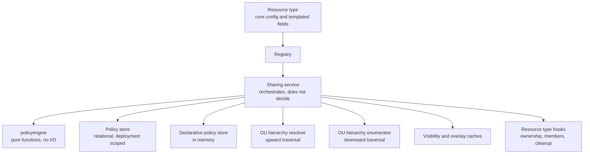
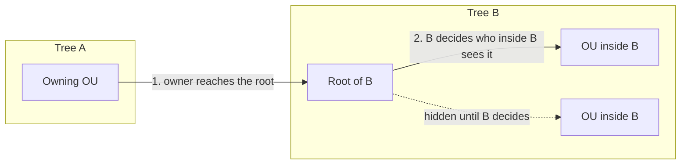
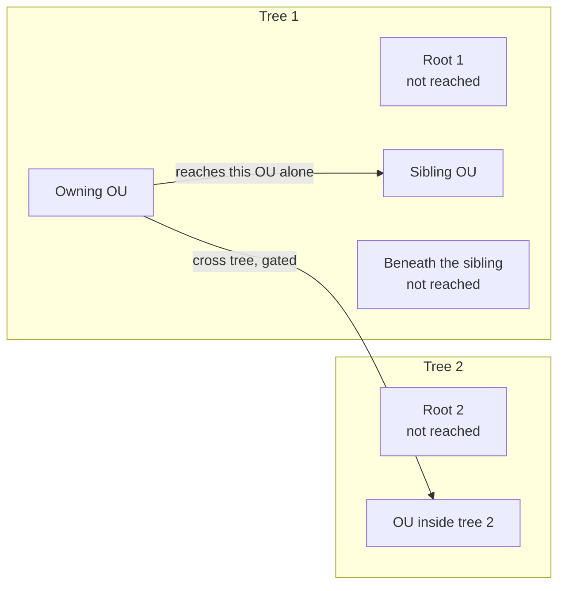
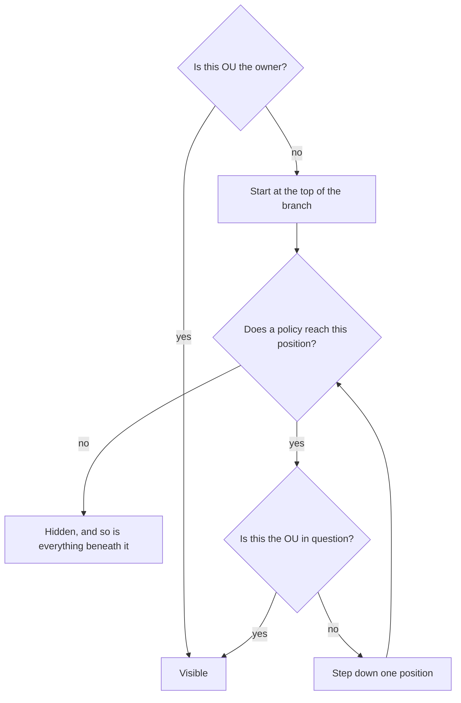

# Resource sharing across OUs

- **Status:** Draft
- **Version:** 0.1
- **Related documents:** [Discussion #3310: Architectural First Principles for Resource Modeling in B2B Context](https://github.com/thunder-id/thunderid/discussions/3310), [Issue #3346: Build core modules to support the common resource architecture in B2B context](https://github.com/thunder-id/thunderid/issues/3346)

## Summary

ThunderID models organizations as a forest of OU trees. [Discussion #2719](https://github.com/thunder-id/thunderid/discussions/2719) lists the patterns that forest has to carry: B2B SaaS sold to many customers, an enterprise with several divisions, third-party partners, resellers, and multiple brands in one company.

Each pattern holds most resources per OU. Some resources are not local to one OU though: they are common to a tree, or to several trees. A resource is owned by one OU and still has to be usable from others, and which OUs those are is a decision somebody makes, not a consequence of where the resource was created.

Copying the resource into each OU duplicates the owner's configuration and lets the copies drift. What the use cases need is one resource made available to other OUs, where each of those OUs can change some of its data inside bounds set by the owner or by an OU between the owner and the consumer.

Sharing gives a resource **reach** instead of a copy: one resource, one owner, and a set of policies recording which other OUs can see it and on what terms. A consuming OU never receives the owner's core configuration. It receives permission to use the resource, the templated fields it may set for itself, and the bounds it must stay inside. Read-only access is not enough, because an OU that cannot adapt a resource to its own division copies it anyway.

Nothing here is specific to one kind of resource, so sharing is built once as a resource-type-agnostic framework.

## Architecture



| Component | Responsibility |
|---|---|
| policyengine | Every decision: can an OU see a resource, what do its terms work out to, is a proposed edit allowed. Plain functions over plain values, with no database, clock or request context, so the narrowing rules and chain evaluation are testable from a table of inputs |
| Sharing service | Fetches the policies bearing on a question, asks the hierarchy where an OU sits, translates types, opens transactions, clears caches, calls the resource type's hooks. It decides nothing itself; every judgement is a call into policyengine |
| Registry | The list of onboarded resource types, one declaration each. Optional capabilities are not registered separately: the framework checks whether the declaration implements them |
| Policy store | Policies, targets, exclusions, overlay rules, and each OU's own values for templated fields. Keeps no rows for the resources themselves; what a resource *is* stays the type's business |
| Declarative policy store | The same job for resources defined in a file. Policies stay in memory for the life of the process. The file is their source of truth, so persisting them would strand rows when the file changes and duplicate them on restart |
| OU hierarchy resolver | Upward questions: this OU's ancestors, whether one OU sits above another. The same instance OU initialization already builds |
| OU hierarchy enumerator | Downward questions: what sits beneath an OU, what OUs exist. Separate on purpose, because walking a subtree is not an access decision and should not be reachable from the object that makes them |

## Detailed design

Three ideas account for most of the design.

- **Sharing is chained, not matched.** Nothing is matched against a pattern. Coverage starts at an OU something named outright (the owner, a root the owner reached, or an OU the owner pointed a share at) and travels down a branch hop by hop through targets that reach into a subtree. That is what makes revocation clean: remove whatever covered a position and everything reached through it goes too, while an OU named in its own right is untouched.
- **Reach is granted one step at a time.** A policy may only name OUs directly beneath the OU issuing it. To go deeper, either say "and its subtree" or let the named OU issue its own policy. An ancestor never grants reach over the head of the OU that holds the resource.
- **Terms only narrow, and only the frontier OU may narrow them.** Nobody passes on more than they hold, and an OU may set terms for its own children only if what it received named that OU alone. Where the policy above already reaches its children, those children are the granter's to decide. That is what keeps exactly one policy covering any OU, so resolving terms is a lookup rather than a reconciliation.

#### Two ways to make a policy smaller

A policy can be made smaller along either of two independent axes, and the document keeps them apart because they answer different questions and are checked by different rules.

| Term | Axis | What it changes | How | Who may set it |
|---|---|---|---|---|
| **Rule narrowing** | terms | *what* an OU reached by the policy may do with a field | lower `editable`, or shrink the values on offer | the policy's issuer, and a frontier OU for its own children |
| **OU Exclusion** | reach | *which* OUs the policy reaches at all | name an OU in `excludedOuIds`, which removes it and its subtree | the policy's issuer alone |

**Rule narrowing** is the only thing "narrowing a policy" means in this document unless reach is named explicitly. It has exactly two moves, and both only ever reduce:

- **Lock the field.** Turn `editable` from true to false. The OU can still read the field and can no longer write it.
- **Restrict the options.** Shrink `allowedValues`, pin `value`, or add to `excludedValues`. The OU may still write the field, but from a smaller menu.

Neither move can go the other way. A policy cannot raise `editable`, widen `allowedValues` past what its issuer holds, or drop one of its issuer's `excludedValues`, and an attempt is refused rather than quietly trimmed.

**OU Exclusion** is not a kind of rule narrowing and does not touch the rules at all. It is a targeted removal: the named OU and everything beneath it stop being reached by every target on the policy, so they hold nothing rather than holding less. That is why exclusion is what cleanup keys off, and rule narrowing is not: an OU whose rule got smaller still has the resource, while an excluded OU has lost it.

#### Frontier OUs, and who may decide what

An exclusion belongs to the policy carrying it and narrows that policy's reach alone. **An OU cannot withhold the resource from a child that a policy above it already reaches.** Reach flows down from whoever granted it, so withdrawing it is the granter's to do.

Whether an OU has anything to decide at all therefore comes down to one question about the policy that reached it: does that policy stop at the OU, or does it carry on past it?

| The OU was reached by | The policy | The OU is |
|---|---|---|
| `root`, `all_roots`, or a plain `ou` target | stops at the OU it names | a **frontier OU** |
| a peer target (future) | stops at the OU it names, its children included | a **frontier OU** |
| `ou_subtree` or `all_children` | carries on to every depth below the anchor | inside someone else's reach |
| `all_ous` | carries on across the whole deployment | inside someone else's reach |

A **frontier OU** holds the resource with nothing below it granted. It may issue its own policy: name its own children, set tighter terms for them, and exclude whichever of them it likes, because that reach is its to give. This is the only way the resource travels deeper than one step without a subtree target, and it is how a chain of single-OU shares hands a resource down a branch one OU at a time.

What put the OU on the frontier does not matter, only that the policy stopped there. An OU reached as a peer from another tree is a frontier OU on exactly the same terms as one named by its own parent: the peer target reached it and nothing below it, so its subtree is its to hand on, one policy at a time. That is what R5 means by a peer being able to share down its own branch.

An OU inside someone else's reach holds nothing to pass on. Its children already see the resource on the granter's terms, so it may neither exclude them nor retighten them, and a policy it writes is refused rather than accepted with no effect. Everything about those OUs, exclusions and rules alike, is set where the covering policy was defined. Under a deployment-wide `all_ous` policy that means one policy governs every OU in the deployment, and only its issuer can change anything.

The cost is deliberate: delegation now requires the granter to name OUs rather than reach for a subtree. A resource shared with `all_children` is uniform across the subtree by construction; an owner who wants each OU to set its own terms downward names them with plain `ou` targets instead and accepts the enumeration. The gain is that **exactly one policy covers any OU**, which is what makes reach, terms, revocation and export agree with one another.

### Policies, stages and targets

A **policy** is one OU's standing decision about one resource: who it reaches and on what terms. Each OU gets exactly one policy per resource. A second create is refused, naming the existing policy to edit instead. That constraint is what makes an edit well defined and stops policies piling up.

Every policy records a **stage**: `share` when the owner issued it, `reshare` when the issuer is an OU the resource had already reached. A reshare requires the issuing OU to see the resource at the moment it writes the policy.

**Targets** are not a list of OUs. They are a list of anchors, each with a scope; the actual set of OUs is worked out when somebody asks. A subtree target written today therefore still covers an OU created under that subtree tomorrow.

| Stored scope | Request field | Who may issue | Reach |
|---|---|---|---|
| `ou` | `childOuIds: [{ouId}]` | owner or sharee | That OU alone |
| `ou_subtree` | `childOuIds: [{ouId, allChildren}]` | owner or sharee | That OU and everything beneath it, at any depth |
| `all_children` | `allChildren` | owner or sharee | Every OU beneath the issuing OU, at any depth, the issuer excluded |
| `root` | `rootOuIds` | owner only, cross-tree gated | That root alone. Does not cascade |
| `all_roots` | `allRoots` | owner only, declarative only, root owner unless cross-tree sharing is on | Every root alone. Does not cascade |
| `all_ous` | `allOus` | owner only, declarative only, root owner unless cross-tree sharing is on | Every OU in the deployment, as a fallback |

The stored scope names for a named child are `ou` and `ou_subtree`; the request field is `childOuIds`. The two differ because the request is about *who you may name* (a direct child) while storage is about *what the anchor reaches* (one OU, or one OU and its subtree).

Policies are written using selectors, and a request must pick exactly one of three groups.

| Group | Selectors | Narrowed by |
|---|---|---|
| Blanket | `allOus` | `excludedOuIds` |
| Root | `allRoots`, `rootOuIds` | `excludedRootOuIds` |
| Child | `allChildren`, `childOuIds` | `excludedOuIds` |

`excludedOuIds` and `excludedRootOuIds` are merged into one exclusion list on the policy. The two names exist so a request reads naturally next to the selector whose reach it cuts.

Note that this grouping is about what a *request* may contain. It is not the same as the scope family that governs *edits*, described under [Editing a policy](#editing-a-policy), where `all_roots` sits with `all_ous` and `all_children` because all three already reach a whole family.

A request that sets no selector is malformed, and so is one that combines groups. `childOuIds` may only name direct children of the issuing OU, which is the one-hop rule. Naming the same OU twice in that list is refused rather than silently collapsed to one, because each entry carries its own overlay rules and there is no basis for choosing between them.

**Exclusions** carve an OU out of every target on the policy, and take that OU's whole subtree with them. They belong to the policy that carries them and narrow that policy's reach alone, so only the policy's own issuer can add one. An OU reached by somebody else's policy cannot exclude anything from it; see [Frontier OUs](#frontier-ous-and-who-may-decide-what) for what such an OU may and may not do.

An exclusion naming an OU the policy's own targets do not reach is refused. Nothing would apply it, and accepting it would read as a withholding that never happened.



Landing on a root reaches the root and nothing beneath it, so entering another tree takes two decisions and the receiving root stays in charge of its own interior.

### Peer-to-peer sharing (future requirement)

Everything above follows the tree: a policy reaches downward from its issuer, or lands on a root. Two OUs that are not parent and child cannot share at all. That misses the partner pattern from Discussion #2719, where two independent businesses are wired together sideways, and something more ordinary too: one division handing a resource to a sibling division without pushing it up through their common parent.

A **peer** target names exactly one OU anywhere in the forest, requested through `peerOuIds` and stored as scope `peer`. It is not called `ou`, because that name is already the stored scope for a named child.



Four constraints keep it from becoming a way around everything else:

| Constraint | Reason |
|---|---|
| Owner only | An OU that merely received a resource can pass it down its own branch but cannot hand it sideways, so lateral spread is always the owner's decision. It also keeps every ceiling dependent on a policy issued above it, which is what lets re-materialization stay a walk in depth order |
| One OU, and it stops there | It reaches the named OU and nothing else. If that OU wants its subtree to see the resource it issues its own policy, exactly as another tree's root would. There is no "all peers" form |
| Never a descendant | `childOuIds` and `allChildren` already cover that ground, and two ways to say one thing become two code paths that eventually disagree |
| Off by default | It has to be switched on for the deployment, and a target in a different tree also has to clear the cross-tree setting |

In visibility resolution a peer target acts as an **entry point**: it covers the named OU's position directly, without needing anything above it covered, and coverage does not leak upward, so the OU's parent and root are judged on their own. Otherwise it behaves like any named target, so an OU reached both by a peer target and by its own ancestor holds what both permit.

### Visibility resolution

Deciding whether an OU can see a resource is a walk, not a lookup. Take the branch the OU sits on, start at the top, and step down one position at a time, deciding for each whether anything covers it. A position is covered either in its own right, or by a position above it that is itself covered and reaches down. Only the second kind depends on the walk so far.



Four ways a position can be covered:

- **Root coverage** happens only at the top of the branch, from an owner's `root` or `all_roots` target.
- **Descendant coverage** looks upward from the position just above, ignoring any position not itself covered. An `all_children` or `ou_subtree` target anchored on a covered position reaches any depth below it, provided nothing between anchor and position is excluded. A plain `ou` target covers only the position immediately below the OU that named it, which is why naming a grandchild directly never reaches it.
- **Peer coverage** (future) applies wherever the named OU sits, whether or not anything above it is covered, and stops there.
- **Deployment-wide coverage**, from `all_ous`, fills in where nothing more specific reached, either at the top of the branch or below a position that is already covered. Being available at the top is what lets it reach a root, and therefore any tree: without that it could never establish coverage anywhere, because a root has no position above it and root coverage comes only from a `root` or `all_roots` target. Below the top it behaves like any fallback and needs the position above covered, so it fills a gap in a chain rather than starting one mid-branch.

A policy's exclusions are consulted only for the policy doing the covering, which is what makes reach the granter's to withdraw: an OU between the anchor and the target cannot carve anything out of a grant it did not issue.

Because only a frontier OU may issue a policy, and an OU holds at most one policy per resource, exactly one policy ever covers an OU, and the walk returns that one. The mechanism carries a list rather than a single value so that "no policy covered this" is the same shape as the others rather than a special case, and so a scope added later cannot silently pick a winner. The fetch behind it is narrowed to the branch being walked: a policy can only bear on the branch through a blanket scope or an anchor on it, so the query grows with branch length rather than with how widely the resource is shared.

### Overlay rules and rule narrowing

An **overlay rule** answers "what may this OU do with this templated field?". It has four parts.

| Field | Meaning |
|---|---|
| `editable` | Whether the receiving OU may write the field |
| `value` | What the receiving OU starts with, or is pinned to when the field is not editable |
| `allowedValues` | What it may choose from. Absent means the field's whole value space |
| `excludedValues` | Subtracted from both of the above, last |

For the three list fields, omitting one and setting it to an empty list mean opposite things: omitted means "whatever my parent allowed", empty means "nothing at all". Collapsing them would turn the most restrictive rule into the least restrictive one, so they stay distinct all the way into storage.

A rule is worked out when it is written, against what the issuing OU holds, so reading it back later is one lookup instead of another walk. Asking for more than you hold is **refused, not quietly reduced**, because a policy that was quietly cut back looks like it worked, and the author finds out much later:

- `editable: true` when the issuer holds `editable: false`
- an `allowedValues` or `value` set its own does not cover
- dropping one of its own `excludedValues`, since a withheld value can be added but never taken back

Two more are refused on their own terms, with no parent involved: a `value` outside its own `allowedValues`, and `editable: false` combined with `allowedValues`, which is a menu nobody may choose from.

How two members compare depends on what a member is, which only the resource type knows. A declaration picks one of three kinds:

| Kind | Members are | Compared by |
|---|---|---|
| `scalar` | one opaque value | equality |
| `referenceSet` | a set of ids | set membership |
| `hierarchy` | delimiter-joined paths, where a path names everything beneath it | prefix containment in the type's own separator |

A hierarchy field needs the type to supply its separator, and the framework refuses to resolve the field without one: a type that declares a hierarchy field but implements no `FieldDelimiterResolver`, or resolves an empty delimiter, fails the request rather than comparing raw strings.

Both the original request and the resolved result are stored. When an ancestor policy changes and a descendant is recalculated, the recalculation starts from the original request; otherwise each narrowing would stack on the last, and an OU would never get anything back when the ancestor later loosened.

### Rule resolution

One policy covers an OU, so its terms are that policy's rule, already worked out when the policy was written. There is nothing to reconcile.

The fold below is a guard, not a mechanism. It receives one rule and returns it, and exists so that a future scope which breaks the one-policy invariant degrades to the safe answer rather than to whichever rule happened to be read last. Peer sharing does not break it: a peer target is owner-only, an owner holds one policy, and a peer cannot name an OU the owner already reaches downward.

Were it ever to receive two, the fold is per field: `editable` must be true in all of them, `allowedValues` and `value` intersect, and `excludedValues` union so every withheld value survives. One case needs care: a pinned rule carries no menu, so folding a bounded editable rule with a pinned one moves the bound onto the value rather than producing a rule that would fail its own validation.

If no policy mentions a field the answer is the type's declared default, and the result says which of the two it came from, because "the owner decided this" and "nobody said anything" are different statements. An OU that cannot see the resource is different again: it gets **empty** rules rather than defaults, since the defaults describe what an OU holding the resource may do when nobody said otherwise, not "this OU may do nothing".

### Editing a policy

Every edit carries the version the caller believes it is editing. If the policy moved since it was read the update matches no row and the caller is told, rather than silently flattening somebody else's write.

Each policy belongs to one scope family, blanket (`all_ous`, `all_roots`, `all_children`) or selective (`root`, `ou`, `ou_subtree`), and an edit cannot move it between families. A selective policy may grow while staying inside the one-hop rule, because growing that way gives its issuer no authority it did not already have. A blanket policy already reaches everything in its family, so there is nothing to grow toward. The only edits open to it are the two smaller-making moves, one on each axis:

- its targets cannot change
- an exclusion can be added but never removed, since removing one hands the resource back to an OU that was deliberately carved out of its reach
- its rules cannot widen, and **omitting a rule counts as widening**, because a field no policy mentions falls back to the declared default, which is exactly what the rule was written to override

An edit can move the limit other policies were cut back to, so every reshare of that resource is recalculated in the same transaction. Walking down the parent links would now reach the same set, since each policy has exactly one parent, but recalculating every reshare of the resource stays the simpler statement and is robust to a frontier OU whose parent was declarative and so unlinked. The recalculation runs shallowest issuer first: a covering policy is always issued from above, so working top down rebuilds each limit before anything cut back to it. Reshares that come out unchanged are left alone, otherwise their versions would bump and a concurrent edit of an untouched policy would start failing.

An edit can take reach away as well as tighten terms. A new exclusion, or a target the policy no longer names, takes the resource away from OUs that had it, so such an edit runs the same cleanup a delete does.

### Deletion and cleanup

Cleanup runs when a policy is deleted, or when an edit takes reach away from it: a new exclusion, or a target it no longer names. Rule narrowing alone never triggers it, because an OU whose terms got smaller still holds the resource. Each OU that has just lost sight of the resource is then cleaned up:

1. The OU's own values for the resource's templated fields are deleted. The framework deletes from its own overlay table unless the type implements `OverlayCleaner`, in which case that is called instead, because only the type knows where it keeps them.
2. The type's `PolicyHooks` cleanup fires, naming the fields the removed policy governed.

Which OUs those are is decided by asking about visibility **after** the change, not by reading the removed policy's target list. Deleting a policy outright takes every OU it reached, since no second policy covers any of them. An edit is the case the re-check earns its keep on: dropping one target or adding an exclusion leaves the policy's other targets standing, and an OU those still reach keeps what it had.

Getting the candidate list needs a downward walk, because a target records an anchor and not the set beneath it: a subtree or root target reached everything below its anchor, `all_children` everything below its issuer, and a blanket scope the whole deployment. If no downward enumerator is available the service logs loudly rather than continuing quietly, since per-OU state left under a policy that no longer exists is a data-retention problem nobody would notice.

A declared policy cannot be deleted. Its existence belongs to the file that declares it, so it goes away by being removed from the file.

### Declarative policies

A resource defined in a file can declare its own policies. They pass exactly the same validation as any other and then sit in memory alongside the stored ones. `allOus` and `allRoots` are available only this way.

A declared policy **can** be edited. The file says where sharing starts, and an operator tightening it afterwards is expected rather than an abuse. The edit writes the policy to the database under the same id, so whoever was looking at it keeps looking at the same policy. The file is untouched and remains the value the policy falls back to if the stored row is ever deleted. All scope-family rules still apply, so a declared blanket policy can only be made smaller: an exclusion, or a tighter rule.

Once a declared policy has a stored row, the stored row *is* the policy. Which ones have reached that state is asked of the database rather than guessed. There is a specific trap behind that: if an edit moved a policy's targets away from the branch being asked about, the stored row falls outside the narrowed fetch while the file's original still names that branch, and replaying the file version would hand back exactly the reach the edit removed.

### Resource type onboarding

Onboarding means registering one declaration: the type's identifier and its templated fields, which are the fields a policy may carry rules for. Each field gives its key, the kind of its members, and the rule that applies when no policy mentions it. It may also name a coarser fallback key, used when no rule mentions the field itself, and a dynamic-key prefix so a map-shaped field is declared once instead of enumerating every member.

Six capabilities a type can implement if it needs them. None are registered separately; the framework checks whether the declaration implements each.

| Capability | Purpose |
|---|---|
| `OwnerResolver` | Resolves which OU owns a resource. The framework stores no resource rows and cannot read ownership off one |
| `FieldDelimiterResolver` | Supplies the separator for a hierarchy field. Expected whenever a type declares one |
| `MemberValidator` | Checks that the values a rule lists are ones the issuing OU may legitimately reference |
| `PolicyHooks` | Cleans up the type's own per-OU state when visibility is lost, scoped to the fields the removed policy governed |
| `OverlayCleaner` | Deletes an OU's own field values when it loses the resource outright, for a type that keeps them outside the framework's table. Not field-scoped, because at that point every value the OU holds for the resource is dead |
| `DeletionOwnershipError` | Supplies a type-specific refusal when a non-owner attempts a delete |

`MemberValidator` is worth spelling out. Suppose a rule pins a field to a permission string. The framework can check that string against the sets a parent policy allowed, but it does not know whether the permission exists, which resource server defines it, or whether the issuing OU has any business naming it. Only the type can answer that.

### Data model

Six tables in the configuration database. Every table carries `DEPLOYMENT_ID VARCHAR(255) NOT NULL`, and every child table cascades on delete from its policy. No existing table is reused or altered.

#### `RESOURCE_SHARING_POLICY`

One row per OU decision about one resource.

| Column | Type | Notes |
|---|---|---|
| `DEPLOYMENT_ID` | `VARCHAR(255) NOT NULL` | Deployment isolation |
| `ID` | `VARCHAR(36) PRIMARY KEY` | UUID v7 |
| `RESOURCE_TYPE` | `VARCHAR(64) NOT NULL` | The registered type identifier |
| `RESOURCE_ID` | `VARCHAR(36) NOT NULL` | Not a foreign key: the framework stores no resource rows |
| `OWNING_OU_ID` | `VARCHAR(36) NOT NULL` | The OU that owns the resource |
| `INITIATING_OU_ID` | `VARCHAR(36) NOT NULL` | The OU whose decision this policy is |
| `POLICY_STAGE` | `VARCHAR(16) NOT NULL` | `CHECK (POLICY_STAGE IN ('share', 'reshare'))` |
| `PARENT_POLICY_ID` | `VARCHAR(36)` | `REFERENCES "RESOURCE_SHARING_POLICY" (ID) ON DELETE CASCADE`. The policy covering this one's issuer. Empty when that policy is declarative and so has no row |
| `DECLARED` | `BOOLEAN NOT NULL DEFAULT FALSE` | Set on a policy loaded from a resource file |
| `VERSION` | `INTEGER NOT NULL DEFAULT 1` | Optimistic concurrency on edit |
| `CREATED_AT`, `UPDATED_AT` | `TIMESTAMPTZ DEFAULT NOW()` | |

`UNIQUE (DEPLOYMENT_ID, RESOURCE_TYPE, RESOURCE_ID, INITIATING_OU_ID)`, one policy per OU per resource.

Index: `idx_rsp_parent (PARENT_POLICY_ID)`.

#### `RESOURCE_SHARING_POLICY_TARGET`

One row per target anchor, so one policy can name several.

| Column | Type | Notes |
|---|---|---|
| `DEPLOYMENT_ID` | `VARCHAR(255) NOT NULL` | |
| `ID` | `VARCHAR(36) PRIMARY KEY` | Per-target rules point at this |
| `POLICY_ID` | `VARCHAR(36) NOT NULL` | `REFERENCES "RESOURCE_SHARING_POLICY" (ID) ON DELETE CASCADE` |
| `TARGET_SCOPE` | `VARCHAR(16) NOT NULL` | `CHECK (TARGET_SCOPE IN ('all_ous', 'all_roots', 'root', 'all_children', 'ou', 'ou_subtree'))` |
| `TARGET_OU_ID` | `VARCHAR(36)` | Null only for `all_ous` and `all_roots`. Every other scope anchors on an OU, `all_children` included, where it holds the issuing OU itself |

`UNIQUE (POLICY_ID, TARGET_SCOPE, TARGET_OU_ID)`, and `UNIQUE (POLICY_ID, ID)` for the overlay rule's composite key to reference. Plus a `CHECK` tying `TARGET_OU_ID` to the scope:

```sql
CHECK ((TARGET_SCOPE IN ('all_ous', 'all_roots') AND TARGET_OU_ID IS NULL)
    OR (TARGET_SCOPE NOT IN ('all_ous', 'all_roots') AND TARGET_OU_ID IS NOT NULL))
```

Indexes: `idx_rspt_policy (POLICY_ID)`, `idx_rspt_target_ou (DEPLOYMENT_ID, TARGET_OU_ID)`, and `idx_rspt_blanket_once`, unique over `(POLICY_ID, TARGET_SCOPE)` where `TARGET_OU_ID IS NULL`, which the plain `UNIQUE` misses because nulls count as distinct.

#### `RESOURCE_SHARING_POLICY_EXCLUSION`

OUs carved out of every target of a policy, each taking its subtree with it. `excludedOuIds` and `excludedRootOuIds` both land here.

| Column | Type | Notes |
|---|---|---|
| `DEPLOYMENT_ID` | `VARCHAR(255) NOT NULL` | |
| `POLICY_ID` | `VARCHAR(36) NOT NULL` | `REFERENCES "RESOURCE_SHARING_POLICY" (ID) ON DELETE CASCADE` |
| `EXCLUDED_OU_ID` | `VARCHAR(36) NOT NULL` | |

`PRIMARY KEY (POLICY_ID, EXCLUDED_OU_ID)`.

#### `RESOURCE_SHARING_POLICY_OVERLAY_RULE`

What a policy says a target may do with one field.

| Column | Type | Notes |
|---|---|---|
| `DEPLOYMENT_ID` | `VARCHAR(255) NOT NULL` | |
| `ID` | `VARCHAR(36) PRIMARY KEY` | Rule members point at this |
| `POLICY_ID` | `VARCHAR(36) NOT NULL` | `REFERENCES "RESOURCE_SHARING_POLICY" (ID) ON DELETE CASCADE` |
| `TARGET_ID` | `VARCHAR(36)` | Null means the rule applies to every target; set overrides the policy-level rule for that target alone. Constrained with `POLICY_ID`, below |
| `FIELD_KEY` | `VARCHAR(255) NOT NULL` | |
| `EDITABLE` | `BOOLEAN NOT NULL` | Resolved form |
| `VALUE_SET`, `ALLOWED_SET`, `EXCLUDED_SET` | `BOOLEAN NOT NULL DEFAULT FALSE` | Whether each list was present at all |
| `REQUESTED_EDITABLE` | `BOOLEAN NOT NULL` | Requested form |
| `REQ_VALUE_SET`, `REQ_ALLOWED_SET`, `REQ_EXCLUDED_SET` | `BOOLEAN NOT NULL DEFAULT FALSE` | |

`UNIQUE (POLICY_ID, TARGET_ID, FIELD_KEY)`, plus `idx_rspor_policy_wide_once`, unique over `(POLICY_ID, FIELD_KEY)` where `TARGET_ID IS NULL`, which the plain `UNIQUE` misses because nulls count as distinct.

`TARGET_ID` is constrained together with `POLICY_ID`, so a rule cannot pair a policy with another policy's target:

```sql
FOREIGN KEY (POLICY_ID, TARGET_ID)
    REFERENCES "RESOURCE_SHARING_POLICY_TARGET" (POLICY_ID, ID) ON DELETE CASCADE
```

A policy-level rule leaves `TARGET_ID` null, which a composite foreign key does not enforce. Those rows stay anchored by `POLICY_ID`'s own foreign key.

Indexes: `idx_rspor_policy (POLICY_ID)`, `idx_rspor_target (TARGET_ID)`.

The `*_SET` booleans record whether each list was present at all, since zero member rows is otherwise ambiguous. The `REQ_*` columns keep the issuing OU's original request alongside the resolved form.

#### `RESOURCE_SHARING_POLICY_OVERLAY_RULE_MEMBER`

One row per member of a rule's sets.

| Column | Type | Notes |
|---|---|---|
| `DEPLOYMENT_ID` | `VARCHAR(255) NOT NULL` | |
| `RULE_ID` | `VARCHAR(36) NOT NULL` | `REFERENCES "RESOURCE_SHARING_POLICY_OVERLAY_RULE" (ID) ON DELETE CASCADE` |
| `MEMBER_ROLE` | `VARCHAR(24) NOT NULL` | `CHECK (MEMBER_ROLE IN ('value', 'allowed', 'excluded', 'requestedValue', 'requestedAllowed', 'requestedExcluded'))` |
| `MEMBER_KEY` | `VARCHAR(512) NOT NULL` | |

`PRIMARY KEY (RULE_ID, MEMBER_ROLE, MEMBER_KEY)`. A scalar field stores a single `value` row here like any other kind.

#### `RESOURCE_OVERLAY_VALUE`

A consuming OU's own value for one templated field of a shared resource. The only table not hung off a policy. Cleanup deletes an OU's rows here when it loses sight of the resource, unless the type implements `OverlayCleaner`.

| Column | Type | Notes |
|---|---|---|
| `DEPLOYMENT_ID` | `VARCHAR(255) NOT NULL` | |
| `RESOURCE_TYPE` | `VARCHAR(64) NOT NULL` | |
| `RESOURCE_ID` | `VARCHAR(36) NOT NULL` | |
| `OU_ID` | `VARCHAR(36) NOT NULL` | The OU whose value this is |
| `FIELD_KEY` | `VARCHAR(255) NOT NULL` | |
| `VALUE` | `JSONB NOT NULL` | |
| `CREATED_AT`, `UPDATED_AT` | `TIMESTAMPTZ DEFAULT NOW()` | |

`PRIMARY KEY (DEPLOYMENT_ID, RESOURCE_TYPE, RESOURCE_ID, OU_ID, FIELD_KEY)`, also the upsert conflict target.

The SQLite script defines the same six tables, columns, constraints and indexes, the two partial unique indexes and the composite foreign key included. The only differences are dialect spellings: `JSONB` becomes `TEXT`, and `TIMESTAMPTZ DEFAULT NOW()` becomes `TIMESTAMP DEFAULT CURRENT_TIMESTAMP`.

### API

The framework introduces no REST APIs. It is a Go package that resource types embed, and it mounts no routes of its own.

Each resource type that adopts sharing exposes its own endpoints, nested under the resource the policy concerns, so a sharing decision is addressed through the thing being shared. For resource servers:

| Method | Path | Purpose |
|---|---|---|
| `POST` | `/resource-servers/{id}/sharing-policies` | Record a sharing policy |
| `GET` | `/resource-servers/{id}/sharing-policies` | List sharing policies |
| `GET` | `/resource-servers/{id}/sharing-policies/{policyId}` | Get a sharing policy |
| `PUT` | `/resource-servers/{id}/sharing-policies/{policyId}` | Replace a sharing policy |
| `DELETE` | `/resource-servers/{id}/sharing-policies/{policyId}` | Delete a sharing policy |
| `GET` | `/resource-servers/{id}/overlay-rules` | Resolve what an OU may do |

### Configuration

Deployment level, under `resource_sharing`. The key is absent from the shipped deployment file, so it takes the value shown here.

```yaml
resource_sharing:
  # Lets an OU that sits inside a tree reach outside its own tree.
  # A root OU reaching another root is ordinary B2B sharing and is never gated by this.
  # A peer target landing in a different tree is gated by it whatever the issuer's position.
  allow_child_ou_cross_tree_sharing: false
```

## Requirements

### R1. Share a resource without duplicating it

**Requirement:** An OU can give another OU access to a resource it owns. Afterwards there is still one resource, its core configuration still belongs to the owner, and the receiving OU can find out exactly what it may do with it.

- **AC1.1:** Given a resource owned by OU A, when A creates a policy naming child OU B, then B can see the resource and no second copy exists.
- **AC1.2:** Given B can see the resource, when B reads its effective terms, then B receives the rule per declared templated field and the identity of every policy that contributed.
- **AC1.3:** Given a resource nobody has shared, when its owner asks whether it is visible, then the answer is yes without any policy existing.

### R2. Reach is granted one step at a time

**Requirement:** A policy may only name OUs directly below its issuer. Reaching further happens two ways: the named OU is marked as bringing its subtree, or that OU issues its own policy.

- **AC2.1:** Given OU A, its child B, and B's child C, when A writes a policy naming C, then the request is refused with a client error.
- **AC2.2:** Given a policy from A naming B alone, when C is checked, then C cannot see the resource.
- **AC2.3:** Given a policy from A naming B and marking it as bringing its subtree, when C and anything below C is checked, then all can see the resource.
- **AC2.4:** Given a policy from A naming B alone, when B writes its own policy naming C, then C can see the resource.
- **AC2.5:** Given a policy from A naming B and marking it as bringing its subtree, when B writes a policy naming C, then the request is refused with a client error, because C is already reached by A's policy.
- **AC2.6:** Given a deployment-wide policy, when any OU it reaches writes a policy of its own, then the request is refused with a client error.

### R3. Coverage starts somewhere and is carried down, and revocation follows it

**Requirement:** An OU sees a resource for one of two reasons: something named it outright, or an OU above it on its branch can see the resource and reaches down. Deleting a share takes away whatever depended on it, and nothing more.

- **AC3.1:** Given an OU that can only reach the resource through a position above it, when that position is excluded or covered by nothing, then the OU cannot see the resource.
- **AC3.2:** Given an OU named outright, whether because it owns the resource or the owner aimed a share at it, when nothing above it can see the resource, then it can see the resource all the same.
- **AC3.3:** Given C sees the resource only through a policy B issued, when the policy that let B see it is deleted, then C can no longer see it.
- **AC3.4:** Given an OU loses sight of the resource, when the delete finishes, then its own values for the resource are gone and the type's cleanup hook has run once for that OU, naming the fields the deleted policy governed.
- **AC3.5:** Given an edit that adds an exclusion or drops a target, when an OU loses sight of the resource as a result, then the same cleanup runs as for a delete.
- **AC3.6:** Given a frontier OU, when it excludes one of its own children or sets tighter terms for it, then that takes effect, because the reach in question is the frontier OU's to give.
- **AC3.7:** Given an OU inside a covering policy's reach, when it attempts to exclude or retighten one of its own children, then the request is refused with a client error rather than accepted with no effect.
- **AC3.8:** Given a policy is deleted, when cleanup runs, then every OU that policy reached loses sight of the resource, and no OU it did not reach is touched.

### R4. Crossing between organization trees is gated and lands on a root

**Requirement:** A resource leaves its own tree only by landing on another tree's root. A root OU may always do that; an OU inside a tree may do it only when `allow_child_ou_cross_tree_sharing` is on.

- **AC4.1:** Given a root OU owns the resource, when it writes a policy naming another root, then the policy is created whether or not the setting is on.
- **AC4.2:** Given the owner has an ancestor and the setting is off, when it writes a policy naming a root in another tree, then the request is refused with a client error.
- **AC4.3:** Given a policy reaching another tree's root, when any OU below that root is checked, then it cannot see the resource until that root issues its own policy.
- **AC4.4:** Given the owner has an ancestor, when it names the root of its own tree, then the policy is created even with the setting off.
- **AC4.5:** Given the owner has an ancestor and the setting is off, when a resource file declares `allRoots` or `allOus`, then the declaration is refused as the file loads, because both scopes span every tree and the own-root exemption of AC4.4 cannot apply. With the setting on, both are accepted from an owner at any depth.

### R5. Peer-to-peer sharing between OUs that are not parent and child (future requirement)

**Requirement:** A resource owner can share with one named OU anywhere in the forest, a sibling or an OU in another tree included. The share reaches that one OU and nothing else.

- **AC5.1:** Given peer sharing is off for the deployment, when any OU writes such a target, then the request is refused with a client error.
- **AC5.2:** Given it is on and an owner names a sibling in its own tree, when both are checked, then the sibling can see the resource and their shared parent cannot.
- **AC5.3:** Given an owner names an OU in another tree, when cross-tree sharing is off the request is refused with a client error, and when it is on the policy is created.
- **AC5.4:** Given a policy reaching an OU as a peer, when that OU's root, parent or children are checked, then none can see the resource.
- **AC5.5:** Given an OU that received the resource rather than owning it, when it writes a peer target, then the request is refused, because only the owner may issue one.
- **AC5.6:** Given an owner names an OU below itself, when the policy is written, then the request is refused, because `childOuIds` already covers that ground.
- **AC5.7:** Given an OU reached as a peer, when it issues a policy down its own branch, then its subtree can see the resource.

### R6. Deployment-wide reach is declarative only

**Requirement:** `allOus` and `allRoots` cannot be set through an API. They are available only to a policy a resource file declares.

- **AC6.1:** Given any OU, when it writes a policy carrying `allOus` or `allRoots` through an API, then the request is refused with a client error saying which of the two was asked for.
- **AC6.2:** Given a resource file declaring a policy with either scope, when the file is loaded, then the policy is created, subject to the cross-tree gate of AC4.5.
- **AC6.3:** Given an existing policy of any other shape, when an edit tries to turn it into one of these two, then the edit is refused by the scope-family and blanket rules.
- **AC6.4:** Given a policy naming specific roots, when it is written through an API, then it is created, subject to the cross-tree gate.

### R7. Rule narrowing is delegated within bounds and never widens

**Requirement:** An OU can be given room to change a field, but only inside the bounds held by the OU that shared it. No OU passes on more than it holds.

- **AC7.1:** Given an OU that holds a field as not editable, when it writes a policy making that field editable for somebody else, then the request is refused with a client error.
- **AC7.2:** Given an OU bounded to a set of values, when it writes a policy allowing a value outside that set, then the request is refused with a client error.
- **AC7.3:** Given an OU whose own rule carries `excludedValues`, when it writes a policy dropping one of them, then the request is refused with a client error.
- **AC7.4:** Given a rule whose value sits outside its own allowed values, when it is submitted, then it is refused whatever any policy above it says.
- **AC7.5:** Given a rule naming a value the issuing OU is not entitled to reference, when it is submitted, then it is refused with a client error.

### R8. Exactly one policy covers an OU

**Requirement:** No OU is ever reached by two policies, so its terms are one policy's and there is nothing to reconcile. Two rules keep it that way: only an OU a policy named and stopped at may issue a policy of its own, and one OU holds at most one policy per resource.

- **AC8.1:** Given any OU that can see the resource, when its terms are resolved, then exactly one policy is named as the contributor.
- **AC8.2:** Given an OU inside a covering policy's reach, when that OU writes a policy of its own, then the request is refused, so no second covering policy can arise.
- **AC8.3:** Given peer sharing is on, when a peer-reached OU, or any OU it shares down to, has its terms resolved, then AC8.1 still holds.
- **AC8.4:** Given a field no policy mentions, when terms are resolved, then the type's declared default comes back, marked as coming from the default rather than a policy.
- **AC8.5:** Given an OU that cannot see the resource, when its terms are resolved, then it gets empty rules rather than the declared defaults.

### R9. A blanket policy can only be made smaller

**Requirement:** A policy already reaching a whole family cannot be widened or turned into another shape. The only edits open to it are adding an exclusion, which removes OUs, and narrowing a rule, which limits editability or the values on offer.

- **AC9.1:** Given a blanket policy, when an edit changes its targets or moves it into another scope family, then the edit is refused with a client error.
- **AC9.2:** Given a blanket policy that excludes an OU, when an edit removes that exclusion, then the edit is refused.
- **AC9.3:** Given a blanket policy carrying a rule, when an edit omits or widens that rule, then the edit is refused.
- **AC9.4:** Given a blanket policy, when an edit adds an exclusion or tightens a rule, then the edit succeeds.
- **AC9.5:** Given a policy read at one version, when an edit is submitted against an older version, then it is refused with a client error.

### R10. A resource type onboards without the framework knowing its shape

**Requirement:** A new type gets sharing by registering one declaration of its fields. It then uses the same engine, storage and resolution as every other type, with nothing written specially for it.

- **AC10.1:** Given a type has registered its declaration, when a policy names one of its declared fields then the rule is stored, and when it names a key the type never declared then the request is refused with a client error.
- **AC10.2:** Given a type declares a hierarchy field and supplies its separator, when containment is worked out, then a path covers itself and everything beneath it, but not a sibling that merely starts with the same text.
- **AC10.3:** Given a type declares a dynamic-key prefix, when a rule names a key under that prefix, then it resolves to the declared field.
- **AC10.4:** Given a type implementing none of the optional capabilities, when policies are created and resolved, then everything not requiring one still works.
- **AC10.5:** Given a resource type that never registered, when a policy is created for it, then the request is refused with a client error.
- **AC10.6:** Given a type that implements `OverlayCleaner`, when an OU loses sight of a resource, then the type is asked to delete that OU's values and the framework's own overlay table is left alone.

### R11. Policies export and replay deterministically

**Requirement:** A resource's sharing can be exported, reviewed, kept in version control, then replayed to reproduce the sharing it was taken from.

- **AC11.1:** Given a resource with an owner policy and reshares derived from it, when the policies are exported, then the policy that let an OU see the resource always comes before the policy that OU issued.
- **AC11.2:** Given an export of a single resource, when it is replayed on its own, then every step is valid, with any policy whose parent is missing treated as a starting point.
- **AC11.3:** Given the same set of policies, when they are exported twice, then the two exports come out in the same order.

## Change log

| Version | Date | Change |
|---|---|---|
| 0.1 | 2026-09-22 | Initial specification. |
