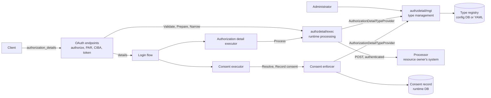

# Rich Authorization Requests (RFC 9396) Specification

- **Status:** Draft
- **Version:** 1.0.0
- **Related documents:** [Discussion #5604: Rich Authorization Requests (RFC 9396)](https://github.com/thunder-id/thunderid/discussions/5604), Issues #5153, #5155, #5159, [RFC 9396](https://www.rfc-editor.org/rfc/rfc9396), [Threat model](threat-model.md), [Discussion #5552: Shared outbound authentication module](https://github.com/thunder-id/thunderid/discussions/5552)

## Summary

Scopes grant broad capabilities, so users approve more than a task needs and resource servers cannot check a call against what was approved. RFC 9396 lets a client request `authorization_details`: structured objects such as "pay 35.00 EUR to Merchant A from my account".

A resource server registers the **authorization details types** it understands. A type is a JSON Schema for the detail, a **policy** on each field saying who supplies it and how it may change after the request, a consent summary template, a **reuse** setting, and optionally a **processor**: an endpoint of the resource owner's system that approves or refuses each detail and fills in values only it knows.

Each detail is validated against its type, decided on by the processor, and approved or denied by the user. The approved details are carried in the access token, the token response and introspection, and approvals are recorded in the user's existing consent record. **Nothing in a token can exceed what was requested and approved**: every later change, whether a processor's patch, a client narrowing at the token endpoint, or the reuse of an earlier approval, goes through one comparator driven by the field policies.

## Architecture



| Component | Ownership |
|---|---|
| `internal/authzdetail/mgt` | Type management: the type registry (database, file and composite stores), the management API, declarative types and the exporter. Provides the registered types to runtime processing as `providers.AuthorizationDetailTypeProvider`, as flow management provides flow definitions through `providers.FlowProvider`. |
| `internal/authzdetail/exec` | Runtime processing: **Validate** and **Prepare** (the authorization request), **Process** (the processor call) and **Narrow** (the token endpoint). Flows use it as `providers.AuthorizationDetailProvider`, and the OAuth endpoints use it directly. |
| `internal/authzdetail/common` | What the others share: schema compiling, field policies, detail parsing, the comparator, and the consent helpers (the coverage check and the prompt purpose of a detail). |
| Consent enforcer | The existing `providers.ConsentProvider` implementation (`internal/authn/consent`) takes the details beside the attributes and permissions it already resolves. It decides which details earlier approvals cover, adds a purpose for each of the others to the prompt, and records the approvals a later request may reuse in the same consent record write. It reads types through `providers.AuthorizationDetailTypeProvider`. |
| OAuth endpoints | `/oauth2/authorize`, PAR, the CIBA backchannel endpoint and the token endpoint accept `authorization_details` and call the runtime service. Token issuance and introspection carry the result, and discovery lists the registered types. |
| Flow executors | A new **authorization detail executor** runs the processors after authentication. The existing consent executor passes the details to `providers.ConsentProvider` with the attributes and permissions, and grants those the user's decision allows. It has no authorization details dependency of its own. |
| Shared rule package | `internal/system/rule`, shared with federated authorization mapping, orders numbers, dates and instants. |

Existing seams are reused rather than duplicated:

- **Details travel by value, as permissions do.** The authorization request validates the details and prepares them: each gets an internal `detailId` and the identifier and version of the type the request starts with. They travel in the flow's server-side runtime data, and each step that changes them writes the result back: the processor's patch and admission, then the details consent granted. The flow's signed assertion carries the granted details to the authorization callback, which issues the code with them; an assertion without them means the flow did not decide, and the request is refused with `access_denied`. Executors in a flow are trusted with these values, as they are with the authorized permissions. Processing, the consent prompt and the decision each check that a detail's type is still the one the request started with, and a type changed or deleted in between fails the request (`RAR-5004`), so a detail is never processed, shown or approved under a definition the request did not start with. The grant carries the same identifiers and versions on.
- **Consent uses the existing record and prompt.** Reusable approvals are a third namespace in the consent record, and the prompt's existing approve or deny channel carries them, so the login UI and the SDK consent component submit them unchanged.
- **The control plane links no runtime code.** It initializes only `authzdetail/mgt`: the registry, management API and declarative loading. The processor call is made only by `authzdetail/exec`, and the consent record is written only by the consent enforcer, both of which only the runtime server builds.
- **Processor authentication is the shared outbound authentication module** of [discussion #5552](https://github.com/thunder-id/thunderid/discussions/5552), as for other outbound integrations.

## Detailed design

### Authorization details types

A type belongs to one resource server and is addressed in the management API by a UUID, because type values may be URIs. Its `type` value is printable ASCII without spaces, at most 512 characters, unique across the deployment, and immutable. Its `name` (at most 100 characters, counted as characters rather than bytes, and not blank) heads the detail on the consent screen.

- **Schema.** JSON Schema 2020-12 describing an object. A declared `$schema` must be the 2020-12 dialect. Keywords must be well typed, patterns must compile, and references must resolve without fetching. `type`, the only member RFC 9396 defines for every detail, is required and is accepted as a string when the schema omits it. Every other member, the RFC 9396 common fields (`locations`, `actions`, `datatypes`, `privileges`, `identifier`) included, is accepted only when the schema declares it, so a type decides which common fields it uses and how they are limited. Every object in the schema that does not set `additionalProperties`, `patternProperties` or `unevaluatedProperties` is closed to undeclared fields, recursively, as RFC 9396 section 5 requires. Combinator branches stay open.
- **Property names** may not contain a dot, since field paths, policies and template placeholders join names with one.
- **`title`** on a property labels that field on the consent screen; without one the path is shown.
- **`consentTemplate`** (at most 1000 characters) is the consent summary. Each `{{path}}` placeholder must name a declared property or `type`. When a placeholder has no value in a detail, the summary is left out for that detail rather than shown with a gap; the detail's fields are still listed.
- **`reuse`** (boolean, default `true`). With `true`, a still-valid earlier approval that covers the request skips the prompt, and the refresh token keeps the detail. With `false`, every request prompts and the detail is granted to the code exchange's access token only, which suits one-off authorizations such as a single payment.
- **`processor`** names the endpoint that decides on the type's details. A type whose fields the processor supplies or may change must have one.
- **`version`** starts at 1 and increments only when an update changes the schema or the consent template, since earlier approvals count only for the version they were given on and the processor is told the version it is answering for. Changing the name, description, processor or reuse keeps it. An update that changes nothing is not saved.
- **`isReadOnly`** is `true` for a type loaded from a declarative file.

A resource server cannot be deleted while types are registered on it, as with its resources and actions.

### Field policy

The `policy` keyword on a schema property says who supplies the field's value, how the value may change after the request, and who may change it. A property without a policy is supplied by the client and cannot change, so a gap in a definition tightens rather than loosens, and adding a policy later is not a breaking change.

| Setting | Values | Meaning |
|---|---|---|
| `suppliedBy` | `client` (default), `processor` | With `processor`, the client must not send the field and only the processor sets it. Cannot be set on `type`, and cannot be combined with a modification. |
| `modification` | `none` (default), `decrease`, `increase`, `removeItems`, `addItems` | The only change allowed after the request. `decrease` and `increase` need an ordered value; `removeItems` and `addItems` need an array. `addItems` is for a list whose items take permission away, such as excluded merchants. Any other field, text included, cannot change. |
| `modifiableBy` | any of `processor`, `user`, `client`, without repeats | Who may make that change. Required with a modification, and not allowed without one. Changes by the user are accepted in a definition but are not applied, since the consent screen is approve or deny only. |
| `minimum`, `maximum` | a date or an instant | Limits for a string in the `date` or `date-time` format, checked on every request and after every change. The minimum may not be greater than the maximum. |

Values are ordered with the shared value types, inferred from the property's schema; there is no value type setting:

| Schema | Ordered as | Value must be | Compared |
|---|---|---|---|
| `"type": "number"` | number | a JSON number | exactly, so `45` equals `45.00`, without floating-point rounding |
| `"type": "string", "format": "date"` | date | a JSON string, `YYYY-MM-DD` | by calendar date |
| `"type": "string", "format": "date-time"` | instant | a JSON string, RFC 3339 | by instant |
| anything else, `integer` and numbers written as text included | not ordered | | equality only |

A number is limited with the schema's own `minimum` and `maximum` keywords, which are checked at the same points as policy limits; setting them in a policy is refused, and so is a schema minimum greater than its maximum. Text is limited with the standard `maxLength`, since the client's values are shown on the consent screen. A `required` field the processor supplies is not required in the client's request; it is required once the processor has answered, so it means the processor must fill it in.

Policies are read from properties reachable through nested `properties`. A policy inside `allOf`, `anyOf`, `oneOf` or `if` branches is ignored.

### The comparator

One function compares a changed detail with its baseline and allows only the changes the policies give the party making them.

| Where | Party | Baseline |
|---|---|---|
| Processor patch | `processor` | the detail as requested |
| Token endpoint, code exchange and refresh | `client` | the granted detail |
| Reuse check before prompting | the direction of each field's modification | an earlier approved detail |

| `modification` | The new value must be |
|---|---|
| `none` | equal to the baseline |
| `decrease` | less than or equal to it |
| `increase` | greater than or equal to it |
| `removeItems` | a subset of the baseline array; an absent array counts as empty |
| `addItems` | a superset of the baseline array; an absent array counts as empty |

A field the party may not modify must be equal. A field the processor supplies is free for the processor and fixed for everyone else. Field sets must match: a field left out is not assumed narrower, since omitting a cap may mean no cap. Strings compare byte for byte, as RFC 9396 section 12 requires. Because `removeItems` narrows each of `actions`, `locations` and `datatypes`, their product (RFC 9396 section 2.2) narrows too.

### Requesting authorization details

`authorization_details` is accepted on `/oauth2/authorize`, on PAR, on the CIBA backchannel authentication request, and on the token endpoint for `client_credentials`. **Validate** runs before the user is involved:

1. The parameter is a JSON array of at most 50 objects, each with a string `type`.
2. Each type is registered.
3. Each detail matches its type's request schema and limits, and carries no field the processor supplies.
4. Every detail belongs to one resource server, consistent with the `resource` parameter, since a token is bound to a single resource server. A detail's `locations` are checked only as its type's schema says.

A failure is `invalid_authorization_details`, or `invalid_target` for step 4. Scope-only requests are unaffected. Any client may request any registered type.

### The processor

The processor is where the resource owner's system decides, which RFC 9396 leaves to the authorization server (section 11.2). It runs after authentication, since it may disclose the subject's data (RFC 9396 section 13), and before consent, so a refusal ends the flow before the user is asked. A flow needs the authorization detail executor only when a requested type declares a processor. Details of types without a processor go straight to consent; details that skipped the processor their type declares are refused at consent, and the login is denied (`RAR-5001`).

- **Batching.** ThunderID posts every detail served by one endpoint in one call, which also allows rules across details. Different endpoints are called concurrently, so a request waits for its slowest processor rather than the sum of them, and a failed call cancels the others. A failed call is not retried. The request names the subject (`user`, or for `client_credentials` the `application` or `agent` itself), the client (`application` or `agent`), and each detail with its internal `detailId`, type and type version.
- **Decision.** `decision: false` is the only refusal. A refused detail is left out and the others go on. When every detail is refused, the request fails: the user, or a `client_credentials` client, is told `context.reason_user`, cut to 200 characters, and `reason_admin` is only logged.
- **Patch.** Values keyed by JSON Pointer (RFC 6901). The processor may set fields it supplies and make the changes their policies allow it. Any other change makes the answer unusable, and the patched detail is validated against the full schema and its limits again.
- **Failing closed.** An error status, a redirect, a timeout (5 seconds), a body over 1 MiB or that cannot be decoded, or a result that is missing, repeated or without a decision, means the processor could not decide, and the request fails. Details are never let through unchecked.
- **Authentication.** ThunderID authenticates to the processor through the shared outbound authentication module of [discussion #5552](https://github.com/thunder-id/thunderid/discussions/5552), with the mechanisms it defines: none, a bearer token, an API key and Basic, with OAuth 2.0 client credentials and mutual TLS to follow. The credential is configured on the type's processor, stored and masked as that module defines.
- **Transport.** HTTPS only, with HTTP accepted on a loopback host for development. Redirects are not followed, so the details reach only the configured endpoint.

| Outcome | Login flow | `client_credentials` |
|---|---|---|
| Some details refused | refused ones left out | refused ones left out of the token |
| Every detail refused | `FET-1090` with `reason_user`; the client receives `access_denied` with the same description | `400 invalid_authorization_details` with `reason_user` |
| No usable answer | `FET-1091`; the client receives `access_denied` | `500 server_error` |

### Consent and its record

Each detail is one consent purpose, shown with the type's name, the summary rendered from its template, and one read-only row per field. The user approves or denies each detail. Granted details are always taken from server-side flow state, never from the submission, and the consent session token holds each prompted detail, so the values recorded are the ones that were shown.

Approvals that a later request may reuse are stored in the user's consent record for the application, in the `authorization_detail` namespace, and behave as permission consent does:

- one purpose per type, named `authorization_details:<type>`, and one element per approved detail, named by its `detailId`, holding the type identifier and version and the detail as requested and as granted;
- only what the reuse check reads is kept: denials and approvals of types with `reuse: false` are never consulted again and are not recorded, and recording an approval drops the type's elements of other versions, or of an earlier type deleted and created again under the same value, which no longer count;
- approvals are written in the same consent record write as attribute and permission consent, and a prompt that keeps nothing writes nothing;
- a recorded approval resets the record's validity from the application's login consent validity period;
- a detail is **covered**, and not prompted, when the user's active record holds an approved element of the same type, type identifier and type version that the new request stays within, in each field's allowed direction, with everything else equal; covered details are granted and nothing is written;
- `prompt=consent` forces the prompt, a type with `reuse: false` is never covered, and a denied or timed-out prompt grants nothing, covered details included.

In CIBA, the processor and the consent prompt run on the user's authentication device, and the approved details are issued when the client polls the token endpoint.

### Tokens, refresh and narrowing

The access token, the token response and introspection carry the granted details as plain RFC 9396 objects; the internal `detailId` is never part of them. It is seen only by the processor and, inside the flow's signed assertion, by the login UI. Discovery advertises `authorization_details_types_supported`.

The grant also keeps, per type, the type identifier and version its details were approved on: on the authorization code and the CIBA request record, and on the refresh token as the private claims `access_token_authorization_details` (the details) and `access_token_authorization_detail_versions` (the identifiers and versions). Neither reaches the access token or the token response.

On the code exchange, the CIBA token poll or a refresh, a client may send `authorization_details` to obtain a token carrying less than the grant (RFC 9396 section 6). Each entry is a whole detail object that must narrow a distinct granted detail of its type, making only the changes the policies allow the client, and must still match the schema and its limits. Entries are paired with granted details so that every entry is matched whenever some pairing exists, and one approval cannot be claimed twice. Granted details no entry narrows are left out of that token. A request that widens the grant, or names nothing granted, is `invalid_authorization_details`. The grant keeps, for each type, the type's identifier and version its details were approved on. Narrowing reads the type's current fields and policies, so an entry is refused with `invalid_authorization_details` when its type has moved to another version, or been deleted (even if created again under the same value), since the grant. The grant itself is unaffected: a request without `authorization_details` still returns the details as granted.

The refresh token keeps the granted details of types that allow reuse; a detail of a type with `reuse: false` is not renewed. A refresh returns the details the refresh token keeps, or the narrowed part. Token exchange refuses `authorization_details` and does not propagate details, so nothing widens through it.

### Client credentials

With no user to consent, the processor is the only party that decides, so a `client_credentials` request is refused with `invalid_authorization_details` unless every requested type declares a processor. The processor sees the client itself as the subject and decides which clients may have which details. Approved details go into the token, and nothing is recorded in a consent record.

### Declarative types, import and export

Types follow the resource server pattern for declarative resources. A YAML file per type under the `authorization_detail_types` directory (`resource_type: authorization_detail_type` in a combined file) holds `id`, `resourceServerId`, `type`, `name`, `description`, `schema` (a mapping or JSON text), `consentTemplate`, `processor`, `reuse` (default `true`) and an optional `version` (default 1). Loading applies the management API's validation, requires the resource server to exist, and refuses an id or a type value either store already holds.

Types use the resource server store mode. In `declarative` mode the registry is the files only, and creating a type through the API fails with `RAR-1017`. In `composite` mode reads merge both stores, writes go to the database, and a file-defined type is read-only (`isReadOnly`), so updating or deleting it fails with `RAR-1016`.

Export takes `authorizationDetailTypes` and leaves declarative types out. Import creates or updates by id, after resource servers, and keeps the exported id, so importing the same file twice is idempotent.

### Data model

A new configuration table holds the registry. The runtime database is unchanged. The PostgreSQL form is shown; SQLite stores the JSON columns as text. `backend/dbscripts/configdb` holds both.

```sql
CREATE TABLE "AUTHORIZATION_DETAIL_TYPE" (
    DEPLOYMENT_ID      VARCHAR(255) NOT NULL,
    ID                 VARCHAR(36) PRIMARY KEY,
    RESOURCE_SERVER_ID VARCHAR(36) NOT NULL,
    TYPE               VARCHAR(512) NOT NULL,
    NAME               VARCHAR(100) NOT NULL,
    DESCRIPTION        TEXT,
    VERSION            INTEGER NOT NULL DEFAULT 1,
    SCHEMA_DEFINITION  JSONB NOT NULL,
    PROPERTIES         JSONB,         -- {consentTemplate, processor, reuse}
    CREATED_AT         TIMESTAMPTZ DEFAULT NOW(),
    UPDATED_AT         TIMESTAMPTZ DEFAULT NOW()
);
CREATE UNIQUE INDEX uq_authorization_detail_type ON "AUTHORIZATION_DETAIL_TYPE"(DEPLOYMENT_ID, TYPE);
CREATE INDEX idx_authorization_detail_type_rs ON "AUTHORIZATION_DETAIL_TYPE"(DEPLOYMENT_ID, RESOURCE_SERVER_ID);
```

The existing `CONSENT` table is reused without a schema change. Its `PURPOSES` document gains purposes named `authorization_details:<type>` whose elements carry `namespace: authorization_detail`, `isUserApproved` (always `true`), `typeId`, `typeVersion`, `requested` and `granted`, for approvals of reusable types on the type's current version.

### API

Two APIs are introduced. The full definitions are `api/resource.yaml` (Authorization Detail Types) and `api/extensions/authorization-details-processor.yaml`; the schemas below are the contract.

#### Authorization details type management

| Method | Path | Success | Errors |
|---|---|---|---|
| `GET` | `/resource-servers/{rsId}/authorization-detail-types?limit&offset` | `200` page | `400 RAR-1015`, `404 RAR-1002` |
| `POST` | `/resource-servers/{rsId}/authorization-detail-types` | `201` type | `400 RAR-1001, 1005, 1006, 1007, 1010, 1014, 1017`, `404 RAR-1002`, `409 RAR-1004` |
| `GET` | `/resource-servers/{rsId}/authorization-detail-types/{id}` | `200` type | `404 RAR-1003` |
| `PUT` | `/resource-servers/{rsId}/authorization-detail-types/{id}` | `200` type | `400 RAR-1001, 1005, 1006, 1007, 1010, 1011, 1014, 1016`, `404 RAR-1003` |
| `DELETE` | `/resource-servers/{rsId}/authorization-detail-types/{id}` | `204` | `400 RAR-1016`, `404 RAR-1003` |

The single-type endpoints look the type up within the resource server, so an unknown resource server and an unknown type both answer `RAR-1003`.

The endpoints require the root system administration permission (`system`), as the other resource server endpoints do. `limit` is 1 to 100 (default 30) and `offset` zero or more.

`api/resource.yaml` is the contract for these schemas (`AuthorizationDetailTypeRequest`, `AuthorizationDetailTypeResponse`, `AuthorizationDetailTypeListResponse`, `AuthorizationDetailProcessor`). In summary:

| Field | Request | Response | Rules |
|---|---|---|---|
| `type` | required | yes | RFC 9396 type value; printable ASCII without spaces, at most 512 characters, unique across the deployment, immutable |
| `name` | required | yes | at most 100 characters, not blank |
| `description` | optional | when set | free text |
| `schema` | required | yes | a JSON Schema 2020-12 object schema; properties may carry `title` and `policy` (see Field policy); property names may not contain a dot |
| `consentTemplate` | optional | when set | at most 1000 characters; each `{{path}}` names a declared property or `type` |
| `processor` | optional | when set | `{endpoint}`, an absolute HTTPS URL, or HTTP on a loopback host; the credential is added by the outbound authentication module |
| `reuse` | optional, default `true` | always | whether earlier approvals are reused and the refresh token keeps the detail |
| `id`, `resourceServerId` | no | always | UUIDs; `id` addresses the type in the API |
| `version` | no | always | starts at 1 and increments when the schema or consent template changes |
| `isReadOnly` | no | always | `true` for a declarative type |

The `policy` keyword is documented in the `schema` description of `api/resource.yaml` rather than as a separate schema, since it sits inside an arbitrary JSON Schema.


Error catalogue:

| Code | HTTP | Meaning |
|---|---|---|
| `RAR-1001` | 400 | Malformed request body |
| `RAR-1002` | 404 | Resource server not found |
| `RAR-1003` | 404 | Type not found |
| `RAR-1004` | 409 | A type with the same type value exists |
| `RAR-1005` | 400 | Invalid type value |
| `RAR-1006` | 400 | Invalid name |
| `RAR-1007` | 400 | Invalid schema or policy; the description carries the reason |
| `RAR-1010` | 400 | Invalid processor endpoint |
| `RAR-1011` | 400 | The type value cannot be changed |
| `RAR-1014` | 400 | Invalid consent template; the description carries the reason |
| `RAR-1015` | 400 | Invalid `limit` or `offset` |
| `RAR-1016` | 400 | The type is declarative and cannot be modified |
| `RAR-1017` | 400 | Types cannot be created in declarative-only mode |
| `RAR-1018` | 409 | A type with the same id exists (import) |

Runtime codes are not returned by the management API. They are raised inside a login or a token request and reach the client as an OAuth error:

| Code | Meaning | What the client receives |
|---|---|---|
| `RAR-1012` | The processor refused every detail | `access_denied` in a login (the flow fails with `FET-1090`); `invalid_authorization_details` with the processor's reason on `client_credentials` |
| `RAR-5001` | Consent was reached for details whose type declares a processor, without the processor having admitted them, for example because the flow has no authorization detail executor | `access_denied` (the flow fails with `FET-1091`); nothing is granted |
| `RAR-5002` | The processor could not be reached or gave no usable answer | `access_denied` in a login (the flow fails with `FET-1091`); `server_error` on `client_credentials` |
| `RAR-5004` | A type was changed or deleted while the request was in progress | `access_denied` in a login (the flow fails with `FET-1091`, and the user may try again under the current type) |

#### Processor

The processor is the endpoint configured on the type, so `/process` stands for that URL.

```yaml
ProcessRequest:            # POST {processor.endpoint}, application/json
  type: object
  required: [subject, client, details]
  properties:
    subject:
      type: object
      required: [type, id]
      properties:
        type: {type: string, enum: [user, application, agent]}
        id: {type: string}
    client:
      type: object
      required: [type, id]
      properties:
        type: {type: string, enum: [application, agent]}
        id: {type: string, description: The client's client_id.}
    details:
      type: array
      minItems: 1
      items:
        type: object
        required: [detailId, type, typeVersion, detail]
        properties:
          detailId: {type: string, description: Internal; the same on every call for one authorization request.}
          type: {type: string}
          typeVersion: {type: integer}
          detail: {type: object, additionalProperties: true}

ProcessResponse:           # 200 only; anything else means the processor could not decide
  type: object
  required: [results]
  properties:
    results:
      type: array
      items:
        type: object
        required: [detailId, decision]
        properties:
          detailId: {type: string}
          decision: {type: boolean}
          patch:
            type: object
            additionalProperties: true
            description: Values keyed by JSON Pointer (RFC 6901).
          context:
            type: object
            properties:
              reason_user: {type: string, description: Shown when every detail is refused; cut to 200 characters.}
              reason_admin: {type: string, description: Only logged.}
```

#### Changes to existing APIs

| API | Change |
|---|---|
| `/oauth2/authorize`, PAR, CIBA backchannel authentication | `authorization_details` request parameter |
| Token endpoint | `authorization_details` on `authorization_code` and `refresh_token` (narrowing) and `client_credentials` (request); refused on token exchange. `authorization_details` in the token response. |
| Access token, introspection | `authorization_details` claim |
| Discovery | `authorization_details_types_supported` |
| Flow execution | `FET-1090` (every detail refused, with the processor's reason) and `FET-1091` (the processor could not decide) |
| Export | `authorizationDetailTypes` |

The OAuth errors follow RFC 9396: `invalid_authorization_details`, and `invalid_target` for details of several resource servers.

### UI

Types are managed from the resource server's page in the Console. The schema is edited in one of two modes, switched with a toggle: a builder that edits the fields and their policies without writing JSON, and a JSON editor that edits the schema directly. Switching keeps the schema: the builder's fields are shown as JSON, and JSON the builder can represent opens as fields. A schema the builder cannot represent, such as one using combinators, opens in the JSON editor and can be edited only there. The editor previews the consent summary and applies the server's validation as the administrator types, and the server checks whatever the Console cannot. Declarative types are shown read-only.

### Configuration

No configuration key is added.

| Setting | Source | Level |
|---|---|---|
| Store mode for types | `resource.store`, falling back to `declarative_resources.enabled`, as for resource servers | Deployment |
| Declarative files | the `authorization_detail_types` directory of the declarative resources | Deployment |
| Validity of approvals | the application's login consent validity period | Application |
| Processor call limits | fixed: 5 second timeout per call, endpoints called concurrently, 1 MiB response, no redirects, no retry | Not configurable |
| Processor credentials | the shared outbound authentication module ([#5552](https://github.com/thunder-id/thunderid/discussions/5552)) | Type |
| Details per request | fixed: at most 50 | Not configurable |

## Requirements

### R1. Defining what can be requested

**Requirement:** An administrator defines the kinds of authorization a resource server understands, so that every request can be checked before anyone acts on it.

**Acceptance criteria:**

- **AC1.1:** Given an administrator defines a type, when they save it, then it states the allowed values with a JSON Schema, which fields its processor supplies, which fields may change after the request and by whom, any limits, the consent summary, and whether an approval is asked every time or reused.
- **AC1.2:** Given a definition that is not valid (an invalid schema or policy, a property name with a dot, a summary placeholder that names no field, processor rules without a processor, or a minimum above its maximum), when it is saved through the API or the Console, then it is refused with the reason, and the Console does not allow saving it.
- **AC1.3:** Given a type is registered, when a client reads the discovery document, then the type is listed in `authorization_details_types_supported`.
- **AC1.4:** Given a client requests only scopes, when this capability is introduced, then the request works as before.
- **AC1.5:** Given an update changes the schema or the consent summary, when it is saved, then the type's version increments; any other change keeps the version, and an unchanged update is not saved.
- **AC1.6:** Given a resource server has types, when an administrator deletes it, then the deletion is refused.
- **AC1.7:** Given a login is in progress for details of a type, when an administrator changes the type's schema or consent template, or deletes it, before the user's decision is recorded, then the login fails without granting or recording anything; when the type is deleted after the decision, the code exchange still succeeds and the detail is left out of the refresh token.

### R2. Authorizing a specific action

**Requirement:** A client requests authorization for specific actions; the request is checked, decided by the resource owner's system, and approved by the user, and the client receives only what was approved.

**Acceptance criteria:**

- **AC2.1:** Given a client sends `authorization_details` on the authorization request, PAR or a CIBA request, when it carries more than 50 details, a detail names an unknown type, carries a field the type does not declare or a field the processor supplies, breaks a limit, or targets more than one resource server, then the request is refused before the user is involved.
- **AC2.2:** Given a valid request and an authenticated subject, when a requested type declares a processor, then ThunderID calls it with authentication, and applies the processor's patch only within the field policies.
- **AC2.3:** Given the processor refuses some details, when the flow continues, then the refused details are left out; when it refuses every detail, the user is told the processor's reason and the client receives `access_denied`.
- **AC2.4:** Given the processor cannot be reached or gives no usable answer, when the request is processed, then it fails and no detail is granted unchecked.
- **AC2.5:** Given the processed details, when the user is asked, then they see each detail with its summary and values, and approve or deny each one.
- **AC2.6:** Given the user approves some details and denies others, when the token is issued, then the access token, the token response and introspection carry only the approved details, without internal identifiers.

### R3. Reusing and limiting approvals

**Requirement:** An approval is either asked for every time or reused while valid, and a renewed credential never carries more than was approved.

**Acceptance criteria:**

- **AC3.1:** Given a type allows reuse and the user's approval is still valid on the same type identifier and version, when the client requests a detail that stays within it, then the user is not asked again and nothing is recorded.
- **AC3.2:** Given a type allows reuse, when the request goes beyond the earlier approval, the type version changed, the type was deleted and created again, or the client sends `prompt=consent`, then the user is asked.
- **AC3.3:** Given a type with `reuse: false`, when a detail is requested, then the user is asked every time, and the detail is not carried in the refresh token.
- **AC3.4:** Given the user approves a detail of a type that allows reuse, when the approval is saved, then it is kept in the user's consent record for the application, replaces the type's approvals on earlier versions, and resets the record's validity; denials and approvals of `reuse: false` types are not recorded.

### R4. Narrowing at the token endpoint

**Requirement:** A client obtains a token for part of its approved details, never more.

**Acceptance criteria:**

- **AC4.1:** Given granted details, when the client sends `authorization_details` on the code exchange, the CIBA token poll or a refresh, then the token carries only the entries it sent, each narrowing a distinct granted detail within the changes its policy allows the client.
- **AC4.2:** Given an entry widens a granted detail, changes a field that may not change, claims the same approval twice, or matches no granted detail, when the token is requested, then the request is refused with `invalid_authorization_details`.
- **AC4.3:** Given a token exchange request carries `authorization_details`, when it is processed, then it is refused, and no details are propagated to the exchanged token.
- **AC4.4:** Given a type's schema or consent template changed, or the type was deleted or deleted and created again, after details of it were granted, when the client sends an entry of that type on the code exchange, the CIBA token poll or a refresh, then the request is refused with `invalid_authorization_details`, and a request without `authorization_details` still returns the granted details.

### R5. Authorizing a client for itself

**Requirement:** A client acting under its own identity requests details with `client_credentials`, and the resource owner's system decides.

**Acceptance criteria:**

- **AC5.1:** Given a `client_credentials` request with details, when a requested type has no processor, then the request is refused with `invalid_authorization_details`.
- **AC5.2:** Given every requested type has a processor, when the request is processed, then the processor is told the client itself is the subject, and the token carries only the details it approves.
- **AC5.3:** Given the processor refuses every detail, when the token is requested, then the response is `invalid_authorization_details` with the processor's reason.

### R6. Managing types as code

**Requirement:** An administrator manages types through the Console, the API, declarative files, and import and export, consistently.

**Acceptance criteria:**

- **AC6.1:** Given the Console, when an administrator defines a type, then every setting the API accepts can be set, either with the builder or by editing the schema as JSON, and switching between the two keeps the schema; a schema the builder cannot represent is edited as JSON and is otherwise kept unchanged.
- **AC6.2:** Given a type defined in a declarative file, when the server starts, then it is validated as the API would validate it, and refused if its resource server does not exist or its id or type value is already used.
- **AC6.3:** Given a declarative type in composite mode, when an administrator updates or deletes it through the API or the Console, then the change is refused and the type is shown read-only.
- **AC6.4:** Given types exported from one deployment, when the export is imported into another, then the types are created or updated with their ids, after their resource servers, and importing again changes nothing.

## Change log

| Version | Date | Change |
|---|---|---|
| 1.0.0 | 2026-10-07 | Initial specification. |
