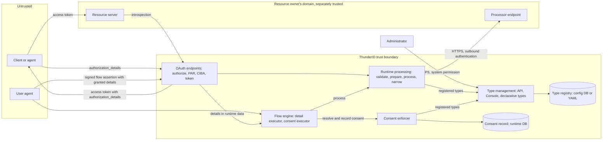
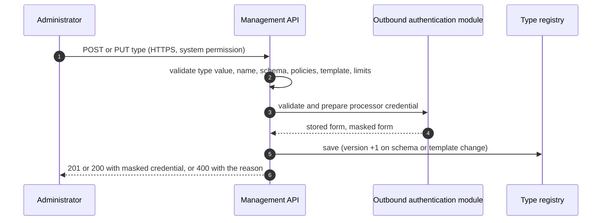
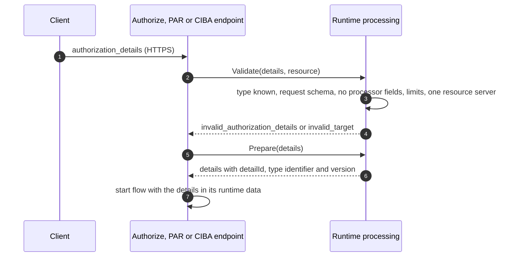
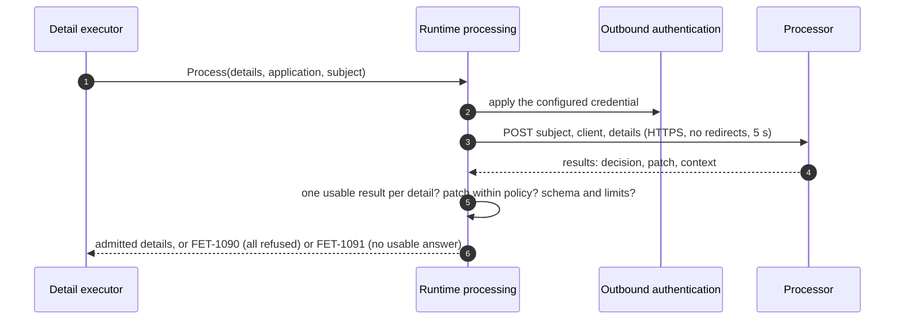
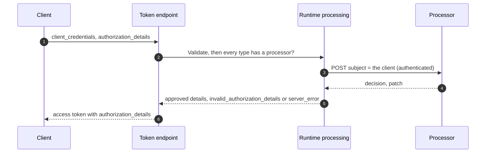
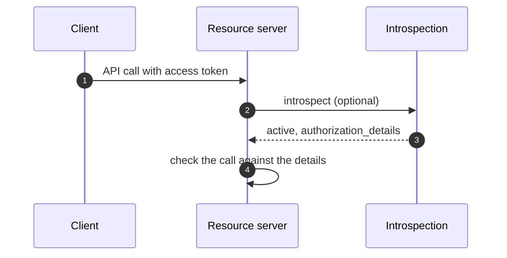

# Rich Authorization Requests Threat Model

This model covers RFC 9396 Rich Authorization Requests: the registry of authorization details types and its management API, the `authorization_details` parameter on the authorization, PAR, CIBA and token endpoints, the outbound call to a type's processor, consent and its record, and the authorization details carried in tokens and introspection.

## Overview

`ThunderID` lets a client request `authorization_details`, structured objects such as "pay 35.00 EUR to Merchant A", instead of, or alongside, broad scopes. A resource server registers the types it understands. Each requested detail is validated against its type, decided on by the type's processor (the resource owner's own system, reached over HTTPS), and approved or denied by the user, and the approved details are carried in the access token for the resource server to enforce.

The security-relevant behaviour is that a token never carries more than was requested and approved. Validation refuses unknown types and fields, the processor's answer is accepted only within each field's policy, every later change goes through one comparator that only narrows, and any failure to obtain a decision fails the request rather than letting details through. The entry points are the management API, the OAuth endpoints, the processor call, and the consent prompt.

Cross-cutting concerns covered elsewhere: client authentication, the authorization code, refresh token and `client_credentials` grants, PKCE, DPoP and token signing (the OAuth 2.0 Authorization and Core Grants model and the Token and Protocol Features model); the authentication flow and login UI (the Flow Execution model); credential storage and request authentication for outbound calls (the shared outbound authentication module, [discussion #5552](https://github.com/thunder-id/thunderid/discussions/5552)). These are referenced here as trust inputs, not re-analysed.

## Scope

This model covers:
- The authorization details type management API (`/resource-servers/{rsId}/authorization-detail-types`), the Console editor, declarative type files, and import and export of types
- Validation of `authorization_details` on `GET /oauth2/authorize`, PAR, the CIBA backchannel authentication request, and the token endpoint for `client_credentials`
- The outbound processor call, and how its answer is applied
- The consent prompt for details, the recording of decisions, and the reuse of earlier approvals
- Authorization details in the token response, access token, refresh token and introspection, and narrowing at the code exchange, the CIBA token poll and refresh
- Refusal of `authorization_details` on token exchange

Out of scope (see the referenced companion models):
- The grants themselves: client authentication, code, PKCE and refresh token handling, covered by the OAuth 2.0 Authorization and Core Grants model
- Token signing, the token model, DPoP and CIBA polling, covered by the Token and Protocol Features model
- The authentication flow and the login UI's rendering, covered by the Flow Execution model
- How outbound credentials are configured, stored, masked and applied, covered by the shared outbound authentication module ([discussion #5552](https://github.com/thunder-id/thunderid/discussions/5552))
- Token revocation and its enforcement, covered by the Token Revocation model

## Architecture



### Components

Type management (`authzdetail/mgt`) owns the registry and serves the registered types read-only to runtime processing (`authzdetail/exec`), which owns Validate, Prepare, Process and Narrow, and to the consent enforcer, which owns consent for details as it does for attributes and permissions. The control plane runs only type management. Details move through a login by value in the flow's server-side runtime data, as the authorized permissions do, and the flow's signed assertion carries the granted details to the authorization callback.

| Component | Task |
| --- | --- |
| Management API | CRUD on types under a resource server, keyed by UUID. Validates the schema, policies, consent template, processor and limits before saving, and refuses changes to declarative types. Requires the root system permission. |
| Console editor | Edits types on the resource server's page. Applies the same rules as the server; the server remains the authority. |
| Declarative loader, exporter, import adapter | Load types from YAML files with the API's validation, export non-declarative types, and import them by id after their resource servers. |
| Validate and Prepare | Parses `authorization_details`, resolves each type, validates each detail against its request schema with objects closed recursively, refuses fields the processor supplies, checks limits, and binds all details to one resource server. Prepare gives each detail a server-generated `detailId` and the identifier and version of its type before the details enter the flow. |
| Authorization detail executor (Process) | After authentication, posts each processor endpoint's details in one call, applies `decision` and the JSON Pointer patch within the field policies, re-validates against the full schema, and fails the flow on any unusable answer. |
| Processor client | HTTPS (HTTP only on loopback), no redirects, 5 s timeout, 1 MiB response cap, one reused HTTP client; endpoints are called concurrently and no call is retried. Authenticates through the shared outbound authentication module. |
| Consent executor and consent enforcer | The executor passes the details to the consent enforcer with the attributes and permissions. The enforcer reads the user's consent record to find earlier approvals that cover a detail, shows each other detail as a consent purpose in the same prompt, rendered from server-side state, holds each prompted detail in the signed consent session token, and records the approvals later requests may reuse in the same record write. The executor takes the user's approve or deny per detail and grants only approved or covered details. |
| Narrow (comparator) | Allows only the changes a field's policy gives the party making them: the processor, the client at the token endpoint, or the reuse check. Numbers are compared exactly; dates and instants by value. |
| Token issuance and introspection | Carry the granted details as plain objects without internal identifiers; the refresh token keeps only reusable details. |
| Flow assertion | The signed assertion the flow returns to the login UI, which posts it to the authorization callback in a JSON body. It carries the granted details, and the callback issues the code with them; an assertion without them is refused with `access_denied`. |
| Consent record | The user's existing consent record for the application, holding approvals of reusable types in the `authorization_detail` namespace with the requested and granted values. |

### Actors

#### Actors

The OAuth client and the processor are software; they are shown as actors here because each is a separately trusted party in this area.

| Actor | Description | Roles or permissions |
| --- | --- | --- |
| Administrator | Registers and edits types, their policies and processor, and manages declarative files and imports. | Root system permission |
| Client or agent | Requests details, redeems codes, refreshes, and narrows; with `client_credentials`, requests details for itself. | Registered OAuth client |
| User | Authenticates and approves or denies each detail. | N/A |
| Processor | The resource owner's system: decides on each detail and may fill in or lower values within the field policies. | Authenticates the caller as ThunderID through the configured outbound mechanism |
| Resource server | Verifies the token and enforces the granted details, including any counts or caps they describe. | N/A |
| Malicious actor | An adversary, external or an authenticated client or user, attempting to obtain details beyond what was approved, tamper with details or decisions, impersonate ThunderID to a processor or a processor to ThunderID, or exhaust resources. | N/A |

#### Entitlement matrix

| Actor | Manage types | Request details | Decide on details | Approve details | Narrow a grant | Read granted details |
| --- | --- | --- | --- | --- | --- | --- |
| Administrator | Yes | No | No | No | No | No |
| Client or agent | No | Yes | No | No | Yes, its own grant | Yes, its own tokens |
| User | No | No | No | Yes, their own | No | No |
| Processor | No | No | Yes, details sent to it | No | No | No |
| Resource server | No | No | No | No | No | Yes, tokens presented to it, and introspection |
| Malicious actor | No | Yes, as any client, refused unless valid | No | No | Only with a stolen grant and client credentials | No |

### External Dependencies (not owned)

| Dependency | Description (usage, purpose, authentication, authorization, security) |
| --- | --- |
| Processor endpoint | The resource owner's HTTPS service that decides on and enriches details. ThunderID authenticates to it through the shared outbound authentication module and treats its answer as untrusted input bounded by the field policies. Its availability is required for types that declare it. |
| Shared outbound authentication module | Configures, validates, stores, masks and applies the credential ThunderID presents to the processor: none, bearer, API key, Basic, and later OAuth 2.0 client credentials and mutual TLS ([discussion #5552](https://github.com/thunder-id/thunderid/discussions/5552)). |
| OAuth grants and token service | Client authentication, code and refresh token handling, token signing; covered by the OAuth 2.0 Authorization and Core Grants and Token and Protocol Features models. |
| Flow engine and login UI | Runs the executors and renders the consent purposes; covered by the Flow Execution model. |
| Consent service | Stores the consent record and enforces its validity and status. |
| Resource provider | Resolves resource servers and their identifiers; internal access only. |
| Shared rule package (`internal/system/rule`) | Exact numeric and date ordering used by the comparator, shared with federated authorization mapping. |
| Config DB, runtime DB | The registry table, the consent record, and the flow's runtime data holding the details during a login. Encryption at rest and access control are managed at the infrastructure layer. |

## Threats and mitigations

### Out-of-scope interactions and risks

- Client authentication, code, PKCE, DPoP and refresh token handling, and token signing, covered by the OAuth 2.0 Authorization and Core Grants and Token and Protocol Features models. This model relies on them to bind a grant to its client.
- The authentication flow, step-up and the login UI, covered by the Flow Execution model. The consent purposes are rendered from server-side state described here.
- How the processor credential is stored, masked, rotated and applied, covered by the shared outbound authentication module ([discussion #5552](https://github.com/thunder-id/thunderid/discussions/5552)).
- The processor's own authorization decisions and data handling, and the resource server's enforcement of the granted details, including use counts and rolling caps a detail describes: the resource owner's responsibility.
- Rate limiting, request body size limits and bot detection on the OAuth and management endpoints: outside the product's core by design; applied at the deployment or gateway layer, see the Production Deployment Guidelines.
- TLS configuration, database encryption at rest and infrastructure access control: managed at the deployment layer.

### Interactions

#### [01]: Managing authorization details types

**Description**

An administrator creates, updates, lists or deletes a type through the management API or the Console, or supplies it as a declarative YAML file or an import. The server validates the type value, name, JSON Schema (2020-12, objects closed recursively, no dotted property names, ordered limits consistent), each field policy, the consent template's placeholders, the processor endpoint and its outbound credential, and that processor rules have a processor. The version increments when the schema or template changes. Declarative types are read-only, and a resource server cannot be deleted while it has types.

**Assets involved**

| Initiator | Intermediate | Target |
| --- | --- | --- |
| Administrator (Console, API client, declarative files, import) | Management API, declarative loader, import adapter | Type registry |

**Data flow**



**Security considerations**

| Area | Response | Comments |
| --- | --- | --- |
| Data confidentiality | [C-Medium] | Definitions are configuration; the processor credential is confidential and handled by the outbound authentication module. |
| Communication medium | [M-NT] | Declarative files are [M-FS]. |
| Transport security | TLS | |
| Authentication | Bearer access token | Management authentication is cross-cutting. |
| Accessibility | Restricted | |
| Authorization and Access Control | Root system permission | Declarative types cannot be changed through the API; the Console enforces the same rules but is not trusted to. |

**Threat assessment**

| ID | Category | Threat | Materializable | Mitigation / comment |
| --- | --- | --- | --- | --- |
| 1 | Elevation of Privilege | A non-administrator creates or changes a type, for example widening a field's policy so later requests are approved for more. | No | The endpoints require the root system permission. |
| 2 | Tampering | A definition that silently admits more than intended: an open schema, a policy on an unordered field, limits in the wrong place, or a minimum above the maximum. | No | Objects are closed to undeclared fields recursively; a field without a policy cannot change; `decrease` and `increase` are accepted only on `number`, `date` and `date-time`; number limits must use the schema's own keywords; inconsistent limits, dotted names and unknown policy settings are refused with the reason. |
| 3 | Tampering | Processor rules on a type without a processor, leaving processor-supplied fields unset or making every request fail. | No | Refused at save: a type whose fields the processor supplies or may change must declare a processor. A required processor-supplied field is required only after the processor has answered. |
| 4 | Spoofing | A consent template that misleads the user, for example naming a field that does not exist so the summary renders with gaps. | No | Each placeholder must name a declared field; a summary with a missing value is not shown at all. The template is the administrator's text and is trusted as such. |
| 5 | Information Disclosure | The processor credential is exposed through the API, exports or logs. | No | The outbound authentication module stores the credential in its protected form and returns it masked ([discussion #5552](https://github.com/thunder-id/thunderid/discussions/5552)). |
| 6 | Tampering | A processor endpoint pointed at an internal service or over plain HTTP, sending details in clear or to an unintended host. | Partial | Only administrators set the endpoint, and the processor client does not follow redirects. HTTPS is required except on a loopback host, where plain HTTP is accepted in every deployment, not only in development. Hosts on private networks are accepted over HTTPS, since processors commonly run inside the resource owner's network; the endpoint is administrator configuration and is trusted as such. See Residual risks. |
| 7 | Tampering | A changed definition is applied to approvals and processor answers given for the earlier one, including while a login is in progress. | No | The version increments when the schema or template changes; earlier approvals count only on their type identifier and version, and the processor is told the version it answers for. A request records each type's identifier and version when it starts; processing, the consent prompt and the decision each check them, and a type changed or deleted in between fails the request (`RAR-5004`). A type deleted after the decision is left out of the refresh token at the code exchange, without failing it. |
| 8 | Tampering | A declarative type is overwritten or deleted at runtime, or a resource server is deleted leaving its types orphaned. | No | Declarative types are read-only (`RAR-1016`); resource server deletion is refused while types exist. Imports and declarative files are validated as the API validates, with duplicate ids and type values refused. |
| 9 | Repudiation | A change to a type cannot be traced to the administrator who made it. | Yes | See Residual risks: no standardized audit logging. |

#### [02]: Requesting authorization details

**Description**

A client sends `authorization_details` on `GET /oauth2/authorize`, PAR or a CIBA backchannel authentication request. Validate parses the array, resolves each type, validates each detail against its type's request schema and limits, refuses fields the processor supplies, and binds all details to one resource server consistent with `resource`. Valid details are prepared, each with a server-generated `detailId` and its type's identifier and version, and enter the flow in its server-side runtime data.

**Assets involved**

| Initiator | Intermediate | Target |
| --- | --- | --- |
| Client or agent | Authorization, PAR or CIBA endpoint | Runtime processing, flow runtime data |

**Data flow**



**Security considerations**

| Area | Response | Comments |
| --- | --- | --- |
| Data confidentiality | [C-Medium] | Details may carry financial or personal values. With PAR they do not pass through the browser. |
| Communication medium | [M-NT] | |
| Transport security | TLS | |
| Authentication | Client authentication where the endpoint requires it | Covered by the OAuth core grants model. |
| Accessibility | Public | |
| Authorization and Access Control | Schema and policy validation | Any client may request any registered type; the processor and the user decide. |

**Threat assessment**

| ID | Category | Threat | Materializable | Mitigation / comment |
| --- | --- | --- | --- | --- |
| 1 | Tampering | A client adds fields the type does not declare to smuggle authority past the resource server. | No | Objects are closed recursively; unknown fields are refused (RFC 9396 section 5). |
| 2 | Spoofing | A client supplies a value the processor is meant to supply, such as the debtor account. | No | A request carrying a processor-supplied field is refused. |
| 3 | Elevation of Privilege | A client requests details for several resource servers in one request so one token reaches more than one audience. | No | All details must belong to one resource server consistent with `resource`; otherwise `invalid_target`. |
| 4 | Tampering | A client or user alters the details a flow decides on after validation. | No | The details are held in the flow's server-side runtime data and never accepted from the client or the browser after validation; `detailId` values are server-generated. Executors in a flow are trusted with them, as they are with the authorized permissions. |
| 5 | Denial of Service | A large `authorization_details` array drives validation, processor calls and storage for every entry. | No | A request carries at most 50 details, refused before any validation, processor call or storage; each detail is validated against a closed schema with its limits. The details live in the flow's runtime data and go with the flow, so nothing else grows with them. Request body size limits, rate limiting and bot detection are outside the product's core and belong at the deployment or gateway layer; see the Production Deployment Guidelines. |
| 6 | Information Disclosure | Details sent on the front channel are exposed in browser history or logs. | No | Clients that carry sensitive values should use PAR. Detail values are not logged. |

#### [03]: The processor call

**Description**

After authentication, the authorization detail executor posts every detail served by one processor endpoint in one request, naming the subject (`user`, or the `application` or `agent` itself for `client_credentials`), the client, and each detail with its internal id and type version. ThunderID authenticates the call through the shared outbound authentication module with the mechanism configured on the type ([discussion #5552](https://github.com/thunder-id/thunderid/discussions/5552)). Only `decision: false` refuses a detail. A JSON Pointer patch is applied only within the field policies, and the result is validated against the full schema and limits. Any unusable answer fails the request.

**Assets involved**

| Initiator | Intermediate | Target |
| --- | --- | --- |
| Authorization detail executor | Processor client, outbound authentication module | Processor endpoint |

**Data flow**



**Security considerations**

| Area | Response | Comments |
| --- | --- | --- |
| Data confidentiality | [C-High] | The call carries the subject's identifier and the details, which may include financial data. |
| Communication medium | [M-NT] | Crosses into the resource owner's domain. |
| Transport security | TLS | HTTP only on a loopback host; mutual TLS when the outbound module offers it. |
| Authentication | Outbound authentication module | Bearer, API key, Basic, and later OAuth 2.0 client credentials and mutual TLS ([discussion #5552](https://github.com/thunder-id/thunderid/discussions/5552)). |
| Accessibility | Restricted | The processor should accept only authenticated calls. |
| Authorization and Access Control | Field policies | The processor is trusted to decide, never to widen. |

**Threat assessment**

| ID | Category | Threat | Materializable | Mitigation / comment |
| --- | --- | --- | --- | --- |
| 1 | Spoofing | An attacker calls the processor pretending to be ThunderID to obtain subject data or approvals. | No | Calls are authenticated through the outbound authentication module; the processor verifies the credential. A type configured with the `none` mechanism leaves this to network controls; see Residual risks. |
| 2 | Elevation of Privilege | A compromised or faulty processor widens a detail, for example raising an amount or changing the payee. | No | Each change is checked by the comparator with the processor as the party: only fields it supplies, and only the modifications its policies allow in their direction. The patched detail is validated against the schema and limits again. |
| 3 | Tampering | A processor answers for the wrong detail, twice, or for another type version. | No | Results are matched by `detailId`; a missing, repeated or undecided result fails the request. A processor that does not support the version should answer with an error status. |
| 4 | Elevation of Privilege | An unreachable processor, or one answering an error status meaning "not allowed", lets details through unchecked. | No | Any status other than 200, a redirect, a timeout, an oversized or undecodable body fails the request; only `decision: false` refuses. No setting lets details through unchecked. |
| 5 | Information Disclosure | Details or the credential are sent to another host through a redirect. | No | The processor client does not follow redirects. |
| 6 | Information Disclosure | A processor's refusal reason leaks internal detail to users or clients. | No | `reason_user` is shown, cut to 200 characters; `reason_admin` is only logged. The processor chooses what each contains. |
| 7 | Denial of Service | A slow or oversized processor answer stalls logins or exhausts memory. | No | 5 s timeout and 1 MiB response cap; one call per endpoint per request, with the endpoints called concurrently, so a request waits at most about 5 s however many processors it involves. A failed call cancels the others. A processor outage fails only requests for its types. Limiting how often clients can cause processor calls is rate limiting, which belongs at the deployment or gateway layer. |
| 8 | Privacy Risk | The processor receives more about the subject than it needs. | No | Only the subject's identifier and type, the client and the requested details are sent, and only after authentication (RFC 9396 section 13). |
| 9 | Tampering | A processor reserves or allocates on every call, so the same action is reserved more than once. | No | ThunderID does not retry a failed call. Every call for one authorization request carries the same `detailId` values, so a processor called again for that request can recognize it; a new authorization request, including one a client starts after a failure, gets new values. A processor that reserves must expire reservations that are not used, keyed by `detailId`. |
| 10 | Repudiation | A processor's decision on a detail cannot be traced afterwards, for example when a user disputes a refusal. | Partial | The processor's `reason_admin` is logged at debug level only; no standardized audit event records the decision. See Residual risks. |

#### [04]: Consent and its record

**Description**

The consent executor passes the processed details to the consent enforcer with the attributes and permissions. The enforcer shows each detail no earlier approval covers as a consent purpose with the type's name, the summary rendered from the template, and one row per field, all from server-side state, and holds each prompted detail in the signed consent session token. The user approves or denies each detail. The executor grants the approved and covered details, and the flow's signed assertion carries them to the authorization callback. Approvals of reusable types are recorded in the user's consent record for the application, in the `authorization_detail` namespace, with the requested and granted values taken from the session token, in the same record write as attribute and permission consent; denials and approvals of `reuse: false` types are not recorded, and an approval on a new type version replaces the type's elements of earlier versions. A detail is covered, and not prompted, when an approved element of the same type and version that the request stays within exists in the active record, unless the type has `reuse: false` or the client sends `prompt=consent`.

**Assets involved**

| Initiator | Intermediate | Target |
| --- | --- | --- |
| User (browser or CIBA device) | Flow engine and login UI | Consent executor, consent enforcer, consent record, authorization callback |

**Data flow**

```mermaid
sequenceDiagram
  autonumber
  participant U as User
  participant FL as Consent executor
  participant S as Consent enforcer
  participant CR as Consent record
  participant A as Authorization callback
  FL->>S: resolve consent (attributes, permissions, details)
  S->>CR: read active record (earlier approvals)
  S-->>FL: purposes for uncovered details, signed session token holding them
  FL->>U: summary and rows per detail
  U->>FL: approve or deny per detail (identifiers and booleans)
  FL->>S: record the decisions with the session token
  S->>CR: one write: attributes, permissions, reusable approvals; reset validity
  FL->>FL: grant approved and covered details only
  U->>A: signed flow assertion with the granted details (JSON body)
  A->>A: verify signature; no granted details claim means access_denied
```

**Security considerations**

| Area | Response | Comments |
| --- | --- | --- |
| Data confidentiality | [C-High] | The record holds requested and granted values. |
| Communication medium | [M-NT], [M-DB] | |
| Transport security | TLS | |
| Authentication | Authenticated user | From the flow. |
| Accessibility | Restricted | |
| Authorization and Access Control | Server-side state | The submission names details and decisions; values come from the flow's runtime data and the signed session token. |

**Threat assessment**

| ID | Category | Threat | Materializable | Mitigation / comment |
| --- | --- | --- | --- | --- |
| 1 | Tampering | The browser submission alters the values approved, for example raising an amount. | No | The submission carries only detail identifiers and booleans; granted values are taken from server-side state, and recorded values from the signed session token. |
| 8 | Tampering | The user agent alters the granted details in the flow assertion on its way to the authorization callback. | No | The assertion is signed by ThunderID and verified before the request is loaded; an assertion that cannot be read is refused. A missing claim means the flow did not decide, and the request is refused with `access_denied`. |
| 9 | Information Disclosure | The flow assertion exposes the granted details, with their `detailId` and type identifiers, to the user agent, and in app-native authentication to the client. | No | The values are the ones the user was shown and the client receives in the token. The assertion is posted in a JSON body, not a URL, so it does not reach browser history or referrers. `detailId` values identify details only within one authorization request. |
| 2 | Spoofing | Client-controlled values mislead the user on the consent screen, for example a payee name crafted to look like a refund. | No | Values are rendered as text from the validated detail; administrators bound them with `maxLength`, `pattern` or `enum`, and the Console starts text fields at 100 characters. The text is the client's; see Residual risks. |
| 3 | Elevation of Privilege | An earlier approval is reused for a wider request. | No | Covered only when the request stays within the approval in each field's allowed direction, with every other field equal, on the same type identifier and version (a type deleted and created again does not match), in the active record. `reuse: false` types are never covered, and `prompt=consent` forces a prompt. |
| 4 | Elevation of Privilege | A denied or timed-out prompt still grants details an earlier approval covered. | No | A denial or timeout grants nothing, covered details included. |
| 5 | Elevation of Privilege | Details skip the processor and reach consent unchecked. | No | Consent refuses details whose type declares a processor unless they were admitted by the executor (`RAR-5001`). |
| 6 | Repudiation | A user disputes approving a detail. | Partial | The consent record keeps reusable approvals with the requested and granted values; denials and one-off approvals are not kept, and standardized audit events are missing, see Residual risks. |
| 7 | Privacy Risk | Approved values are kept longer than needed, or accumulate with every login. | No | Only approvals of reusable types on the type's current version are kept; denials and one-off approvals are not recorded. They live in the consent record with its validity and status, and are removed with it. |

#### [05]: Tokens, refresh and narrowing

**Description**

At the code exchange and the CIBA token poll, the granted details are put in the token response, the access token and introspection, without internal identifiers. The refresh token keeps only details of types that allow reuse. On the code exchange, the CIBA poll or a refresh, a client may send `authorization_details` to obtain a token with less: each entry must narrow a distinct granted detail within the changes its policy allows the client. The grant keeps the type identifier and version its details were approved on, and an entry is refused when its type is no longer that one. Token exchange refuses the parameter.

**Assets involved**

| Initiator | Intermediate | Target |
| --- | --- | --- |
| Client or agent | Token endpoint | Runtime processing (Narrow), token service |

**Data flow**

```mermaid
sequenceDiagram
  autonumber
  participant C as Client
  participant TE as Token endpoint
  participant S as Runtime processing
  C->>TE: code, auth_req_id or refresh token, optional authorization_details
  TE->>S: Narrow(granted, requested)
  S->>S: pair entries with distinct granted details; policy, schema, limits
  S-->>TE: narrowed details or invalid_authorization_details
  TE-->>C: access token and response with authorization_details
```

**Security considerations**

| Area | Response | Comments |
| --- | --- | --- |
| Data confidentiality | [C-High] | Tokens carry the granted details. |
| Communication medium | [M-NT] | |
| Transport security | TLS | |
| Authentication | Client authentication, PKCE, DPoP | Covered by the OAuth core grants model. |
| Accessibility | Public | |
| Authorization and Access Control | The granted set | A token never carries more than the grant. |

**Threat assessment**

| ID | Category | Threat | Materializable | Mitigation / comment |
| --- | --- | --- | --- | --- |
| 1 | Elevation of Privilege | A client widens a granted detail when narrowing, for example a higher amount or an extra action. | No | The comparator allows only the client's permitted modifications in their direction, and the entry must still match the schema and limits. |
| 2 | Elevation of Privilege | A client claims one approval twice by sending two entries that both narrow it. | No | Each granted detail serves at most one entry; entries that cannot all be paired are refused. |
| 3 | Elevation of Privilege | A one-off approval is renewed indefinitely through refresh. | No | Details of types with `reuse: false` are left out of the refresh token. |
| 4 | Elevation of Privilege | Details are widened or carried to another party through token exchange. | No | Token exchange refuses `authorization_details` and does not propagate details. |
| 5 | Information Disclosure | Internal identifiers or processor data reach the client beyond the approved detail. | No | Tokens, responses and introspection carry plain detail objects without `detailId`. |
| 6 | Elevation of Privilege | A refresh token keeps reusable details after the approval behind them expires. | Yes | As for scopes, a refresh token is not cut short when the consent record expires; bounded by the refresh token's lifetime and revocation. See Residual risks. |
| 7 | Elevation of Privilege | A type's policies are loosened after a grant, and a client narrows the old grant under the new rules, changing a field the user approved as fixed. | No | The authorization code, the CIBA request and the refresh token carry the identifier and version of each granted type. Narrowing is refused when the type is on another version, deleted, or deleted and created again under the same value; the grant stays usable as granted. |
| 8 | Tampering | A client edits the details or the type identifiers and versions carried on its refresh token. | No | The refresh token is a signed JWT verified before use (Token and Protocol Features model); its claims cannot change without invalidating the signature. |
| 9 | Denial of Service | A large narrowing request drives the comparator and the pairing of entries. | No | Every request is client-authenticated before any work; a request carries at most 50 entries, each paired against at most 50 granted details. Rate limiting is outside the product's core and belongs at the deployment or gateway layer; see the Production Deployment Guidelines. |
| 10 | Repudiation | The issuance of a token carrying details cannot be traced afterwards. | Yes | Token issuance is not recorded as a standardized audit event, as for scopes. See Residual risks. |

#### [06]: Client credentials with authorization details

**Description**

A client sends `authorization_details` with `client_credentials` to obtain details for itself. With no user to consent, every requested type must declare a processor, which is told the client itself is the subject. Refused details are left out; when every detail is refused the response is `invalid_authorization_details` with the processor's reason, and an unusable answer is `server_error`.

**Assets involved**

| Initiator | Intermediate | Target |
| --- | --- | --- |
| Client or agent | Token endpoint | Runtime processing, processor |

**Data flow**



**Security considerations**

| Area | Response | Comments |
| --- | --- | --- |
| Data confidentiality | [C-Medium] | |
| Communication medium | [M-NT] | |
| Transport security | TLS | |
| Authentication | Client authentication | Covered by the OAuth core grants model. |
| Accessibility | Public | |
| Authorization and Access Control | The processor | The only party that decides without a user. |

**Threat assessment**

| ID | Category | Threat | Materializable | Mitigation / comment |
| --- | --- | --- | --- | --- |
| 1 | Elevation of Privilege | A client grants itself details no one checks, since there is no user to consent. | No | A type without a processor cannot be requested with `client_credentials`. |
| 2 | Elevation of Privilege | An outage lets details through unchecked. | No | An unusable processor answer is `server_error`; nothing is issued. |
| 3 | Spoofing | The processor cannot tell a client acting for itself from a user. | No | The subject's type is `application` or `agent` for `client_credentials` and `user` otherwise. |
| 4 | Denial of Service | A client drives processor calls with repeated token requests. | No | The client is authenticated before any processor call; each request carries at most 50 details, one call per endpoint, bounded by the 5 s timeout. Rate limiting is outside the product's core and belongs at the deployment or gateway layer; see the Production Deployment Guidelines. |
| 5 | Repudiation | A processor's decision for a client cannot be traced afterwards. | Partial | As for [03]-10. See Residual risks. |

#### [07]: Resource server use of granted details

**Description**

The resource server verifies the access token or introspects it, reads `authorization_details`, and checks each call against them, for example that a payment's amount and payee match. ThunderID observes issuance, not use.

**Assets involved**

| Initiator | Intermediate | Target |
| --- | --- | --- |
| Client or agent | Resource server | Introspection endpoint |

**Data flow**



**Security considerations**

| Area | Response | Comments |
| --- | --- | --- |
| Data confidentiality | [C-High] | |
| Communication medium | [M-NT] | |
| Transport security | TLS | |
| Authentication | Token signature or introspection | Covered by the Token and Protocol Features model. |
| Accessibility | Restricted | |
| Authorization and Access Control | The resource server | Enforcement is the resource server's. |

**Threat assessment**

| ID | Category | Threat | Materializable | Mitigation / comment |
| --- | --- | --- | --- | --- |
| 1 | Elevation of Privilege | A token is used more times, or for more in total, than a detail intends (for example a use count or a rolling cap). | Yes | ThunderID carries the limits in the detail but cannot count uses of a self-contained token; the resource server enforces them. See Residual risks. |
| 2 | Elevation of Privilege | A resource server accepts a token whose details belong to another resource server. | No | All details in a grant belong to one resource server, which is the token's audience. |

## Security Review Checklist

A review aid that complements the threat models and the self-assessment. Guidance follows the [OWASP Top 10 Proactive Controls](https://top10proactive.owasp.org/).

### Security considerations

| # | Consideration | State | Comments |
| --- | --- | --- | --- |
| 1 | Are all inputs and outputs validated (syntactic and semantic)? | Yes | Type definitions, requested details, processor answers and narrowing entries are validated against the schema, policies and limits; objects are closed recursively; numbers and dates are compared exactly and by type. |
| 2 | Are rate limits in place where necessary? | N/A | Rate limiting and bot detection are outside the product's core by design and are applied at the deployment or gateway layer; see the Production Deployment Guidelines. Relevant to the OAuth endpoints carrying `authorization_details` ([02]-5) and, through them, processor calls ([03]-7). The product bounds each request: at most 50 details, and a 5 s timeout and 1 MiB response per processor call. |
| 3 | Are permissions, roles, and entitlements defined on the principle of least privilege and business need? | Yes | Type management needs the root system permission; a field without a policy cannot change; each change is limited to the party and direction its policy names. |
| 4 | Are authentication and authorization validated at both the UI and API layers, front end and back end, before granting access to resources? | Yes | The Console applies the server's rules, and the server enforces them independently. |
| 5 | Are proper isolations in place between components to ensure least-privilege access and reduce the blast radius against lateral movement? | Yes | The control plane runs only type management and links no runtime processing, processor or consent code; detail payloads stay in the flow's server-side runtime data; a processor sees only its own types' details. |
| 6 | Have any default credentials been changed, and are default superuser or root accounts not in use (when using third-party components)? | N/A | |
| 7 | Has the implementation followed best-practice guidelines (OWASP, Kubernetes, vendor, or technology provider)? | Yes | RFC 9396 sections 5, 6, 7 and 13; fail-closed external decisions; no redirects on outbound calls. |
| 8 | Are secrets, credentials, and internal-only material kept out of the public source tree and its git history? | Yes | Processor credentials are configuration, stored by the outbound authentication module. |
| 9 | Was a security-focused code review conducted for this change, and have the findings been addressed? | Yes | Covered by the product scan. |
| 10 | Is Static Analysis (SAST) or IaC scanning conducted, and are findings addressed? | Yes | Covered by the product scan. |
| 11 | Is Software Composition Analysis (SCA) conducted or integrated into the repository, and are findings addressed (for example FOSSA, Trivy)? | Yes | Covered by the product scan. No new dependency is added. |
| 12 | Is Dynamic (DAST) or API scanning conducted on a non-production setup, and are findings addressed? | Yes | Covered by the product scan. |
| 13 | Are audit logs generated in a standardized format for critical functionality, and available to authorized users to trace critical events and aid incident response? Note the retention period in Comments. | No | See Residual risks. |
| 14 | Do audit logs for critical configuration changes record the difference between the old and new versions? | No | See Residual risks. |
| 15 | Are data in transit and at rest encrypted? | Partial | TLS on ThunderID's own endpoints is configurable but optional, as for the OAuth endpoints. Processor calls require HTTPS except on a loopback host ([01]-6). Details are held plaintext in the flow's runtime data for the life of the flow. At-rest encryption of the registry, runtime DB and consent record is managed at the infrastructure layer. |
| 16 | Are sensitive values such as credentials and keys stored in a secret store or vault? | No | The processor credential is stored in the protected form the outbound authentication module defines ([discussion #5552](https://github.com/thunder-id/thunderid/discussions/5552)). As for client secrets, there is no secrets-manager integration. |
| 17 | Is personal, sensitive, or confidential data kept out of logs? | Yes | Detail values and processor credentials are not logged; logs carry the type, the endpoint, and the processor's `reason_admin` at debug level. |
| 18 | Have users been given clear instructions for secure usage? | Yes | The docs and API specs cover using PAR for sensitive values, bounding client text with `maxLength`, authenticating the processor, and enforcing counts at the resource server. |

### Business impact and resilience

For an open-source component, most of these are shared with the operator who deploys it. This section captures the project's defaults and recommendations; the rest is left to the deployer.

| # | Consideration | State | Comments |
| --- | --- | --- | --- |
| 1 | Has a business impact analysis been done to identify resilience requirements (maximum tolerable downtime, uptime, RPO, RTO)? | N/A | Left to the deploying organization. A processor's availability bounds the availability of logins that request its types. |

Resilience details to record:
- High availability requirements: the processor endpoint should be highly available, since an unusable answer fails the request
- Disaster recovery requirements: not defined at the project level
- Backups, frequency, and retention: the registry is configuration (or declarative files under version control); consent records are runtime data (deployer-owned)
- Health checks: not defined at the project level
- User banners: not defined at the project level

### Dependency and component health

| # | Consideration | State | Comments |
| --- | --- | --- | --- |
| 1 | Are dependencies, base images, and runtimes monitored for known vulnerabilities and kept current (for example automated dependency scanning), and are findings addressed? | Yes | Covered by the SCA scanning noted above (see Security considerations item 11). A formal patching-frequency SLA for product and dependency vulnerabilities is not yet defined. |
| 2 | Are any End-of-Life or End-of-Service components in use? | No | No new dependency is added; the area uses the same Go runtime and databases as the rest of `ThunderID`. |
| 3 | Is hardening guidance published for operators who deploy the project (optional)? | No | Deployment guidance exists (see Security considerations item 18); a dedicated hardening guide is not yet published. |

### Privacy considerations

| # | Consideration | State | Comments |
| --- | --- | --- | --- |
| 1 | Is the purpose and legal basis for processing personal data clearly defined? | Yes | Details are processed to obtain the user's authorization for a specific action, and recorded as their consent. |
| 2 | Are the collection, storage, processing, sharing, archival, and disposal of personal data aligned with the data minimization principle? | Yes | The processor receives only the subject's identifier and type, the client and the requested details, after authentication. The consent record keeps only approvals the reuse check reads: reusable types, on their current version. |
| 3 | Is personal data stored securely? | Partial | In the consent record and, for the life of a login, the flow's runtime data; encryption at rest and access controls for both are managed at the infrastructure layer and need verification. |
| 4 | Are privacy notices updated to reflect any new processing or changes to purpose and legal basis? | Partial | Not yet reviewed for this area. |
| 5 | Is access to personal data granted on a need-to-know basis? | Yes | |
| 6 | Are data retention requirements considered? | Yes | Details in a flow go with the flow; recorded approvals follow the consent record's validity and status, and are limited to reusable types on their current version. |
| 7 | Is there a process to dispose of personal data on request in a timely manner while meeting retention requirements? | Partial | Removed with the consent record; withdrawing a single approval is not available yet. |
| 8 | Are records of personal-data processing maintained in the project's data inventory or records of processing? | Partial | Not yet confirmed against the data inventory. |

## Residual risks (open items)

| Risk | Description | Current Status | Recommendation |
| --- | --- | --- | --- |
| Processor configured without authentication | The outbound authentication module allows the `none` mechanism, so an administrator can leave a processor unauthenticated, letting anyone who can reach it pose as ThunderID ([03]-1). | Accepted; administrator choice. | Configure bearer, API key, Basic, or, when available, OAuth 2.0 client credentials or mutual TLS ([discussion #5552](https://github.com/thunder-id/thunderid/discussions/5552)); restrict the processor to ThunderID's network otherwise. |
| Use counts and caps are enforced by the resource server | ThunderID observes issuance, not use, so limits such as a use count or a rolling cap in a detail are enforced by the resource server ([07]-1). | Accepted by design. | Resource servers enforce the limits they define, and revoke tokens through the revocation endpoint when exceeded; keep access token lifetimes short. |
| Refresh outlives the approval | As for scopes, a refresh token keeps reusable details after the consent record expires ([05]-6). | Accepted; consistent with scope consent. | Use `reuse: false` for one-off details; keep refresh token lifetimes bounded; revoke tokens on withdrawal. |
| Token revocation is incomplete | Criteria-based revocation enforces only the token-family and subject dimensions, so an issued access token keeps its granted details until it expires, as for scopes (see the OAuth 2.0 Authorization and Core Grants model). | Accepted; tracked by the criteria-based revocation plan. | Keep access token lifetimes short and revoke by `jti` where needed (thunder-id/thunderid#4127). |
| No per-detail withdrawal | A user cannot withdraw a single approved detail, and there is no view of outstanding approvals. | Accepted; planned in a later specification. | Revoke tokens and expire the consent record in the meantime. |
| Processor endpoint reach | An administrator can point a processor at a loopback host over plain HTTP, or at any host on a private network over HTTPS ([01]-6). The call carries the details and the subject's identifier to that host. | Accepted; the endpoint is administrator configuration. | Restrict type management to trusted administrators; avoid loopback processors outside development; restrict outbound traffic from ThunderID at the network layer. |
| Client-controlled consent text | A detail's values come from the client and are shown to the user ([04]-2). | Accepted; bounded by the schema. | Bound free text with `maxLength`, `pattern` or `enum`, and keep the summary template to administrator text with field values. |
| No standardized audit logging | Type changes, processor decisions, consent decisions and the issuance of tokens carrying details are not emitted as standardized audit events, and the consent record does not keep denials or one-off approvals ([01]-9, [03]-10, [04]-6, [05]-10, [06]-5). | Accepted; not yet implemented. | Add structured audit logging for critical functionality and configuration changes, with a retention policy (tracking: thunder-id/thunderid#2116). |

## Appendix

- Sample requests:

  ```http
  POST /oauth2/par
  client_id=acme-agent&response_type=code&code_challenge=…&code_challenge_method=S256
  &authorization_details=[{"type":"payment_initiation","instructedAmount":{"amount":45.00,"currency":"EUR"},"creditorName":"Merchant A"}]
  ```

  ```http
  POST {processor.endpoint}
  Authorization: <credential applied by the outbound authentication module>
  Content-Type: application/json

  {"subject":{"type":"user","id":"…"},"client":{"type":"agent","id":"acme-agent"},
   "details":[{"detailId":"d-7c20","type":"payment_initiation","typeVersion":3,"detail":{…}}]}
  ```

  ```json
  {"results":[{"detailId":"d-7c20","decision":true,
    "patch":{"/debtorAccount/iban":"DE89…","/instructedAmount/amount":35.00}}]}
  ```

- Sample token request narrowing a grant, and its response:

  ```http
  POST /oauth2/token
  grant_type=refresh_token&refresh_token=…&client_id=acme-agent
  &authorization_details=[{"type":"account_information","actions":["read"],"locations":["https://bank.example.com/v1"]}]
  ```

  ```json
  {"access_token":"eyJ…","token_type":"Bearer","expires_in":3600,"refresh_token":"eyJ…",
   "authorization_details":[{"type":"account_information","actions":["read"],
     "locations":["https://bank.example.com/v1"]}]}
  ```

- Sample audit logs: N/A; see Residual risks.

- References: RFC 9396 (Rich Authorization Requests), RFC 9126 (PAR), RFC 6901 (JSON Pointer), OpenID CIBA Core, OpenID AuthZEN Authorization API 1.0, [Rich Authorization Requests specification](spec.md), [discussion #5604](https://github.com/thunder-id/thunderid/discussions/5604), [discussion #5552](https://github.com/thunder-id/thunderid/discussions/5552). Companion models: OAuth 2.0 Authorization and Core Grants, Token and Protocol Features, Flow Execution, Token Revocation.

## Change log

| Version | Date | Change |
|---|---|---|
| 1.0.0 | 2026-10-07 | Initial threat model. |
