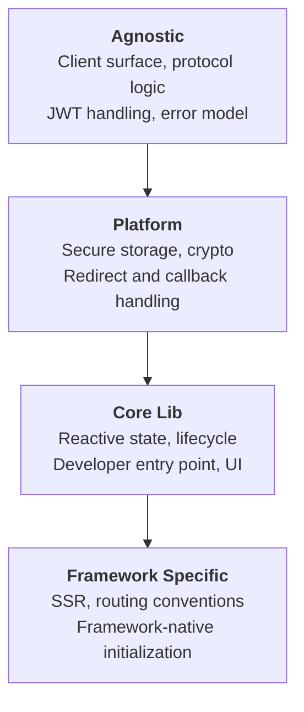
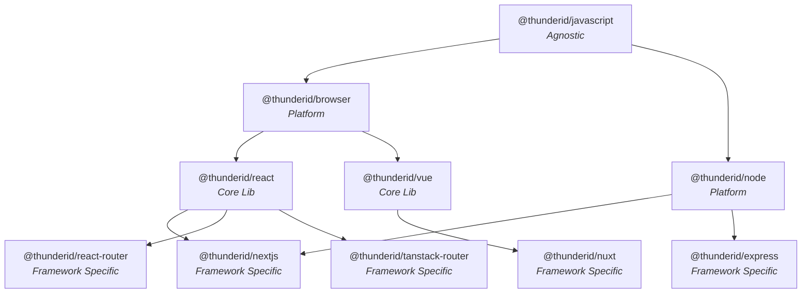
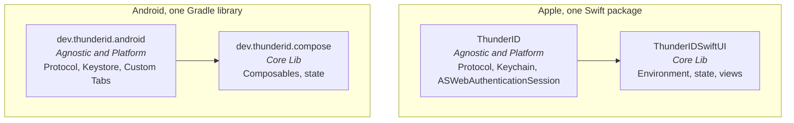
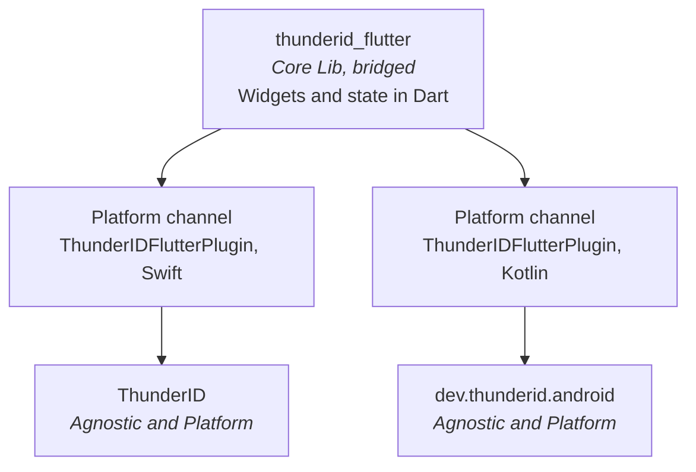

# SDK Development Specification

- **Status:** Draft
- **Version:** 0.1
- **Related documents:**
  [threat-model.md](threat-model.md),
  [#5305](https://github.com/thunder-id/thunderid/issues/5305),
  [#3292](https://github.com/thunder-id/thunderid/discussions/3292),
  [#4065](https://github.com/thunder-id/thunderid/discussions/4065),
  [#5354](https://github.com/thunder-id/thunderid/discussions/5354),
  [RFC 6749](https://datatracker.ietf.org/doc/html/rfc6749),
  [RFC 7636](https://datatracker.ietf.org/doc/html/rfc7636),
  [OpenID Connect Core 1.0](https://openid.net/specs/openid-connect-core-1_0.html)

## Summary

ThunderID publishes client SDKs across four repositories and three ecosystems. Nothing today
states what an SDK must implement, so each one is built to the conventions of whoever writes
it. Without a stated contract, a developer moving between platforms cannot predict the
surface, and a reviewer of a change in one repository has no way to tell whether the sibling
repositories need the same change.

This specification is the contract every ThunderID SDK implements. It defines the layering,
the operational modes, the configuration keys, the client surface, the error model, the
security floor, how each platform packages and builds its SDK, what has to be tested, and the
delivery rules that make a change in one SDK visible in the others.

Every SDK change goes through it. That includes writing a new SDK for a platform that has
none, adding or changing a capability in an SDK that already exists, and building an
integration package. The specification is the reference a contributor works from, the
checklist a reviewer works against, and the context an AI coding agent is given before it
writes SDK code.

The contract is behavioural rather than literal. An SDK conforms by exhibiting the specified
behaviour through the idioms of its own platform, so a Swift signature is expected to look
like Swift. Conformance is judged on names, returned concepts, and observable behaviour, not
on transliterated signatures.

Scope is the SDK repositories listed in [Repository topology](#repository-topology) and the
integration packages that adapt ThunderID into third-party auth frameworks. The ThunderID
server, the console, the CLI, and the MCP server are out of scope, as is the documentation
site itself beyond the obligations this document places on SDK authors.

## Architecture

### Layers

Every SDK occupies exactly one layer. A layer builds on the layer below it, inherits its
contract, and extends it with capabilities that only make sense at that level.

| Layer | Responsibility | Ships UI | Examples |
|---|---|---|---|
| Agnostic | The full client surface and all protocol logic: authorization requests, token exchange, JWT handling, flow orchestration, the error model. No platform, browser, or framework dependency. | No | `@thunderid/javascript` |
| Platform | Extends an Agnostic SDK with platform capabilities: native secure storage, platform crypto, redirect and callback handling, platform session management. | No | `@thunderid/browser`, `@thunderid/node`, `ThunderID` (Swift), `dev.thunderid:android` |
| Core Lib | Extends a Platform SDK with a framework's reactive primitives (state, lifecycle, context) and provides the developer-facing entry point. | Optional | `@thunderid/react`, `@thunderid/vue`, `ThunderIDSwiftUI`, `dev.thunderid.compose`, `thunderid_flutter` |
| Framework Specific | Thin integration for an opinionated or meta framework: server-side rendering, routing conventions, framework-native initialization. Builds on a Core Lib SDK. | Optional | `@thunderid/nextjs`, `@thunderid/nuxt`, `@thunderid/react-router`, `@thunderid/tanstack-router`, `@thunderid/express` |

The JavaScript ecosystem shows all four layers concretely, and the same shape applies
elsewhere:

The mobile ecosystems use the same layering, with the Agnostic and Platform layers collapsed
into one package. On Apple and Android platforms there is no separate language-only SDK,
because the protocol implementation and the platform capabilities ship together and have no
consumer that wants one without the other.

Flutter bridges the two rather than reimplementing either:

Two shapes deviate deliberately and are permitted:

- **Bridged cross-platform SDKs.** `thunderid_flutter` sits at Core Lib with no protocol
  implementation of its own. It delegates every protocol operation to the iOS and Android
  Platform SDKs over platform channels and implements only its widgets and state in Dart. A
  React Native SDK, if built, follows the same pattern over native modules.
- **Dependency-injection frameworks.** A framework whose module or injection system makes an
  intermediate reactive layer redundant may sit at Framework Specific directly on a Platform
  SDK. Angular is the expected case.

### Repository topology

SDKs no longer live in the product monorepo. Each ecosystem owns a repository, and a
repository may contain several packages across several layers.

| Repository | Contents | Registry |
|---|---|---|
| [`thunder-id/javascript-sdks`](https://github.com/thunder-id/javascript-sdks) | All JavaScript and TypeScript packages, all four layers, plus integration packages | npm, scope `@thunderid` |
| [`thunder-id/ios-sdks`](https://github.com/thunder-id/ios-sdks) | `ThunderID` (Agnostic and Platform) and `ThunderIDSwiftUI` (Core Lib) | Swift Package Manager and CocoaPods |
| [`thunder-id/android-sdks`](https://github.com/thunder-id/android-sdks) | `dev.thunderid.android` (Agnostic and Platform) and `dev.thunderid.compose` (Core Lib) | Maven coordinates under `dev.thunderid` |
| [`thunder-id/flutter-sdks`](https://github.com/thunder-id/flutter-sdks) | `thunderid_flutter` (Core Lib, bridged) | pub.dev |
| [`thunder-id/thunderid`](https://github.com/thunder-id/thunderid) | This specification, the published documentation under `docs/`, and the minimal use-case samples that ship with the product | Not applicable |
| [`thunder-id/samples`](https://github.com/thunder-id/samples) | Feature demos and showcases, organized by feature area | Not applicable |

The split means a single capability now lands as several pull requests in several
repositories with no shared branch, no shared CI run, and no single reviewer who sees all of
it. [Cross-SDK parity and delivery](#cross-sdk-parity-and-delivery) is the mechanism that
holds those pull requests together, and it is the reason this document exists rather than
being a page in the contributor guide.

## Detailed design

### Layering and dependency rules

1. An SDK MUST declare exactly one parent layer, except for a bridged cross-platform SDK,
   which declares one parent per bridged platform.
2. Two adjacent layers MAY be collapsed into one package where the lower one has no consumer
   of its own, as the Apple and Android packages collapse Agnostic into Platform. The package
   MUST still keep the layers separable in its own structure, and MUST document which layers
   it covers.
3. An SDK MUST NOT skip its immediate parent layer. If a capability is reachable through the
   parent, the SDK uses the parent rather than reaching past it.
4. An SDK MUST NOT reimplement logic already present in its parent, and MUST NOT expose the
   parent's internal types through its own public surface.
5. An SDK MUST declare its parent as a versioned dependency. In JavaScript, a Framework
   Specific package MAY express that dependency as a peer dependency where the ecosystem
   expects the application to own the version, as `@thunderid/react-router` and
   `@thunderid/tanstack-router` do today.
6. A breaking change in a layer requires a major version bump in that layer and in every layer
   above it that is affected.
7. Every SDK MUST record the version of this specification it implements, in its `README.md`.

### Integration packages

An integration adapts ThunderID into a third-party framework that already owns an auth
abstraction, such as Better Auth or Auth.js. An integration implements the target framework's provider or plugin interface instead of the
ThunderID client surface, and sits outside the layer hierarchy.

An integration MUST delegate every protocol operation to a ThunderID SDK, MUST NOT implement
OAuth 2.0 or OIDC logic of its own, MUST follow the target framework's conventions for
configuration, errors, and sessions, and MUST document the SDK version and the framework
version it supports. Integrations live alongside SDKs in the ecosystem repository, under
`packages/`, and are published under the same scope, as `@thunderid/better-auth` is today.

### Platform packaging and build

Each ecosystem packages its SDKs the way that ecosystem expects. An SDK MUST declare its
minimum supported platform version, and MUST NOT raise that minimum in a patch or minor
release.

| Ecosystem | Unit of distribution | Layers per unit | Minimum platform |
|---|---|---|---|
| JavaScript | One npm package per SDK, in a pnpm workspace built with Turborepo | One layer per package | Stated per package |
| Apple | One Swift package exposing two products, plus a CocoaPods podspec for the Platform product | `ThunderID` covers Agnostic and Platform, `ThunderIDSwiftUI` covers Core Lib | iOS 16, macOS 13, Swift 5.9 |
| Android | One Gradle library, consumed through JitPack | `dev.thunderid.android` covers Agnostic and Platform, `dev.thunderid.compose` covers Core Lib | minSdk 26, compileSdk 34, JVM target 17 |
| Flutter | One pub.dev plugin package declaring an Android and an iOS platform implementation | Core Lib only, bridged | Flutter 3.19, Dart 3.3 |

Rules that follow from this shape:

1. An Apple or Android SDK MUST keep the Core Lib product separable from the Platform product,
   so an application that supplies its own UI can depend on the Platform layer alone.
2. A bridged SDK MUST pin the native SDKs it bridges to as versioned dependencies, one per
   platform, and MUST NOT depend on a floating version. The pins are what make a native change
   reach the bridged SDK, so each repository MUST have a mechanism that raises them after a
   native release.
3. A bridged SDK MUST NOT implement protocol logic on the Dart or JavaScript side. A
   capability that is missing from one native SDK is a parity gap in that native SDK, not
   something to work around in the bridge.
4. A platform channel surface MUST mirror the client surface names, so that a capability keeps
   one name from the native SDK through the bridge to the application.
5. Platform capabilities that have no cross-platform equivalent, such as Play Integrity on
   Android and App Attest on Apple platforms, are declared by the Platform SDK that owns them
   and exposed through a single bridged name where a bridged SDK supports both.

### Operational modes

An SDK supports two modes. The mode is chosen at initialization and applies to every operation
for the lifetime of the client.

**Redirect mode** is the default. The SDK runs the OAuth 2.0 authorization code flow with
PKCE, sending the user to the ThunderID authorization endpoint and handling the callback. It
is the mode for anything that can safely redirect and receive a callback, and it is the mode
that keeps the application away from user credentials entirely.

**Embedded mode**, also called app-native, drives the ThunderID Flow Execution API directly
and keeps the user inside the application. The SDK posts to `/flow/execute` with an
`applicationId` and a `flowType`, receives a `flowId` with a `flowStatus` of `PROMPT_ONLY` and
a description of the inputs or actions the step requires, and submits each step back with the
`flowId`, the chosen action, and the collected inputs. A `flowStatus` of `COMPLETE` carries the
assertion; `ERROR` carries a `failureReason` the SDK surfaces as an authentication failure.
Multi-factor steps arrive as further `PROMPT_ONLY` steps and are surfaced to the application
the same way. It is the mode for native mobile and for any application that renders its own
authentication UI.

The mode is set through the `mode` configuration key, taking `redirect` or `embedded`. An SDK
MAY additionally infer `embedded` from configuration that only makes sense in that mode, such
as a sign-in path owned by the application, but inference is a convenience and MUST NOT be the
only way to select a mode.

The mode MUST NOT change the public surface. `signIn()` is `signIn()` in both modes; the SDK
resolves the underlying flow internally.

Alongside the two user-facing modes, an SDK MAY support a `client_credentials` grant type for
machine-to-machine use, in which there is no user and no sign-in step, and `getAccessToken()`
fetches and refreshes a token for the service itself.

### Configuration

Configuration is a single object supplied at initialization. Every SDK MUST implement the
required keys and SHOULD implement the optional ones. A key that cannot apply on a platform
MUST be documented as unsupported there rather than silently ignored.

Key names are canonical across SDKs, adapted only for the naming convention of the language.
An SDK MUST NOT rename a canonical key, and MUST NOT introduce a second name for a concept
this table already covers.

**Core**

| Key | Type | Required | Default | Notes |
|---|---|---|---|---|
| `baseUrl` | String | Yes | None | Base URL of the ThunderID server. MUST be rejected if the scheme is not HTTPS, except for loopback addresses in development. |
| `clientId` | String | Conditional | None | Required in redirect mode. |
| `clientSecret` | String | No | None | Confidential clients only. MUST NOT be accepted by a browser or other public client. |
| `mode` | Enum | No | `redirect` | `redirect` or `embedded`. |
| `grantType` | Enum | No | `authorization_code` | `authorization_code` or `client_credentials`. |
| `applicationId` | String | Conditional | None | Required in embedded mode and for branding resolution. |
| `instanceId` | Integer | No | None | Enables independent authentication contexts in one application. |

**Redirection**

| Key | Type | Required | Default | Notes |
|---|---|---|---|---|
| `afterSignInUrl` | String | No | Framework default | Must be pre-registered with the application. |
| `afterSignOutUrl` | String | No | Framework default | Must match an allowed post-logout URI. |
| `signInUrl` | String | No | Server-hosted page | Application-owned sign-in page. |
| `signUpUrl` | String | No | Server-hosted page | Application-owned sign-up page. |

**Protocol**

| Key | Type | Required | Default | Notes |
|---|---|---|---|---|
| `scopes` | String or list | No | `openid` | Space-separated string or list. |
| `signInOptions` | Map | No | Empty | Extra parameters on the authorize request. |
| `signOutOptions` | Map | No | Empty | Extra parameters on the sign-out request. |
| `signUpOptions` | Map | No | Empty | Extra parameters on the sign-up request. |
| `discovery` | Object | No | Enabled | OIDC discovery behaviour. |
| `endpoints` | Object | No | Discovered | Per-endpoint overrides for a server that does not publish discovery. |
| `tokenRequest` | Object | No | Platform default | Token endpoint authentication and request shaping. |

**Session and tokens**

| Key | Type | Required | Default | Notes |
|---|---|---|---|---|
| `storage` | Storage adapter | No | Platform default | See [Security requirements](#security-requirements). |
| `tokenValidation` | Object | No | Validation on | Per-claim validation switches and clock tolerance. Disabling validation is a testing affordance and MUST be documented as such. |
| `tokenLifecycle` | Object | No | Platform default | Refresh timing and lifecycle behaviour. |
| `allowedExternalUrls` | List | No | Empty | Base URLs the SDK may attach an access token to when tokens are held in isolated storage. |
| `syncSession` | Boolean | No | `false` | Synchronizes the application session with the server session. Subject to third-party cookie restrictions. |
| `organizationHandle` | String | No | None | Organization identifier, required when a custom domain is configured. |
| `organizationChain` | Object | No | None | Chained authentication across organization contexts. |

**Presentation**

| Key | Type | Required | Default | Notes |
|---|---|---|---|---|
| `preferences` | Object | No | None | Theme, internationalization, and user presentation options. SDKs without bundled UI MAY omit it and MUST say so. |
| `components` | Object | No | None | Per-component overrides for SDKs with bundled UI. |
| `extensions` | Object | No | None | Extension points for SDKs with bundled UI. |

Initialization MUST validate the object and fail before any network call when a required key
is missing or a value is malformed. Any operation invoked before initialization MUST fail with
a distinct, documented error rather than a null dereference.

### Client surface

Every SDK MUST expose the operations below. Names are canonical; the signature is whatever the
platform makes idiomatic. Return types are stated as the concept returned, and an SDK MUST NOT
return a different concept under the same name.

**Lifecycle**

| Operation | Contract |
|---|---|
| `initialize` | Validates configuration and prepares the client. Returns success. |
| `reInitialize` | Applies a partial configuration change without a full restart. |
| `getConfiguration` | Returns the effective configuration. |
| `isLoading` | Synchronous. True while initializing or refreshing. |

**Authentication and registration**

| Operation | Contract |
|---|---|
| `signIn` | Redirect mode starts the authorization code flow; embedded mode drives one step of the flow. Overloaded, or discriminated by payload, per platform idiom. |
| `signOut` | Terminates the session. Revokes the refresh token server-side before clearing local state. Succeeds silently when no session exists. |
| `signUp` | Redirect mode sends the user to registration; embedded mode drives the registration flow. |
| `isSignedIn` | Returns current authentication state. |
| `handleRedirectCallback` | Completes a redirect flow from the callback URL. Required wherever the SDK does not handle the callback implicitly. |

**Tokens and session**

| Operation | Contract |
|---|---|
| `getAccessToken` | Returns a valid access token, refreshing transparently when near expiry. |
| `exchangeToken` | Performs a token exchange (RFC 8693). |
| `decodeJwtToken` | Decodes a JWT payload without verifying its signature. MUST be documented as unsafe for authorization decisions. |
| `setSession`, `clearSession` | Write and clear stored session state. |

**User and profile**

| Operation | Contract |
|---|---|
| `getUser` | Returns the authenticated user. |
| `getUserProfile` | Returns the user's profile attributes. |
| `updateUserProfile` | Applies attribute updates server-side. Returns the updated profile. |
| `getUserSchema` | Returns the attribute schema that describes which profile fields exist, their types, and their mutability. |

Operations beyond this set are permitted where a platform needs them, and are the usual origin
of a parity gap. Silent sign-in, CIBA, passkey registration and authentication, platform
attestation, flow metadata retrieval, and account recovery all sit here: each is meaningful on
some platforms and not on others. An SDK adding an operation in this position MUST follow
[Cross-SDK parity and delivery](#cross-sdk-parity-and-delivery).

Organization operations (listing, reading, and switching organizations) are a specification
target and are deliberately not part of the required surface yet. An SDK MUST NOT ship a
partial implementation of them ahead of a specification update.

### Framework integration

A Core Lib or Framework Specific SDK MUST integrate into its framework's own composition
model, and initialization MUST happen once, at the application root, never inside a child
component. Configuration MUST be validated there, before the application renders.

The expected shapes are a provider component in React, a plugin in Vue, an environment
modifier in SwiftUI, an inherited widget in Flutter, and a module or standalone provider in a
dependency-injection framework.

The SDK MUST provide a single primary entry point that exposes the authentication surface:
one hook, one composable, one service, or one environment object. An application MUST NOT need
to combine several of them to perform a standard flow. Supplementary entry points for optional
concerns such as theming, internationalization, or form state MAY be exported in addition, and
MUST NOT be required for authentication.

### UI

A Core Lib or Framework Specific SDK that targets a UI platform MUST ship components covering
the identity flows, so that an application gets working authentication UI without writing its
own.

| Category | Purpose | Components |
|---|---|---|
| Actions | Trigger an operation | Sign-in button, sign-out button, sign-up button |
| Auth flow | Handle the redirect callback | Callback |
| Control | Render conditionally on auth state | Signed-in, signed-out, loading |
| Presentation | Render identity UI | Sign-in, sign-up, recovery, accept invite, invite user, user, user avatar, user dropdown, user profile, language switcher |

Requirements:

1. A component MUST work with no configuration beyond what the root provider already has.
2. A component with non-trivial layout MUST ship an unstyled variant alongside the styled one,
   so an application can replace the presentation without forking the logic. The established
   convention is a `Base` prefix.
3. Components MUST be themeable through `preferences`, and MUST support the configured
   internationalization.
4. Components MUST meet WCAG 2.1 AA.
5. In embedded mode, the sign-in and sign-up components MUST render the server-described flow
   step rather than a hard-coded form, so that a change to the server flow does not require an
   SDK release.

#### Flow element identifiers

A component that renders a server-described flow step MUST tag each element it renders with a
stable identifier derived from the server's own response, exposed through the platform's
accessibility tree:

| Element | Identifier |
|---|---|
| An input rendered from a flow field | `thunderid-field-<field id>` |
| A control rendered from a flow action | `thunderid-action-<action ref>` |

The identifiers track the server's flow definition rather than the SDK's view hierarchy, so
they stay stable when the presentation changes and move with the flow when it does. They are
what the end-to-end suites use to drive authentication without hard-coding native view
structure, and they carry an accessibility benefit on every platform that surfaces them.

Platforms expose this through their own mechanism: an accessibility identifier on Apple
platforms, a test tag or content description on Android, `Semantics.identifier` in Flutter, and
the element id in the browser. The requirement is on the identifier value, not the mechanism.

### Internationalization and theming

An SDK that ships UI MUST ship translations for the strings it renders, and MUST let an
application override them without forking a component.

1. Strings rendered by SDK components MUST come from a translation bundle, never from a
   literal in the component.
2. The SDK MUST ship a default bundle and MUST resolve to the configured fallback language
   when the active language has no translation for a key.
3. An application MUST be able to supply its own bundles through `preferences.i18n.bundles`,
   merged over the shipped ones rather than replacing them wholesale.
4. Language selection MUST be persisted through the configured storage strategy, and an SDK
   that supports a URL parameter override MUST allow it to be disabled.
5. Text rendered from a server response, such as a flow field label, is already localized by
   the server and MUST NOT be translated again by the SDK.

Theming follows the same shape. Components MUST honour the configured mode and direction, MUST
accept partial token overrides without requiring a full theme object, and MUST be able to
resolve branding from the server where the platform supports it, so that an application picks
up organization branding without shipping a new build.

### Error model

Errors are surfaced through a single hierarchy, so an application catches one type and
switches on a code.

| Type | Carries |
|---|---|
| Base error | `message`, `code`, `origin` |
| API error | The base fields, plus HTTP `statusCode` and `statusText` |
| Runtime error | The base fields, for a failure that is not an API response |

`code` is a stable, machine-readable string. `origin` identifies the package that raised the
error, which is what makes a failure traceable across a layered stack.

Requirements:

1. Every SDK MUST use this hierarchy, mapped onto the platform's native error type.
2. An error MUST be catchable through the platform's standard mechanism.
3. The SDK MUST NOT swallow an error silently.
4. An error message MUST NOT contain a credential, a token, or personal data.
5. A code, once shipped, MUST NOT change meaning. Codes for the same condition SHOULD match
   across SDKs, and a new condition SHOULD reuse an existing code rather than coin a synonym.
6. Automatic retry MUST NOT be performed, except for token refresh.
7. Input validation MUST fail before any network call is made.

A shared catalogue of codes covering configuration, authentication, registration, recovery,
and transport failures is a target this specification does not yet define. Until it does, an
SDK MUST document the codes it raises.

### Security requirements

These are the floor. An SDK MUST NOT ship below them, and no configuration key may be
introduced to weaken one without an accompanying threat model update.

**Token storage.** Tokens go in the most secure store the platform offers: Keychain on iOS,
EncryptedSharedPreferences backed by the Keystore on Android, in-memory or worker-isolated
storage in a browser, an OS credential store on desktop, and a keyring or environment on a
server. Browser `localStorage` and `sessionStorage` MUST NOT be the default. Every SDK MUST
accept a caller-supplied storage adapter.

**Isolated storage and token attachment.** Where tokens are held in isolated storage and the
SDK proxies outbound requests, it MUST attach the access token only to URLs matching
`allowedExternalUrls`, and MUST reject a request to any other host.

**PKCE.** Mandatory in redirect mode, regardless of server configuration. The verifier is
cryptographically random, at least 43 characters, held only in memory, and cleared as soon as
the exchange completes. The challenge method is S256; `plain` MUST NOT be used.

**State.** A cryptographically random `state` on every authorization request, validated on
callback. A mismatch fails authentication.

**Token validation.** An ID token is validated for signature against the server JWKS, issuer,
audience, expiry, and nonce where one was sent. JWKS keys are cached, and re-fetched once on a
verification failure to tolerate key rotation.

**Credentials.** In embedded mode, credentials are submitted immediately and MUST NOT be
retained beyond the call. Transport is HTTPS. Certificate pinning SHOULD be available as an
option on platforms that support it.

**Logging.** Access tokens masked, refresh tokens never logged, passwords and one-time codes
never logged, email addresses and phone numbers masked. These rules apply at every log level
and before any caller-supplied logger is invoked.

**Sessions.** Access tokens are refreshed ahead of expiry, refresh tokens are rotated on use
with stored tokens updated atomically, concurrent refreshes are deduplicated to a single
in-flight request, and sign-out revokes server-side before clearing local state.

Threats, trust boundaries, and residual risks are analysed in
[threat-model.md](threat-model.md).

### Cross-SDK parity and delivery

A capability counts as delivered once it exists in every SDK where it applies, or once its
absence from an SDK is recorded with a reason. Merging it in one repository is the start of
that, not the end.

**The delivery rule.** A pull request that adds, removes, or changes a capability in the
public surface of one SDK MUST either link the corresponding pull requests in the other SDK
repositories, or state why they are not needed.

**What counts as not needed.** A capability may legitimately stop at one platform. Valid
reasons include a capability with no meaning on the other platforms (a browser worker storage
mode has no mobile equivalent), a platform primitive that does not exist yet, a fix confined
to one platform's implementation of shared behaviour, and a change that does not reach the
public surface at all. "No time" is a deferral, not a reason: it is recorded as a tracked
issue in the repository that lacks the capability, and the issue is linked.

**What is exempt.** Changes that do not touch the public surface: dependency updates,
continuous integration and tooling, documentation, tests, and internal refactors.

**Enforcement.** A required check on each SDK repository reads the parity section of the pull
request body. If it finds a linked sibling pull request, or a written reason, the check passes
and applies the `sdk-parity-reviewed` label. If it finds neither, the check fails and comments
with the sibling repositories and a link to this section. The label means only that the parity
question was answered on that pull request, and its absence on a merged pull request is what
an audit looks for. A maintainer applying the label by hand is the escape hatch when the check
misjudges a change.

**Existing divergences.** The rule applies from the point it is adopted. Capabilities that
already differ between SDKs are reconciled through the normal issue backlog rather than
retroactively through this check, so that adopting the rule does not block unrelated work.

### Repository layout, CI, and release

Each SDK repository owns its own pipelines. There is no shared monorepo pipeline any more, so
the requirement is on behaviour, not on a specific workflow file.

A repository MUST provide:

1. A pull request pipeline that lints, builds, and tests every package the change touches.
2. The parity check described above, as a required check.
3. A release pipeline that publishes to the ecosystem registry on a version tag, and creates a
   release scoped to the package.
4. A nightly or scheduled end-to-end run against a real server.

Packages within a repository are versioned and published independently, and reference each
other through workspace paths in development.

Naming follows each ecosystem rather than a single cross-language pattern: `@thunderid/*` on
npm, PascalCase module names for Swift Package Manager products, reverse-domain coordinates
under `dev.thunderid` for Android, and `snake_case` for Dart packages.

### Testing

An SDK is authentication code running in someone else's application, so its tests are part of
this contract. Three levels are required, using each ecosystem's standard tooling.

| Level | What it covers | Tooling in use |
|---|---|---|
| Unit | Protocol construction and parsing, configuration validation, token and claim handling, error mapping, storage adapters, and the pure logic behind each component | Vitest, XCTest, JUnit, `flutter test` |
| Component | Rendered behaviour of the UI components, including the server-described flow step and the identifiers it emits | The ecosystem's component testing tool |
| End-to-end | A real sign-in and sign-up against a running ThunderID server, driving the quickstart sample as a user would | Playwright for web, Maestro for mobile |

**Unit tests.** Every public operation MUST have unit coverage for its success path and for
each error it can raise. Security behaviour that this specification makes mandatory MUST be
covered by a test that fails if the behaviour is removed: PKCE challenge derivation, state
generation and comparison, ID token validation, the storage default, refresh deduplication,
and revocation ordering on sign-out. Tests MUST NOT reach the network; server interactions are
stubbed at the transport boundary.

**Reference parity tests.** Where an SDK reimplements behaviour that another SDK already
defines, and the output has to match across platforms, the reimplementation MUST be tested
against fixtures taken from the reference implementation rather than against its own output.
Deterministic rendering such as avatar derivation from a seed is the usual case: the same seed
has to produce the same avatar on every platform, and only a shared fixture proves it.

**End-to-end tests.** Every SDK with a quickstart sample MUST have an end-to-end suite that
runs the sample against a real ThunderID server. The suite MUST cover sign-in and sign-out and
sign-up as a minimum, MUST start from a clean application state, and MUST drive the UI through
the flow element identifiers rather than through view structure or visible text, so that a
copy change does not break a test and a flow change does.

The mobile suites share one shape across the three repositories: a Maestro workspace holding
`signin.yaml`, `signup.yaml`, and a `config.yaml` that keeps shared subflows out of the test
set, with reusable subflows for preconditions such as ensuring a signed-out start. A new
mobile SDK MUST follow the same shape, and a flow that exists in one mobile repository SHOULD
exist in the others.

End-to-end runs need a server configured for the SDK under test, so each repository MUST
provision one as part of the suite rather than depending on a shared environment. The
provisioning MUST live in the repository and MUST be reproducible on a developer machine, not
only in CI.

**Gating.** Unit and component tests MUST run on every pull request. End-to-end suites MUST
run at least nightly, and SHOULD be available on demand for a pull request that changes
authentication behaviour. A pull request that changes behaviour without changing or adding a
test is a review finding.

### Documentation and samples

An SDK without documentation and a runnable sample is not shippable.

**Documentation** is authored in the product repository under `docs/`, and published to
[thunderid.dev](https://thunderid.dev). Every SDK MUST have a quickstart that takes a
developer from nothing to a working sign-in with copy-pasteable code, and a reference covering
every public operation, configuration key, and type.

**Samples** follow the three-tier split agreed in
[#4065](https://github.com/thunder-id/thunderid/discussions/4065): minimal use-case samples
ship with the product repository, each SDK repository owns its own quickstart samples
alongside the SDK, and feature demos live in
[`thunder-id/samples`](https://github.com/thunder-id/samples).

Every SDK at Core Lib or Framework Specific layer MUST ship at least one runnable sample in
its own repository. A sample MUST run against a local server using only its documented
environment variables, MUST NOT hardcode credentials or server URLs, MUST use only the public
SDK surface, and MUST be built in CI.

The minimum a client-side sample demonstrates: an unauthenticated state, a sign-in that
completes, an authenticated state showing display name, email, and picture or an initials
fallback, and a sign-out returning to the unauthenticated state. For a server-side SDK: a
public route that succeeds without credentials, a protected route that rejects a request with
no token, and the same protected route returning claims with a valid token.

### Applying this specification

**Writing a new SDK.** A new SDK starts here rather than from another SDK's source. In order:

1. Decide the layer and the parent, per [Layers](#layers). If the platform has no protocol
   implementation, decide whether to write one or to bridge to existing Platform SDKs, per
   [Platform packaging and build](#platform-packaging-and-build).
2. Decide whether the thing being built is an SDK or an integration, per
   [Integration packages](#integration-packages).
3. Implement the configuration object and the client surface, adapting signatures to the
   platform while keeping the canonical names and returned concepts.
4. Implement the error hierarchy and meet the security floor.
5. Add UI components if the layer and platform call for them, with translations and flow
   element identifiers.
6. Add unit, component, and end-to-end tests, per [Testing](#testing).
7. Add the pipelines, the quickstart, the reference, and at least one sample.
8. Record the specification version in the SDK's `README.md`.

A new SDK is proposed through the design discussion process before implementation starts, and
lands with the parity rule already applied. Its arrival usually creates gaps in the other
direction, and those are tracked as issues rather than left implicit.

**Changing an existing SDK.** The same document governs a change to an SDK that already
exists. Before the pull request is opened:

1. Check whether the change touches anything this specification defines. A new operation, a
   configuration key, an error, a component, or a change to security behaviour all do.
2. If the specification does not cover the capability yet, update the specification in the same
   change set. An SDK MUST NOT be the only record of a contract.
3. Answer the parity question on the pull request, per
   [Cross-SDK parity and delivery](#cross-sdk-parity-and-delivery).
4. Add or change the tests that cover the behaviour.

**Reviewing.** A reviewer checks the change against the requirements in this document rather
than against the surrounding code's habits. Where the two disagree, the specification is the
one that holds, and the surrounding code is a separate issue.

## Requirements

### R1. A single stated contract for every SDK

**Requirement:** As an SDK implementor, I want one document that defines the layering,
configuration, client surface, error model, and security floor, so a new SDK is written
against the contract and not copied from whichever SDK was nearest.

**Acceptance criteria:**

- **AC1.1:** Given this specification is merged, when an SDK's `README.md` is read, then it
  names the specification version that SDK implements.
- **AC1.2:** Given a new SDK is proposed, when its design discussion is reviewed, then the
  proposal states the layer it occupies and the parent SDK it builds on.
- **AC1.3:** Given an SDK exposes a configuration key covered by
  [Configuration](#configuration), when its name is compared across SDKs, then the canonical
  name is used, adapted only for the language's naming convention.
- **AC1.4:** Given a platform cannot support a specified configuration key, when its
  documentation is read, then the key is listed as unsupported on that platform.
- **AC1.5:** Given a change adds a capability this specification does not yet cover, when the
  change set is reviewed, then it also updates this specification.

### R2. A predictable client surface across platforms

**Requirement:** As a developer moving between ThunderID SDKs, I want the same operation names
to mean the same thing everywhere, so knowledge of one SDK transfers to another.

**Acceptance criteria:**

- **AC2.1:** Given an SDK implements an operation in [Client surface](#client-surface), when
  its name and returned concept are compared with another SDK's, then both match, allowing for
  platform naming conventions.
- **AC2.2:** Given an SDK is configured in either mode, when an application calls `signIn()`,
  then the call site is identical and the SDK resolves the flow internally.
- **AC2.3:** Given an operation is called before `initialize()`, when it executes, then it
  fails with a distinct documented error rather than an undefined-state failure.
- **AC2.4:** Given `signOut()` is called with no active session, when it executes, then it
  succeeds without raising.
- **AC2.5:** Given a UI framework SDK, when an application performs a standard authentication
  flow, then it needs only the SDK's single primary entry point.

### R3. Errors that can be handled uniformly

**Requirement:** As an application developer, I want one error hierarchy with stable codes and
an identifiable origin, so failures can be handled and traced without platform-specific
branching.

**Acceptance criteria:**

- **AC3.1:** Given any SDK operation fails, when the error is inspected, then it carries a
  message, a code, and the originating package.
- **AC3.2:** Given the failure came from an API response, when the error is inspected, then it
  also carries the HTTP status code and status text.
- **AC3.3:** Given an error is raised, when its message and any log output are inspected, then
  neither contains a credential, a token, or unmasked personal data.
- **AC3.4:** Given an SDK release, when its documentation is read, then every code that SDK can
  raise is listed.

### R4. A security floor no SDK ships below

**Requirement:** As a maintainer, I want the security behaviour of every SDK to be specified
and identical, so a platform cannot quietly ship a weaker default.

**Acceptance criteria:**

- **AC4.1:** Given an SDK in redirect mode, when it builds an authorization request, then it
  includes a PKCE challenge derived with S256 and a random state, regardless of server or
  application configuration.
- **AC4.2:** Given a callback arrives with a state that does not match the request, when the
  SDK processes it, then authentication fails and no token is stored.
- **AC4.3:** Given an SDK stores tokens with no caller-supplied adapter, when the storage
  location is inspected, then it is the platform's secure store, and never browser
  `localStorage` or `sessionStorage`.
- **AC4.4:** Given an ID token is received, when the SDK accepts it, then signature, issuer,
  audience, expiry, and any nonce have been validated.
- **AC4.5:** Given sign-out is called with an active session, when it completes, then the
  refresh token was revoked server-side before local state was cleared.
- **AC4.6:** Given a `baseUrl` that is not HTTPS and not a loopback address, when
  initialization runs, then it fails before any network call.
- **AC4.7:** Given concurrent calls arrive while a token refresh is in flight, when they are
  served, then only one refresh request was issued.

### R5. Cross-SDK parity decided at review time

**Requirement:** As a maintainer reviewing a change in one SDK repository, I want the parity
question answered on the pull request in front of me, so a capability does not ship in one SDK
and go missing in the others unnoticed.

**Acceptance criteria:**

- **AC5.1:** Given a pull request changes the public surface of an SDK, when the parity check
  runs and the body links no sibling pull request and gives no reason, then the check fails and
  a comment names the sibling repositories.
- **AC5.2:** Given the same pull request is edited to link at least one sibling pull request,
  when the check re-runs, then it passes and applies `sdk-parity-reviewed`, without requiring a
  push.
- **AC5.3:** Given the same pull request is edited to state why the other SDKs need no change,
  when the check re-runs, then it passes and applies `sdk-parity-reviewed`.
- **AC5.4:** Given a pull request touches only dependencies, CI, documentation, or tests, when
  the check runs, then it is skipped.
- **AC5.5:** Given a merged pull request that changed the public surface, when merged pull
  requests are queried by label, then one lacking `sdk-parity-reviewed` is identifiable as an
  unanswered parity decision.
- **AC5.6:** Given a capability is deferred rather than ported, when the pull request is read,
  then it links a tracked issue in each repository that lacks the capability.

### R6. Documentation and a runnable sample per SDK

**Requirement:** As a developer adopting an SDK, I want a quickstart, a reference, and a
sample I can run, so I can reach a working sign-in without reading the SDK's source.

**Acceptance criteria:**

- **AC6.1:** Given an SDK release, when the documentation site is checked, then a quickstart
  for that SDK exists with runnable code.
- **AC6.2:** Given an SDK release, when the reference is checked, then every public operation,
  configuration key, and type is covered.
- **AC6.3:** Given an SDK at Core Lib or Framework Specific layer, when its repository is
  checked, then it contains at least one runnable sample.
- **AC6.4:** Given a sample and a local server, when only the documented environment variables
  are set, then the sample runs and completes the flow in
  [Documentation and samples](#documentation-and-samples) with no code change.
- **AC6.5:** Given a sample, when its source is inspected, then it contains no hardcoded
  credential or server URL and uses only the SDK's public surface.

### R7. Tested at three levels, with security behaviour pinned

**Requirement:** As a maintainer, I want every SDK covered by unit, component, and end-to-end
tests, so that a regression in authentication behaviour is caught before a release rather than
by an adopter.

**Acceptance criteria:**

- **AC7.1:** Given a public operation, when its SDK's test suite is inspected, then the success
  path and each error it can raise are covered.
- **AC7.2:** Given a mandatory security behaviour in
  [Security requirements](#security-requirements), when that behaviour is removed from the
  implementation, then at least one unit test fails.
- **AC7.3:** Given a unit test run with no network available, when the suite executes, then it
  passes.
- **AC7.4:** Given an SDK that reimplements deterministic behaviour defined by another SDK,
  when its tests are inspected, then they assert against fixtures from the reference
  implementation.
- **AC7.5:** Given an SDK with a quickstart sample, when its end-to-end suite runs against a
  real server, then sign-in, sign-out, and sign-up complete from a clean application state.
- **AC7.6:** Given an end-to-end suite, when its steps are inspected, then elements are
  selected by the identifiers in [Flow element identifiers](#flow-element-identifiers) rather
  than by visible text or view structure.
- **AC7.7:** Given a pull request, when its pipeline runs, then unit and component tests for
  every package it touches have run.
- **AC7.8:** Given an end-to-end suite, when a contributor runs it on a developer machine, then
  the server it needs is provisioned from the repository without access to a shared
  environment.

### R8. Platform packaging that keeps layers separable

**Requirement:** As an application developer, I want each platform's SDK packaged the way that
platform expects, and the UI layer separable from the protocol layer, so I can adopt only what
I need.

**Acceptance criteria:**

- **AC8.1:** Given an SDK, when its package metadata is read, then it declares a minimum
  supported platform version.
- **AC8.2:** Given an application that supplies its own UI, when it depends on an Apple or
  Android SDK, then it can depend on the Platform product without pulling in the Core Lib
  product.
- **AC8.3:** Given a bridged SDK, when its native dependencies are inspected, then each is
  pinned to a specific version rather than a range that floats to the latest release.
- **AC8.4:** Given a native SDK release, when the bridged SDK's repository is checked, then a
  mechanism exists that raises the pinned version.
- **AC8.5:** Given a capability exposed by a bridged SDK, when its name is compared with the
  native SDK's, then both use the canonical name from
  [Client surface](#client-surface).
- **AC8.6:** Given a bridged SDK, when its Dart or JavaScript source is inspected, then it
  contains no OAuth 2.0 or OIDC protocol implementation.

## Change log

| Version | Date | Change |
|---|---|---|
| 0.1 | 2026-09-10 | Initial specification. |
