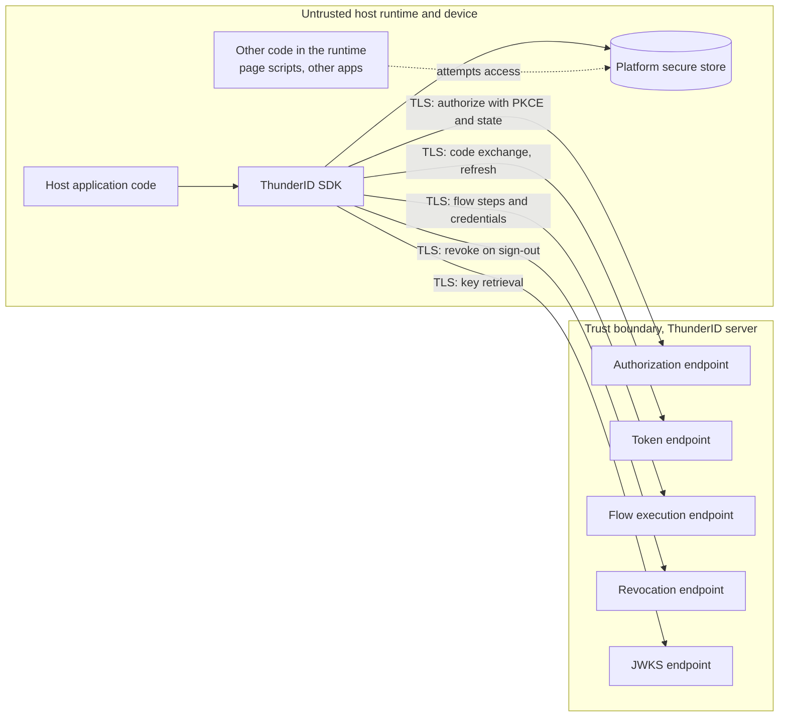
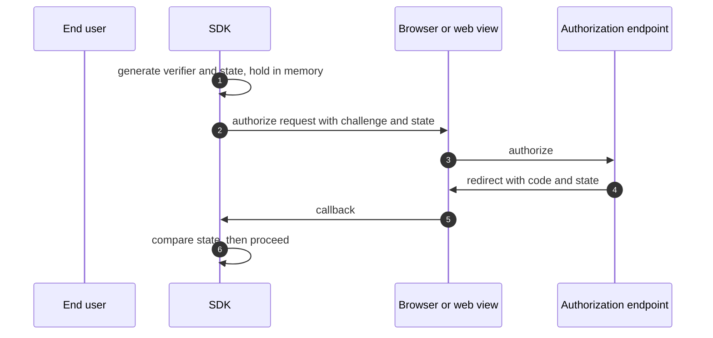
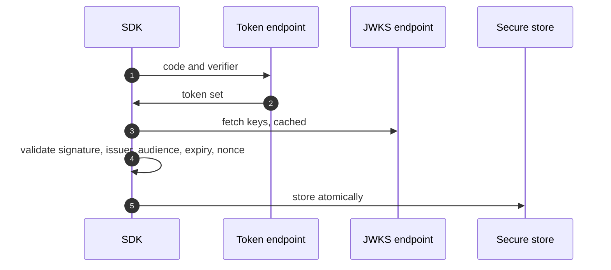
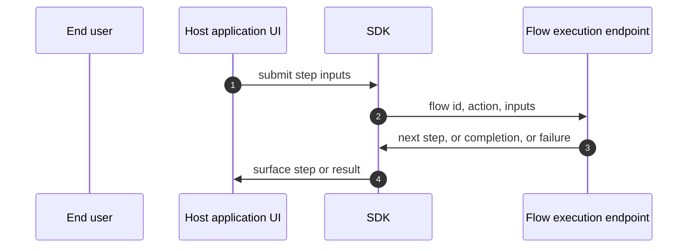
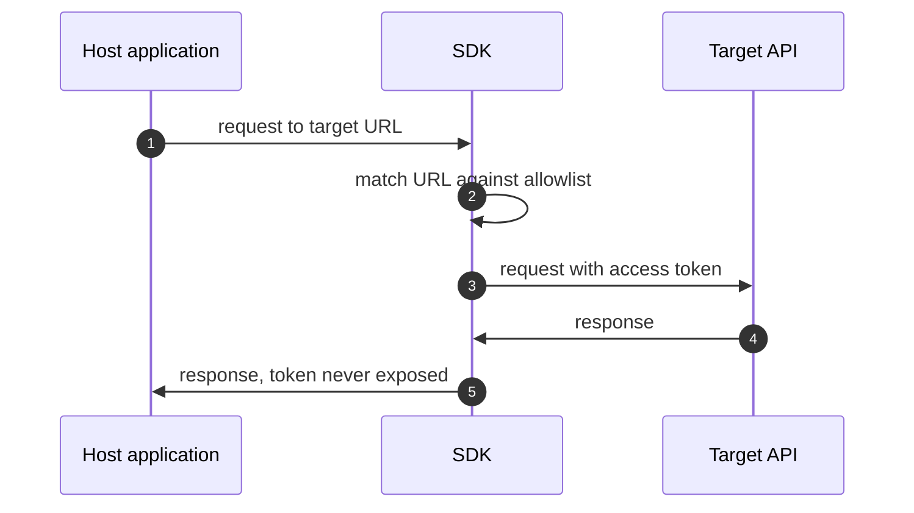
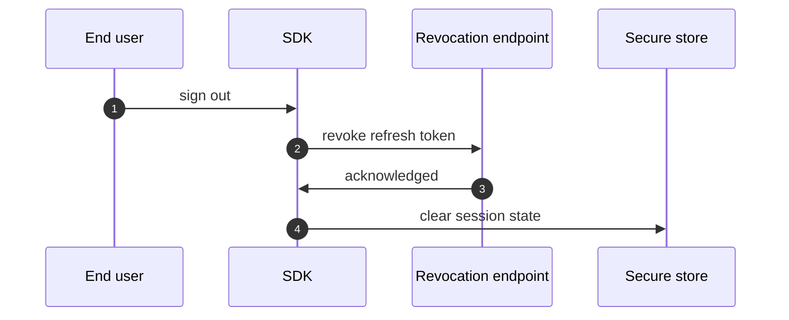

# SDK Development Threat Model

This model covers the ThunderID client SDKs as a trust boundary participant: the code that
runs inside an application the project does not control, on a device the project does not
control, and that holds the user's tokens there.

## Overview

A ThunderID SDK is a public client. It runs in a browser tab, a mobile application, or a
server process belonging to a third party, where it starts an authentication flow, completes
it, holds the resulting tokens, attaches them to outbound requests, and clears them on
sign-out. The runtime it is embedded in can observe everything it does, and on a compromised
device can modify it. The SDK cannot defend its own execution, so its security depends on
getting the protocol right: binding the authorization request to the callback, keeping tokens
in the strongest store the platform offers, and holding no credential longer than the call
that submits it.

The entry points are the client surface in
[spec.md](spec.md#client-surface), the redirect callback the SDK parses, the responses the
ThunderID server returns, and the configuration the host application supplies.

Cross-cutting concerns covered elsewhere: token issuance, signing, and revocation at the
server; the authorization and flow execution endpoints themselves; client registration and
redirect URI allowlisting. These are trust inputs here, not re-analysed.

## Scope

This model covers:

- The redirect authorization request the SDK builds and the callback it processes.
- The authorization code exchange and the storage of the resulting tokens.
- Credential and factor submission in embedded mode.
- Attachment of access tokens to outbound application requests.
- Sign-out, revocation, and clearing of local state.
- Configuration supplied by the host application, where it can weaken the above.

Out of scope:

- Server-side issuance, signature, introspection, and revocation semantics.
- Server enforcement of redirect URI registration and client authentication.
- The security of the host application's own code, beyond the SDK's obligation not to make it
  worse.
- Physical compromise of an unlocked device, and platform compromise below the SDK such as a
  rooted or jailbroken operating system. These bound the residual risks below rather than
  being defended here.

## Architecture

The trust boundary sits between the SDK and the server. Everything on the SDK's side of it is
untrusted from the server's point of view, which is why the SDK is specified as a public
client with PKCE mandatory and no client secret.

### Components

| Component | Task |
| --- | --- |
| SDK client | Builds authorization requests, drives flows, exchanges and refreshes tokens, validates ID tokens, exposes the client surface |
| Storage adapter | Persists tokens and session state in the platform's secure store, or in a caller-supplied backend |
| Isolated storage proxy | Where supported, holds tokens out of reach of the main thread and attaches them to allowlisted outbound requests only |
| Flow driver | Submits credentials and factor responses in embedded mode and surfaces each step to the application |
| Host application | Supplies configuration, renders UI, decides which requests carry a token |

### Actors

#### Actors

| Actor | Description | Roles or permissions |
| --- | --- | --- |
| End user | Authenticates through the SDK on their own device | Whatever the issued tokens carry |
| Host application | Third-party code embedding the SDK | Full control of the runtime the SDK executes in |
| Co-resident code | Other scripts in the page, other applications on the device, browser extensions | Whatever the platform grants it |
| Network attacker | Positioned between the device and the server | Observation, and modification absent TLS |
| ThunderID server | Issues, validates, and revokes tokens | Authoritative |

#### Entitlement matrix

| Actor | Start a flow | Read stored tokens | Attach a token to a request | Revoke a session |
| --- | --- | --- | --- | --- |
| End user | [Yes] | [No] | [No] | [Yes] |
| Host application | [Yes] | [No] where isolated storage is used, [Yes] otherwise | [Yes], limited to the allowlist under isolated storage | [Yes] |
| Co-resident code | [Yes] | [No] by design, subject to platform isolation | [No] | [No] |
| Network attacker | [No] | [No] | [No] | [No] |

### External Dependencies (not owned)

| Dependency | Description |
| --- | --- |
| Platform secure store | Keychain, Keystore-backed encrypted preferences, OS credential store. Confidentiality of tokens at rest depends on it |
| Platform crypto | Random generation for PKCE verifiers and state, and SHA-256 for the challenge |
| Platform browser or web view | Presents the authorization page and returns the callback. Owns cookie policy and cross-application isolation |
| TLS stack | Transport confidentiality and integrity for every server call |
| Package registries | npm, Swift Package Manager and CocoaPods, Maven coordinates, pub.dev. Distribution integrity of the SDK itself |

## Threats and mitigations

### Out-of-scope interactions and risks

- Server-side validation of the redirect URI against the registered set, owned by the
  authorization endpoint's model.
- Token signature and lifetime policy, owned by the token issuance model.
- Compromise of the platform beneath the SDK, including a rooted or jailbroken device and a
  malicious browser extension with full page access. Bounded as residual risk below.

### Interactions

#### 01: Redirect authorization and callback

**Description**

The SDK generates a PKCE verifier and a state value, builds an authorization request, hands
the user to the authorization endpoint, and later parses the callback. It checks the returned
state against the one it issued before doing anything with the code.

**Assets involved**

| Initiator | Intermediate | Target |
| --- | --- | --- |
| End user through the host application | SDK, platform browser or web view | Authorization endpoint |

**Data flow**

**Security considerations**

| Area | Response | Comments |
| --- | --- | --- |
| Data confidentiality | [C-High] | The code is short-lived but exchangeable |
| Communication medium | [M-NT] | |
| Transport security | [TLS] | Non-HTTPS `baseUrl` rejected at initialization outside loopback |
| Authentication | None at this step; the user authenticates at the server | |
| Accessibility | [Public] | |
| Authorization and Access Control | Redirect URI must be pre-registered, enforced server-side | |

**Threat assessment**

| ID | Category | Threat | Materializable | Mitigation / comment |
| --- | --- | --- | --- | --- |
| 1 | [Spoofing] | An attacker injects a callback carrying their own authorization code, so the victim's application silently signs in as the attacker's account and subsequent activity is attributed to it | [No] | A random state is required on every request and compared on callback; a mismatch fails authentication and stores nothing (AC4.1, AC4.2) |
| 2 | [Tampering] | An intercepted authorization code is redeemed by an attacker who never issued the request, yielding tokens for the victim's account | [No] | PKCE with S256 is mandatory regardless of server or application configuration; the verifier never leaves memory (AC4.1) |
| 3 | [Information Disclosure] | The PKCE verifier is written to disk or web storage and read later by co-resident code, defeating PKCE | [No] | The specification requires the verifier be held in memory only and cleared immediately after exchange |
| 4 | [Security Risk] | An SDK offers a configuration key that disables PKCE or state, and an application enables it | [No] | Both are specified as mandatory and not configurable. An SDK MUST NOT expose a key that weakens either, and introducing one would require a change to this model |

#### 02: Code exchange, token storage, and refresh

**Description**

The SDK exchanges the code for tokens, validates the ID token against the server JWKS, stores
the token set, and refreshes it before expiry.

**Assets involved**

| Initiator | Intermediate | Target |
| --- | --- | --- |
| SDK | Storage adapter, platform secure store | Token endpoint, JWKS endpoint |

**Data flow**

**Security considerations**

| Area | Response | Comments |
| --- | --- | --- |
| Data confidentiality | [C-High] | Access and refresh tokens |
| Communication medium | [M-NT], [M-FS] | Network for exchange, platform store at rest |
| Transport security | [TLS] | |
| Authentication | Public client with PKCE; confidential clients authenticate at the token endpoint | |
| Accessibility | [Restricted] | Reachable only through the SDK surface |
| Authorization and Access Control | Storage isolation is enforced by the platform | |

**Threat assessment**

| ID | Category | Threat | Materializable | Mitigation / comment |
| --- | --- | --- | --- | --- |
| 1 | [Information Disclosure] | Tokens stored in browser web storage are read by any script on the origin, including an injected one, giving the attacker the user's session until the token expires | [No] | Web storage is prohibited as a default; in-memory or worker-isolated storage is specified, with the platform secure store on mobile (AC4.3) |
| 2 | [Spoofing] | A forged or substituted ID token is accepted, letting an attacker present arbitrary identity claims to the application | [No] | Signature, issuer, audience, expiry, and nonce validation are required before acceptance; keys are re-fetched once on failure to tolerate rotation (AC4.4) |
| 3 | [Elevation of Privilege] | The application makes an authorization decision from a locally decoded, unverified JWT, so a tampered token grants access it should not | [No] | `decodeJwtToken` is specified as explicitly unsafe for authorization and documented as such; verified claims come from the server |
| 4 | [Tampering] | A refresh interrupted part-way leaves a mixed old and new token set, and the session breaks or a rotated-out refresh token is replayed | [No] | Stored tokens are updated atomically and refresh tokens are rotated on use |
| 5 | [Denial of Service] | Concurrent refreshes stampede the token endpoint, and rotation causes all but one to fail, signing the user out | [No] | Concurrent refreshes are deduplicated to a single in-flight request (AC4.7) |
| 6 | [Information Disclosure] | Tokens or claims are written to platform logs and collected by log aggregation or a co-resident reader | [No] | Access tokens masked, refresh tokens never logged, personal data masked, applied before any caller-supplied logger |

#### 03: Credential submission in embedded mode

**Description**

In embedded mode the application renders the authentication UI and the SDK submits the
collected credentials and factor responses to the flow execution endpoint, step by step.

**Assets involved**

| Initiator | Intermediate | Target |
| --- | --- | --- |
| End user | Host application UI, SDK flow driver | Flow execution endpoint |

**Data flow**

**Security considerations**

| Area | Response | Comments |
| --- | --- | --- |
| Data confidentiality | [C-High] | Passwords and one-time codes pass through the application |
| Communication medium | [M-NT] | |
| Transport security | [TLS] | |
| Authentication | The flow itself; initiation is unauthenticated by design | |
| Accessibility | [Public] | |
| Authorization and Access Control | Server-side flow state machine | |

**Threat assessment**

| ID | Category | Threat | Materializable | Mitigation / comment |
| --- | --- | --- | --- | --- |
| 1 | [Information Disclosure] | The SDK retains a submitted password or one-time code in memory or state beyond the call, widening the window for a memory or crash-dump disclosure | [No] | Credentials are specified as submit-and-discard, never retained beyond the API call |
| 2 | [Information Disclosure] | A credential or one-time code reaches a log or a crash report | [No] | Never logged at any level, enforced before any caller-supplied logger |
| 3 | [Spoofing] | The application renders a hard-coded form rather than the server-described step, so a server-side change to the flow silently downgrades what is actually collected, for example skipping a second factor | [No] | Sign-in and sign-up components are required to render the server-described step, not a fixed form |
| 4 | [Denial of Service] | Automated credential guessing against the flow endpoint, since flow initiation needs no authentication | [Yes] | Rate limiting and lockout are server-side and owned by the flow endpoint's model. The SDK does not retry automatically, which avoids amplifying it. Recorded as a residual |
| 5 | [Privacy Risk] | Embedded mode places the application's own code between the user and their password, which redirect mode does not | [No] | Inherent to the mode. Redirect mode is the specified default, and embedded mode requires explicit server-side enablement |

#### 04: Attaching access tokens to outbound requests

**Description**

The application asks the SDK for a token, or the SDK proxies the request itself when tokens
are held in isolated storage and attaches the token on the application's behalf.

**Assets involved**

| Initiator | Intermediate | Target |
| --- | --- | --- |
| Host application | SDK, isolated storage proxy | Application and third-party APIs |

**Data flow**

**Security considerations**

| Area | Response | Comments |
| --- | --- | --- |
| Data confidentiality | [C-High] | The access token is the asset in transit |
| Communication medium | [M-NT] | |
| Transport security | [TLS] | |
| Authentication | Bearer token | |
| Accessibility | [Restricted] | Allowlisted base URLs only, under isolated storage |
| Authorization and Access Control | `allowedExternalUrls` allowlist | |

**Threat assessment**

| ID | Category | Threat | Materializable | Mitigation / comment |
| --- | --- | --- | --- | --- |
| 1 | [Information Disclosure] | Code in the runtime proxies a request to an attacker-controlled host and the SDK attaches the access token, exfiltrating it | [No] | Under isolated storage the token is attached only to URLs matching `allowedExternalUrls`, and any other host is rejected |
| 2 | [Lateral Movement] | An over-broad allowlist entry, or one matching on prefix rather than origin, lets a token reach an unintended host that shares a URL prefix | [Yes] | Entries are specified as base URLs without a trailing slash. Prefix matching remains a footgun for the configurer. Recorded as a residual |
| 3 | [Information Disclosure] | A token is placed in a query string and captured in server logs, proxy logs, or a referrer header | [No] | Tokens are carried in the authorization header |

#### 05: Sign-out and session termination

**Description**

The SDK revokes the refresh token at the server, then clears local session state.

**Assets involved**

| Initiator | Intermediate | Target |
| --- | --- | --- |
| End user | SDK, storage adapter | Revocation endpoint |

**Data flow**

**Security considerations**

| Area | Response | Comments |
| --- | --- | --- |
| Data confidentiality | [C-High] | |
| Communication medium | [M-NT], [M-FS] | |
| Transport security | [TLS] | |
| Authentication | The token being revoked | |
| Accessibility | [Restricted] | |
| Authorization and Access Control | Server-side | |

**Threat assessment**

| ID | Category | Threat | Materializable | Mitigation / comment |
| --- | --- | --- | --- | --- |
| 1 | [Spoofing] | Local state is cleared but the refresh token stays valid server-side, so a copy taken earlier still yields tokens after the user believes they signed out | [No] | Revocation is required before clearing local state (AC4.5) |
| 2 | [Information Disclosure] | Partial clearing leaves cached user claims or a stale token behind for the next user of a shared device | [No] | Sign-out clears session state; the storage adapter contract includes a clear operation |
| 3 | [Operational Risk] | Revocation fails because the device is offline, and the SDK either blocks sign-out or clears state without revoking | [Yes] | The specification requires the attempt before clearing but does not state the offline behaviour. Recorded as a residual |

## Security Review Checklist

### Security considerations

| # | Consideration | State | Comments |
| --- | --- | --- | --- |
| 1 | Are all inputs and outputs validated (syntactic and semantic)? | [Yes] | Configuration is validated at initialization, and inputs are validated before any network call |
| 2 | Are rate limits in place where necessary? | [N/A] | Server-side concern. The SDK does not retry automatically, except for token refresh |
| 3 | Are permissions, roles, and entitlements defined on the principle of least privilege and business need? | [Yes] | Public client with no secret, scopes default to `openid`, tokens attached only to allowlisted hosts under isolated storage |
| 4 | Are authentication and authorization validated at both the UI and API layers, front end and back end, before granting access to resources? | [Yes] | The SDK is explicit that client-side decoding is not an authorization decision |
| 5 | Are proper isolations in place between components to ensure least-privilege access and reduce the blast radius against lateral movement? | [Partial] | Isolated storage is available in the browser and the platform secure store on mobile. A host application that supplies its own storage adapter can weaken this by design |
| 6 | Have any default credentials been changed, and are default superuser or root accounts not in use? | [N/A] | The SDK ships no credentials |
| 7 | Has the implementation followed best-practice guidelines? | [Yes] | RFC 6749, RFC 7636, RFC 7009, RFC 8693, OIDC Core, and the OAuth 2.0 security best current practice |
| 8 | Are secrets, credentials, and internal-only material kept out of the public source tree and its git history? | [Yes] | Samples are required to carry no hardcoded credentials or server URLs (AC6.5) |
| 9 | Was a security-focused code review conducted for this change, and have the findings been addressed? | [N/A] | This change introduces documents, not code. It applies to the implementation work that follows |
| 10 | Is Static Analysis (SAST) or IaC scanning conducted, and are findings addressed? | [Partial] | Each SDK repository runs lint and build in its pull request pipeline. Coverage is not uniform across the four repositories |
| 11 | Is Software Composition Analysis (SCA) conducted or integrated into the repository, and are findings addressed? | [Partial] | Dependency scanning is not uniform across the four SDK repositories |
| 12 | Is Dynamic (DAST) or API scanning conducted on a non-production setup, and are findings addressed? | [N/A] | The SDK is a client library. End-to-end suites run against a real server nightly |
| 13 | Are audit logs generated in a standardized format for critical functionality? | [N/A] | Auditing is server-side. The SDK emits diagnostic logs only, sanitized |
| 14 | Do audit logs for critical configuration changes record the difference between the old and new versions? | [N/A] | |
| 15 | Are data in transit and at rest encrypted? | [Yes] | TLS required, non-HTTPS `baseUrl` rejected outside loopback, tokens at rest in the platform secure store |
| 16 | Are sensitive values such as credentials and keys stored in a secret store or vault? | [Yes] | Platform secure store by default; no client secret in a public client |
| 17 | Is personal, sensitive, or confidential data kept out of logs? | [Yes] | Masking rules apply at every level and before any caller-supplied logger |
| 18 | Have users been given clear instructions for secure usage? | [Partial] | The quickstart and reference are required per SDK. A consolidated security guidance page for SDK adopters does not exist yet |

### Business impact and resilience

| # | Consideration | State | Comments |
| --- | --- | --- | --- |
| 1 | Has a business impact analysis been done to identify resilience requirements? | [N/A] | The SDK is a client library with no availability surface of its own. Availability is owned by the deployer of the server and by the application embedding the SDK |

Resilience characteristics that do belong to the SDK: it refreshes tokens ahead of expiry
rather than on failure, deduplicates concurrent refreshes, and re-fetches JWKS once on a
verification failure so that server key rotation does not break running clients.

### Dependency and component health

| # | Consideration | State | Comments |
| --- | --- | --- | --- |
| 1 | Are dependencies, base images, and runtimes monitored for known vulnerabilities and kept current? | [Partial] | Practice differs across the four SDK repositories. Making it uniform is follow-up work |
| 2 | Are any End-of-Life or End-of-Service components in use? | [No] | Each SDK documents its minimum supported runtime |
| 3 | Is hardening guidance published for operators who deploy the project? | [No] | See checklist item 18 |

### Privacy considerations

The SDK processes personal data in transit: identity claims, profile attributes, and the
identifiers a user supplies during authentication and recovery.

| # | Consideration | State | Comments |
| --- | --- | --- | --- |
| 1 | Is the purpose and legal basis for processing personal data clearly defined? | [N/A] | Determined by the application embedding the SDK, which is the controller |
| 2 | Are the collection, storage, processing, sharing, archival, and disposal of personal data aligned with the data minimization principle? | [Yes] | The SDK requests the configured scopes only, and persists the token set and cached claims rather than a copy of the profile |
| 3 | Is personal data stored securely? | [Yes] | Platform secure store |
| 4 | Are privacy notices updated to reflect any new processing or changes to purpose and legal basis? | [N/A] | Owned by the embedding application |
| 5 | Is access to personal data granted on a need-to-know basis? | [Yes] | Scoped tokens, and host allowlisting under isolated storage |
| 6 | Are data retention requirements considered? | [Yes] | Local state is cleared on sign-out |
| 7 | Is there a process to dispose of personal data on request in a timely manner? | [N/A] | Server-side |
| 8 | Are records of personal-data processing maintained? | [N/A] | Owned by the embedding application |

## Residual risks (open items)

- `allowedExternalUrls` matches on base URL prefix, so a badly chosen entry can match a host
  the configurer did not intend. Guidance exists in the specification; origin-level matching
  would remove the footgun.
- Automated credential guessing against the unauthenticated flow execution endpoint is
  mitigated server-side and is not something the SDK can defend. The SDK's contribution is to
  not retry automatically.
- Offline sign-out behaviour is unspecified: whether the SDK clears local state when
  revocation cannot be reached is left to the implementation.
- A host application supplying its own storage adapter can place tokens somewhere weaker than
  the platform default. This is a deliberate extension point; the mitigation is documentation.
- Platform compromise below the SDK, such as a rooted or jailbroken device or a browser
  extension with full page access, is out of the SDK's control and is accepted.
- The shared error code catalogue referenced in
  [spec.md](spec.md#error-model) is a target rather than a defined artifact, so uniform
  handling by code across SDKs is not yet guaranteed.

## Appendix

- References: [RFC 6749](https://datatracker.ietf.org/doc/html/rfc6749),
  [RFC 7636](https://datatracker.ietf.org/doc/html/rfc7636),
  [RFC 7009](https://datatracker.ietf.org/doc/html/rfc7009),
  [RFC 7519](https://datatracker.ietf.org/doc/html/rfc7519),
  [RFC 8693](https://datatracker.ietf.org/doc/html/rfc8693),
  [OpenID Connect Core 1.0](https://openid.net/specs/openid-connect-core-1_0.html),
  [OAuth 2.0 Security Best Current Practice](https://datatracker.ietf.org/doc/html/rfc9700),
  [OWASP Top 10 Proactive Controls](https://top10proactive.owasp.org/).
- Companion document: [spec.md](spec.md).

## Change log

| Version | Date | Change |
|---|---|---|
| 0.1 | 2026-09-10 | Initial threat model. |
