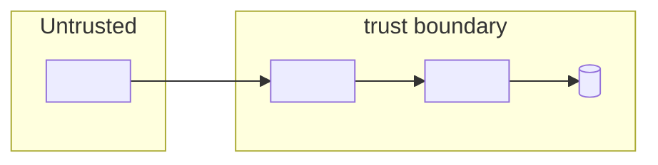
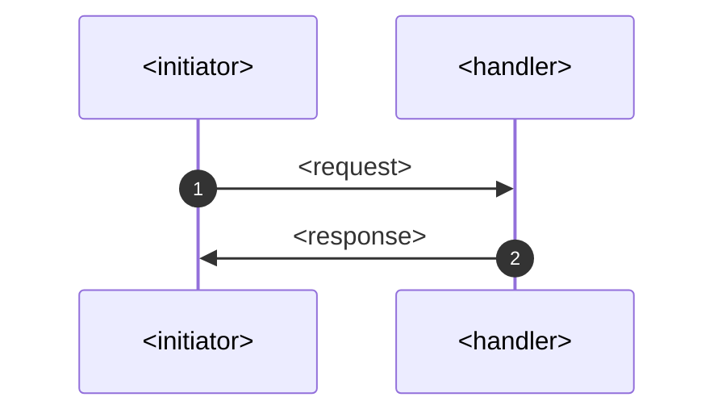

# <Area> Threat Model

This model covers <the feature area, endpoints, or flows in scope>.

## Overview

<Two or three sentences on what this area does and why it matters for security. Name the entry points and the key security-relevant behaviour.>

Cross-cutting concerns covered elsewhere: <list the companion models this one relies on, for example client authentication, token signing, the auth flow. These are referenced here as trust inputs, not re-analysed.>

## Scope

This model covers:
- <interactions, endpoints, and components analysed here>

Out of scope (see the referenced companion models):
- <interactions and risks handled elsewhere, with the model that owns them>

## Architecture

<The mermaid diagram should include the trust boundary indicated>

### Components

<Short description of the components in this area and how they relate.>

| Component | Task |
| --- | --- | 
|<component> | <what it does, and any security-relevant behaviour> |

### Actors

#### Actors

| Actor | Description | Roles or permissions |
| --- | --- | --- |
| <actor> | <what it does in this area> | <roles, scopes, or N/A> |

#### Entitlement matrix

| Actor | <action> | <action> | <action> |
| --- | --- | --- | --- |
| <actor> | < [Yes] / [No] > | < [Yes] / [No] > | < [Yes] / [No] > |

### External Dependencies (not owned)

| Dependency | Description (usage, purpose, authentication, authorization, security) |
| --- | --- |
| <dependency> | <notes, and the companion model that owns it if applicable> |

## Threats and mitigations

### Out-of-scope interactions and risks

- <interaction or risk not analysed here, and the companion model that owns it>

### Interactions

<!-- Copy the block below once per interaction. Number them [01], [02], and so on. -->

#### <ID>: <Interaction name>

**Description**

<What this interaction does, and the checks performed.>

**Assets involved**

| Initiator | Intermediate | Target |
| --- | --- | --- |
| <...> | <...> | <...> |

**Data flow**

**Security considerations**

| Area | Response | Comments |
| --- | --- | --- |
| Data confidentiality | <[C-High] / [C-Medium] / [C-Low]> | <why> |
| Communication medium | <[M-NT] / [M-DB] / [M-FS] / [M-IN]> | |
| Transport security | < [TLS>] / [MTLS] / [Not Encrypted]> | |
| Authentication | <mechanism> | |
| Accessibility | <[Public] / [Internal] / [Restricted]> | |
| Authorization and Access Control |  | |

**Threat assessment**

<!--

Categorize each identified threat using the most appropriate category below.

Categorize the threat based on its primary impact or attack characteristic. Avoid duplicating the same threat under multiple categories; use multiple tags only where the threat genuinely represents more than one risk type.

- **[Spoofing]** – Impersonating a legitimate user, administrator, application, service, or identity provider.  
  *Example: An attacker uses stolen credentials, session cookies, or access tokens to impersonate a legitimate user.*

- **[Tampering]** – Unauthorized modification of identity, authentication, authorization, configuration, or communication data.  
  *Example: An attacker modifies authentication parameters, user attributes, role assignments, or authorization policies to gain unintended access.*

- **[Repudiation]** – Performing an action without sufficient evidence to reliably determine who performed it.  
  *Example: An administrator changes a user's roles or resets MFA without the action being captured in audit logs.*

- **[Information Disclosure]** – Unauthorized exposure of sensitive identity, credential, token, or personal information.  
  *Example: Access tokens, refresh tokens, passwords, secrets, or user attributes are exposed through logs, API responses, or browser URLs.*

- **[Denial of Service]** – Preventing or significantly degrading access to authentication, authorization, identity management, or related services.  
  *Example: Excessive authentication, token generation, password reset, or provisioning requests exhaust IAM service resources and prevent legitimate users from logging in.*

- **[Elevation of Privilege]** – A user, application, or service obtains permissions beyond what it is authorized to have.  
  *Example: A normal user manipulates an API request or role assignment process and gains administrative privileges.*

- **[Lateral Movement]** – Using a compromised identity, application, service account, tenant, or IAM component to gain access to additional systems or trust domains.  
  *Example: A compromised service account or federated identity is used to access other applications that trust the same IAM platform.*

- **[Privacy Risk]** – Inappropriate collection, processing, sharing, exposure, or retention of personal information.  
  *Example: The IAM solution collects unnecessary user attributes from an external identity provider or retains user information longer than required.*

- **[Security Risk]** – Security concerns relevant to the implementation that do not clearly fall within the STRIDE-LM categories.  
  *Example: The solution uses weak recovery mechanisms, insecure cryptographic algorithms, vulnerable dependencies, or insecure default configurations.*

- **[Operational Risk]** – Risks caused by deployment, configuration, maintenance, monitoring, availability, or recovery failures.  
  *Example: Expiration of an IdP signing certificate or incorrect key rotation causes authentication failures across integrated applications.*

- **[Process Risk]** – Risks resulting from inadequate procedures, approvals, ownership, governance, or human processes.  
  *Example: Privileged roles or application access can be granted without appropriate approval, periodic review, or timely revocation.*

When writing the threat statement, provide a detailed explanation of the potential negative impact on the system, component, feature, or interaction if the threat were to materialize.

In the Mitigation/Comment statement, explain how the identified threat and its potential impact can be reduced through the proposed control measures. Additionally, specify any relevant thresholds. 
  
-->

| ID | Category | Threat | Materializable | Mitigation / comment |
| --- | --- | --- | --- | --- |
| 1 | <the category> | <the threat> | < [Yes] / [No]> | <control in place, or the residual and its guidance> |

<!-- Set Materializable to Yes only for a real, currently unmitigated threat.
     A Yes that is exploitable and unfixed does NOT belong in this public file.
     Route it to a private GitHub Security Advisory and record only a bounded
     residual here once there is a mitigation or a documented compensating control. -->

## Security Review Checklist

A review aid that complements the threat models and the self-assessment. Guidance follows the [OWASP Top 10 Proactive Controls](https://top10proactive.owasp.org/).

### Security considerations

| # | Consideration | State | Comments |
| --- | --- | --- | --- |
| 1 | Are all inputs and outputs validated (syntactic and semantic)? | [Yes] / [No] / [N/A] / [Partial] | |
| 2 | Are rate limits in place where necessary? | [Yes] / [No] / [N/A] | |
| 3 | Are permissions, roles, and entitlements defined on the principle of least privilege and business need? | [Yes] / [No] / [N/A] | |
| 4 | Are authentication and authorization validated at both the UI and API layers, front end and back end, before granting access to resources? | [Yes] / [No] / [N/A] | |
| 5 | Are proper isolations in place between components to ensure least-privilege access and reduce the blast radius against lateral movement? | [Yes] / [No] / [N/A] | |
| 6 | Have any default credentials been changed, and are default superuser or root accounts not in use (when using third-party components)? | [Yes] / [No] / [N/A] | |
| 7 | Has the implementation followed best-practice guidelines (OWASP, Kubernetes, vendor, or technology provider)? | [Yes] / [No] / [N/A] | |
| 8 | Are secrets, credentials, and internal-only material kept out of the public source tree and its git history? | [Yes] / [No] / [N/A] | |
| 9 | Was a security-focused code review conducted for this change, and have the findings been addressed? | [Yes] / [No] / [N/A] | |
| 10 | Is Static Analysis (SAST) or IaC scanning conducted, and are findings addressed? | [Yes] / [No] / [N/A] | |
| 11 | Is Software Composition Analysis (SCA) conducted or integrated into the repository, and are findings addressed (for example FOSSA, Trivy)? | [Yes] / [No] / [N/A] | |
| 12 | Is Dynamic (DAST) or API scanning conducted on a non-production setup, and are findings addressed? | [Yes] / [No] / [N/A] | |
| 13 | Are audit logs generated in a standardized format for critical functionality, and available to authorized users to trace critical events and aid incident response? Note the retention period in Comments. | [Yes] / [No] / [N/A] | |
| 14 | Do audit logs for critical configuration changes record the difference between the old and new versions? | [Yes] / [No] / [N/A] | |
| 15 | Are data in transit and at rest encrypted? | [Yes] / [No] / [N/A] | |
| 16 | Are sensitive values such as credentials and keys stored in a secret store or vault? | [Yes] / [No] / [N/A] | |
| 17 | Is personal, sensitive, or confidential data kept out of logs? | [Yes] / [No] / [N/A] | |
| 18 | Have users been given clear instructions for secure usage? | [Yes] / [No] / [N/A] | |

### Business impact and resilience

For an open-source component, most of these are shared with the operator who deploys it. Capture the project's defaults and recommendations here, and note what is left to the deployer.

| # | Consideration | State | Comments |
| --- | --- | --- | --- |
| 1 | Has a business impact analysis been done to identify resilience requirements (maximum tolerable downtime, uptime, RPO, RTO)? | [Yes] / [No] / [N/A] | |

Resilience details to record:
- High availability requirements
- Disaster recovery requirements
- Backups, frequency, and retention: database backups and replication, system backups, object and volume storage backups, configuration backups, logs
- Health checks
- User banners

### Dependency and component health

| # | Consideration | State | Comments |
| --- | --- | --- | --- |
| 1 | Are dependencies, base images, and runtimes monitored for known vulnerabilities and kept current (for example automated dependency scanning), and are findings addressed? | [Yes] / [No] / [N/A] | |
| 2 | Are any End-of-Life or End-of-Service components in use? | [Yes] / [No] / [N/A] | |
| 3 | Is hardening guidance published for operators who deploy the project (optional)? | [Yes] / [No] / [N/A] | |

### Privacy considerations

Fill this in only if the change processes personal data.

| # | Consideration | State | Comments |
| --- | --- | --- | --- |
| 1 | Is the purpose and legal basis for processing personal data clearly defined? | [Yes] / [No] / [N/A] | |
| 2 | Are the collection, storage, processing, sharing, archival, and disposal of personal data aligned with the data minimization principle? | [Yes] / [No] / [N/A] | |
| 3 | Is personal data stored securely? | [Yes] / [No] / [N/A] | |
| 4 | Are privacy notices updated to reflect any new processing or changes to purpose and legal basis? | [Yes] / [No] / [N/A] | |
| 5 | Is access to personal data granted on a need-to-know basis? | [Yes] / [No] / [N/A] | |
| 6 | Are data retention requirements considered? | [Yes] / [No] / [N/A] | |
| 7 | Is there a process to dispose of personal data on request in a timely manner while meeting retention requirements? | [Yes] / [No] / [N/A] | |
| 8 | Are records of personal-data processing maintained in the project's data inventory or records of processing? | [Yes] / [No] / [N/A] | |

## Residual risks (open items)

<Bounded, accepted, or in-progress risks for this area.>

- <residual risk> (tracking: <issue link>)

## Appendix

- Sample requests and configurations: <optional, useful for adopters>
- References: <specs and RFCs this area implements, and the companion models it depends on>

## Change log

| Version | Date | Change |
|---|---|---|
| 0.1 | YYYY-MM-DD | Initial specification. |
