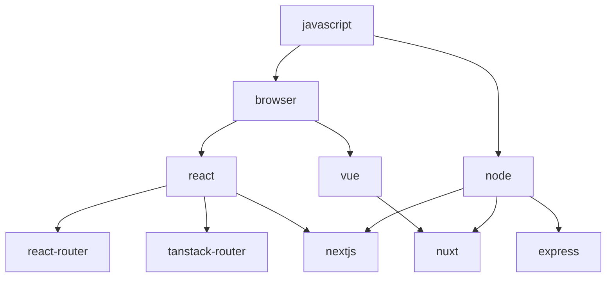

# JavaScript SDK Development

The JavaScript SDKs live in [javascript-sdks](https://github.com/thunder-id/javascript-sdks), a pnpm workspace managed with Turborepo. Every package publishes under the `@thunderid` scope.

## Packages

| Package | Purpose |
|---------|---------|
| `@thunderid/javascript` | Framework-agnostic core: auth flows, token management, i18n, utilities |
| `@thunderid/browser` | Browser runtime: storage, session sync, WebAuthn |
| `@thunderid/node` | Node runtime: cookies, server sessions |
| `@thunderid/react` | React SDK |
| `@thunderid/vue` | Vue SDK |
| `@thunderid/nextjs` | Next.js SDK |
| `@thunderid/nuxt` | Nuxt module |
| `@thunderid/express` | Express SDK |
| `@thunderid/react-router` | React Router integration |
| `@thunderid/tanstack-router` | TanStack Router integration |

They build on each other rather than standing alone. Each arrow points from a package to the ones built on top of it:



Put a shared helper as close to the root as it can go. A utility used by both React and Vue belongs in `browser`, or in `javascript` if it needs nothing from the browser, rather than being duplicated in each.

## Commands

Run these from the repository root:

```bash
pnpm install
pnpm build
pnpm test
pnpm lint          # pnpm lint:fix to apply
pnpm typecheck
pnpm format:check  # pnpm format:fix to apply
```

Scope any of them to one package with a filter:

```bash
pnpm --filter @thunderid/react run build
```

Two other commands are worth knowing: `pnpm symlink` links packages for local development against another project, and `pnpm clean` clears build output.

## Conventions

- **Dependency versions are centralized.** `pnpm-workspace.yaml` holds a `catalog:` of pinned versions plus an `overrides` block of security pins. Add or bump a shared dependency there rather than in an individual package.
- **Every source file carries a copyright header**, enforced by the `@thunderid/copyright-header` ESLint rule. Files under `samples/` are exempt.
- **Do not hardcode the vendor name** in runtime keys such as storage keys or log tags. Resolve it with `getVendorPrefix(vendor)` so a consumer's `vendor` override applies.
- Formatting comes from `@thunderid/prettier-config`. Run `pnpm format:fix` rather than hand-formatting.

## Next Steps

- [Testing](../testing)
