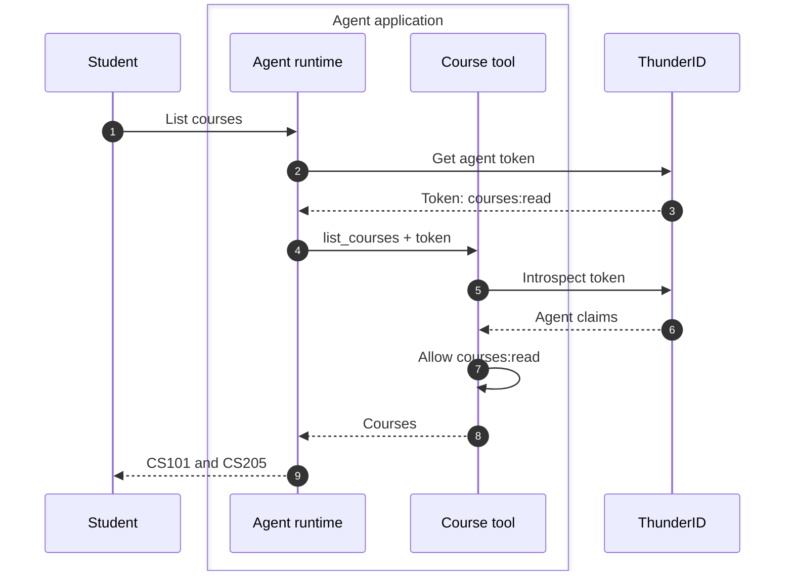
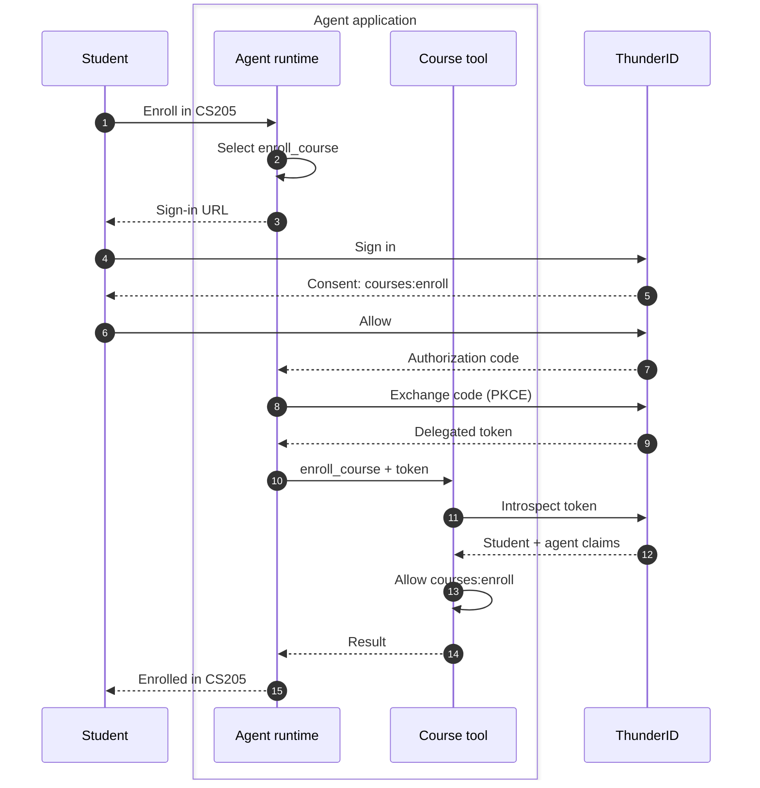

import {NextSteps, NextStepsCard} from '@site/src/components/NextSteps';

# Build a Course Enrollment Agent

Build an agent that helps students find and enroll in courses. Ask **“List the available courses”**, then **“Enroll me in CS205.”** The first request uses the agent's own identity. The second pauses for your sign-in and consent before the agent enrolls you.

Set up the identities, permissions, and consent flow once, then choose LangChain, Google ADK, Vercel AI SDK, or CrewAI. Each quickstart implements the same conversation with two tools: `list_courses` and `enroll_course`.

## Understand the Two Flows

An **agent identity** identifies the agent itself in <ProductName />. Registering an agent gives it an **Agent ID**, plus a **Client ID** and **Client Secret** it uses to request access tokens. An access token tells the tool whose authority it is using and which permissions it has.

**On behalf of a user (OBO)** means the agent acts with a user's delegated authority. Signing in identifies the student; consent gives the agent permission to act for that student. The resulting token names both parties.

| Request | Whose authority? | Permission | Student involvement |
|---|---|---|---|
| “List the available courses.” | The agent's own identity | `courses:read` | No sign-in or consent needed. |
| “Enroll me in CS205.” | The signed-in student's delegated authority | `courses:enroll` | Sign in and approve the requested permission. |

The agent selects a tool from the request. The runtime obtains the token required for that operation without exposing it to the model. The tool validates the token and checks its permission before performing the action, so the model cannot select a student ID or supply an access token.

The agent runtime and both course tools run in the same sample application process.

### List Courses as the Agent

The agent requests a token with its Client ID and Client Secret using the **client credentials** grant. The token represents the agent and carries `courses:read`. The listing tool validates it with <ProductName />, checks that permission, and returns the catalog.

A student can ask the question without delegating their identity. It is the agent's role that grants access to the catalog.

### Enroll the Student with OBO

When you ask **“Enroll me in CS205”**, the agent selects `enroll_course`. Its runtime wrapper requires delegated authority, so it starts an **authorization code flow with PKCE** before invoking the tool. You follow the sign-in link to <ProductName />, sign in, and approve `courses:enroll` on its consent screen.

<ProductName /> returns an authorization code through your browser to the agent's registered redirect URI. The runtime exchanges it for a delegated access token and passes that token to the tool. PKCE binds the exchange to the request that started it. The tool validates the token and its permission, then enrolls the student identified by the token.

If you deny consent, the configured flow fails and the agent does not enroll you. Closing the browser leaves the runtime waiting until its 180-second timeout. A token without `courses:enroll` also fails the tool's permission check.

### Read the Identity in the Result

The sample prints the following fields after token validation:

| Field | Listing courses | Enrolling a student |
|---|---|---|
| `sub` | Agent ID | Signed-in student ID |
| `act.sub` | Absent | Agent ID |
| `client_id` | Agent's Client ID | Same agent's Client ID |
| `scope` | `courses:read` | Includes `courses:enroll` |

The **subject** (`sub`) is whose authority the token represents. The **actor** (`act.sub`) is the agent exercising delegated authority. In OBO, the enrollment belongs to the student, while the actor identifies which agent performed it.

Authentication and authorization serve different purposes here. Signing in proves who the student is. Their role determines whether they may enroll, consent approves the agent's use of that permission, and the tool checks the granted permission before changing the record. Consent cannot grant a permission the student does not hold.

## Register the Agent

Start <ProductName /> if you do not have an instance running, then open its Console at <ConsoleUrl />.

<RunThunderID />

1. In the Console, open **Agents** and click **Add Agent**.
2. Enter `Course Enrollment Agent`. Select an organization unit if prompted, then click **Continue**.
3. For **Model Provider**, select **Gemini**. Enter `gemini-flash-lite-latest` for **Model**, then click **Continue**. These fields describe the agent; your framework uses the API key you configure later.
4. Select an **Owner**, then click **Create agent**.
5. Copy the secret from **Save your client secret**, then click **Continue**. The secret appears only once.
6. On **Overview**, copy the **Client ID** from **Agent details**. Keep it and the secret for your framework's `.env` file.
7. On **Advanced**, confirm **Client Authentication Method** is `client_secret_basic`. Turn on **Delegated mode**, keep **Require PKCE** on, and add `http://localhost:6274/callback` under **Authorized redirect URIs**. Leave **Require Pushed Authorization Requests** off for this sample and save your changes.

The same agent supports both `client_credentials` and `authorization_code`. The browser and sample must run on the same computer so the redirect can reach the local listener.

## Define the Course Permissions

A resource server groups permissions for a protected service. Here it represents the sample's course tools, even though those tools run locally.

1. Open **Resource Servers** and create a resource server of type **API**. Name it `Course Catalog`, set **Identifier** to `https://courses.example.com`, and use `:` as the permission delimiter. Keep the existing default resource server unchanged.
2. On its **Resources** tab, create a resource named `Courses` with handle `courses`.
3. Under that resource, create the following actions:

| Action name | Handle | Generated permission |
|---|---|---|
| List courses | `read` | `courses:read` |
| Enroll in a course | `enroll` | `courses:enroll` |

`https://courses.example.com` is an identifier, not a service you need to deploy or visit. The samples send it as `resource` when requesting tokens and check it as the token's audience. Set `COURSE_RESOURCE` to this same value in each sample.

See [Manage Resource Servers](../../guides/resource-servers) for the API equivalent.

## Assign the Agent and Student Roles

Use an existing non-admin user as the student, or [create a test user](../../guides/users/manage-users) with a username and password. Course enrollment does not create a user account.

1. In **Roles**, create `Course Reader` in your organization unit. Select `courses:read` from **Course Catalog** as its permission.
2. On that role's **Assignments** tab, click **Add Assignment**. Select **Agent** and assign **Course Enrollment Agent**.
3. Create another role named `Student` with `courses:enroll` from **Course Catalog**.
4. On **Student** → **Assignments**, click **Add Assignment**. Select **User** and assign your test student.

The agent can read courses under its own identity. Enrollment requires the student's role and consent; the agent's **Course Reader** role does not include enrollment permission.

## Configure Sign-in and Consent

Create a separate authentication flow for this sample so other applications keep their existing sign-in behavior.

1. Open **Flows** and create a sign-in flow from the **Basic** template. Name it `Course Enrollment Sign-in`.
2. In the flow builder, add **User Consent** from **Widgets**. It creates the consent screen and its **Allow** and **Deny** responses.
3. Check the successful path: **Identifier + Password** → **Authorization** → **User Consent** → **Auth Assertion Generator**. The authorization step resolves the student's permissions before consent. Both responses from the consent screen must return to **User Consent**.
4. Select the **User Consent** executor and turn on **Fail flow when user denies consent**. Save the flow.
5. Return to **Agents** → **Course Enrollment Agent** → **Flows**. Select **Course Enrollment Sign-in** as the **Sign-in Flow** and save.

The enrollment request includes `scope=openid courses:enroll`, the course resource identifier, and `prompt=consent`. The configured flow authenticates the student, checks their permission, and asks them to approve it. `prompt=consent` requests a fresh consent decision; it does not create a consent step in a flow that lacks one.

The consent grants the `courses:enroll` permission, not a course-specific restriction to CS205. The sample obtains a new delegated token for each enrollment request and keeps it only for that tool call. A production agent may reuse an unexpired token within the user's session according to its consent policy.

See [Configure consent](../../guides/consent#configuring-consent-in-flows) for the flow builder details and [Agent access on behalf of users](../../guides/agents/authentication/on-behalf-of-user) for other delegation methods.

## Next Steps

Choose your framework to create the tools, connect them to an agent, and try both requests:

<NextSteps>
  <NextStepsCard title="LangChain" description="Build the agent with LangChain in Python or TypeScript." href="./langchain" cta="Open LangChain guide" />
  <NextStepsCard title="Google ADK" description="Build the agent with Google ADK in Python." href="./google-adk" cta="Open Google ADK guide" />
  <NextStepsCard title="Vercel AI SDK" description="Build the agent with Vercel AI SDK in TypeScript." href="./vercel-ai-sdk" cta="Open Vercel AI SDK guide" />
  <NextStepsCard title="CrewAI" description="Build the agent with CrewAI in Python." href="./crewai" cta="Open CrewAI guide" />
</NextSteps>

Each example uses real <ProductName /> tokens, consent, and permission checks. Course records live in memory and disappear when the process exits. When you move the tools behind an API, validate tokens and enforce permissions in that API; see [Control agent access](../../use-cases/ai-agents/solve-access).
