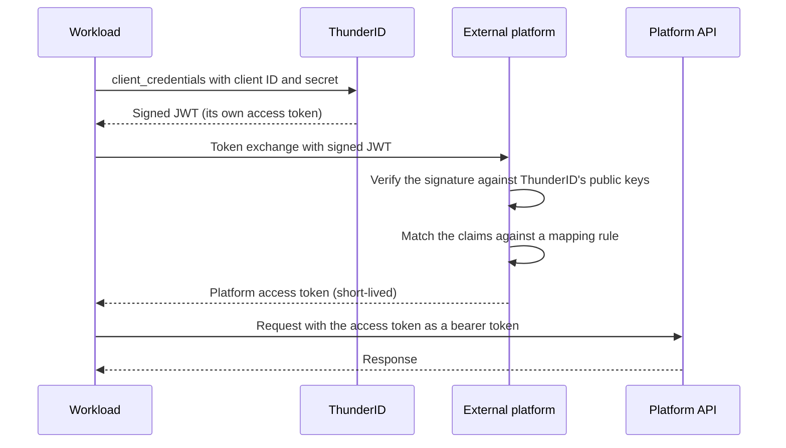

# Workload Identity Federation

Workload identity federation lets a workload access a platform without storing a long-lived credential, using a token from an issuer that platform already trusts. The workload presents a signed token from its own identity provider, and the platform returns a short-lived credential of its own.

For <ProductName />, a workload is any confidential client that can use the client credentials grant. That is an [agent](../../../agents), such as an AI assistant, or an [application](../../../applications/manage-applications), such as a backend service. Either one presents the access token it already gets for itself.

Select a platform to get a step-by-step integration guide with <ProductName />.

| Platform | Guide |
|---|---|
| OpenAI | [Call OpenAI APIs with a <ProductName /> Agent Identity](../openai) |

## What It Replaces

The alternative is a static API key that the platform issues once and you copy into the workload's environment. Such a key:

- Does not expire, so a leaked copy stays valid until somebody notices and rotates it.
- If multiple workloads share the same key, the platform generally cannot distinguish them from the credential alone.
- Sits outside the workload's lifecycle, so deleting the agent or application in <ProductName /> leaves its access to the platform intact.

Federation removes this static key. The workload proves who it is to <ProductName /> with the credential it already holds, and every platform credential it receives afterwards is short-lived and traceable to its <ProductName /> identity.

## How It Works

- **The workload authenticates to <ProductName />.** The [client credentials grant](../../../protocols/oauth-oidc/client-credentials) returns a signed JWT whose `sub` claim is the workload's own ID.
- **The workload exchanges that token at the platform.** The exchange usually follows [RFC 8693](https://datatracker.ietf.org/doc/html/rfc8693), carrying the <ProductName /> token as the subject token.
- **The platform verifies the token.** It reads <ProductName />'s public keys, either from the JWKS endpoint or from a copy uploaded during setup, then validates the signature and the token claims required by its federation configuration.
- **The platform resolves one of its own identities.** A mapping rule maps one or more claims, often `sub`, sometimes together with `iss` or other attributes, against values you registered.
- **The platform issues a short-lived access token.** The token belongs to that account, expires on a lifetime the platform sets, and is narrowed to any permissions the mapping rule restricts it to.
- **The workload calls the platform's API.** It sends that token as a bearer token, and repeats the exchange once the token expires.

## Reaching Your Public Keys

A platform needs <ProductName />'s public keys to verify a signature, and there are two ways to give it them. It can retrieve the JWKS directly from `/oauth2/jwks`, or discover the JWKS URL from `/.well-known/openid-configuration`. That keeps the keys current through a rotation, but it requires the instance to be reachable over public HTTPS.

Otherwise you upload a copy during setup, which is the option for an instance that runs locally or inside a private network. The copy is a snapshot, so rotating the signing key breaks every exchange until you upload the new key set.

## Related

- [Agent Token](../../../agents/authentication/agent-own-token)
- [Client Credentials](../../../protocols/oauth-oidc/client-credentials)
- [Agents](../../../agents)
- [Manage Applications](../../../applications/manage-applications)
