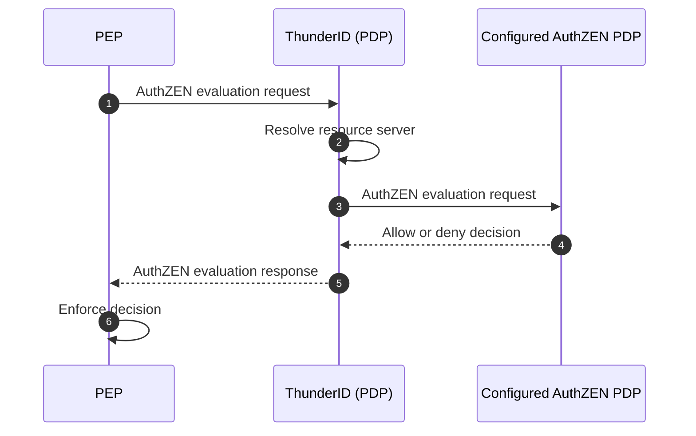
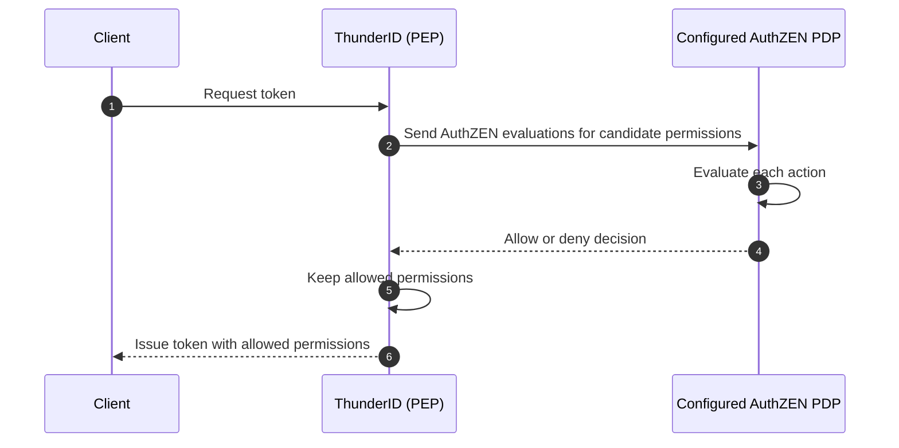

# Policy Enforcement Point

<ProductName /> can act as an AuthZEN policy enforcement point (PEP). In this mode, a configured AuthZEN policy decision point (PDP) evaluates authorization requests, while <ProductName /> enforces the returned decision in its authorization flow.

The configured AuthZEN PDP owns the authorization policy. <ProductName /> provides the authenticated subject, requested permissions, resource server context, and any request context required for the evaluation.

## How the PEP Flow Works

### Authorization Requests from a PEP

When a PEP calls <ProductName /> with an AuthZEN evaluation, <ProductName /> validates the request and resolves `resource.type` to the target resource server. If the resource server uses a configured AuthZEN PDP as its authorization engine, <ProductName /> delegates the evaluation to that PDP. <ProductName /> returns the resulting allow or deny decision in the AuthZEN response, and that PEP enforces it.

### Token Issuance Flow

During an authorization flow, <ProductName /> resolves the target resource server and the candidate permissions for the token. If the resource server uses a configured AuthZEN PDP as its authorization engine, <ProductName /> sends an AuthZEN evaluation for each permission. The configured AuthZEN PDP returns an allow or deny decision for each evaluation. <ProductName /> removes permissions denied by the PDP and issues the token with only the allowed permissions.

## What <ProductName /> Sends to the Configured AuthZEN PDP

<ProductName /> creates an AuthZEN evaluation for each permission under evaluation:

| AuthZEN field | Value sent by <ProductName />                                                                                                                                                                             |
| ------------- | --------------------------------------------------------------------------------------------------------------------------------------------------------------------------------------------------------- |
| `subject`     | The subject type and ID. `properties` contains the configured subject attributes available for the subject. Attribute mappings rename properties when the configured AuthZEN PDP expects different names. |
| `resource`    | The target resource server identifier, sent as `resource.type`.                                                                                                                                           |
| `action`      | The <ProductName /> permission under evaluation, sent as `action.name`.                                                                                                                                   |
| `context`     | Optional request-time data supplied by the authorization flow.                                                                                                                                            |

<ProductName /> sends the evaluation to the configured AuthZEN PDP through the access evaluation API. The PDP returns an allow or deny decision for each permission evaluated. <ProductName /> enforces these decisions by retaining only the allowed permissions. If the PDP cannot complete the evaluation, the authorization flow fails.

## Configure <ProductName /> {#configure-thunderid}

### Create an AuthZEN PDP Connection

1. Open **Connections**, then select **Add custom connection**.
2. Select **Policy Decision Point (PDP)**, then select **AuthZEN**.
3. Enter a connection name and continue to the connection configuration.
4. Enter the required **AuthZEN evaluation endpoint**. Optionally enter an **AuthZEN batch evaluation endpoint**, then select **Create connection**.
5. On the **General** tab, configure **Timeout** and **Retry count**. <ProductName /> uses the configured defaults when you leave them unchanged.
6. Open the **Authentication** tab. Select **None**, **Bearer token**, **Basic authentication**, or **API key** as the authentication method.
7. To configure which user and agent attributes to send to the configured AuthZEN PDP, open the **Attribute Configuration** tab.
   1. Under **User**, select a user type. Select the user attributes to send to the configured AuthZEN PDP. If the PDP expects different property names, map each attribute to the corresponding name.
   2. Under **Agent**, select the agent attributes to send to the configured AuthZEN PDP. If the PDP expects different property names, map each attribute to the corresponding name.

### Assign an authorization engine to a resource server

1. Open **Resource Servers** and select the target resource server.
2. Open the **Advanced** tab. Under **Authorization Engine**, select **Local - Role Based Access Control** to use the built-in authorization engine, or select a configured AuthZEN PDP.
3. Save the changes.

The resource server now delegates its authorization evaluations to the selected AuthZEN PDP. <ProductName /> sends the evaluation to that PDP and applies or returns the decision according to the authorization flow.

## Related Guides

- [Resource Servers](../../../resource-servers): define the resource server, resources, actions, and permissions evaluated by the configured AuthZEN PDP.
- [Roles](../../../users/manage-roles): assign candidate permissions to users, groups, applications, and agents.
