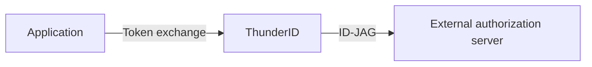
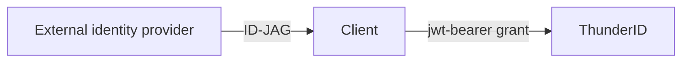

# Identity Assertion Authorization Grant (ID-JAG)

The **Identity Assertion Authorization Grant (ID-JAG)**, defined by the IETF draft [`draft-ietf-oauth-identity-assertion-authz-grant`](https://datatracker.ietf.org/doc/draft-ietf-oauth-identity-assertion-authz-grant/), is a JWT that carries a user's identity from an identity provider to another authorization server, so the second server can issue an access token without its own sign-in step. When used with the Model Context Protocol, this pattern is called **Enterprise-Managed Authorization (EMA)**; see the [EMA extension](https://modelcontextprotocol.io/extensions/auth/enterprise-managed-authorization) and [Enterprise-Managed Authorization for MCP](../../../../use-cases/ai-agents/mcp-authorization/enterprise-managed-authorization).

## Two Roles

<ProductName /> plays both roles in the ID-JAG exchange.

**<ProductName /> issues ID-JAGs** for your applications to present to an external authorization server:

**<ProductName /> accepts ID-JAGs** minted by an external identity provider:

- To issue ID-JAGs from your own applications, see [Issue Identity Assertions](./issue-identity-assertions).
- To accept ID-JAGs from an external identity provider, see [Accept Identity Assertions](./accept-identity-assertions).

## Notes

No ID-JAG discovery metadata is advertised in well-known documents; only the two grant URNs appear in `grant_types_supported`. Configuration, including trusted issuers and allowed audiences, is exchanged out of band. Scope semantics differ per leg: issuance passes the requested scope through verbatim, while acceptance intersects it with the assertion's own scope. Neither leg issues a refresh token.

## Related Guides

- [Issue Identity Assertions](./issue-identity-assertions)
- [Accept Identity Assertions](./accept-identity-assertions)
- [Enterprise-Managed Authorization for MCP](../../../../use-cases/ai-agents/mcp-authorization/enterprise-managed-authorization)
- [Token Exchange](../token-exchange)
