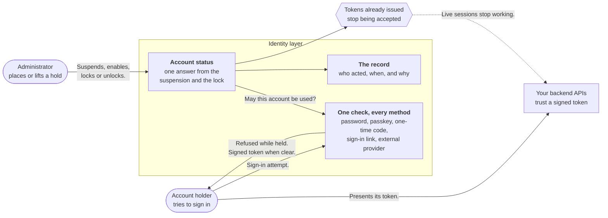

# Take Away Access Without Deleting the Account

A dispatcher at a logistics company hands in her notice on a Friday. By Monday her laptop is back in
the office, but her account still opens the dispatch console, the **passkey** on her personal phone
still signs her in, and a report she scheduled last month is still calling the delivery API with a
token issued the week before. To the company, she left on Friday. To the system, nothing has changed.

Getting that right means answering four questions every time someone tries to use an account:

- May this account be used at all?
- If not, is that permanent, or does it lift on its own?
- What happens to the access it was already granted?
- Who decided this, and when?

Handling those questions is what it takes to take access away safely, and the sign-in screen is only
the first place they show up.

## The Problem

The obvious answers are to delete the account or change its password. Both fall apart quickly, and the
same challenges surface whatever you are running:

- **Offboarding has to be reversible.** People come back from leave, contracts get extended, and
  offboardings get reversed. Deleting the account destroys its group memberships and its history,
  including the record that proves access was removed.
- **A password is one door out of several.** The same account may also have a passkey, a credential
  held by the device and unlocked with a fingerprint or a PIN, along with a one-time code sent to a
  phone, a sign-in link sent to an email address, or a login through an external provider. Resetting a
  password leaves the rest open.
- **Access already granted keeps working.** Signing in produces a **token**, a signed piece of data
  proving who a request comes from and what it may do. It stays valid until it expires, so blocking
  sign-in on its own leaves a live session running for minutes or hours.
- **Some holds are meant to be temporary.** Someone calls to say a colleague may know their password.
  That needs a hold lasting until the credential is reset, or one that lifts by itself, not a permanent
  decision made under time pressure.
- **Someone will ask who did it.** An auditor, a manager, or the account holder. Without a record, the
  answer is whoever remembers.
- **Reversing one hold must not reverse another.** An account can be both offboarded and temporarily
  held. Clearing the temporary one must not quietly bring a departed employee back.

## How It Works

Solving this puts the decision in one place. The identity layer keeps a **status** for every account
and checks it at the start of every sign-in, before any credential is examined. The status is not a
single flag, because two different things bar an account and they behave differently.

A **suspension** is an administrative decision. It lasts until someone with the authority to lift it
does so, and nothing else clears it, so an offboarding cannot quietly expire. A **lock** is temporary
protection. It carries a reason and, usually, a time at which it stops applying, so a hold placed
during an incident lifts itself once that time passes, with no cleanup job to run and nobody having to
remember to come back to it.

Both can apply at once, and the identity layer resolves them into one answer, so the sign-in path never
reasons about combinations. Two rules make that answer predictable: the status reports the suspension,
as the broader of the two, and lifting either hold never lifts the other.

The check sits where every sign-in method converges, which buys two things. A held account is refused
whichever route it tries, so holding an account that has both a passkey and a password stops both. And
a method added later is covered by default, rather than depending on whoever adds it knowing this
behaviour exists. Because the check runs before the credential is examined, a refused attempt does no
credential work at all, so a held account cannot be used to find out whether a guessed password was
right.

Alongside that answer, placing a hold invalidates the tokens the account was already issued. The
scheduled report running under the dispatcher's account stops being accepted on its next call, rather
than at the end of that token's lifetime. Without this step a hold is advisory: the front door is
locked while a key is still turning in the side one. Lifting a hold does not bring those tokens back;
the account signs in again and receives fresh ones.

:::tip Not Your Pattern?
- If you need to control what a signed-in user is allowed to do rather than whether they may sign in at
  all, see [Roles](../../../guides/users/manage-roles).
- If the account belongs to an autonomous agent rather than a person, see
  [Identity for AI Agents](../../ai-agents/overview).
:::

## What This Gives You

An account can be taken out of use permanently or for the next ten minutes, refused whichever way its
holder tries to sign in, with the access it already held cut off, and a record of who decided what that
outlasts the person who decided it. The account itself survives, so the same decision can be reversed
without rebuilding anything.

Two choices are worth making deliberately rather than by default. Whether a refused sign-in tells the
holder that their account is held, which is friendlier but confirms to anyone asking that the account
exists. And whether repeated failed sign-ins should place a lock automatically, which is worth having
only alongside limits on how fast attempts can arrive, since otherwise anyone who knows an account
identifier can bar that account.

For the accounts themselves, their types, and the roles that decide what each one may do, see
[Users](../../../guides/users/manage-users).
