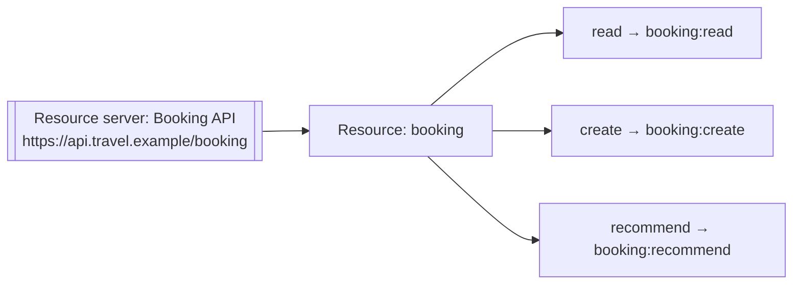

# Nothing Limits What the Agent May Do

An agent that can prove who it is can ask for a token. Nothing yet decides what that token may reach, so it
carries the same authority into every call the agent makes. Narrowing that starts with describing the API the
agent calls, so <ProductName /> can decide what each token is allowed to reach.

## Resources and Permissions

The tools your agent calls sit behind an API, and that API is what decides whether a given call is allowed. You
describe it to <ProductName /> as a **resource server**: one entry per backend, identified by a URI that
becomes the audience of every token issued for it.

Inside that resource server, a **resource** names something the API deals with, and each **action** on that
resource generates a **permission**. A permission is the string `{resource-handle}:{action-handle}`, which a
token carries and the API checks. Permission strings are not prefixed by the resource server, because the
resource server is already identified by its own URI.

So a booking API with one `booking` resource and three actions generates three permissions:



A larger API nests resources, which extends the permission into a longer chain, and the separator is the
resource server's `delimiter`. See [Manage Resource Servers](../../../guides/resource-servers) for both cases.

## Roles

A permission grants nothing until something holds it. A **role** bundles permissions under one name, and the
name is what gets assigned. <ProductName /> assigns a role to an agent the same way it assigns one to a person.
An agent's authority is therefore described in the same terms as everyone else's.

The playground's Concierge holds one role, `Recommender`, carrying `booking:read` and `booking:recommend`. That
role is the reason the agent can suggest a flight and cannot book one. Booking is a separate permission, and no
role the Concierge holds grants it.

See [Authorization](../../../key-concepts/authorization) for how permissions and roles fit together, and
[Groups and roles](../../../guides/agents/manage-agents#groups-and-roles) for assigning one to an agent.

## Binding a Token to an API

A role decides what an agent may do. The token request decides which API it may do it against.

When the agent asks for a token, it names the API it wants the token for, using a `resource` parameter
([RFC 8707](https://datatracker.ietf.org/doc/html/rfc8707)). <ProductName /> then confines the token's audience
and scopes to that one resource server. A token minted for the booking API is refused by every other API that
checks its audience, which is what makes the `resource` parameter worth sending whenever an agent reaches more
than one backend. A request naming neither a scope nor a resource is not bound to a resource server at all. Its
audience falls back to the agent's default audience, or to its client ID when no default is set. One request
names one API: asking for two resources at once is refused with `invalid_target`, so an agent that reaches
several backends asks for a token per backend.

The scopes the agent receives are the intersection of three things: what the request asked for, what the target
resource server defines, and what the agent holds through its roles. A requested scope outside that
intersection is dropped from the issued token rather than refused, so the `scope` claim is what tells you what
the token carries.

See [Agent Token](../../../guides/agents/authentication/agent-own-token) for the token request, and
[Choose what the agent token carries](../../../guides/agents/authentication/agent-own-token#choose-what-the-agent-token-carries)
for selecting attributes and the validity period.

## See the Tokens

Open the **Acts as itself** tab in the playground. The Concierge authenticates with its own credentials and
asks for a token bound to the booking API, with no customer involved anywhere in the exchange.

```json
{
  "sub": "agent-identity-concierge",
  "iss": "https://localhost:8090",
  "aud": "https://api.travel.example/booking",
  "scope": "booking:read booking:recommend",
  "client_id": "agent-identity-concierge-id",
  "grant_type": "client_credentials",
  "exp": 1893456000,
  "iat": 1893452400
}
```

Four claims carry the whole result. `sub` is the agent itself, identified by its resource ID, while
`client_id` is the OAuth client that authenticated. `aud` is the booking API rather than the agent, because the
request named a `resource`. `scope` is the two permissions the `Recommender` role grants and nothing more,
which is what stops this token from booking anything.

There is no `act` claim at all. That claim names the party an agent is acting for, and here the agent is acting
for nobody. See [Claims in the agent token](../../../guides/agents/authentication/agent-own-token#claims-in-the-agent-token)
for the full set, including the schema attributes and role claims you can add.
