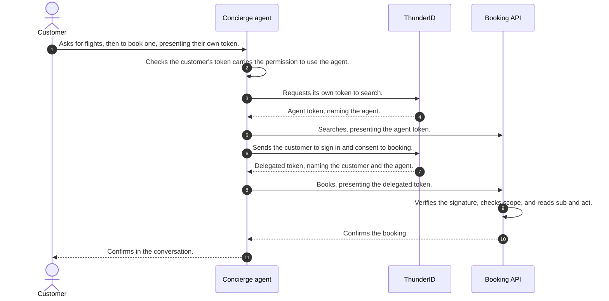

# How It All Runs

Each of those problems was solved on its own. Together they carry a single request from a customer asking for
something to an authorized API call, with what each principal may do settled outside the agent and enforced
wherever its token is presented.

Here is one request passing through all of them.

## The Tokens

The agent obtains two tokens during that request, on top of the one the customer arrived with. They differ in
exactly one respect: who they name.

| Token | `sub` | `act` | Obtained by |
| --- | --- | --- | --- |
| Agent token | the agent | absent | the client credentials grant |
| Delegated token | the customer | the agent | signing the customer in, or backchannel approval |

Both are signed JWTs bound to a single API through their audience, and each carries a scope no wider than
what the principal it names already held.

## What You Have Solved

- Every agent has its own identity, so a call traces back to one entry in your inventory.
- Its credential can be rotated, replaced with a signed assertion, or bound to a key it alone holds.
- What it may reach is described outside the agent and enforced when the token is issued and when it is used.
- Work it does for a person names both of them, whether that person approved in a browser or on their phone.
- Your own endpoint decides who may call the agent in the first place.

None of your code works out what a principal is allowed to do. That is settled when the token is issued, from
roles you defined in one place. What your code does is read the token it was handed and enforce the permissions
inside it, which is the one part that has to happen where the request lands.

## Where to Go Next

[See It in a Sample App](../try-it-out) runs these journeys inside the Wayfinder application, with a chat
widget, a consent screen, and a real booking. For the reasoning behind the defaults, and what to choose when
your constraints differ, see [Design Decisions & Alternatives](../architecture-decisions).
