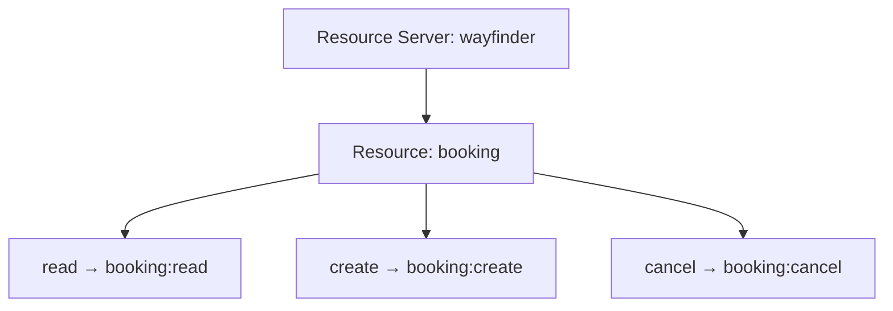
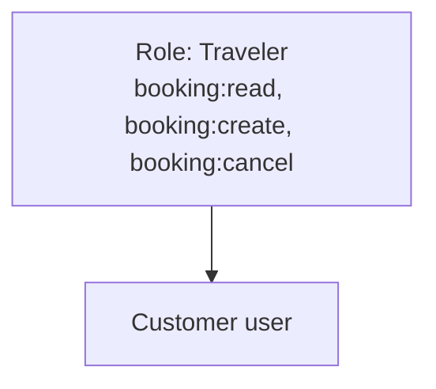
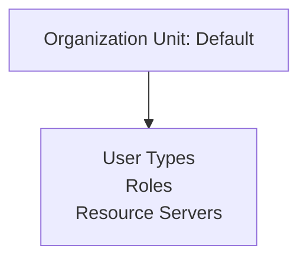

# Define Access

A user can exist now, but nothing says what they may do. This page describes Wayfinder's booking API, turns its actions into permissions, groups those into a role, and grants that role to a user.

## Resources and Permissions

A customer can exist now, but the record says nothing about what they're allowed to do. Wayfinder's backend
has to decide, on each request, whether the caller may do what they're asking, and for that <ProductName /> needs a
way to describe the backend and the actions it exposes.

A **resource server** represents the APIs of a single backend, here, Wayfinder's booking API. Inside it, a **resource**
names a noun the API deals with: a `booking`.

That resource defines the **actions**, the verbs that can be performed on it: read, create, cancel. For every
action, <ProductName /> automatically generates a **permission**: a short string of the form `<resource>:<action>`
that a token can carry and the booking API can check.

So the booking resource and its three actions generate three permissions:



A larger API can nest resources, extending the permission into a longer chain; a single flat resource is enough for
most consumer APIs. See [Resource Servers](../../../guides/resource-servers) for the nested case.

Get a management API token, then create the resource server and its actions:

<Stepper stepNode="h3" as="h3">

### Get a management API token

The steps on this page call the Resource and Role Management APIs, which require an access token with the `system` scope. Obtain one for an administrator and export it so every request below can reuse it:

```bash
export TOKEN="<access-token>"
```

### Create the `wayfinder` resource server

Resource servers are managed through the Resource Management API. Create the `wayfinder` resource server. Replace `<default-ou-id>` with the ID of your default organization unit (look it up via `GET /organization-units`):

```bash
curl -k -X POST https://localhost:8090/resource-servers \
  -H "Authorization: Bearer $TOKEN" \
  -H "Content-Type: application/json" \
  -d '{
    "name": "Wayfinder Booking",
    "identifier": "https://api.wayfinder.example.com",
    "ouId": "<default-ou-id>",
    "delimiter": ":"
  }'
```

The response includes the resource server's `id`, referred to below as `<wayfinder-rs-id>`.

### Add the `booking` resource

Add the `booking` resource under the resource server. Its `handle` becomes the first half of each permission string:

```bash
curl -k -X POST https://localhost:8090/resource-servers/<wayfinder-rs-id>/resources \
  -H "Authorization: Bearer $TOKEN" \
  -H "Content-Type: application/json" \
  -d '{ "name": "Booking", "handle": "booking" }'
```

The response includes the resource's `id`, referred to below as `<booking-resource-id>`.

### Add the `read`, `create`, and `cancel` actions

Add the three actions under the `booking` resource. Each action's `handle` becomes the second half of its permission string:

```bash
for action in "Read:read" "Create:create" "Cancel:cancel"; do
  curl -k -X POST https://localhost:8090/resource-servers/<wayfinder-rs-id>/resources/<booking-resource-id>/actions \
    -H "Authorization: Bearer $TOKEN" \
    -H "Content-Type: application/json" \
    -d "{ \"name\": \"${action%%:*}\", \"handle\": \"${action##*:}\" }"
done
```

This generates three permissions: `booking:read`, `booking:create`, and `booking:cancel`.

See [Resource Servers](../../../guides/resource-servers).

</Stepper>

## Roles

A permission is just a string until it is attached to a person, and attaching the booking permissions one at a time,
to every customer who ever signs up, does not scale. A **role** solves that: it groups a set of permissions under one
name, and the name is what gets assigned to a user. A user's effective permissions are the combined set across every
role assigned to them.

Wayfinder needs one `Traveler` role carrying all three `booking:*` permissions, assigned automatically the
moment someone signs up, so every customer can read, create, and cancel their own bookings from their first session.
Staff get their own, narrower roles instead, such as `Support` for consumer support or `OpsAdmin` for inviting new
staff, so running the product never grants a customer's booking access and vice versa.



See [Authorization](../../../key-concepts/authorization).

Create the `Traveler` role and assign it to John Doe so he can book from his first session:

<Stepper stepNode="h3" as="h3">

### Create the `Traveler` role

Roles and their permissions are managed through the Role Management API. Create the role with the three `booking:*` permissions in one call. Replace `<default-ou-id>` with the ID of your default organization unit (look it up via `GET /organization-units`) and `<wayfinder-rs-id>` with the ID returned when you created the `wayfinder` resource server.

```bash
curl -k -X POST https://localhost:8090/roles \
  -H "Authorization: Bearer $TOKEN" \
  -H "Content-Type: application/json" \
  -d '{
    "name": "Traveler",
    "description": "Consumer role with full booking permissions",
    "ouId": "<default-ou-id>",
    "permissions": [
      {
        "resourceServerId": "<wayfinder-rs-id>",
        "permissions": ["booking:read", "booking:create", "booking:cancel"]
      }
    ]
  }'
```

See [Authorization](../../../key-concepts/authorization).

### Assign the Traveler role

Navigate to **Roles** → open the `Traveler` role → **Assignments** tab. Click **Add** and select John to assign the role.

See [Manage Users](../../../guides/users/manage-users).

</Stepper>

## Organization Unit

Wayfinder's user types, roles, and resource server all live in a container called an organization unit, which
lets <ProductName /> keep separate businesses side by side without their configuration ever mixing.



Wayfinder is a single business, so it uses the `Default` organization unit that every fresh instance provides
and creates no others. If your product instead spans multiple separate organizations that each need their own users,
roles, and configuration, see [Multi-Tenant SaaS Identity](../../b2b/multi-tenant-saas) for a detailed solution.
