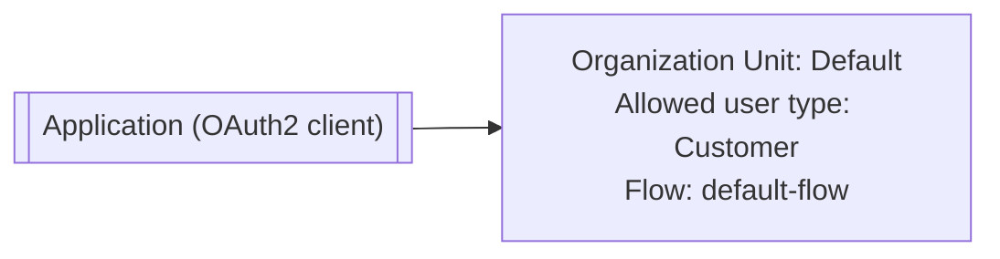

# Register the Application

A flow describes a journey, but something has to start it and receive the token it produces. That something is an
**application**: Wayfinder's own web frontend, registered with <ProductName /> as an
[OAuth2 client](../../../guides/protocols/oauth-oidc). In OAuth2 terms, "client" means the application
requesting access, not the customer using it. The customer is the user on whose behalf the application makes that
request.

Registering the booking frontend gives it credentials and the rules <ProductName /> enforces on its behalf:

- Which [grant type](../../../guides/protocols/oauth-oidc#grant-types) it may use, the specific exchange it
  goes through to get a token.
- Whether it must prove it started the sign-in itself, via [PKCE](../../../guides/protocols/oauth-oidc/pkce), a
  check that stops a stolen authorization code from being redeemed by anyone else.
- Which URLs a customer may be sent back to after signing in.
- Which user types can sign up through it, so the customer-facing app onboards `Customer` users
  and not `Staff`.
- Which flow runs for each journey it offers, from the bundled `default-flow` to the ones you build.

Wayfinder's browser frontend would typically be registered using the authorization code grant with PKCE
required, restricted to the `Customer` user type, and pointed at `default-flow` to start, swapped for the
registration, recovery, and sign-in journeys as you build them.

See [Manage Applications](../../../guides/applications/manage-applications).

:::note Connecting your own app
The steps below register the sample's frontend through the Console. Your own app registers the same way. What differs is the app's own code: instead of hand-writing the OAuth2 exchange, it talks to <ProductName /> through an [SDK](../../../getting-started/connect-your-application/react), with quickstarts for the common web, mobile, and backend frameworks.
:::

Register Wayfinder's frontend and point it at the flows you built:

<Stepper stepNode="h2" as="h2">

## Register the `WAYFINDER` application

Navigate to **Applications** → **Add Application** and choose **Browser App** as the type. Configure:

| Setting             | Value                     |
| ------------------- | ------------------------- |
| Redirect URI        | `{{WayFinderSampleUrl}}`        |
| Allowed grants      | `authorization_code`      |
| PKCE                | Required                  |
| Allowed user types  | `Customer`                |

See [Manage Applications](../../../guides/applications/manage-applications).

## Point it at your flows

In **Applications** → **WAYFINDER** → **Flows**, select the registration flow you built from the **Registration Flow** dropdown and the recovery flow from the **Recovery Flow** dropdown, then save the application.

See [Manage Applications](../../../guides/applications/manage-applications).

</Stepper>
